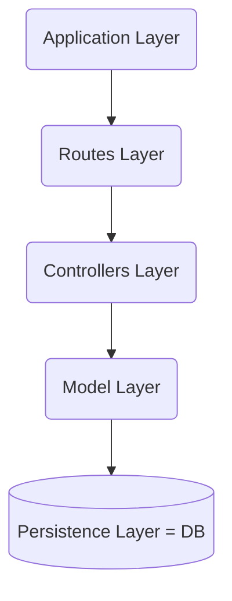

### REST란

REST(REpresentational State Transfer)는 웹 서비스에 설계에 대한 아키텍처 접근 방식으로  2000년 **Roy Fielding**에 의해 제안

> 하이퍼미디어를 기반으로 분산 시스템 구축을 위한 아키텍처 스타일 - Roy Thomas Fielding 

일반적으로 HTTP를 애플리케이션 프로토콜로 사용하지만, 반드시 HTTP를 사용할 필요는 없다

> REST는 전체적으로 적용될 때 구성 요소 상호 작용의 확장성, 인터페이스의 일반성, 구성 요소의 독립적 배포 및 중간 구성 요소를 강조하여 상호 작용 대기 시간을 줄이고 보안을 강화하며 레거시 시스템을 캡슐화하는 일련의 아키텍처 제약 조건을 제공 합니다 - Roy Thomas Fielding


## REST API 6가지 제약 조건

1. **상태 비저장(Stateless)**: 서버는 요청을 이해하는 데 필요한 모든 정보를 포함해야 한다. 각 요청은 독립적이어야 하며, 서버에 저장된 컨텍스트를 활용할 수 없다
   1. 가시성 향상 - 서버는 요청 데이터 이외에 볼 데이터가 없음
   2. 신뢰성 향상 - 부분적 실패로부터 복구 작업 용이
   3. 확장성 향상 - 요청 간 상태 저장이 없으므로 서버 구성 요소가 리소스를 신속하게 해제
   4. 구현 단순화 - 서버가 요청 전체에서 리소스 사용량을 관리할 필요가 없음
2. **클라이언트 서버(Client-Server)**: 클라이언트와 서버를 분리하여 사용자 인터페이스 문제와 데이터 저장 문제를 분리. 사용자 인터페이스(클라이언트)의 이식성 향상과 서버를 단순화하고 확장성 향상
3. **통일된 인터페이스(Uniform Interface)**: 클라이언트는 표준화된 메서드와 응답 형식을 사용하여 상호작용한다
   1. 리소스 중심 설계(Resource-based): 리소스는 해당 리소스를 기반으로 고유하게 식별되는 URI를 가진다
   2. 표현을 통한 리소스 조작(Manipulation of Resources Through Representations): 
   3. 자기 설명 메시지(Self-descriptive Messages): 각 메시지는 메시지를 처리 방법에 대한 충분한 정보를 포함해야 한다
   4. 애플리케이션 상태 엔진으로서의 하이퍼미디어(Hypermedia as the Engine of Application State; HATEOAS): 클라이언트는 본문, 쿼리 문자열, 요청 헤더, 요청 URI를 통해 상태를 전달하고, 서비스는 본문, 응답 코드 및 응답 헤더를 통해 클라이언트에게 상태를 전달
4. **캐시 가능성(Cacheable)**: 요청에 대한 응답 데이터 내에 캐싱이 가능한지 불가능한지에 대해 암시적 또는 명시적으로 라벨을 지정. 클라이언트는 캐싱 가능한 응답에 대해 캐싱 이후의 동일한 요청에 대해 응답을 재사용 가능. 응답을 캐싱하여 성능을 향상시키고 네트워크 트래픽을 줄일 수 있다
5. **계층화된 시스템(Layered System)**: 각 구성 요소는 상호 작용하는 인접 계층만 볼 수 있고 너머를 볼 수 없도록 동작을 제한. 시스템에 대한 지식을 단일 레이어로 제한하여 전체 시스템 복잡성에 한계를 둔다.
6. **선택적 제약 - 주문형 코드(Code-On-Demand)**: 자바스크립트와 같이 코드를 다운로드하고 실행하여 클라이언트 기능을 확장. 


## REST 데이터 요소

| 데이터 요소                              | 모던 웹에서의 예시                                      |
| ---------------------------------------- | ------------------------------------------------------- |
| 자원(resource)                           | the intended conceptual target of a hypertext reference |
| 자원 식별자(resource identifier)         | URL, URN                                                |
| 표현(representation)                     | HTML document, JPEG image                               |
| 표현 메타데이터(representation metadata) | media type, last-modified time                          |
| 자원 메타데이터(resource metadata)       | source link, alternates, vary                           |
| 제어 데이터(control data)                | if-modified-since, cache-control                        |

자원: 정보에 대한 추상화. 이름을 지정할 수 있는 모든 정보는 리소스가 될 수 있다. 하이퍼 텍스트의 참조 대상이 될 수 있는 모든 개념

자원 식별자: 구성 요소 간의 상호 작용과 관련된 특정 리소스를 식별

표현: 표현을 사용하여 리소스의 현재 또는 의도된 상태를 캡처하여 해당 표현을 구성 요소 간에 전송함으로써 리소스에 대한 작업을 수행. 표현은 데이터, 데이터를 설명하는 메타데이터 및 경우에 따라 메타데이터를 설명하는 메타데이터로 구성

제어 데이터: 요청되는 작업이나 응답의 의미와 같이 구성 요소 간의 메시지 목적을 정의


## 합리적인 URI 설계

- 특정 리소스에 접근하기 위해 쿼리 스트링 대신 식별자를 사용
  - ❌ `/posts?id=123`
  - ✅ `/posts/123`
- URI에는 동사 대신 리소스를 표현하는 명사를 사용하고 http method를 사용하여 동작을 표현
  - ❌ `POST /update-post/123`
  - ✅ `PATCH posts/213`
- 일반적으로 컬렉션을 참조하는 URI에는 복수 명사를 사용한다
  - ❌ `/post/123` 
  - ✅ `/posts/123`
- URI에는 대문자보다는 소문자를 사용하고 하이픈(-)을 사용하여 단어를 구분
  - ❌ `/UserProfile` 
  - ✅ `/user-profile`
- URI의 마지막에는 슬래시(/)를 포함하지 않습니다
  - ❌ `/posts/`
  - ✅ `/posts`

- 컬렉션 표현을 그대로 사용할 필요는 없습니다. 더 적합한 표현을 사용하세요
  -   ❌ customer_list 리소스를 사용할 때 `/customer_list` 
  -   ✅ `/customers`
- 파일 확장자는 URI에 포함하지 않습니다. Accept 헤더를 사용하여 미디어 형식을 지정할 수 있습니다
  - ❌ `/posts/3/image.jpg`
  - ✅ `/posts/3/image Accept: image/jpg`


모든 게시글: `/posts`

id가 "3"인 게시글: `/posts/3`

id가 "123"인 사용자가 작성한 모든 게시글: `/users/123/posts` 

> [!WARNING]
>
> *collection/item/collection*보다 복잡한 수준의 URI 사용을 피하기


## HTTP Status Code

- 1xx: 정보 응답
- 2xx: 성공 응답
- 3xx: 리디렉션 메시지
- 4xx: 클라이언트 오류
- 5xx: 서버 오류


가장 많이 사용되는 상태 코드 10가지

- 200 OK: 일반적인 응답 성공
- 201 생성됨: 성공적으로 리소스 생성
- 204 콘텐츠 없음: 요청이 성공했지만 응답 본문이 비어 있음
- 400 잘못된 요청: 요청 이행 시 데이터 유효성 검사, 데이터 누락 등의 오류 발생
- 401 승인되지 않음: 유효하지 않는 인증 토큰, 액세스 권한이 없음
- 403 금지됨: 사용자에게 작업을 수행할 권한이 없거나 리소스를 사용할 수 없는 경우
- 404 찾을 수 없음: 요청한 리소스가 존재하지 않거나 숨겨졌을 때
- 405 메서드가 허용되지 않음: 요청한 URL이 존재하지만 요청한 HTTP 메서드를 사용할 수 없음
- 409 충돌: 요청을 이행하는 중 리소스 충돌이 발생
- 500 내부 서버 오류: 클라이언트가 해결할 수 없는 서버 측 예외 오류


## HTTP METHOD

멱등성: 서버에 보낸 동일한 요청이 한 번 보낼 때와 여러 번 보낼 때가 같은 효과를 만들 때 멱등성을 가진다

안전성: 리소스를 변경하지 않는 메서드는 안전성을 가진다

| Method  | Request body / Response body | Safe | Idempotent |
| ------- | ---------------------------- | ---- | ---------- |
| CONNECT | No / Yes                     | No   | No         |
| DELETE  | May / May                    | No   | **Yes**    |
| GET     | No / Yes                     | Yes  | **Yes**    |
| HEAD    | No / No                      | Yes  | **Yes**    |
| OPTIONS | No / Yes                     | Yes  | **Yes**    |
| PATCH   | Yes / Yes                    | No   | No         |
| POST    | Yes / Yes                    | No   | No         |
| PUT     | Yes / No                     | No   | **Yes**    |
| TRACE   | No / Yes                     | Yes  | **Yes**    |

### GET

지정된 URI에 대한 리소스 표현을 검색

- 성공적인 리소스 검색: `200(정상)`
  - ex. 성공적으로 리소스를 찾았을 때
- 요청은 이행되었지만 포함할 응답이 없는 경우: `204(콘텐츠 없음)`
  - ex. 특정 조건에 대한 리소스를 검색했지만 해당하는 리소스가 없을 때
- 리소스를 찾을 수 없는 경우: `404(찾을 수 없음)`


### POST

지정된 URI에 대한 리소스 생성(실제로 리소스를 생성하지 않는 작업을 트리거하는 데도 사용될 수 있다). 

새 리소스를 컬렉션에 포함하고 URI를 할당. 

새로운 리소스의 URI를 응답의 `Location` 헤더에 포함하고 리소스 표현을 본문에 포함

- 성공적인 리소스 생성: `201(생성됨)` 
- 리소스를 생성했지만 반환할 결과가 없는 경우: `204(콘텐츠 없음)`
- 클라이언트가 잘못된 요청 데이터를 입력: `400(잘못된 요청)`
  - form 입력 값 검증 실패 - > 오류에 대한 정보나 링크를 응답 본문에 포함하여 제공
- 리소스가 이미 존재하는 경우: `409(충돌)`


### PUT

지정된 URI에 대한 리소스를 생성 또는 대체. 클라이언트는 리소스에 대한 URI를 지정하고 요청 본문에 리소스의 완전한 표현을 포함. URI에 해당하는 리소스가 이미 존재하는 경우 대체한다. 해당하는 리소스가 없는 경우 서버가 지원한다면 새로운 리소스를 생성할 수 있다. 여러 리소스에 대해 일괄 업데이트를 수행하는 작업을 구현할 수 있다


- 성공적인 리소스 생성: `201(생성됨)`
- 기존 리소스 업데이트: `200(정상)` 
- 리소스 생성 또는 업데이트에 성공했지만 반환할 결과가 없는 경우: `204(콘텐츠 없음)`
- 리소스를 찾을 수 없는 경우: `404(찾을 수 없음)`
- 기존 리소스 업데이트 실패: `409(충돌)`


### PATCH

`PATCH`: 지정된 URI에 대한 리소스 부분 수정. 클라이언트는 리소스에 대한 URI를 지정하고 요청 본문에는 리소스에 대한 변경 사항의 집합을 포함. 전체 표현을 제출하는 PUT과 다르게 변경 사항만 제출

- 성공적인 리소스 수정: `200(정상)`
- 리소스 생성 또는 업데이트에 성공했지만 반환할 결과가 없는 경우: `204(콘텐츠 없음)`
- 지원하지 않은 패치 문서 형식: `415(지원되지 않는 미디어 유형)`
- 잘못된 패치 문서: `400(잘못된 요청)`
- 리소스를 찾을 수 없는 경우: `404(찾을 수 없음)`
- 패치 문서는 유효하지만 변경 사항을 적용할 수 없음: `409(충돌)`

https://datatracker.ietf.org/doc/html/rfc5789


**패치 문서 형식**

일반적으로 사용하는 JSON에서는 *JSON Merge Patch* 과 *JSON Patch*라는 두 가지 주요 패치 방식이 있다

- JSON Merge Patch: [RFC 7386](https://datatracker.ietf.org/doc/html/rfc7386)에 정의된 JSON 문서의 변경 사항을 나타내는 형식. 원래의 JSON 리소스 구조와 동일하고 변경되거나 추가될 필드만을 포함. null값을 사용하여 필드를 삭제할 수 있다. 명시적으로 null 값을 사용하지 않는 json 문서에서 수정 사항을 설명하기 적합하다. 미디어 유형은 `application/merge-patch+json`이다
  a 값을 "b" -> "z"로 변경하고 f를 제거하는 방법

  ```json
   {
       "a": "b",
       "c": {
           "d": "e",
           "f": "g"
       }
   }
  ```

  ```json
   {
       "a": "z",
       "c": {
           "d": "e",
           "f": "null"
       }
   }
  ```

  

- JSON Patch: [RFC 6902](https://datatracker.ietf.org/doc/html/rfc6902)에 정의된 JSON 문서의 변경 사항을 나타내는 형식. 변경 사항에 대한 작업을 명시적을 나열한다. 변경사항은 op(동작)과 path(경로), 값(value)로 이루어진다. 동작은 `add`, `remove`, `replace`, `move`, `copy`, `test`가 있다. 미디어 유형은 `application/json-patch+json`이다

  | 동작    | 설명                                                         |
  | ------- | ------------------------------------------------------------ |
  | add     | 대상 위치의 내용에 따라 달라진다. (배열의 인덱스) 배열의 지정된 인덱스에 새 값 삽입, (존재하지 않는 개체 지정) 새로운 개체 추가,(존재하는 개체 지정) 해당 개체의 값 대체 |
  | remove  | 대상 위치의 값 제거                                          |
  | replace | 대상 위치의 값을 새 값으로 대체                              |
  | move    | 지정된 위치의 값을 제거하고 대상 위치에 추가 (remove + add와 동일) |
  | copy    | 지정된 위치의 값을 대상 위치로 복사                          |
  | test    | 대상 위치의 값이 지정된 값과 같은지 테스트                   |

  ```json
   [
       { "op": "add", "path": "/a/b/c", "value": [ "foo", "bar" ] },
       { "op": "remove", "path": "/a/b/c" },
       { "op": "replace", "path": "/a/b/c", "value": 42 },
       { "op": "move", "from": "/a/b/c", "path": "/a/b/d" },
       { "op": "copy", "from": "/a/b/d", "path": "/a/b/e" },
       { "op": "test", "path": "/a/b/c", "value": "foo" }
  ]
  ```

  

### DELETE

지정된 URI에 대한 리소스 제거

- 성공적인 리소스 수정: `200(정상)`
- 리소스 제거에 성공했지만 반환할 결과가 없는 경우: `204(콘텐츠 없음)`
- 삭제해야 할 리소스가 존재하지 않음: `404(찾을 수 없음)`


| **리소스** | **POST**         | **GET**                          | **PUT**                  | **DELETE**           |
| :--------- | :--------------- | :------------------------------- | :----------------------- | :------------------- |
| /posts     | 새 게시글 만들기 | 모든 게시글 검색                 | 게시글 일괄 업데이트     | 모든 게시글 삭제     |
| /posts/1   | X                | id가 1인 게시글의 세부 정보 검색 | id가 1인 게시글 업데이트 | id가 1인 게시글 삭제 |


## 비동기 작업

작업이 오래 걸리는 경우 클라이언트가 응답을 받을 때까지 기다리는 것은 많은 지연 시간을 발생시키는 원인이 됩니다. 이 문제를 해결하기 위해 작업을 비동기 형태로 만들 수 있습니다. 요청이 수락되면 상태 엔트포인트를 응답으로 받고, 클라이언트는 상태 엔드포인트를 주기적으로 확인하여 상태를 모니터링할 수 있습니다

```http
HTTP/1.1 202 Accepted
Location: /api/v1/status/123
```

- `/api/v1/status/123`에 주기적으로 GET 요청을 보내 상태를 모니터링

```http
HTTP/1.1 200 OK
Content-Type: application/json

{
    "status":"progress",
    "link": { "rel":"cancel", "method":"delete", "href":"/api/v1/status/123" }
}
```


만약 비동기 작업이 새 리소스를 생성하는 경우 상태 엔드포인트에서는 작업이 완료된 후 `HTTP 상태 코드 303(기타 참조)`를 반환해야 합니다

```http
HTTP/1.1 303 See Other
Location: /api/v1/posts/123
```


## 대규모 바이너리 리소스를 위한 부분 응답 지원

대규모 바이너리 필드를 안전하게 전달하기 위해 청크 단위의 검색을 지원할 수 있습니다

### 리소스 정보 가져오기

HTTP HEAD 요청을 지원하여 리소스에 대한 설명을 제공하세요

이 HEAD 요청에 대한 응답은 빈 응답 본문과 함께 리소스를 설명하는 헤더만 제공합니다

```http
HEAD /posts/123?fields=image HTTP/1.1
```

```http
HTTP/1.1 200 OK
Accept-Ranges: bytes
Content-Type: image/jpeg
Content-Length: 3240
```

- Accept-Ranges: 부분 응답 지원을 클라이언트에게 알리기 위해 사용
- Content-Type: 리소스의 미디어 타입
- Content-Length: 리소스의 전체 크기


### 리소스 부분 요청

Range 헤더를 사용해 리소스에 대해서 부분 응답을 요청합니다

```http
GET /posts/123?fields=image HTTP/1.1
Range: bytes=0-1000
```

```http
HTTP/1.1 206 Partial Content

Accept-Ranges: bytes
Content-Type: image/jpeg
Content-Length: 1000
Content-Range: bytes 0-1000/3240

[...]
```


## HATEOAS

Hypermedia as the engine of application state의 약자로 애플리케이션 상태 엔진으로서의 하이퍼텍스트이다. 각 요청에 대한 응답에는 다른 상태로 이동하기 위해 필요한 모든 정보가 포함되어야 합니다. 이는 api 문서를 매번 찾아보지 않고도 api를 사용할 수 있도록 정보를 제공합니다. 일반적으로 `links`, `_links` 속성을 통해 링크 세트를 제공합니다. 이 링크 세트는 리소스의 상태에 따라 변경될 수 있습니다.  따라서 애플리케이션 상태에 따라 하이퍼미디어가 달라지는 HATEOAS의 의미를 가지고 있습니다


```json
{
    "id": 123,
    "title": "게시글 제목",
    "content": "게시글 내용",
    "author": "글쓴이",
    "created_at": "2024-04-21T12:00:00Z",
    "updated_at": "2024-04-21T13:00:00Z",
    "links": [
        {
            "rel": "self",
            "href": "https://api.example.com/posts/123"
        },
        {
            "rel": "edit",
            "href": "https://api.example.com/posts/123/edit",
            "action": "GET",
            "types": ["text/xml", "application/json"]
        },
        {
            "rel": "delete",
            "href": "https://api.example.com/posts/123/delete",
            "action": "DELETE",
            "types": ["text/xml", "application/json"]
        },
        {
            "rel": "comments",
            "href": "https://api.example.com/posts/123/comments",
            "action": "GET",
            "types": ["text/xml", "application/json"]
        }
    ]
}

```


## Self-descriptive

### Media Type

`Content-Type`헤더는 서버가 표현 형식을 클라이언트에게 알려줄 때 사용

서버가 해당 미디어 유형을 지원하지 않는 경우 `HTTP 상태 코드 415`를 반환

``` http
Content-Type: application/json;
```

`Accept`헤더는 클라이언트가 이해 가능한 컨텐츠 타입이 무엇인지 서버에게 알려줄 때 사용

서버가 해당 미디어 유형을 수락할 수 없는 경우 `HTTP 상태 코드 406`을 반환


### Link

Content-Type에서 적절한 타입을 지정해줄 수 없을 때, Link에서 rel="profile"을 사용하여 예제에 대한 링크를 제공

```http
Link: <https://api-documentation.org/docs/posts>; rel="profile"
```


## API Versioning

이미 API를 사용하고 있는 애플리케이션이 있을 때 API를 중단시키지 않고 API를 변경하기 위한 버전 관리

개발자는 자신의 일정에 따라 선택적으로 api 버전을 업그레이드하고, 이전 버전은 여전히 사용 가능

`api/v1` -> `api/v2` -> `api/v3`

버전이 달라도 가져오는 리소스는 동일하므로 버전에 따라 URI가 달라져서는 안됩니다

- `?version=2`와 같이 쿼리 스트링을 사용하여 버전을 관리할 수도 있습니다
- `ApiVersion: 2`와 같이 커스텀 헤더를 사용하여 버전을 관리할 수도 있습니다

## Pagination·Filter·Sort

데이터 목록을 보여줄 때는 모든 데이터를 한 번에 주지 않도록 페이지네이션을 사용해야 한다

매우 많은 수의 리소스 요청을 하지 못하도록 반환되는 항목수(limit)에 상한을 적용해야 한다.

해당 컬렉션에서 사용 가능한 총 리소스 수(total)를 응답에 포함

### offset based pagination

`page(offset)`와 `page_size(limit)`를 사용

```
/posts?offset=10&limit=10
```


### cursor based pagination

`cursor`와 `limit`를 사용

```
/posts?cursor=10&limit=10
```


### filtering 

- 리소스 필터링: `?filter=color:red` 빨간 색 속성을 가지는 리소스만 필터링

`?fields=name,price` name,price 필드만 반환하도록 필드 제한


### sorting

`?sort_by=price` 가격 순으로 리소스를 정렬


### default value

각각의 선택적 매개변수에 대해서 적절한 기본값을 지정

offset -> 0

limit -> 10

sort_by -> id

fields -> 모든 필드


## TLS 암호화

민감한 자격 증명은 `Authorization`와 같은 HTTP 헤더를 사용하여 전달

TLS 암호화를 통해 엔드투엔드 전송을 보호


## API rate limit


## Wire model vs storage model

### Wire model(와이어 모델)

서버 ↔ 클라이언트 통신 시에 사용하는 데이터 모델

: 이 용어는 일반적으로 네트워크 통신을 위해 데이터를 표현하는 모델을 가리킵니다. 데이터를 전송하기 위해 사용되는 프로토콜에 따라 데이터의 형식이 결정됩니다. 예를 들어, 웹 서비스에서는 JSON(JavaScript Object Notation)이나 XML(Extensible Markup Language) 형식으로 데이터를 전송하는 것이 일반적입니다. 이런 형식들은 데이터를 전송하는 데 사용되는 '와이어'나 네트워크 상에서의 통신을 위한 모델을 정의합니다.


### Storage model(스토리지 모델)

서버 ↔ 데이터베이스 통신 시에 사용하는 데이터 모델

이 용어는 데이터베이스에서 데이터를 저장하는 방식을 설명합니다. 데이터베이스 관리 시스템(DBMS)은 데이터를 디스크에 저장하고, 필요할 때 검색하고 조작하는 방법을 결정해야 합니다. 이러한 스토리지 모델은 데이터베이스 시스템의 성능, 안정성, 확장성 등에 영향을 미칩니다. 스토리지 모델에는 관계형 데이터베이스의 테이블, NoSQL 데이터베이스의 문서, 키-값 쌍, 그래프 등이 포함될 수 있습니다.


## 애플리케이션 아키텍처(Layered Architecture)




------

microsoft REST API 가이드 라인 https://github.com/Microsoft/api-guidelines

google API 디자인 가이드 https://cloud.google.com/apis/design


salesforce api 문서 https://developer.salesforce.com/docs/apis

x(구 twitter) api 문서 https://developer.twitter.com/en/docs/api-reference-index

wix의 rest api 문서 https://dev.wix.com/docs/rest

wordpress rest api 문서 https://developer.wordpress.com/docs/api/

strapi rest api 문서 https://docs.strapi.io/dev-docs/api/rest

cafe24 rest api 문서 https://developers.cafe24.com/docs/api/admin/

github rest api 문서 https://docs.github.com/en/rest

kakao rest api 문서 https://developers.kakao.com/docs/latest/ko/rest-api/getting-started

google api 개선 제안 https://google.aip.dev/