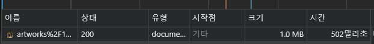
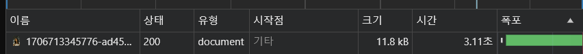
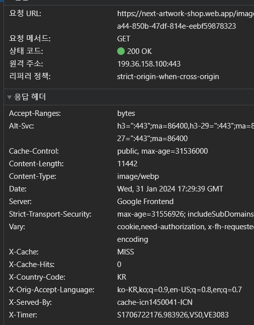
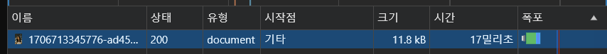
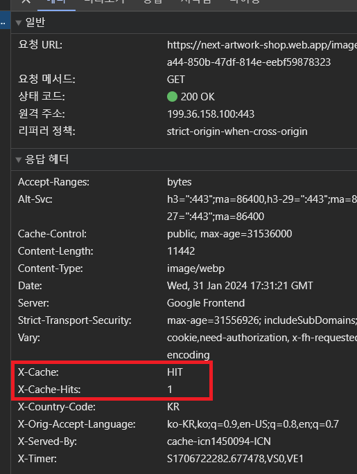

임시 디렉터리에 저장된 이미지의 200x200 썸네일을 만든 후 다시 Cloud Storage에 업로드하는 방법

https://firebase.google.com/docs/functions/gcp-storage-events?hl=ko&gen=2nd

`JPEG`, `PNG`, `WebP`, `GIF` `AVIF`, `TIFF` 형식을 지원하는 확장 

https://extensions.dev/extensions/firebase/storage-resize-images 


이미지 직접 불러왔을 때





```javascript
response.setHeader("Cache-Control", "public, max-age=31536000");
```


캐싱 Miss





캐싱 Hit




