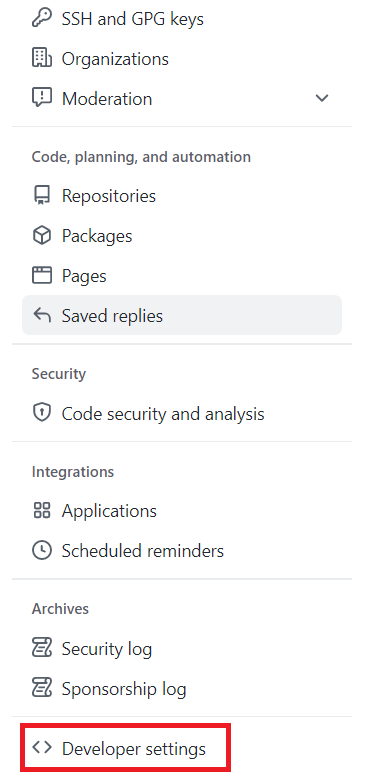
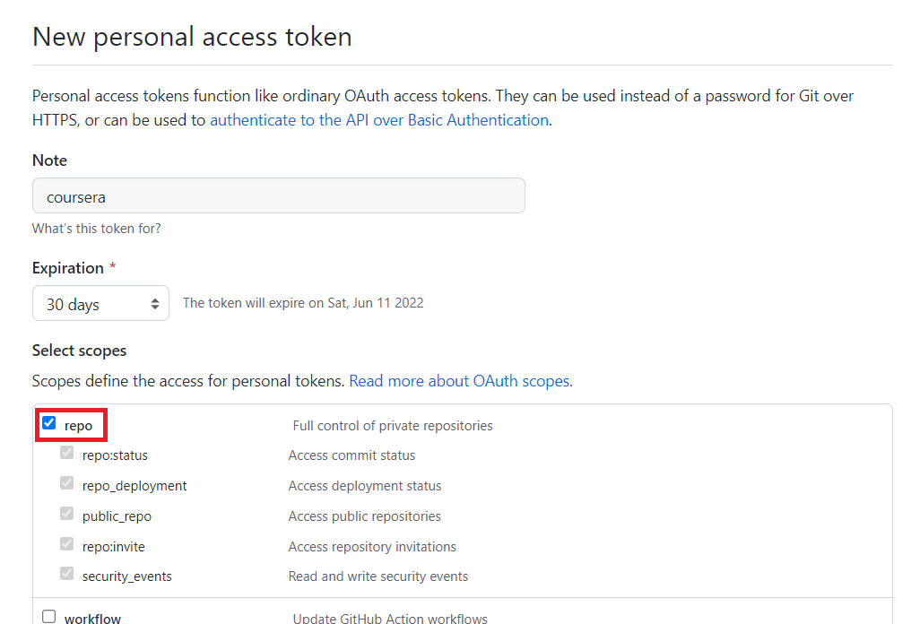
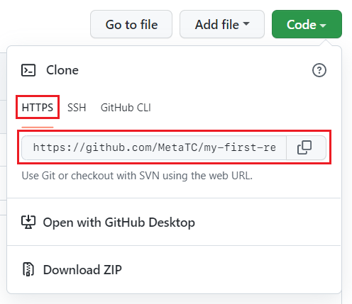

# Connecting to GitHub via HTTPS

When using Github via the Coursera platform, it is required to authenticate using a Personal Access Token over HTTPS. A Personal Access Token is a special password that you use instead of your actual account password. When you're finished using the token, you can revoke it so that it can no longer be used. It is also possible to set an expiry time for the token. This helps to keep your account secure.

### Generate a Personal Access Token

We now need to set up our Personal Access Token.

**Step 1:** Log in to Github

**Step 2:** Click on the profile icon in the top right of the screen and select Settings.

**Step 3:** On the Settings screen, on the left-hand side click Developer Settings.

**Step 4:** On the Developer Settings screen, click Personal Access Tokens and then click Generate Token.

**Step 5:** On the New Personal Access Token page, enter a token name and an expiry time. If you wish to manually revoke the token, set the expiry time to No Expiration.

**Step 6:** Under scopes, select repo.

**Step 7:** Scroll to the end of the page and click Generate token.

**Step 8:** The token is now generated. Make sure to copy and keep note of the token as it will be hidden when you leave the page. This token can now be used when connecting to a repository over HTTPS.

*Note: If you lose the token, you can delete the old token and create a new one.*

## Accessing Repositories

When accessing a repository and using HTTPS authentication, make sure to always use the HTTPS address of the repository.

