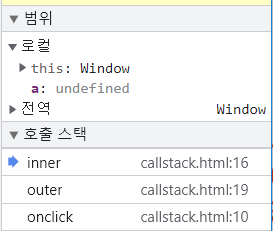

# ⚙ Javascript

## 프로그래밍 언어란

### 프로그래밍 언어 정의

* 프로그래밍 언어: 컴퓨터 프로그램을 작성하기 위한 언어
* 컴퓨터는 기계어만 이해할 수 있다

### 컴파일 언어 vs 인터프리터 언어

* 컴파일: 소스 코드 -> 기계어로 번역
* 컴파일러: 컴파일을 수행하는 소프트웨어
* 컴파일 언어: C, C++, Java, objective C 등
* 인터프리터 언어: 한 줄마다 기계어로 번역해서 실행하는 프로그래밍 언어
* 인터프리터: 프로그램을 번역해서 실행시키는 소프트웨어

### 프로그래밍 언어 유형

* 절차적 언어
* 객체 지향 언어
* 함수형 언어
* 논리형 언어


## 자바스크립트 특징

### 인터프리터 언어의 특징을 가지지만 컴파일 언어에 가깝다

1. 코드 작성 -> 트랜스 파일 -> 번들링 -> JS코드
2. JS 엔진이 JS 코드 파싱 -> 추상 구문 트리(AST)
3. AST -> 이진 바이트 코드로 변환 (JIT 컴파일러 작동) - **인터프리터 언어 특징**
4. JS 가상 머신이 프로그램을 실행

### 동적 프로토타입 기반 객체 지향 언어이다

* 프로토타입을 상속하는 프로토타입 기반 객체 지향 언어

### 동적 타입 언어이다

* 프로그램 실행 도중 변수에 저장되는 데이터 타입에 따라 타입이 동적으로 바뀌는 언어

### 함수가 일급 객체이다

* 자바스크립트의 함수는 객체이다
* 함수에 함수를 인자로 넘길 수도 있다
* 함수형 프로그래밍 가능

### 함수가 클로저를 정의한다

* 자바스크립트의 함수는 클로저(closure)를 정의
* 클로저를 통해 변수를 은닉하거나 영속성을 보장하는 등의 다양한 기능 구현

### 하위 호환성을 보장한다

- 오래된 웹사이트도 현재 아무 문제 없이 이용할 수 있다
- 아주 드물지 하위 호환성을 의도적으로 부수는 것이 훨씬 이득이 큰 경우 포기하기도 한다

### 다중 패러다임 언어이다

- 절차적 방식, 객체 지향적 방식, 함수형 방식 등으로 코드를 작성할 수 있다

## 자바스크립트의 기술적 요소

### ECMAScript(코어 언어)

### 클라이언트 측의 자바스크립트 고유 기술

웹브라우저의 주요 API

* Window 인터페이스 : 브라우저 및 창 조작
* DOM : HTML 문저 제어
* XMLHttpRequest : 서버와 비동기 통신

HTML5의 주요 API

* Drag and Drop : 드래그와 드롭으로 데이터 전달
* Blob : 이진 데이터 조작
* File : 로컬 파일 시스템 읽기 쓰기
* Web Workers : 여러 프로그램을 멀티 스레드 병렬 처리
* Web Storage : 데이터를 로컬에 저장
* indexed Database : 로컬에 키-값 타입의 관계형 데이터베이스 기능 제공
* WebSockets : 서버와 양방향 통신
* Geolocation : GPS 등의 위치 정보 기능
* Canvas : 2차원, 3차원의 그래픽스 기능

### 서버 측의 자바스크립트 고유 기술

* Node.js


## 이전 브라우저 지원하기

### 트랜스파일

- 명세서에 추가되었지만 구 엔진과 호환되지 않는 문법을 해결하기 위한 방법
- 최신 js 문법을 오래된 문법으로 변환하여 구 엔진에서 문제없이 동작하도록 한다
- `Babel`, `ESBuild` 등

### 폴리필

- 이전 브라우저에서 최신 기능을 제공하기 위해 직접 코드를 작성하여 지원하도록 하는 방법


## 구문(Statements)과 선언(declarations)은 다르다

### declarations

"binding identifiers to values"

> 아래와 같이 단일 문이 필요한 곳에서 사전적 선언은 불가능하다.

```javascript
if (condition) let i = 0; 
// Uncaught SyntaxError: Lexical declaration cannot appear in a single-statement context
```

```javascript
if (condition) var i = 0;
//It is possible;
```

### statements

"carrying out actions"

> 단일 문도 가능하지만, 보통 블록과 함께 사용할 수 있다.

```javascript
for (initialization; condition; afterthought)
  statement
```

```javascript
if (condition)
  statement1
else
  statement2
```

* `var`은 특이 케이스로 `statement`이다.

> 정상적인 어휘적 범위를 가지지 않는다. (전역 변수, 선언 블록 외부 호출 등)
>
> 변수 재선언 가능

### 구문과 선언의 구분

* Control flow
  * `return`
  * `break`
  * `continue`
  * `throw`
  * `if...else`
  * `swich`
  * `try...catch`
* Declaring variables
  * `var`
  * `let` -> **declarations**
  * `const` -> **declarations**
* Functions and classes
  * `function` -> **declarations**
  * `function*` -> **declarations**
  * `async function` -> **declarations**
  * `async function*` -> **declarations**
  * `class` -> **declarations**
* Iterations
  * `do...while`
  * `for`
  * `for...in`
  * `for...of`
  * `for awit...of`
  * `while`
* Others
  * `Empty`
  * `Block`
  * `Expression statement`
  * `debugger`
  * `export` -> **declarations**(모듈 최상단에서만)
  * `import` -> **declarations**(모듈 최상단에서만)
  * `label`
  * `with`


## ES6 모듈

*   모듈에서 외부로 내보내기

    ```javascript
    export const function_1(args) => {...}
    ```
*   모듈에서 하나만 내보내기

    ```javascript
    const function_2(args) => {...}
    export default function_2;
    ```
*   모듈에서 가져오기

    ```javascript
    import { function_1 } from './module';
    import { function_1 as func_1 } from './module';
    import function_2 from './module';
    ```

### 명령형 프로그래밍

하고자 하는 일에 대해 구문의 관점에서 연산을 설명하는 프로그래밍 방식

달성해야 할 명령에 대채 순차적으로 작성

### 선언적 프로그래밍

어떻게 결과가 나타나야 하는지를 설명하는 프로그래밍 방식

### 불변성

불변성을 위해 데이터의 변경이 필요하다면 복사본을 만들어 사용한다.

### 객체 불변성

* `Object.assign(target,...source)`는 객체를 복사하기 위해 사용되지만
* source값이 참조 값이면 참조 값이 복사되어 얕은 복사가 된다. 따라서 아래의 `obj3`처럼 복사해야 한다.

```javascript
let obj1 = { a: 0, b: { c: 0 } };
let obj2 = Object.assign({}, obj1);
let obj3 = JSON.parse(JSON.stringify(obj1));
obj1.a = 1;
obj1.b.c = 1;
console.log(JSON.stringify(obj1)); // {"a":1,"b":{"c":1}}
console.log(JSON.stringify(obj2)); // {"a":0,"b":{"c":1}}
console.log(JSON.stringify(obj3)); // {"a":0,"b":{"c":0}}
```

### 순수함수를 통한 객체 불변성

* 순수함수의 규칙
  1. 하나 이상의 파라미터를 가진다.
  2. 값이나 함수를 반환한다.
  3. 인자 또는 함수 외부의 변수를 변경하지 않는다.
  4. 입출력을 하지 않는다.

```javascript
const user = {
    name: "foo",
    age: 20,
    auth: {
        canRead: false,
        canWrite: false,
    },
};
const grantAuth = (user) => ({ㅓ
    ...user,
    auth: {
        canRead: true,
        canWrite: true,
    },
});
console.log(grantAuth(user));
console.log(user);
```

### 배열 불변성

```javascript
let arr = [0, 0, 0];
let arr2 = arr;
let arr3 = [...arr];
arr[0] = 1;
arr2[1] = 2;
arr3[2] = 3;
console.log(arr); // [1, 2, 0]
console.log(arr2); // [1, 2, 0]
console.log(arr3); // [0, 0, 3]
```

## 실행 컨텍스트

* 자바스크립트 코드를 실행하기 위한 가상의 환경
* global, function, eval
* 전역 공간(global)은 하나만 가진다.

```javascript
// ---- 1번
var a = 1;
function outer() {
	function inner() {
		console.log(a); //undefined
		var a = 3;
	}
	inner(); // ---- 2번
	console.log(a); // 1
}
outer(); // ---- 3번
console.log(a); // 1
```



### 실행 컨텍스트의 정보

1. VariableEnvironment -> 식별자 정보, 선언 시점의 LexicalEnvironment 스냅샷
2. LexicalEnvironment -> 실시간 변경사항 저장, 레코드를 수집하여 호이스팅
   1. environmentRecord
   2. outerEnvironmentReference -> 실행될 때의 바깥 환경 정보
3. ThisBinding -> this가 가리키는 객체

### 런타임

* Node에서 전역객체: global
* 브라우저에서 전역객체: window

### Method

* 함수의 this: 함수를 실행하는 전역 환경의 객체가 this가 된다. (전역객체)
* 메서드의 this: 메서드는 객체의 속성인 함수이므로 실행하는 객체가 this가 된다. (객체)
* ❗객체 안이어도 함수로서 실행하면 전역 객체를 this로 받는다.

```javascript
      var obj1 = {
        outer: function () {
          console.log(this); // obj1
          var innerFunc = function () {
            console.log(this); 
          };
          innerFunc() // window
          innerFunc.apply(this); // outer
          var obj2 = {
            innerMethod: innerFunc,
          };
          obj2.innerMethod(); //obj2
        },
      };
      obj1.outer();
```

