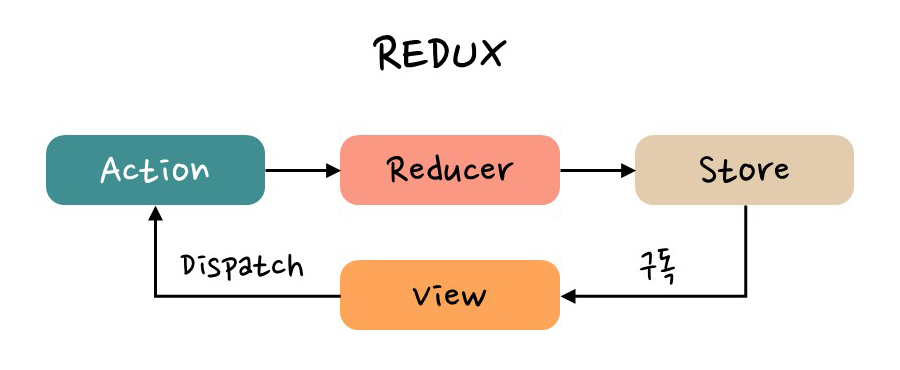

# React

### 상태관리를 하는 이유는 무엇인가?

단순히 정보를 내려주기만 하던 과거의 웹과 달리 현대의 웹에서는 다양한 데이터가 다루어 지며, 사용자와의 많은 상호작용을 통해 시간이 지남에 따라 데이터는 변할 수 있습니다

현재 React에서는 useState와 같은 hook을 사용하여 컴포넌트 별로 상태를 관리할 수 있고, 상태가 여러 곳에서 쓰이는 경우에는 효율성을 위해 Redux, Zustand와 같은 전역 상태 관리 라이브러리를 사용합니다.

### React 생명주기 사이클은?

라이프사이클은 어떤 유기체 또는 제품 등이 활동하거나 수행하는 일련의 단계를 말합니다.

리액트에서 컴포넌트는 자신의 생명 주기를 가지며, 크게 마운트, 업데이트, 언마운트 3가지의 단계를 가집니다.

#### 마운트

1. **state, context, defaultProps 저장**
2. ~~componentWillMount()~~
   1. props나 state 변경하면 안됨(마운트 중이기 때문)
3. **getDerivedStateFromProps()**
   1. props 받아오기
4. **render()**
   1. 실제 DOM에 반영
5. **componentDidMount()**
   1. DOM 접근 가능

#### 업데이트

1. ~~componentWillReceiveProps()~~
   1. 새로운 props를 받음
2. **getDerivedStateFromProps(props, state)**
   1. props 받아오기
3. **shouldComponentUpdate(nextProps, nextState)**
   1. 기본 동작은 항상 다시 렌더링이지만
   2. false로 반환하면 렌더링을 취소 (최적화)
4. **render()**
5. **getSnapshotBeforeUpdate(prevProps, prevState)**
   1. 이전 상태 값 저장
6. **componentDidUpdate(prevProps, prevState, snapshot)**
   1. 이전 상태를 받음

#### 언마운트

**1. componentWillUnmount**

cleanup 함수 실행

### React 클래스형 컴포넌트와 함수형 컴포넌트의 차이점은?

리액트에서 컴포넌트를 만드는 방법에는 클래스형 컴포넌트(class components)와 함수형 컴포넌트(functional components)가 있습니다.

&#x20;클래스형 컴포넌트는 ES6의 클래스(class)를 사용하여 컴포넌트를 정의합니다. 이 방식은 React의 컴포넌트의 상태(state)와 생명주기(lifecycle)를 다룰 때 매우 유용합니다.&#x20;

&#x20;반면에 함수형 컴포넌트는 ES6의 화살표 함수(arrow function)를 사용하여 컴포넌트를 정의합니다. 이 방식은 훅(hook) API와 함께 많이 사용되며, 컴포넌트의 상태와 생명주기를 다룰 때도 유용합니다.&#x20;

과거에는 클래스형 컴포넌트에서만 생명주기를 관리할 수 있었고 함수형 컴포넌트의 성능이 좋지 못했습니다 .함수형 컴포넌트는 코드 순서대로 실행되고, 클래스형 컴포넌트는 생명주기 메서드 순서에 따라 실행됩니다.

클래스형 컴포넌트와 함수형 컴포넌트의 가장 큰 차이점은 상태와 생명주기의 다루는 방식입니다. 클래스형 컴포넌트는 상태를 this.state로 정의하고, 생명주기 메서드를 오버라이드하여 다양한 작업을 수행합니다. 반면에 함수형 컴포넌트는 상태를 useState 훅을 사용하여 정의하고, useEffect 훅을 사용하여 생명주기를 다룹니다. 또한, 클래스형 컴포넌트에서는 this 키워드를 사용하여 상태나 메서드를 참조하며, 함수형 컴포넌트에서는 this 키워드를 사용하지 않습니다. 이러한 차이점 때문에, 함수형 컴포넌트는 더 간결하고 가독성이 좋아지며, 테스트와 리팩토링이 쉽게 이루어질 수 있습니다.

### Redux란 무엇인가요?

리덕스는 상태 관리를 위한 대표적인 라이브러리이다. Flux 패턴에 대한 관심이 높아지면서 Flux 패턴에 Reducer 개념을 추가하여 리덕스가 만들어졌다. 뷰 영역에서 사용자가 디스패치를 통해 액션을 호출하면 리듀서에서는 그에 맞게 상태를 변경하고, 새로운 상태를 스토어에 반영한다. 이러한 방식은 스토어의 불변성을 유지하면서 데이터를 단방향으로 흐르도록 하여 데이터 흐름을 파악하기 쉽게 한다.

<figure><figcaption></figcaption></figure>

### &#x20;가상 DOM과 실제 DOM은 무엇이 다른가요?

DOM은 Document Object Modal의 약자로 웹 페이지의 문서를 객체 단위로 구조화하여 관리하는 모델이다. 자바스크립트를 사용하면 DOM Interfaces를 통해 DOM에 접근하여 조작이 가능하다, 가상 DOM은 DOM의 추상화된 자바스크립트 객체로 메모리에 저장된다. 가상 DOM에 변경사항이 발생하면 실제 DOM과 상태를 비교하여 최소한의 변경사항을 반영시키는 동기화를 수행한다. 가상 돔은 성능을 향상시키고 효율적으로 UI를 업데이트하도록 도와준다.

### useState란?

### useEffect란?

### useRef란?

1. useRef는 React의 내장 훅 중 하나입니다.
2. 일반적으로 렌더링에 필요하지 않는 값을 참조하기 위해 사용합니다.
3. 숫자와 문자열 같은 값을 참조할 수도 있고
4. DOM 객체를 참조하기 위해서 많이 사용됩니다.
5. 렌더링과 무관하므로 참조가 변경되어도 리렌더링이 발생하지 않습니다
6. 따라서 렌더링 중에 읽기와 쓰기를 하지 않는 것이 좋습니다.
7. 렌더링과 관련 있는 값은 useState를 사용하여 상태를 관리해야 합니다.

### useEffect의 실행 순서에 대해 설명해주세요

* useEffect는 함수형 컴포넌트에서 **Side Effect**를 수행하기 위한 React 내장 훅입니다.
* 컴포넌트의 최초 렌더링(`componentDidMount()`)시에 처음으로 실행되고
* 이후 모든 업데이트에 대해(`componentDidUpdate()`) 실행됩니다.
* **return** 문을 통해 컴포넌트가 언마운트 되기 이전 시점에
* **cleanup**(`componentWillUnmount()`)을 수행할 수 있습니다.
* 또한 useEffect의 두번째 인자로 **의존 관계 배열**을 전달하여
* 특정 값이 바뀔 때만 업데이트를 하도록 지정할 수 있습니다.

### 클라이언트 사이드 렌더링(CSR)

클라이언트 사이드 렌더링은 브라우저에서 자바스크립트를 통해 html을 동적으로 렌더링하는 방식으로, 초기 렌더링에는 필요한 자바스크립트 파일을 다운받고 실행하여 렌더링 해야 하기 때문에 시간이 오래 걸리지만 이후부터는 서버와의 통신이 없거나 적기 때문에 클라이언트에서 빠르게 다시 렌더링되고, 서버의 부담이 적습니다. 하지만 seo를 위한 검색 엔진에서는 자바스크립트를 실행 후에 콘텐츠를 파악해야 하므로 어려움이 있습니다

### 서버 사이드 렌더링(SSR)

서버 사이드 렌더링은 서버에서 html을 완전히 만든 후에 클라이언트에 전송되는 방식으로, SEO 최적화가 쉽고, 초기 렌더링 속도가 빠르지만, 페이지를 요청할 때마다 매번 서버에서 새로운 html을 만들어 내려 주기 때문에 서버의 부하는 커집니다.

