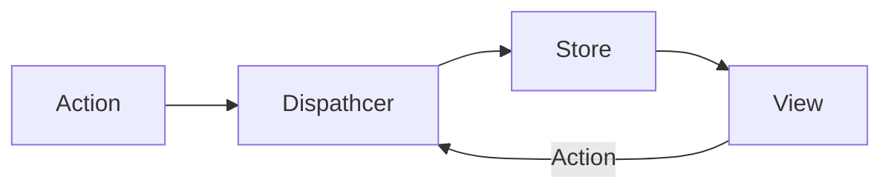

# ⚛ React

## React는 무엇인가

* Facebook에서 만든 오픈 소스 프로젝트
* 사용자 인터페이스(UI)를 만들기 위한 JavaScript 라이브러리
* 선언형 프로그래밍 패러다임
* 컴포넌트 기반
  * 함수형 컴포넌트
  * 클래스형 컴포넌트

* 재사용 가능한 요소를 통해 UI를 효율적으로 빌드
* 단방향 데이터 흐름
* 템플릿, HTML 지시문이 아닌 자바스크립트를 통한 구성 요소 생성
  * 마크업과 뷰 로직의 통합
  * 마크업과의 연결 불필요

* 가상 DOM(실제 DOM 트리를 모방한 자바스크립트 객체)을 통해 효율적인 업데이트 수행(이를 ***reconciliation***이라 부름)
* 쉽게 상태를 추적하고 일관되게 유지. 불변 상태
* 입력하는 데이터에 대해 자동으로 이스케이프하여 XSS와 같은 공격을 방지


## React 프로젝트 시작하기

* 기본 주소: `localhost:3000`
* vite를 사용하여 react 앱 시작하기

```bash
npm create vite@latest
```

- next를 사용하여 react 앱 시작하기

```bash
npx create-next-app@latest
```


* 개발용 CDN 링크

```html
<script crossorigin src="https://unpkg.com/react@18/umd/react.development.js"></script>
<script crossorigin src="https://unpkg.com/react-dom@18/umd/react-dom.development.js"></script>
```

* 배포용 CDN 링크

```html
<script crossorigin src="https://unpkg.com/react@18/umd/react.production.min.js"></script>
<script crossorigin src="https://unpkg.com/react-dom@18/umd/react-dom.production.min.js"></script>
```


### React 프로젝트 구조

* /public
* /node\_modules
* /src
  * App.js
  * index.js
  * index.css
* .gitignore
* package.json
* README.md

### React 개발자 도구

리액트 디버깅 툴

https://github.com/facebook/react/tree/main/packages/react-devtools-extensions


## Flux 데이터 흐름

Facebook에서 고안한 디자인 패턴으로 단방향 데이터 흐름을 강조

행위(Action): 유형(type)과 데이터(data)를 포함하는 객체

디스패처(Dispatcher): 액션을 받아서 Store로 전달

스토어(Store):상태와 상태를 관리하는 로직을 포함




## JSX

* JavaScript를 확장한 문법으로서 React에서 엘리먼트를 생성하기 위해 사용
* html을 jsx로 변환하는 사이트 https://transform.tools/html-to-jsx

### JSX 에서 표현식 넣기

* `{}` 중괄호 안에서는 JavaScript 표현식을 사용할 수 있다.

```jsx
const name = 'John';
const element = <h1>My name is {name}</h1>;
```

### JSX에서 속성 넣기

* `속성={값}` `속성="문자열"` 형태
* 자바스크립트 로직과 변수를 마크업에 사용할 수 있다.

```jsx
const color = "red"
const element = <h1 color="red">My name is {name}</h1>;
const element = <h1 color={color}>My name is {name}</h1>;
```

### 속성명은 CamelCase를 사용

속성 명은 `CamelCase`를 사용하여 작성(`onclick` -> `onClick`)

```jsx
// ❌
<button onclick={handleClick}></button>
```

```jsx
// ✅ CamelCase 사용
<button onClick={handleClick}></button>
```


### 모든 태그는 닫혀야 한다

```jsx
// ❌
<br>

<input>
<li>
```

```jsx
// ✅
<br/>

<input/>
<input></input>
<li>
```


### Fragment

최상위 요소는 하나여야 한다. 

최상위 요소를 2개 사용해야 할 때는 의미 없는 div태그 보다는 `<></>` Fragment를 사용하여 감싼다.

```jsx
// ❌ 최상위 요소가 2개이다.
<header>
    <nav></nav>
</header>
<section>
    <ul>
	    <li></li>
    	<li></li>
    </ul>
</section>
```

```jsx
// ❌ 최상위 요소가 2개이다.
<>
<header>
    <nav></nav>
</header>
<section>
    <ul>
	    <li></li>
    	<li></li>
    </ul>
</section>
</>
```

### Key 속성 사용하기

React에서는 배열로 렌더링할 때 Key 속성이 필수적이다.

마찬가지로 Fragment를 배열로 렌더링할 때도 Key 속성을 지정해야한다.

단축문법인 `<></>`는 Key 속성을 지정할 수 없기 때문에 `React.Fragment`를 사용해야 한다

```jsx
// ❌ 단축 문법에 Key 사용 불가
{items.map((item)=>(
	<key={item.id}>
        <span>{item.name}</span>
        <p>{item.price}</p>
    <>
))}
```

```jsx
//✅ Fragment를 사용하여 Key 속성 사용
{items.map((item)=>(
	<React.Fragment key={item.id}>
        <span>{item.name}</span>
        <p>{item.price}</p>
    </React.Fragment>
))}
```

### Key 속성을 사용해 props 변경 시 state 초기화

props가 변경되면 state를 초기화해야 할 때가 있다. 예를 들어 사용자 id값이 변경되면 Input 값을 초기화해야 한다. 이런 경우 컴포넌트 내부에서 useEffect를 사용하기 보다 key값을 지정하여 컴포넌트 인스턴스를 다시 생성할 수 있다

```jsx
<EmailInput
  defaultEmail={this.props.user.email}
  key={this.props.user.id}
/>
```


## Element

* React 앱에서 사용되는 가장 작은 단위
* virtual DOM 노드의 객체 표현
* 생명주기를 가지지 않는다.
* 한 번 생성되면 변하지 않는 불변 객체이다.

### Element 렌더링

* `루트 DOM 노드`는 리액트 앱에서 일반적으로 하나지만, 기존 앱에 통합할 때 여러 개의 독립적인 `루트 DOM 노드`를 만들 수도 있다.
* 리액트 DOM이 `루트 DOM 노드` 아래의 모든 엘리먼트를 관리한다.

```html
<div id="root"></div>
```

* 따라서 리액트 DOM에게 `루트 DOM 노드`와 렌더링할 엘리먼트를 전달하여 렌더링을 지시한다.

```jsx
const root = ReactDOM.createRoot(
  document.getElementById('root')
);
const element = <h1>Hello, world</h1>;
root.render(element);
```


### 상태가 없다

- 엘리먼트는 생명 주기를 포함해 메서드, 상태를 가지지 않는다.


#### 변경된 부분만 업데이트

* 리액트 DOM은 현재 상태와 변경될 상태를 비교하여 변경이 필요한 부분만 업데이트한다.


## Component

### Component 정의

* `props`를 입력으로 받아 React 엘리먼트를 반환한다.
* React에서는 함수형 컴포넌트와 클래스형 컴포넌트가 있다
* 이름은 대문자로 시작한다.


**함수형 컴포넌트**

```jsx
function Component(props) {
	return <h1> Component </h1>;
}
```

함수형 컴포넌트 - ES6 Arrow function 문법

```jsx
const Component = (props) => {
	return <h1> Component </h1>;
}
```


**클래스 컴포넌트** - ES6 Class 문법

```jsx
class Component extends React.Component {
	render() {
		return <h1> Component </h1>;
	}
}
```

### rendering

부모 컴포넌트가 리렌더링되면 모든 하위 컴포넌트가 리렌더링


### props

* 상위 컴포넌트에서 전달받는 값
* `props`는 Read Only 값으로 컴포넌트에서 임의로 변경해서는 안된다.
* 따라서 순수함수를 통해 `props`를 다룬다.
* 함수형 컴포넌트에서는 `{props.속성명}`
* 클래스형 컴포넌트에서는 `{this.props.속성명}`
* props를 전달 받을 때 구조 분해를 사용하여 속성을 바로 가져올 수 있다.

```jsx
const Button = (props) => {
	return <button type={props.type}>{props.children}</button>
} 
```


**props를 전달 받을 때 구조 분해를 사용하여 속성을 바로 가져올 수 있다.**

```jsx
// 구조분해를 사용한 props 가져오기
const Button = ({ type, children }) => {
	return <button type={type}>{children}</button>
} 
```


**props 기본값 지정하기**

```jsx
const Button = ({ type='submit', children, placeholder='enter...' }) => {
	return <button type={type} placeholder={placeholder}>{children}</button>
} 
```


**모든 props를 엘리먼트에 전달하기** 

- 스프레드 구문을 사용하여 모든 props, 또는 나머지 props를 엘리먼트에 전달할 수 있다.

```jsx
const Image = (props) => {
	return 
}
```

```jsx
const Image = ({a, b, ...props}) => {
    // a와 b를 사용하는 로직
	return 
}
```


### children  속성

* 자신 컴포넌트의 태그 사이로 들어오는 `content` 값으로
* `props.children`으로 사용

```jsx
const TitleContainer ({ chlidren }) => {
	return(
        <div className="TitleContainer">
            {children}
        </div>
        );
}
```

```jsx
<TitleContainer>
<h1>Title: React</h1>
</TitleContainer>
```

```jsx
// 렌더링 결과 
<div className="TitleContainer">
	<h1>Title: React</h1>
</div>
```


* 자신의 `content`로 어떤 자식 엘리먼트가 올 지 예측하기 어려울 때 그대로 출력으로 전달 할 수 있다.


### 컴포넌트 구체화(특수화)

* `구체적인`컴포넌트 => `일반적인`컴포넌트를 렌더링
* 구체적인 컴포넌트(`WelcomeDialog`)에서`props`를 전달하여 일반적인 컴포넌트(`Dialog`) 구체화

```jsx
function WelcomeDialog() {
  return (
    <Dialog
      title="Welcome"
      message="Thank you for visiting our spacecraft!" />
  );
}
```


## Pure Component

- 순수 함수와 같이 동일한 입력에 대해 동일한 출력을 렌더링하는 컴포넌트
- 다른 객체나 변수를 변경시키지 않는다.
- React에서는 함수형 컴포넌트가 순수 함수일 것으로 예상하고 동작한다

### 순수하게 유지하는 방법

1. props를 사용하여 같은 입력에 대해 똑같은 렌더링 결과
2. state를 최소한으로 유지
3. unit test를 작성


## import / export

어느 방식을 사용하든 의미 있는 이름을 사용하여야 한다. 

`export default () => {}`와 같은 방식은 권장되지 않는다.

### 기본 내보내기 방식

기본 내보내기 방식은 가져올 때 원하는 이름으로 가져올 수도 있다.


```javascript
export default function App() {
    ...
}
```

```javascript
const App = () => {
    ...
}
export default App;
```

```javascript
import App from './App.js';
import AppContainer from './App.js';
```


### 명명된 내보내기 방식

명명된 내보내기 방식은 가져올 때 양쪽의 이름이 일치해야 한다. 

가져온 후에는 이름을 변경할 수있다.

```javascript
export function App() {
...
}
```

```javascript
export const App = () => {
...
}
```

```javascript
import { App } from './App.js'
import { App as AppContainer } from './App.js'
```


## Virtual DOM

> The virtual DOM (VDOM) is a programming concept where an ideal, or “virtual”, representation of a UI is kept in memory and synced with the “real” DOM by a library such as ReactDOM. This process is called [reconciliation](https://legacy.reactjs.org/docs/reconciliation.html). -react docs

가상 UI를 메모리에서 관리하고 이를 실제 DOM에 동기화하는 방식

`렌더 단계`: 컴포넌트를 렌더링하고 변경 사항을 계산

`커밋 단계`: 변경 사항을 DOM에 적용

가상DOM이라는 단어를 점점 안쓰는 추세이다. 컴포넌트가 항상 DOM을 나타내는 것도 아니다.


## State

### State란

**상태**: React에서는 구성 요소가 화면을 표시하기 위해 기억해야 할 값들을 상태라고 부릅니다.

**단방향 데이터 흐름**: 상태는 props를 통해 단방향으로 상위 요소에서 하위 요소로 흐릅니다.

**역방향 데이터 흐름:** 하위 요소에서 상위 요소의 상태를 변경하고 싶을 때 상위 요소에서 setter 함수를 props로 전달

**불변성**: React의 모든 상태를 불변해야 한다. (이전 상태와 현재 상태를 비교하여 최적화)


### 필요한 이유

1. 지역 변수는 렌더링 간에 데이터가 유지되지 않는다.
   1. 렌더링 될 때마다 변수 값이 초기화
2. 변수가 변경되더라도 리렌더링되지 않는다. 
   1. 변수의 값과 렌더링되어 보여지는 값이 다를 수 있다.


### State 고르기

- 시간이 지나도 변함없이 유지 되는 값 -> 상태가 아님(상수)
- 부모 요소로 부터 내려 받는 값 -> 상태가 아님(props)
- 존재하는 상태와 props를 사용해 계산되어질 수 있는 값 -> 상태가 아님(useMemo를 사용)


### State 위치 정하기

1. 해당 상태를 사용하는 모든 요소를 찾기
2. 찾은 요소들의 공통 조상 요소를 찾기
3. State 위치 정하기. 적절한 위치를 찾지 못했다면 새로운 공통 요소를 만들어 상위에 위치시키기

### 배열을 상태로 사용

- 배열을 상태로 사용할 때에도 읽기 전용으로 간주하여 배열 요소에 값을 직접 할당하거나 변경해서는 안된다.
- `concat`, `filter`, `slice`, `map` 등의 새로운 배열을 반환하는 메서드를 사용하여 상태를 업데이트한다.


###

## 폼

#### 제어 컴포넌트

* HTML에서의 폼은 엘리먼트 자체가 내부 상태를 가진다
* React에서는 `State`를 사용해 \*\*`신뢰 가능한 단일 출처`\*\*를 통해 제어된다.

#### 기본적인 Input 사용법

```jsx
<input type="text" value={value} onChange={handleChange} />
<textarea value={this.state.value} onChange={this.handleChange} />
<select value={this.state.value} onChange={this.handleChange}>
            <option value="grapefruit">Grapefruit</option>
            <option value="lime">Lime</option>
            <option value="coconut">Coconut</option>
            <option value="mango">Mango</option>
</select>
<select multiple={true} value={['grapefruit', 'lime']}>
```

#### file Input

* 읽기 전용 값으로 React에서 비제어 컴포넌트

#### 핸들링 함수 재사용

* `input`의 `name` 속성과 `State`의 키값을 동일하게 사용

```jsx
handleInputChange(event) {
    const target = event.target;
    const value = target.type === 'checkbox' ? target.checked : target.value;
    const name = target.name;

    this.setState({
      [name]: value
    });
  }
```

#### Input Null값 조심하기

* `input`의 value `prop`으로 `null`이나 `undefined`를 넘기지 않아야 한다.

```jsx
 const [value, setValue] = useState("");
    const handleSubmit = () => {
      alert(value)
    }
      return (
        <form onSubmit={handleSubmit}>
          <label>
            Name:
            <input type="text" value={value} onChange={(e) => 						         setValue(e.target.value)} />
          </label>
          <input type="submit" value="Submit" />
        </form>
      );
```

#### 폼 라이브러리

https://formik.org/

## 외부 데이터

> HTTP 요청과 Promise에는 3가지 상태 진행중, 성공,실패가 있다.
>
> 반드시 3가지 상태에 대해 모두 처리를 해야 한다.

### fetch() 로 가져오기

* `useEffect()` -> `fetch()`
* `useState()` ->

```jsx
import React, { useState, useEffect } from "react";
const GitHubUser = ({ username }) => {
  const [data, setData] = useState();

  useEffect(() => {
    if (!login) return;
    fetch(`https://api.github.com/users/${login}`)
      .then((res) => res.json())
      .then(setData)
      .catch(console.error);
  }, [login]);
  if (data) return <pre>{JSON.stringify(data, null, 2)}</pre>;
  return null;
};

export default GitHubUser;
```

### 로컬 스토리지로 가져오기

* key값을 사용해 문자열 형태로 저장
* 객체 저장 => JSON 문자열로 저장
* 객체 불러오기 => JSON 문자열 파싱

> 모두 동기적인 작업이므로 성능에 영향을 미친다.

```javascript
const loadJSON = key =>
	key && JSON.parse(localStorage.getItem(key));
const saveJSON = (key, data) => 
	localStorage.setItem(key, JSON.stringify(data));
```

```jsx
const [data, setData] = useState(loadJSON(`user: ${login}`));
useEffect(() => {
	if(!data) return;
	if (data.login === login) return;
	const {name, avatar_url, location} = data;
	saveJSON(`user: ${login}`, {
		name, 
		login,
		avatar_url,
		location,
	});
}, [data]);
```

### Context

* 컴포넌트 트리 전체에 데이터를 제공
* 전역적인 데이터를 공유하기 위한 방법
* ex. 현재 로그인 유저, 테마, 선호하는 언어 등
* 실제 사용되는 곳은 최하위 컴포넌트인데 props로 계속 내려 받는 것은 비효율적이기 때문
* ```react
  const MyContext = React.createContext(defaultValue);
  ```

#### `Context.Provider`

* 리액트 context에 데이터를 넣는 곳
* context를 구독하는 컴포넌트에게 context의 변화를 알림

```react
<MyContext.Provider value={/* 어떤 값 */}>
```

#### `Context.Consumer`

* 리액트 context로 부터 데이터를 가져오는 곳
* context 변화를 구독하는 컴포넌트.
* 상위 컴포넌트 중 가장 가까운 `Provider`컴포넌트가 전달하는 데이터를 사용
* `Context.Consumer`의 자식은 함수로서 context의 현재값을 받아 -> React 노드를 반환

```react
<MyContext.Consumer>
  {value => /* context 값을 이용한 렌더링 */}
</MyContext.Consumer>
```

## Render Props

* 렌더링되는 프로퍼티
* 무엇을 렌더링할지 알려주는 함수
* 컴포넌트 재사용성을 올릴 수 있다.

```jsx
<List 
    data ={data}
    renderItem={item => (<li>item.name</li>)} 
/>

const List ({ render,data }) => {
    return (
        <ul>
            {data.map((item,idx) => renderItem(item))}
        </ul>)
}
```

https://ko.reactjs.org/docs/render-props.html

## 목록 가상화

https://ko.reactjs.org/docs/optimizing-performance.html#virtualize-long-lists

## 스타일링

### 클래스

#### 클래스 동적으로 할당하기

```jsx
<div className={`body` ${isOpen ? 'open' : ''}}></div>
```


## Event

- 이벤트 함수 이름은 관례적으로 `handle`로 시작하고 뒤에는 대문자를 사용(ex. handleClick)
- 함수 결과가 아닌 함수 자체를 전달

```jsx
export default function Button() {
  function handleClick() {
    alert('You clicked me!');
  }

  return (
    <button onClick={handleClick}>
      Click me
    </button>
  );
}
```

### props로 이벤트 핸들러 전달

- props로 이벤트 핸들러를 전달할 때는 `on`으로 시작하고 뒤에는 대문자를 사용(ex. onClick)

```jsx
export default function Button({ onClick }) {

  return (
    <button onClick={onClick}>
      Click me
    </button>
  );
}
```

### 이벤트 전파 중지

```jsx
const handleClick = (e) => {
	e.stopPropagation();
}
```

### 기본 동작 방지

```jsx
const handleSubmit = (e) => {
	e.preventDefault();
}
```

