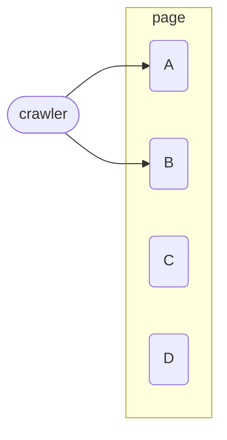

# SEO


- 구글 검색 센터 https://developers.google.com/search?hl=ko
- 네이버 서치 어드바이저 https://searchadvisor.naver.com/
- WIX  블로그 https://ko.wix.com/blog/category/google-seo
- TBWA 코리아 블로그 https://seo.tbwakorea.com/blog/category/seo/
- Bing 웹 마스터 가이드 라인 https://www.bing.com/webmasters/help/Webmaster%20Guidelines-30fba23a


## 색인을 생성할 수 있는 컨텐츠 

- 사이트 방문 시 자료 형식이 HTML 텍스트 형식일 것
- 또는 초기 로드 시 실행되는 자바스크립트에 의해 렌더링 된 페이지가 표시되로록 할 것
- 페이지를 가져오기 위해 사용자의 추가적인 동작이 필요할 경우 색인화할 수 없다.
- 따라서 페이지 내에 중요한 링크가 있더라도 이것이 사용자와의 상호작용 후에 나타난다면 이를 크롤링할 수 없다.

> 크롤링이 필요한 중요한 페이지는 처음부터 렌더링 되도록 해야 한다.




## 크롤링 가능한 링크 구조

- 검색 엔진은 웹 페이지의 링크를 사용해 다른 웹페이지와 웹 사이트를 검색하도록 돕는다
- 스파이더가 쉽게 크롤링 할 수 있는 내부 연결 구조를 구축하는 것이 중요하다


접근할 수 없는 이유들

1. 양식(Form)을 통해서만 접근 가능한 컨텐츠 또는 링크는 엔진에 표시되지 않습니다
2. 처음 렌더링된 페이지에 포함되지 않는 콘텐츠 및 링크는 가져올 수 없음
3. .ppt, .pdf 등의 파일 속의 링크들을 가져오지 못할 수도 있음
4. `rel='nofllow'` 또는 `robots.tx`에 의해 차단된 페이지를 가리키는 링크들은 가져올 수 없음
5. 페이지당 링크 수를 최대 100~200개로 제한하여 `PageRank`를 통과하도록 관리
6. `iframe` 속의 링크은 크롤링 될 수 있지만 여전이 구조적 문제가 존재


## XML 사이트맵

2005년 구글이 발표 -> 2006년 Yahoo!와 MSN Search가 프로토콜을 지원

> 사이트 맵 파일에 URL을 추가하는 것이  URL이 크롤링 되거나 색인이 생성된다는 것을 보장하지 않습니다
>
> 하지만 검색엔진이 찾지 못했던 페이지를 검색하고 색인화하도록 도움을 줄 수 있습니다


- 검색엔진이 이미 알고 있는 페이지일 경우 아래와 같은 메타 데이터를 사용할 수 있습니다
  - `<lastmod>`: 파일을 마지막으로 수정한 날짜
  - `<changefreq>`: 페이지가 변경되는 빈도
- 검색엔진이 모르는 페이지일 경우 사용자가 제공한 추가 URL을 사용해 크롤링 범위를 확장할 수 있습니다
- 검색엔진은 중복되는 URL이 있을 경우 표준 버전을 만들기 위해 사이트맵 데이터를 사용할 수 있습니다
- 사이트맵은 크롤링에서 순위 향상과 내부 링크 인기도 향상과 같은 긍정적인 효과를 가져올 수 있습니다
- `Google Search Console`에서는 사이트맵을 등록하면 문제를 찾아주고 여러 가지 분석을 제공합니다
- 사이트맵은 `<hreflang>`문을 구현하는 데 사용될 수 있습니다.
  -  `<hreflang>`는 문서에 대한 언어적 지리적 제한을 지정합니다


## XML 사이트맵 생성기

사이트맵을 자동으로 생성하도록 하는 생성기를 사용할 수 있습니다

URL 목록, 액세스 로그 또는 URL에 해당하는 정적 파일을 호스팅하는 디렉토리 경로에서 생성기를 사용해 생성합니다.

- https://slickplan.com/
- https://www.xml-sitemaps.com/

오늘날 많은 CMS에서는 사이트맵 생성기와 플러그인 등을 지원합니다

### 텍스트 파일

한줄에 하나의 URL이 포함된 텍스트 파일을 Google에 제공할 수 있습니다.

### 신디케이션 피드

Google은 RSS 2.0 및 Atom 1.0 피드를 허용합니다


## 사이트맵 파일에 넣을 것과 말 것

- 하나의 컨텐츠를 참조하는 URL이 여러 개일 경우 선호하는 표준 버전 하나만 포함시킨다

제외 해야 할 추가 URL

- 추가 매개변수가 포함된 URL
- 리디렉션되는 URL
- 200 HTTP 상태 코드를 반환하지 않는 URL

> 사이트가 변경될 때마다 사이트맵 파일을 자동으로 업데이트하는 프로세스를 갖추기

### 컨텐츠 정보 포함

- 동영상 사이트맵 - 페이지에 호스팅된 동영상의 추가 정보가 포함
- 이미지 사이트맵 - Google이 찾을 수 없는 이미지를 비롯해 사이트의 다른 이미지들을 사이트 맵에 포함
- 뉴스 사이트맵 - 뉴스 사이트맵을 사용해 뉴스 기사화 추가 정보를 Google에게 알려줄 수 있다


### 사이트맵 업로드

- 사이트맵 파일을 최상위 디렉터리(www.your-domain.com/sitemap.xml)에 업로드
- 또는 사이트의 `robots.txt` 파일에 있는 Sitemap 지시문을 사용하여 사이트맵 파일이 저장된 위치를 검색엔진에 알려줄 수 있다


1. 사이트맵 업로드
2. 사이트맵 승인
3. 사이트 크롤링
4. 결과 모니터링
5. 문제가 발생 시 사이트맵 업데이트

콘텐츠가 변경되거나 페이지를 삭제 하는 등의 경우에는 사이트맵 업데이트가 필요하다. 검색 엔진(Google, Bing)은 주기적으로 사이트맵을 다시 다운로드한다. 사이트맵 위치가 변경되지 않는다면 사이트맵을 다시 제출할 필요가 없다.

정기적으로 많은 페이지들을 추가하거나 삭제해야 하는 경우 XML 사이트맵 유틸리티 사용 또는 모든 현재 URL을 다시 생성하는 기능을 구축하여 사용

## IndexNow

새로 만들어진 페이지나 업데이트, 삭제가 발생한 페이지를 검색 엔진에게 알립니다. 이를 통해 검색엔진이 웹사이트를 방문하는 지연시간을 줄일 수 있습니다. 하지만 색인을 보장하지는 않습니다. 또한 XML 사이트맵을 대체하기 위한 것은 아닙니다


# 최적의 정보 아키텍처

검색 엔진 크롤러는 사이트를 인식하는 방식이 인간과 다르기 때문에 크롤러 친숙한 사이트를 만드는 것은 SEO에서 중요하다

정보 아키텍처에서 중요한 두 원칙

- 사이트를 사용하기 쉽게 만드는 것
- 콘텐츠에 대한 논리적이고 계층적인 구조


## 유용성과 검색 친화성을 측정

인간은 페이지 순위를 결정하기 위해 사용성과 사용자 경험을 중요하게 생각합니다

하지만, 검색 엔진은 기계이기 때문에 인간과 같은 측정항목을 따라하는 것은 어려움이 많기 때문에 보조 측정 항목을 사용해야 한다

### 웹 사이트 인바운드 링크 측정

- 다른 웹 사이트에서 우리 웹 사이트로 접속하는 링크
- 많은 웹 사이트에서 해당 웹 사이트를 링크한다는 것은 컨텐츠가 좋을 것이라는 추측에 기반
- 여러 웹 페이지 간의 관련성 측정
- 다른 신뢰할만 사이트에서의 링크는 곧 우리 웹사이트의 신뢰성 증가로 이어짐


### 페이지 경험 신호

사용자들이 특정 웹 페이지에서 어떤 경험을 하는지를 평가하기 위해 사용하는 다양한 요소

- Core Web Vitals: 웹 페이지 핵심 성능 지표
- HTTPS: 안전한 사이트 연결
- 방해되는 전면 광고 방지: 사용자가 봐야하는 컨텐츠를 가리는 광고를 방지
- 크롬 Lighthouse: 모바일 친화성 및 다양한 개선사항 파악


## 사이트 구조

- 간단한 / 탐색하기 좋은 / 크롤링하기 쉬운 / 좋은 구조를 가진 사이트를 만드는 것에 집중
- 가장 중요한 페이지를 접근하기 위한 클릭 수를 최소화
- 나머지 페이지에 대한 과도한 딥 링크 아키텍처를 피하고
  홈 페이지에서 세부적인 페이지로의 논리적·의미론적 링크 흐름을 만들기

`https://example.com/categoryA/productXYZ` -> `https://example.com/products/productXYZ`

### 

### 하위 도메인 사용

- 유사한 아키텍처를 공유하지만 동일한 콘텐츠를 공유하지는 않는 독립적인 것으로 간주
- 일반적으로는 잘 정리된 하나의 도메인을 사용하는 것이 좋음. 
- 분리를 할 때에는 사용자와 봇이 원하는 것을 잘 찾지 못할 수 있기 때문에 신중하게 해야 함
- 하위 도메인에 키워드를 사용하여 제공하는 컨텐츠를 명시적으로 표시할 수 있음
  - 구글 메일 -> `mail.google.com` 
  - 구글 포토 -> `photos.google.com`

### 리디렉션 

해당 URL을 방문하는 사용자에게 리디렉션을 통해 사용자를 적절한 위치로 연결

- 위치가 잘못된 컨텐츠
- 더 이상 사용되지 않는 컨텐츠
- 일시적으로 이용 불가능한 컨텐츠

### URL

찾기 쉽고, 의미 있는 URL을 사용

- 매번 바뀌는 URL 보다는 정적인 URL을 사용하는 것이 찾기 쉽다
- 의미있는 이름을 사용하면 더 찾기 쉽다

## 

## 카테고리 구조화

- 검색 엔진은 웹을 크롤링하면서 의미 관계를 학습할 수 있습니다.
- 이러한 패턴은 문서 간의 단일 관계에서부터 웹 사이트의 전체 카테고리 구조까지 확장
- 사이트 제작 시 광범위한 주제부터 구체적인 컨텐츠로 이어지는 계층 구조를 구축하여 이를 최대한 활용


## 플랫 사이트 아키텍처


- 플랫 사이트 아키텍처 - 수평적
  - 특정 페이지에 도달하기 위한 최소한의 클릭을 필요로 한다
- 딥 사이트 아키텍처 - 수직적
  - 세부 컨텐츠에 접근하기 위해 많은 링크 이동 과정이 필요하다

- 페이지 수가 10,000개 미만인 대부분의 사이트 에서는 홈페이지 또는 사이트맵 페이지로 부터 최대 4번의 클릭을 통해 모든 컨텐츠에 접근할 수 있어야 한다
- 단 플랫 사이트 아키텍처에서 페이지에 링크가 200 개 이상 너무 많이 포함되지 않도록 주의해야 한다.
- 페이지에 링크가 많더라도 검색 엔진은 중요하다고 판단되는 곳에만 높은 PageRank를 부여하기 때문에 
  나머지 페이지들은 더 낮은 PageRank를 가지게 된다


## 페이지네이션

### 페이지네이션에 대한 UX 패턴

- Pagination: 페이지로 나누기
- Load More: 더 보기 버튼을 사용하여 데이터 더 가져오기
- Infinite Scroll: 사용자가 특정 스크롤 위치에 도달하면 데이터를 더 가져오기


### 순차적 페이지 연결

개별 페이지에 대해서 이전 페이지, 다음 페이지 및 첫 페이지, 마지막 페이지를 연결


### 올바른 URL 사용

- 쿼리 매개변수를 사용한 페이지 네이션: `?page=n`
- 페이지를 나눌 때 첫 페이지는 표준 페이지로 사용하지 않는 것이 좋다: 각 페이지에 표준 URL을 사용 `/posts?page=1`보다는 '/posts'를 사용
- 페이지 번호에 `Fragment(#)` 사용하지 않기: 구글은 프래그먼트 식별자를 무시하고 프래그먼트 식별자가 다르더라도 같은 페이지로 간주

### 필터, 정렬 등 추가적인 옵션이 적용된 URL의 색인 생성 방지

`noindex rebots meta태그`를 사용하여 차단하거나 `robots.txt` 파일로 특정 URL 패턴이 크롤링 되지 않도록 조치


### rel="next","prev" 속성을 사용

- 과거에 구글은 해당 속성을 사용하여 페이지를 연결했지만 더 이상을 이를 사용하지는 않음

```html
<link 
      rel="prev" 
      aria-label="Go to previous page" 
      href="https://www.example.com/article?page=2&sessionid=12345"
 >Previous</link>
<span aria-current="page">3</span>
<link 
      rel="next" 
      aria-label="Go to next page"
      href="https://www.example.com/article?page=4&sessionid=12345"
>Next</link>
```


### 버전별 페이지 만들기

버전 별 단일 페이지를 생성하고 각각의 페이지에서는  `rel="canonical"` 링크를 사용하여 모두 보기 페이지를 가리키도록 함. 각각의 페이지가 존재하더라도 모든 페이지의 관심은 모두 보기 페이지 하나로 집중됨


구글 페이지 나누기 가이드: https://developers.google.com/search/docs/specialty/ecommerce/pagination-and-incremental-page-loading?hl=ko


------

# 검색 친화적인 사이트 검색

## 검색 요소


