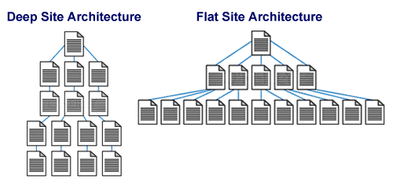
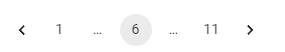

# SEO


- 구글 검색 센터 https://developers.google.com/search?hl=ko
- 네이버 서치 어드바이저 https://searchadvisor.naver.com/
- WIX  블로그 https://ko.wix.com/blog/category/google-seo
- TBWA 코리아 블로그 https://seo.tbwakorea.com/blog/category/seo/
- Bing 웹 마스터 가이드 라인 https://www.bing.com/webmasters/help/Webmaster%20Guidelines-30fba23a


## 색인을 생성할 수 있는 컨텐츠 

- 사이트 방문 시 자료 형식이 HTML 텍스트 형식일 것
- 또는 초기 로드 시 실행되는 자바스크립트에 의해 렌더링 된 페이지가 표시되로록 할 것
- 페이지를 가져오기 위해 사용자의 추가적인 동작이 필요할 경우 색인화할 수 없다.
- 따라서 페이지 내에 중요한 링크가 있더라도 이것이 사용자와의 상호작용 후에 나타난다면 이를 크롤링할 수 없다.

> 크롤링이 필요한 중요한 페이지는 처음부터 렌더링 되도록 해야 한다.


## 크롤링 가능한 링크 구조

- 검색 엔진은 웹 페이지의 링크를 사용해 다른 웹페이지와 웹 사이트를 검색하도록 돕는다
- 스파이더가 쉽게 크롤링 할 수 있는 내부 연결 구조를 구축하는 것이 중요하다


접근할 수 없는 이유들

1. 양식(Form)을 통해서만 접근 가능한 컨텐츠 또는 링크는 엔진에 표시되지 않습니다
2. 처음 렌더링된 페이지에 포함되지 않는 콘텐츠 및 링크는 가져올 수 없음
3. .ppt, .pdf 등의 파일 속의 링크들을 가져오지 못할 수도 있음
4. `rel='nofllow'` 또는 `robots.tx`에 의해 차단된 페이지를 가리키는 링크들은 가져올 수 없음
5. 페이지당 링크 수를 최대 100~200개로 제한하여 `PageRank`를 통과하도록 관리
6. `iframe` 속의 링크은 크롤링 될 수 있지만 여전이 구조적 문제가 존재


## XML 사이트맵

2005년 구글이 발표 -> 2006년 Yahoo!와 MSN Search가 프로토콜을 지원

> 사이트 맵 파일에 URL을 추가하는 것이  URL이 크롤링 되거나 색인이 생성된다는 것을 보장하지 않습니다
>
> 하지만 검색엔진이 찾지 못했던 페이지를 검색하고 색인화하도록 도움을 줄 수 있습니다


- 검색엔진이 이미 알고 있는 페이지일 경우 아래와 같은 메타 데이터를 사용할 수 있습니다
  - `<lastmod>`: 파일을 마지막으로 수정한 날짜
  - `<changefreq>`: 페이지가 변경되는 빈도
- 검색엔진이 모르는 페이지일 경우 사용자가 제공한 추가 URL을 사용해 크롤링 범위를 확장할 수 있습니다
- 검색엔진은 중복되는 URL이 있을 경우 표준 버전을 만들기 위해 사이트맵 데이터를 사용할 수 있습니다
- 사이트맵은 크롤링에서 순위 향상과 내부 링크 인기도 향상과 같은 긍정적인 효과를 가져올 수 있습니다
- `Google Search Console`에서는 사이트맵을 등록하면 문제를 찾아주고 여러 가지 분석을 제공합니다
- 사이트맵은 `<hreflang>`문을 구현하는 데 사용될 수 있습니다.
  -  `<hreflang>`는 문서에 대한 언어적 지리적 제한을 지정합니다


## XML 사이트맵 생성기

사이트맵을 자동으로 생성하도록 하는 생성기를 사용할 수 있습니다

URL 목록, 액세스 로그 또는 URL에 해당하는 정적 파일을 호스팅하는 디렉토리 경로에서 생성기를 사용해 생성합니다.

- https://slickplan.com/
- https://www.xml-sitemaps.com/

오늘날 많은 CMS에서는 사이트맵 생성기와 플러그인 등을 지원합니다

### 텍스트 파일

한줄에 하나의 URL이 포함된 텍스트 파일을 Google에 제공할 수 있습니다.

### 신디케이션 피드

Google은 RSS 2.0 및 Atom 1.0 피드를 허용합니다


## 사이트맵 파일에 넣을 것과 말 것

- 하나의 컨텐츠를 참조하는 URL이 여러 개일 경우 선호하는 표준 버전 하나만 포함시킨다

제외 해야 할 추가 URL

- 추가 매개변수가 포함된 URL
- 리디렉션되는 URL
- 200 HTTP 상태 코드를 반환하지 않는 URL

> 사이트가 변경될 때마다 사이트맵 파일을 자동으로 업데이트하는 프로세스를 갖추기

### 컨텐츠 정보 포함

- 동영상 사이트맵 - 페이지에 호스팅된 동영상의 추가 정보가 포함
- 이미지 사이트맵 - Google이 찾을 수 없는 이미지를 비롯해 사이트의 다른 이미지들을 사이트 맵에 포함
- 뉴스 사이트맵 - 뉴스 사이트맵을 사용해 뉴스 기사화 추가 정보를 Google에게 알려줄 수 있다


### 사이트맵 업로드

- 사이트맵 파일을 최상위 디렉터리(www.your-domain.com/sitemap.xml)에 업로드
- 또는 사이트의 `robots.txt` 파일에 있는 Sitemap 지시문을 사용하여 사이트맵 파일이 저장된 위치를 검색엔진에 알려줄 수 있다


1. 사이트맵 업로드
2. 사이트맵 승인
3. 사이트 크롤링
4. 결과 모니터링
5. 문제가 발생 시 사이트맵 업데이트

콘텐츠가 변경되거나 페이지를 삭제 하는 등의 경우에는 사이트맵 업데이트가 필요하다. 검색 엔진(Google, Bing)은 주기적으로 사이트맵을 다시 다운로드한다. 사이트맵 위치가 변경되지 않는다면 사이트맵을 다시 제출할 필요가 없다.

정기적으로 많은 페이지들을 추가하거나 삭제해야 하는 경우 XML 사이트맵 유틸리티 사용 또는 모든 현재 URL을 다시 생성하는 기능을 구축하여 사용

## IndexNow

새로 만들어진 페이지나 업데이트, 삭제가 발생한 페이지를 검색 엔진에게 알립니다. 이를 통해 검색엔진이 웹사이트를 방문하는 지연시간을 줄일 수 있습니다. 하지만 색인을 보장하지는 않습니다. 또한 XML 사이트맵을 대체하기 위한 것은 아닙니다


# 최적의 정보 아키텍처

검색 엔진 크롤러는 사이트를 인식하는 방식이 인간과 다르기 때문에 크롤러 친숙한 사이트를 만드는 것은 SEO에서 중요하다

정보 아키텍처에서 중요한 두 원칙

- 사이트를 사용하기 쉽게 만드는 것
- 콘텐츠에 대한 논리적이고 계층적인 구조


## 유용성과 검색 친화성을 측정

인간은 페이지 순위를 결정하기 위해 사용성과 사용자 경험을 중요하게 생각합니다

하지만, 검색 엔진은 기계이기 때문에 인간과 같은 측정항목을 따라하는 것은 어려움이 많기 때문에 보조 측정 항목을 사용해야 한다

### 웹 사이트 인바운드 링크 측정

- 다른 웹 사이트에서 우리 웹 사이트로 접속하는 링크
- 많은 웹 사이트에서 해당 웹 사이트를 링크한다는 것은 컨텐츠가 좋을 것이라는 추측에 기반
- 여러 웹 페이지 간의 관련성 측정
- 다른 신뢰할만 사이트에서의 링크는 곧 우리 웹사이트의 신뢰성 증가로 이어짐


### 페이지 경험 신호

사용자들이 특정 웹 페이지에서 어떤 경험을 하는지를 평가하기 위해 사용하는 다양한 요소

- Core Web Vitals: 웹 페이지 핵심 성능 지표
- HTTPS: 안전한 사이트 연결
- 방해되는 전면 광고 방지: 사용자가 봐야하는 컨텐츠를 가리는 광고를 방지
- 크롬 Lighthouse: 모바일 친화성 및 다양한 개선사항 파악


## 사이트 구조

- 간단한 / 탐색하기 좋은 / 크롤링하기 쉬운 / 좋은 구조를 가진 사이트를 만드는 것에 집중
- 가장 중요한 페이지를 접근하기 위한 클릭 수를 최소화
- 나머지 페이지에 대한 과도한 딥 링크 아키텍처를 피하고
  홈 페이지에서 세부적인 페이지로의 논리적·의미론적 링크 흐름을 만들기

`https://example.com/categoryA/productXYZ` -> `https://example.com/products/productXYZ`


### 하위 도메인 사용

- 유사한 아키텍처를 공유하지만 동일한 콘텐츠를 공유하지는 않는 독립적인 것으로 간주
- 일반적으로는 잘 정리된 하나의 도메인을 사용하는 것이 좋음. 
- 분리를 할 때에는 사용자와 봇이 원하는 것을 잘 찾지 못할 수 있기 때문에 신중하게 해야 함
- 하위 도메인에 키워드를 사용하여 제공하는 컨텐츠를 명시적으로 표시할 수 있음
  - 구글 메일 -> `mail.google.com` 
  - 구글 포토 -> `photos.google.com`

### 리디렉션 

해당 URL을 방문하는 사용자에게 리디렉션을 통해 사용자를 적절한 위치로 연결

- 위치가 잘못된 컨텐츠
- 더 이상 사용되지 않는 컨텐츠
- 일시적으로 이용 불가능한 컨텐츠

### URL

찾기 쉽고, 의미 있는 URL을 사용

- 매번 바뀌는 URL 보다는 정적인 URL을 사용하는 것이 찾기 쉽다
- 의미있는 이름을 사용하면 더 찾기 쉽다


## 카테고리 구조화

- 검색 엔진은 웹을 크롤링하면서 의미 관계를 학습할 수 있습니다.
- 이러한 패턴은 문서 간의 단일 관계에서부터 웹 사이트의 전체 카테고리 구조까지 확장
- 사이트 제작 시 광범위한 주제부터 구체적인 컨텐츠로 이어지는 계층 구조를 구축하여 이를 최대한 활용


## 플랫 사이트 아키텍처



- 플랫 사이트 아키텍처 - 수평적
  - 특정 페이지에 도달하기 위한 최소한의 클릭을 필요로 한다
- 딥 사이트 아키텍처 - 수직적
  - 세부 컨텐츠에 접근하기 위해 많은 링크 이동 과정이 필요하다

- 페이지 수가 10,000개 미만인 대부분의 사이트 에서는 홈페이지 또는 사이트맵 페이지로 부터 최대 4번의 클릭을 통해 모든 컨텐츠에 접근할 수 있어야 한다
- 단 플랫 사이트 아키텍처에서 페이지에 링크가 200 개 이상 너무 많이 포함되지 않도록 주의해야 한다.
- 페이지에 링크가 많더라도 검색 엔진은 중요하다고 판단되는 곳에만 높은 PageRank를 부여하기 때문에 
  나머지 페이지들은 더 낮은 PageRank를 가지게 된다


## 페이지네이션

### 페이지네이션에 대한 UX 패턴

- Pagination: 페이지로 나누기
- Load More: 더 보기 버튼을 사용하여 데이터 더 가져오기
- Infinite Scroll: 사용자가 특정 스크롤 위치에 도달하면 데이터를 더 가져오기


### 순차적 페이지 연결

개별 페이지에 대해서 이전 페이지, 다음 페이지 및 첫 페이지, 마지막 페이지를 연결



### 올바른 URL 사용

- 쿼리 매개변수를 사용한 페이지 네이션: `?page=n`
- 페이지를 나눌 때 첫 페이지는 표준 페이지로 사용하지 않는 것이 좋다: 각 페이지에 표준 URL을 사용 `/posts?page=1`보다는 '/posts'를 사용
- 페이지 번호에 `Fragment(#)` 사용하지 않기: 구글은 프래그먼트 식별자를 무시하고 프래그먼트 식별자가 다르더라도 같은 페이지로 간주

### 필터, 정렬 등 추가적인 옵션이 적용된 URL의 색인 생성 방지

`noindex rebots meta태그`를 사용하여 차단하거나 `robots.txt` 파일로 특정 URL 패턴이 크롤링 되지 않도록 조치


### rel="next","prev" 속성을 사용

- 과거에 구글은 해당 속성을 사용하여 페이지를 연결했지만 더 이상을 이를 사용하지는 않음

```html
<link 
      rel="prev" 
      aria-label="Go to previous page" 
      href="https://www.example.com/article?page=2&sessionid=12345"
 >Previous</link>
<span aria-current="page">3</span>
<link 
      rel="next" 
      aria-label="Go to next page"
      href="https://www.example.com/article?page=4&sessionid=12345"
>Next</link>
```


### 버전별 페이지 만들기

버전 별 단일 페이지를 생성하고 각각의 페이지에서는  `rel="canonical"` 링크를 사용하여 모두 보기 페이지를 가리키도록 함. 각각의 페이지가 존재하더라도 모든 페이지의 관심은 모두 보기 페이지 하나로 집중됨


구글 페이지 나누기 가이드: https://developers.google.com/search/docs/specialty/ecommerce/pagination-and-incremental-page-loading?hl=ko


------

# 검색 친화적인 사이트 검색

## 검색 및 양식 요소

많은 웹사이트에서는 검색 기능을 가지고 있습니다. 검색 기능은 사용자에게 원하는 컨텐츠를 찾도록 하는 좋은 도구이지만, 검색 엔진에게는 활용되지 않습니다

- 검색엔진은 이러한 검색 요소를 통해서만 접근 가능한 URL 및 컨텐츠는 볼 수 없습니다.
- 검색엔진은 양식을 제출하지 않으므로 특정 사용자에게만 제한된 컨텐츠는 접근할 수 없습니다.


## 동적 컨텐츠

자바스크립트 프레임워크 및 SSG에서는 페이지와 사용자 간 상호 작용 후 URL이 변경되지 않고 페이지에 새 컨텐츠를 표시할 수 있습니다. AJAX와 같은 기술을 통해 새로운 데이터를 데이터베이스에서 가져와서 수행됩니다. 하지만 이러한 접근 방식은 검색엔진에서 보이지 않습니다.

✅사용자에게 이러한 컨텐츠 페이지에 대한 액세스 권한을 제공. 동적 컨텐츠 내에서 방문자에게 "페이지를 직접 링크할 수 있는 옵션"을 제공.


## Iframe

iframe을 사용할 경우 하나의 페이지 안에서 둘 이상의 URL 컨텐츠를 가진다는 것입니다. 이렇게 되면 iframe 내의 컨텐츠는 iframe을 사용하는 페이지와 다른 페이지에 있는 것으로 간주될 수 있습니다. 특히 iframe 컨텐츠만 존재하는 페이지에서는 iframe이 다른 페이지로 분리되어 공백 페이지로 표시될 수 있습니다


## 무한 루프 방지

HTTP 코드 301, 302와 같은 리디렉션으로 인해 무한 루프에 빠지지 않도록 해야 합니다


## 세션 ID와 쿠키

세션이나 쿠키 설정에 따라 페이지 보기나 리디렉션을 제한하면 검색 엔진이 제대로 크롤링하지 못할 수 있습니다. 

- 쿠키가 없는 웹사이트 버전에 보여줄 모든 컨텐츠가 있는지 확인하세요
- 세션 ID가 없는 일반적인 버전이 제대로 표시되는지 확인해야 합니다

## 서버 문제

서버 문제로 인해 검색 엔진이 제대로 크롤링하지 못할 수 잇습니다. CDN과 같은 서비스를 통해 호스팅하면 더 많이 크롤링 되고 성능 향상에 도움이 될 수 있습니다


## 도메인

### 개별 경로

기본적인 요소로 고유 문서를 나타냅니다. 쿼리 독립적 점수를 URL에 할당, 순위 알고리즘을 사용하여 평가

`https://www.example.com/page`


### 하위 경로

검색 엔진은 하위 경로 내에 있는 문서들의 공통적 기능을 식별합니다

검색엔진에 의해 하위 경로의 문서에 대해 측정 항목(컨텐츠 변경 빈도, 문서의 중요도, 컨텐츠 고유성)을 상속하거나 할당할 수 있습니다

`https://www.example.com/posts/hello-world`


### 하위 도메인

`mail.example.com`에서 `.com`은 최상위 도메인, `example`은 두 번째 수준 도메인, `mail`은 세 번째 수준 도메인입니다. 세 번째 수준 도메인은 하위 도메인이라고도 부릅니다

이러한 하위 도메인은 하위 경로 또는 별도의 도메인처럼 처리되어 검색 엔진으로부터 중요도, 신뢰성 및 가치에 대해 개별 할당을 받을 수 있습니다

하위 도메인은 루트 도메인으로 긍정적인 지표를 상속받을 수 있지만, 항상 그런 것이 아니기 때문에 하위 도메인을 분리할 때는 적절한 SEO 전략을 세워야 합니다

**하위 도메인이 필요한 경우**

- 기본 도메인과 분리된 결과로써 하위 도메인을 사용하는 경우
  - ex. `username.github.io`  하위 도메인을 사용해 사용자만의 공간을 제공
- 기본 도메인과 하위 도메인의 비지니스를 분리하여 사용하는 경우
  - ex. `mail.domain.com`

### 정규화된 도메인

DNS (Domain Name System) 계층 구조에서 개체의 정확한 위치를 지정하는 완전하고 명확한 도메인 이름

`mail.example.com`은 정규화된 도메인입니다


### 마이크로사이트

메인 사이트와 분리된 사이트로, 주제적 관점에서 더 작고 좁은 곳에 초점을 맞춤

별도의 사이트로서 관심을 더 많이 받을 수 있음

ex. 프로모션 사이트


## 좋은 도메인 이름

- ✅제공하는 서비스와 관련된 키워드를 사용하세요
- ✅`.com` 도메인은 가장 인기가 많은 도메인입니다
- ✅사용자가 입력 및 기억하기 쉬운 이름을 사용하세요
- ✅서비스를 추측 가능한 도메인 이름은 좋은 이름입니다
- ✅ 도메인 등록 사이트, 거래 사이트에서 사용 가능한 도메인을 확인할 수 있습니다
- ❌다른 인기 있는 사이트와 혼동되지 않도록 유의하세요
- ❌등록된 상표권을 확인하여 상표권 침해를 피하세요
- ❌도메인 이름에 특수문자(하이픈 포함)나 숫자를 포함하면 기억하고 전달하기 어려울 수 있습니다


## 좋은 URL 경로

- ✅페이지 내용(제공하는 컨텐츠)을 설명하세요
- ✅짧은 URL 경로를 사용하세요. 하지만 `단축 URL`은 seo에 좋지 못할 수 있습니다
- ✅정적 URL을 사용하세요
- ✅숫자 코드보다 읽기 쉬운 텍스트가 더 좋습니다. `/category/100` ->`/category/shoes`
- ✅가능하다면 하위 도메인을 사용하지 말고 사용해야 한다면 단점을 인지하고 있는 것이 좋습니다
- ✅불필요한 폴더 중첩을 줄이세요
- ✅단어를 구분하기 가장 좋은 방법은 하이픈(`-`)을 사용하는 것입니다
- ✅사이트 전체에 일관된 URL 규칙을 사용하세요
- ❌대문자 사용을 자제하세요
- ❌서버에서 URL의 모든 대문자를 소문자로 매핑하도록 하여 URL 중복을 줄이세요


## 키워드 타게팅

### 키워드 찾기

- 사용자가 사이트의 컨텐츠, 서비스를 찾기 위해 사용하는 인기 있는 단어, 문구 찾기

### 문서 제목 태그 `<title>`

- ✅페이지 관련성과 순위에 직접적인 영향을 준다
- ✅페이지의 컨텐츠와 직접적으로 연관되어야 한다
- ✅모든 페이지에 `<title>`를 삽입한다
- ✅제목은 컨텐츠에 대해 구체적이고 간결해야 한다
- ✅사이트 이름을 함께 표시(브랜드화)할 때는 하이픈(-)이나 콜론(:), 막대(|)를 사용하여 사이트 이름과 제목을 구분한다.
- ✅브랜드 이름은 끝에 넣는 것이 좋다
  - ex. `키워드 - 브랜드`
- ✅제목의 언어는 페이지 컨텐츠의 언어 및 문자체계와 동일하게 사용
- ✅클릭률과 전환율을 중점으로 테스트를 진행하고 타이틀을 개선하세요
- ❌`유인 키워드 반복`을 하지 않아야 한다. 유인 키워드 반복은 검색 노출을 위해 불필요한 텍스트 반복이나 숫자를 넣는 것이다
- ❌반복되는 텍스트와 상용구를 사용하지 않아야 한다
- ❌길이는 영문 65자, 한글 32자 (공백 포함)를 넘지 않는 것이 좋다. SERP 표시에서 잘릴 수 있다


### 메타 설명 태그

**메타 설명 태그 역할**

- 페이지의 내용이 무엇에 중점을 두고 있는지 설명
- SERP에서 검색자의 페이지 방문을 유도 하기 위한 짧은 텍스트 광고 역할
- 검색자에게 페이지의 컨텐츠를 알려주기 위한 타겟 키워드를 표시하기 위해


**메타 설명 태그에 대한 좋은 규칙**

- 컨텐츠를 거짓없이 설명. 설명이 매력적이지 않다면 설명을 꾸미는 것이 아니라 컨텐츠를 먼저 개선
- 문자 수는 영문 160자, 한글 80자를 넘지 않도록 유의
- SERP에서 페이지를 방문하면 검색자가 얻을 수 있는 이점에 대해 설명하는데 집중
- 관련 키워드를 포함시키세요. 검색 엔진은 키워드를 강조 표시하고 이는 가시성과 클릭률을 높일 수 있습니다
- 메타 설명을 항상 직접 작성하는 것이 좋은 것은 아닙니다. 커뮤니티, 블로그 등 컨텐츠로 부터 메타 설명을 매번 직접 생성하기 어려운 경우, 검색 엔진이 자동으로 메타 설명을 생성하는 것이 나을 수도 있습니다


### 구획 제목 태그 `<h1>~<h6>`

- h태그는 숫자가 높을 수록 더 하위의 제목
- 높은 제목 태그에 더 높은 가중치를 부여 h1 > h2 > h3
- 일반적으로 처음 등장하는 제목 태그가 전체 페이지에 대한 레이블로 사용


### 문서 텍스트

- HTML 문서 내의 텍스트는 키워드 최적화에 사용됩니다.
- ❌하지만 순위를 높이기 위해 의도적으로 키워드를 반복 삽입하는 하는 것은 오히려 순위에 부정적 영향을 줄 수 있습니다
- ✅특정 키워드를 단순 반복하는 것보다 `<title> 태그`내용과 함께 의미론적 관계를 가지는 다양한 텍스트를 삽입하는 것이 더 좋습니다


### 키워드 배치(시맨틱 마크업)

- 구글은 CSS 파일을 읽을 수 있으므로 CSS 파일 크롤링을 차단하지 않는 것이 좋습니다
- 키워드가 사용되는 위치도 가중치에 영향을 줍니다
- 따라서 사이드나 하단과 같이 덜 중요한 곳에 위치한 경우 더 적은 가중치를 부여받을 수 있습니다


### 동의어 사용

- 용어를 사용할 때는 같은 단어보다는 동의어를 사용하여 일반적인 자연스러운 글처럼 작성하세요.


### 추가 정보 제공

- 메인 컨텐츠와 함께 주제와 관련된 추가 정보를 포함하여 페이지 품질을 높일 수 있습니다
- 이러한 정보는 다른 페이지로 연결하여 정보를 제공할 수 있습니다
- ex. 더 읽을 거리, 추가 정보, 관련 정보


### 이미지

- 파일 이름: 파일 이름과 파일 URL에 무작위 문자열보다 이미지와 관련된 문자열을 사용하세요.
- alt 속성: 이미지에 관한 추가 정보를 제공하세요


### 굵은, 강조 텍스트

- 굵은 텍스트 또는 강조 텍스트는 페이지 내에서 약간의 추가 가중치를 받습니다.
- `<bold>`, `<strong>`, `<i>`, `<em>`
- ❌페이지 내의 모든 텍스트를 굵게 만드는 것은 가중치 효과가 없습니다
- ✅중요하다고 생각하는 몇 단어 또는 문장에만 사용해야 합니다


### 키워드 잠식

- 하나의 웹 사이트 내에서 여러 페이지의 제목에 동일한 키워드를 사용하는 것은 부정적인 영향을 줍니다
- 이는 여러 페이지가 순위를 위해 서로 경쟁 하게 만듭니다
- 페이지 연결: 포괄적인 페이지를 만들고 더 구체적인 페이지를 만드세요.  구체적인 페이지에서 포괄적인 페이지로 앵커를 사용해 연결할 수 있습니다
- 페이지 통합: 내용이 비슷한 페이지가 있다면 이를 통합하여 경쟁과 중복 문서로 간주될 위험으로부터 벗어날 수 있습니다

## 롱테일 키워드 타켓팅

- 설명적이고, 더 길며 구체적인 문구
- 비교적 검색량이 낮아 경쟁이 적음
- 더 높은 전환율
- 예를 들어 옷을 판매하는 사이트 
  - "드레스" -> "여성 가을 캐주얼 드레스", "여름에 입기 좋은 드레스"


## 독창적인 콘텐츠

검색엔진은 독창적이고 가치에 높은 컨텐츠를 더 선호하기 때문에 품질이 낮은 컨텐츠를 거르기 위해 노력합니다

- ✅다른 페이지와 구별되는 고유한 단어를 최소 30개 ~ 50개 포함
- ✅주요 동사나 명사를 바꾸는 것 이상의 고유한 텍스트 컨텐츠를 포함
- ✅고유한 제목과 메타 설명 태그
- ✅고유한 미디어 컨텐츠(이미지, 영상, 오디오 등)


## 재활용 컨텐츠

검색엔진은 제3자의 컨텐츠를 재활용하여 단순히 컨텐츠를 생성하는 사이트의 가치를 아주 낮게 생각합니다

- ❌다른 가치를 만들지 않고, 다른 사이트의 내용을 단순히 복사하여 게시하지 마세요
- ❌단순하고 사소한 태그 변경, 텍스트 몇 줄 변경, 몇 개의 의견 첨부와 같은 작은 변경만으로는  쓸만한 가치를 만들어 내기 어렵습니다
- ✅제3자의 컨텐츠를 내 사이트에 신디케이트할 때 해당 원본 소스의 출처를 가리키도록 교차 도메인 표준 태그를 사용하는 것을 고려하세요


### 검색 결과를 검색 결과에서 제외

사이트 내의 페이지가 검색 엔진 알고리즘과 인간 엔지니어 및 품질 평가자 모두에게 검색 결과로 인식되는 것을 피해야 한다

- ❌페이지의 제목과 헤드라인에서 "검색결과", "결과"와 같은 라벨을 사용하지 마세요
- ❌다른 콘텐츠 없이 사이트의 "관련" 페이지에 대한 쿼리 기반 링크 목록을 제공하는 것처럼 보이는 페이지
- ❌URL에 검색어가 포함된 것처럼 보이는 페이지
- ❌"검색 결과 1~20"과 같은 텍스트가 포함된 페이지


## 중복 컨텐츠

동일한 컨텐츠를 보여주거나 작은 컨텐츠 차별 요소만 있는 중복

### 빈약한 컨텐츠

- 컨텐츠가 없는 페이지
- 예를 들어 특정 주제의 사이트 주소를 모아둔 페이지. 페이지 내의 컨텐츠는 사이트 주소가 유일하다

### 빈약한 차별점

- 차별점이 아주 적은 페이지
- 예를 들어 같은 상품 모델에 대해 사이즈나 색상만 다른 페이지. 페이지마다 모델의 세부 사이즈나 색상이 다르지만, 유용한 차이점은 없음
