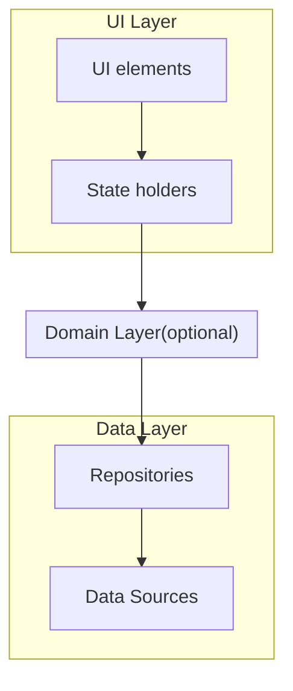
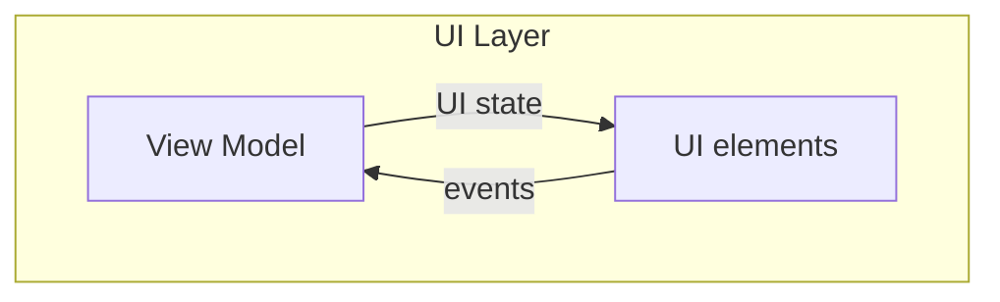
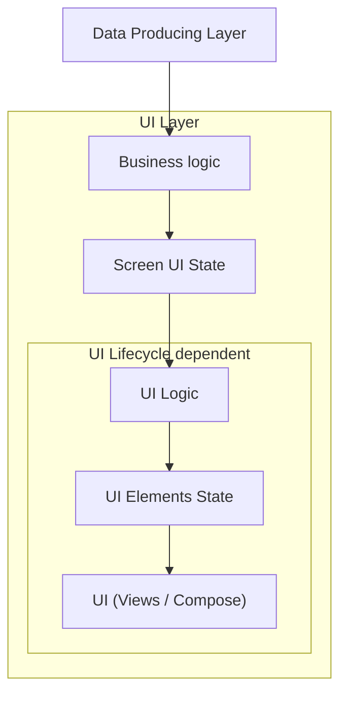
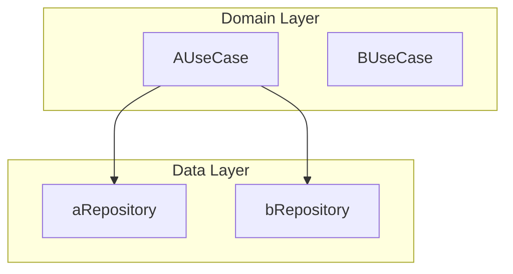

# 아키텍처

## 아키텍처 개요

### 아키텍처란 

> 소프트웨어 아키텍처는 시스템에 대해 추론하는 데 필요한 구조의 집합으로 소프트웨어 요소, 이들 간의 관계 그리고 이 둘의 속성으로 구성된다 - SEI

- 모든 시스템에는 아키텍처가 있다
  - (개발자가 의도하지 않았더라도 어쨌든 아키텍처가 존재한다)
- 아키텍처는 시스템의 추상화이다
- 아키텍처는 시스템 요소와 시스템 요소가 인터페이스를 통해 상호 작용하는 방식을 정의한다
- 아키텍처에는 요소의 구현 세부 정보가 포함되지 않는다
- 구성 요소의 속성은 한 구성 요소가 다른 구성 요소에 대해 만들 수 있는 가정이다
  (제공/필요한 서비스, 성능, 결함 처리 또는 리소스 소비 방법 등)
- 구현에 대한 제약 조건을 부과한다
  - 구현 시에는 요소, 상호작용, 행동, 책임과 같은 설계 결정을 준수해야 한다

### 아키텍처의 장점

- 유지관리하기 쉽다
- 안정성이 높다
- 확장하기 쉽다
- 테스트하기 쉽다
- 디버깅하기 쉽다
- 시스템의 전반적인 구조를 파악하기 쉽다
- 이해 관계자 간 의사 소통을 위한 수단을 제공한다

> [!NOTE]
>
> 모든 설계에는 품질 속성 간의 절충(tradeoff)이 포함됩니다

### 아키텍처의 비용

- 설계부터 구현까지 더 많은 시간이 필요하다. 레이어를 나누지 않고 직접 호출하는 것이 더 쉽다
- 해당 아키텍처에 대한 이해가 없으면 프로젝트를 파악하기 어렵다(온보딩과 같은 상황)
- 코드의 양이 늘어난다. 레이어별로 인터페이스를 설계해야 하기 때문에 중복이 많아지고, 무엇보다 패키지(모듈)의 양이 많이 늘어난다. 
- 웹(프론트엔드)의 경우 번들 사이즈가 늘어나는 것은 확실히 단점이 될 수 있다

> [!NOTE]
>
> 현재 팀과 프로젝트의 상황에 맞게 아키텍처를 축소 조정하여 시간과 코드를 줄일 수 있다

### 아키텍처가 제공하는 것

분할과 정복

- 아키텍처는 정해진 각자의 구조에 따라 소프트웨어를  작게 분할한다
- 분할된 각 부분은 사람이 해결할 수 있을 만큼 작고 문제를 해결하기 더 쉬워진다
- 작은 부분이 어떻게 조립되어 전체가 되는지 추론 가능해야 한다

추상화

- 추상화는 세부 사항을 숨김으로써 문제를 해결하기 쉬운 더 작은 문제로 만들어 크고 복잡한 문제를 효과적으로 해결하는데 도움을 준다

지식

- 아키텍처는 더 나은 소프트웨어를 설계하기 위한 지식을 제공한다

### 조직의 구조를 결정

아키텍처는 조직의 구조를 결정하는데 영향을 준다. 따라서 아키텍처 및 아키텍처에 의한 조직의 구조가 확립되면 변경하기 매우 어렵다

- 수행할 작업을 구체하고 결정
- 계획, 일정 및 예산을 수립
- 팀 간의 커뮤니케이션 채널 구축
- 구성 관리, 테스트, 통합, 배포 및 유지 관리를 위한 계획과 절차 및 아티팩트 설정

### 관심사의 분리

- 영역 별로 의존성을 줄임으로써 각 영역을 최대한 가볍게 유지 한다
- https://en.wikipedia.org/wiki/Separation_of_concerns

### 단일 소스 저장소

- 단일 소스 저장소는 데이터를 하나의 중앙 저장소에서 관리한다
  - https://en.wikipedia.org/wiki/Single_source_of_truth
- 신뢰성 - 중앙 저장소에서 관리하는 데이터는 항상 최신 상태이며 정확해야 한다
- 일관성 - 데이터의 중복으로 인한 불일치 및 동기화 문제를 쉽게 방지할 수 있다
- 데이터 조작을 중앙에서 관리하기 때문에 쉽게 변경이 가능하다
- Redux의 구현과 의도
  - https://blog.isquaredsoftware.com/2017/05/idiomatic-redux-tao-of-redux-part-1/

### 단방향 데이터 흐름

- 상태가 한 방향으로만 흐르도록 설계
- 데이터는 데이터 소스로부터 UI 요소로 한 방향(위에서 아래)으로 흐른다
- 이벤트는 트리거에서 데이터 소스로 반대 방향(아래에서 위)으로 흐른다
- 참고 자료
  - 단방향 데이터 흐름(UDF) - https://en.wikipedia.org/wiki/Unidirectional_data_flow
  - flux 패턴 - https://github.com/facebookarchive/flux

### 제약 조건

제약 조건은 시스템을 제한하여 시스템이 어떻게 되어야(동작해야) 하는지에 대한 것이다

- 제약 조건을 판단을 구체화한다. 
  - 이는 팀원(개발자) 간 이해를 전달하는 수단의 역할도 할 수 있다
- 개념적 무결성을 장려한다
  - 개념적 무결성은 시스템의 핵심 개념이 응집력 있게 함께 작동하도록 보장하는 시스템 속성이다
  - 개념적 무결성 달성의 결과로서 제약은 복잡성을 줄여 기본 원칙이 존재하는 시스템을 만들 수 있다
- 제약은 런타임 동작을 분명하게 이해하도록 할 수 있다

## 안드로이드 앱  권장 아키텍처

### 개요

### UI 레이어(UI Layer)

- 애플리케이션(화면)에 데이터를 표시하는 역할
- 렌더링 흐름
  - ViewModel은 UI 상태를 생성하고 노출한다.
  - UI 요소는 상태를 기반으로 렌더링한다.
  - UI 요소는 사용자로부터 이벤트를 입력받으면 ViewModel에 알린다
  - ViewModel은 이벤트를 처리하고 상태를 업데이트한다.
  - UI 요소는 변경된 상태에 대한 알림을 받고 변경된 데이터를 기반으로 다시 렌더링한다
- **UI 요소(UI elements)**: 화면에 데이터를 **렌더링**하는 UI 요소
- **상태 홀더(state holders)**: 데이터를 보유하고 **UI에 노출**하며 **로직을 처리**하는 상태 홀더
  - 계층 구조의 하위 레이어에서 얻은 결과 데이터를 UI 상태로 변환
  - ViewModel 또는 일반 클래스를 통해 구현
  - 앱이 읽을 수 있도록 상태를 저장하는 책임
  - 로직에 대한 중개자 역할을 통해 데이터 소스에 대한 액세스 권한 제공
- UI 로직과 비지니스 로직의 분리
  - **비지니스 로직**은 구매, 결제, 프로필 수정 등 문제를 해결하기 위한 방법으로 ViewModel, 도메인 레이어, 데이터 레이어에서 처리한다
  - **UI 로직**은 데이터를 표시하기 위한 방법과 관련된 로직으로 UI에서 처리한다

- 수명 주기
  - UI 수명 주기와 무관: 비지니스 로직, 화면 UI 상태
    - 비지니스 로직이나 생성된 UI 상태는 UI 수명 주기와 무관하다
  - UI 수명 주기에 종속: UI 로직
    - UI 로직은 UI 수명 주기나 구성 변경사항의 직접적인 영향을 받는다

### 도메인 레이어(Domain Layer)

- 항상 있는 레이어가 아닌 선택적 레이어
- 복잡한 비즈니스 로직이나 여러 ViewModel에서 재사용되는 간단한 비즈니스 로직의 캡슐화를 담당
- 레이어의 추가는 앱의 복잡성을 증가시키므로 위의 요구사항이 필요할 때만 선택적으로 사용
- 도메인 레이어의 이점
  - 코드 중복 방지
  - 도메인 레이어 클래스를 호출하는 클래스의 가독성을 개선
  - 앱의 테스트 가능성 증가
  - 책임을 분리하여 클래스를 작게 유지
- UseCase(사용사례) 
  - 각 사용 사례는 기능 하나만을 담당하고 변경 가능한 데이터를 포함하지 않는다
  - 변경 가능한 데이터 처리는 UI 레이어 또는 데이터 레이어에서 처리하도록 한다
  - 사용 사례 클래스는 UI레이어(ViewModel)와 데이터 레이어 저장소 사이에 위치
  - 사용 사례 클래스는 일반적으로 저장소 클래스에 종속적이다

### 데이터 레이어(Data Layer)

- 앱의 데이터 생성, 저장, 변경 방식을 결정하는 규칙으로 구성
- **비지니스 로직**이 포함
- 데이터 소스를 포함하는 저장소(리포지토리)로 구성
- 저장소(repositories)의 역할
  - 앱의 나머지 부분에 데이터 노출
  - 데이터 변경사항을 한 곳에 집중
  - 여러 데이터 소스 간의 충돌 해결
  - 앱의 나머지 부분에서 데이터 소스 추상화
  - 비즈니스 로직 포함

### 구성 요소 간 종속성을 관리하는 방법

- 종속성 주입: 클래스가 자신의 종속성을 선언하고 구현한 다음 런타임에서 외부로부터 종속성을 제공 받아 사용
- 서비스 로케이터: 종속성을 한 곳에서 관리하고 필요한 객체를 반환하는 중앙 레지스트리를 사용

https://learn.microsoft.com/ko-kr/dotnet/architecture/microservices/microservice-ddd-cqrs-patterns/

big ball of mud architecture