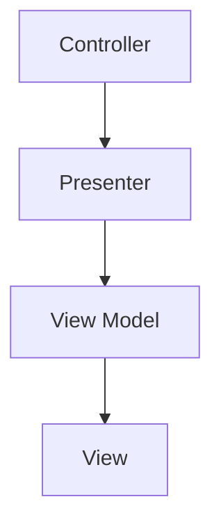

# SOLID 원칙

SOLID 원칙의 목적

- 변경에 유연하다
- 이해하기 쉽다
- 많은 소프트웨어 시스템에 사용될 수 있는 컴포넌트의 기반이 된다

## SRP - 단일 책임 원칙

콘웨이 법칙에 따른 따름정리: 소프트웨어 시스템이 가질 수 있는 최적의 구조는 시스템을 만드는 조직의 사회적 구조에 커다란 영향을 받는다. 따라서 각 소프트웨어 모듈은 변경의 이유가 하나, 단 하나여야만 한다.

- 함수는 하나의 일만 해야 한다 → 큰 함수를 여러 개의 작은 함수들로 분해할 수 있다
- 하나의 모듈은 하나의 액터에 대해서만 책임져야 한다 - 응집성

### 장점

- 유지보수 용이: 영향 범위가 줄어들어 유지보수 용이
- 테스트 용이: 책임이 분리되어 테스트가 간단해짐
- 확장성: 다른 기능에 영향을 주지 않으면서 기능을 변경하거나 확장하기 쉬움

### 징후: 우발적 중복

- 액터가 다른 메서드가 단일 클래스에 함께 배치되는 경우 → 하나의 클래스가 여러 액트의 영향을 모두 받음

```tsx
//❌ 단일 클래스 내에 여러 액트가 연관
class OrderService {
  createOrder(orderData: OrderData) {
    // 주문 생성 로직
  }

  calculateTotal(orderData: OrderData) {
    // 주문 총액 계산 로직
  }

  sendOrderConfirmationEmail(orderData: OrderData) {
    // 이메일 전송 로직
  }
}
// ✅ 액터를 기준으로 클래스를 분리
class OrderCreator {
  create(orderData: OrderData) {
    // 주문 생성 로직
  }
}

class OrderTotalCalculator {
  calculate(orderData: OrderData) {
    // 주문 총액 계산 로직
  }
}

class OrderEmailNotifier {
  sendConfirmation(orderData: OrderData) {
    // 이메일 전송 로직
  }
}
```

> [!NOTE]
> ✨“서로 다른 액터가 의존하는 코드를 분리하라”

## OCP - 개방-폐쇄 원칙

1980년대 버트라트 마이어에 의해 잘 알려진 원칙. 기존 코드를 수정하기 보다는 새로운 코드를 추가하는 방식으로 시스템의 행위를 변경할 수 있도록 설계해야만 소프트웨어 시스템을 쉽게 변경할 수 있다

> [!NOTE]
> ✨“소프트웨어 개체(아티펙트)는 **확장에는 열려 있고**, **변경에는 닫혀 있어야** 한다”

- 기능을 구현하는 시간보다 유지보수하는 시간이 더 많다
- 소프트웨어는 시간이 지남에 따라 기능이 추가될 것으로 예상된다
- 단일 책임 원칙과 의존성 역전 원칙을 활용하여 분리



## LSP - 리스코프 치환 원칙

1988년 바바라 리스코프가 정의한 “하위 타입”에 관한 원칙. 상호 대체 가능한 구성요소를 이용해 소프트웨어 시스템을 만들 수 있으려면, 이들 구성요소는 서로 치환 가능해야 한다는 계약을 반드시 지켜야 한다

- 치환 가능성이 오염되면 이 사실을 처리하기 위해 **중요하고 복잡한 매커니즘을 따로 추가해야** 한다
- 오염이 늘어날수록 유지보수가 어렵고 예측하기 어려워진다

```tsx
// 부모 클래스
class PaymentMethod {
  processPayment(amount: number): void {
    console.log(`Processing payment of ${amount}`);
  }
}

// 자식 클래스
class CreditCardPayment extends PaymentMethod {
  processPayment(amount: number): void {
    console.log(`Processing credit card payment of ${amount}`);
  }
}

class PayPalPayment extends PaymentMethod {
  // ❌LSP 위반: PayPal 결제는 별도의 이메일 확인이 필요하다고 가정
  processPayment(amount: number): void {
    throw new Error("PayPal payments require an email confirmation");
  }
}

// 결제 처리 함수
function handlePayment(paymentMethod: PaymentMethod, amount: number) {
  paymentMethod.processPayment(amount);
  //⚠️PayPal 결제 시 이메일 확인에 대한 if문과 같은 처리 로직을 따로 구현해야 한다
}

// 사용 예
const payment = new PayPalPayment();
handlePayment(payment, 100); // Error 발생: 이메일 확인이 필요
// 부모 클래스
abstract class PaymentMethod {
  abstract processPayment(amount: number): void;
}

// 자식 클래스: 신용카드 결제
class CreditCardPayment extends PaymentMethod {
  processPayment(amount: number): void {
    console.log(`Processing credit card payment of ${amount}`);
  }
}

// 자식 클래스: PayPal 결제
class PayPalPayment extends PaymentMethod {
  processPayment(amount: number): void {
    // ✅이메일 확인 로직은 내부에서 처리
    console.log(`Processing PayPal payment of ${amount}`);
    this.verifyEmail();
  }

  private verifyEmail(): void {
    console.log("Email verified for PayPal payment");
  }
}

// 결제 처리 함수
function handlePayment(paymentMethod: PaymentMethod, amount: number) {
  paymentMethod.processPayment(amount);
}

// 사용 예
const creditCardPayment = new CreditCardPayment();
handlePayment(creditCardPayment, 100); // "Processing credit card payment of 100"

const payPalPayment = new PayPalPayment();
handlePayment(payPalPayment, 100); // "Processing PayPal payment of 100" 및 이메일 확인
```

## ISP - 인터페이스 분리 원칙

소프트웨어 설계자는 사용하지 않은 것에 의존하지 않아야 한다

- 사용하는 것에만 의존해야 한다
- 불필요한 의존성을 만들지 않는다
- 필요한 인터페이스만 최소한으로 가져오기

```tsx
// 인터페이스 분리
interface ProductPreview {
  id: number;
  name: string;
  price: number;
  images: string[];
}

interface ProductDetails extends ProductPreview {
  description: string;
  stock: number;
  manufacturer: string;
  warranty: string;
}

// 상품 미리보기 컴포넌트
function ProductCard(product: ProductPreview) {
  return (
    <div>
      <h2>{product.name}</h2>
      <p>{product.price}</p>
      
    </div>
  );
}

// 상품 상세 페이지
function ProductDetailsPage(product: ProductDetails) {
  return (
    <div>
      <h1>{product.name}</h1>
      <p>{product.description}</p>
      <p>{product.price}</p>
      <p>Manufacturer: {product.manufacturer}</p>
      <p>Warranty: {product.warranty}</p>
      <div>{product.stock > 0 ? "In Stock" : "Out of Stock"}</div>
    </div>
  );
}
```

## DIP - 의존성 역전 원칙

고수준 정책을 구현하는 코드는 저수준 세부사항을 구현하는 코드에 절대로 의존해서는 안된다. 대신 세부사항이 정책에 의존해야 한다

> [!NOTE]
> ✨DI 에서 유연성이 극대화된 시스템이란 소스 코드 의존성이 추상(abstraction)에 의존하고 구체(concretion)에는 의존하지 않는 시스템이다

```tsx
// 저수준 모듈: 구체적인 추천 전략
class PopularProductRecommendation {
  getRecommendations(): string[] {
    return ["Product 1", "Product 2", "Product 3"];
  }
}

class PersonalizedRecommendation {
  getRecommendations(userId: number): string[] {
    return [`Personalized Product for user ${userId}`];
  }
}

// 고수준 모듈: 추천 서비스
class RecommendationService {
  private popularProductRecommendation: PopularProductRecommendation;
  private personalizedRecommendation: PersonalizedRecommendation;

  constructor() {
    this.popularProductRecommendation = new PopularProductRecommendation();
    this.personalizedRecommendation = new PersonalizedRecommendation();
  }

  getRecommendations(type: string, userId?: number): string[] {
    if (type === "popular") {
      return this.popularProductRecommendation.getRecommendations();
    } else if (type === "personalized" && userId !== undefined) {
      return this.personalizedRecommendation.getRecommendations(userId);
    }
    return [];
  }
}
// 추상화: 추천 전략 인터페이스
interface RecommendationStrategy {
  getRecommendations(userId?: number): string[];
}

// 저수준 모듈: 인기 상품 추천
class PopularProductRecommendation implements RecommendationStrategy {
  getRecommendations(): string[] {
    return ["Product 1", "Product 2", "Product 3"];
  }
}

// 저수준 모듈: 사용자 맞춤 추천
class PersonalizedRecommendation implements RecommendationStrategy {
  getRecommendations(userId: number): string[] {
    return [`Personalized Product for user ${userId}`];
  }
}

// 고수준 모듈: 추천 서비스
class RecommendationService {
  private recommendationStrategy: RecommendationStrategy;

  constructor(recommendationStrategy: RecommendationStrategy) {
    this.recommendationStrategy = recommendationStrategy;
  }

  getRecommendations(userId?: number): string[] {
    return this.recommendationStrategy.getRecommendations(userId);
  }
}

// 사용 예
const popularRecommendation = new PopularProductRecommendation();
const recommendationService1 = new RecommendationService(popularRecommendation); // 외부에서 주입
console.log(recommendationService1.getRecommendations()); // ["Product 1", "Product 2", "Product 3"]

const personalizedRecommendation = new PersonalizedRecommendation();
const recommendationService2 = new RecommendationService(
  personalizedRecommendation
);
console.log(recommendationService2.getRecommendations(123)); // ["Personalized Product for user 123"]
```
