## 제2장: 복잡성의 본질(The Nature of Complexity)

소프트웨어 개발의 세계에서 우리가 맞서 싸워야 할 가장 교활하고 끈질긴 적은 무엇일까요? 스탠퍼드 대학교의 존 아우스터하우트(John Ousterhout) 교수는 그의 저서 "소프트웨어 설계의 철학(A Philosophy of Software Design)"에서 그 답을 명확히 제시합니다. 바로 **'복잡성(Complexity)'** 입니다. 이 책의 제2장은 이 근원적인 적, 복잡성의 본질을 해부하고, 우리가 왜 이것과 싸워야만 하는지를 심도 있게 탐구합니다. 이 글은 제2장의 모든 핵심 정보를 담아, 원서의 내용을 접하지 않은 분들도 그 깊이를 온전히 이해할 수 있도록 기술 아티클 형식으로 재구성한 것입니다.


### 1. 복잡성이란 무엇인가?: 실용적 정의와 측정

소프트웨어 설계에 대해 논하기 전에, 우리는 먼저 우리가 싸워야 할 대상의 정체를 명확히 해야 합니다. 아우스터하우트 교수는 복잡성에 대한 학술적이거나 추상적인 정의 대신, 개발자가 현장에서 직접 체감하는 실용적인 관점에서 복잡성을 정의합니다. 이 정의는 책 전체를 관통하는 가장 중요한 기초가 되므로, 그 의미를 깊이 새겨둘 필요가 있습니다.

> **복잡성(Complexity)** 이란 소프트웨어 시스템의 구조와 관련된 모든 것으로, **시스템을 이해하고 수정하기 어렵게 만드는 그 어떤 것** 을 의미한다.
> (Complexity is anything related to the structure of a software system that makes it hard to understand and modify the system.)

이 정의는 복잡성을 시스템의 기능이 얼마나 많거나 정교한지로 판단하지 않는다는 점에서 매우 중요합니다. 아무리 거대하고 복잡한 기능을 가진 시스템이라도, 개발자가 그 구조를 쉽게 이해하고 원하는 부분을 손쉽게 수정할 수 있다면, 이 책의 관점에서는 '복잡하지 않은' 시스템입니다. 반대로, 기능은 몇 개 없지만 코드를 한 줄 고치기 위해 시스템 전체를 뜯어봐야 하고, 수정에 대한 부작용을 예측하기 어렵다면 그것은 '복잡한' 시스템입니다. 즉, 복잡성은 개발자의 경험과 직접적으로 연결된 개념입니다.

저자는 시스템의 전체 복잡도를 다음과 같은 개념적인 수식으로 표현합니다.

```
C = Σ cp * tp
p
```

* `C`: 시스템의 총 복잡도 (Overall complexity of a system)
* `p`: 시스템의 각 부분 (each part of the system)
* `cp`: 각 부분 `p`의 복잡도 (complexity of part `p`)
* `tp`: 개발자가 해당 부분 `p`에서 작업하는 시간의 비율 (fraction of time developers spend working on part `p`)

이 수식은 우리에게 두 가지 중요한 통찰을 줍니다. 첫째, 시스템의 모든 부분이 복잡도에 동일하게 기여하는 것이 아니라는 점입니다. 개발자들이 거의 들여다보지 않거나 수정할 일이 없는 부분의 복잡성은 시스템 전체에 미치는 영향이 미미합니다. 반면, 개발자들이 자주 수정하고 작업해야 하는 부분의 복잡성은 `tp` 값이 크기 때문에 시스템의 총 복잡도에 지대한 영향을 미칩니다. 둘째, 복잡성을 특정 부분에 고립시키는 것만으로도 큰 효과를 볼 수 있다는 것입니다. 복잡한 로직을 완전히 제거하는 것이 최선이지만, 그것을 피할 수 없다면 자주 변경되지 않는 안정적인 모듈 내부에 완벽하게 감추는 것(정보 은닉)이 차선책이 될 수 있습니다.

마지막으로 기억해야 할 점은, 복잡성은 코드를 작성하는 사람보다 읽는 사람에게 더 명확하게 보인다는 사실입니다. 내가 작성한 코드는 내 머릿속의 모든 맥락과 함께 존재하기 때문에 단순해 보일 수 있습니다. 하지만 아무런 배경지식 없이 그 코드를 처음 접하는 동료가 복잡하다고 느낀다면, 그것은 복잡한 코드가 맞습니다. 훌륭한 개발자는 '나'만이 아니라 '우리'가 쉽게 작업할 수 있는 코드를 만들어야 합니다.

---


### 2. 복잡성의 세 가지 징후: 당신의 코드가 보내는 위험 신호

복잡성은 눈에 보이지 않는 유령과 같아서, 그 실체를 파악하기 어렵습니다. 하지만 복잡성이 시스템에 쌓이기 시작하면, 명확한 '징후'들을 드러내기 시작합니다. 아우스터하우트 교수는 개발자가 일상적으로 겪는 어려움 속에서 복잡성의 세 가지 핵심 징후를 포착했습니다. 이 징후들을 민감하게 감지하는 능력은 훌륭한 소프트웨어 설계자가 되기 위한 첫걸음입니다.


#### 2.1. 변경 증폭 (Change Amplification)

변경 증폭은 복잡성의 가장 흔하고 명백한 징후입니다. 이는 **논리적으로는 아주 간단한 변경임에도 불구하고, 실제로는 시스템의 여러 다른 위치에 있는 코드를 수정해야만 하는 현상** 을 말합니다. 예를 들어, 웹사이트의 모든 페이지 상단에 있는 배너의 배경색을 바꾸는 작업을 상상해 봅시다. 만약 이 색상 값이 각 HTML 페이지마다 하드코딩되어 있다면, 디자이너의 간단한 요청 하나가 수백, 수천 개의 파일을 일일이 수정해야 하는 거대한 작업으로 비화될 것입니다. 이것이 바로 변경 증폭입니다.

이러한 문제를 해결하기 위해 현대 웹 개발에서는 CSS 변수나 설정 파일 등을 사용하여 색상 값을 한 곳에서 중앙 관리합니다. 이렇게 하면 단 한 줄의 코드 수정만으로 전체 사이트의 배너 색상을 변경할 수 있습니다. 좋은 설계는 이처럼 각 설계 결정이 미치는 영향의 범위를 최소화하여, 변경 증폭을 억제하는 것을 목표로 합니다.

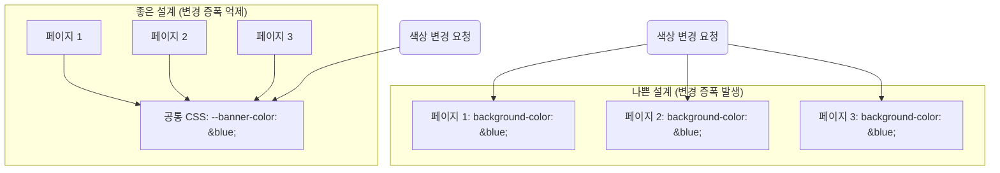

<p align="center"><b>[그림 1] 변경 증폭의 예시와 해결책</b></p>

위 다이어그램처럼, 나쁜 설계에서는 변경 요청이 모든 개별 페이지에 영향을 주지만, 좋은 설계에서는 단일 지점(공통 CSS)에만 영향을 미칩니다.


#### 2.2. 인지 부하 (Cognitive Load)

인지 부하는 **특정 작업을 완료하기 위해 개발자가 머릿속에 알고 있어야 하는 정보의 총량** 을 의미합니다. 인지 부하가 높을수록 개발자는 필요한 정보를 학습하는 데 더 많은 시간을 소요하게 되며, 미처 파악하지 못한 중요한 정보 때문에 버그를 만들 위험도 커집니다. 시스템 설계자들은 종종 코드의 라인 수(Lines of Code)로 복잡성을 측정하려는 경향이 있지만, 이는 인지 부하의 비용을 간과하는 큰 실수입니다.

예를 들어, C 언어에서 메모리를 할당하는 함수가 있다고 가정해 봅시다.

```c
// 사용자는 이 함수가 반환한 메모리를 반드시 free() 해줘야 함을 알아야 한다.
char* allocate_string(const char* initial_value); 
```

위 함수를 사용하는 개발자는 '반환된 메모리는 반드시 호출자가 해제해야 한다'는 사실을 항상 기억하고 있어야 합니다. 만약 이 사실을 잊거나 모른다면, 메모리 누수(memory leak)라는 심각한 버그가 발생할 것입니다. 이는 개발자에게 상당한 인지 부하를 안겨줍니다. 만약 시스템 구조를 변경하여, 메모리를 할당한 모듈이 해제까지 책임지도록 만들 수 있다면(예: RAII 패턴), 사용자는 메모리 관리에 대해 신경 쓸 필요가 없어져 인지 부하가 크게 줄어듭니다. 수많은 메서드를 가진 API, 전역 변수, 모듈 간의 숨겨진 의존성 등은 모두 인지 부하를 높이는 주범입니다.

때로는 더 많은 라인의 코드가 실제로는 더 단순할 수 있습니다. 몇 줄 안되는 코드로 마법 같은 일을 하는 프레임워크가 있다고 합시다. 그 몇 줄의 코드를 작성하기 위해 개발자가 프레임워크의 방대한 내부 동작 원리를 모두 학습해야 한다면, 이는 인지 부하가 매우 높은 복잡한 설계입니다. 반면, 조금 더 많은 코드를 작성하더라도 그 흐름이 명확하고 직관적이라면, 그것이 오히려 더 단순한 설계일 수 있습니다.


#### 2.3. 미지의 불확실성 (Unknown Unknowns)

세 가지 징후 중 가장 최악이자 가장 위험한 것이 바로 '미지의 불확실성'입니다. 이는 **어떤 작업을 완료하기 위해 무엇을 수정해야 하는지, 또는 어떤 정보를 알아야 하는지조차 명확하지 않은 상태** 를 의미합니다. '내가 무엇을 모르는지조차 모르는' 상황입니다. 이러한 시스템에서는 변경 작업을 시작하기 전에 확신을 가질 수 없으며, 변경이 완료된 후에도 숨겨진 버그가 나타날 때까지 문제를 인지하지 못할 수 있습니다.

다시 웹사이트 배너 예시로 돌아가 봅시다. 모든 페이지의 배너 색상은 중앙 변수(`bannerBg`)를 참조하도록 잘 설계된 것처럼 보입니다. 하지만 몇몇 특별한 페이지에서는 강조 효과를 위해 배너 색상보다 약간 더 어두운 색상을 별도로 하드코딩하여 사용하고 있습니다.

* `page_normal.html` -> `bannerBg` 참조
* `page_special.html` -> `darker_blue` 하드코딩

이 상황에서 개발자가 `bannerBg` 변수의 색상을 파란색에서 빨간색으로 변경했다고 상상해 봅시다. 개발자는 이 변경이 모든 페이지에 일관되게 적용될 것이라 기대하지만, 실제로는 특별 페이지의 강조 색상은 여전히 `darker_blue`로 남아있어 전체적인 디자인 통일성이 깨지는 버그가 발생합니다. 더 심각한 문제는, 개발자가 '강조 색상'의 존재 자체를 모를 수 있다는 것입니다. 어떤 페이지를 확인해야 하는지, 혹은 확인해야 할 무언가가 있다는 사실조차 알 길이 없습니다. 확신을 얻는 유일한 방법은 시스템의 모든 코드를 한 줄 한 줄 읽어보는 것이지만, 이는 현실적으로 불가능합니다.

* **변경 증폭** 은 귀찮지만, 어디를 고쳐야 할지는 명확합니다.
* **높은 인지 부하** 는 학습 비용이 크지만, 무엇을 공부해야 할지는 명 "확합니다.
* **미지의 불확실성** 은 내가 무엇을 해야 할지, 내 해결책이 맞는지조차 불확실하게 만듭니다.

따라서 좋은 설계의 가장 중요한 목표 중 하나는 시스템을 **'명확하게(obvious)'** 만드는 것입니다. 명확한 시스템이란, 개발자가 깊은 고민 없이 내린 첫 번째 추측이 대부분 올바르게 동작하는 시스템을 의미합니다.

---


### 3. 복잡성을 유발하는 두 가지 근본 원인

지금까지 우리는 복잡성의 징후들을 살펴보았습니다. 그렇다면 이러한 징후들을 만들어내는 근본적인 원인은 무엇일까요? 아우스터하우트 교수는 복잡성의 모든 원인이 결국 두 가지, **'의존성(Dependencies)'** 과 **'모호함(Obscurity)'** 으로 귀결된다고 설명합니다.


#### 3.1. 의존성 (Dependencies)

의존성은 **어떤 코드 조각을 그 자체만으로는 독립적으로 이해하고 수정할 수 없을 때 존재** 합니다. 즉, 해당 코드를 변경하기 위해서는 다른 코드를 함께 고려하거나 수정해야만 하는 관계를 의미합니다. 사실, 소프트웨어에서 의존성을 완전히 제거하는 것은 불가능합니다. 우리가 새로운 클래스를 작성하는 행위 자체가 그 클래스의 API를 중심으로 새로운 의존성을 만들어내는 과정이기 때문입니다.

따라서 소프트웨어 설계의 목표는 의존성을 없애는 것이 아니라, **(1) 불필요한 의존성의 수를 줄이고, (2) 남겨진 의존성을 최대한 단순하고 명확하게 만드는 것** 입니다.

앞서 들었던 웹사이트 배너의 색상 예시를 다시 생각해 봅시다.

* **나쁜 설계** : 모든 웹페이지가 서로 동일한 배경색을 가져야 한다는 '암묵적인' 의존성을 가집니다. 이 의존성은 코드 어디에도 명시적으로 드러나지 않으며, 관리하기가 매우 어렵습니다.
* **좋은 설계** : 각 웹페이지는 중앙의 `bannerBg` 변수에 '명시적인' 의존성을 가집니다. 이 의존성은 `bannerBg`라는 이름을 통해 명확하게 드러나며, 이름을 검색하는 것만으로도 모든 의존 관계를 쉽게 파악할 수 있습니다. 컴파일러는 이 변수 이름이 변경될 경우 오류를 발생시켜 의존성 관리를 도와주기까지 합니다.

결국, 좋은 설계란 관리하기 어렵고 모호한 의존성을 관리하기 쉽고 명확한 의존성으로 대체하는 과정이라고 할 수 있습니다.


#### 3.2. 모호함 (Obscurity)

모호함은 **중요한 정보가 코드로부터 명확하게 드러나지 않을 때 발생** 합니다. 이는 '미지의 불확실성'을 만들어내는 주된 원인입니다. 예를 들어, `time`이라는 변수명이 있다고 합시다. 이 변수가 초 단위인지, 밀리초 단위인지, 아니면 유닉스 타임스탬프인지 이름만 봐서는 알 수 없습니다. 단위를 알아내기 위해 코드 전체를 뒤져봐야 한다면, 이것이 바로 모호함입니다.

모호함은 종종 부적절한 문서화 때문에 발생하지만, 근본적으로는 설계의 문제인 경우가 많습니다. 시스템이 깨끗하고 명확한 설계를 가지고 있다면, 필요한 문서의 양도 줄어듭니다. 만약 어떤 기능을 설명하기 위해 장황한 문서가 필요하다면, 이는 종종 설계가 잘못되었다는 신호(red flag)일 수 있습니다. 모호함을 줄이는 가장 좋은 방법은 시스템 설계를 단순화하는 것입니다.

이 두 가지 원인과 세 가지 징후의 관계는 다음과 같이 정리할 수 있습니다.

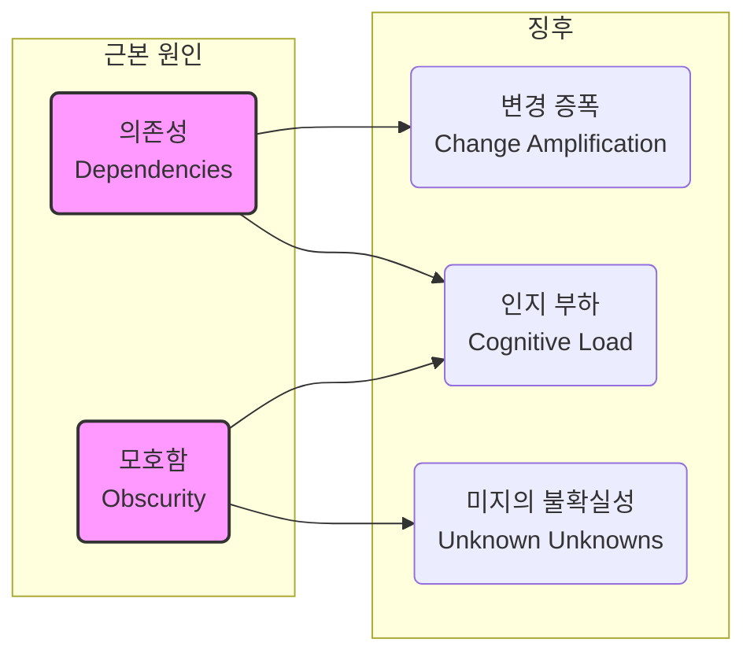

<p align="center"><b>[그림 2] 복잡성의 원인과 징후의 관계</b></p>

결국 우리가 소프트웨어 설계를 통해 복잡성을 줄인다는 것은, **의존성과 모호함이라는 두 가지 근본 원인을 최소화하는 기술** 을 연마하는 것과 같습니다.

---


### 4. 복잡성의 점진적 특성: 서서히 끓는 냄비 속의 개구리

복잡성이 무서운 가장 큰 이유 중 하나는 그것이 **한 번의 치명적인 실수로 발생하는 것이 아니라, 수많은 사소한 것들이 쌓여서 점진적으로 축적된다** 는 점입니다. 단 하나의 잘못된 의존성이나 모호한 변수명 하나가 시스템의 유지보수성에 큰 영향을 미치는 경우는 드뭅니다. 복잡성은 수백, 수천 개의 이런 작은 문제들이 오랜 시간에 걸쳐 쌓이고 쌓여, 결국 시스템의 어느 부분을 변경하려 해도 여러 문제에 발목이 잡히는 상태가 될 때 비로소 그 파괴력을 드러냅니다.

이러한 점진적 특성 때문에 복잡성을 제어하기는 매우 어렵습니다. 개발자는 현재 맡은 작업을 빠르게 끝내기 위해 "이번 한 번만 약간의 복잡성을 추가하는 건 괜찮아"라고 스스로를 합리화하기 쉽습니다. 하지만 모든 개발자가 모든 변경 작업에서 이런 태도를 취한다면, 복잡성은 눈덩이처럼 불어나게 됩니다. '끓는 냄비 속의 개구리' 우화처럼, 서서히 증가하는 복잡성을 인지하지 못하다가, 마침내 시스템이 손쓸 수 없는 지경에 이르렀을 때 문제를 깨닫게 되는 것입니다.

일단 복잡성이 시스템에 만연하게 되면, 그것을 제거하기는 더욱 어렵습니다. 단 하나의 의존성을 개선하는 것만으로는 시스템 전체에 거의 아무런 긍정적 효과를 주지 못하기 때문에, 개선을 위한 동기를 부여받기 힘듭니다. 따라서 복잡성의 증가를 늦추기 위해서는, **복잡성에 대한 '무관용(zero tolerance)' 철학** 을 가져야만 합니다. 모든 변경 작업에서, 사소해 보이는 작은 복잡성조차도 만들지 않으려는 노력이 필요합니다.


### 결론: 적을 알아야 백전불패

제2장 '복잡성의 본질'은 "소프트웨어 설계 철학" 전체를 떠받치는 주춧돌과 같습니다. 이 장은 우리가 싸워야 할 적, '복잡성'의 실체를 명확히 규정하고, 그것이 어떻게 우리의 발목을 잡는지 구체적인 징후(변경 증폭, 인지 부하, 미지의 불확실성)를 통해 보여줍니다. 또한, 이러한 징후들이 결국 의존성과 모호함이라는 두 가지 근본 원인에서 비롯됨을 밝히고, 복잡성이 점진적으로 축적되는 위험성을 경고합니다.

결국, 복잡성은 시스템을 수정하기 어렵고 위험하게 만듭니다. 새로운 기능을 추가하는 데 점점 더 많은 코드 수정이 필요하게 되고, 개발자는 변경 작업을 안전하게 수행하기 위한 정보를 얻는 데 대부분의 시간을 허비하게 됩니다. 최악의 경우, 필요한 정보가 무엇인지조차 알 수 없는 상태에 빠집니다. 이 장에서 설명한 복잡성의 본질을 깊이 이해하는 것은, 이후의 장들에서 제시될 구체적인 설계 원칙과 기술들이 왜 필요한지를 깨닫게 해주는 필수적인 과정입니다. 적을 정확히 알았으니, 이제 우리는 그 적을 물리칠 방법을 배울 준비가 된 것입니다.

------


## 제3장: 동작하는 코드는 충분하지 않다(Working Code Isn’t Enough)

우리는 흔히 소프트웨어 개발의 목표를 '요구사항에 맞춰 동작하는 코드를 만드는 것'으로 생각합니다. 버그 없이 기능이 구현되면, 개발자의 임무는 완수된 것처럼 보입니다. 그러나 존 아우스터하우트 교수는 그의 저서 "소프트웨어 설계의 철학" 제3장에서 이러한 통념에 정면으로 반기를 듭니다. 그는 "동작하는 코드는 충분하지 않다(Working Code Isn't Enough)"고 단언하며, 개발자의 마음가짐이 장기적인 프로젝트의 성패를 가르는 가장 중요한 요소임을 역설합니다. 이 글은 제3장의 핵심 사상을 깊이 있게 분석하고, '전술적 프로그래밍'의 함정과 '전략적 프로그래밍'의 가치를 탐구하여, 단순한 코더를 넘어 진정한 소프트웨어 설계자로 거듭나는 길을 제시합니다.


### 1. 단기적 성과의 함정: 전술적 프로그래밍 (Tactical Programming)

대부분의 개발자들이 무의식적으로 따르는 개발 방식은 저자가 '전술적 프로그래밍'이라고 명명한 접근법입니다. 이 방식의 유일하고 절대적인 목표는 '주어진 기능을 최대한 빨리 동작하게 만드는 것'입니다. 마감일이 코앞에 닥쳤거나, 당장 눈앞의 버그를 해결해야 할 때, 우리는 자연스럽게 가장 빠른 길을 찾게 됩니다. 이 관점에서 보면, 전술적 프로그래밍은 매우 합리적이고 당연해 보입니다. 하지만 저자는 이 방식이 좋은 시스템 설계를 거의 불가능하게 만드는 주범이라고 경고합니다.

전술적 프로그래밍의 가장 큰 문제는 그 근시안적인 속성에 있습니다. 당장의 과업을 완수하는 데 모든 초점이 맞춰져 있기 때문에, 미래를 위한 설계나 장기적인 구조에 대한 고민은 뒷전으로 밀려납니다. "일단 되게 만들고, 나중에 고치자"라는 자기 합리화 속에서 약간의 복잡성이나 임시방편(kludge)을 추가하는 것을 대수롭지 않게 여기게 됩니다. 바로 이 지점에서 시스템의 복잡성은 서서히, 그리고 확실하게 증식하기 시작합니다. 2장에서 강조했듯이, 복잡성은 한 번의 큰 실수가 아닌 수많은 작은 타협들이 모여 만들어집니다. 전술적 프로그래밍은 매일의 개발 과정에서 바로 그 '작은 타협'을 양산하는 공장과도 같습니다.

이러한 작은 복잡성들이 쌓이면 얼마 지나지 않아 문제를 일으키기 시작합니다. 하지만 그때가 되면 개발자는 "지금은 기존 코드를 리팩토링하는 것보다 다음 기능을 구현하는 게 더 중요해"라고 또다시 합리화합니다. 결국 문제를 근본적으로 해결하는 대신, 기존 문제 위에 또 다른 임시방편을 덧씌우는 악순환이 반복됩니다. 이 과정이 반복되면 코드는 누구도 손대기 힘든 '스파게티'가 되어버리고, 그때는 이미 시스템을 바로잡기 위해 수개월의 노력이 필요한 상태가 됩니다. 결국 전술적 길에 한번 들어서면, 빠져나오기란 거의 불가능에 가깝습니다.

> **전술적 토네이도 (The Tactical Tornado)**
>
> 거의 모든 개발 조직에는 전술적 프로그래밍을 극단적으로 추구하는 '전술적 토네이도'가 존재합니다. 이들은 다른 사람보다 월등히 빠른 속도로 코드를 쏟아내는 다작 프로그래머입니다. 당장 빠른 기능 구현이 필요할 때, 전술적 토네이도를 능가할 사람은 없습니다. 어떤 조직에서는 이들을 영웅으로 대접하기도 합니다. 하지만 이들이 지나간 자리에는 파괴의 흔적만이 남습니다. 미래에 그 코드를 유지보수해야 하는 동료 엔지니어들에게 이들은 결코 영웅이 아닙니다. 결국 다른 엔지니어들이 이들이 남긴烂摊子(난장판)를 수습해야 하며, 이 과정에서 정작 진짜 영웅인 이들의 개발 속도는 전술적 토네이도보다 느리게 보이게 됩니다.

---


### 2. 장인의 길: 전략적 프로그래밍 (Strategic Programming)

훌륭한 소프트웨어 설계자가 되기 위한 첫걸음은 '동작하는 코드는 충분하지 않다'는 사실을 깨닫는 것입니다. 현재의 작업을 더 빨리 끝내기 위해 불필요한 복잡성을 시스템에 추가하는 것은 결코 용납될 수 없습니다. 저자는 개발자의 가장 중요한 임무가 단순히 현재의 코드를 작성하는 것이 아니라, 미래에 이루어질 수많은 확장을 용이하게 만드는 것이라고 말합니다. 따라서 개발자의 최우선 목표는 '어쩌다 보니 동작하기도 하는, 훌륭한 설계'를 만들어내는 것이어야 합니다. 이것이 바로 '전략적 프로그래밍'의 핵심입니다.

전략적 프로그래밍은 **'투자'의 마음가짐** 을 요구합니다. 당장 가장 빠른 길을 택하는 대신, 시스템의 설계를 개선하기 위해 의식적으로 시간을 투자해야 합니다. 이러한 투자는 단기적으로는 개발 속도를 늦추는 것처럼 보이지만, 장기적으로는 비교할 수 없을 만큼 빠른 속도를 가져다줍니다. 전략적 프로그래밍에서 이루어지는 투자는 크게 두 가지로 나눌 수 있습니다.

* **선제적 투자 (Proactive Investment)**
  * 새로운 클래스를 설계할 때, 처음 떠오른 아이디어를 그대로 구현하는 대신 여러 대안을 탐색하고 가장 깔끔한 설계를 선택하는 데 시간을 쏟는 행위입니다.
  * 미래에 이 시스템이 어떻게 변경될 수 있을지 잠시 상상해보고, 그러한 변경이 용이한 구조를 만드는 것입니다.
  * 단순히 코드를 작성하는 것뿐만 아니라, 다른 개발자들이 코드를 쉽게 이해할 수 있도록 양질의 문서(주석)를 작성하는 것 또한 중요한 선제적 투자입니다.

* **대응적 투자 (Reactive Investment)**
  * 아무리 초기에 많은 투자를 하더라도, 설계상의 실수는 필연적으로 발생합니다. 시간이 지나면서 이러한 실수들은 명확하게 드러나게 됩니다.
  * 설계상의 문제를 발견했을 때, 그것을 무시하거나 임시방편으로 덮어두는 대신, 약간의 추가 시간을 들여 근본적으로 문제를 해결하는 행위입니다.
  * 전략적으로 프로그래밍하는 개발자는 지속적으로 시스템 설계를 조금씩 개선해나갑니다. 이는 작은 복잡성을 계속해서 추가하는 전술적 프로그래밍과 정확히 반대되는 접근법입니다.

전략적 프로그래밍은 완벽한 설계를 한 번에 해내려는 시도가 아닙니다. 그것은 폭포수 모델의 실패가 증명했듯 불가능합니다. 대신, **지속적으로 작은 투자를 반복하여 시스템을 점진적으로 위대한 설계로 가꾸어 나가는 과정** 입니다.

---


### 3. 투자 모델: 얼마나, 그리고 언제까지?

전략적 프로그래밍이 '투자'라면, 우리는 얼마나 투자해야 하고 그 투자는 언제쯤 수익으로 돌아오는지 알아야 합니다. 저자는 자신의 오랜 경험을 바탕으로 현실적인 가이드라인을 제시합니다. 그는 **총 개발 시간의 약 10~20%를 설계 개선을 위한 투자에 사용할 것을 제안합니다.** 이 수치는 기존 개발 일정에 큰 부담을 주지 않으면서도, 시간이 지남에 따라 의미 있는 이점을 만들어낼 수 있을 만큼 충분히 큰 규모입니다.

이 투자 모델을 따르면, 초기 프로젝트들은 순수하게 전술적으로 개발했을 때보다 10% ~ $20% 더 오래 걸릴 것입니다. 하지만 이 추가 시간은 더 나은 소프트웨어 설계라는 결과물로 나타나며, 그 이점은 불과 몇 개월 내에 나타나기 시작합니다. 머지않아 당신은 전술적으로 개발했을 경우보다 최소 10% ~ 20% 더 빠르게 개발하고 있는 자신을 발견하게 될 것입니다. 이 시점이 바로 **'손익분기점'** 입니다. 이 지점부터 당신의 투자는 더 이상 비용이 아닙니다. 과거의 투자로 얻은 생산성 향상이 미래의 투자를 위한 시간을 벌어주기 때문입니다.

이 현상을 시각적으로 표현하면 다음과 같습니다.

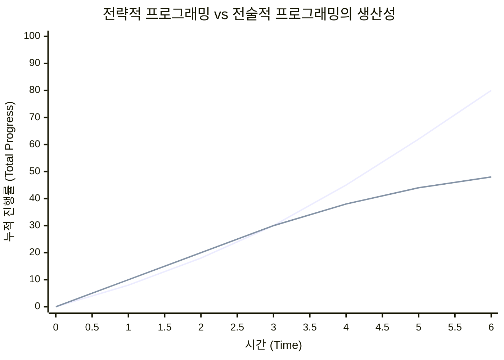

<p align="center"><b>[그림 3] 시간에 따른 개발 진행률 비교 (저서의 그림 3.1 기반)</b></p>

위 그래프에서 볼 수 있듯이, 초기에는 전술적 접근이 더 빠르게 진행되는 것처럼 보입니다. 하지만 시간이 지남에 따라 복잡성이 빠르게 축적되면서 생산성이 급격히 저하됩니다. 반면, 전략적 접근은 초기에 다소 느리지만, 깨끗한 설계를 기반으로 꾸준히 높은 생산성을 유지하며 결국 훨씬 더 많은 성과를 이루어냅니다.

> **기술 부채 (Technical Debt)**
>
> 전술적 프로그래밍으로 인해 발생하는 문제들은 종종 '기술 부채'라는 용어로 설명됩니다. 지금 당장 빠른 개발 속도를 얻기 위해 미래의 시간을 빌려 쓰는 것과 같습니다. 하지만 금융 부채와 마찬가지로, 당신이 갚아야 할 총량은 빌린 양보다 항상 더 큽니다. 더 심각한 것은, 대부분의 기술 부채는 완전히 상환되지 않는다는 점입니다. 당신은 그 이자를 영원히, 그리고 계속해서 지불하게 될 것입니다.

그렇다면 이 그래프의 교차점, 즉 전략적 투자가 이익으로 돌아오기 시작하는 시점은 언제일까요? 저자는 통제된 실험 데이터는 없지만, 개인적인 의견으로는 **6개월에서 18개월 사이** 일 것이라고 추정합니다. 이는 개발자의 기억력과 밀접한 관련이 있습니다. 코드를 작성하고 몇 달만 지나도 개발자는 그 코드를 작성할 때 머릿속에 있던 수많은 맥락을 잊어버립니다. 만약 코드가 복잡하다면, 그 코드를 다시 이해하고 수정하는 데 드는 추가적인 인지 비용이 초기에 얻었던 작은 시간적 이득을 금방 상쇄하고도 남기 때문입니다.

---


### 4. 스타트업의 딜레마: 현실 세계의 케이스 스터디

어떤 환경, 특히 초기 단계의 스타트업은 전략적 접근을 방해하는 강력한 압박이 존재합니다. 생존을 위해 최대한 빨리 초기 버전을 출시해야 한다는 압박감 속에서, 10~20%의 투자조차 사치처럼 느껴질 수 있습니다. 그 결과 많은 스타트업이 전술적 접근을 택하며, 설계와 코드 정리에 거의 시간을 쓰지 않습니다. 그들은 "일단 성공하면, 돈으로 엔지니어를 더 고용해서 정리하면 된다"고 합리화합니다.

하지만 저자는 이러한 생각이 매우 위험하다고 경고합니다. 한번 스파게티가 된 코드베이스는 거의 고치는 것이 불가능에 가깝기 때문입니다. 또한, 좋은 설계와 나쁜 설계의 성과는 생각보다 빨리 나타나므로, 전술적 접근이 첫 제품 출시를 앞당겨주지도 못할 가능성이 높습니다. 무엇보다 중요한 것은, 회사의 성공에 가장 큰 영향을 미치는 요소 중 하나는 엔지니어의 수준이라는 점입니다. 최고의 엔지니어들은 좋은 설계에 대한 깊은 열정을 가지고 있습니다. 만약 당신의 코드베이스가 엉망이라는 소문이 퍼진다면, 최고의 인재를 유치하기는 어려워질 것이고, 이는 결국 미래의 개발 비용을 증가시키고 시스템의 품질을 더욱 악화시키는 악순환으로 이어질 것입니다.

저자는 이 딜레마를 설명하기 위해 두 가지 상반된 사례를 제시합니다.

* **전술적 접근의 사례: 페이스북 (Facebook)**
  * 초기 페이스북의 모토는 **"빠르게 움직이고, 부숴버려라 (Move fast and break things)"** 였습니다. 갓 졸업한 신입 엔지니어가 입사 첫 주에 프로덕션 코드를 커밋하는 것이 당연하게 여겨질 정도로, 속도와 자율성을 중시하는 문화였습니다.
  * 이러한 문화 덕분에 페이스북은 경이로운 성공을 거두었지만, 그들의 코드베이스는 심각한 대가를 치렀습니다. 주석이나 테스트가 거의 없는 코드는 불안정하고 이해하기 어려웠으며, 작업하기 고통스러웠습니다.
  * 시간이 지나면서 페이스북은 이러한 문화가 지속 불가능하다는 것을 깨닫고, 모토를 **"탄탄한 인프라와 함께 빠르게 움직여라 (Move fast with solid infrastructure)"** 로 변경하여 엔지니어들이 좋은 설계에 더 많이 투자하도록 장려하기 시작했습니다.

* **전략적 접근의 사례: 구글 (Google) & VM웨어 (VMware)**
  * 페이스북과 비슷한 시기에 성장한 이 두 회사는 정반대의 전략적 접근을 채택했습니다. 이들은 고품질 코드와 좋은 설계를 매우 강조했으며, 복잡한 문제를 해결하는 정교하고 신뢰성 있는 소프트웨어 시스템을 구축했습니다.
  * 이들의 강력한 기술 문화는 실리콘 밸리에 널리 알려졌고, 최고의 기술 인재들을 끌어모으는 자석 역할을 했습니다.

이 사례들은 회사가 어떤 접근법을 택하든 성공할 수 있음을 보여줍니다. 하지만 훌륭한 설계를 중시하고 깨끗한 코드베이스를 가진 회사에서 일하는 것이 개발자 개인에게는 훨씬 더 즐겁고 보람 있는 경험이라는 점은 분명합니다.


### 결론: 투자는 오늘 하는 것이다

좋은 설계는 거저 주어지지 않습니다. 작은 문제들이 쌓여 큰 재앙이 되지 않도록, 매일매일 꾸준히 투자해야만 얻을 수 있는 결실입니다. 다행히도, 그 투자는 생각보다 빨리, 그리고 더 큰 이익으로 돌아옵니다.

여기서 가장 중요한 것은 **'투자는 내일이 아니라 오늘 하는 것'** 이라는 일관된 태도를 유지하는 것입니다. 프로젝트가 위기에 처하면, 코드 정리를 위기가 끝난 후로 미루고 싶은 유혹에 빠지기 쉽습니다. 하지만 이것은 매우 미끄러운 경사길입니다. 오늘의 위기가 끝나면 내일의 위기가 찾아올 것이고, 한번 미루기 시작하면 그 지연이 영구적인 것이 되어 결국 전술적 문화로 퇴보하기 쉽습니다. 설계 문제를 해결하는 것을 오래 미룰수록 문제는 더 커지고, 해결책은 더 위협적으로 보여서, 결국 더 미루게 되는 악순환에 빠집니다.

가장 효과적인 접근법은 모든 엔지니어가 매일의 업무 속에서 좋은 설계를 위해 **지속적으로 작은 투자를 하는 문화를 만드는 것** 입니다. '동작하는 코드'는 단지 통과해야 할 최저 기준일 뿐, 결코 우리의 최종 목표가 될 수 없습니다. 우리의 진정한 목표는 시간이 지나도 그 가치가 변치 않는, 견고하고 아름다운 설계를 창조하는 것이어야 합니다.

---


## 제4장: 모듈은 깊어야 한다 (Modules Should Be Deep)

소프트웨어 공학의 역사는 복잡성과의 투쟁의 역사와 같습니다. 시스템이 거대해질수록, 그 안의 모든 것을 한 번에 이해하고 관리하는 것은 불가능에 가까워집니다. 이러한 거대한 적, 복잡성에 맞서기 위해 인류가 고안해낸 가장 강력한 무기가 바로 '모듈식 설계(Modular Design)'입니다. 거대한 시스템을 작고, 상대적으로 독립적인 여러 개의 조각(모듈)으로 나누어 다루는 이 기법은 현대 소프트웨어 개발의 근간을 이룹니다. 하지만 단순히 시스템을 나누기만 한다고 해서 복잡성이 해결될까요? 존 아우스터하우트 교수는 제4장에서 단호하게 '아니'라고 답하며, 모듈식 설계의 성패를 가르는 단 하나의 핵심적인 기준을 제시합니다. 바로 모듈의 **'깊이(Depth)'** 입니다. 이 글은 제4장의 정수를 뽑아내어, 위대한 모듈이 갖추어야 할 조건과 그것을 방해하는 안티패턴을 심도 있게 탐구합니다.


### 1. 모듈식 설계의 기본: 인터페이스와 구현

모듈식 설계의 여정은 하나의 모듈을 두 개의 관점으로 나누어 바라보는 것에서 시작됩니다. 바로 **인터페이스(Interface)** 와 **구현(Implementation)** 입니다. 이 둘을 명확히 분리하고 이해하는 것은 모듈의 '깊이'를 논하기 위한 필수적인 전제 조건입니다. 저자는 이 두 개념을 매우 실용적인 관점에서 정의합니다.

> **인터페이스 (Interface)**
> : 해당 모듈을 사용하는 다른 모듈의 개발자가, 그 모듈을 사용하기 위해 **반드시 알아야만 하는 모든 것** 을 의미합니다. 인터페이스는 주로 모듈이 *무엇을(what)* 하는지에 초점을 맞춥니다.

> **구현 (Implementation)**
> : 인터페이스가 약속한 기능을 실제로 수행하는 코드입니다. 구현은 모듈이 *어떻게(how)* 동작하는지에 대한 세부 사항을 담고 있습니다.

훌륭한 모듈식 설계의 목표는 명확합니다. 개발자가 특정 모듈 내부에서 작업할 때, 오직 해당 모듈의 구현과 그것이 호출하는 다른 모듈들의 '인터페이스'에만 신경 쓸 수 있도록 만드는 것입니다. 다른 모듈의 복잡한 '구현'을 들여다볼 필요가 없다면, 개발자는 한 번에 다루어야 할 복잡성의 총량을 극적으로 줄일 수 있습니다.

여기서 한 걸음 더 나아가, 저자는 인터페이스가 두 종류의 정보로 구성된다고 설명합니다.

* **형식적 인터페이스 (Formal Interface)**
  * 프로그래밍 언어의 문법을 통해 명시적으로 정의되고, 컴파일러에 의해 강제되는 부분입니다.
  * 예: 메서드의 시그니처(이름, 파라미터 타입, 반환 타입), public 변수의 이름과 타입 등.

* **비형식적 인터페이스 (Informal Interface)**
  * 언어 문법만으로는 표현할 수 없는, 인터페이스의 의미론적(semantic)인 부분입니다. 이는 오직 **주석(comments)** 을 통해서만 설명될 수 있습니다.
  * 예: "이 함수는 주어진 이름의 파일을 삭제한다"와 같은 고수준의 동작 설명, "메서드 B를 호출하기 전에 반드시 메서드 A를 먼저 호출해야 한다"와 같은 사용상의 제약 조건, 반환값이 `null`일 때의 의미 등.

대부분의 인터페이스에서 비형식적인 측면이 형식적인 측면보다 훨씬 더 방대하고 중요합니다. 바로 이 지점에서 문서화(주석)가 단순히 부가적인 작업이 아니라, 훌륭한 인터페이스를 구성하는 핵심 요소임이 드러납니다. 잘 정의된 인터페이스는 2장에서 언급된 '미지의 불확실성(Unknown Unknowns)' 문제를 해결하는 열쇠가 됩니다. 개발자는 인터페이스와 그 주석을 통해 이 모듈을 사용하기 위해 알아야 할 정보의 경계를 명확히 인지하게 되기 때문입니다.


### 2. 추상화: 단순함의 미학

'추상화(Abstraction)'는 모듈식 설계와 떼려야 뗄 수 없는 개념입니다. 저자는 추상화를 **"중요하지 않은 세부 사항을 생략하고, 어떤 실체(entity)를 단순화하여 바라보는 관점"** 이라고 정의합니다. 모듈 프로그래밍에서, 각 모듈의 인터페이스가 바로 그 모듈이 제공하는 추상화입니다. 인터페이스는 모듈의 기능을 단순화된 관점에서 보여주며, 그 관점에서는 '중요하지 않은' 구현의 세부 사항들을 의도적으로 숨깁니다.

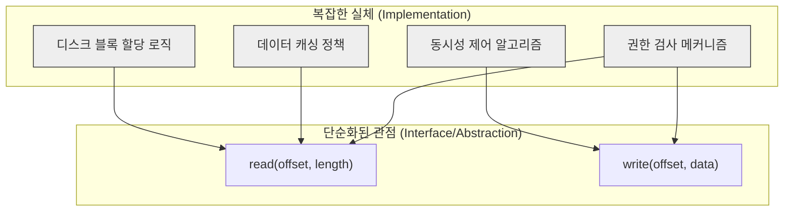

<p align="center"><b>[그림 4] 파일 시스템 모듈의 추상화 예시</b></p>

여기서 핵심은 '중요하지 않은'이라는 단어의 무게입니다. 추상화가 잘못될 수 있는 경로는 두 가지입니다.

1. **중요한 세부사항을 누락하는 경우** : 이는 **'거짓된 추상화(False Abstraction)'** 를 만듭니다. 겉보기에는 단순해 보이지만, 실제로는 모듈을 올바르게 사용하기 위해 필요한 중요 정보를 숨기고 있어 결국 모호함(obscurity)과 버그를 유발합니다.
2. **중요하지 않은 세부사항을 포함하는 경우** : 이는 추상화를 필요 이상으로 복잡하게 만들어, 사용자의 인지 부하(cognitive load)를 높입니다.

따라서 훌륭한 추상화, 즉 훌륭한 인터페이스를 설계하는 기술의 핵심은 **'무엇이 진정으로 중요한가'를 판단하고, 그 '중요한 정보'의 양 자체를 최소화하는 디자인을 찾는 능력** 에 있습니다.


### 3. 위대한 모듈의 조건: 깊이 (Depth)

이제 이 장의 핵심 개념인 '깊이'에 대해 논할 차례입니다. 저자는 최고의 모듈을 **"강력한 기능을 제공하면서도, 믿을 수 없을 만큼 간단한 인터페이스를 가진 모듈"** 이라고 정의하며, 이러한 모듈을 **'깊은 모듈(Deep Module)'** 이라고 부릅니다. '깊이'라는 개념을 시각적으로 이해하기 위해, 각 모듈을 하나의 사각형으로 상상해 봅시다.

* **사각형의 면적** : 모듈이 제공하는 기능(functionality)의 총량 (클수록 좋음)
* **사각형 상단 변의 길이** : 인터페이스의 복잡도(complexity) (짧을수록 좋음)

이 관점에서 보면, 최고의 모듈은 **'키가 크고(많은 기능) 날씬한(간단한 인터페이스)'** 형태를 띱니다. 이러한 깊은 모듈은 내부의 복잡성 중 아주 작은 부분만을 외부로 노출시키기 때문에 훌륭한 추상화를 제공합니다.

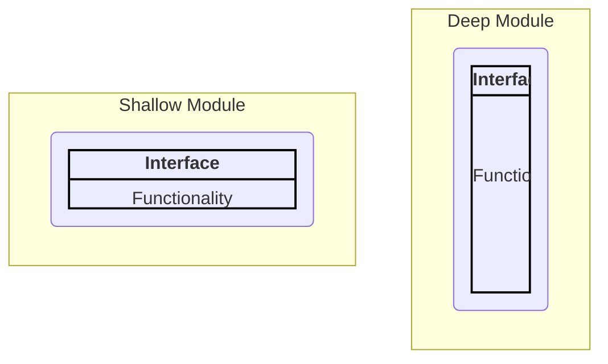

<p align="center"><b>[그림 5] 깊은 모듈과 얕은 모듈의 시각적 비유</b></p>

'깊이'는 결국 비용 대비 효용의 관점입니다. 모듈이 시스템에 부과하는 **비용은 그것의 인터페이스** 이고, 모듈이 제공하는 **혜택은 그것의 기능** 입니다. 최고의 모듈은 최소의 비용으로 최대의 혜택을 제공하는 모듈입니다. 이 관점은 "인터페이스는 많을수록 좋다"는 흔한 오해를 바로잡아 줍니다. 인터페이스는 비용이며, 우리는 그 비용을 최소화해야 합니다.

저자는 '깊은 모듈'의 가장 아름다운 예시로 **유닉스(Unix)의 파일 I/O 시스템 콜** 을 듭니다. 단 5개의 단순한 함수(`open`, `read`, `write`, `lseek`, `close`)만으로 파일 시스템의 모든 기능을 사용할 수 있습니다.

```c
int open(const char* path, int flags, mode_t permissions);
ssize_t read(int fd, void* buffer, size_t count);
ssize_t write(int fd, const void* buffer, size_t count);
off_t lseek(int fd, off_t offset, int referencePosition);
int close(int fd);
```

이 단순한 인터페이스의 이면에는, 수십만 라인에 달하는 거대한 복잡성이 숨겨져 있습니다.

* 파일과 디렉터리는 디스크에 어떻게 효율적으로 저장되는가?
* 계층적인 경로 이름은 어떻게 파싱되는가?
* 사용자별 접근 권한은 어떻게 강제되는가?
* 디스크 접근을 줄이기 위한 메모리 캐시는 어떻게 동작하는가?
* HDD, SSD 등 다양한 저장 장치를 어떻게 단일 파일 시스템으로 통합하는가?

이 모든 복잡성은 유닉스 파일 시스템의 '구현'에 완벽하게 감추어져 있으며, '인터페이스'를 사용하는 개발자는 전혀 알 필요가 없습니다. 또 다른 극단적인 예시는 **가비지 컬렉터(Garbage Collector)** 입니다. 가비지 컬렉터는 인터페이스가 아예 '0'이지만, 메모리 관리라는 거대한 복잡성을 해결해주는, 무한한 깊이를 가진 모듈이라고 할 수 있습니다.


### 4. 복잡성의 또 다른 이름: 얕은 모듈

반면, **얕은 모듈(Shallow Module)** 은 **제공하는 기능에 비해 인터페이스가 상대적으로 복잡한 모듈** 을 의미합니다. 얕은 모듈은 복잡성과의 싸움에서 거의 아무런 도움을 주지 못합니다. 왜냐하면 그 모듈을 사용함으로써 얻는 이점(내부 구현을 몰라도 된다는 점)이 그 모듈의 복잡한 인터페이스를 학습하고 사용하는 비용에 의해 상쇄되기 때문입니다.

전형적인 얕은 클래스의 예시는 **연결 리스트(Linked List) 클래스** 입니다. 연결 리스트를 조작하는 구현 자체는 몇 줄의 코드로 충분할 만큼 간단합니다. 따라서 연결 리스트 클래스가 제공하는 인터페이스는 그 구현과 복잡도 면에서 큰 차이가 없습니다. 이러한 클래스는 유용할 수는 있지만, 복잡성을 줄여주는 지렛대 역할을 하지는 못합니다.

저자는 한 학생의 프로젝트에서 발견한 극단적인 얕은 메서드를 예로 듭니다.

```java
private void addNullValueForAttribute(String attribute) {
    data.put(attribute, null);
}
```

이 메서드는 복잡성을 줄이기는커녕 오히려 증가시킵니다. 이 메서드는 아무런 추상화도 제공하지 않으며, 그 기능 전체가 인터페이스를 통해 노출됩니다. 메서드를 호출하는 것은 내부 변수인 `data`를 직접 조작하는 것보다 전혀 간단하지 않습니다. 오히려 개발자가 학습해야 할 새로운 인터페이스 하나만 추가했을 뿐, 아무런 보상도 제공하지 않습니다.

> **Red Flag: Shallow Module (얕은 모듈)**
>
> 모듈의 인터페이스가 그 구현에 비해 별로 간단하지 않다면, 이는 위험 신호입니다. 얕은 모듈은 복잡성을 줄이는 데 거의 기여하지 못합니다. 특히, 작은 모듈은 얕을 가능성이 높습니다.


### 5. '클래스병(Classitis)': 작게 나누는 것의 역설

안타깝게도, 오늘날 많은 개발 커뮤니티에서는 '깊은 클래스'의 가치가 널리 인정받지 못하고 있습니다. 오히려 "클래스는 작아야 한다", "메서드는 10줄을 넘으면 안 된다"와 같은 관습적인 지혜가 널리 퍼져있습니다. 이러한 접근법은 시스템을 수많은 얕은 클래스와 메서드로 분열시켜, 오히려 시스템 전체의 복잡성을 증가시킵니다.

저자는 "클래스는 좋은 것이니, 클래스가 많을수록 더 좋다"는 잘못된 믿음에서 비롯된 이러한 극단적인 현상을 **'클래스병(Classitis)'** 이라는 증후군으로 명명합니다. '클래스병'에 걸린 시스템은 다음과 같은 특징을 보입니다.

* 각각의 클래스는 개별적으로 매우 간단합니다.
* 하지만 작은 클래스는 많은 기능을 제공하지 못하므로, 수많은 클래스가 필요하게 됩니다.
* 각 클래스가 가진 자신만의 인터페이스들이 모여, **시스템 수준에서는 엄청난 복잡성** 을 만들어냅니다.
* 각 클래스마다 필요한 상용구(boilerplate) 코드로 인해 프로그래밍 스타일이 장황해집니다.


### 6. 현실 세계의 비교: Java I/O vs. Unix I/O

'클래스병'의 가장 대표적인 사례로 저자는 **자바(Java)의 I/O 라이브러리** 를 지목합니다. 자바 언어 자체가 작은 클래스를 강요하는 것은 아니지만, 자바 커뮤니티에는 '클래스병' 문화가 깊이 뿌리내린 것으로 보입니다. 예를 들어, 파일에서 직렬화된 객체를 읽어오는 간단한 작업을 위해 개발자는 오랫동안 다음과 같이 3개의 다른 객체를 생성해야 했습니다.

```java
// 하나의 작업을 위해 3개의 객체를 생성해야 함
FileInputStream fileStream = new FileInputStream(fileName);
BufferedInputStream bufferedStream = new BufferedInputStream(fileStream);
ObjectInputStream objectStream = new ObjectInputStream(bufferedStream);
```

`FileInputStream`은 가장 기본적인 I/O 기능만 제공하고, `BufferedInputStream`이 버퍼링 기능을 추가하며, `ObjectInputStream`이 객체 직렬화 기능을 추가하는 구조입니다. 이 설계는 여러 가지 문제를 안고 있습니다.

1. **얕은 모듈의 조합** : 각 클래스는 작은 기능 하나를 추가하는 얕은 모듈(데코레이터 패턴)이며, 이로 인해 불필요한 인터페이스와 객체가 양산됩니다.
2. **잘못된 기본값** : 파일 I/O에서 버퍼링은 거의 항상 필요함에도 불구하고, 별도의 객체를 생성하여 명시적으로 요청해야 합니다. 이는 개발자가 잊어버리기 쉬운 오류 유발적 설계입니다.
3. **"가장 흔한 사용 사례를 가장 단순하게 만들어야 한다"는 원칙 위배** : 좋은 인터페이스는 99%의 사용자가 원하는 기능을 기본으로 제공하고, 1%의 특수한 경우를 위한 예외적인 방법을 제공해야 합니다. 자바 I/O는 이와 반대로 설계되었습니다.

이와 대조적으로, 앞서 살펴본 유닉스 I/O는 가장 흔한 순차 접근(sequential access)을 기본 동작으로 삼았습니다. 임의 접근(random access)이라는 덜 흔한 기능은 `lseek`이라는 별도의 함수를 통해 가능하지만, 순차 접근만 사용하는 개발자는 그 존재조차 알 필요가 없습니다. 이처럼 **인터페이스의 유효 복잡도는 대부분의 사용자가 알아야 하는 기능의 복잡도에 의해 결정** 됩니다.


### 결론: 깊이를 향한 설계 철학

제4장은 소프트웨어 설계의 가장 중요한 질문 중 하나인 "좋은 모듈이란 무엇인가?"에 대한 명쾌한 답을 제시합니다. 좋은 모듈은 '깊습니다'. 즉, **간단한 인터페이스 뒤에 강력한 기능을 숨김으로써, 구현의 복잡성을 외부로부터 완벽하게 은닉합니다.**

우리가 클래스와 다른 모듈을 설계할 때 가장 중요하게 고려해야 할 것은 바로 이 '깊이'입니다. 가장 흔한 사용 사례를 중심으로 인터페이스를 최대한 단순하게 만들고, 그 이면에 상당한 양의 복잡성을 감춤으로써 복잡성의 총량을 줄여야 합니다. "모듈은 작아야 한다"는 맹목적인 믿음에서 벗어나, "모듈은 깊어야 한다"는 철학을 받아들일 때, 우리는 비로소 복잡성을 제어하고 우아하며 유지보수하기 쉬운 시스템을 구축할 수 있는 설계자로 거듭날 수 있을 것입니다.

---


## 제5장: 정보 은닉 (그리고 누출) (Information Hiding (and Leakage))

우리는 제4장에서 위대한 모듈의 조건이 '깊이'에 있음을 확인했습니다. '깊은 모듈'이란 간단한 인터페이스를 통해 강력한 기능을 제공함으로써, 내부의 복잡성을 사용자로부터 완벽하게 감추는 모듈을 의미합니다. 그렇다면 우리는 어떻게 그런 깊은 모듈을 만들 수 있을까요? 이 질문에 대한 해답의 열쇠를 쥐고 있는 것이 바로 소프트웨어 설계의 가장 근본적이고 강력한 원칙 중 하나인 **'정보 은닉(Information Hiding)'** 입니다. 제5장은 이 위대한 원칙의 본질을 파헤치고, 그것의 실패가 어떻게 '정보 누출(Information Leakage)'이라는 재앙으로 이어지는지, 그리고 우리가 흔히 저지르는 '시간적 분해(Temporal Decomposition)'라는 실수를 통해 어떻게 정보 누출을 양산하는지를 구체적인 예제와 함께 적나라하게 보여줍니다. 이 글은 제5장의 모든 지혜를 담아, 깊은 모듈을 향한 여정의 구체적인 나침반을 제시합니다.


### 1. 정보 은닉의 정수: 단순한 'private'을 넘어서

정보 은닉은 1972년 데이비드 파르나스(David Parnas)의 전설적인 논문을 통해 처음 세상에 알려진 개념입니다. 그 핵심 아이디어는 놀랍도록 단순하면서도 심오합니다. 각 모듈은 시스템을 설계하며 내린 몇 가지 중요한 **'설계 결정(design decisions)'에 대한 지식** 을 독점적으로 감싸 안아야 한다는 것입니다. 이 지식은 모듈의 구현부에는 깊숙이 녹아 있지만, 모듈의 인터페이스에는 결코 드러나지 않아 다른 모듈에게는 보이지 않는 상태가 되어야 합니다.

여기서 '숨겨지는 정보'란 보통 어떤 메커니즘을 구현하는 방법에 대한 세부 사항들을 의미합니다.

* B-Tree 자료구조에 정보를 효율적으로 저장하고 검색하는 방법
* 파일의 논리적 블록에 해당하는 물리적 디스크 블록을 찾아내는 방법
* TCP 네트워크 프로토콜을 구현하는 구체적인 알고리즘
* 멀티코어 프로세서에서 스레드를 스케줄링하는 정책

이러한 정보들은 자료구조, 알고리즘뿐만 아니라 "대부분의 파일은 크기가 작을 것이다"와 같은 더 추상적인 가정까지 포함할 수 있습니다.

정보 은닉이 복잡성을 줄여주는 방식은 크게 두 가지입니다.

1. **인터페이스를 단순화한다** : 세부 사항을 숨김으로써, 모듈의 기능에 대한 더 단순하고 추상적인 관점을 제공합니다. 이는 모듈을 사용하는 개발자의 인지 부하를 극적으로 줄여줍니다. B-Tree 클래스를 사용하는 개발자는 트리의 균형을 어떻게 맞출지 고민할 필요 없이, 단순히 `put`과 `get`에만 집중할 수 있습니다.
2. **시스템의 진화를 용이하게 한다** : 어떤 정보가 한 모듈 내부에 완벽하게 숨겨져 있다면, 그 정보와 관련된 설계 변경은 오직 해당 모듈에만 영향을 미칩니다. 외부에는 어떤 의존성도 존재하지 않기 때문입니다. 예를 들어, TCP의 혼잡 제어 알고리즘이 변경되더라도, TCP를 사용하여 데이터를 주고받는 상위 레벨의 애플리케이션 코드는 단 한 줄도 수정할 필요가 없습니다.

여기서 매우 중요한 점은, **정보 은닉이 단순히 클래스의 변수나 메서드를 `private`으로 선언하는 것과 동의어가 아니라는 사실** 입니다. `private` 키워드는 외부에서의 직접적인 접근을 막아 정보 은닉을 '돕는' 도구일 뿐입니다. 만약 `private`으로 선언된 변수에 대해 `getX()`와 `setX()` 같은 getter/setter 메서드를 무분별하게 제공한다면, 그 변수의 존재와 성격, 사용 방식은 변수가 `public`일 때와 마찬가지로 외부에 완전히 노출된 것이나 다름없습니다. 이것은 정보 은닉의 정신을 위배하는 행위입니다.


### 2. 적신호, 정보 누출 (Red Flag: Information Leakage)

정보 은닉의 반대편에 서 있는 것이 바로 **'정보 누출(Information Leakage)'** 입니다. 정보 누출은 **하나의 설계 결정이 여러 모듈에 걸쳐 반영되는 현상** 을 말합니다. 이는 모듈들 사이에 교활한 의존성을 만들어내며, 해당 설계 결정을 변경하기 위해서는 관련된 모든 모듈을 수정해야 하는 '변경 증폭'을 유발합니다. 어떤 정보가 모듈의 인터페이스에 드러나 있다면, 그것은 정의상 이미 누출된 것입니다. 따라서 단순한 인터페이스가 더 나은 정보 은닉과 연관되는 경향이 있습니다.

하지만 정보는 인터페이스를 통하지 않고도 누출될 수 있습니다. 이를 '백도어 누출(Back-door leakage)'이라고 부를 수 있으며, 명시적이지 않기 때문에 더욱 위험합니다. 예를 들어, 특정 파일 포맷을 다루는 두 개의 클래스가 있다고 가정해 봅시다.

* `FileReader`: 해당 포맷의 파일을 읽는 클래스
* `FileWriter`: 해당 포맷의 파일을 쓰는 클래스

두 클래스 모두 인터페이스 상으로는 파일 포맷에 대한 정보를 전혀 노출하지 않을 수 있습니다. 하지만 두 클래스 모두 파일 포맷의 구조에 대한 지식을 '구현' 내부에 가지고 있습니다. 만약 파일 포맷이 변경된다면, 두 클래스 모두 수정되어야만 합니다. 이것이 바로 명백한 정보 누출입니다.

> **정보 누출에 대한 민감성을 기르는 것이 훌륭한 소프트웨어 설계자가 되는 최고의 기술 중 하나이다.**
> (One of the best skills you can learn as a software designer is a high level of sensitivity to information leakage.)

코드에서 정보 누출을 발견했다면, 스스로에게 이렇게 질문해야 합니다. "이 지식이 단 하나의 클래스에만 영향을 미치도록 클래스들을 어떻게 재구성할 수 있을까?" 만약 관련된 클래스들이 작고 긴밀하게 연결되어 있다면, 하나의 클래스로 병합하는 것이 좋은 해결책이 될 수 있습니다. 또는, 누출된 정보를 모든 클래스에서 떼어내어 그 정보만을 전담하는 새로운 클래스를 만드는 방법도 있습니다. 단, 이 새로운 클래스가 정보를 추상화하는 단순한 인터페이스를 제공하지 못하고 대부분의 지식을 인터페이스를 통해 다시 노출시킨다면, 이는 백도어 누출을 인터페이스 누출로 바꾼 것에 불과하므로 아무런 가치가 없습니다.


### 3. 시간적 분해의 함정 (The Pitfall of Temporal Decomposition)

정보 누출을 유발하는 가장 흔한 설계 스타일 중 하나가 바로 **'시간적 분해(Temporal Decomposition)'** 입니다. 이는 시스템의 구조를 **작업이 실행되는 시간 순서** 에 맞춰 구성하는 방식입니다. 예를 들어, "특정 포맷의 파일을 읽고, 내용을 수정한 다음, 다시 파일로 쓰는" 애플리케이션을 생각해 봅시다. 시간적 분해에 따르면 이 애플리케이션은 다음과 같이 세 개의 클래스로 나뉠 수 있습니다.

1. `FileLoader`: 파일을 읽는 역할
2. `ContentProcessor`: 내용을 수정하는 역할
3. `FileSaver`: 파일을 쓰는 역할

이 구조는 "먼저 읽고, 그 다음 처리하고, 마지막으로 저장한다"는 작업의 순서를 그대로 코드로 옮겨 놓은 것입니다. 하지만 여기서 `FileLoader`와 `FileSaver`는 모두 파일 포맷에 대한 지식을 공유해야 하므로, 명백한 정보 누출이 발생합니다.

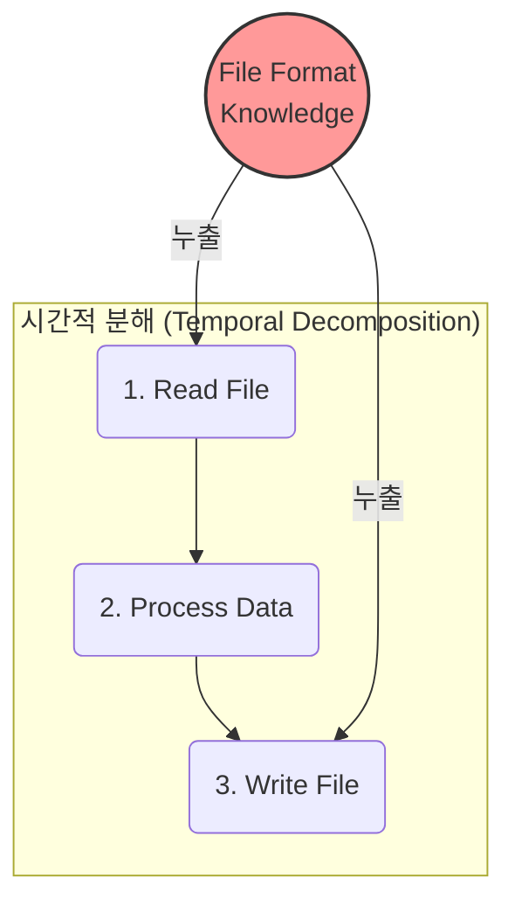

<p align="center"><b>[그림 6] 시간적 분해가 정보 누출을 유발하는 과정</b></p>

우리는 코드를 작성할 때 작업의 순서를 생각하기 때문에 시간적 분해의 함정에 빠지기 쉽습니다. 하지만 대부분의 중요한 설계 지식(파일 포맷, 프로토콜 등)은 애플리케이션의 생명주기 동안 여러 다른 시점에 반복적으로 필요합니다. 따라서 시간적 분해는 거의 항상 정보 누출로 이어집니다. 올바른 해결책은 `FileLoader`와 `FileSaver`의 핵심 기능을 하나의 `FileFormatManager` 클래스로 통합하는 것입니다. 이 클래스는 읽기와 쓰기 단계 모두에서 사용될 것입니다.

> **Red Flag: Temporal Decomposition (시간적 분해)**
>
> 코드 구조가 작업이 실행되는 순서를 반영하고 있다면, 이는 위험 신호입니다. 모듈을 설계할 때는 **작업의 순서가 아니라, 각 작업을 수행하는 데 필요한 '지식'에 집중** 해야 합니다.


### 4. 실전 예제: HTTP 서버 설계에서 배우는 교훈

이론을 현실에 적용해보기 위해, 저자가 강의에서 학생들에게 내주었던 'HTTP 서버 구현' 과제를 살펴봅시다. 학생들의 설계에서 나타난 실수와 좋은 점들을 통해 정보 은닉의 원칙을 더 깊이 이해할 수 있습니다.


#### 4.1. 너무 많은 클래스의 문제: 시간적 분해의 현실판

학생들이 저지른 가장 흔한 실수는 코드를 수많은 얕은 클래스로 나누어 정보 누출을 유발한 것입니다. 한 팀은 HTTP 요청을 수신하는 부분을 두 개의 클래스로 나누었습니다.

* `RequestReader`: 네트워크 소켓에서 요청 텍스트를 읽어 하나의 문자열로 만듦.
* `RequestParser`: `RequestReader`가 만든 문자열을 파싱함.

이는 "먼저 읽고, 그 다음 파싱한다"는 전형적인 시간적 분해입니다. 이 설계는 왜 실패했을까요? HTTP 요청은 `Content-Length` 헤더를 파싱해야만 요청 본문(body)의 끝을 알 수 있습니다. 즉, `RequestReader`는 단순히 '읽기'만 할 수 없고, 요청의 끝을 알기 위해 사실상 '파싱' 작업의 대부분을 수행해야 했습니다. 그 결과, HTTP 요청 포맷에 대한 지식이 두 클래스에 모두 중복되어 존재하게 되었고, 이는 정보 누출로 이어졌습니다.

올바른 해결책은 이 두 클래스를 **하나의 `HttpRequestParser` 클래스로 병합** 하는 것입니다. 이 클래스는 요청 읽기와 파싱을 모두 책임집니다. 이렇게 하면 다음과 같은 이점이 있습니다.

* 요청 포맷에 대한 모든 지식이 단 하나의 클래스에 캡슐화되어 정보 은닉이 향상됩니다.
* 사용자는 `read()`와 `parse()` 두 개의 메서드를 순서대로 호출할 필요 없이, 단 하나의 메서드만 호출하면 되므로 인터페이스가 단순해집니다.
* 병합된 클래스는 기존의 두 클래스보다 약간 더 커지지만, 훨씬 더 '깊어'집니다.

이는 소프트웨어 설계의 중요한 역설을 보여줍니다. **때로는 클래스를 약간 더 크게 만드는 것이 정보 은닉을 개선하고 더 나은 설계를 이끌어낼 수 있습니다.**


#### 4.2. 매개변수 처리: 숨길 것과 드러낼 것의 미학

HTTP 요청을 처리할 때, 서버는 URL이나 요청 본문에 포함된 매개변수(parameter)들의 값을 알아야 합니다. 학생들은 여기서 두 가지 훌륭한 정보 은닉을 해냈습니다.

1. 매개변수가 URL에 있었는지, 본문에 있었는지의 차이점을 숨기고, 두 위치의 매개변수를 하나로 합쳐서 제공했습니다. 서버 애플리케이션은 그 출처에 관심이 없기 때문입니다.
2. `What+a+cute+baby%21`과 같은 URL 인코딩의 세부 사항을 숨기고, `"What a cute baby!"`와 같이 디코딩된 값을 제공했습니다.

하지만 대부분의 학생들은 매개변수를 반환하는 인터페이스에서 얕은 설계를 선택하여 정보 누출을 일으켰습니다.

```java
// 나쁜 예: 내부 자료구조(Map)를 그대로 노출
public Map<String, String> getParams() {
    return this.params; // 내부적으로 사용하는 params 맵을 반환
}
```

이 `getParams()` 메서드는 클래스가 매개변수를 저장하기 위해 내부적으로 사용하는 `Map` 객체 자체를 반환합니다. 이는 다음과 같은 심각한 문제를 야기합니다.

* **내부 표현의 누출** : 만약 성능 향상을 위해 `Map`을 다른 자료구조로 변경한다면, 이 인터페이스에 의존하는 모든 외부 코드가 깨지게 됩니다.
* **사용자에게 더 많은 작업 전가** : 사용자는 `getParams()`를 호출한 다음, 반환된 `Map`에서 원하는 값을 얻기 위해 또다시 메서드를 호출해야 합니다.
* **캡슐화 파괴** : 사용자가 반환된 `Map`을 수정하면, 클래스의 내부 상태가 의도치 않게 변경될 수 있습니다.

더 나은, 더 깊은 인터페이스는 다음과 같습니다.

```java
// 좋은 예: 내부 표현을 숨기고 더 높은 수준의 기능을 제공
public String getParameter(String name) { ... }
public int getIntParameter(String name) { ... } // 타입 변환 기능까지 제공
```

이 인터페이스는 내부 자료구조를 완벽하게 숨깁니다. 또한 `getIntParameter`처럼, 단순한 값 반환을 넘어 타입 변환과 같은 유용한 추가 기능을 제공함으로써 더 깊은 모듈이 됩니다.


#### 4.3. 기본값의 힘과 과잉 노출(Overexposure)

학생들의 HTTP 응답 생성 코드에서는 '부적절한 기본값' 문제가 흔히 발견되었습니다. 예를 들어, 응답 객체를 생성할 때 호출자가 HTTP 프로토콜 버전을 명시적으로 지정하도록 요구하는 경우가 있었습니다. 하지만 응답 버전은 보통 요청 버전과 동일해야 하며, 이 정보는 라이브러리가 이미 알고 있습니다. 라이브러리가 자동으로 "올바른 일"을 해줄 수 있음에도 불구하고, 사용자에게 불필요한 정보를 요구하고 있는 것입니다.

> **Red Flag: Overexposure (과잉 노출)**
>
> 자주 사용되는 기능의 API가, 드물게 사용되는 다른 기능에 대한 지식을 사용자에게 강요한다면 이는 위험 신호입니다. 이는 사용자의 인지 부하를 불필요하게 높입니다.

좋은 기능은 사용자가 그 존재조차 모르는 상태에서 혜택을 누릴 수 있는 기능입니다. 파일 I/O의 버퍼링처럼 말입니다.


### 5. 원칙의 확장과 균형

정보 은닉의 원칙은 클래스의 public API에만 국한되지 않습니다. 클래스 내부에서도 적용될 수 있습니다. 각 `private` 메서드 역시 특정 정보나 기능을 캡슐화하여 클래스의 다른 부분으로부터 숨기도록 설계해야 합니다. 또한, 각 인스턴스 변수가 사용되는 범위(scope)를 최소화하여, 변수 하나를 변경했을 때 클래스 전체에 미치는 영향을 줄여야 합니다.

물론, 모든 원칙에는 균형이 필요합니다. 정보 은닉을 너무 극단적으로 추구해서는 안 됩니다. **만약 어떤 정보가 모듈 외부에서 반드시 필요하다면, 그 정보는 절대 숨겨서는 안 됩니다.** 예를 들어, 모듈의 성능이 특정 설정 파라미터에 의해 크게 좌우되고, 사용 환경에 따라 그 최적값이 달라진다면, 이 파라미터는 반드시 인터페이스를 통해 노출되어야 합니다. 설계자의 목표는 외부로 노출되는 정보의 양을 '제거'하는 것이 아니라 '최소화'하는 것입니다.


### 결론: 지식을 중심으로 설계하라

제5장은 정보 은닉과 깊은 모듈이 동전의 양면과 같음을 명확히 보여줍니다. 모듈이 많은 정보를 숨길수록, 그 기능은 강력해지고 인터페이스는 단순해지며, 결국 모듈은 더 깊어집니다.

시스템을 모듈로 분해할 때, 우리는 '작업이 실행되는 시간 순서'의 유혹에서 벗어나야 합니다. 시간적 분해는 거의 항상 정보 누출과 얕은 모듈이라는 결과로 이어집니다. 대신, 우리는 애플리케이션을 구동하는 데 필요한 **다양한 '지식'의 조각들을 식별하고, 각 모듈이 그 지식의 조각 중 하나 혹은 몇 개를 온전히 책임지고 캡슐화하도록 설계** 해야 합니다. 이러한 지식 중심의 접근법이야말로, 깨끗하고 단순하며 깊은 모듈로 이루어진 우아한 시스템을 창조하는 왕도입니다.

---


## 제6장: 범용 모듈이 더 깊다 (General-Purpose Modules are Deeper)

소프트웨어 개발 커뮤니티에는 "YAGNI(You Ain't Gonna Need It)"라는, 성경처럼 여겨지는 원칙이 있습니다. "지금 당장 필요하지 않은 기능은 만들지 말라"는 이 격언은, 미래를 예측하려다 과도한 엔지니어링의 늪에 빠지는 것을 경계하라는 현명한 가르침입니다. 이 관점에서 보면, 새로운 클래스나 모듈을 설계할 때 당장의 요구사항에만 꼭 맞는 '특수 목적(special-purpose)'으로 만드는 것이 가장 합리적인 선택처럼 보입니다. 하지만 존 아우스터하우트 교수는 제6장에서 이러한 통념에 도전하며, 소프트웨어 복잡성의 가장 큰 원인 중 하나가 바로 이 '과도한 특수화(over-specialization)'일 수 있다고 주장합니다. 그는 오히려 더 '범용적인(general-purpose)' 코드가 역설적으로 더 단순하고, 깔끔하며, 심지어 구현하기 더 쉽다는 놀라운 통찰을 제시합니다. 이 글은 제6장의 논리를 심도 있게 파고들어, 특수화의 숨겨진 비용과 범용성이 가져다주는 진정한 '깊이'의 의미를 탐구합니다.


### 1. 끝나지 않는 논쟁: 특수화 vs. 범용성

새로운 모듈을 설계할 때 개발자는 항상 갈림길에 섭니다. 이 모듈을 오직 오늘의 문제만을 해결하기 위한 특수 목적으로 만들 것인가, 아니면 더 넓은 범위의 문제를 해결할 수 있는 범용 메커니즘으로 만들 것인가? 양쪽 모두 그럴듯한 논리를 가지고 있습니다.

* **특수 목적 접근법의 논리 (YAGNI, 점진적 개발)**
  * **명확성**: 오늘의 필요에만 집중하므로 요구사항이 명확하고 구현 범위가 작다.
  * **속도**: 불필요한 기능을 구현하지 않으므로 초기 개발 속도가 빠르다.
  * **유연성**: 나중에 새로운 요구사항이 생기면, 그때 가서 리팩토링하여 범용으로 확장하면 된다. 낭비를 피할 수 있다.

* **범용 목적 접근법의 논리 (투자, 재사용성)**
  * **투자**: 초기에 조금 더 시간을 투자하여 미래에 발생할 수 있는 유사한 문제들을 한 번에 해결한다.
  * **재사용성**: 잘 만들어진 범용 모듈은 예상치 못한 곳에서 재사용되어 미래의 개발 시간을 단축시킨다.
  * **견고함**: 다양한 사용 사례를 염두에 두고 설계하므로 더 견고하고 안정적인 구조를 갖게 된다.

초기 저자 자신도 특수 목적 접근법에 더 기울었었다고 고백합니다. 하지만 수많은 학생들의 코드를 리뷰하며 그는 놀라운 사실을 발견했습니다. 범용으로 설계된 클래스가 특수 목적으로 설계된 클래스보다 **거의 항상 더 나았다는 것** 입니다. 더욱 놀라운 점은, 범용 인터페이스가 특수 목적 인터페이스보다 **더 단순하고 깊으며, 심지어 구현 코드의 양도 더 적었다** 는 사실입니다. 즉, 특정 클래스를 단 하나의 목적으로만 사용할 계획이라 할지라도, 처음부터 범용으로 설계하는 것이 오히려 더 적은 노력으로 더 좋은 결과를 낳는다는 역설적인 결론에 이르게 된 것입니다. 저자는 이를 "어느 정도 범용적인(somewhat general-purpose)" 접근법이라고 부르며, 기능은 현재의 필요를 반영하되, 인터페이스는 특정 사용 사례에 묶이지 않도록 충분히 일반화해야 한다고 강조합니다.


### 2. 케이스 스터디: 텍스트 에디터의 핵심, Text 클래스

이 추상적인 논쟁을 구체화하기 위해, 저자는 GUI 텍스트 에디터를 만드는 과제에서 학생들이 설계한 `Text` 클래스를 예로 듭니다. 이 클래스는 파일의 텍스트 데이터를 메모리에 저장하고, 수정하며, 다시 파일로 쓰는 핵심적인 역할을 담당합니다.


#### 2.1. 특수 목적 API: 누수되는 추상화의 비극

많은 학생들은 `Text` 클래스가 '에디터'에서 사용될 것이라는 사실에 집중했습니다. 그래서 에디터의 사용자 인터페이스(UI) 기능들을 `Text` 클래스의 API에 직접 반영하는 '특수 목적' 설계를 선택했습니다.

```java
// 나쁜 예: 특수 목적 API
// UI의 개념(커서, 선택, 백스페이스)이 Text 클래스에 누출되었다.
public class Text {
    void backspace(Cursor cursor);
    void delete(Cursor cursor);
    void deleteSelection(Selection selection);
    // ...
}
```

이 설계는 언뜻 보기에 UI 로직을 구현하기 편하게 만들어 줄 것 같습니다. 사용자가 백스페이스 키를 누르면, UI 코드는 그저 `text.backspace(cursor)`를 호출하기만 하면 되니까요. 하지만 이 설계는 다음과 같은 심각한 문제점을 안고 있습니다.

* **정보 누출** : `Cursor`, `Selection`, `backspace`와 같은 UI 계층의 추상화가 데이터 모델 계층인 `Text` 클래스로 누출되었습니다. `Text` 클래스는 이제 순수한 텍스트 데이터 관리자가 아니라, UI의 동작 방식까지 알아야 하는 복잡한 존재가 되었습니다.
* **얕은 메서드의 범람** : `backspace`, `delete` 등 각각의 메서드는 오직 단 하나의 UI 기능을 위해서만 존재합니다. 새로운 UI 기능이 추가될 때마다 `Text` 클래스에도 새로운 메서드가 추가되어야 합니다. 이는 수많은 얕은 메서드를 양산하고, 클래스를 비대하게 만듭니다.
* **인지 부하 증가** : `Text` 클래스를 수정해야 하는 개발자는 이제 순수한 텍스트 처리 로직뿐만 아니라, 이 클래스가 UI와 어떻게 상호작용하는지에 대한 지식까지 갖추어야 합니다. 두 클래스는 서로 독립적으로 개발될 수 없도록 강하게 결합(tightly coupled)되었습니다.
* **재사용성 저하** : 만약 이 `Text` 클래스를 파일의 특정 문자열을 찾아 바꾸는 다른 애플리케이션에서 재사용하고 싶다면, `backspace` 같은 메서드는 아무 쓸모가 없습니다.


#### 2.2. 범용 API: 더 깊고 견고한 기반

더 나은 접근법은 `Text` 클래스를 UI의 개념과 완전히 분리하여, 순수한 텍스트 조작을 위한 범용적인 기능만 제공하도록 설계하는 것입니다.

```java
// 좋은 예: 범용 API
// 텍스트 조작의 본질(삽입과 삭제)에만 집중한다.
public class Text {
    void insert(Position position, String newText);
    void delete(Position start, Position end);
    Position changePosition(Position position, int numChars);
    // ...
}
```

이 범용 API를 사용하면, UI 기능은 `Text` 클래스의 **기본 연산(primitive operations)을 조합** 하여 다음과 같이 UI 계층에서 직접 구현됩니다.

```java
// '백스페이스' 기능은 이제 UI 계층의 책임이 된다.
Position oneCharBefore = text.changePosition(cursor, -1);
text.delete(oneCharBefore, cursor);

// 'delete' 키 기능 역시 UI 계층의 책임이다.
Position oneCharAfter = text.changePosition(cursor, 1);
text.delete(cursor, oneCharAfter);
```

이 접근법의 장점은 명확합니다. `Text` 클래스는 더 이상 UI에 대해 아무것도 알 필요가 없습니다. UI 계층은 `Text` 클래스가 제공하는 몇 안 되는 강력하고 범용적인 메서드들을 활용하여 자유롭게 새로운 기능을 만들어낼 수 있습니다. `Text` 클래스를 사용하는 UI 개발자는 단지 몇 개의 간단한 메서드만 학습하면 되므로 인지 부하가 감소합니다. UI 기능 구현 코드는 몇 줄 길어졌지만, 그 로직이 더 이상 숨겨져 있지 않고 UI 계층에 명확하게 드러나게 되어 오히려 코드를 이해하기 쉬워졌습니다. 결과적으로, 시스템 전체의 코드 양은 줄어들고, 각 클래스는 더 깊어지며, 정보 은닉은 강화됩니다.


### 3. 범용성이 승리하는 이유: 거짓된 추상화의 폭로

특수 목적 API였던 `backspace` 메서드는 사실 **'거짓된 추상화(False Abstraction)'** 였습니다. 이 메서드는 '어떤 문자가 삭제되는지'에 대한 세부 사항을 숨기는 척했지만, 실제로 UI 개발자는 백스페이스의 정확한 동작(커서 앞 한 글자 삭제)을 반드시 알아야만 했습니다. 결국 개발자는 `backspace` 메서드의 문서를 읽거나 심지어 내부 코드를 들여다보며 그 동작을 확인해야 했을 것입니다. 이처럼 세부 사항을 알아야만 하는 상황에서, 그 세부 사항을 인터페이스 뒤에 숨기는 것은 추상화가 아니라 오히려 정보를 얻기 어렵게 만드는 '모호함(obscurity)'을 생성할 뿐입니다.

> 훌륭한 소프트웨어 설계의 가장 중요한 요소 중 하나는 **'누가, 무엇을, 언제 알아야 하는가'를 결정하는 것** 입니다. 세부 사항이 정말로 중요하다면, 그것을 숨기려 하지 말고 가능한 한 명시적이고 명확하게 드러내는 것이 더 낫습니다.

범용 API 접근법은 바로 이 철학을 따릅니다. 백스페이스의 구체적인 삭제 로직을 `Text` 클래스 뒤에 숨기는 대신, UI 계층에 명확하게 드러내어 누가 봐도 그 동작을 쉽게 이해할 수 있도록 만든 것입니다.


### 4. 실전 가이드: 특수성을 길들이는 전략

모든 시스템에는 필연적으로 특수한 코드가 존재할 수밖에 없습니다. 그렇다면 우리는 이 피할 수 없는 특수성을 어떻게 다루어야 할까요? 저자는 특수성을 일반 코드와 깨끗하게 분리하는 두 가지 강력한 전략, **'위로 밀어 올리기'** 와 **'아래로 밀어 내리기'** 를 제시합니다.


#### 4.1. 특수성을 위로 밀어 올리기 (Push Specialization Upwards)

이는 텍스트 에디터 예제에서 사용된 전략입니다. 시스템의 최상위 계층(UI)은 애플리케이션의 특정 기능을 제공해야 하므로 필연적으로 특수화됩니다. 하지만 이 특수성이 시스템의 하위 계층(데이터 모델)으로 스며들게 해서는 안 됩니다.

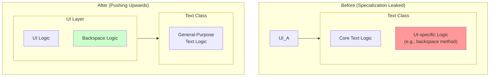

<p align="center"><b>[그림 7] 특수성을 상위 계층으로 밀어 올리는 과정</b></p>
개선된 설계는 백스페이스 키 처리와 같은 UI 특화 로직을 `Text` 클래스에서 끄집어내어 상위 계층인 UI 코드로 밀어 올렸습니다. 그 결과 `Text` 클래스는 순수한 범용 코드만 남게 되었습니다.


#### 4.2. 특수성을 아래로 밀어 내리기 (Push Specialization Downwards)

때로는 특수성을 하위 계층으로 밀어 내리는 것이 최선의 방법일 수 있습니다. 대표적인 예가 바로 **운영체제의 디바이스 드라이버** 입니다. 운영체제는 수백, 수천 종류의 서로 다른 저장 장치를 지원해야 하며, 각 장치는 자신만의 고유하고 특수한 명령어 집합을 가지고 있습니다. 만약 이 특수한 명령어들이 운영체제 핵심 코드에 스며든다면, OS는 끔찍하게 복잡해질 것입니다.

운영체제는 이 문제를 `read_block`, `write_block`과 같은 범용 인터페이스를 정의함으로써 해결합니다. 그리고 각각의 디바이스 제조사는 자신의 장치에 맞는 '디바이스 드라이버'를 만들어, 이 범용 인터페이스를 자신의 장치가 가진 '특수한' 기능들을 사용해 구현합니다. 이 접근법은 모든 특수성을 디바이스 드라이버라는 하위 계층으로 밀어 내리고, 운영체제의 핵심부는 특정 장치에 대한 지식 없이 완전히 범용적으로 작성될 수 있도록 합니다.


### 5. 마이크로-범용성: 코드 블록에서 특별한 경우 제거하기

범용성의 원칙은 클래스나 모듈 설계와 같은 거시적인 수준뿐만 아니라, 메서드 내부의 코드 블록과 같은 미시적인 수준에도 동일하게 적용됩니다. 메서드 내부에 `if`문으로 가득 찬 '특별한 경우(special case)' 처리가 많아지면, 코드는 이해하기 어렵고 버그에 취약해집니다.

가장 좋은 방법은 **일반적인 경우(normal case)를 처리하는 코드가 특별한 경우까지 자동으로 처리하도록 설계하는 것** 입니다. 텍스트 에디터에서 '선택된 텍스트가 있는지 없는지'를 나타내는 상태 변수가 있다고 가정해 봅시다.

```java
// 나쁜 예: '선택 없음'을 특별한 경우로 처리
if (selectionExists) {
    // 선택 영역을 삭제하는 로직...
}
// 텍스트 삽입 로직...
```

이러한 접근법은 코드 곳곳에 `if (selectionExists)`와 같은 검사를 흩뿌리게 만듭니다. 더 나은 방법은 '선택 없음'이라는 특별한 경우를 제거하는 것입니다. 즉, 선택 영역은 항상 존재하도록 하되, **아무것도 선택되지 않은 상태를 '시작 위치와 끝 위치가 같은, 비어있는(empty) 선택'으로 표현** 하는 것입니다. 이렇게 하면, 선택 영역을 삭제하는 일반적인 로직(시작부터 끝까지 지운다)이 비어있는 선택의 경우(아무것도 지우지 않음)를 아무런 추가 코드 없이 자동으로 처리하게 됩니다. 이처럼 특별한 경우를 일반적인 경우의 일부로 포섭함으로써, 우리는 `if`문을 제거하고 코드를 극적으로 단순화할 수 있습니다.


### 결론: 특수화는 복잡성의 씨앗이다

제6장은 소프트웨어 설계에 대한 우리의 관점을 근본적으로 바꾸어 놓습니다. 특수화는 불필요한 엔지니어링을 막아주는 안전장치가 아니라, 오히려 불필요한 복잡성과 정보 누출, 그리고 경직된 설계를 낳는 주된 원인일 수 있습니다. 물론 특수화가 완전히 제거될 수는 없지만, 훌륭한 설계자는 특수성을 최소화하고, 그것을 시스템의 핵심부에서 멀리 떨어진 경계(상위 또는 하위 계층)로 격리시키는 방법을 끊임없이 모색합니다.

범용 인터페이스를 고민하고, 특수성을 위나 아래로 밀어내며, 코드에서 특별한 경우를 제거하려는 노력은, 결국 더 깊은 클래스, 더 나은 정보 은닉, 그리고 훨씬 더 단순하고 명확한 코드로 귀결됩니다. 이것이 바로 '범용 모듈이 더 깊다'는 역설 속에 숨겨진, 위대한 설계로 가는 길입니다.

---


## 제7장: 다른 계층, 다른 추상화 (Different Layer, Different Abstraction)

잘 설계된 소프트웨어 시스템은 종종 지질학적 단층이나 잘 만들어진 케이크처럼 여러 '계층(Layer)'으로 구성됩니다. 상위 계층은 하위 계층이 제공하는 기능을 사용하여 더 복잡하고 추상적인 작업을 수행합니다. 파일 시스템을 예로 들면, 애플리케이션 계층은 '파일'이라는 추상화를 다루지만, 그 아래에는 '디스크 블록 캐시' 계층이 있고, 그보다 더 아래에는 물리적 디스크와 통신하는 '디바이스 드라이버' 계층이 존재합니다. 이처럼 하나의 요청이 시스템의 여러 계층을 오르내릴 때마다, 각 계층은 자신만의 고유한, 그리고 이전 계층과는 **다른** 추상화를 제공해야만 합니다. 이것이 바로 위대한 설계의 기본 원칙입니다.

하지만 만약 서로 인접한 계층이 비슷하거나 동일한 추상화를 제공한다면 어떻게 될까요? 존 아우스터하우트 교수는 제7장에서 이것이 클래스 분해에 심각한 문제가 있다는 명백한 위험 신호(Red Flag)라고 경고합니다. 이 글은 제7장의 핵심을 관통하여, '통과 메서드(Pass-through Method)', '데코레이터 패턴의 남용', 그리고 '통과 변수(Pass-through Variable)'와 같은 구체적인 증상들을 통해 이 문제가 어떻게 발현되는지, 그리고 어떻게 이를 해결하여 진정으로 의미 있는 계층 구조를 만들 수 있는지 탐구합니다.


### 1. 통과 메서드: 책임의 경계가 무너졌다는 증거

인접한 계층이 유사한 추상화를 가질 때, 이 문제는 종종 '통과 메서드'라는 형태로 가장 명확하게 드러납니다. **통과 메서드란, 자신을 호출한 메서드와 비슷하거나 동일한 시그니처를 가지며, 내부적으로는 별다른 로직 없이 인자를 그대로 다른 메서드에 전달하는 역할만 하는 메서드** 를 말합니다. 이는 사실상 아무런 가치도 추가하지 않으면서, 시스템에 불필요한 복잡성만 더하는 '좀비'와 같은 존재입니다.

저자는 GUI 텍스트 에디터 프로젝트에서 발견한 한 클래스를 예로 듭니다. 이 클래스의 15개 public 메서드 중 13개가 통과 메서드였습니다.

```java
// TextDocument 클래스는 TextArea 클래스의 기능을 그대로 전달만 하고 있다.
public class TextDocument ... {
    private TextArea textArea;
    private TextDocumentListener listener;
    ...

    // 통과 메서드 1
    public Character getLastTypedCharacter() {
        return textArea.getLastTypedCharacter();
    }

    // 통과 메서드 2
    public int getCursorOffset() {
        return textArea.getCursorOffset();
    }

    // 통과 메서드 3
    public void insertString(String textToInsert, int offset) {
        textArea.insertString(textToInsert, offset);
    }
    ...
}
```

이러한 통과 메서드는 다음과 같은 심각한 문제들을 야기합니다.

* **모듈을 얕게 만든다** : 새로운 인터페이스를 추가하여 클래스의 복잡도를 높이지만(비용), 새로운 기능을 추가하지는 않으므로 아무런 혜택(benefit)도 제공하지 않습니다.
* **강한 결합을 유발한다** : 만약 `TextArea`의 `insertString` 메서드 시그니처가 변경된다면, `TextDocument`의 `insertString` 메서드도 반드시 함께 변경되어야 합니다. 두 클래스는 서로에게 강하게 의존하게 됩니다.
* **책임 분배의 혼란을 증명한다** : `TextDocument` 클래스가 텍스트 삽입을 위한 인터페이스(`insertString`)를 제공하지만, 그 기능의 실제 구현은 `TextArea` 클래스에 전부 위임하고 있습니다. 이는 기능에 대한 '인터페이스'와 '구현'이 서로 다른 클래스에 분리된 기형적인 구조입니다.

이러한 문제가 발견되면, 클래스들의 책임을 재조정하여 각 클래스가 명확하고 일관된 역할만을 갖도록 리팩토링해야 합니다.

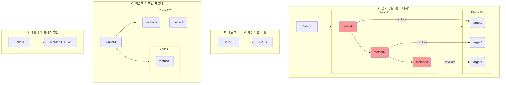

<p align="center"><b>[그림 8] 통과 메서드 문제와 해결 방안 (저서의 그림 7.1 기반)</b></p>
위 다이어그램처럼, (A)와 같은 문제가 발생했을 때, (B) 상위 클래스를 아예 없애고 호출자가 하위 클래스를 직접 사용하게 하거나, (C) 각 클래스가 독립적인 기능을 갖도록 책임을 재분배하거나, (D) 두 클래스를 하나의 깊은 클래스로 합치는 것을 고려해야 합니다.

> **Red Flag: Pass-Through Method (통과 메서드)**
>
> 어떤 메서드가 인자를 거의 그대로 다른 메서드로 전달하는 것 외에 아무 일도 하지 않는다면, 이는 클래스 간의 책임 분배가 잘못되었다는 명백한 위험 신호입니다.


### 2. 인터페이스 중복이 허용되는 경우

물론, 동일한 시그니처를 가진 메서드를 호출하는 것이 항상 나쁜 것은 아닙니다. 핵심적인 판단 기준은 **"새로운 메서드가 의미 있는 기능을 추가하는가?"** 입니다. 통과 메서드가 나쁜 이유는 아무런 기능도 추가하지 않기 때문입니다. 반면, 동일한 인터페이스를 사용하더라도 중요한 가치를 더하는 경우가 있습니다.

* **디스패처 (Dispatcher)** : 디스패처는 인자를 분석하여 여러 다른 처리기(handler) 중 어떤 것을 호출할지 결정하는 역할을 합니다. 예를 들어, 웹 서버는 들어온 HTTP 요청의 URL을 보고, 그 요청을 처리할 적절한 컨트롤러 메서드를 찾아 호출합니다. 이때 디스패처와 컨트롤러 메서드는 동일한 인자(HTTP 요청 객체)를 받을 수 있지만, 디스패처는 '라우팅'이라는 매우 중요한 새 기능을 제공합니다.

* **다형적 구현 (Polymorphic Implementations)** : 동일한 인터페이스를 여러 다른 클래스가 각자의 방식으로 구현하는 경우입니다. 운영체제의 디스크 드라이버가 좋은 예입니다. 모든 드라이버는 `read`, `write`와 같은 동일한 인터페이스를 구현하지만, 내부적으로는 삼성 SSD, WD HDD 등 각기 다른 하드웨어를 제어합니다. 이 경우 인터페이스의 일관성은 오히려 개발자의 인지 부하를 줄여주는 긍정적인 역할을 합니다.


### 3. 데코레이터 패턴의 그림자

'데코레이터(Decorator)' 또는 '래퍼(Wrapper)' 디자인 패턴은 기존 객체를 감싸서 새로운 기능을 추가하는 기법입니다. 이 패턴은 정의상 여러 계층에 걸쳐 API 중복을 장려하는 경향이 있습니다. 제4장에서 비판했던 자바의 `BufferedInputStream`이 대표적인 예입니다. `InputStream` 객체를 감싸서 동일한 `read` API를 제공하지만, 내부적으로 버퍼링 기능을 추가합니다.

데코레이터 패턴의 본래 의도는 클래스의 핵심 기능과 부가적인 확장을 분리하는 것입니다. 하지만 이 패턴은 남용되기 매우 쉽습니다. 아주 작은 기능 하나를 추가하기 위해 새로운 클래스를 만들게 되면서, 결국 **수많은 얕은 클래스의 폭발** 로 이어지기 쉽습니다. 데코레이터 클래스는 종종 수많은 통과 메서드로 채워지게 됩니다.

따라서 데코레이터 클래스를 만들기 전에는 반드시 다음과 같은 대안들을 먼저 고민해야 합니다.

1. **기능을 원래 클래스에 직접 추가할 수는 없는가?** : 추가하려는 기능이 비교적 범용적이거나, 원래 클래스의 본질과 밀접하게 관련되어 있다면, 별도의 클래스로 분리하는 것보다 합치는 것이 더 깊은 모듈을 만듭니다. (예: 버퍼링은 I/O의 본질적인 부분이므로 `InputStream`에 통합되었어야 합니다.)
2. **기능을 사용하는 쪽에 합칠 수는 없는가?** : 특정 사용 사례에만 필요한 기능이라면, 데코레이터 대신 그 기능을 사용하는 클래스 내부에 구현하는 것이 낫습니다.
3. **기존 데코레이터와 합칠 수는 없는가?** : 여러 개의 얕은 데코레이터를 만드는 대신, 하나의 더 깊은 데코레이터로 통합할 수 있습니다.
4. **독립적인 클래스로 만들 수는 없는가?** : 새로운 기능이 반드시 기존 객체를 '감싸야'만 할 수 있는 일인지 자문해야 합니다. 때로는 아무것도 감싸지 않는 독립적인 유틸리티 클래스로 구현하는 것이 더 깔끔할 수 있습니다.


### 4. 인터페이스와 구현의 간극: 가치의 원천

'다른 계층, 다른 추상화' 원칙은 하나의 클래스 내부에도 적용됩니다. 클래스의 `public` 인터페이스를 하나의 계층으로, `private` 구현을 그 아래의 또 다른 계층으로 볼 수 있습니다. 이 두 계층은 반드시 서로 다른 추상화를 제공해야 합니다. 만약 인터페이스와 구현의 추상화 수준이 비슷하다면, 그 클래스는 아마도 깊지 않을 가능성이 높습니다. **인터페이스와 구현 사이의 추상화 수준의 차이, 즉 '간극'이야말로 그 클래스가 제공하는 진정한 가치의 원천** 입니다.

텍스트 에디터의 `Text` 클래스 예제를 다시 생각해 봅시다.

* **나쁜 설계 (간극 없음)** : 내부적으로 텍스트를 줄(line) 단위로 저장하고, API 역시 `getLine()`, `putLine()`과 같은 줄 단위 인터페이스를 제공합니다. 이는 얕은 클래스이며, 사용자는 타자 입력처럼 줄의 중간에 텍스트를 삽입하기 위해 줄을 자르고 합치는 복잡한 로직을 직접 구현해야 합니다.
* **좋은 설계 (큰 간극)** : 내부적으로는 여전히 텍스트를 줄 단위로 저장하지만(구현), API는 임의의 위치에 임의의 길이의 문자열을 삽입/삭제할 수 있는 문자 단위 인터페이스를 제공합니다(인터페이스). 이 클래스는 줄을 자르고 합치는 복잡성을 내부로 '캡슐화'하여 사용자로부터 숨겨주었습니다. 바로 이 **캡슐화된 로직(간극)이 이 클래스가 제공하는 핵심 가치** 이며, 이 클래스를 깊게 만듭니다.


### 5. 통과 변수: 보이지 않는 복잡성의 사슬

API 중복의 또 다른 형태는 '통과 변수'입니다. 이는 **긴 메서드 호출 체인을 따라 전달되지만, 중간의 메서드들에게는 전혀 사용되지 않는 변수** 를 말합니다. 예를 들어, 보안 통신을 위한 인증서 정보가 `main` 함수에서 생성되어 저수준의 소켓 생성 함수 `m3`에서만 필요하다고 가정해 봅시다.

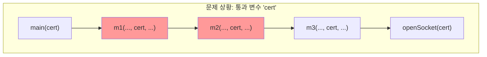

<p align="center"><b>[그림 9] 통과 변수의 문제점</b></p>

`m1`과 `m2`는 `cert` 변수를 전혀 사용하지 않음에도 불구하고, 단지 `m3`에게 전달하기 위해 이 변수의 존재를 알아야만 합니다. 이는 중간 메서드들의 인터페이스를 불필요하게 오염시키고 인지 부하를 높입니다. 나중에 새로운 통과 변수가 추가된다면, 이 호출 체인에 있는 모든 메서드의 시그니처를 수정해야 하는 악몽이 펼쳐집니다.

통과 변수를 제거하는 것은 까다롭지만, 몇 가지 해결책이 있습니다.

* **공유 객체 (Shared Object)** : 최상위와 최하위 메서드가 이미 공유하고 있는 객체가 있다면, 그 객체에 정보를 저장합니다.
* **전역 변수 (Global Variable)** : 가장 간단하지만, 테스트를 어렵게 만들고 여러 인스턴스를 생성할 수 없게 하는 등 수많은 부작용을 낳으므로 거의 항상 피해야 합니다.
* **컨텍스트 객체 (Context Object)** : 저자가 가장 선호하는 해결책입니다. 애플리케이션의 모든 '전역적' 상태(설정값, 공유 서브시스템, 성능 카운터 등)를 `Context`라는 단일 객체에 저장합니다. 이 `Context` 객체에 대한 참조는 시스템의 주요 객체들이 생성자(constructor)를 통해 전달받아 인스턴스 변수로 저장합니다. 이렇게 하면, '전역' 정보가 필요할 때마다 메서드 인자로 전달할 필요 없이, 객체 내부에서 `context`를 참조할 수 있습니다.

**컨텍스트 객체**는 전역 변수의 단점(예: 여러 인스턴스 생성 불가)을 해결하면서도, 통과 변수의 필요성을 제거하는 강력한 패턴입니다. 물론, 컨텍스트 객체 자체가 온갖 데이터가 뒤섞인 거대한 잡동사니가 되지 않도록 신중하게 관리해야 한다는 단점도 있지만, 저자는 아직 이보다 더 나은 해결책을 찾지 못했다고 말합니다.


### 결론: 모든 인프라에는 비용이 따른다

클래스, 메서드, 인자, 정의 등 우리가 시스템에 추가하는 모든 설계 인프라(infrastructure)는 그 자체로 개발자가 학습해야 하는 복잡성을 추가합니다. 어떤 설계 요소가 자신의 존재를 정당화하려면, **자신이 추가하는 복잡성보다 더 많은 복잡성을 시스템의 다른 곳에서 제거해야만 합니다.**

'다른 계층, 다른 추상화'라는 원칙은 바로 이 비용-편익 분석의 한 적용례일 뿐입니다. 통과 메서드나 얕은 데코레이터처럼, 서로 다른 계층이 동일한 추상화를 제공한다면, 그들은 추가적인 인프라 비용을 발생시키면서도 그 비용을 상쇄할 만큼 충분한 혜택을 제공하지 못하고 있을 가능성이 높습니다. 이러한 '무임승차' 계층을 식별하고 제거하여, 모든 계층이 자신만의 고유한 가치를 제공하도록 만드는 것, 이것이 바로 명확하고 효율적인 시스템을 향한 설계자의 길입니다.


## 제8장: 복잡성을 아래로 끌어내리기(Pull Complexity Downwards)

소프트웨어 개발 과정에서 우리는 피할 수 없는 복잡성과 마주하게 됩니다. 이때 개발자는 중요한 선택의 기로에 놓입니다. 이 복잡성의 짐을 누가 져야 하는가? 이 모듈을 구현하는 단 한 명의 개발자인 '나'인가, 아니면 앞으로 이 모듈을 사용하게 될 수많은 동료 개발자, 즉 '사용자'들인가? 존 아우스터하우트 교수는 제8장에서 이 질문에 대한 명확하고도 철학적인 답변을 제시합니다. 바로 **"복잡성을 아래로 끌어내려라(Pull Complexity Downwards)"**는 원칙입니다. 이 원칙은 단순한 기술적 조언을 넘어, 훌륭한 소프트웨어 엔지니어가 가져야 할 직업적 미덕과 맞닿아 있습니다.

이 글은 제8장의 핵심 사상을 심도 있게 분석하고 구체적인 사례를 통해 그 의미를 완벽하게 해설하는 것을 목표로 합니다. 우리는 왜 단순한 구현보다 단순한 인터페이스가 더 중요한지, 그리고 개발자가 기꺼이 짊어져야 할 '고통'이 어떻게 시스템 전체를 더 위대하게 만드는지를 탐구할 것입니다.

---


### 1. 단순한 인터페이스 vs. 단순한 구현: 개발자의 선택

모듈을 개발할 때, 우리는 종종 두 가지 유혹 사이에서 갈등합니다. 하나는 **'단순한 구현'**에 대한 유혹입니다. 모듈의 내부 로직을 가능한 한 간단하게 만들어 개발자 자신의 작업을 쉽고 빠르게 끝내려는 본능적인 욕구입니다. 반면, 다른 하나는 **'단순한 인터페이스'**를 향한 지향입니다. 모듈을 사용하는 쪽에서 최대한 편리하고 직관적으로 사용할 수 있도록, 복잡한 부분은 모두 내부에서 처리하려는 이타적인 목표입니다. 아우스터하우트 교수는 이 둘 사이에서 우리가 무엇을 선택해야 하는지를 명확히 합니다.

> **모듈은 단순한 구현(simple implementation)보다 단순한 인터페이스(simple interface)를 갖는 것이 더 중요하다.**
> (It is more important for a module to have a simple interface than a simple implementation.)

이 문장은 제8장의 핵심을 관통하는 가장 중요한 명제입니다. 대부분의 모듈은 그것을 개발하는 사람보다 사용하는 사람이 훨씬 많습니다. 한 명의 개발자가 겪는 약간의 고통(복잡한 구현)은 수십, 수백 명의 사용자가 겪게 될 거대한 고통(복잡한 인터페이스)을 막아줍니다. 따라서 모듈 개발자는 사용자들의 삶을 최대한 편하게 만들어주기 위해 노력해야 하며, 이는 설령 자신에게 추가적인 작업 부담을 안겨주더라도 감수해야 할 가치가 있습니다.

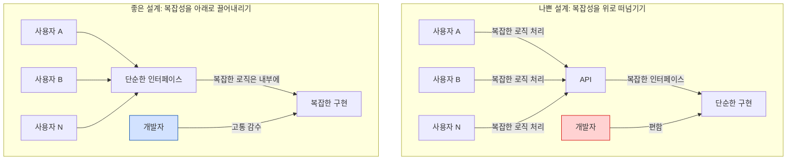

<p align="center"><b>[그림 1] 복잡성의 방향성: 위로 떠넘기기 vs. 아래로 끌어내리기</b></p>

개발자로서 우리는 종종 어려운 문제를 다른 사람에게 떠넘기고 싶은 유혹을 느낍니다. 어떻게 처리해야 할지 불확실한 예외 상황이 발생하면, 간단하게 예외를 던져버리고 호출자가 알아서 처리하게 만듭니다. 어떤 정책을 적용해야 할지 애매하면, 몇 개의 설정 매개변수(configuration parameter)를 만들어 시스템 관리자가 최적의 값을 찾도록 미루어 버립니다. 이러한 접근 방식은 단기적으로 개발자의 삶을 편하게 만들지만, 결과적으로는 복잡성을 증폭시켜 한 명이 해결할 수 있었던 문제를 여러 사람이 고민하게 만듭니다. 이는 시스템 전체의 복잡도를 기하급수적으로 늘리는 최악의 선택입니다.

---


### 2. 사례 연구 1: 텍스트 에디터와 라인(Line)의 저주

이 원칙을 가장 잘 보여주는 구체적인 사례로 책의 여러 장에 걸쳐 등장하는 GUI 텍스트 에디터 프로젝트를 들 수 있습니다. 이 프로젝트의 핵심 모듈 중 하나는 파일의 텍스트 데이터를 관리하는 `Text` 클래스입니다. 많은 학생들이 이 클래스를 구현할 때, 내부적으로 텍스트를 줄(line) 단위로 저장하고, 인터페이스 또한 줄 단위로 제공하는 방식을 선택했습니다.

* **선택된 방식**: 라인 지향 인터페이스 (Line-oriented interface)
  * `getLine(lineNumber)`: 특정 줄의 텍스트를 가져온다.
  * `insertLine(lineNumber, text)`: 특정 위치에 새로운 줄을 삽입한다.
  * `deleteLine(lineNumber)`: 특정 줄을 삭제한다.

이 방식은 `Text` 클래스를 구현하는 개발자에게는 매우 매력적입니다. 내부 데이터 구조(예: `List<String>`)와 인터페이스가 거의 일치하므로 구현이 매우 간단하고 직관적이기 때문입니다. 하지만 이는 전형적으로 복잡성을 상위 계층, 즉 사용자 인터페이스(UI)를 구현하는 코드로 떠넘기는 행위입니다.

UI 관점에서 사용자의 동작은 대부분 줄 단위로 일어나지 않습니다.

* 사용자가 기존 줄의 중간에 글자를 타이핑합니다.
* 사용자가 여러 줄에 걸친 텍스트 일부를 선택(selection)하여 복사하거나 삭제합니다.

라인 지향 인터페이스 하에서 이러한 UI 동작을 구현하려면 어떻게 해야 할까요? UI 계층의 코드는 다음과 같은 끔찍하고 복잡한 로직을 수행해야만 합니다.

```java
// 사용자가 한 줄의 중간에 텍스트를 삽입하려는 경우 (UI 레이어 코드)

// 1. 기존 라인을 가져온다.
String currentLine = text.getLine(cursor.getLineNumber());

// 2. 직접 문자열을 분리하고 재조합한다. (복잡성!)
String beforeCursor = currentLine.substring(0, cursor.getCharacterIndex());
String afterCursor = currentLine.substring(cursor.getCharacterIndex());
String newLine = beforeCursor + textToInsert + afterCursor;

// 3. 기존 라인을 삭제하고, 새로운 라인을 다시 삽입한다.
text.deleteLine(cursor.getLineNumber());
text.insertLine(cursor.getLineNumber(), newLine);
```

이처럼, 줄을 나누고 합치는 복잡한 책임이 `Text` 클래스를 사용하는 UI 계층으로 전부 전가되었습니다. `Text` 클래스 개발자 한 명의 편의를 위해, 수많은 UI 기능을 개발하는 모든 개발자가 고통받는 구조가 된 것입니다.

그렇다면 어떻게 복잡성을 아래로 끌어내릴 수 있을까요? `Text` 클래스가 문자(character) 또는 범위(range) 지향 인터페이스를 제공하면 됩니다.

* **개선된 방식**: 범위 지향 인터페이스 (Range-oriented interface)
  * `insert(position, text)`: 임의의 위치에 임의의 텍스트(개행 포함)를 삽입한다.
  * `delete(startPosition, endPosition)`: 임의의 범위에 있는 텍스트를 삭제한다.

이 인터페이스를 사용하면, 앞서 보았던 UI 코드는 다음과 같이 극적으로 단순해집니다.

```java
// 사용자가 한 줄의 중간에 텍스트를 삽입하려는 경우 (UI 레이어 코드)

// 1. Text 클래스에 작업을 위임한다.
text.insert(cursor.getPosition(), textToInsert);
```

물론, 이러한 변화로 인해 `Text` 클래스의 **구현**은 훨씬 더 복잡해질 것입니다. 내부적으로 텍스트를 줄 단위로 관리한다면, `insert` 메서드 내에서 줄을 나누고 합치는 로직을 직접 수행해야 하기 때문입니다. 하지만 이것이 바로 '복잡성을 아래로 끌어내리는' 행위입니다. 줄 분리와 병합에 대한 복잡성은 이제 `Text` 클래스 내부에 완벽하게 캡슐화되고 정보 은닉됩니다. 상위 계층의 코드들은 더 이상 그 복잡성에 대해 알 필요가 없으며, 시스템의 전체 복잡도는 크게 감소합니다. 개발자 한 명의 '고통'이 시스템 전체를 구원한 것입니다.

---


### 3. 사례 연구 2: 설정 매개변수(Configuration Parameter)의 함정

복잡성을 위로 떠넘기는 또 다른 흔한 예는 바로 과도한 설정 매개변수(configuration parameter)의 사용입니다. 클래스 내부에서 어떤 동작을 결정하는 대신, 그 결정을 외부로 노출하여 사용자가 값을 지정하게 만드는 방식입니다. 예를 들어, 네트워크 요청 실패 시 재시도 간격, 캐시의 크기 등을 설정 값으로 빼는 경우를 생각할 수 있습니다.

설정 매개변수를 옹호하는 사람들은 "사용자에게 유연성을 제공한다"고 주장합니다. 특정 도메인에 대한 지식이 풍부한 사용자가 시스템을 자신의 환경에 맞게 최적화할 수 있다는 것입니다. 이는 일부 상황에서는 사실입니다. 예를 들어, 어떤 요청이 다른 요청보다 시간적으로 더 중요한지(time-critical)는 시스템 하위 계층에서는 알기 어렵기 때문에, 사용자가 직접 요청의 우선순위를 지정하도록 하는 것은 합리적일 수 있습니다.

하지만 대부분의 경우, 설정 매개변수는 개발자가 중요한 문제에 대한 고민을 회피하고 그 책임을 다른 사람에게 떠넘기는 손쉬운 변명으로 사용됩니다. 사용자는 종종 올바른 값을 결정할 만큼 충분한 컨텍스트나 지식을 가지고 있지 않습니다. 반면, 해당 모듈을 개발한 개발자는 그 동작 원리를 가장 잘 이해하고 있으므로, 합리적인 값을 자동으로 결정할 최적의 위치에 있습니다.

네트워크 패킷 손실에 대응하는 프로토콜을 예로 들어 봅시다.

* **복잡성을 위로 떠넘기는 방식**: `retryInterval`이라는 설정 매개변수를 노출합니다. 시스템 관리자는 수많은 시행착오를 거쳐 자신의 네트워크 환경에 맞는 최적의 값을 찾아야 합니다. 네트워크 환경이 바뀌면 이 값은 쓸모없게 되며, 다시 고통스러운 튜닝 과정을 거쳐야 합니다.
* **복잡성을 아래로 끌어내리는 방식**: 프로토콜이 스스로 성공한 요청들의 응답 시간(RTT)을 지속적으로 측정하고, 이를 기반으로 동적으로 `retryInterval` 값을 계산합니다. (예: `retryInterval = averageRTT * 2 + 4 * deviationRTT`) 이 구현은 개발자에게는 더 많은 노력을 요구하지만, 사용자는 `retryInterval`의 존재 자체를 알 필요가 없습니다. 시스템은 변화하는 환경에 자동으로 적응하는 '더 스마트한' 시스템이 됩니다.

따라서 우리는 새로운 설정 매개변수를 외부에 노출하기 전에 항상 다음과 같은 질문을 스스로에게 던져야 합니다.

> **"사용자(혹은 상위 모듈)가 정말로 이곳보다 더 나은 값을 결정할 수 있는가?"**

만약 그렇지 않다면, 복잡성을 아래로 끌어내려 내부에서 자동으로 처리하는 방법을 치열하게 고민해야 합니다. 설령 설정 매개변수를 만들어야만 하는 상황이라도, 대부분의 사용자가 아무런 설정 없이도 시스템을 사용할 수 있도록 합리적인 기본값(default)을 반드시 제공해야 합니다.

---


### 4. 과유불급: 원칙을 극단으로 밀어붙일 때의 위험

"복잡성을 아래로 끌어내려라"는 원칙은 매우 강력하지만, 모든 원칙이 그렇듯 맹목적으로 적용해서는 안 됩니다. 이 아이디어를 극단으로 밀어붙이면, 애플리케이션의 모든 기능을 단 하나의 거대한 클래스로 끌어내리려는 잘못된 시도로 이어질 수 있습니다. 이는 명백히 잘못된 설계입니다. 이 원칙이 가장 효과적으로 적용되는 경우는 다음의 세 가지 조건을 만족할 때입니다.

1. **연관성**: 끌어내리려는 복잡성이 해당 클래스의 기존 핵심 기능과 밀접하게 관련되어 있어야 합니다.
2. **전체적 단순화**: 복잡성을 끌어내린 결과, 애플리케이션의 다른 부분이 실제로 단순해져야 합니다.
3. **인터페이스 단순화**: 복잡성을 끌어내린 결과, 해당 클래스의 인터페이스가 더 단순해지거나 추상화 수준이 높아져야 합니다.

책의 제6장에서 다루었던 '나쁜 설계' 사례를 다시 생각해 봅시다. 일부 학생들은 텍스트 에디터의 `Text` 클래스에 `backspace()`와 같이 UI 동작과 직접적으로 관련된 메서드를 만들었습니다. 이는 표면적으로는 '백스페이스 키 처리'라는 복잡성을 UI 계층에서 `Text` 클래스로 끌어내린 것처럼 보입니다.

하지만 이 경우는 위 세 가지 조건을 만족하지 못합니다.

1. **연관성 부족**: '백스페이스 키'라는 개념은 UI에 특화된 추상화이며, 범용적인 텍스트 데이터 관리라는 `Text` 클래스의 핵심 기능과는 거리가 멉니다.
2. **전체적 단순화 실패**: `backspace()` 메서드가 있다고 해서 UI 계층의 코드가 크게 단순해지지 않습니다. 오히려 UI의 변경이 `Text` 클래스에까지 영향을 미치는 새로운 의존성을 만듭니다.
3. **인터페이스 복잡화**: 범용적이어야 할 인터페이스에 특수 목적의 메서드가 추가되어 인터페이스를 더럽히고, 정보 누출(information leakage)을 유발합니다.

이처럼, 원칙을 기계적으로 적용하는 것은 위험합니다. 항상 우리의 최종 목표는 **'시스템 전체의 복잡도를 최소화'**하는 것임을 잊지 말아야 합니다. "복잡성을 아래로 끌어내리는" 것은 그 목표를 달성하기 위한 강력한 도구 중 하나일 뿐, 그 자체가 목표가 될 수는 없습니다.

---


### 결론: 기꺼이 고통을 짊어지는 개발자의 미덕

제8장 "복잡성을 아래로 끌어내리기"는 우리에게 기술적 지침 이상의 것을 가르쳐 줍니다. 그것은 바로 **사용자를 향한 깊은 공감과 책임감**입니다. 훌륭한 소프트웨어 설계는 단지 기술적 탁월함의 문제가 아니라, 동료 개발자들의 작업을 더 쉽고 생산적으로 만들어주기 위해 기꺼이 추가적인 노력을 감수하려는 태도의 문제입니다.

모듈을 개발할 때, 우리는 항상 우리 자신을 위해 약간의 '추가적인 고통'을 감수할 기회를 찾아야 합니다. 그 작은 고통이 우리 모듈의 사용자들에게는 거대한 편리함과 단순함으로 돌아갈 것이기 때문입니다. 단순한 구현의 유혹을 뿌리치고, 단순하고 우아한 인터페이스를 빚어내는 데 집중하십시오. 그것이 바로 전술적 프로그래머를 넘어 전략적 프로그래머로 나아가는 길이며, 복잡성과의 전쟁에서 승리하는 가장 확실한 방법입니다.

---


## 제9장: 함께가 나을까, 따로가 나을까? (Better Together Or Better Apart?)

소프트웨어 개발자로서 우리는 매일 수많은 설계 결정의 기로에 섭니다. 그중에서도 가장 근본적이고 빈번하게 마주하는 질문은 바로 이것일 겁니다: "이 두 기능은 한곳에 함께 두는 것이 좋을까, 아니면 별개의 장소로 나누는 것이 좋을까?" 이 질문은 메서드, 클래스, 서비스 등 시스템의 모든 수준에서 나타납니다. 파일 I/O 클래스에 버퍼링 기능을 내장해야 할까요, 아니면 별도 클래스로 분리해야 할까요? HTTP 요청을 파싱하는 로직을 단일 메서드에 모두 담아야 할까요, 아니면 여러 메서드로 나누어야 할까요? 존 아우스터하우트 교수는 제9장에서 이 오래된 질문에 대한 명쾌한 판단 기준을 제시하며, 단순히 '작게 나누는 것'이 미덕이라는 맹목적인 믿음에 경종을 울립니다.

이 장의 핵심은, 분할(separation)과 통합(combination)의 결정이 임의의 규칙(예: '메서드는 20줄 이하여야 한다')이 아니라, 오직 **'시스템 전체의 복잡성을 줄이고 모듈성을 향상시키는가'**라는 단 하나의 원칙에 의해 이루어져야 한다는 것입니다. 많은 개발자들이 "컴포넌트는 작을수록 좋다"고 생각하지만, 저자는 분할 그 자체가 새로운 복잡성을 야기하는 '비용'을 수반한다고 경고합니다. 이 글에서는 저자가 제시하는 분할의 비용을 먼저 살펴보고, 언제 함께하고 언제 따로 해야 하는지에 대한 구체적인 지침과 예시를 깊이 있게 탐구할 것입니다.


### 1. 나누는 것의 비용: 분할이 야기하는 숨겨진 복잡성

시스템을 더 작고 관리하기 쉬운 조각으로 나누는 것은 직관적으로 올바른 접근법처럼 보입니다. 각 컴포넌트가 작아지면 그 자체를 이해하기는 더 쉬워질 테니까요. 하지만 아우스터하우트 교수는 이러한 분할 행위가 그전에는 존재하지 않았던 새로운 형태의 복잡성을 시스템에 추가한다고 지적합니다. 어떤 코드를 분리하기 전에, 우리는 그로 인해 발생하는 다음과 같은 비용들을 신중하게 고려해야 합니다.

* **컴포넌트 수의 증가로 인한 인지 부하**: 시스템을 구성하는 부품의 수가 많아질수록 전체를 파악하고 추적하기가 더 어려워집니다. 수많은 클래스와 파일 속에서 원하는 컴포넌트를 찾는 것 자체가 비용이 됩니다.
* **인터페이스의 증가**: 분할은 필연적으로 더 많은 인터페이스를 만들어냅니다. 그리고 모든 새로운 인터페이스는 개발자가 학습하고 이해해야 할 또 다른 복잡성의 한 조각입니다.
* **물리적 분리로 인한 관계 파악의 어려움**: 분할된 컴포넌트들은 소스 코드 상에서 서로 멀리 떨어지게 됩니다. 원래 한 클래스에 있던 메서드들이 여러 다른 클래스와 파일로 흩어지면, 개발자는 이들 간의 관계를 파악하기 위해 여러 파일을 번갈아 열어봐야 합니다. 컴포넌트들이 진정으로 독립적이라면 이는 장점이지만, 서로 의존성이 있다면 분리는 오히려 이해를 방해하는 장벽이 됩니다.
* **중복의 발생 가능성**: 단일 컴포넌트일 때는 한 번만 존재했던 코드가, 분할된 여러 컴포넌트에 각각 존재해야 하는 상황이 발생할 수 있습니다. 이는 유지보수 비용을 증가시키는 직접적인 원인이 됩니다.
* **컴포넌트 관리를 위한 추가 코드**: 단일 객체만 다루면 되었던 코드가, 분할 이후에는 여러 객체를 생성하고, 관리하고, 조립해야 하는 추가적인 로직을 떠안게 될 수 있습니다.

이처럼 분할은 공짜가 아닙니다. 따라서 우리는 언제나 '이 분할이 그 비용을 상쇄하고도 남을 만큼의 가치를 제공하는가?'를 자문해야 합니다.

---


### 2. 언제 '함께'가 더 나은가?: 통합의 기준

그렇다면 어떤 경우에 기능들을 하나의 모듈로 합치는 것이 더 이로울까요? 저자는 세 가지 명확한 기준을 제시합니다. 이 기준들은 모두 '정보 은닉', '인터페이스 단순화', '중복 제거'라는 더 큰 설계 원칙과 맞닿아 있습니다.


#### 2.1. 정보가 공유될 때 (Bring together if information is shared)

두 개 이상의 코드 조각이 동일한 정보나 지식에 의존하고 있다면, 이들을 한데 모으는 것을 강력하게 고려해야 합니다. 분리된 각 모듈이 동일한 파일 형식의 내부 구조, 특정 프로토콜의 구문, 혹은 복잡한 비즈니스 규칙을 알고 있어야 한다면, 이는 **정보 누출(Information Leakage)**이 발생했다는 명백한 신호입니다. 규칙이 변경될 때마다 관련된 모든 모듈을 찾아 수정해야 하므로 '변경 증폭'이 발생하고, 시스템은 취약해집니다.

저자는 5장에서 다룬 HTTP 서버의 예시를 다시 언급합니다.

1. **메서드 A**: 네트워크 소켓에서 HTTP 요청 텍스트를 읽어와 문자열로 반환한다.
2. **메서드 B**: 메서드 A가 반환한 문자열을 파싱하여 요청의 각 컴포넌트를 추출한다.

이 구조에서 메서드 A는 단순히 '읽기'만 하는 것처럼 보이지만, 요청의 끝이 어디인지 알기 위해서는 HTTP 헤더를 파싱하여 `Content-Length` 같은 정보를 해석해야 합니다. 결국, 메서드 A와 B는 둘 다 HTTP 요청 형식이라는 복잡한 정보를 공유하게 됩니다. 이 경우, 요청을 읽는 기능과 파싱하는 기능을 하나의 클래스나 메서드로 통합하는 것이 훨씬 나은 설계입니다. 통합을 통해 HTTP 형식에 대한 모든 지식은 단 하나의 장소에 캡슐화되어 정보 은닉이 강화되고, 코드의 길이도 줄어들며, 두 메서드 사이를 오가던 중간 데이터(요청 문자열) 인터페이스도 사라져 시스템이 더 단순해집니다.

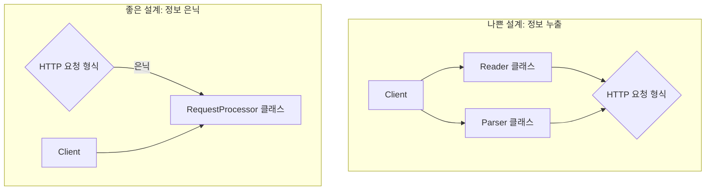

<p align="center"><b>[그림 1] 정보 공유에 기반한 통합의 효과</b></p>


#### 2.2. 인터페이스가 단순해질 때 (Bring together if it will simplify the interface)

두 모듈을 하나로 합쳤을 때, 원래의 두 인터페이스보다 더 단순하거나 사용하기 쉬운 단일 인터페이스를 제공할 수 있다면 이는 강력한 통합의 신호입니다. 이는 종종 각 모듈이 문제 해결의 한 부분씩을 담당하고 있을 때 발생합니다. 통합된 모듈은 사용자로부터 더 많은 세부 사항을 숨기고, 더 높은 수준의 추상화를 제공하는 **'깊은(deep) 모듈'**이 될 수 있습니다.

이 책에서 반복적으로 비판받는 Java의 I/O 라이브러리가 대표적인 예입니다. 파일을 읽기 위해 `FileInputStream` 객체를 만들고, 버퍼링을 위해 이를 다시 `BufferedInputStream`으로 감싸야 하는 구조는 사용자에게 '버퍼링'이라는 내부 구현 디테일을 강제로 노출합니다.

> 나쁜 설계: 사용자가 직접 두 클래스를 조합해야 함
>
> ```java
> FileInputStream fis = new FileInputStream("file.txt");
> BufferedInputStream bis = new BufferedInputStream(fis);
> // bis를 사용...
> ```

만약 이 두 클래스가 하나로 통합되어 버퍼링이 기본적으로 제공되었다면 어땠을까요? 대부분의 사용자는 버퍼링의 존재조차 알 필요 없이 더 단순한 인터페이스를 사용하게 될 것입니다. 통합된 클래스는 필요에 따라 버퍼링을 비활성화하는 옵션을 제공할 수 있지만, 중요한 것은 **'가장 흔한 사용 사례(the common case)를 최대한 단순하게 만드는 것'**입니다. 통합은 이러한 인터페이스 단순화를 가능하게 하는 강력한 도구입니다.


#### 2.3. 중복을 제거할 수 있을 때 (Bring together to eliminate duplication)

코드 중복은 시스템 복잡성의 명백한 적신호(**Red Flag: Repetition**)입니다. 동일하거나 거의 유사한 코드 패턴이 시스템 곳곳에서 반복된다면, 이는 올바른 추상화를 찾지 못했다는 증거입니다. 이러한 중복은 단순히 코드를 한데 모으는 것으로 해결할 수 있습니다.

* **방법 1: 헬퍼 메서드로 추출**: 가장 일반적인 방법은 중복되는 코드 조각을 별도의 메서드로 추출하고, 원래 위치에서는 이 메서드를 호출하도록 변경하는 것입니다. 이 방법은 중복 코드가 길고, 추출된 메서드의 시그니처가 단순할 때 가장 효과적입니다.
* **방법 2: 제어 흐름 리팩토링**: 여러 분기문에서 동일한 후처리(cleanup) 코드가 반복되는 경우, 코드의 제어 흐름을 재구성하여 후처리 코드가 단 한 번만 나타나도록 할 수 있습니다. 저자는 논란의 여지가 있는 `goto` 문을 이럴 때 유용하게 사용할 수 있는 예로 듭니다. 각 에러 처리 블록에서 `goto cleanup_label;`을 호출하고, 메서드 끝에 있는 `cleanup_label`에서 공통 정리 작업을 수행하는 방식입니다. 이는 `goto`의 남용이 아니라, 중첩된 코드에서 탈출하여 중복을 제거하는 제한적이고 효과적인 사용법입니다.

어떤 방식을 사용하든, 핵심은 반복되는 로직을 한곳으로 '모아서' 단일 책임의 원칙을 지키고 유지보수성을 높이는 것입니다.

---


### 3. 언제 '따로'가 더 나은가?: 분리의 기준

반대로, 무분별한 통합은 오히려 복잡성을 증가시킬 수 있습니다. 서로 관련 없는 기능들이 한 클래스에 섞여 있다면 클래스의 책임은 모호해지고, 코드를 이해하고 수정하기는 더 어려워집니다. 저자는 특히 다음과 같은 경우에 단호하게 분리를 해야 한다고 강조합니다.


#### 3.1. 범용 코드와 특수 목적 코드의 분리 (Separate general-purpose and special-purpose code)

이는 이 책을 관통하는 가장 중요한 원칙 중 하나입니다. 만약 어떤 모듈이 여러 다른 목적으로 사용될 수 있는 범용적인 메커니즘을 포함하고 있다면, 그 모듈은 오직 그 범용 메커니즘만을 제공해야 합니다. 특정 사용 사례에만 해당하는 특수 목적 코드가 범용 모듈 안에 섞여 들어가서는 안 됩니다(**Red Flag: Special-General Mixture**). 특수 목적 코드는 그 목적과 관련된 별도의 모듈에 위치해야 합니다.

6장에서 다룬 GUI 텍스트 에디터의 `Text` 클래스가 완벽한 예시입니다.

* **나쁜 설계**: `Text` 클래스가 `backspace()`나 `deleteSelection()`과 같이 UI와 관련된 특수 목적 메서드를 포함합니다.
* **좋은 설계**: `Text` 클래스는 `insert(position, string)`이나 `delete(start, end)`와 같은 범용적인 텍스트 조작 메서드만 제공합니다. '백스페이스'나 '선택 영역 삭제'와 같은 UI 동작을 구현하는 책임은 UI 계층의 코드가 `Text` 클래스의 범용 메서드를 조합하여 수행합니다.

이렇게 분리함으로써, `Text` 클래스는 UI에 대한 어떤 정보도 알 필요가 없게 되어 재사용성이 높아지고, `Text` 클래스와 UI 모듈 간의 정보 누출이 사라집니다.


#### 3.2. 예시: 삽입 커서와 선택 영역 (Example: Insertion Cursor and Selection)

저자는 이 원칙을 설명하기 위해 텍스트 에디터의 '삽입 커서'와 '선택 영역' 관리 예시를 듭니다. 이 둘은 몇 가지 연관성이 있습니다. 커서는 항상 선택 영역의 한쪽 끝에 위치하고, 텍스트를 입력하면 선택 영역이 먼저 삭제되는 등 함께 동작하는 경우가 많습니다. 이러한 연관성 때문에 한 학생 팀은 이 둘을 `SelectionAndCursor`라는 단일 객체로 통합하여 관리하고자 했습니다.

하지만 이 통합은 실패한 설계였습니다.

* **복잡한 내부 상태**: 커서가 선택 영역의 시작점에 있는지 끝점에 있는지, 그리고 선택 영역 자체가 존재하는지 여부를 추적하기 위한 추가적인 boolean 플래그들이 필요해져 내부 구현이 더 복잡해졌습니다.
* **불편한 인터페이스**: 상위 계층의 코드는 여전히 커서와 선택 영역을 별개의 개념으로 다루어야 했습니다. 텍스트를 삽입하기 위해, (1) 통합 객체의 '선택 영역 삭제' 메서드를 호출하고, (2) 다시 통합 객체의 '커서 위치 가져오기' 메서드를 호출해야 했습니다. 통합으로 인해 얻는 이점이 전혀 없었습니다.

결국 이 설계는 커서와 선택 영역을 분리하는 방향으로 리팩토링되었습니다. `Position`이라는 더 낮은 수준의 범용 클래스를 도입하여, 커서는 하나의 `Position` 객체로, 선택 영역은 두 개의 `Position` 객체로 표현했습니다. 그 결과, 각 객체의 구현은 훨씬 단순해졌고, 인터페이스 또한 명확해졌습니다. 이는 서로 다른 개념을 억지로 통합하려 할 때 발생하는 복잡성의 좋은 예시입니다.

---


### 4. 더 작은 단위에 대한 고찰: 메서드 분할과 통합

'함께냐 따로냐'의 원칙은 클래스뿐만 아니라 메서드 수준에도 동일하게 적용됩니다. 많은 개발자들이 "메서드는 무조건 짧아야 한다"는 강박에 시달리지만, 저자는 **길이 자체는 메서드를 나누는 좋은 기준이 거의 될 수 없다**고 단언합니다. 오히려 무분별한 분할은 여러 개의 얕고 서로 강하게 의존하는 '결합된 메서드(**Red Flag: Conjoined Methods**)'를 낳을 뿐입니다. 하나의 메서드를 이해하기 위해 다른 메서드의 구현을 반드시 함께 봐야만 하는 상황이라면, 그 분할은 잘못된 것입니다.


#### 4.1. 메서드는 언제 나누어야 하는가?

저자는 메서드 분할이 의미 있는 경우는 오직 전체적인 추상화가 더 깔끔해질 때뿐이며, 이는 다음 두 가지 상황에서 발생한다고 말합니다.

1. **하위 작업 추출 (Extracting a Subtask)**: 원래 메서드의 작업 중 일부가 논리적으로 분리 가능하고 재사용될 수 있는 독립적인 하위 작업일 경우, 이를 별도의 (주로 private) 헬퍼 메서드로 추출합니다. 좋은 추출의 조건은 (a) 자식 메서드를 읽을 때 부모 메서드에 대해 알 필요가 없고, (b) 부모 메서드를 읽을 때 자식 메서드의 '구현'을 알 필요 없이 '인터페이스'만으로 충분해야 한다는 것입니다.

2. **복잡한 인터페이스 분해 (Decomposing a Complex Interface)**: 원래 메서드가 서로 관련 없는 여러 가지 일을 동시에 처리하려다 보니 인터페이스가 지나치게 복잡해진 경우, 메서드의 기능을 여러 개의 더 작고 집중된 공개 메서드로 분할할 수 있습니다. 이 경우, 분할된 각 메서드의 인터페이스는 원래 메서드보다 훨씬 단순해야 합니다. 이상적으로, 대부분의 호출자는 분할된 메서드 중 하나만 호출하면 충분해야 합니다.


#### 4.2. 다른 견해: Clean Code와의 비교

이 지점에서 저자는 로버트 C. 마틴(Robert C. Martin)의 저서 "Clean Code"의 철학과 정면으로 대립각을 세웁니다. "Clean Code"는 "함수는 작아야 한다. 그리고 그것보다 더 작아야 한다."라고 주장하며 극단적으로 짧은 함수를 옹호합니다. 저자는 이러한 접근법이 다음과 같은 문제를 야기한다고 비판합니다.

> "Clean Code" 스타일은 수많은 얕은 함수들을 낳는다. 결국 개발자는 하나의 논리적인 작업을 이해하기 위해 수십 개의 작은 함수들 사이를 끊임없이 오가야 하며, 이는 전체적인 인지 부하를 폭발적으로 증가시킨다.

아우스터하우트 교수는 간결하지만 강력한 한 문장으로 자신의 철학을 요약합니다.

> **"깊이가 길이보다 중요하다. (Depth is more important than length.)"**

먼저 인터페이스가 단순하고 기능이 강력한 '깊은' 메서드를 만드는 데 집중하고, 그 후에 부수적으로 쉽게 읽힐 수 있도록 길이를 조절하라는 것입니다. 깊이를 희생하면서까지 길이를 줄여서는 안 됩니다.


### 결론: 복잡성이라는 단 하나의 저울

제9장은 소프트웨어 설계의 본질적인 트레이드오프를 다룹니다. 분할과 통합의 결정은 '컴포넌트의 크기'나 '코드 라인 수' 같은 피상적인 지표가 아니라, 오직 **'어느 쪽이 시스템의 총체적인 복잡성을 더 효과적으로 줄이는가?'**라는 단 하나의 저울로 측정되어야 합니다.

결정을 내릴 때, 우리는 스스로에게 다음과 같은 질문을 던져야 합니다.

* 이 결정이 더 나은 정보 은닉을 가져오는가?
* 모듈 간의 의존성을 줄이는가?
* 더 깊고 단순한 인터페이스를 만드는가?
* 결과적으로, 이 코드를 처음 보는 동료 개발자의 인지 부하를 낮춰주는가?

'함께가 나을까, 따로가 나을까?'에 대한 정답은 없습니다. 하지만 존 아우스터하우트 교수가 제시하는 이 명확한 판단 기준들은 우리가 복잡성이라는 안개 속에서 길을 잃지 않고, 더 견고하고 우아한 소프트웨어를 향해 나아갈 수 있도록 도와주는 신뢰할 수 있는 나침반이 되어줄 것입니다.

---


## 제10장: 오류를 존재하지 않게 정의하라 (Define Errors Out Of Existence)

소프트웨어 시스템을 구축할 때 개발자가 마주하는 가장 까다롭고 성가신 영역 중 하나는 바로 예외 처리(Exception Handling)입니다. 정상적인 흐름을 방해하는 온갖 특별한 조건들을 다루는 코드는 본질적으로 복잡하며, 시스템 전체에 보이지 않는 비용을 부과합니다. 존 아우스터하우트 교수는 제10장에서 이 문제를 정면으로 다루며, '더 많은 오류를 잡을수록 좋다'는 통념에 도전하는 파격적이면서도 심오한 철학을 제시합니다. 그것은 바로, 예외를 처리하는 가장 좋은 방법은 애초에 예외가 발생하지 않도록 API의 의미(semantics) 자체를 재설계하는 것입니다. 이 글은 제10장의 핵심 사상을 네 가지 구체적인 전략으로 나누어 심도 있게 분석하고, 실제 사례를 통해 그 철학이 어떻게 코드의 복잡성을 극적으로 낮추는지 탐구합니다.


### 1. 예외 처리는 왜 복잡성의 근원인가?

우리가 어떤 문제에 대한 해결책을 논하기 전에, 그 문제가 왜 심각한지부터 명확히 이해해야 합니다. 아우스터하우트는 예외 처리가 단순한 부가 기능이 아니라, 시스템 복잡성을 기하급수적으로 증가시키는 근본적인 원인 중 하나라고 주장합니다. 여기서 말하는 '예외(exception)'란 언어의 `try-catch` 구문뿐만 아니라, 특정 값을 반환하거나(예: `null`, `-1`) 프로그램의 정상적인 제어 흐름을 변경하는 모든 '일반적이지 않은 조건'을 포괄하는 개념입니다.

예외 처리가 복잡성을 낳는 이유는 다음과 같이 정리할 수 있습니다.

* **제어 흐름의 파괴**: 예외는 코드의 선형적인 흐름을 깨뜨립니다. 개발자는 정상 경로(happy path)뿐만 아니라, 코드의 어느 지점에서든 발생할 수 있는 모든 예외 경로를 머릿속에 그려야 합니다. 이는 엄청난 **인지 부하(Cognitive Load)**를 유발합니다.

* **복구 로직의 복잡성**: 예외가 발생했을 때 단순히 작업을 중단하는 것만으로는 충분하지 않을 때가 많습니다. 예외 발생 이전까지 변경된 시스템의 상태를 일관성 있게 되돌려 놓아야(unwinding) 하며, 이 복구 로직은 종종 원래의 비즈니스 로직보다 더 복잡합니다.

* **2차 예외의 발생**: 오류를 복구하는 과정에서 또 다른 오류가 발생할 수 있습니다. 예를 들어, 네트워크 패킷 유실을 복구하기 위해 패킷을 재전송했는데, 사실 원래 패킷은 유실된 것이 아니라 지연된 것이었다면 수신 측에서는 중복 패킷이라는 새로운 예외 상황을 처리해야 합니다.

* **코드의 장황함과 가독성 저하**: 예외 처리를 위한 `try-catch` 같은 구문은 상당한 양의 상용구(boilerplate) 코드를 만들어냅니다. 정상적인 로직은 몇 줄 안 되는데, 예외 처리를 위한 코드가 수십 줄을 차지하며 코드의 가독성을 심각하게 해칩니다.

    ```java
    // 단 한 줄의 readObject() 호출을 위해 얼마나 많은 catch 블록이 필요한가?
    try {
        tweets.add((Tweet) objectStream.readObject());
    } catch (FileNotFoundException e) {
        // ... 핸들링 로직 ...
    } catch (ClassNotFoundException e) {
        // ... 핸들링 로직 ...
    } catch (EOFException e) {
        // 파일의 끝은 정상적인 상황일 수 있음
    } catch (IOException e) {
        // ... 핸들링 로직 ...
    } catch (ClassCastException e) {
        // ... 핸들링 로직 ...
    }
    ```

* **테스트의 어려움**: 디스크 I/O 오류나 네트워크 단절과 같은 예외 상황은 테스트 환경에서 안정적으로 재현하기 매우 어렵습니다. 이로 인해 예외 처리 코드는 테스트되지 않은 채로 남아있는 경우가 많고, 실제 운영 환경에서 장애가 발생했을 때 "한 번도 실행되지 않은 코드는 동작하지 않는다"는 격언을 증명하게 됩니다.

이처럼 예외는 던지기는 쉽지만(easy to throw), 처리하기는 어렵습니다(hard to handle). 따라서 복잡성을 줄이는 핵심은 예외를 '처리하는' 코드의 양을 줄이는 데 있습니다. 아우스터하우트는 이를 위한 네 가지 강력한 전략을 제시합니다.


### 2. 전략 1: 오류를 존재하지 않게 정의하라 (Define Errors Out Of Existence)

이것은 제10장의 제목이자 가장 핵심적인 아이디어입니다. 예외적인 상황을 처리하기 위해 복잡한 코드를 추가하는 대신, API의 정의 자체를 수정하여 그 예외적인 상황이 '정상적인' 상황의 일부가 되도록 만드는 것입니다. 이는 마치 문제 자체를 없애버리는 것과 같은 효과를 가져옵니다.


#### 사례 1: Tcl의 `unset` 명령어

저자는 자신이 설계한 Tcl 스크립트 언어의 `unset` 명령어를 실수 사례로 듭니다. `unset`은 변수를 삭제하는 명령어인데, 존재하지 않는 변수를 삭제하려고 하면 오류를 발생시켰습니다. 당시에는 '없는 변수를 지우려는 것은 버그'라고 생각했지만, 실제 `unset`이 가장 많이 사용되는 용도는 임시 상태를 정리하는 것이었습니다. 연산이 중간에 중단되었을 경우 어떤 임시 변수들이 생성되었는지 예측하기 어렵기 때문에, 개발자들은 존재할 가능성이 있는 모든 임시 변수들에 대해 `unset`을 호출하는 방어적인 코드를 작성해야 했습니다. 이로 인해 모든 `unset` 호출은 `catch` 구문으로 감싸야 하는 불편함이 생겼습니다.

> **잘못된 정의**: "지정한 변수를 삭제한다." (변수가 없으면 임무 실패 -> 오류)
> **개선된 정의**: "**지정한 변수가 더 이상 존재하지 않도록 보장한다.**" (변수가 원래 없었다면 임무는 이미 완수된 상태 -> 정상)

개선된 정의 하에서는, 존재하지 않는 변수에 `unset`을 호출하는 것은 더 이상 오류가 아닙니다. 그저 아무것도 할 필요가 없는 정상적인 상황일 뿐입니다. 단지 API의 의미를 약간 비트는 것만으로 수많은 `try-catch` 블록이 코드에서 사라지게 됩니다.


#### 사례 2: Windows와 Unix의 파일 삭제

파일 삭제는 이 철학을 보여주는 매우 훌륭한 실제 사례입니다.

* **Windows 방식**: 현재 프로세스에 의해 열려 있는 파일은 삭제할 수 없습니다. 파일을 삭제하려면 사용자는 파일을 열고 있는 프로세스를 직접 찾아내 강제 종료해야 합니다. 이는 개발자와 사용자 모두에게 끊임없는 좌절감을 안겨줍니다.
* **Unix 방식**: 열려 있는 파일에 대해 삭제 명령이 내려지면, Unix는 즉시 오류를 반환하지 않습니다. 대신, 파일 시스템의 디렉터리에서 파일의 이름만 제거하고, 파일 데이터는 '삭제 대기' 상태로 표시합니다. 기존에 파일을 열고 있던 프로세스들은 아무런 문제 없이 계속 파일을 읽고 쓸 수 있습니다. 이 파일을 참조하는 모든 프로세스가 파일을 닫는 순간, 비로소 파일의 데이터가 실제로 디스크에서 해제됩니다.

```mermaid
graph TD
    subgraph Windows 파일 삭제
        A[파일 열기] --> B{파일 삭제 시도};
        B -- 파일이 열려 있음 --> C[오류 발생!];
        C --> D[프로세스 탐색 및 강제 종료];
        D --> E[파일 재삭제];
    end

    subgraph Unix 파일 삭제
        F[파일 열기] --> G{파일 삭제 시도};
        G -- 파일이 열려 있음 --> H[디렉터리에서 이름 제거<br>(삭제 성공 반환)];
        H --> I[기존 프로세스는<br>계속 파일 사용];
        I --> J{모든 프로세스가 파일 닫음};
        J --> K[실제 데이터 삭제];
    end
```

Unix의 접근 방식은 두 가지 종류의 오류를 '존재하지 않게' 만들었습니다.

1. **"파일이 사용 중입니다"** 라는 오류가 사라졌습니다. 삭제는 항상 성공하며, 실제 삭제 시점만 지연될 뿐입니다.
2. 파일을 사용하던 프로세스 입장에서 **"내가 쓰던 파일이 갑자기 사라졌습니다"** 라는 오류가 발생하지 않습니다.

이처럼 API의 의미를 현명하게 재정의하는 것은 복잡한 예외 처리 코드를 제거하고 시스템을 훨씬 더 우아하고 단순하게 만드는 가장 강력한 도구입니다.


### 3. 전략 2: 오류 은폐하기 (Mask Exceptions)

모든 오류를 정의 밖으로 밀어낼 수는 없습니다. 네트워크 패킷 유실처럼 피할 수 없는 오류도 존재합니다. 이럴 때 사용할 수 있는 두 번째 전략이 바로 **오류 은폐(Masking)**입니다. 이는 **시스템의 낮은 계층에서 예외적인 상황을 감지하고 내부적으로 처리하여, 상위 계층의 코드가 그 예외의 존재 자체를 알지 못하게 하는 기법**입니다. 이는 '복잡성을 아래로 내려보내는(Pull Complexity Downwards)' 원칙의 구체적인 예시입니다.

* **TCP의 패킷 재전송**: 우리가 웹 브라우저를 사용할 때, 인터넷에서 수많은 TCP 패킷이 유실되고 있다는 사실을 전혀 인지하지 못합니다. 이는 TCP 프로토콜이 낮은 계층에서 패킷 유실을 감지하고, 타임아웃과 재전송 메커니즘을 통해 자동으로 복구해주기 때문입니다. 즉, TCP는 '신뢰할 수 없는 네트워크' 위에서 '신뢰할 수 있는 스트림'이라는 추상화를 제공하며, 패킷 유실이라는 예외를 완벽하게 은폐합니다.
* **NFS의 서버 다운**: 네트워크 파일 시스템(NFS)에서 서버가 다운되면, 클라이언트의 애플리케이션은 오류를 반환하는 대신 그냥 '멈춥니다(hang)'. 그리고 클라이언트의 NFS 시스템은 서버가 다시 응답할 때까지 계속해서 요청을 재시도합니다. 많은 사용자들이 이 '멈춤' 현상을 불평하지만, 저자는 이것이 오류를 애플리케이션 계층으로 전파하는 것보다 훨씬 나은 설계라고 주장합니다. 만약 "파일 서버에 접근할 수 없습니다"라는 오류가 애플리케이션(예: 컴파일러, 워드 프로세서)에 전달된다면, 애플리케이션이 그 상황에서 할 수 있는 일은 사실상 아무것도 없습니다. 결국 모든 애플리케이션이 연쇄적으로 종료될 뿐입니다. 차라리 낮은 계층에서 오류를 은폐하고 끈기 있게 재시도함으로써, 서버가 복구되었을 때 모든 애플리케이션이 하던 작업을 그대로 이어갈 수 있게 하는 것이 전체 시스템의 복잡성을 낮추는 길입니다.

오류 은폐는 모든 상황에 적용할 수는 없지만, 적용 가능한 상황에서는 매우 강력한 효과를 발휘합니다. 이는 더 적은 예외를 노출하는, 더 '깊은(deep)' 모듈을 만들어냅니다.


### 4. 전략 3: 오류 집계하기 (Exception Aggregation)

세 번째 전략은 **오류 집계(Aggregation)**입니다. 이는 **여러 다른 종류의 예외 상황들을 각각의 위치에서 개별적으로 처리하는 대신, 하나의 범용적인 예외 처리기에서 모두 모아 한꺼번에 처리하는 기법**입니다.

웹 서버에서 사용자의 요청을 처리하는 경우를 생각해 봅시다. 각 요청을 처리하는 핸들러 메서드는 URL에서 필요한 파라미터들을 추출해야 합니다. 만약 필수 파라미터가 없다면, `getParameter` 같은 헬퍼 메서드는 예외를 던질 것입니다.

**나쁜 설계: 개별적인 예외 처리**

```java
public void handleUrl1() {
    try {
        String photoId = getParameter("photo_id");
        // ... 로직 ...
    } catch (NoSuchParameterException e) {
        sendErrorResponse("photo_id is missing");
    }
    try {
        String message = getParameter("message");
        // ... 로직 ...
    } catch (NoSuchParameterException e) {
        sendErrorResponse("message is missing");
    }
}
```

위 코드에서는 `getParameter`를 호출할 때마다 `try-catch` 블록이 반복되며, 오류 응답을 생성하는 로직이 중복됩니다.

**좋은 설계: 예외 집계**

```java
// 최상위 디스패처
public void dispatch(HttpRequest request) {
    try {
        if (request.getUrl().equals("/url1")) {
            handleUrl1(request);
        } else if (request.getUrl().equals("/url2")) {
            handleUrl2(request);
        }
    } catch (RequestAbortedException e) {
        sendErrorResponse(e.getMessage());
    }
}

public void handleUrl1(HttpRequest request) throws RequestAbortedException {
    String photoId = getParameter(request, "photo_id"); // 예외 발생 시 그대로 던짐
    String message = getParameter(request, "message"); // 예외 발생 시 그대로 던짐
    // ... 정상 로직 ...
}
```

좋은 설계에서는 개별 핸들러들이 예외를 직접 처리하지 않고, 상위의 디스패처로 예외를 그대로 던집니다. 그러면 디스패처에 있는 단 하나의 `catch` 블록이 '요청 처리 중 발생한 모든 종류의 오류'를 집계하여 처리할 수 있습니다. `파라미터 누락`, `파라미터 형식 오류`, `권한 없음` 등 다양한 오류들이 모두 `RequestAbortedException`이라는 하나의 상위 예외로 추상화될 수 있으며, 구체적인 오류 메시지만 예외 객체에 담아 전달하면 됩니다. 이 방식은 예외 처리 로직의 중복을 제거하고, 정보 은닉 측면에서도 훌륭한 설계를 만듭니다.


### 5. 전략 4: 그냥 중단하라 (Just Crash?)

마지막 네 번째 전략은 가장 단순하면서도 때로는 가장 현명한 방법입니다. 바로 **애플리케이션을 그냥 중단시키는 것**입니다. 대부분의 애플리케이션에는 처리하기가 극도로 어렵거나 불가능하고, 발생 빈도도 매우 낮은 특정 오류들이 존재합니다. 이런 오류들을 억지로 처리하려고 복잡한 코드를 추가하는 것은 득보다 실이 큽니다.

> "메모리가 부족합니다(Out of Memory)" 오류가 대표적인 예입니다. C언어의 `malloc` 함수는 메모리 할당 실패 시 `NULL`을 반환하는데, 이는 모든 `malloc` 호출 직후에 `NULL` 체크를 해야 한다는 것을 의미합니다. 이는 엄청난 코드 중복과 복잡성을 야기합니다. 설령 메모리 부족을 감지했다 하더라도, 애플리케이션이 할 수 있는 일은 거의 없습니다. 이미 메모리가 부족한 상황에서 오류를 복구하기 위해 추가 메모리를 할당하려는 시도조차 실패할 가능성이 높습니다.

현대의 시스템은 메모리가 매우 풍부하기 때문에, 메모리 부족은 프로그램의 버그(예: 무한 루프 내에서의 할당)를 의미하는 경우가 대부분입니다. 따라서 `malloc`의 결과를 일일이 체크하는 대신, 결과를 체크하여 `NULL`일 경우 즉시 프로그램을 중단시키는 `ckalloc`과 같은 래퍼(wrapper) 함수를 만들어 사용하는 것이 훨씬 더 단순하고 안전한 설계입니다. 오류를 어설프게 처리하려다 더 큰 문제를 일으키는 것보다, 명확한 진단 메시지를 남기고 빠르게 실패하는 것(Fail Fast)이 더 낫습니다.

물론, 이 전략은 애플리케이션의 성격에 따라 신중하게 적용해야 합니다. 예를 들어, 데이터의 영속성을 보장해야 하는 복제 스토리지 시스템이 디스크 I/O 오류가 발생했다고 해서 그냥 중단해서는 안 됩니다. 이 경우에는 복제된 데이터를 이용한 복구 메커니즘이라는 복잡성을 감수해야만 합니다.


### 결론: 현명한 오류 설계가 단순함을 낳는다

제10장은 예외 처리에 대한 우리의 관점을 근본적으로 바꾸도록 요구합니다. 오류를 수동적으로 '처리'해야 할 대상으로 보는 대신, 능동적으로 '설계'해야 할 대상으로 바라보라는 것입니다.

> 특별한 경우(special case)는 어떤 형태로든 코드를 이해하기 어렵게 만들고 버그의 가능성을 높인다. 예외는 특별한 경우를 만들어내는 가장 중요한 원인 중 하나이다.

이 장에서 제시된 네 가지 전략—**오류를 존재하지 않게 정의하기, 오류 은폐하기, 오류 집계하기, 그냥 중단하기**—은 모두 하나의 목표를 향합니다: **예외를 처리해야 하는 장소의 수를 최소화하는 것.** API의 의미를 재정의하여 오류 상황을 없애는 것이 가장 이상적입니다. 그것이 불가능하다면, 낮은 계층에서 오류를 은폐하거나, 여러 오류를 하나의 핸들러로 집계하여 처리해야 합니다. 이 모든 노력을 통해, 우리는 더 적은 코드로, 더 명확하고, 더 견고하며, 궁극적으로는 덜 복잡한 시스템을 만들 수 있습니다. 복잡성과의 싸움에서 승리하기 위한 가장 강력한 무기 중 하나는 바로 현명한 오류 설계 철학에 있습니다.

------


## 제11장: 두 번 설계하라 (Design it Twice)

소프트웨어 개발의 여정에서 우리는 종종 '첫눈에 반한' 아이디어의 유혹에 빠지곤 합니다. 문제에 대한 해결책이 번개처럼 떠오르는 순간, 우리는 그 명쾌함에 매료되어 다른 가능성을 탐색하지 않은 채 곧바로 구현에 돌입합니다. 그러나 존 아우스터하우트(John Ousterhout) 교수는 그의 저서 "소프트웨어 설계의 철학" 제11장에서 이러한 성급함이 평범한 설계와 위대한 설계를 가르는 결정적인 분기점이 될 수 있다고 경고합니다. 이 장의 핵심 메시지는 역설적이면서도 강력합니다. 최고의 설계를 얻고 싶다면, **"두 번 설계하라(Design it Twice)"**. 이는 단순히 신중하라는 격언을 넘어, 더 나은 추상화를 발견하고 복잡성을 근본적으로 줄이는 구체적이고 실천적인 설계 프로세스입니다.

이 글은 제11장의 철학을 심도 있게 분석하고, '두 번 설계'가 왜 필요한지, 어떻게 실천해야 하는지, 그리고 이 과정이 개발자 개인의 성장에 어떤 의미를 갖는지에 대해 상세히 탐구합니다. 이 원칙은 단순히 더 나은 코드를 낳는 기술이 아니라, 위대한 소프트웨어 설계자로 성장하기 위한 핵심적인 훈련법이기도 합니다.


### 1. 첫 번째 아이디어의 함정과 '설계 공간' 탐색의 중요성

소프트웨어 설계는 정답이 정해진 수학 문제를 푸는 것과 다릅니다. 그것은 수많은 가능성으로 가득 찬 광활한 '설계 공간(design space)'을 탐험하며 최적의 해를 찾아가는 과정에 가깝습니다. 우리의 첫 번째 아이디어는 이 광활한 공간 속의 수많은 지점 중 하나에 불과합니다. 그것이 꽤 괜찮은 해결책처럼 보일지라도, 종종 '지역 최적해(local maximum)'에 머무르는 경우가 많습니다. 즉, 그 아이디어 주변에서는 더 나은 대안이 보이지 않지만, 설계 공간의 전혀 다른 곳에는 비교할 수 없이 우월한 '전역 최적해(global maximum)'가 존재할 수 있다는 것입니다. '두 번 설계'는 바로 이 전역 최적해를 찾기 위해 의도적으로 우리의 시야를 넓히는 행위입니다.

> 소프트웨어를 설계하는 것은 어렵다. 따라서 당신의 첫 번째 생각이 최상의 설계를 낳을 것이라고 기대하기는 어렵다. 각 주요 설계 결정에 대해 여러 대안을 고려한다면 훨씬 더 좋은 결과를 얻게 될 것이다.
> (Designing software is hard, so it’s unlikely that your first thoughts about how to structure a module or system will produce the best design. You’ll end up with a much better result if you consider multiple options for each major design decision.)

첫 번째 아이디어에만 매몰되면 우리는 다음과 같은 함정에 빠지기 쉽습니다.

* **확증 편향 (Confirmation Bias)**: 자신의 첫 아이디어가 옳다고 믿고, 그 아이디어를 뒷받침하는 정보만 찾으려 하고 반대되는 정보는 외면하게 됩니다.
* **제한된 시야 (Tunnel Vision)**: 다른 혁신적인 접근법의 존재 가능성 자체를 인지하지 못하게 됩니다.
* **미래 비용의 외면**: 당장 구현하기 쉽다는 이유로 선택한 첫 아이디어가 장기적으로는 더 큰 복잡성과 유지보수 비용을 초래할 수 있다는 점을 간과합니다.

'두 번 설계'는 이러한 인지적 함정에서 벗어나, 의식적으로 설계 공간을 넓게 탐색하도록 강제하는 안전장치입니다.

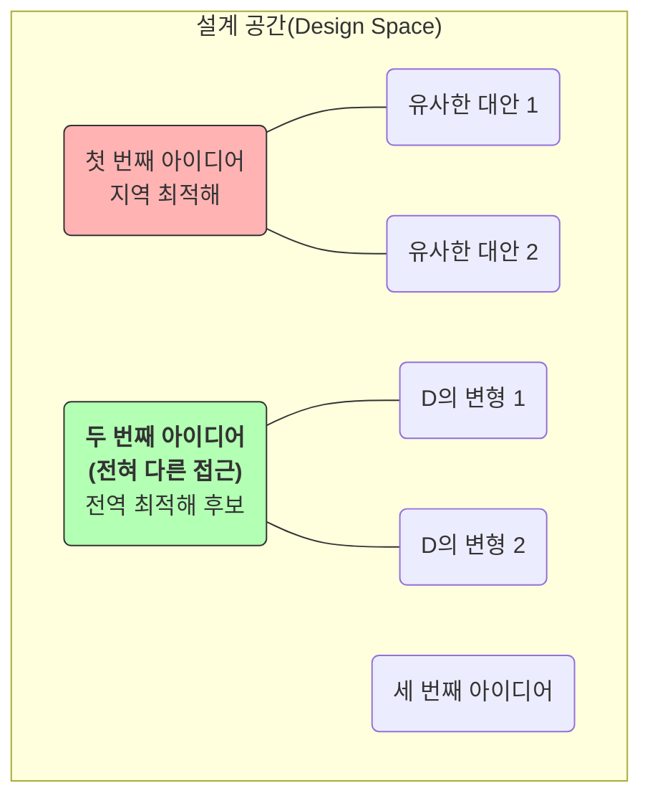

<p align="center"><b>[그림 1] 설계 공간 탐색의 개념</b></p>

위 다이어그램처럼, 첫 번째 아이디어(A) 주변만 맴도는 것은 지역 최적해에 갇히는 길입니다. '두 번 설계'는 의도적으로 전혀 다른 지점(D)을 탐색함으로써 더 나은 설계를 발견할 기회를 창출합니다.

---


### 2. 실천 방법: '두 번 설계'의 구체적인 프로세스

'두 번 설계'는 막연한 구호가 아니라, 구체적인 단계로 이루어진 실천적인 방법론입니다. 저자는 책에서 GUI 텍스트 에디터의 텍스트 관리 클래스 설계를 예로 들며 이 프로세스를 설명합니다. 이 예시를 통해 '두 번 설계'의 구체적인 과정을 따라가 보겠습니다.


#### 1단계: 근본적으로 다른 대안 스케치하기

가장 중요한 첫 단계는 서로 **'근본적으로 다른(radically different)'** 접근법을 최소 두 개 이상 스케치하는 것입니다. 약간의 변형이 아니라, 문제에 접근하는 관점 자체가 다른 대안을 찾아야 합니다. 텍스트 에디터의 핵심 데이터 모델인 `Text` 클래스의 인터페이스를 설계하는 상황을 가정해 봅시다.

* **대안 1: 라인(Line) 지향 인터페이스**
  * 텍스트를 '라인들의 집합'으로 간주합니다.
  * 핵심 연산이 라인 단위로 이루어집니다.
  * 이 접근법은 파일 I/O나 화면에 텍스트를 그리는 구현 관점에서는 자연스러워 보일 수 있습니다.

    ```java
    // 대안 1: 라인 지향 인터페이스 (개념 코드)
    class Text {
        String getLine(int lineNumber);
        void insertLine(int lineNumber, String text);
        void deleteLine(int lineNumber);
        void replaceLine(int lineNumber, String newText);
    }
    ```

* **대안 2: 범위(Range) 지향 인터페이스**

  * 텍스트를 '연속된 문자들의 흐름'으로 간주합니다.
  * 핵심 연산이 시작과 끝 위치로 정의되는 임의의 문자 범위에 대해 이루어집니다.
  * 이 접근법은 사용자의 편집 행위(타이핑, 드래그하여 선택 및 삭제 등) 관점에서 더 자연스러워 보입니다.

    ```java
    // 대안 2: 범위 지향 인터페이스 (개념 코드)
    class Text {
        String getText(Position start, Position end);
        void insert(Position pos, String text);
        void delete(Position start, Position end);
    }
    ```

이 단계에서는 각 대안의 모든 세부사항을 완벽하게 설계할 필요는 없습니다. 가장 중요한 몇 가지 메서드의 시그니처를 정의하고, 각 접근법의 핵심 철학을 파악하는 것만으로도 충분합니다. 심지어 하나의 대안이 명백히 더 좋아 보이더라도, 비교를 위해 의도적으로 다른 대안을 생각해보는 과정 자체가 중요합니다.


#### 2단계: 장단점 분석 및 평가

각 대안의 스케치가 완료되면, 이제 객관적인 기준에 따라 각 설계의 장단점을 목록으로 만들어 비교 분석합니다. 아우스터하우트 교수는 다음과 같은 질문들을 던져보라고 제안합니다.

* **어떤 대안이 더 간단한 인터페이스를 가졌는가?**
  * `Text` 클래스를 사용하는 상위 모듈(예: UI 로직) 입장에서 어떤 인터페이스가 더 사용하기 쉬운가?
* **어떤 대안이 더 범용적인가?**
  * 특정 사용 사례에만 묶여 있는가, 아니면 다양한 상황에서 재사용될 수 있는가?
* **어떤 대안이 더 효율적인 구현을 가능하게 하는가?**
  * 성능이 중요한 요소라면, 각 인터페이스가 내부 데이터 구조와 알고리즘에 어떤 영향을 미치는가?

이 기준들을 텍스트 에디터 예시에 적용해 봅시다.

* **대안 1 (라인 지향)의 단점**:
  * **상위 모듈의 복잡성 증가**: 사용자가 한 라인의 중간에 글자를 입력하는 간단한 행위조차 `Text` 클래스 외부에서 라인을 나누고 합치는 복잡한 로직을 구현해야 합니다. 예를 들어, `"abc"`라는 라인의 중간에 `x`를 입력하면, UI 로직은 `getLine()`으로 "abc"를 가져와 `"a"`와 `"bc"`로 자르고, `"axbc"`를 만들어 `replaceLine()`을 호출해야 합니다. 이는 '복잡성을 아래로 내려보내지' 못하고 상위 모듈로 전가하는 나쁜 설계입니다.
* **대안 2 (범위 지향)의 장점**:
  * **상위 모듈의 단순화**: 사용자의 모든 편집 행위는 `insert`와 `delete`라는 두 개의 간단한 연산으로 대부분 표현 가능합니다. 라인을 나누고 합치는 복잡성은 `Text` 클래스 내부로 '정보 은닉'되어, 상위 모듈은 이에 대해 전혀 신경 쓸 필요가 없습니다. 이는 **더 깊은(deep) 모듈**을 만드는 전형적인 예시입니다.
  * **더 명확한 추상화**: `Text` 클래스가 텍스트와 관련된 모든 조작을 책임진다는 명확한 역할 분담이 이루어집니다.


#### 3단계: 최적의 설계 도출

대안들을 비교 분석하는 과정에서 우리는 종종 원래 생각했던 것보다 훨씬 더 나은 설계를 발견하게 됩니다. 최적의 설계는 다음과 같은 형태로 나타날 수 있습니다.

1. **하나의 대안 선택**: 분석 결과, 하나의 대안이 명백히 우월할 경우 그것을 선택합니다.
2. **대안의 결합 (Hybrid)**: 각 대안의 장점만을 결합하여 새로운 설계를 만듭니다.
3. **완전히 새로운 발견**: 기존 대안들의 단점을 극복하는 과정에서 제3의, 완전히 새로운 아이디어가 떠오를 수 있습니다. 텍스트 에디터 예시에서, 라인 지향과 (단일)문자 지향 인터페이스의 단점을 모두 고민하다 보면 자연스럽게 '범위(range)'라는 더 우월한 추상화에 도달하게 되는 것이 바로 이런 경우입니다.

중요한 것은 이 모든 과정이 코드를 한 줄도 작성하기 전에, 즉 변경 비용이 가장 저렴한 단계에서 이루어진다는 점입니다. 일단 코드가 작성되고 나면, 설계 변경은 훨씬 더 큰 노력과 위험을 수반합니다.

---


### 3. 지적인 함정: 왜 똑똑한 개발자는 이 원칙을 외면하는가?

'두 번 설계' 원칙은 논리적으로 타당해 보이지만, 현실에서는 특히 경험이 많고 똑똑하다고 평가받는 개발자들 사이에서 의외로 잘 지켜지지 않습니다. 아우스터하우트 교수는 이에 대한 날카로운 심리적 통찰을 제공합니다.

> 정말 똑똑한 사람들은 이 '두 번 설계' 원칙을 받아들이기 어려워하는 경우가 있다. 그들은 성장 과정에서 어떤 문제에든 자신의 첫 번째 빠른 아이디어가 좋은 점수를 받기에 충분하다는 것을 발견한다. 두 번째나 세 번째 가능성을 고려할 필요가 없었던 것이다.
> (I have noticed that the design-it-twice principle is sometimes hard for really smart people to embrace. When they are growing up, smart people discover that their first quick idea about any problem is sufficient for a good grade; there is no need to consider a second or third possibility.)

많은 유능한 개발자들은 학창 시절이나 커리어 초기에 자신의 빠른 직관과 첫 번째 아이디어가 대부분의 문제를 해결하기에 충분했던 경험을 가지고 있습니다. 이는 그들에게 '내 첫 아이디어는 믿을 만하다'는 강력한 성공 경험과 동시에 나쁜 습관을 심어줍니다. 하지만 그들이 점점 더 복잡하고 어려운 문제(예: 대규모 소프트웨어 시스템 설계)에 직면하게 되면, 이 습관은 성장의 발목을 잡는 족쇄가 됩니다.

대규모 소프트웨어 설계는 **그 누구도 한 번에 완벽하게 해낼 수 없는 본질적인 복잡성**을 가지고 있습니다. 이런 환경에서 여러 대안을 탐색하는 것은 자신의 능력이 부족하다는 증거가 아니라, 문제의 난이도를 존중하고 최고의 결과를 내기 위한 전문가적인 태도입니다. 오히려 자신의 첫 번째 아이디어를 맹신하고 고집하는 것이야말로, 아마추어적인 접근 방식일 수 있습니다. '두 번 설계'를 실천하는 것은 '나는 부족하다'는 고백이 아니라, '나는 이 어려운 문제에 대해 최고의 답을 찾겠다'는 전문가로서의 선언입니다.

---


### 4. 투자의 관점: 시간과 성장의 이중적 가치

'두 번 설계'에 대한 가장 흔한 반론은 "그럴 시간이 없다"는 것입니다. 그러나 이는 '전략적 프로그래밍'이 아닌 '전술적 프로그래밍'에 빠져 있는 전형적인 모습입니다. 이 책의 핵심 철학인 **'투자 마인드셋(investment mindset)'** 관점에서 보면, '두 번 설계'에 들이는 시간은 비용이 아니라 높은 수익률이 보장된 투자입니다.

* **단기적 투자 수익**: 클래스 하나를 설계하며 대안을 고민하는 데 한두 시간이면 충분합니다. 이는 며칠, 몇 주가 걸릴 구현 및 테스트 과정에 비하면 아주 작은 시간입니다. 이 작은 투자로 인해 훨씬 더 깔끔하고 이해하기 쉬운 인터페이스가 도출된다면, 구현 과정에서의 혼란과 재작업을 줄여 오히려 전체 개발 시간을 단축시킬 수 있습니다.
* **장기적 투자 수익 (가장 중요)**: '두 번 설계'의 진정한 가치는 단순히 이번 프로젝트의 설계를 개선하는 데 그치지 않습니다. 다양한 설계를 고안하고, 장단점을 비교하고, 최적의 선택을 내리는 과정을 반복하면서 개발자는 **설계를 바라보는 안목 그 자체를 훈련**하게 됩니다. 어떤 요소가 좋은 설계를 만들고 어떤 요소가 복잡성을 야기하는지에 대한 깊은 통찰과 직관을 얻게 됩니다. 이는 시간이 지날수록 더 빠르고 정확하게 좋은 설계를 식별할 수 있는 능력으로 이어지며, 결국 '두 번 설계'에 드는 시간조차 거의 없이, 본능적으로 훌륭한 설계를 떠올리는 경지에 이르게 됩니다.

결국 '두 번 설계'는 미래의 버그를 예방하고, 유지보수 비용을 절감하며, 무엇보다 개발자 자신을 더 나은 설계자로 성장시키는 가장 효과적인 훈련법 중 하나입니다.


### 결론: 설계를 창의적인 퍼즐로 즐기는 방법

"두 번 설계하라"는 단순한 기술적 지침을 넘어, 소프트웨어 설계를 대하는 우리의 태도를 근본적으로 바꾸도록 요구합니다. 그것은 설계를 주어진 요구사항을 코드로 옮기는 기계적인 작업이 아니라, **"가장 단순하고 강력한 구조로 이 문제를 어떻게 풀 수 있을까?"**라는 매혹적인 퍼즐로 바라보게 만듭니다.

여러 대안을 탐험하는 것은 이 퍼즐을 푸는 가장 즐거운 과정이며, 단순하면서도 강력한 해결책을 발견했을 때의 희열은 코드가 동작할 때의 기쁨과는 또 다른 차원의 성취감을 안겨줍니다. 깨끗하고, 단순하며, 명확한 설계는 그 자체로 아름다운 창작물입니다. '두 번 설계' 원칙을 꾸준히 실천함으로써, 우리는 복잡성과의 싸움에서 승리하는 유능한 엔지니어일 뿐만 아니라, 아름다운 설계를 창조하는 즐거움을 아는 진정한 장인(匠人)으로 거듭날 수 있을 것입니다.

------


## 제12장: 왜 주석을 써야 하는가? 네 가지 변명 (Why Write Comments? The Four Excuses)

소프트웨어 개발의 세계에서 '주석(Comments)'만큼 그 가치에 대해 극단적인 평가를 받는 존재도 드뭅니다. 어떤 이에게 주석은 코드의 의도를 밝히는 등대와 같지만, 다른 이에게는 코드의 가독성을 해치고 관리 비용만 늘리는 골칫거리로 여겨집니다. 개발자들은 종종 코딩이 끝난 후 마지못해 작성하는 숙제처럼 주석을 대하며, 많은 프로젝트의 코드베이스는 사실상 주석이 없는 사막과도 같습니다. 존 아우스터하우트(John Ousterhout) 교수는 "소프트웨어 설계의 철학" 제12장에서 이러한 현실에 정면으로 도전하며, 주석이 단순히 부가적인 문서가 아니라 **훌륭한 소프트웨어 설계를 위한 핵심적인 도구**임을 역설합니다.

이 글은 제12장의 내용을 심층적으로 분석하고 해설하여, 개발자들이 주석을 쓰지 않기 위해 내세우는 네 가지 흔한 변명들을 논파하고, 잘 쓰인 주석이 어떻게 시스템의 복잡성을 낮추고 설계의 질을 향상시키는지 탐구합니다. 이 장의 철학을 이해한다면, 주석 작성을 더 이상 고된 노동이 아닌, 창의적인 설계 과정의 즐거운 일부로 받아들이게 될 것입니다.


### 1. 첫 번째 변명: "좋은 코드는 스스로를 문서화한다"는 위험한 신화

소프트웨어 개발 커뮤니티에는 "좋은 코드는 스스로를 문서화한다(Good code is self-documenting)"는 말이 마치 진리처럼 떠돌곤 합니다. 이는 마치 아이스크림이 건강에 좋다는 소문처럼, 우리가 간절히 믿고 싶어 하는 달콤한 신화와 같습니다. 물론, 의미 있는 변수명을 사용하고 일관된 코딩 스타일을 유지하는 등 코드를 명확하게 작성하려는 노력은 주석의 필요성을 어느 정도 줄여주는 것이 사실입니다. 하지만 이것이 주석을 완전히 대체할 수 있다는 생각은 소프트웨어의 본질을 오해한 데서 비롯된 위험한 착각입니다.

> 코드는 '어떻게(How)' 동작하는지를 설명하는 데는 탁월하지만, 그 코드가 '왜(Why)' 그렇게 작성되었는지, 그리고 더 높은 수준에서 '무엇을(What)' 의도하는지를 표현하는 데는 근본적인 한계를 가집니다.

코드는 시스템의 가장 낮은 수준의 세부사항입니다. 개발자가 코드를 작성할 때 가졌던 수많은 설계적 고민, 즉 특정 디자인을 선택한 이유, 대안들을 기각한 근거, 특정 값의 의미, 그리고 가장 중요한 **추상화(Abstraction)**의 개념은 코드 자체만으로는 온전히 표현될 수 없습니다.


#### 1.1. 추상화의 완성은 주석이다

이 책의 핵심 철학 중 하나는 '추상화'를 통해 복잡성을 숨기는 것입니다. 추상화란, 사용에 필수적인 정보는 남기되 안전하게 무시할 수 있는 세부사항은 감추어 대상을 단순하게 바라보는 관점입니다. 만약 어떤 모듈을 사용하기 위해 그 내부 구현 코드를 모두 읽어야만 한다면, 거기에는 어떠한 추상화도 존재하지 않는 것입니다. 모든 복잡성이 그대로 노출되기 때문입니다.

주석이 없다면, 우리가 가진 유일한 추상화는 메서드 시그니처(이름, 매개변수, 반환 타입)뿐입니다. 하지만 이것만으로는 턱없이 부족합니다.

```java
/**
 * ???
 */
public String substring(int beginIndex, int endIndex);
```

위 자바의 `substring` 메서드 시그니처만 보고 다음을 알 수 있습니까?

* `endIndex`가 가리키는 문자가 결과에 포함되는가, 포함되지 않는가? (정답: 포함되지 않음)
* 만약 `beginIndex`가 `endIndex`보다 크면 어떻게 되는가? (정답: 예외 발생)
* 만약 인덱스가 문자열의 범위를 벗어나면 어떻게 되는가? (정답: 예외 발생)

이 모든 '사용 규칙'과 '동작 방식'에 대한 정보는 주석을 통해서만 완전한 추상화로 완성될 수 있습니다. 주석은 구현의 복잡한 세부사항을 숨긴 채, 사용자가 알아야 할 필수 정보만을 간결하고 직관적인 인간의 언어(예: 영어)로 전달하는 역할을 합니다. 따라서 **추상화를 통해 복잡성을 관리하고자 한다면, 주석은 선택이 아닌 필수**입니다.


#### 1.2. "코드를 읽어라"는 주장의 함정

"주석보다 코드가 더 정확하니, 그냥 코드를 읽으면 되지 않는가?"라고 주장하는 이들도 있습니다. 이 주장은 두 가지 심각한 문제를 야기합니다.

* **시간과 노력의 낭비**: 다른 개발자가 작성한 코드의 모든 라인을 분석하여 그 메서드의 추상적 의미를 역으로 추론하는 것은 매우 고통스럽고 비효율적인 과정입니다.
* **얕은 메서드의 양산**: 개발자가 "다른 사람들이 내 코드를 읽을 거야"라고 생각하게 되면, 메서드를 가능한 한 짧게 만들려는 강박에 사로잡힙니다. 이는 하나의 의미 있는 작업을 여러 개의 자잘하고 얕은 메서드로 쪼개는 결과를 낳으며, 시스템 전체의 복잡성을 오히려 증가시킵니다. (제4장 '모듈은 깊어야 한다' 참조)

결론적으로, '코드가 스스로를 문서화한다'는 주장은 훌륭한 설계를 통해 주석의 필요성을 '줄일' 수 있다는 긍정적인 측면을, 주석이 '필요 없다'는 파괴적인 결론으로 오도하는 신화에 불과합니다.

---


### 2. 두 번째 변명: "시간이 없다"는 투자의 관점

"주석을 쓸 시간이 어디 있나요? 새로운 기능 개발하기도 바쁜데요." 이것은 아마도 가장 현실적이고 널리 퍼진 변명일 것입니다. 마감 기한의 압박 속에서, 눈에 보이는 기능 구현과 보이지 않는 문서화 작업 사이에서 우리는 항상 전자를 택하라는 유혹을 받습니다. 그러나 이러한 단기적인 관점, 즉 저자가 '전술적 프로그래밍'이라 부르는 접근 방식은 장기적으로 시스템을 복잡성의 늪으로 빠뜨리는 지름길입니다.

아우스터하우트 교수는 이 변명을 '투자 마인드셋(investment mindset)'의 부재로 설명합니다. 훌륭한 소프트웨어 설계는 미래의 개발 속도를 높이기 위한 현재의 시간 투자입니다. 잘 쓰인 주석은 미래의 내가, 그리고 나의 동료들이 시스템을 이해하고 수정하는 데 드는 시간을 극적으로 단축시켜 줍니다.

* **주석 작성의 비용은 생각보다 작다**: 개발 시간 전체에서 순수하게 코드를 타이핑하는 시간은 10% 남짓일 수 있습니다. 주석을 코드만큼 열심히 작성한다고 가정해도, 전체 개발 시간에 추가되는 비용은 10%를 넘지 않을 가능성이 높습니다.
* **투자 회수(ROI)는 빠르다**: 이 작은 투자 비용은 불필요한 코드 분석, 잘못된 추측으로 인한 버그 수정 등에 낭비될 시간을 절약해 줌으로써 매우 빠르게 회수됩니다. 몇 주만 지나도 내가 작성했던 코드의 세부사항을 잊어버리는 우리 자신을 생각해 보면, 주석의 가치는 명확합니다.

더 나아가, 저자는 제15장에서 '주석을 먼저 작성하라'고 주장하며 이 변명을 완전히 무력화시킵니다. 인터페이스 주석을 코딩 전에 작성하는 행위는 그 자체로 훌륭한 설계 도구 역할을 합니다. 내가 만들려는 클래스와 메서드의 추상화 수준, 역할, 책임을 명확한 문장으로 정의하는 과정에서 설계의 결함이 드러나고 개선되기 때문입니다. 이 관점에서 보면, **주석 작성은 개발 이후에 발생하는 추가 비용이 아니라, 설계 과정 자체에 내재된 핵심 활동**이 됩니다. 따라서 "시간이 없다"는 변명은 더 이상 성립하기 어렵습니다.

---


### 3. 세 번째 변명: "주석은 낡고 오해를 부른다"는 관리의 문제

이 변명은 상당한 설득력을 가집니다. 실제로 코드의 로직은 변경되었지만 주석은 그대로 남아있어, 오히려 개발자에게 혼란을 주는 경우는 비일비재합니다. 낡고 부정확한 주석은 아예 없는 것보다 해로울 수 있습니다. 그러나 이것이 주석이라는 개념 자체의 본질적인 결함일까요? 아우스터하우트 교수는 이것이 주석의 문제가 아니라, **주석을 '관리'하는 방식의 문제**라고 지적합니다.

낡은 주석 문제를 해결하고 관리 비용을 최소화하기 위한 몇 가지 실용적인 전략이 있습니다.

1. **주석을 코드 가까이에 두어라**: 메서드의 인터페이스 주석은 메서드 선언 바로 위에 위치해야 합니다. 개발자가 코드를 수정할 때 주석을 자연스럽게 보게 되므로, 주석을 함께 업데이트할 가능성이 높아집니다.
2. **문서 중복을 피하라**: 하나의 설계 결정이나 정보는 단 한 곳의 '진실의 원천(Single Source of Truth)'에만 문서화되어야 합니다. 여러 곳에 같은 내용의 주석이 흩어져 있다면, 변경이 발생했을 때 모든 복사본을 찾아 수정하기란 거의 불가능합니다.
3. **높은 수준의 주석을 작성하라**: 주석이 코드의 세부적인 'how'를 설명하기보다, 더 추상적인 수준의 'what'과 'why'를 설명한다면, 사소한 코드 변경에는 영향을 받지 않습니다. 즉, **좋은 주석일수록 낡게 될 가능성이 낮습니다.**
4. **프로세스를 활용하라**: 코드 리뷰는 낡은 주석을 찾아내고 수정하기 위한 가장 효과적인 사회적 장치입니다. 동료의 코드를 리뷰할 때, 코드와 주석의 일치 여부를 꼼꼼히 확인하는 문화를 정착시켜야 합니다.

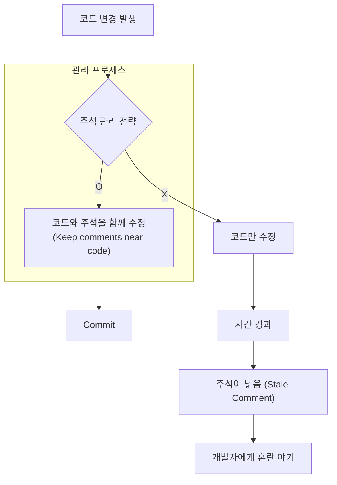

<p align="center"><b>[그림 1] 주석 관리 전략의 중요성</b></p>

결국, 주석이 낡는 문제는 '주석을 쓰지 말아야 할 이유'가 아니라, '주석을 올바르게 관리해야 할 이유'를 말해줄 뿐입니다.

---


### 4. 네 번째 변명: "쓸모없는 주석"이라는 경험의 함정

"제가 지금까지 본 주석들은 죄다 변수명을 그대로 반복하거나 당연한 소리만 하는 쓰레기였어요. 그런 걸 왜 써야 하죠?"

네 가지 변명 중 가장 타당하게 들리는 주장입니다. 우리 모두는 아래와 같은 무가치한 주석들을 수도 없이 봐왔습니다.

```java
// i를 1 증가시킨다.
i++; 

// 고객 목록을 가져온다.
List<Customer> customers = getCustomers();
```

이러한 경험 때문에 많은 개발자들이 주석 자체에 대해 냉소적인 태도를 갖게 됩니다. 하지만 이는 마치 맛없는 음식 몇 번 먹어보고 "세상의 모든 음식은 맛이 없다"고 결론 내리는 것과 같은 성급한 일반화의 오류입니다. 문제는 '주석'이라는 도구 자체가 아니라, 그 **도구를 잘못 사용하고 있는 '품질'의 문제**입니다.

따라서 우리가 던져야 할 질문은 "주석을 쓸 것인가, 말 것인가?"가 아니라 **"어떻게 하면 '가치 있는' 주석을 쓸 것인가?"**가 되어야 합니다. 이 질문에 대한 답은 제13장에서 자세히 다루어지며, 핵심은 '코드에서 명백히 드러나지 않는 것'을 설명하는 것입니다. 쓸모없는 주석에 대한 나쁜 경험이 주석의 잠재적인 가치 전체를 부정하는 근거가 되어서는 안 됩니다.

---


### 5. 변명을 넘어: 잘 쓰인 주석의 실질적 가치

네 가지 변명을 모두 논파했다면, 이제 잘 쓰인 주석이 제공하는 본질적인 가치에 대해 이야기할 차례입니다. 주석의 가장 중요한 역할은 **코드로 표현할 수 없었던 설계자의 머릿속 지식과 의도를 포착하여 기록하는 것**입니다. 이 정보는 시스템의 복잡성을 줄이는 데 결정적인 기여를 합니다.

저자는 제2장에서 복잡성의 징후로 '인지 부하(Cognitive Load)'와 '미지의 불확실성(Unknown Unknowns)'을 꼽았습니다. 주석은 이 두 가지 문제에 대한 가장 직접적인 해결책입니다.

* **인지 부하 감소**: 잘 쓰인 인터페이스 주석은 개발자가 메서드의 내부 구현을 들여다보지 않고도 사용법을 정확히 알 수 있게 해줍니다. 이는 개발자가 알아야 할 정보의 양을 극적으로 줄여줍니다.
* **미지의 불확실성 감소**: 주석은 눈에 보이지 않는 시스템의 구조, 모듈 간의 중요한 의존성, 반드시 지켜져야 하는 불변식(invariants) 등을 명확하게 밝혀줍니다. 이를 통해 개발자는 "내가 무엇을 모르는지조차 모르는" 상태에서 벗어나, 변경 작업을 수행할 때 무엇을 고려해야 하는지 명확히 알게 됩니다.

결국, 주석은 복잡성의 근본 원인인 '모호함(Obscurity)'을 제거하고 '의존성(Dependencies)'을 명확하게 드러내는 역할을 함으로써, 시스템을 더 단순하고 명확하게 만듭니다.

---


### 6. 다른 의견: '클린 코드' 철학과의 비교 분석

주석에 대한 아우스터하우트 교수의 관점은 로버트 C. 마틴(Robert C. Martin)의 저서 "클린 코드(Clean Code)"에서 제시된 철학과 흥미로운 대조를 이룹니다. "클린 코드"의 관점을 함께 살펴보는 것은 주석에 대한 우리의 이해를 더욱 깊게 만들어 줄 것입니다.

> "주석은 기껏해야 필요악이다... 주석은 언제나 실패를 의미한다. 우리는 주석이 없으면 자신을 표현할 방법을 찾지 못하기 때문에 주석을 사용하지만, 그 사용이 축하할 일은 아니다." - 로버트 C. 마틴, "클린 코드"

마틴은 주석을 코드의 표현력이 부족함을 보상하기 위한 '실패'의 산물로 봅니다. 그는 주석으로 설명하려 하기보다, 코드를 리팩토링하여(예: 메서드 추출) 메서드 이름 자체로 의도를 표현하라고 주장합니다. 예를 들어, `isLeastRelevantMultipleOfNextLargerPrimeFactor`와 같은 긴 이름을 사용해서라도 주석을 대체하라는 것입니다.

이에 대해 아우스터하우트 교수는 다음과 같이 반박합니다.

1. **정보의 종류가 다르다**: 코드와 주석은 서로 다른 종류의 정보를 전달하는 데 적합하다. 주석이 제공하는 높은 수준의 추상화와 '이유'에 대한 정보는 코드로 대체될 수 없다.
2. **긴 이름의 한계**: 아무리 긴 이름을 사용해도, "이 메서드는...할 때 사용되며, ...의 부작용이 있습니다"와 같은 한두 문장의 잘 쓰인 주석이 제공하는 정보의 풍부함과 명확성을 따라잡기 어렵다.
3. **나쁜 태도의 조장**: "주석은 실패다"라는 철학은 개발자들이 주석 작성을 기피하게 만드는 나쁜 태도를 조장할 수 있다. 심지어 "당신 코드는 주석이 필요한 걸 보니 문제가 있군요?"와 같은 잘못된 비판으로 이어질 수도 있다.

두 거장의 철학은 '명확성'이라는 공통된 목표를 추구하지만, 그 목표를 달성하기 위한 도구로서 주석의 위상에 대해 다른 시각을 보여줍니다. 마틴에게 주석은 최후의 수단이지만, 아우스터하우트에게 주석은 **가장 우선적이고 핵심적인 설계 도구**입니다.


### 결론: 주석은 설계의 언어다

제12장은 주석에 대한 우리의 낡은 편견을 깨뜨리고 새로운 관점을 제시합니다. 주석은 더 이상 귀찮은 의무나 코드를 보조하는 수단이 아닙니다. **주석은 추상화를 완성하고, 설계자의 의도를 기록하며, 복잡성을 낮추는 가장 강력한 도구 중 하나**입니다. 개발자들이 주석을 쓰지 않는 이유는 시간이 없거나 주석이 쓸모없어서가 아니라, 주석의 진정한 가치와 올바르게 작성하는 방법을 모르기 때문입니다.

이 장의 가르침을 받아들인다면, 우리는 주석 작성을 개발의 마지막 단계에서 억지로 해치우는 고통스러운 과정이 아닌, 시스템의 청사진을 그리고 다듬는 창의적인 설계의 첫 단계로 맞이할 수 있을 것입니다. 그것은 더 나은 문서를 넘어, 더 나은 소프트웨어로 가는 길입니다.

---


## 제13장: 주석은 코드에서 명확하지 않은 것을 설명해야 한다 (Comments Should Describe Things that Aren’t Obvious from the Code)

소프트웨어 설계의 세계에서 '주석(Comments)'만큼이나 개발자들 사이에서 평가가 극명하게 갈리는 주제도 드물 것입니다. 어떤 이들은 주석을 코드의 실패를 덮는 군더더기로 치부하고, 또 다른 이들은 시스템의 생명력을 유지하는 필수적인 혈액으로 여깁니다. 존 아우스터하우트 교수는 이 논쟁의 한가운데서, 주석이 단순히 코드를 '설명'하는 부가적인 활동이 아니라, **복잡성을 관리하고 추상화를 완성하는 핵심적인 설계 도구**라는 강력한 철학을 제시합니다.

제13장은 바로 그 철학의 실천편입니다. 이 장은 좋은 주석과 나쁜 주석을 가르는 단 하나의 황금률, "주석은 코드에서 명확하지 않은 것을 설명해야 한다"를 중심으로, 우리가 작성하는 모든 주석의 가치를 극대화하는 구체적이고 실용적인 방법론을 심도 있게 탐구합니다. 이 글은 제13장의 모든 핵심 원칙과 예시를 종합하여, 여러분의 주석 작성 행위를 단순한 의무에서 창의적인 설계 과정으로 승화시키는 데 도움을 드리고자 합니다.


### 1. 주석의 황금률과 가장 큰 죄악

모든 논의에 앞서, 우리는 좋은 주석을 관통하는 가장 중요한 원칙을 마음에 새겨야 합니다.

> **주석의 황금률: 주석은 코드만으로 쉽게 파악할 수 없는, 즉 코드에 명백히 드러나지 않는 정보를 제공해야 한다.**

프로그래밍 언어는 '어떻게(how)'를 표현하는 데는 탁월하지만, 그 이면에 있는 '무엇을(what)'과 '왜(why)'를 온전히 담아내기에는 한계가 있습니다. 주석은 바로 이 간극을 메우는 역할을 합니다. 개발자가 코드를 작성할 당시 머릿속에 있던 중요한 설계 의도, 추상적인 개념, 미묘한 제약 조건 등을 기록함으로써, 미래의 개발자(몇 주 뒤의 자기 자신을 포함하여)가 시스템을 쉽게 이해하고 안전하게 수정할 수 있도록 돕습니다.

이 황금률을 뒤집어 보면, 주석 작성 시 저지르기 가장 쉬우면서도 가장 치명적인 죄악이 무엇인지 알 수 있습니다. 그것은 바로 **코드를 그대로 반복하는 것**입니다.

```c++
// ptr_copy에 객체의 복사본 포인터를 할당한다
ptr_copy = get_copy(obj);

// is_unlocked가 참인지 확인한다
if (is_unlocked(ptr_copy)) { ... }
```

위와 같은 주석은 아무런 가치를 제공하지 못합니다. 주석에 담긴 모든 정보는 바로 옆의 코드를 읽는 것만으로도 즉시 파악할 수 있습니다. 이런 주석은 코드에 불필요한 잡음(noise)을 추가할 뿐이며, "주석은 쓸모없다"는 편견을 강화하는 주범이 됩니다.

> **레드 플래그: 코드를 반복하는 주석 (Comment Repeats Code)**
> 주석의 정보가 바로 옆의 코드를 통해 즉시 명백하게 드러난다면, 그 주석은 도움이 되지 않는다. 주석이 설명 대상의 이름을 구성하는 단어들을 그대로 사용하여 문장을 만드는 경우가 대표적인 예시다.

좋은 주석을 작성하기 위한 첫걸음은, 내가 작성한 주석을 보고 스스로에게 다음과 같은 질문을 던지는 것입니다. **"이 코드의 선언부만 보고, 이 주석을 똑같이 쓸 수 있는가?"** 만약 답이 "그렇다"라면, 그 주석은 코드를 반복하고 있을 가능성이 높습니다. 좋은 주석은 변수명이나 메서드명에 사용된 단어와는 다른 어휘를 사용하여, 그 이름만으로는 알 수 없는 추가적인 의미와 맥락을 부여해야 합니다.


### 2. 좋은 주석의 두 가지 차원: 정밀성과 직관성

황금률을 지키는 좋은 주석은 코드와는 다른 차원의 정보를 제공합니다. 아우스터하우트 교수는 이를 두 가지 방향으로 설명합니다. 하나는 코드보다 더 낮은 수준으로 파고들어 **'정밀성(precision)'**을 더하는 것이고, 다른 하나는 코드보다 더 높은 수준에서 조망하여 **'직관성(intuition)'**을 제공하는 것입니다. 코드와 동일한 수준의 추상화로 작성된 주석은 필연적으로 코드를 반복하게 됩니다.


#### 2.1. 낮은 수준의 주석: 정밀성 더하기

정밀성을 더하는 주석은 주로 변수 선언(클래스 멤버 변수, 메서드 인자, 반환값 등)에 사용될 때 가장 큰 힘을 발휘합니다. 변수의 이름과 타입만으로는 전달할 수 없는 구체적인 세부 정보를 명시하여, 모호함을 제거하고 개발자의 잘못된 추측을 막아줍니다.

다음은 정밀한 주석이 반드시 답변해야 할 질문들의 목록입니다.

* **단위(Units)**: 이 변수의 단위는 무엇인가? (예: 초, 밀리초, 픽셀, 바이트)
* **경계 조건(Boundary Conditions)**: 범위가 주어졌을 때, 시작과 끝 값을 포함하는가(inclusive), 포함하지 않는가(exclusive)?
* **Null 값의 의미**: Null 값이 허용된다면, 그것은 무엇을 의미하는가?
* **소유권(Ownership)**: 변수가 반드시 해제되어야 하는 리소스를 참조한다면, 누가 해제할 책임이 있는가?
* **불변 속성(Invariants)**: 이 변수에 대해 항상 참으로 유지되는 속성은 무엇인가? (예: "이 리스트는 항상 최소 하나의 원소를 가집니다.")

**나쁜 예시 (모호함)**:

```c++
// resp 버퍼의 현재 오프셋
uint32_t offset;

// 문서 내의 모든 라인 너비와 등장 횟수를 포함
private TreeMap<Integer, Integer> lineWidths;
```

위 예시에서 `current`가 무엇을 의미하는지, `lineWidths`의 키와 값이 각각 무엇이며 단위는 무엇인지 명확하지 않습니다.

**좋은 예시 (정밀함)**:

```c++
// 이 버퍼에서 클라이언트에게 아직 반환되지 않은 첫 번째 객체의 위치(바이트 단위).
uint32_t offset;

// <길이, 개수> 형태의 라인 길이 통계를 저장.
// '길이'는 개행 문자를 포함한 라인의 문자 수이며,
// '개수'는 해당 길이를 가진 라인의 수이다.
// 특정 길이를 가진 라인이 없으면, 해당 길이에 대한 엔트리는 존재하지 않는다.
private TreeMap<Integer, Integer> numLinesWithLength;
```

개선된 주석은 변수가 무엇을 '나타내는지'에 집중합니다. 변수가 코드에서 '어떻게 조작되는지'를 설명하는 것은 좋지 않습니다. 그 변수의 의미(명사)를 정의하면, 어떻게 조작되어야 하는지(동사)는 자연스럽게 유추할 수 있습니다.


#### 2.2. 높은 수준의 주석: 직관성 높이기

직관성을 제공하는 주석은 코드의 세부 사항을 의도적으로 생략하고, 대신 코드 블록의 **전체적인 의도와 맥락**을 높은 수준에서 설명합니다. 이는 주로 메서드 내부의 복잡한 로직이나 인터페이스 주석의 서두에 사용됩니다. 독자가 세부적인 코드 한 줄 한 줄을 분석하기 전에, 전체적인 그림을 먼저 이해하도록 돕는 숲의 지도와 같습니다.

**나쁜 예시 (너무 낮은 수준)**:

```java
// 만약 assignPos가 가리키는 PKHash와 동일한 세션을 사용하는 LOADING 상태의 readRpc가 있고,
// 그 readRPC의 마지막 PKHash가 현재 할당 중인 PKHash보다 작다면,
// 할당 중인 PKHash를 그 readRPC에 넣는다.
for (int i = 0; i < NUM_READ_RPC; i++) {
    if (session == readRpc[i].session && readRpc[i].status == LOADING && ...) {
        // ...
    }
}
```

이 주석은 코드의 `if` 문을 거의 그대로 번역한 것에 불과하며, 이 코드가 왜 필요한지에 대한 아무런 직관도 제공하지 못합니다.

**좋은 예시 (높은 수준)**:

```java
// 아직 전송되지 않은, 원하는 서버로 향하는 기존 RPC에
// 현재 키 해시를 덧붙이려고 시도한다.
for (int i = 0; i < NUM_READ_RPC; i++) {
    if (...) {
        // ...
    }
}
```

이 주석은 단 한 문장으로 코드 블록의 핵심 '의도'를 전달합니다. 이 의도를 먼저 이해한 개발자는 `for` 루프가 기존 RPC들을 순회하는 것이고, `session` 비교는 올바른 서버를 찾기 위함이며, `LOADING` 상태는 덧붙이기가 가능한 상태를 의미한다는 것을 쉽게 유추할 수 있습니다. 이처럼 높은 수준의 주석은 독자가 코드를 비판적으로 읽고, 그 의도에 맞게 코드가 올바르게 작성되었는지 판단할 수 있는 기준을 제공합니다.


### 3. 주석의 종류와 실전 전략

아우스터하우트 교수는 대부분의 주석이 네 가지 범주로 나뉜다고 설명하며, 각각의 목적에 맞는 작성 전략을 제시합니다.

1. **인터페이스 (Interface)**: 클래스, 메서드 등의 선언부 바로 앞에 위치하여, 그것을 사용하는 데 필요한 모든 것을 설명한다.
2. **데이터 구조 멤버 (Data structure member)**: 클래스의 인스턴스 변수 등 데이터 구조의 각 필드 선언 옆에서 그 의미를 설명한다.
3. **구현 (Implementation)**: 메서드 내부에 위치하여 내부 동작 방식을 설명한다.
4. **모듈 간 (Cross-module)**: 여러 모듈에 걸쳐 있는 설계 결정을 설명한다.

이 중 가장 중요한 것은 인터페이스 주석과 데이터 구조 멤버 주석입니다.


#### 3.1. 인터페이스 주석: 추상화의 완성

인터페이스 주석은 추상화를 정의하는 유일하고 가장 중요한 수단입니다. 코드 자체는 구현의 세부사항을 담고 있어 너무 낮은 수준이기 때문에, 추상화를 온전히 표현할 수 없습니다. 따라서 **좋은 추상화를 원한다면, 반드시 그 추상화를 주석으로 문서화해야 합니다.**

가장 중요한 원칙은 **인터페이스 주석과 구현 주석을 철저히 분리**하는 것입니다. 인터페이스 주석에 구현의 세부사항이 스며들기 시작한다면, 그것은 추상화가 무너지고 있다는 명백한 신호입니다.

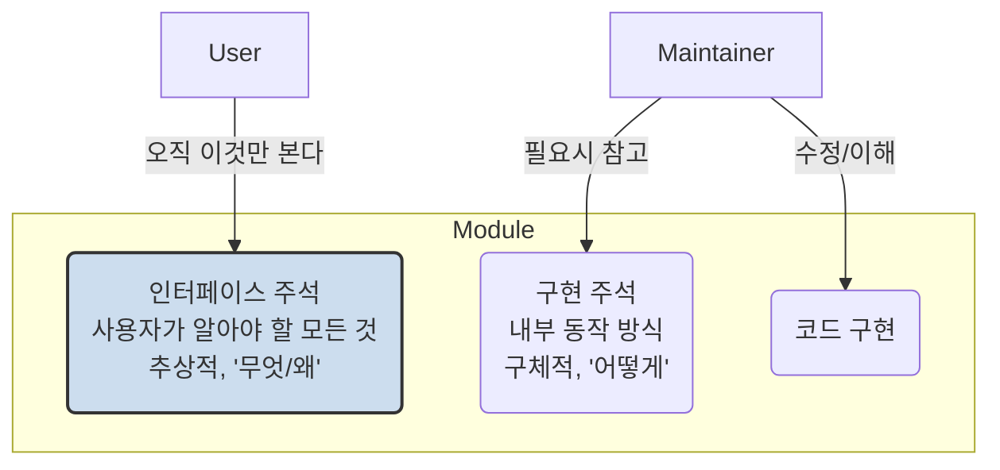

<p align="center"><b>[그림 1] 인터페이스 주석과 구현 주석의 분리</b></p>

* **클래스 인터페이스 주석**: 클래스가 제공하는 전반적인 추상화, 각 인스턴스가 무엇을 나타내는지, 그리고 중요한 제약사항(예: "이 클래스는 스레드에 안전하지 않음") 등을 높은 수준에서 기술합니다.
* **메서드 인터페이스 주석**: 메서드 사용자가 알아야 할 모든 정보를 담아야 하며, 다음 요소들을 포함해야 합니다.
  * **요약**: 메서드의 핵심 동작을 한두 문장으로 요약 (높은 수준의 직관성).
  * **인자 및 반환값**: 각 인자와 반환값의 의미, 단위, 제약 조건 등을 명확하고 정밀하게 설명.
  * **부수 효과(Side Effects)**: 메서드 호출 결과로 반환값 외에 시스템의 상태에 어떤 변화가 일어나는지 명시.
  * **예외(Exceptions)**: 메서드가 던질 수 있는 모든 예외와 그 발생 조건.
  * **선행 조건(Preconditions)**: 메서드를 호출하기 전에 반드시 만족되어야 하는 조건 (예: "이진 탐색을 위해 리스트는 반드시 정렬되어 있어야 함").

> **레드 플래그: 구현 정보가 인터페이스를 오염시킨다 (Implementation Documentation Contaminates Interface)**
> 메서드에 대한 인터페이스 주석이 그 메서드를 사용하는 데 필요하지 않은 내부 구현 세부 정보를 설명하는 경우, 이는 추상화가 깨졌다는 위험 신호이다.

책에 등장하는 `IndexLookup` 클래스의 `isReady()` 메서드 주석은 이 레드 플래그의 좋은 예시를 보여줍니다. 'DCFT 모듈에서 구현됨', '규칙 기반 접근법 사용' 등은 모두 사용자가 알 필요 없는 구현 정보입니다. 좋은 주석은 "다음 `getNext()` 호출이 블로킹 없이 즉시 반환될 수 있는지를 나타낸다"와 같이 사용자의 관점에서 메서드의 의미와 역할을 명확히 설명해야 합니다.


#### 3.2. 구현 주석: 코드의 '무엇'과 '왜'

구현 주석은 메서드 내부에 위치하며, 독자가 내부 동작을 이해하는 것을 돕습니다. 대부분의 짧고 단순한 메서드는 구현 주석이 필요 없습니다. 구현 주석의 핵심 목표는 코드가 '어떻게(how)' 동작하는지가 아니라, '무엇을(what)' 하려 하고 '왜(why)' 그렇게 하는지를 설명하는 것입니다.

* **주요 블록 설명**: 긴 메서드의 경우, 각 주요 논리 블록이 시작되기 전에 해당 블록의 목적을 높은 수준에서 설명하는 주석을 추가합니다. (예: `// 단계 1: 활성 RPC들을 스캔하여 완료된 것이 있는지 확인한다.`)
* **이유 설명**: 코드만 봐서는 그 의도가 명확하지 않은 '까다로운' 코드 조각에 대해서는 '왜' 이런 코드가 필요한지 설명합니다. 특히 버그 수정으로 인해 추가된 코드의 경우, 관련 버그 트래킹 번호를 남기는 것이 매우 유용합니다. (예: `// Linux 2.4.x의 디바이스 드라이버 충돌과 관련된 RAM-436 버그 수정.`)


#### 3.3. 모듈 간 설계 결정 주석: 가장 어려운 과제

가장 문서화하기 어려운 것은 여러 클래스나 모듈에 걸쳐 영향을 미치는 중요한 설계 결정입니다. 네트워크 프로토콜의 설계는 송신자와 수신자 모두에게 영향을 미치지만, 둘은 다른 모듈에 구현될 수 있습니다. 이런 결정 사항을 어디에 문서화해야 개발자들이 자연스럽게 발견할 수 있을까요?

* **중앙 지점 활용**: 만약 관련된 모든 개발자가 변경 시 반드시 거쳐가는 '명백한 중앙 지점'이 있다면, 그곳이 최적의 장소입니다. 책의 예시인 RAMCloud의 `Status` 열거형(enum)이 좋은 예입니다. 새로운 상태 값을 추가하는 개발자는 반드시 `Status` 선언부를 수정해야 하므로, 그곳에 "새로운 상태 값을 추가할 때 함께 수정해야 할 다른 파일들의 목록"을 주석으로 남겨두면 정보가 누락될 가능성이 크게 줄어듭니다.
* **중앙 문서 참조**: 명백한 중앙 지점이 없다면, `designNotes`와 같은 별도의 중앙 설계 문서를 만들고, 관련된 각 코드 위치에는 그 문서를 참조하라는 짧은 주석만 남기는 전략도 유용합니다. (예: `// 좀비 서버 처리에 대한 자세한 내용은 designNotes의 "Zombies" 섹션 참조.`)


### 결론: 주석은 독자를 위한 배려이자, 설계를 위한 거울이다

제13장은 주석이 단순한 코드의 부속물이 아님을 역설합니다. 좋은 주석은 코드가 담지 못하는 추상화의 본질을 담아내고, 정밀한 정보를 제공하여 버그를 줄이며, 높은 수준의 직관을 제공하여 시스템의 이해를 돕습니다. "코드에서 명확하지 않은 것"을 설명하라는 단순한 원칙 아래, 우리는 정밀성과 직관성이라는 두 가지 차원에서 주석의 가치를 높여야 합니다.

결국, 주석의 품질은 **독자의 관점**에서 결정됩니다. 코드를 처음 보는 사람이 내 코드를 명확하다고 느끼지 못한다면, 내게 아무리 명확해 보여도 그것은 명확한 코드가 아닙니다. 동료의 코드 리뷰는 내 코드와 주석의 명확성을 측정하는 가장 좋은 척도입니다.

주석을 작성하는 행위는 미래의 동료를 위한 배려인 동시에, 현재의 나 자신을 위한 최고의 설계 검증 도구입니다. 내가 만들고 있는 추상화의 본질을 간결하고 명확한 주석으로 설명할 수 없다면, 그것은 아마도 좋은 추상화가 아닐 가능성이 높습니다. 이처럼 주석은 우리 설계의 품질을 비추는 거울과 같습니다. 오늘부터라도 주석을 코딩이 끝난 후의 숙제가 아닌, 설계 과정의 가장 첫 단계로 삼아보는 것은 어떨까요? 그 작은 변화가 여러분의 코드와 설계 능력을 한 단계 더 높은 수준으로 이끌어 줄 것입니다.

------


## 제14장: 이름 짓기 (Choosing Names)

소프트웨어 설계의 세계에서 변수, 메서드, 클래스에 이름을 붙이는 행위는 종종 사소하고 부차적인 작업으로 치부되곤 합니다. 하지만 존 아우스터하우트 교수는 14장에서 이러한 통념을 정면으로 반박하며, 이름 짓기야말로 소프트웨어 설계에서 **가장 저평가된, 그러나 가장 중요한 활동 중 하나**라고 역설합니다. 좋은 이름은 그 자체로 훌륭한 문서의 역할을 수행하며, 코드의 의도를 명확히 밝혀 이해를 돕고 오류를 미연에 방지합니다. 반면, 좋지 않은 이름은 코드에 모호함을 증식시키고, 오해를 낳아 복잡성을 가중시키며, 결국에는 치명적인 버그의 씨앗이 됩니다.

이 장은 이름 짓기가 단순한 작문 기술이 아니라, 시스템의 복잡성을 관리하고 줄여나가는 핵심적인 설계 활동임을 강력하게 주장합니다. 복잡성이 점진적으로 쌓인다는 책의 핵심 철학은 이름 짓기에도 그대로 적용됩니다. 하나의 변수명을 평범하게 짓는 것은 당장 큰 문제를 일으키지 않을 수 있습니다. 하지만 수천, 수만 개의 이름이 모호하게 지어진 시스템은 결국 누구도 쉽게 이해하거나 수정할 수 없는 거대한 복잡성의 성채가 되고 맙니다.


### 1. 이름이 버그를 만든다: Sprite OS의 교훈

이름 짓기의 중요성을 이보다 더 극적으로 보여주는 예시는 없을 것입니다. 저자는 자신이 직접 겪었던, 엔지니어링 경력에서 가장 추적하기 어려웠던 버그의 원인이 바로 잘못된 이름 하나에서 비롯되었다고 고백합니다. 1980년대 후반, 저자의 연구팀은 Sprite라는 분산 운영체제를 개발하고 있었습니다. 어느 날부터인가 파일의 데이터 블록 일부가 예고 없이 모두 0으로 채워지는, 데이터 유실 버그가 간헐적으로 발생하기 시작했습니다. 버그의 재현 빈도가 매우 낮았기 때문에, 몇몇 대학원생들이 몇 달간 매달렸지만 결국 원인을 찾지 못하고 포기하기에 이르렀습니다.

저자는 해결되지 않은 버그를 '개인적인 모욕'으로 여기고, 6개월이라는 긴 시간 동안 이 버그 추적에 매달렸습니다. 마침내 밝혀진 원인은 허탈할 정도로 단순했습니다. 파일 시스템 코드 내에서 `block`이라는 변수명이 두 가지 전혀 다른 의미로 혼용되고 있었던 것입니다.

* **의미 1**: 디스크 상의 물리적인 블록 번호 (Physical block number on disk)
* **의미 2**: 파일 내의 논리적인 블록 번호 (Logical block number within a file)

문제의 코드에서는 논리적인 블록 번호를 담고 있는 `block` 변수가, 물리적인 블록 번호가 필요한 문맥에서 실수로 사용되었습니다. 그 결과, 의도치 않은 디스크 위치에 0이 덮어써지면서 엉뚱한 파일의 데이터가 파괴되었던 것입니다. 저자를 포함한 여러 개발자가 이 코드를 수없이 검토했지만, `block`이라는 이름이 주는 선입견 때문에 문제를 발견하지 못했습니다. 물리적인 블록이 필요한 곳에서 `block`이라는 변수를 보면, 우리는 무의식적으로 '당연히 물리 블록 번호겠지'라고 가정해버리기 때문입니다.

> 만약 처음부터 `fileBlock`과 `diskBlock`처럼 명확하게 구분되는 이름을 사용했거나, 더 나아가 두 타입을 아예 별개의 `Type`으로 정의했다면 프로그래머는 실수를 저지르지 않았을 것이고, 이 버그는 애초에 존재하지 않았을 것이다.

이 뼈아픈 경험은 "적당히 괜찮은" 이름에 안주해서는 안 된다는 강력한 교훈을 줍니다. 우리는 이름이 단지 대상을 지칭하는 꼬리표가 아니라, 코드의 정확성과 명확성을 담보하는 중요한 설계 요소임을 인식해야 합니다. 조금의 시간을 더 투자하여 정밀하고, 모호하지 않으며, 직관적인 이름을 선택하는 것은 장기적으로 엄청난 디버깅 시간을 절약해주는 최고의 투자가 될 것입니다.


### 2. 좋은 이름의 목표: 독자의 마음에 그림을 그려라

그렇다면 좋은 이름이란 무엇일까요? 이름 짓기의 궁극적인 목표는 **코드를 읽는 사람의 마음에 그 이름이 지칭하는 대상의 본질에 대한 명확한 이미지(image)를 그려주는 것**입니다. 좋은 이름은 그 대상이 무엇인지 뿐만 아니라, 무엇이 아닌지까지도 암시하며 많은 정보를 전달합니다. 이름을 선택할 때는 다음과 같은 질문을 스스로에게 던져보아야 합니다.

> "만약 누군가가 이 이름 하나만 덩그러니 본다면, 선언부나 문서, 사용 코드를 보지 않고도 그 실체를 얼마나 정확하게 추측할 수 있을까? 더 명확한 그림을 그려줄 다른 이름은 없을까?"

이름은 그 자체로 하나의 **추상화(abstraction)**입니다. 복잡한 실체를 더 단순하게 생각할 수 있도록 도와주는 도구인 셈입니다. 훌륭한 추상화가 그러하듯, 최고의 이름은 대상의 가장 중요한 측면에 초점을 맞추고, 덜 중요한 세부사항은 과감히 생략합니다. 이름이 너무 길어지면 오히려 가독성을 해치므로, 두세 단어 안에 핵심적인 이미지를 담아내는 것이 도전 과제입니다.


### 3. 첫 번째 원칙: 정밀함 (Precision)

좋은 이름이 갖춰야 할 첫 번째 덕목은 바로 '정밀함'입니다. 이름과 관련된 가장 흔한 문제는 이름이 너무 포괄적이거나 모호해서, 읽는 사람이 그 이름이 정확히 무엇을 가리키는지 확신할 수 없다는 것입니다. 이는 Sprite OS의 `block` 변수처럼 독자의 잘못된 추측을 유발하여 버그로 이어질 수 있습니다.


#### 레드 플래그: 모호한 이름 (Vague Name)
>
> 변수나 메서드의 이름이 너무 광범위하여 여러 다른 것을 지칭할 수 있다면, 그 이름은 독자에게 충분한 정보를 전달하지 못하며 오용될 가능성이 높다.

다음은 학생들의 프로젝트에서 발견된, 정밀하지 못한 이름의 예시들입니다.

**예시 1: 포괄적인 이름 `count`**

```java
/**
 * Returns the total number of indexlets this object is managing.
 */
int IndexletManager::getCount() { ... }
```

`count`라는 이름은 너무 일반적입니다. "무엇의 개수?"라는 질문을 유발합니다. 이 메서드를 호출하는 코드를 보는 사람은 주석이나 정의를 찾아보지 않고서는 그 의미를 알기 어렵습니다. `numActiveIndexlets`와 같이 더 정밀한 이름은 그 자체로 많은 정보를 제공하여, 독자가 코드를 훨씬 빠르게 이해하도록 돕습니다.

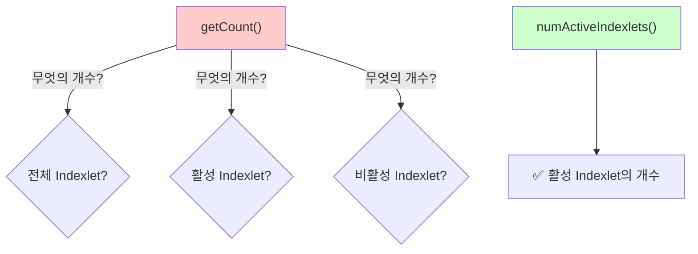

<p align="center"><b>[그림 1] 모호한 이름과 정밀한 이름의 정보량 차이</b></p>


**예시 2: 불리언(Boolean) 변수의 이름**

```java
// Blink state: true when cursor visible.
private boolean blinkStatus = true;
```

`blinkStatus`라는 이름은 충분한 정보를 주지 못합니다. `status`라는 단어는 불리언 변수에 사용하기에는 너무 모호하며, `true`와 `false`가 각각 무엇을 의미하는지 전혀 알려주지 않습니다. 더 나은 대안은 다음과 같습니다.

```java
// Controls cursor blinking: true means the cursor is visible,
// false means the cursor is not displayed.
private boolean cursorVisible = true;
```

`cursorVisible`이라는 이름은 `true`일 때의 상태를 명확하게 전달합니다. 일반적으로 **불리언 변수의 이름은 참/거짓으로 답할 수 있는 술어(predicate) 형태**가 좋습니다 (예: `isComplete`, `hasChildren`, `canWrite`).

**예시 3: 너무 유사한 이름**

Linux 커널에는 네트워크 소켓을 설명하는 두 개의 구조체, `struct socket`과 `struct sock`이 있습니다. 이 두 이름은 너무 비슷해서 어느 것이 어느 것인지 기억하기 매우 어렵습니다. `struct sock_base`와 `struct inet_sock`처럼 그 관계와 차이를 명확히 드러내는 이름이 훨씬 좋습니다.

**정밀함의 예외와 함정**

* **짧은 루프 변수**: `for (int i = 0; i < 10; i++)` 와 같이 루프의 전체 범위가 한눈에 들어오는 짧은 코드에서는 `i`, `j` 같은 관례적인 이름을 사용하는 것이 괜찮습니다. 변수의 사용 범위가 명확하기 때문입니다.
* **지나치게 구체적인 이름**: 이름이 너무 구체적이어서 변수나 메서드의 사용 범위를 부당하게 제한하는 경우도 피해야 합니다. 예를 들어, 텍스트의 특정 범위를 삭제하는 메서드의 파라미터 이름을 `selection`이라고 지으면, 이 메서드가 UI에서 선택된 영역에만 사용될 수 있다는 오해를 불러일으킬 수 있습니다. 실제로는 어떤 범위의 텍스트에도 적용될 수 있다면, `range`와 같은 더 일반적인 이름이 적절합니다.


#### 레드 플래그: 이름 짓기 어렵다 (Hard to Pick Name)
>
> 만약 어떤 변수나 메서드에 대해 정밀하고 직관적이면서도 너무 길지 않은 간단한 이름을 찾기 어렵다면, 이는 그 대상의 설계 자체가 명확하지 않다는 신호일 수 있다.

이름을 짓는 과정은 설계의 건강 상태를 진단하는 리트머스 시험지와 같습니다. 이름이 잘 떠오르지 않는다는 것은 어쩌면 하나의 변수에 너무 많은 역할을 부여하려 하거나, 메서드의 책임이 불분명하기 때문일 수 있습니다. 이럴 때는 잠시 멈추고, 이름 짓기 어려운 대상의 역할을 더 작은 단위로 분리하는 등 설계를 재검토해보는 것이 좋습니다.


### 4. 두 번째 원칙: 일관성 (Consistency)

좋은 이름의 두 번째 중요한 속성은 '일관성'입니다. 어떤 프로그램이든 반복적으로 사용되는 특정 개념들이 존재합니다 (예: 파일 시스템의 블록 번호, 네트워크 프로토콜의 세션 ID). 이러한 **핵심 개념 각각에 대해 고유한 이름을 정하고, 시스템 전체에서 그 이름은 오직 그 목적으로만 일관되게 사용**해야 합니다.

일관성은 독자에게 인지적 레버리지(cognitive leverage)를 제공합니다. 한번 특정 이름의 의미와 용법을 학습하면, 시스템의 다른 곳에서 같은 이름을 마주쳤을 때 즉시 그 지식을 재사용하여 코드를 이해할 수 있습니다. 일관성 있는 이름 짓기는 다음 세 가지 요구사항을 만족해야 합니다.

1. **하나의 목적에는 항상 같은 이름을 사용한다.**
2. **그 이름은 다른 어떤 목적으로도 사용하지 않는다.**
3. **그 목적의 의미가 충분히 좁고 명확하여, 그 이름을 가진 모든 변수가 동일하게 동작한다고 가정할 수 있어야 한다.**

Sprite OS의 `block` 버그는 바로 세 번째 요구사항을 위반한 사례입니다. '블록'이라는 목적이 '파일 블록'과 '디스크 블록'이라는 두 가지 서로 다른 동작을 포함할 만큼 너무 넓었던 것입니다.

때로는 같은 종류의 개념을 여러 개 다뤄야 할 때도 있습니다. 예를 들어, 파일을 복사하는 메서드는 소스 파일의 블록 번호와 목적지 파일의 블록 번호를 모두 필요로 합니다. 이럴 때는 `srcFileBlock`, `dstFileBlock`처럼 일관된 접두사를 사용하여 명확히 구분해주는 것이 좋습니다.


### 5. 군더더기 덜어내기: 불필요한 단어를 피하라

이름에 포함된 모든 단어는 유용한 정보를 제공해야 합니다. 의미를 명확히 하는 데 도움이 되지 않는 단어는 오히려 코드를 산만하게 만드는 군더더기일 뿐입니다. 피해야 할 대표적인 불필요한 단어들은 다음과 같습니다.

* **포괄적인 명사**: `fileObject`, `userRecord` 등에서 `Object`나 `Record` 같은 단어는 대부분 아무런 추가 정보를 주지 못합니다. 그냥 `file`, `user`로 충분합니다.
* **타입 정보**: `filePtr`이나 `arru8NumberList`(헝가리안 표기법)처럼 이름에 변수의 타입을 포함시키는 방식은 더 이상 유용하지 않습니다. 현대의 IDE는 변수 위로 마우스를 올리거나 클릭하는 것만으로도 타입을 쉽게 확인할 수 있게 해주므로, 이름에 타입을 넣는 것은 불필요한 중복입니다.
* **클래스 이름 반복**: `File`이라는 클래스 내에 `fileBlock`이라는 인스턴스 변수를 두는 것처럼, 클래스 이름을 변수명에 반복하는 것은 불필요합니다. 해당 변수가 `File` 클래스의 일부라는 것은 문맥상 명백합니다.


### 6. 반론: 짧은 이름의 미학 - Go 언어 스타일 가이드

물론 이름 짓기에 대한 모든 사람이 아우스터하우트 교수와 같은 생각을 가진 것은 아닙니다. Go 언어 개발자 커뮤니티의 일부는 "긴 이름은 코드의 동작을 모호하게 만든다"고 주장하며, `i`, `n`, `b`와 같이 매우 짧은, 때로는 한 글자로 된 이름을 선호합니다.

**Go 스타일 (짧은 이름)**

```go
func RuneCount(b []byte) int {
    i, n := 0, 0
    for i < len(b) {
        if b[i] < RuneSelf {
            i++
        } else {
            _, size := DecodeRune(b[i:])
            i += size
        }
        n++
    }
    return n
}
```

**아우스터하우트 스타일 제안 (더 긴 이름)**

```go
func RuneCount(buffer []byte) int {
    index, count := 0, 0
    for index < len(buffer) {
        if buffer[index] < RuneSelf {
            index++
        } else {
            _, size := DecodeRune(buffer[index:])
            index += size
        }
        count++
    }
    return count
}
```

이에 대해 저자는 두 번째 버전이 첫 번째 버전에 비해 가독성이 전혀 떨어지지 않으며, 오히려 `count`라는 이름이 `n`보다 변수의 역할을 더 명확하게 알려준다고 반박합니다. 물론, 시스템 전체에서 `n`이 '개수'를 의미하는 변수로 일관되게 사용된다면 짧은 이름도 명확할 수 있습니다.

핵심은 이것입니다. **코드의 가독성은 코드를 작성하는 사람이 아니라, 읽는 사람이 판단하는 것**입니다. 내가 짧은 이름으로 작성한 코드를 동료들이 이해하기 어렵다고 불평하기 시작한다면, 그것은 더 긴 이름을 고려해야 한다는 신호입니다. 이 논쟁에서 양측이 동의하는 유용한 원칙 하나는 "이름의 선언부와 사용처 사이의 거리가 멀수록, 이름은 더 길어져야 한다"는 것입니다.


### 결론: 이름 짓기는 투자다

잘 선택된 이름은 코드를 명확하게 만듭니다. 처음 코드를 접하는 사람이라도 깊은 고민 없이 이름의 의미를 정확히 추측할 수 있게 돕습니다. 좋은 이름을 짓기 위해 초반에 약간의 시간을 더 투자하는 것은, 미래에 코드를 다룰 때의 용이성을 확보하고 버그 발생 가능성을 줄이는 현명한 '투자'입니다.

처음에는 좋은 이름을 찾는 것이 어렵고 시간이 많이 걸리는 일처럼 느껴질 수 있습니다. 하지만 이는 연습을 통해 발전하는 기술입니다. 평범한 이름에 안주하지 않으려는 의식적인 노력을 계속하다 보면, 점차 추가적인 시간 소모 없이도 훌륭한 이름을 빠르고 직관적으로 선택하는 자신을 발견하게 될 것입니다. 이름 짓기는 단순한 코딩 습관이 아니라, 복잡성에 맞서 싸우는 개발자의 가장 기본적이고 강력한 무기입니다.

------


## 제15장: 주석을 먼저 작성하라 (Write The Comments First: Use Comments As Part of The Design Process)

소프트웨어 개발의 세계에서 가장 흔하지만 가장 잘못된 습관은 무엇일까요? 많은 개발자들이 코딩과 단위 테스트가 모두 끝난 후, 개발 과정의 맨 마지막 단계로 문서화를 미루는 것을 당연하게 여깁니다. 마치 힘든 여정 끝에 마지못해 작성하는 보고서처럼, 주석은 종종 귀찮고 지루한 '뒷정리' 작업으로 치부되곤 합니다. 하지만 존 아우스터하우트 교수는 그의 저서 "소프트웨어 설계의 철학" 제15장에서 이러한 통념을 정면으로 반박하며, 오히려 개발 문화의 근간을 뒤흔드는 혁신적인 제안을 합니다. 그것은 바로 **"주석을 먼저 작성하라(Write The Comments First)"**는 원칙입니다.

이 장의 핵심은 주석을 단순한 '문서'가 아닌, 시스템의 추상화를 구체화하고 설계의 품질을 가늠하는 가장 중요한 **'설계 도구'**로 바라보는 패러다임의 전환에 있습니다. 주석을 먼저 작성하는 것은 단순히 문서화 품질을 높이는 것을 넘어, 더 나은 설계를 이끌어내고, 심지어 개발 과정을 더 즐겁게 만드는 강력한 힘을 가지고 있습니다. 이 글은 제15장의 심오한 통찰을 깊이 있게 파고들어, 왜 '주석 우선 접근법'이 모든 개발자가 채택해야 할 전략적 습관인지를 탐구합니다.


### 1. 지연된 주석은 왜 나쁜 주석이 되는가? (Delayed Comments are Bad Comments)

대부분의 개발자들은 왜 주석 작성을 미룰까요? 가장 흔한 변명은 "코드가 아직 계속 바뀌고 있어서요. 지금 주석을 써봤자 코드 변경 시 다시 고쳐야 하니, 코드가 안정화된 후에 쓰는 게 효율적입니다."라는 것입니다. 표면적으로는 합리적으로 들리지만, 이 생각의 이면에는 주석을 귀찮은 잡무로 여기는 심리가 깔려있습니다. 불행하게도, 이러한 '문서화 후순위' 전략은 필연적으로 여러 가지 부정적인 결과를 낳습니다.

* **결코 작성되지 않는다 (It never gets written at all)**: 일단 문서화를 미루기 시작하면, 그 끝은 정해져 있습니다. '나중'은 영원히 오지 않습니다. 다음 기능 개발, 긴급한 버그 수정 등 항상 주석 작성보다 더 급해 보이는 일이 생기기 마련입니다. 코드가 완전히 안정화되었을 즈음에는 이미 방대한 양의 코드가 쌓여있고, 문서화 작업은 더욱 거대하고 부담스러운 괴물이 되어버립니다. 결국 개발자는 '다음에 시간 날 때...'라고 되뇌며 영원히 주석 없는 코드를 방치하게 됩니다.

* **품질이 조악하다 (The quality is poor)**: 엄청난 자기 수양으로 미뤄왔던 주석을 작성한다 해도, 그 품질은 결코 좋을 수 없습니다. 코딩이 끝난 시점에서 개발자의 마음은 이미 해당 코드에서 떠나 있습니다. 다음 프로젝트에 대한 기대감으로 가득 찬 상태에서, 과거의 코드를 위해 주석을 다는 일은 전혀 즐겁지 않은 의무감의 산물일 뿐입니다. 어떻게든 빨리 끝내고 싶은 마음에, 코드의 내용을 그대로 반복하는 무의미한 주석들로 간신히 구색만 맞추게 됩니다.

    ```java
    // member 변수를 초기화한다.
    this.member = new Member();
    ```

    위와 같은 주석은 코드와 동일한 수준의 정보를 제공하므로 아무런 가치가 없습니다. 이는 지연된 주석 작성 시 흔히 나타나는 전형적인 문제입니다.

* **설계 의도가 소실된다 (Design intent is lost)**: 가장 치명적인 문제입니다. 시간이 지나면 코드를 설계할 때 머릿속에 있던 핵심적인 아이디어와 미묘한 결정의 이유들이 희미해집니다. 왜 특정 자료구조를 선택했는지, 왜 예외 처리를 이런 방식으로 구현했는지, 숨겨진 제약 조건은 무엇이었는지 등, 코드로 표현되지 않는 중요한 '설계의 맥락'을 잊어버리게 됩니다. 뒤늦게 주석을 작성할 때는 결국 코드 자체를 보며 내용을 유추할 수밖에 없고, 이는 코드의 내용을 반복하는 수준을 넘어서기 어렵습니다.

> "뒤늦게 주석을 작성할 때, 당신은 이미 설계 과정의 가장 중요한 것들을 잊어버린 상태다. 결국 주석은 당신이 기억하지 못하는 것들을 채워주지 못한다."

결론적으로, 주석 작성을 미루는 습관은 주석이 없거나, 있더라도 아무런 도움이 되지 않는 최악의 결과를 낳는 가장 확실한 방법입니다.

---


### 2. 새로운 패러다임: 주석 우선 접근법 (The Comments-First Approach)

아우스터하우트 교수는 이러한 악순환을 끊기 위해, 주석 작성의 순서를 완전히 뒤집는 '주석 우선 접근법'을 제안합니다. 이는 주석을 개발 과정의 시작점으로 삼는 혁신적인 워크플로입니다. 새로운 클래스를 작성하는 과정을 예로 들면 다음과 같은 순서로 진행됩니다.

1. **클래스 인터페이스 주석 작성**: 가장 먼저, 새로 만들 클래스가 어떤 역할을 하고 어떤 추상화를 제공하는지에 대한 전반적인 설명을 담은 클래스 레벨의 인터페이스 주석을 작성합니다.

2. **핵심 메서드 시그니처와 인터페이스 주석 작성**: 클래스의 가장 중요한 공개(public) 메서드들의 시그니처와 함께, 각 메서드가 어떤 역할을 하는지, 파라미터와 반환 값은 무엇을 의미하는지 등을 설명하는 인터페이스 주석을 작성합니다. 이때 **메서드의 본문(body)은 비워둡니다.**

3. **기본 구조 반복 및 개선**: 위 1, 2단계를 반복하며 클래스의 전체적인 구조와 추상화가 만족스러울 때까지 주석을 다듬습니다.

4. **핵심 인스턴스 변수 선언 및 주석 작성**: 클래스의 상태를 저장할 가장 중요한 인스턴스 변수들을 선언하고, 각 변수가 무엇을 나타내는지 설명하는 주석을 작성합니다.

5. **메서드 본문 구현**: 이제서야 비로소 비워뒀던 메서드의 본문을 코드로 채워나가기 시작합니다. 코드를 작성하며 필요한 내부 구현 주석을 추가합니다. 구현 과정에서 새로운 메서드나 변수가 필요해지면, 다시 그 메서드/변수의 주석을 먼저 작성하고 구현을 진행합니다.

이러한 과정을 통해 코드가 완성되는 시점에는, 모든 필요한 주석 또한 완벽하게 작성되어 있습니다. '문서화 부채'가 쌓일 틈이 전혀 없습니다.

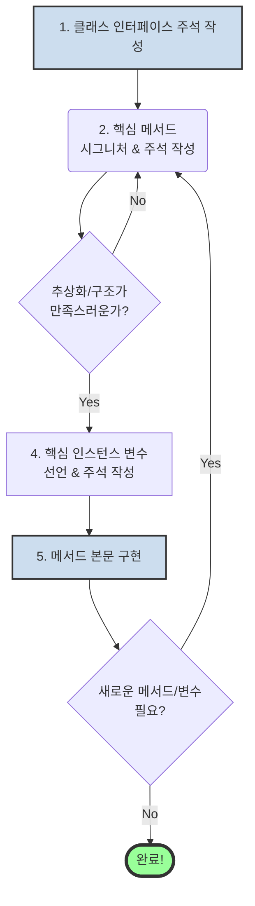

<p align="center"><b>[그림 1] 주석 우선 접근법의 워크플로</b></p>

이 접근법은 단순히 좋은 주석을 만들어내는 것을 넘어, 설계 과정 전체에 지대한 긍정적 영향을 미칩니다. 다음 섹션에서 그 이유를 자세히 살펴보겠습니다.

---


### 3. 주석은 최고의 설계 도구다 (Comments are a Design Tool)

'주석 우선 접근법'이 가져다주는 가장 중요하고 강력한 이점은 바로 **설계 품질의 향상**입니다. 주석은 단순히 코드를 설명하는 보조 수단이 아닙니다. 그 자체가 가장 강력하고 정밀한 설계 도구 중 하나입니다.


#### 3.1. 추상화를 구체화하는 유일한 수단

소프트웨어 설계의 핵심은 '추상화'입니다. 좋은 추상화는 복잡한 내부 구현을 숨기고, 사용자에게는 간단하고 명확한 개념 모델을 제공합니다. 하지만 코드는 본질적으로 너무나 상세하고 저수준(low-level)입니다. 코드만으로는 그 코드가 제공하려는 상위 수준의 추상화를 온전히 담아낼 수 없습니다. 추상화는 오직 주석과 같은 자연어를 통해서만 명확하게 정의되고 전달될 수 있습니다.

> 주석을 먼저 작성한다는 것은, 구현의 함정에 빠지기 전에 **내가 만들고자 하는 것의 '추상화'를 먼저 명확하게 정의**하는 행위입니다.

메서드의 본문을 구현하기 전에 인터페이스 주석을 작성하면, 개발자는 '어떻게(how)' 만들 것인가가 아닌, '무엇을(what)' 만들 것인가에 온전히 집중할 수 있습니다. 이 과정에서 메서드의 책임, 인터페이스의 명확성, 잠재적인 문제점 등을 미리 발견하고 개선할 수 있습니다.


#### 3.2. 복잡성을 측정하는 '탄광 속의 카나리아'

주석은 설계의 복잡성을 미리 알려주는 경고 신호, 즉 '탄광 속의 카나리아' 역할을 합니다. 만약 어떤 메서드나 변수를 명확하고 간결하게 설명하는 주석을 작성하기 어렵다면, 이는 설계에 문제가 있다는 강력한 '레드 플래그(Red Flag)'입니다.

> **레드 플래그: 설명하기 어렵다 (Hard to Describe)**
>
> 어떤 메서드나 변수를 설명하는 주석이 단순하면서도 완전해야 한다. 만약 그런 주석을 작성하기 어렵다고 느낀다면, 그것은 당신이 설명하려는 대상의 설계 자체에 문제가 있을 수 있다는 신호다.

* **긴 주석이 필요한 메서드**: 메서드의 인터페이스가 복잡하다는 증거입니다. 사용자가 알아야 할 사전 조건, 특수한 경우, 부작용 등이 너무 많다는 의미이며, 이는 '얕은 모듈(Shallow Module)'일 가능성이 높습니다.
* **긴 주석이 필요한 변수**: 변수의 역할이 명확하게 정의되지 않았다는 신호입니다. 어쩌면 하나의 변수가 너무 많은 역할을 동시에 수행하려고 하거나, 변수 분해가 제대로 이루어지지 않았을 수 있습니다.

결국, 주석을 작성하는 행위는 내 설계 결정을 조기에 평가하고 문제점을 발견하여 수정할 기회를 제공합니다. 코드를 수백 줄 작성한 후에 설계를 바꾸는 것은 엄청난 비용이 들지만, 주석 몇 줄을 수정하는 것은 거의 비용이 들지 않습니다.

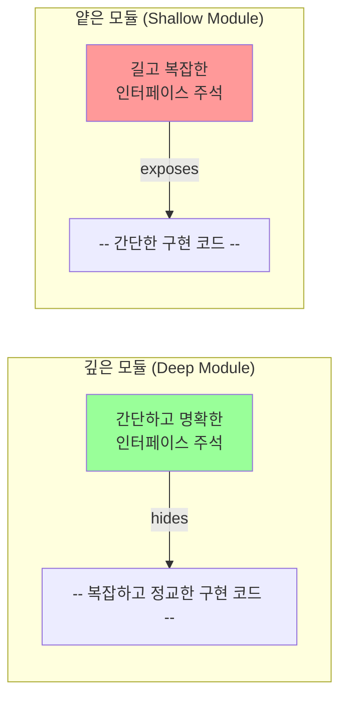

<p align="center"><b>[그림 2] 주석의 복잡성과 모듈의 깊이(Depth) 관계</b></p>

위 그림처럼, 좋은 설계(깊은 모듈)는 간단한 주석으로 설명될 수 있어야 합니다. 인터페이스 주석이 구현만큼이나 복잡하다면, 그 모듈은 추상화에 실패한 얕은 모듈입니다.

---


### 4. 문서화의 즐거움: 주석 작성을 재미있게 만드는 법

'주석 우선 접근법'이 가져다주는 마지막 이점은 바로 심리적인 것입니다. 이 접근법은 지루한 잡무였던 주석 작성을 **창의적이고 즐거운 설계 활동**으로 변화시킵니다.

많은 개발자들에게 프로그래밍의 가장 큰 즐거움은 새로운 클래스나 시스템의 전체적인 구조와 추상화를 구상하는 초기 설계 단계에서 나옵니다. '주석 우선 접근법'은 주석 작성을 바로 이 창의적인 단계의 핵심 활동으로 만듭니다. 주석은 더 이상 과거의 결과물에 대한 보고서가 아니라, 미래의 설계를 구체화하고 다듬어 나가는 과정 그 자체가 됩니다.

> 전략적 프로그래밍(Strategic Programming)의 관점에서, 우리의 목표는 단순히 '동작하는 코드'가 아니라 '훌륭한 설계'를 만드는 것입니다. 이때 주석은 내 설계가 얼마나 훌륭한지를 측정하고 증명하는 가장 직접적인 수단이 됩니다.

가장 적은 단어로, 가장 명확하고 완전하게 내가 만든 추상화를 표현하는 주석을 찾아내는 과정은 하나의 지적인 퍼즐과 같습니다. 간결하고 아름다운 주석을 발견했을 때 느끼는 만족감과 자부심은, 뒤늦게 억지로 주석을 채워 넣는 경험과는 비교할 수 없습니다. 이처럼 '주석 우선 접근법'은 개발의 즐거움을 배가시키는 효과까지 가져옵니다.

---


### 5. 반론: "주석을 먼저 쓰면 비용이 더 들지 않는가?"에 대한 고찰

여전히 많은 개발자들이 "코드가 바뀌면 주석도 계속 고쳐야 하니, 결국 이중 작업 아닌가?"라는 의문을 제기할 수 있습니다. 아우스터하우트 교수는 이러한 반론에 대해 간단한 '개략적인 계산(back-of-the-envelope calculation)'을 통해 그렇지 않음을 보여줍니다.

1. **주석 작성 시간은 미미하다**: 전체 개발 시간(설계, 코딩, 컴파일, 테스트, 디버깅 등) 중에서 순수하게 코드를 '타이핑'하는 시간은 10%를 넘지 않을 가능성이 높습니다. 주석의 양이 코드의 양과 비슷하다고 가정해도, 주석을 타이핑하는 시간은 전체 개발 시간의 약 5%에 불과합니다. 주석 작성을 나중으로 미뤄서 절약할 수 있는 시간은 이 5%의 일부일 뿐, 매우 미미한 양입니다.

2. **오히려 코드 재작업 비용을 줄여준다**: '주석 우선 접근법'의 핵심은 구현에 들어가기 전에 추상화(인터페이스)를 안정시키는 것입니다. 이렇게 안정된 인터페이스를 기반으로 코드를 작성하면, 개발 도중에 설계가 흔들리면서 발생하는 대규모 코드 재작업을 줄일 수 있습니다. 반면, 코드를 먼저 작성하면 구현 과정에서 추상화가 계속 흔들리게 되고, 이는 더 잦은 코드 수정을 유발합니다.

결론적으로, 주석 재작업으로 인한 작은 비용보다, 안정된 추상화를 통해 얻는 코드 재작업 감소의 이점이 훨씬 큽니다. 모든 요소를 고려했을 때, **전체적으로는 주석을 먼저 작성하는 것이 오히려 더 빠를 수 있습니다.**


### 결론: 생각을 바꾸면 설계가 보인다

제15장은 단순한 문서화 기법을 넘어, 소프트웨어 설계에 대한 근본적인 사고방식의 전환을 요구합니다. 주석을 코드가 끝난 후의 성가신 의무가 아니라, 설계의 시작점이자 가장 중요한 도구로 인식하는 순간, 우리는 완전히 새로운 차원의 개발을 경험하게 됩니다.

'주석 우선 접근법'은 다음의 세 가지 핵심적인 이점을 제공합니다.

* **더 나은 문서화**: 설계 의도가 가장 명확한 시점에 작성되므로, 주석의 품질이 비약적으로 향상됩니다.
* **더 나은 설계**: 추상화를 먼저 정의하고, 주석을 통해 설계의 복잡성을 조기에 진단하고 개선할 수 있습니다.
* **더 즐거운 과정**: 지루한 잡무가 창의적인 설계 활동으로 변모하여 개발의 만족도를 높입니다.

만약 당신이 아직 '주석 우선 접근법'을 시도해보지 않았다면, 지금 바로 다음 클래스, 다음 메서드부터 이 원칙을 적용해보길 권합니다. 처음에는 어색할 수 있지만, 이 습관이 익숙해졌을 때 당신의 주석, 당신의 설계, 그리고 개발을 대하는 당신의 태도가 어떻게 변화하는지 스스로 경험하게 될 것입니다. 주석은 더 이상 코드의 그림자가 아니라, 설계를 비추는 등대입니다.


## 제16장: 기존 코드 수정하기 (Modifying Existing Code)

소프트웨어 시스템은 살아있는 유기체와 같습니다. 최초의 설계와 구현은 단지 시작일 뿐, 시스템의 진정한 가치와 복잡성은 수많은 버그 수정, 기능 추가, 성능 개선이라는 끊임없는 진화 과정 속에서 결정됩니다. 존 아우스터하우트 교수는 제16장에서 바로 이 '진화의 과정'에 돋보기를 들이댑니다. 새로운 코드를 작성할 때의 원칙만큼이나, 혹은 그 이상으로 중요한 것이 바로 **기존 코드를 수정하는 올바른 자세와 기술**이라고 역설합니다. 이 장은 단순히 코드를 고치는 행위를 넘어, 모든 수정 작업을 시스템의 설계를 개선하는 기회로 삼는 '전략적 사고방식'과, 그 과정에서 문서의 일관성을 유지하는 구체적인 실천법을 제시합니다.


### 1. 전략적 사고방식 유지하기 (Stay Strategic): 가장 작은 변화는 가장 좋은 변화가 아니다

개발자가 기존 코드에 손을 댈 때, 특히 긴급한 버그 수정이나 마감에 쫓기는 기능 추가 상황에서, 무의식적으로 다음과 같은 질문을 던지게 됩니다. "내가 원하는 기능을 구현하기 위해 필요한 **가장 작은 코드 변경**은 무엇일까?" 이는 코드를 충분히 이해하지 못한 상태에서 변경을 가했을 때 발생할 수 있는 부작용에 대한 두려움과, 당장의 과업을 최대한 빨리 끝내고 싶어하는 '전술적 프로그래밍(tactical programming)'의 함정입니다. 그러나 아우스터하우트 교수는 이러한 접근 방식이 시스템을 서서히 병들게 하는 독이라고 경고합니다.

매번 최소한의 변경만을 가하는 방식은 필연적으로 시스템에 미세한 복잡성들을 추가하게 됩니다. 임시방편적인 `if` 분기문, 미묘한 의존성, 일관성이 깨진 코드 조각들이 야금야금 쌓여나갑니다. 이러한 작은 '설계 부채'들은 하나하나가 큰 문제가 아닐지라도, 시간이 지나면서 누적되어 결국 시스템 전체를 거대한 스파게티 코드 덩어리로 만들어 버립니다.

따라서 우리는 기존 코드를 수정할 때에도 반드시 **전략적 프로그래밍(strategic programming)**의 관점을 견지해야 합니다. 저자는 우리가 지향해야 할 이상적인 목표를 다음과 같이 제시합니다.

> **"각각의 변경 작업이 완료되었을 때, 시스템은 마치 그 변경 사항을 처음부터 염두에 두고 설계했던 것과 같은 구조를 가져야 한다."**
> (Ideally, when you have finished with each change, the system will have the structure it would have had if you had designed it from the start with that change in mind.)

이를 달성하기 위해서는 단순히 '빠른 수정'의 유혹을 뿌리치는 것을 넘어, 현재의 변경 요청을 계기로 기존 시스템의 설계가 여전히 최선인지를 적극적으로 되물어야 합니다. 만약 더 나은 구조가 상상된다면, 우리는 주저 없이 리팩토링을 통해 시스템을 이상적인 상태로 개선해야 합니다. 모든 수정 작업은 시스템 설계를 조금이라도 더 나은 방향으로 이끄는 기회가 되어야 합니다. 이는 제3장에서 강조된 '투자적 사고방식(investment mindset)'의 연장선입니다. 지금 당장 리팩토링에 조금 더 시간을 투자하면, 미래에 훨씬 더 빠르고 안정적으로 개발할 수 있는 깨끗한 시스템을 얻게 됩니다. 이와 관련하여 저자는 개발자가 가슴에 새겨야 할 중요한 경고를 던집니다.

> **"만약 당신이 설계를 더 좋게 만들고 있지 않다면, 당신은 아마도 그것을 더 나쁘게 만들고 있는 것이다."**
> (If you're not making the design better, you are probably making it worse.)

물론 현실의 제약은 존재합니다. '이상적인' 리팩토링에 3개월이 걸리지만 당장의 수정은 2시간이면 가능한 상황이라면, 마감 기한과 같은 현실적인 압박 속에서 타협이 필요할 수 있습니다. 하지만 그럴 때조차도 우리는 "현재 제약 조건 하에서 내가 할 수 있는 최선은 무엇인가?"를 고민해야 합니다. 3개월짜리 리팩토링과 거의 비슷한 수준의 깔끔함을 유지하면서 며칠 내에 완료할 수 있는 대안적 접근법은 없는지 탐색해야 합니다. 모든 개발 조직은 전체 개발 노력의 일부를 꾸준히 정돈과 리팩토링에 투자하는 문화를 만들어야 하며, 이는 장기적으로 반드시 더 큰 보상으로 돌아옵니다.


### 2. 살아있는 문서 만들기: 코드 변경 시 주석을 유지하는 기술

코드가 변경될 때 기존의 주석이 더 이상 유효하지 않게 되는 것은 매우 흔한 일입니다. 이렇게 낡고 부정확해진 주석(stale comments)은 개발자에게 좌절감을 안겨줄 뿐만 아니라, 점차 시스템 내의 모든 주석에 대한 불신을 낳게 됩니다. 결국 개발자들은 주석을 아예 읽지 않게 되고, 문서는 그 가치를 완전히 상실합니다. 다행히도, 몇 가지 간단한 원칙과 훈련을 통해 주석을 코드와 함께 살아 숨 쉬게 유지하는 것은 충분히 가능합니다.


#### 2.1. 주석은 코드 가까이에 (Keep Comments Near the Code)

주석이 코드 변경 시 함께 업데이트되도록 하는 가장 효과적인 방법은 **주석을 그것이 설명하는 코드와 물리적으로 최대한 가깝게 위치시키는 것**입니다. 주석과 코드 사이의 거리가 멀어질수록, 개발자는 주석의 존재를 잊거나 수정하는 것을 번거롭게 여길 가능성이 커집니다.

* **메서드 인터페이스 주석**: 메서드의 인터페이스 주석을 위한 최적의 위치는 바로 메서드의 구현부(body) 바로 위입니다. 개발자가 메서드 로직을 수정하기 위해 파일을 열었을 때, 인터페이스 주석이 바로 눈앞에 있어야 변경 사항을 주석에 반영해야 한다는 사실을 인지하게 됩니다.

    ```java
    /**
     * 사용자의 최종 로그인 시간을 기반으로 비활성 상태 여부를 판단합니다.
     * 
     * @param lastLoginTimestamp 마지막 로그인 시점의 Unix 타임스탬프
     * @param inactivityThresholdDays 비활성으로 간주할 임계 일수
     * @return 사용자가 비활성 상태이면 true, 그렇지 않으면 false
     */
    public boolean isUserInactive(long lastLoginTimestamp, int inactivityThresholdDays) {
        // 이 메서드의 구현을 수정하는 개발자는 바로 위의 주석을 보게 됩니다.
        long thresholdMillis = inactivityThresholdDays * 24L * 60 * 60 * 1000;
        return (System.currentTimeMillis() - lastLoginTimestamp) > thresholdMillis;
    }
    ```

    C/C++처럼 헤더 파일(`.h`)과 소스 파일(`.cpp`)이 분리된 언어의 경우, 인터페이스 주석을 헤더 파일에 두는 관행이 있습니다. 하지만 저자는 이 또한 코드와 주석의 거리를 멀게 만드는 좋지 않은 방식이라고 지적합니다. 현대적인 IDE나 Javadoc, Doxygen과 같은 문서화 도구는 코드의 사용자가 인터페이스 정보를 쉽게 찾아볼 수 있도록 도와줍니다. 따라서 소스 코드 내의 주석 위치는 **사용자**가 아닌, 코드를 **유지보수하는 개발자**의 편의성을 기준으로 결정되어야 합니다.

* **구현 주석**: 메서드 내부의 구현 주석 역시, 주석이 설명하는 코드 블록의 바로 위에 위치시켜야 합니다. 메서드 전체에 대한 모든 주석을 상단에 몰아서 작성하는 대신, 각 로직의 덩어리(phase) 별로 주석을 분산시켜야 합니다.


#### 2.2. 커밋 로그가 아닌 코드에 기록하라 (Comments Belong in the Code, Not the Commit Log)

코드 변경의 배경이나 중요한 맥락을 Git과 같은 버전 관리 시스템의 커밋 메시지에만 상세히 기록하고, 정작 코드에는 아무런 주석을 남기지 않는 것은 흔히 저지르는 실수입니다. 커밋 로그는 특정 시점의 변경 내역을 기록하는 데 유용하지만, 미래의 개발자가 코드의 특정 부분을 이해하기 위해 저장소의 방대한 로그를 뒤져볼 것이라고 기대해서는 안 됩니다. 설령 시도한다 해도, 원하는 정보를 찾는 것은 매우 지루하고 비효율적인 작업입니다.

> 커밋 메시지를 작성할 때 스스로에게 질문해야 합니다: "미래의 개발자가 이 정보를 필요로 할까?" 만약 답이 "그렇다"라면, 그 정보는 반드시 코드 안에 주석으로 남겨져야 합니다.

예를 들어, 특정 경쟁 상태(race condition)를 해결하기 위해 미묘한 로직을 추가했다고 가정해 봅시다. 이 맥락을 코드에 남기지 않으면, 훗날 다른 개발자가 그 코드를 '불필요해 보인다'며 '정리'하는 과정에서 해당 버그를 다시 부활시킬 수 있습니다. 중요한 정보는 개발자들이 가장 쉽게 발견할 수 있는 곳, 즉 코드 그 자체에 있어야 합니다.


#### 2.3. 중복을 피하라 (Avoid Duplication)

주석을 최신 상태로 유지하는 두 번째 핵심 기술은 **문서의 중복을 피하는 것**입니다. 동일한 정보가 여러 곳에 중복되어 있다면, 코드 변경 시 그 모든 곳을 찾아서 일관되게 수정하는 것은 거의 불가능에 가깝습니다. 이는 'Don't Repeat Yourself (DRY)' 원칙을 문서화에 적용하는 것과 같습니다.

* **하나의 설계 결정은 단 한 곳에서만 문서화**되어야 합니다.
  * **Do**: 특정 변수의 복잡한 동작 방식은 변수가 **선언**되는 위치의 주석에 상세히 기술하십시오. 그 변수를 사용하는 모든 곳에서 그 동작을 다시 설명할 필요가 없습니다.
  * **Do**: 여러 모듈에 걸친 설계 결정(cross-module design decision)처럼 명확한 단일 위치를 찾기 어려운 경우, 제13장에서 제안된 것처럼 중앙의 `designNotes` 같은 설계 문서에 기록하고, 관련 코드에서는 그 문서를 참조하는 짧은 주석만 남기십시오. (`// See "Zombies" in designNotes for details.`)
  * **Don't**: 다른 메서드를 호출하는 코드 앞에서, 호출되는 메서드가 무슨 일을 하는지 다시 설명하는 주석을 달지 마십시오. 독자는 IDE의 도움을 받거나 해당 메서드의 인터페이스 주석을 직접 확인해야 합니다.
  * **Don't**: HTTP 프로토콜 명세나 라이브러리 사용법처럼 이미 외부(웹, 공식 문서 등)에 잘 정리된 정보가 있다면, 그 내용을 코드에 복사하지 말고 간단히 참조(링크 등)만 하십시오.


#### 2.4. 변경 사항(Diff)을 확인하는 습관 (Check the Diffs)

문서의 일관성을 유지하는 가장 간단하면서도 강력한 방법 중 하나는, 변경 사항을 커밋하기 직전에 몇 분간 시간을 내어 **자신이 수정한 내용의 diff를 꼼꼼히 살펴보는 습관**을 들이는 것입니다. 이 간단한 검토 과정을 통해 코드 변경이 주석에 올바르게 반영되었는지, 혹은 그 반대의 경우는 없는지 쉽게 확인할 수 있습니다. 이 습관은 낡은 주석을 방지하는 것 외에도, 미처 삭제하지 못한 디버깅 코드나 `TODO` 항목을 찾아내는 등 코드 품질을 높이는 부가적인 효과도 가져옵니다.


### 3. 유지보수가 쉬운 주석의 비밀: 추상화 수준을 높여라 (Higher-Level Comments are Easier to Maintain)

마지막으로, 주석을 유지보수하기 쉽게 만드는 근본적인 방법에 대해 생각해 볼 필요가 있습니다. **주석이 코드보다 더 높은 추상화 수준에서 작성될수록, 유지보수는 더 쉬워집니다.** 높은 수준의 주석은 코드의 세세한 구현 방식이 아니라, 코드의 **'의도(intent)'**와 **'이유(why)'**를 설명합니다.

* **나쁜 주석 (낮은 추상화 수준)**: `// count 변수를 1 증가시킴`
* **좋은 주석 (높은 추상화 수준)**: `// 다음 요청을 처리하기 위해 버퍼 인덱스를 진행시킴`

코드의 세부 구현은 리팩토링 과정에서 빈번하게 변경될 수 있습니다. 하지만 코드의 근본적인 '의도'는 그보다 훨씬 더 안정적입니다. 나쁜 주석은 변수명을 `count`에서 `index`로 바꾸는 사소한 변경만으로도 낡은 정보가 되지만, 좋은 주석은 내부적인 구현 방식이 루프에서 재귀로 바뀌더라도 여전히 유효할 가능성이 높습니다. 결국, 가장 유용한 주석(코드를 단순히 반복하지 않는 주석)이 역설적으로 가장 유지보수하기 쉬운 주석이기도 합니다.


### 결론: 모든 수정은 개선의 기회다

제16장은 소프트웨어 개발의 본질이 끊임없는 '수정'의 연속임을 상기시키며, 그 과정을 대하는 우리의 자세를 근본적으로 바꾸라고 요구합니다. 기존 코드를 수정하는 것은 단순히 주어진 과업을 해결하는 행위가 아니라, 시스템의 건강 상태를 진단하고 더 나은 설계로 개선할 수 있는 소중한 기회입니다. '최소한의 변경'이라는 전술적 함정에서 벗어나, 매 순간 '이상적인 설계'를 추구하는 전략적 사고방식을 갖추어야 합니다. 더불어, 주석을 코드와 분리된 귀찮은 숙제가 아닌, 코드와 함께 진화하는 살아있는 유기체의 일부로 만들기 위한 구체적인 실천법들을 체화해야 합니다. 이러한 노력이 모일 때, 우리의 소프트웨어 시스템은 시간이 지남에 따라 낡고 병드는 것이 아니라, 오히려 더욱 견고하고 명확하며 아름다워질 것입니다.

---


## 제17장: 일관성 (Consistency)

소프트웨어의 우아함과 견고함은 어디에서 비롯될까요? 수많은 설계 원칙 중에서도, 존 아우스터하우트 교수는 제17장에서 **'일관성(Consistency)'**이 복잡성을 줄이고 시스템의 동작을 명확하게 만드는 가장 강력한 도구 중 하나라고 역설합니다. 일관성이란 단순히 코드 스타일을 맞추는 것을 넘어, 시스템 전반에 걸쳐 유사한 문제들을 유사한 방식으로 해결하는 철학적 접근법을 의미합니다. 일관적인 시스템은 개발자에게 '인지적 레버리지(cognitive leverage)'를 제공하여, 한 번 학습한 지식을 시스템의 다른 부분에서도 즉시 활용할 수 있게 해줍니다.

이 글은 "소프트웨어 설계의 철학" 제17장의 내용을 심도 있게 분석하고 해설하여, 일관성이 왜 중요한지, 어떻게 확보할 수 있는지, 그리고 그 과정에서 무엇을 경계해야 하는지에 대한 완벽한 가이드를 제공합니다.


### 1. 일관성의 힘: 인지적 레버리지의 원리

소프트웨어 시스템에서 일관성이란 **"유사한 것들은 유사한 방식으로, 다른 것들은 다른 방식으로 구현되어야 한다"**는 원칙을 의미합니다. 만약 시스템이 일관적이지 않다면, 개발자는 모든 개별 상황을 각각 따로 학습하고 이해해야만 합니다. 겉보기에는 비슷해 보이는 두 코드 조각이 실제로는 미묘하게 다르게 동작할 수 있으며, 이는 개발자로 하여금 잘못된 가정을 하게 만들어 버그의 온상이 됩니다.

반면, 시스템이 높은 수준의 일관성을 유지하고 있다면 개발자는 패턴을 인식하고 안전한 추론을 할 수 있습니다. 이전에 접했던 패턴과 유사한 코드를 발견했을 때, 개발자는 "아, 이것은 그때 그것과 같은 방식으로 동작하겠구나"라고 즉시 유추할 수 있습니다. 이것이 바로 '인지적 레버리지'입니다. 적은 노력으로 더 많은 것을 이해하고 예측할 수 있게 되는 것입니다. 이러한 레버리지는 개발 속도를 높이고 실수를 줄이는 데 결정적인 역할을 합니다.


#### 1.1. 명시적 약속의 힘: 이름, 스타일, 그리고 인터페이스

일관성은 시스템의 여러 계층에서 다양한 형태로 적용될 수 있습니다. 그중 가장 명시적이고 기본적인 형태는 이름, 코딩 스타일, 그리고 인터페이스의 일관성입니다. 이는 팀원 간의 명시적인 약속과 같아서, 코드의 가독성과 예측 가능성을 극적으로 향상시킵니다.

* **이름 (Names)**
  * 14장에서 이미 강조되었듯이, 일관된 네이밍은 매우 중요합니다. 파일 시스템에서 '파일 내 블록의 인덱스'를 가리키는 변수가 있다면, 시스템의 어느 곳에서든 `fileBlock`이라는 이름으로 통일해야 합니다. 이를 통해 개발자는 `fileBlock`이라는 변수를 볼 때마다 그 의미를 다시 해석할 필요 없이 즉시 "아, 이것은 파일 내 블록 인덱스구나"라고 이해할 수 있습니다.
  * 이러한 일관성은 (1) 특정 목적에는 항상 정해진 이름을 사용하고, (2) 그 이름은 다른 어떤 목적으로도 사용하지 않으며, (3) 해당 이름이 가리키는 모든 변수가 동일한 동작 방식을 갖도록 보장할 때 가장 강력한 힘을 발휘합니다.

* **코딩 스타일 (Coding Style)**
  * 들여쓰기, 중괄호(`{}`)의 위치, 선언의 순서, 주석 스타일 등 코딩 스타일에 대한 가이드라인은 코드의 시각적 일관성을 보장합니다. 이는 단순히 코드를 예쁘게 만드는 것을 넘어, 개발자가 코드의 구조를 파악하는 데 드는 인지적 비용을 줄여줍니다. 모든 코드가 익숙한 형태로 작성되어 있을 때, 우리는 코드의 '형태'가 아닌 '내용'에 더 집중할 수 있습니다.

* **인터페이스 (Interfaces)**
  * 하나의 인터페이스에 여러 구현체가 존재하는 것은 일관성의 대표적인 예시입니다. 예를 들어, `Storage`라는 인터페이스가 있고, 이를 구현한 `S3Storage`와 `LocalFileSystemStorage` 클래스가 있다고 가정해 봅시다. 개발자가 `LocalFileSystemStorage`의 사용법을 한 번 익혔다면, `S3Storage`를 사용할 때 `upload`, `download`, `delete`와 같은 핵심 메서드들의 기능과 시그니처가 동일할 것이라고 안전하게 예측할 수 있습니다. 인터페이스라는 일관된 약속 덕분에, 개발자는 각 구현체의 세부적인 차이점에만 집중하면 됩니다.


#### 1.2. 암묵적 구조의 힘: 디자인 패턴과 불변성

일관성은 명시적인 규칙을 넘어, 시스템의 암묵적인 구조를 통해서도 힘을 발휘합니다. 디자인 패턴과 불변성은 코드 곳곳에 일관된 구조적 원칙을 심어, 시스템을 더 예측 가능하고 견고하게 만듭니다.

* **디자인 패턴 (Design Patterns)**
  * 디자인 패턴은 특정 유형의 문제에 대해 일반적으로 인정되는 일관된 해결책입니다. 예를 들어, MVC(Model-View-Controller) 패턴을 적용하여 UI 코드를 개발한다면, 다른 개발자들은 코드의 어느 부분에 비즈니스 로직(Model), 화면 표시 로직(View), 그리고 사용자 입력 처리 로직(Controller)이 있는지 쉽게 예측할 수 있습니다. 이는 팀원 간에 공유된 일관된 설계 어휘집과 같습니다.

* **불변성 (Invariants)**
  * 불변성이란 특정 변수나 자료 구조에 대해 **'항상 참'**인 속성을 의미합니다. 예를 들어, "텍스트 편집기의 모든 텍스트 라인은 반드시 개행 문자(`\n`)로 끝난다"는 불변성을 설정할 수 있습니다. 이 불변성이 시스템 전반에 걸쳐 일관되게 유지된다면, 개발자는 텍스트 라인을 다룰 때 '개행 문자가 없는 경우'를 더 이상 고려할 필요가 없습니다. 이는 수많은 예외 처리 코드를 제거하고, 로직을 단순화하며, 코드의 동작을 추론하기 쉽게 만들어줍니다.

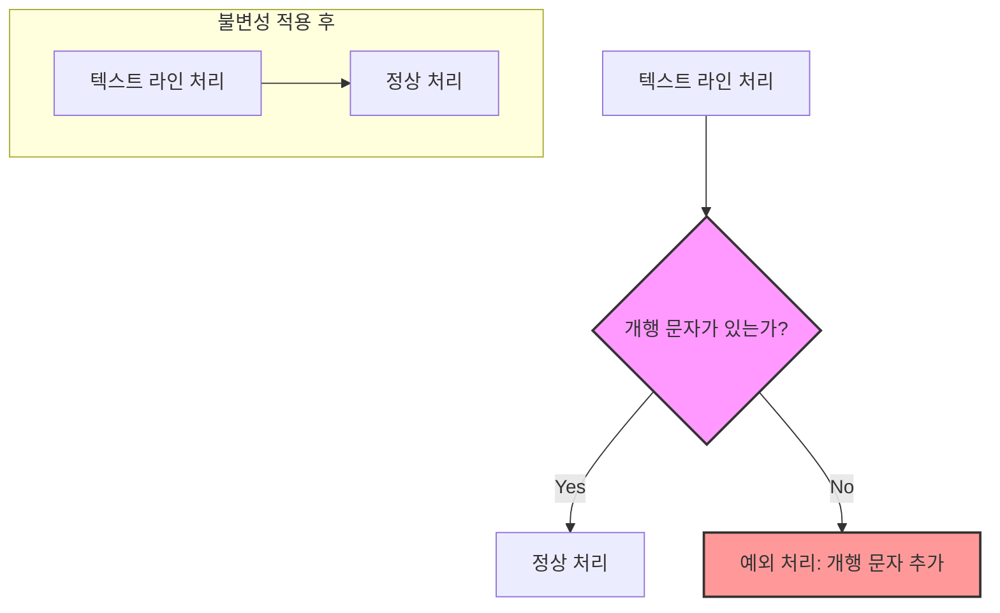

<p align="center"><b>[그림 1] 불변성 적용을 통한 로직 단순화</b></p>

위 다이어그램처럼, 불변성을 일관되게 적용하면 복잡한 분기문과 예외 처리 로직이 사라지고 코드가 훨씬 명확해집니다.

---


### 2. 일관성을 확보하고 유지하는 방법

일관성이 중요하다는 것을 아는 것과, 그것을 실제로 프로젝트에서 유지하는 것은 별개의 문제입니다. 특히 여러 사람이 오랜 기간에 걸쳐 협업하는 대규모 프로젝트에서 일관성을 유지하기란 매우 어렵습니다. 저자는 일관성을 유지하기 위한 몇 가지 실용적인 전략을 제시합니다.


#### 2.1. 기억이 아닌 시스템에 의존하기: 문서화와 자동화

인간의 기억력은 불완전합니다. 구두로 합의된 규칙은 쉽게 잊히고, 새로운 팀원은 기존의 관례를 알 방법이 없습니다. 따라서 일관성을 유지하기 위한 첫 번째 단계는 규칙을 '기록'하고 '자동화'하여 개인의 기억이 아닌 시스템에 의존하는 것입니다.

> **규칙은 기록될 때까지 존재하지 않는다.**

* **문서화 (Document)**: 코딩 스타일 가이드라인과 같은 프로젝트 전반의 중요한 관례들은 문서로 명확하게 작성해야 합니다. 이 문서는 프로젝트 위키(Wiki)처럼 모든 팀원이 쉽게 접근할 수 있는 곳에 위치해야 합니다. 또한, 불변성과 같이 특정 코드에 국한된 지역적인 관례들은 코드 바로 옆에 주석으로 남겨야 합니다.

* **강제화 (Enforce)**: 문서만으로는 충분하지 않습니다. 사람들은 문서를 읽는 것을 잊거나, 규칙을 어기는 실수를 합니다. 따라서 관례를 강제하는 자동화된 도구를 구축하는 것이 가장 효과적입니다. 예를 들어, 저자는 자신의 프로젝트에서 개발자들의 운영체제(Unix/Windows)에 따라 줄 바꿈 문자가 달라져 생기는 문제를 겪었습니다. 이 문제를 해결하기 위해, 코드가 저장소에 커밋(commit)되기 전에 모든 파일의 줄 바꿈 문자를 검사하고, 관례에 어긋나면 커밋을 자동으로 중단시키는 스크립트를 작성했습니다.

    ```bash
    # 커밋 전 훅(pre-commit hook) 스크립트 예시
    
    # 수정된 파일 목록 가져오기
    MODIFIED_FILES=$(git diff --cached --name-only --diff-filter=ACM)
    
    HAS_CR=false
    for FILE in $MODIFIED_FILES; do
      # 파일 내에 캐리지 리턴(\r) 문자가 있는지 확인
      if grep -q $'\r' "$FILE"; then
        echo "ERROR: Carriage return found in file: $FILE"
        HAS_CR=true
      fi
    done
    
    if [ "$HAS_CR" = true ]; then
      echo "Please fix line endings to LF only."
      exit 1 # 커밋 중단
    fi
    
    exit 0 # 커밋 진행
    ```

    이러한 자동화된 체커는 실수를 방지할 뿐만 아니라, 새로운 개발자가 관례를 빠르게 학습하도록 돕는 훌륭한 교육 도구가 됩니다. 물론, 코드 리뷰 또한 관례를 강제하고 전파하는 중요한 수단입니다.


#### 2.2. 문화적 일관성: "로마에서는 로마법을 따르라"

모든 규칙을 문서화하고 자동화할 수는 없습니다. 이때 필요한 것이 바로 문화적 일관성입니다. 이는 "로마에서는 로마법을 따르라(When in Rome, do as the Romans do)"는 격언으로 요약될 수 있습니다.

* **기존 코드 모방하기**: 새로운 코드를 작성하거나 기존 코드를 수정할 때는, 항상 주변 코드를 먼저 살펴보아야 합니다. 메서드들은 알파벳순으로 정렬되어 있는가? 변수명은 카멜 케이스(`camelCase`)를 사용하는가, 스네이크 케이스(`snake_case`)를 사용하는가? 관례처럼 보이는 것이 있다면, 설령 그것이 마음에 들지 않더라도 따라야 합니다.

* **기존 관례를 함부로 바꾸지 마라**: "더 좋은 아이디어"가 떠올랐다는 이유만으로 기존의 관례를 깨는 것은 매우 위험합니다. 새로운 방식이 주는 약간의 이점보다, 일관성이 깨짐으로 인해 발생하는 혼란과 비용이 훨씬 더 큰 경우가 대부분입니다. 기존 관례를 변경하기 전에는 반드시 다음 두 가지 질문에 답해야 합니다.

    > 1. 기존 관례가 정해질 당시에는 없었던, 당신의 새로운 접근법을 정당화할 **중요한 새 정보**가 있는가?
    > 2. 새로운 접근법이 기존의 모든 사용처를 **전부 수정하는 비용을 감수할 만큼** 압도적으로 뛰어난가?

    만약 팀 전체가 이 두 질문에 "예"라고 답한다면, 그때는 모든 기존 코드를 새로운 관례에 맞춰 한 번에 수정해야 합니다. 어중간하게 두 가지 방식이 공존하는 것이 최악의 상황입니다.

---


### 3. 과유불급: 일관성을 너무 멀리 밀어붙일 때의 위험

모든 원칙에는 예외가 있듯이, 일관성 역시 맹목적으로 추구해서는 안 됩니다. 일관성의 핵심은 '유사한' 것들을 유사하게 다루는 것입니다. 만약 본질적으로 '다른' 것들을 억지로 같은 틀에 끼워 맞추려 한다면, 이는 오히려 복잡성과 혼란을 야기할 것입니다.

예를 들어, '사용자 ID'와 '주문 ID'는 둘 다 'ID'라는 공통점을 갖지만, 그 본질과 쓰임새는 전혀 다릅니다. 이 둘을 `id`라는 동일한 변수명으로 사용하는 것은 일관성이 아니라 혼동입니다.

일관성이 힘을 발휘하는 이유는 **"x처럼 보이면, 그것은 정말로 x이다"**라는 신뢰를 개발자에게 주기 때문입니다. 만약 이 신뢰가 깨진다면, 개발자는 더 이상 패턴을 믿고 안전한 추론을 할 수 없게 되며, 일관성의 모든 이점은 사라집니다. 따라서 우리는 무엇이 진정으로 유사하고 무엇이 다른지 분별하는 '좋은 안목'을 길러야 합니다.


### 결론: 일관성은 투자다

결론적으로, 일관성은 "소프트웨어 설계의 철학"의 핵심 주제인 **'투자적 사고방식(investment mindset)'**의 또 다른 훌륭한 예시입니다. 일관성을 확보하기 위해서는 초기에 추가적인 노력이 필요합니다. 관례를 정하고, 문서화하고, 자동화된 체커를 만들고, 코드 리뷰에 시간을 쏟아야 합니다. 이는 단기적인 관점에서는 개발 속도를 늦추는 것처럼 보일 수 있습니다.

하지만 이 투자는 머지않아 큰 수익으로 돌아옵니다. 일관적인 시스템은 훨씬 더 **'명확(obvious)'**해집니다. 개발자들은 코드의 동작을 더 빠르고 정확하게 이해할 수 있으며, 이는 곧 더 적은 버그와 더 빠른 개발 속도로 이어집니다. 일관성은 단순히 보기 좋은 코드를 만드는 미학의 문제가 아니라, 복잡성과의 전쟁에서 승리하기 위한 핵심적인 전략 무기입니다.

------


## 제18장: 코드는 명확해야 한다 (Code Should be Obvious)

"소프트웨어 설계의 철학"은 복잡성과의 싸움이라는 단 하나의 주제를 일관되게 관통합니다. 저자 존 아우스터하우트는 복잡성을 유발하는 두 가지 근본 원인으로 '의존성(Dependencies)'과 '모호함(Obscurity)'을 지목했습니다. 이 중 모호함은 시스템에 대한 중요 정보가 개발자에게 명확히 드러나지 않을 때 발생하는 문제로, 이는 곧바로 개발자의 인지 부하를 높이고 '미지의 불확실성(Unknown Unknowns)'을 낳는 심각한 악의 근원입니다. 제18장은 바로 이 모호함이라는 적을 물리치기 위한 가장 강력한 무기, 즉 '명확성(Obviousness)'에 대해 심도 있게 다룹니다.

이 글은 원서 18장의 모든 핵심 내용을 담아, 명확한 코드란 무엇이며 어떻게 작성할 수 있는지, 그리고 어떤 함정들이 코드의 명확성을 해치는지 상세히 해설합니다.


### 1. '명확한 코드'의 정의: 첫 번째 추측이 정답이 되는 코드

우리는 종종 '읽기 좋은 코드', '깨끗한 코드'라는 말을 사용하지만, 아우스터하우트 교수는 '명확한 코드'라는 조금 더 구체적이고 강력한 개념을 제시합니다. 그가 말하는 명확한 코드란, 개발자가 코드를 처음 접했을 때 많은 시간을 들이거나 깊은 생각 없이도 그 코드의 동작과 의미에 대해 내리는 첫 번째 추측이 올바른 코드를 의미합니다. 명확한 코드는 독자가 코드를 이해하기 위해 필요한 모든 정보를 즉각적으로 제공하거나, 최소한의 노력으로 찾을 수 있도록 돕습니다.

> 코드가 명확하다는 것은, 누군가 그 코드를 별다른 생각 없이 빠르게 읽었을 때, 코드의 동작이나 의미에 대한 첫 번째 추측이 올바를 것이라는 의미이다.
> (If code is obvious, it means that someone can read the code quickly, without much thought, and their first guesses about the behavior or meaning of the code will be correct.)

중요한 것은 이 '명확성'이 코드를 작성한 개발자의 관점이 아니라, 코드를 읽는 독자의 관점에서 판단되어야 한다는 점입니다. 내가 작성한 코드는 내 머릿속의 모든 설계 의도와 맥락과 함께 존재하기에 당연히 명확해 보입니다. 하지만 아무런 사전 지식 없이 코드를 접하는 동료가 그것을 이해하기 어렵다고 말한다면, 그것은 명확하지 않은 코드입니다. 따라서 코드 리뷰는 내 코드가 다른 사람에게도 명확한지를 검증할 수 있는 가장 효과적인 장치입니다.


### 2. 명확한 코드를 만드는 기법들

다행히도, 코드의 명확성은 타고난 재능이 아니라 훈련을 통해 습득할 수 있는 기술의 영역입니다. 아우스터하우트 교수는 코드의 명확성을 극대화하기 위한 몇 가지 구체적인 기법들을 제시합니다. 이는 단순히 코딩 스타일을 넘어, 설계 철학의 연장선에 있습니다.


#### 2.1. 이름과 일관성: 명확성의 초석

명확한 코드를 만드는 가장 중요하고 기본적인 두 가지 기법은 이미 이전 장들에서 상세히 다루어졌습니다. 바로 '좋은 이름 짓기(Choosing Good Names, 14장)'와 '일관성 유지(Consistency, 17장)'입니다. 이 두 가지 원칙은 명확한 코드를 위한 가장 단단한 초석이 되므로, 그 중요성은 아무리 강조해도 지나치지 않습니다.

* **좋은 이름**: 변수나 메서드의 이름은 그 자체로 강력한 문서입니다. 이름이 모호하거나 너무 일반적이면, 독자는 그 실체를 파악하기 위해 코드의 여러 부분을 헤매야만 합니다. `block`이라는 이름이 파일 내의 논리 블록인지 디스크 상의 물리 블록인지 명확하지 않아 6개월간 추적했던 저자의 경험담은, 좋은 이름이 얼마나 중요한지를 극적으로 보여줍니다. 정확하고, 직관적이며, 함축적인 이름은 코드의 의도를 즉시 전달하여 독자의 인지 부하를 극적으로 낮춥니다.
* **일관성**: 비슷한 기능은 항상 비슷한 방식으로 구현하고, 같은 목적을 가진 변수는 항상 같은 이름을 사용해야 합니다. 일관성은 독자가 시스템의 한 부분에서 학습한 지식을 다른 부분에서도 재사용할 수 있게 하는 '인지적 지렛대' 역할을 합니다. `i`, `j`를 루프 변수로 일관되게 사용하면, 독자는 이 변수를 보자마자 '아, 이것은 반복을 위한 인덱스구나'라고 즉시 추론할 수 있습니다.


#### 2.2. 공백의 전략적 사용

코드 포맷팅, 특히 공백(white space)의 사용은 단순히 심미적인 문제가 아니라 코드의 구조를 시각적으로 드러내어 명확성을 높이는 중요한 도구입니다. 개발자들은 종종 화면에 더 많은 코드를 표시하기 위해 공백을 최소화하려는 경향이 있지만, 이는 가독성을 해치는 대표적인 실수입니다. 전략적으로 사용된 공백은 코드의 논리적 단위를 구분하고, 복잡한 구문의 구조를 파악하는 데 결정적인 도움을 줍니다.


##### 예시 1: 문서 주석에서의 공백

```java
// Before: 공백이 없어 구조 파악이 어렵다
/**
 * ...
 * @param numThreads The number of threads that this manager should
 * spin up in order to manage ongoing connections. The MessageManager
 * spins up at least one thread for every open connection, so this
 * should be at least equal to the number of connections you expect
 * to be open at once.
 * @param handler Used as a callback in order to handle incoming
 * messages on this MessageManager’s open connections. See
 * {@code MessageHandler} for details.
 */
```

```java
// After: 파라미터별로 빈 줄을 추가하여 구분이 명확해졌다
/**
 * ...
 * @param numThreads
 *        The number of threads that this manager should spin up in
 *        order to manage ongoing connections. The MessageManager
 *        spins up at least one thread for every open connection,
 *        so this should be at least equal to the number of
 *        connections you expect to be open at once.
 *
 * @param handler
 *        Used as a callback in order to handle incoming messages
 *        on this MessageManager’s open connections. See
 *        {@code MessageHandler} for details.
 */
```

위 예시처럼, 각 파라미터 설명 사이에 빈 줄 하나를 추가하는 것만으로도 각 파라미터가 하나의 독립된 단위라는 사실이 시각적으로 명확해집니다.


##### 예시 2: 메서드 내 논리 블록 구분

메서드 내에서도 관련 있는 코드들은 한데 모으고, 논리적인 흐름이 바뀌는 지점에는 빈 줄을 삽입하여 시각적으로 단락을 나누는 것이 좋습니다. 각 단락의 시작 부분에 해당 블록이 하는 일을 요약하는 주석을 함께 배치하면 금상첨화입니다.

```cpp
void Buffer::allocAux(size_t numBytes) {
    // 1. 길이를 8의 배수로 올림하여 정렬을 보장한다.
    uint32_t numBytes32 = (downCast<uint32_t>(numBytes) + 7) & ~0x7;
    assert(numBytes32 != 0);

    // 2. 기존 할당된 공간의 앞부분에 여유가 있으면 사용한다.
    if (availableLength >= numBytes32) {
        availableLength -= numBytes32;
        return firstAvailable + availableLength;
    }

    // 3. 마지막 청크의 뒷부분에 추가할 공간이 있는지 확인한다.
    if (extraAppendBytes >= numBytes32) {
        extraAppendBytes -= numBytes32;
        return lastChunk->data + lastChunk->length + extraAppendBytes;
    }

    // 4. 위의 경우에 모두 해당하지 않으면, 새로운 공간을 할당한다.
    uint32_t allocatedLength;
    firstAvailable = getNewAllocation(numBytes32, &allocatedLength);
    availableLength = allocatedLength - numBytes32;
    return firstAvailable + availableLength;
}
```


#### 2.3. 주석: 불가피한 모호함을 위한 보완재

아무리 노력해도 코드가 가진 정보만으로는 그 의도나 배경을 완벽하게 전달하기 어려운 경우가 존재합니다. 이럴 때 주석은 코드의 명확성을 보완하는 마지막이자 가장 중요한 수단이 됩니다. 주석은 코드에 드러나지 않는 '왜(why)'와 '무엇(what)'을 설명함으로써, 독자가 놓칠 수 있는 중요한 맥락을 제공하고 잘못된 추측을 방지하는 역할을 합니다.


### 3. 코드를 불명확하게 만드는 함정들

명확한 코드를 작성하는 것만큼이나, 코드의 명확성을 해치는 안티 패턴들을 인지하고 피하는 것도 중요합니다. 몇몇 유용한 프로그래밍 기법들은 그 구조적 특성상 모호함을 유발하는 부작용을 가지고 있습니다. 이러한 기법들을 사용할 때는 그것이 만들어내는 모호함을 상쇄할 만한 추가적인 노력을(주로 주석을 통해) 기울여야 합니다.


#### 3.1. 이벤트 기반 프로그래밍 (Event-driven Programming)

이벤트 기반 프로그래밍은 GUI 애플리케이션이나 네트워크 서버 등에서 널리 사용되는 강력한 패러다임입니다. 하지만 이는 코드의 제어 흐름을 따라가기 어렵게 만들어 본질적인 모호함을 내포합니다. 이벤트 핸들러(콜백 함수)는 코드 상에서 직접 호출되지 않고, 이벤트 루프나 디스패처에 의해 간접적으로, 런타임에 호출됩니다. 따라서 핸들러 코드만 봐서는 '이 코드가 언제, 어떤 맥락에서 호출되는지' 알기 어렵습니다.

```mermaid
graph TD
    subgraph "직접 호출 (명확함)"
        A[main()] --> B[processRequest()]
        B --> C[parseHeader()]
    end

    subgraph "이벤트 기반 호출 (모호함)"
        D[Event Loop] -- Network Packet Arrives --> E{...}
        E -- event type? --> F[onPacketReceived()]
        D -- Mouse Click --> G{...}
        G -- event type? --> H[onMouseClicked()]
    end
```

<p align="center"><b>[그림 1] 직접 호출과 이벤트 기반 호출의 제어 흐름 비교</b></p>

이러한 모호함을 해결하기 위해서는, 이벤트 핸들러의 인터페이스 주석에 **이 핸들러가 언제, 누구에 의해, 어떤 조건에서 호출되는지**를 명확하게 명시해야 합니다.

```cpp
/**
 * 이 메서드는 transport의 디스패치 스레드에 의해 호출됩니다.
 * transport-level 오류로 인해 RPC가 정상적으로 완료되지 못했을 경우
 * 호출됩니다.
 */
void Transport::RpcNotifier::failed() {
    // ...
}
```


#### 3.2. 제네릭 컨테이너 (Generic Containers)

Java의 `Pair`나 C++의 `std::pair`와 같이, 타입에 무관하게 두세 개의 값을 하나로 묶어주는 제네릭 컨테이너 클래스는 사용하기에 매우 편리합니다. 특히 메서드에서 여러 값을 반환하고 싶을 때 유용하게 쓰입니다. 하지만 이 편리함은 심각한 모호함이라는 대가를 치릅니다.

```java
// 제네릭 Pair를 사용하여 현재 임기(term)와 투표 성공 여부를 반환
return new Pair<Integer, Boolean>(currentTerm, false);

// 사용하는 쪽 코드
Pair<Integer, Boolean> result = someObject.requestVote();
Integer term = result.getKey();      // getKey()가 뭘까?
Boolean success = result.getValue(); // getValue()가 뭘까?
```

`getKey()`, `getValue()` 같은 제네릭 이름은 그 안에 담긴 값의 의미를 전혀 설명해주지 못합니다. 독자는 이 값들이 무엇을 의미하는지 알기 위해 반환하는 쪽의 코드를 직접 찾아가야만 합니다. 이는 책의 핵심 원칙 중 하나인 **"소프트웨어는 작성의 용이성이 아닌, 읽기의 용이성을 위해 설계되어야 한다(Software should be designed for ease of reading, not ease of writing)"**는 원칙을 정면으로 위배합니다.

이 문제를 해결하는 방법은 간단합니다. 조금 귀찮더라도, 해당 용도에 맞는 명시적인 클래스나 구조체를 정의하는 것입니다.

```java
// 명시적인 의미를 담은 클래스 정의
public class VoteResult {
    public final int term;
    public final boolean granted;
    // ... 생성자 ...
}

// 명시적인 클래스를 사용한 반환
return new VoteResult(currentTerm, false);

// 사용하는 쪽 코드
VoteResult result = someObject.requestVote();
int term = result.term;
boolean granted = result.granted;
```

이렇게 하면 `term`, `granted`와 같이 의미가 명확한 이름을 사용할 수 있어 코드의 명확성이 크게 향상됩니다.


#### 3.3. 선언과 할당 타입의 불일치

Java와 같은 언어에서는 인터페이스(또는 상위 클래스) 타입으로 변수를 선언하고, 실제로는 그 구현체(또는 하위 클래스)로 객체를 할당하는 패턴이 흔히 사용됩니다.

```java
private List<Message> incomingMessageList;
...
incomingMessageList = new ArrayList<Message>();
```

이 코드는 문법적으로는 완벽하지만, 독자에게 혼란을 줄 수 있습니다. `List` 인터페이스에는 `ArrayList`, `LinkedList` 등 다양한 구현체가 있으며, 각각의 성능 특성(예: 임의 접근 속도)이나 스레드 안전성 등이 다릅니다. 변수 선언부만 본 독자는 이 리스트가 어떤 특성을 가질지 확신할 수 없으며, 실제 할당 코드를 찾아가야만 합니다. 특별한 이유(예: 런타임에 다른 구현체로 교체해야 하는 경우)가 없다면, 선언 타입과 할당 타입을 일치시켜 코드의 행동을 예측 가능하고 명확하게 만드는 것이 좋습니다.


#### 3.4. 독자의 기대를 저버리는 코드

소프트웨어 개발에는 명문화되지 않은 수많은 관례와 패턴이 존재합니다. 예를 들어, 대부분의 애플리케이션은 `main` 함수가 반환되면 프로그램이 종료될 것이라고 기대합니다. 만약 여러분의 코드가 이러한 일반적인 기대를 저버리는 특별한 동작을 한다면, 이는 독자에게 큰 혼란을 야기하므로 반드시 명시적으로 문서화해야 합니다.

```java
public static void main(String[] args) {
    // ...
    new RaftClient(myAddress, serverAddresses);
    // 이 지점에서 프로그램이 종료될 것이라고 예상하기 쉽다.
}
```

만약 `RaftClient` 생성자가 내부적으로 백그라운드 스레드를 생성하여 `main` 스레드가 종료된 후에도 애플리케이션이 계속 실행된다면, 이는 매우 비직관적이고 불명확한 동작입니다. 이럴 때는 `RaftClient` 생성자의 문서 주석에 해당 동작을 명시하는 것은 물론, 호출부 근처에도 "주의: 이 생성자는 백그라운드 스레드를 시작하므로 애플리케이션이 계속 실행됩니다." 와 같은 주석을 남겨 독자의 잘못된 추측을 막아주어야 합니다.


### 결론: 명확성은 '정보'의 문제다

코드의 명확성은 결국 '정보'의 문제입니다. 코드가 불명확하다는 것은, 코드를 이해하는 데 필요한 핵심적인 정보가 독자에게 제대로 전달되지 않고 있다는 의미입니다. 제네릭 `Pair` 예시에서는 `getKey()`가 반환하는 값이 '임기(term)'라는 정보가 누락되었고, `RaftClient` 예시에서는 생성자가 백그라운드 스레드를 만든다는 정보가 누락되었습니다.

따라서 코드를 명확하게 만들기 위한 우리의 모든 노력은, 독자가 필요한 정보를 항상 가지고 있도록 보장하는 것으로 귀결됩니다. 아우스터하우트 교수는 이를 위한 세 가지 전략을 제시하며 18장을 마무리합니다.

1. **필요한 정보의 양 자체를 줄여라**: 좋은 추상화를 통해 세부 사항을 숨기고, 특수 사례를 제거하여 독자가 알아야 할 정보의 총량을 근본적으로 줄이는 것이 가장 좋은 방법입니다.
2. **독자의 기존 지식을 활용하라**: 널리 알려진 관례와 디자인 패턴을 따름으로써, 독자가 새로운 정보를 학습할 필요 없이 기존의 지식을 바탕으로 코드를 쉽게 이해할 수 있도록 하십시오.
3. **필요한 정보를 코드에 명시적으로 제시하라**: 위 두 가지 방법으로도 전달할 수 없는 정보는, 좋은 이름과 전략적인 주석을 통해 코드 내에서 명확하게 드러내야 합니다.

결국, 명확한 코드를 작성하는 것은 동료 개발자에 대한 배려이자, 미래의 나 자신을 위한 가장 현명한 투자입니다. 명확성은 복잡성이라는 거대한 적과 싸우기 위한 가장 기본적이면서도 강력한 무기임을 잊지 말아야 합니다.

------


## 제19장: 소프트웨어 트렌드 (Software Trends)

소프트웨어 개발의 세계는 끊임없이 변화하며, 새로운 아이디어와 방법론, 그리고 패턴이 주기적으로 등장하여 개발자들의 사고방식과 작업 방식에 영향을 미칩니다. 이러한 '트렌드'들은 종종 생산성 향상과 코드 품질 개선이라는 장밋빛 약속과 함께 우리에게 다가옵니다. 하지만 존 아우스터하우트(John Ousterhout) 교수는 그의 저서 "소프트웨어 설계의 철학(A Philosophy of Software Design)" 제19장에서, 우리가 이러한 트렌드들을 맹목적으로 수용하기 전에 반드시 거쳐야 할 비판적 사고의 틀을 제시합니다. 이 장의 목적은 새로운 설계 원칙을 소개하는 것이 아니라, 책의 앞부분에서 확립한 핵심 철학, 즉 **'복잡성(Complexity) 관리'**라는 렌즈를 통해 현대 소프트웨어 개발의 주요 트렌드들을 면밀히 분석하고 평가하는 것입니다.

이 글은 제19장의 내용을 심층적으로 분석하여, 각 트렌드가 소프트웨어의 복잡성에 어떤 영향을 미치는지, 그리고 아우스터하우트의 관점에서 우리는 이를 어떻게 받아들여야 하는지에 대한 통찰을 제공하고자 합니다.

---


### 1. 객체지향 프로그래밍과 상속 (Object-Oriented Programming and Inheritance)

객체지향 프로그래밍(OOP)은 지난 수십 년간 소프트웨어 개발 패러다임을 지배해 온 가장 중요한 아이디어 중 하나입니다. 클래스, 캡슐화, 상속, 다형성과 같은 개념들은 우리가 소프트웨어를 구조화하는 방식에 근본적인 변화를 가져왔습니다. 아우스터하우트는 이러한 OOP의 메커니즘들이 신중하게 사용될 때 훌륭한 설계를 낳는 데 도움이 될 수 있음을 인정합니다. 특히, `private`으로 선언된 메서드와 변수는 외부로부터의 직접적인 접근을 차단하여 **정보 은닉(Information Hiding)** 원칙을 강제하고, 이는 모듈 간의 불필요한 의존성을 줄이는 데 크게 기여합니다.

그러나 OOP의 모든 요소가 복잡성을 줄이는 데 긍정적인 역할을 하는 것은 아닙니다. 저자는 특히 OOP의 핵심 요소 중 하나인 **상속(Inheritance)**에 대해, 그 두 가지 형태를 구분하며 심도 있는 분석을 제시합니다.


#### 인터페이스 상속: 복잡성을 줄이는 강력한 도구

인터페이스 상속(Interface Inheritance)은 부모 클래스가 메서드의 시그니처(이름, 파라미터, 반환 타입)만을 정의하고 실제 구현은 제공하지 않는 형태를 말합니다. 각 자식 클래스는 이 시그니처를 반드시 구현해야 하지만, 그 방식은 클래스마다 다를 수 있습니다. 예를 들어, `Stream`이라는 인터페이스가 `read()`와 `write()` 메서드를 정의한다면, `FileStream` 클래스는 디스크 파일을 대상으로, `NetworkStream` 클래스는 네트워크 소켓을 대상으로 각각의 `read()`, `write()`를 구현할 수 있습니다.

> 인터페이스 상속은 동일한 인터페이스를 여러 목적으로 재사용함으로써 복잡성에 대항하는 지렛대 역할을 합니다. 이는 하나의 문제(예: 파일 I/O 인터페이스 사용법)를 해결하며 얻은 지식을 다른 문제(예: 네트워크 통신)를 해결하는 데 그대로 적용할 수 있게 해줍니다.

이는 이 책의 핵심 개념인 **'깊은 모듈(Deep Modules)'**과 직접적으로 연결됩니다. 하나의 인터페이스에 대해 더 많은 구현체가 존재할수록, 그 인터페이스는 더욱 '깊어집니다'. 왜냐하면 다양한 구현체들의 공통적인 본질(추상화)을 포착하면서도 각 구현체의 세부 사항은 효과적으로 숨기고 있다는 증거이기 때문입니다.


#### 구현 상속: 양날의 검

반면, 구현 상속(Implementation Inheritance)은 부모 클래스가 메서드의 시그니처뿐만 아니라 기본 구현까지 함께 제공하는 형태입니다. 자식 클래스는 부모의 구현을 그대로 물려받거나, 필요에 따라 자신만의 방식으로 재정의(override)할 수 있습니다. 구현 상속의 가장 큰 장점은 **코드 중복을 줄여준다는 것**입니다. 여러 자식 클래스에서 공통으로 사용될 로직을 부모 클래스 한 곳에만 구현해두면, 향후 수정이 필요할 때 한 곳만 변경하면 되므로 **변경 증폭(Change Amplification)** 문제를 완화할 수 있습니다.

하지만 아우스터하우트는 구현 상속이 장점보다 훨씬 더 심각한 단점을 초래한다고 경고합니다.

* **강한 결합(Tight Coupling)**: 구현 상속은 부모 클래스와 자식 클래스 사이에 매우 강력한 의존성을 생성합니다.
* **정보 누출(Information Leakage)**: 자식 클래스의 메서드는 종종 부모 클래스의 내부 상태(인스턴스 변수)에 접근하며, 부모 클래스를 변경하려면 모든 자식 클래스에 미칠 영향을 분석해야 합니다. 반대로 자식 클래스에서 메서드를 오버라이드할 때, 부모 클래스의 원래 구현 방식을 이해해야 하는 경우도 많습니다. 이는 계층 구조 전체에 걸쳐 정보가 누출되고 있음을 의미합니다.
* **높은 인지 부하(Cognitive Load)**: 결국 개발자는 상속 계층의 어느 한 부분을 수정하기 위해 전체 계층 구조를 머릿속에 넣고 있어야 하는 상황에 부딪히게 됩니다. 이는 시스템의 복잡성을 극도로 높이는 결과를 낳습니다.

따라서 저자는 구현 상속을 매우 신중하게 사용해야 하며, 그 대안으로 **상속보다는 컴포지션(Composition over Inheritance)**을 우선적으로 고려하라고 강력하게 권장합니다. 공통 기능을 별도의 헬퍼(Helper) 클래스로 만들고, 각 클래스가 이 헬퍼 클래스의 인스턴스를 '소유'하여 그 기능을 '사용'하는 방식이 상속보다 훨씬 유연하고 결합도가 낮은 설계를 만듭니다.

```mermaid
graph TD
    subgraph "구현 상속 (강한 결합)"
        Parent --|> ChildA
        Parent --|> ChildB
    end
    subgraph "컴포지션 (느슨한 결합)"
        Helper
        ClassA o-- Helper
        ClassB o-- Helper
    end
    
    style Parent fill:#ffcccb,stroke:#333
    style Helper fill:#ccffcc,stroke:#333
```

<p align="center"><b>[그림 1] 구현 상속과 컴포지션의 구조적 차이</b></p>

---


### 2. 애자일 개발과 테스트 (Agile Development & Tests)

애자일 개발은 1990년대 후반에 등장하여 소프트웨어 개발 '프로세스'에 큰 영향을 미친 방법론입니다. 이는 팀 구성, 스케줄 관리, 고객과의 소통 방식 등을 다루므로 소프트웨어 '설계' 원칙과는 결이 다릅니다. 그럼에도 불구하고, 애자일의 핵심 철학 중 일부는 이 책의 원칙들과 맞닿아 있거나 혹은 충돌하는 지점이 있어 주목할 필요가 있습니다.


#### 애자일과 유닛 테스트: 위대한 설계의 조력자

애자일 개발의 가장 중요한 요소 중 하나는 **점진적이고 반복적인 개발(Incremental and Iterative Development)**을 강조한다는 점입니다. 이는 복잡한 시스템의 완벽한 설계를 초기에 한 번에 구상하는 것은 불가능하다는 이 책의 기본 전제와 일치합니다. 경험을 통해 기존 추상화를 개선하고 새로운 추상화를 추가해나가는 점진적 접근법은 훌륭한 설계를 얻는 가장 좋은 방법입니다.

또한, 애자일은 개발자가 자신의 코드를 위한 테스트를 직접 작성하는 문화를 확산시켰습니다. 특히 **유닛 테스트(Unit Tests)**는 소프트웨어 설계 품질에 지대한 긍정적 영향을 미칩니다.

> 테스트, 특히 유닛 테스트는 **리팩토링(Refactoring)을 가능하게 한다**는 점에서 소프트웨어 설계에서 중요한 역할을 합니다.

테스트 스위트가 없는 시스템에서 개발자들은 버그 발생에 대한 두려움 때문에 대규모 구조 변경을 꺼리게 됩니다. 이는 결국 임시방편적인 수정, 즉 **전술적 프로그래밍(Tactical Programming)**을 양산하고 점진적으로 복잡성을 축적시킵니다. 반면, 촘촘하게 짜인 유닛 테스트가 있다면 개발자는 자신감을 갖고 과감하게 코드 구조를 개선할 수 있습니다. 이는 시스템 설계를 지속적으로 향상시키는 **전략적 프로그래밍(Strategic Programming)**과 **지속적인 작은 투자(Continual small investments)** 원칙을 실천하는 강력한 기반이 됩니다.


#### 애자일과 TDD의 위험성: 전술적 프로그래밍으로의 회귀

그러나 아우스터하우트는 애자일 개발과 그 파생 방법론인 **테스트 주도 개발(Test-Driven Development, TDD)**이 전술적 프로그래밍을 조장할 수 있는 위험성을 내포하고 있다고 지적합니다.

* **기능(Feature) 중심주의**: 애자일은 종종 개발자의 초점을 좋은 **추상화(Abstraction)**를 만드는 것보다 당장의 **기능**을 구현하는 데 맞추도록 유도합니다.
* **지나친 점진주의**: "필요할 때까지 만들지 말라(YAGNI)"와 같은 원칙은, 당장 필요한 최소한의 특수 목적 코드를 작성하고 나중에 일반화하라는 메시지로 오해될 수 있습니다. 이는 장기적인 설계를 위한 투자를 꺼리게 만들어 결과적으로 복잡성을 빠르게 축적시킵니다.
* **TDD의 함정**: 테스트를 먼저 작성하는 TDD는 이러한 경향의 극단적인 형태라고 볼 수 있습니다. TDD는 개발자의 목표를 '다음 테스트를 통과시키는 것'으로 한정 짓습니다. 이는 개별 기능 구현에만 매몰되게 하여, 전체적인 시스템 설계를 조망하고 최적의 추상화를 찾는 과정을 방해할 수 있습니다. 아우스터하우트의 관점에서 TDD는 순수한 형태의 전술적 프로그래밍이며, 그 모든 단점을 고스란히 안고 있습니다.

> 개발의 단위는 기능이 아니라 **추상화**가 되어야 합니다. 어떤 기능 때문에 새로운 추상화가 필요해졌다면, 그 순간에 시간을 투자하여 그 추상화를 깨끗하게 설계해야 합니다.

결론적으로, 점진적 개발은 좋은 접근법이지만, 그 '단위'를 무엇으로 삼느냐가 중요합니다. 기능이 아닌, 잘 설계된 추상화가 점진적 개발의 단위가 되어야 합니다.

---


### 3. 디자인 패턴과 게터/세터 (Design Patterns and Getters/Setters)

디자인 패턴은 반복적으로 발생하는 문제에 대한 검증된 해결책의 모음입니다. 옵저버, 이터레이터, 팩토리 패턴 등은 개발자들에게 공통의 어휘를 제공하고, 바닥부터 새로운 메커니즘을 설계하는 수고를 덜어준다는 점에서 매우 유용합니다. 잘 알려진 디자인 패턴을 적절히 사용하면, 직접 설계하는 것보다 더 빠르고 깨끗한 해결책을 얻을 가능성이 높습니다.


#### 디자인 패턴의 함정: 과유불급

그러나 디자인 패턴의 가장 큰 위험은 **과잉 적용(Over-application)**에 있습니다. 모든 문제를 기존 디자인 패턴으로 해결할 수 있는 것은 아닙니다. 때로는 문제의 본질에 더 잘 맞는 간단한 커스텀 설계가 더 나은 해결책일 수 있습니다.

> 디자인 패턴을 사용한다는 사실 자체가 소프트웨어 시스템을 자동으로 개선해주지는 않습니다. 오직 그 디자인 패턴이 문제 상황에 잘 들어맞을 때만 효과가 있습니다. 많은 소프트웨어 설계 아이디어와 마찬가지로, "디자인 패턴이 좋다는 것"이 "디자인 패턴이 많을수록 좋다는 것"을 의미하지는 않습니다.

개발자는 주어진 문제를 해결하기 위한 도구로써 패턴을 사용해야지, 패턴을 적용하기 위해 문제를 억지로 꿰어 맞추어서는 안 됩니다.


#### 게터와 세터: 정보 은닉의 위반자인가?

디자인 패턴의 과잉 적용에 대한 대표적인 예시로 저자는 Java 커뮤니티에서 널리 사용되는 **게터/세터(Getter and Setter) 메서드**를 꼽습니다. 게터와 세터는 클래스의 private 인스턴스 변수에 대한 접근을 제공하는 `getFoo()`, `setFoo()` 형태의 메서드입니다. 이를 옹호하는 논리는, 나중에 값 변경 시 연관된 값을 업데이트하거나, 값에 대한 제약 조건을 강제하는 등의 로직을 추가할 수 있다는 '유연성'에 있습니다.

하지만 아우스터하우트는 이에 대해 매우 비판적인 입장을 취합니다.

* **정보 은닉 위반**: 게터와 세터는 본질적으로 클래스의 내부 구현(특정 인스턴스 변수의 존재)을 외부로 노출하는 행위입니다. 이는 정보 은닉 원칙을 정면으로 위반합니다.
* **얕은 메서드(Shallow Methods)**: 게터와 세터는 대부분 한 줄짜리 코드로, 별다른 기능을 제공하지 않으면서 클래스의 인터페이스만 불필요하게 늘리는 '얕은 메서드'의 전형입니다. 이는 시스템 전체의 인지 부하를 높입니다.

더 나은 접근법은 애초에 인스턴스 변수를 외부에 노출하지 않는 것입니다. 클래스는 데이터를 단순히 꺼내고 넣는 통로가 아니라, 의미 있는 연산을 수행하는 주체가 되어야 합니다. 즉, `getX()`와 `setX()`를 제공하는 대신, `X`를 사용하여 의미 있는 작업을 수행하는 새로운 메서드를 제공하는 것이 더 나은 설계입니다.

---


### 결론: 비판적 사고의 중요성

제19장은 우리에게 익숙한 여러 소프트웨어 개발 트렌드들을 '복잡성'이라는 일관된 잣대로 재평가하며, 그것들이 항상 우리가 기대하는 긍정적인 효과만을 가져오는 것은 아님을 명확히 보여줍니다. 객체지향, 애자일, 테스트, 디자인 패턴 등은 모두 그 자체로 선하거나 악한 것이 아닙니다. 그것들이 시스템의 전체적인 복잡성을 줄이는 방향으로 현명하게 사용될 때 비로소 그 가치를 발휘합니다.

> 새로운 소프트웨어 개발 패러다임에 대한 제안을 마주할 때마다, 복잡성의 관점에서 그 제안에 도전해보라. 그 제안이 정말로 대규모 소프트웨어 시스템의 복잡성을 최소화하는 데 도움이 되는가? 많은 제안들이 표면적으로는 그럴듯하게 들리지만, 더 깊이 들여다보면 일부는 복잡성을 개선하는 것이 아니라 오히려 악화시킨다는 것을 알게 될 것이다.

이 장이 우리에게 주는 가장 큰 교훈은, 트렌드를 맹목적으로 따르는 개발자가 아니라, 모든 방법론과 패턴을 비판적으로 분석하고 그것이 과연 '복잡성 관리'라는 근본적인 목표에 부합하는지를 스스로 판단할 수 있는 설계자가 되어야 한다는 것입니다.

------


## 제20장: 성능을 위한 설계 (Designing for Performance)

지금까지 우리는 소프트웨어 설계의 가장 중요한 목표를 '복잡성 최소화'에 두었습니다. 명확하고, 이해하기 쉬우며, 유지보수가 용이한 시스템을 만드는 것이야말로 훌륭한 설계의 핵심이라는 철학을 탐구해왔습니다. 그러나 현실 세계의 소프트웨어는 종종 또 다른 가혹한 요구사항에 직면합니다. 바로 '성능(Performance)'입니다. 시스템이 빛처럼 빠르게 동작해야 한다면, 우리는 과연 단순함과 명료함이라는 설계 원칙을 타협해야만 할까요? "소프트웨어 설계의 철학" 제20장은 이 질문에 대해 단호하게 "아니오"라고 답하며, 오히려 **깨끗한 설계와 높은 성능은 양립 가능하며, 종종 단순함이 더 빠른 시스템을 만든다**는 놀라운 통찰을 제시합니다.


### 1. 성능에 대한 올바른 사고방식: '자연스러운 효율성'을 향하여

개발 과정에서 성능을 어느 정도로 신경 써야 하는가에 대한 질문은 오래된 논쟁거리입니다. 한쪽 극단에는 모든 코드 라인을 최고 속도로 실행되도록 최적화하려는 '조급한 최적화(premature optimization)'가 있습니다. 이 접근법은 개발 속도를 현저히 저하시키고, 불필요한 복잡성을 양산하며, 심지어 많은 경우 실제 성능 향상에 거의 기여하지 못합니다. 다른 쪽 극단에는 성능을 완전히 무시하고 기능 구현에만 집중하는 방식이 있습니다. 이 경우, 시스템 전반에 걸쳐 수많은 작은 비효율성이 누적되는 '천 번의 칼질에 의한 죽음(death by a thousand cuts)'을 맞이하게 됩니다. 이런 시스템은 최종적으로 5배에서 10배까지 느려질 수 있으며, 나중에 성능을 개선하려 해도 뚜렷한 병목 지점이 없어 손대기 어려운 상태가 됩니다.

아우스터하우트 교수는 이 두 극단 사이의 현명한 중도를 제안합니다. 그것은 바로 **'자연스럽게 효율적인(naturally efficient)'** 설계를 추구하는 것입니다. 이는 성능에 대한 기본적인 지식을 바탕으로, 깨끗하고 단순하면서도 본질적으로 효율적인 설계 대안을 선택하는 태도를 의미합니다. 이를 위해서는 어떤 연산이 근본적으로 비싼지에 대한 감각을 기르는 것이 중요합니다. 현대 컴퓨팅 환경에서 대표적으로 비싼 연산들은 다음과 같습니다.

* **네트워크 통신**: 데이터센터 내부의 통신이라 할지라도, 왕복 메시지 교환에는 수십 마이크로초(μs)가 소요됩니다. 이는 수만 개의 CPU 명령어 시간에 해당합니다.
* **보조 저장장치 I/O**: 전통적인 디스크 I/O는 수 밀리초(ms)가 걸리며, 이는 수백만 명령어 시간입니다. 플래시 저장장치(SSD)는 수십 마이크로초로 훨씬 빠르지만, 여전히 CPU 연산에 비하면 매우 느립니다.
* **동적 메모리 할당**: `malloc`이나 `new`와 같은 연산은 단순히 포인터를 반환하는 것 이상으로, 할당, 해제, 가비지 컬렉션 등 상당한 오버헤드를 수반합니다.
* **캐시 미스(Cache Misses)**: DRAM에서 CPU 캐시로 데이터를 가져오는 데에는 수백 명령어 시간이 소요됩니다. 많은 프로그램의 성능은 순수한 연산 비용보다 캐시 미스에 의해 결정됩니다.

이러한 비싼 연산에 대한 감각을 기르는 가장 좋은 방법은 직접 **마이크로벤치마크(micro-benchmarks)**를 수행해보는 것입니다. 간단한 프레임워크를 구축하여 다양한 연산의 비용을 직접 측정해보면, 어떤 설계가 더 효율적인지에 대한 직관을 기를 수 있습니다.

일단 무엇이 비싸고 무엇이 저렴한지에 대한 감각이 생기면, 우리는 더 나은 설계적 선택을 할 수 있습니다. 많은 경우, 더 효율적인 접근법이 더 복잡하지도 않습니다. 예를 들어, 키(key)를 기반으로 객체를 저장하고 조회해야 할 때, 해시 테이블(hash table)과 정렬된 맵(ordered map) 중 무엇을 선택해야 할까요? 두 자료구조 모두 표준 라이브러리에서 제공되며 사용법도 간단합니다. 하지만 성능 면에서는 해시 테이블이 5배에서 10배 더 빠를 수 있습니다. 따라서 정렬 기능이 반드시 필요한 경우가 아니라면, 해시 테이블을 선택하는 것이 '자연스럽게 효율적인' 설계입니다.

결론적으로, **더 단순한 코드가 더 빠른 경향이 있다**는 사실을 기억해야 합니다. 특별 케이스(special case)나 예외 처리를 설계 단계에서 제거했다면, 런타임에 해당 조건을 검사할 필요가 없어지므로 코드는 더 빨라집니다. 인터페이스는 단순하지만 내부에 많은 기능을 숨긴 '깊은(deep) 클래스'는 메서드 호출 당 더 많은 작업을 수행하므로, 여러 번의 메서드 호출이 필요한 '얕은(shallow) 클래스'보다 효율적입니다.


### 2. 수정 전후, 반드시 측정하라: 직관을 믿지 않는 과학적 접근

'자연스러운 효율성'을 추구하여 시스템을 설계했음에도 불구하고, 여전히 시스템이 느리다면 어떻게 해야 할까요? 많은 개발자들이 이때 "이 부분이 느릴 거야"라는 직관에 의존하여 코드를 수정하기 시작합니다. 하지만 이는 가장 흔하게 저지르는 실수입니다. **프로그래머의 성능에 대한 직관은, 심지어 숙련된 개발자의 경우에도, 놀라울 정도로 신뢰할 수 없습니다.**

직관에 의존한 최적화는 실제 성능 향상에 도움이 되지 않는 부분에 시간을 낭비하게 만들고, 시스템을 불필요하게 더 복잡하게 만들 뿐입니다. 따라서 어떤 변경이든 시작하기 전에, 반드시 기존 시스템의 동작을 **측정(measure)**해야 합니다. 측정은 두 가지 중요한 목적을 가집니다.

1. **실제 병목 지점(Hotspot) 식별**: 측정은 성능 튜닝이 가장 큰 효과를 발휘할 수 있는 지점을 정확히 알려줍니다. 단순히 전체 시스템이 느리다는 것을 아는 것만으로는 충분하지 않습니다. 시스템의 어느 부분에서 대부분의 시간을 소비하고 있는지 구체적으로 파악해야 합니다.
2. **기준선(Baseline) 설정**: 변경 후 성능이 실제로 개선되었는지 확인하기 위한 기준선을 제공합니다. 만약 변경 후에 측정한 성능이 기준선과 별 차이가 없다면, 해당 변경은 의미가 없는 것입니다.

성능 최적화는 다음과 같은 과학적인 프로세스를 따라야 합니다.

```mermaid
graph TD
    A[Start] --> B{시스템이 느린가?};
    B -- No --> F[End];
    B -- Yes --> C[1. 기준선 측정 및 병목 분석];
    C --> D[2. 개선 가설 수립 및 코드 변경];
    D --> E[3. 변경 후 재측정];
    E --> G{성능이 유의미하게 향상되었는가?};
    G -- Yes --> H[변경 사항 유지];
    G -- No --> I[변경 사항 폐기(Revert)];
    H --> F;
    I --> F;

    style A fill:#cde,stroke:#333,stroke-width:2px
    style F fill:#cde,stroke:#333,stroke-width:2px
    style I fill:#f99,stroke:#333,stroke-width:2px
```

<p align="center"><b>[그림 1] 성능 최적화의 과학적 접근법</b></p>

여기서 가장 중요한 단계 중 하나는 '변경 사항 폐기(Revert)'입니다. 만약 당신의 변경이 측정 가능한 성능 향상을 가져오지 못했다면, (코드를 더 단순하게 만든 경우가 아니라면) 그 변경을 즉시 되돌려야 합니다. **상당한 속도 향상을 제공하지 않는 복잡성은 유지할 가치가 전혀 없습니다.**


### 3. 핵심 경로를 중심으로 설계하라: 최적화의 기술

성능을 신중하게 분석하여 시스템 전체 성능에 영향을 미치는 병목 지점을 찾았다고 가정합시다. 이 문제를 해결하는 가장 좋은 방법은 캐시를 도입하거나, 더 효율적인 알고리즘(예: 리스트 대신 균형 트리 사용)을 사용하는 등 '근본적인' 변경을 가하는 것입니다. 하지만 때로는 이런 근본적인 해결책이 존재하지 않는 경우도 있습니다. 바로 이때가 이 장의 핵심 아이디어인 **'핵심 경로(critical path)를 중심으로 코드를 재설계'**해야 하는 순간입니다.

이는 최후의 수단이어야 하지만, 올바르게 적용하면 엄청난 성능 향상을 가져올 수 있습니다. 핵심 아이디어는 다음과 같습니다.

> **가장 일반적인 경우(common case)에 원하는 작업을 수행하기 위해 실행되어야 하는 코드의 양을 최소화하는 것**

이 과정은 기존 코드 구조를 완전히 무시하고, 상상 속에서 이상적인 코드를 그려보는 것에서 시작합니다.

1. **'이상적인 코드(the ideal)' 상상하기**: 현재 코드는 아마도 수많은 특별 케이스 처리로 복잡할 것입니다. 이 모든 것을 무시하고, 오직 가장 일반적인 경우, 즉 핵심 경로에 필요한 최소한의 코드만을 상상해 보세요. 여러 메서드에 흩어져 있는 로직을 하나의 메서드에 모으고, 필요한 데이터만 가장 편리한 자료구조에 담는다고 가정합니다. 이것이 바로 우리가 도달하고자 하는 가장 단순하고 빠른 코드의 목표, 즉 '이상적인 코드'입니다.

2. **'이상적인 코드'를 목표로 리팩토링하기**: '이상적인 코드'는 기존 클래스 구조와 충돌하여 비현실적으로 보일 수 있습니다. 하지만 이는 아주 좋은 목표점을 제공합니다. 이제 우리의 과제는, 깨끗한 구조를 유지하면서도 이 '이상적인 코드'에 최대한 가까운 새로운 설계를 찾는 것입니다. 이 과정에서 우리는 이전 챕터들에서 배운 모든 설계 원칙을 적용하되, '핵심 경로의 코드를 최대한 그대로 유지한다'는 제약 조건을 추가합니다.

이 과정에서 일어나는 가장 중요한 변화는 **핵심 경로에서 특별 케이스를 분리해내는 것**입니다. 코드가 느린 이유는 종종 다양한 상황을 처리해야 하기 때문인데, 각 특별 케이스 처리가 핵심 경로에 `if` 문이나 메서드 호출과 같은 작은 오버헤드를 추가합니다. 성능을 위해 재설계할 때는, 이 특별 케이스 검사의 수를 최소화해야 합니다.

```mermaid
graph TD
    subgraph "최적화 전: 뒤섞인 로직"
        A[작업 1] --> B{특별 케이스 1?};
        B -- No --> C[작업 2];
        B -- Yes --> D[특별 처리 1];
        D --> C;
        C --> E{특별 케이스 2?};
        E -- No --> F[작업 3];
        E -- Yes --> G[특별 처리 2];
        G --> F;
    end
    
    subgraph "최적화 후: 분리된 로직"
        H[시작] --> I{특별 케이스인가? (단일 검사)};
        I -- No (핵심 경로) --> J[작업 1];
        J --> K[작업 2];
        K --> L[작업 3];
        I -- Yes (예외 경로) --> M[모든 특별 케이스 처리];
    end
```

<p align="center"><b>[그림 2] 핵심 경로에서 특별 케이스 분리하기</b></p>

이상적으로는 위 다이어그램처럼, 코드 시작 부분의 단일 `if` 문으로 모든 특별 케이스를 감지할 수 있어야 합니다. 일반적인 경우(No)에는 이 한 번의 검사 이후, 더 이상의 조건 분기 없이 핵심 경로 코드가 순수하게 실행됩니다. 만약 특별 케이스가 발생하면(Yes), 핵심 경로를 벗어난 별도의 코드 블록에서 이를 처리합니다. 특별 케이스는 자주 발생하지 않으므로, 이 부분의 코드는 성능보다는 단순성과 명확성을 중심으로 구조화할 수 있습니다.


### 4. 구체적 사례 연구: RAMCloud 버퍼 최적화

이러한 원칙들이 실제로 어떻게 적용되는지 보여주는 가장 좋은 예는 저자가 직접 참여했던 RAMCloud 프로젝트의 `Buffer` 클래스 최적화 사례입니다.


#### 4.1 문제 정의

RAMCloud는 원격 프로시저 호출(RPC)의 요청/응답 메시지와 같은 가변 길이 데이터를 관리하기 위해 `Buffer` 객체를 사용했습니다. `Buffer`의 핵심 설계는 메모리 복사를 최소화하기 위해 데이터를 여러 개의 불연속적인 '청크(chunk)'로 나누어 저장하는 것이었습니다. 시간이 지나면서 `Buffer`가 시스템 전반에서 매우 빈번하게 사용되고 있음이 드러났고, `Buffer` 클래스 자체의 성능을 개선하는 것이 전체 시스템 성능에 큰 영향을 미칠 수 있다는 결론에 도달했습니다.

측정 결과, 가장 빈번하게 사용되는 연산은 **내부 청크(internal chunk)를 사용하여 적은 양의 새로운 데이터를 할당하는 작업**이었습니다. 이것이 바로 최적화를 위한 '핵심 경로'로 선정되었습니다.


#### 4.2 기존 코드의 문제점 (The "Before")

'이상적인 코드'는 마지막 청크가 내부 청크이고 공간이 충분한지 한 번만 확인한 후, 청크의 크기만 조절하는 것입니다. 하지만 기존 코드는 다음과 같은 두 가지 큰 문제를 안고 있었습니다.

1. **과도한 특별 케이스 검사**: 핵심 경로에서 총 6개의 서로 다른 조건을 여러 번, 그리고 중복해서 확인하고 있었습니다. 예를 들어, 현재 할당 공간이 충분한지 두 번이나 검사하는 로직이 있었습니다.
2. **지나치게 많은 얕은 계층**: 핵심 경로가 `Buffer::alloc` -> `Buffer::allocateAppend` -> `Buffer::Allocation::allocateAppend` 와 같이 세 단계의 메서드 호출을 거쳤습니다. 각 메서드는 거의 동일한 시그니처를 가졌고, 하는 일도 거의 없는 '통과 메서드(pass-through method)'에 가까웠습니다. 이는 "다른 계층, 다른 추상화" 원칙을 위반하는 나쁜 설계이자, 불필요한 메서드 호출 오버헤드를 유발하는 성능 저하의 원인이었습니다.


#### 4.3 최적화 과정과 결과 (The "After")

팀은 `Buffer` 클래스를 핵심 경로 중심으로 재설계했습니다.

* `availableAppendBytes`라는 새로운 인스턴스 변수를 도입했습니다. 이 변수는 마지막 청크 바로 뒤에 사용 가능한 연속 공간의 크기를 저장합니다. 이 변수 값이 0이면 (1) 공간이 없거나, (2) 마지막 청크가 내부 청크가 아니거나, (3) 버퍼에 청크가 아예 없는 경우 등 여러 특별 케이스를 한 번에 검사할 수 있게 되었습니다.
* 얕은 계층들을 모두 제거하고, 핵심 경로 로직 전체를 단일 메서드(`Buffer::alloc`) 내에 구현했습니다.

```cpp
// 최적화 후의 Buffer::alloc (개념적 코드)
char* Buffer::alloc(int numBytes) {
    if (this->availableAppendBytes >= numBytes) {
        // --- 핵심 경로 시작 ---
        // 단일 검사로 모든 특별 케이스를 회피함
        // 마지막 청크의 크기를 늘리고 포인터를 반환하는
        // 몇 줄의 코드로 구성됨
        // --- 핵심 경로 끝 ---
        return ...;
    }
    
    // We're going to have to create a new chunk.
    // (특별 케이스 처리를 위한 복잡한 로직)
    ...
}
```

이 리팩토링의 결과는 놀라웠습니다.

* **성능**: 핵심 연산의 속도가 **약 2배 향상**되었습니다. (예: 1바이트 추가 시간이 8.8ns에서 4.75ns로 감소)
* **단순성**: 코드 크기가 **20% 감소**했습니다. (1886라인 -> 1476라인)

이 사례는 이 장의 핵심 메시지를 완벽하게 증명합니다. **성능 최적화가 반드시 코드를 더 복잡하게 만드는 것은 아니며, 올바른 접근법을 통하면 오히려 시스템을 더 단순하고, 더 작고, 더 빠르게 만들 수 있습니다.**


### 결론: 단순함, 성능을 향한 가장 빠른 길

제20장은 성능과 설계에 대한 우리의 고정관념에 도전합니다. 깨끗한 설계와 높은 성능은 서로 상충하는 가치가 아니며, 오히려 강력한 동반자 관계에 있습니다. 복잡한 코드는 불필요하고 중복된 작업으로 인해 느려지는 경향이 있습니다. 반면, 깨끗하고 단순한 코드를 작성한다면, 시스템은 아마 처음부터 충분히 빠를 것이고, 성능에 대해 크게 걱정할 필요가 없을 것입니다.

만약 드물게 성능 최적화가 필요한 순간이 온다 하더라도, 그 해답은 또다시 '단순함'에 있습니다. 시스템에서 성능에 가장 중요한 핵심 경로를 찾아내고, 그 경로를 가능한 한 가장 단순하게 만드는 것. 이것이 바로 성능을 위한 설계의 진정한 철학입니다. 결국, 우아한 설계를 향한 길과 높은 성능을 향한 길은 서로 다른 길이 아니라, '단순함'이라는 이름의 같은 길 위에 있습니다.


## 제21장: 무엇이 중요한지 결정하라 (Decide What Matters)

소프트웨어 설계의 여정에서 우리는 수많은 원칙과 기술을 탐구해왔습니다. 모듈은 깊어야 하고, 정보는 숨겨져야 하며, 복잡성은 아래로 밀어내야 합니다. 하지만 이 모든 원칙을 아우르는, 가장 근본적이고 핵심적인 '메타 원칙(meta-principle)'이 있다면 무엇일까요? 존 아우스터하우트 교수는 그의 저서 "소프트웨어 설계의 철학"의 마지막 장에서 그 답을 제시합니다. 바로 **"무엇이 중요한지 결정하는 능력"**입니다. 이 장은 단순히 또 하나의 설계 기술을 나열하는 것이 아니라, 위대한 설계자가 되기 위해 갖추어야 할 통찰력과 관점에 대해 이야기합니다. 훌륭한 소프트웨어 설계는 결국, 본질적인 것과 비본질적인 것을 구분하고, 시스템의 구조 전체를 본질적인 것을 중심으로 구축해나가는 예술과 같습니다.

이 글은 21장의 핵심 사상을 심도 있게 분석하여, 여러분의 설계 능력을 한 차원 높은 수준으로 끌어올릴 통찰을 제공하고자 합니다. 우리는 무엇이 중요한지를 식별하는 구체적인 방법론부터, 이를 설계에 어떻게 반영해야 하는지, 그리고 이 과정에서 흔히 저지르는 실수들까지 면밀히 살펴볼 것입니다.

---


### 1. "무엇이 중요한가?" - 핵심을 식별하는 기술

소프트웨어 시스템을 설계하는 과정은 끊임없는 의사결정의 연속입니다. 어떤 기능을 포함할 것인가, 어떤 추상화를 도입할 것인가, 어떤 이름을 지을 것인가. 이 모든 결정의 기저에는 '무엇이 더 중요한가?'라는 질문이 깔려 있습니다. 때로는 성능이 가장 중요할 수 있고, 때로는 확장성이, 또 다른 때에는 개발 속도가 중요할 수 있습니다. 하지만 대부분의 경우, 무엇이 정말로 중요한지는 외부에서 명확하게 주어지지 않으며, 이는 전적으로 설계자의 통찰력에 달려있습니다. 아우스터하우트 교수는 이 막막한 질문에 대한 해답을 찾을 수 있는 두 가지 구체적인 사고방식을 제시합니다.


#### 1.1. 지렛대 효과(Leverage)를 찾아라

가장 중요한 것을 식별하는 첫 번째 단서는 바로 **'지렛대 효과(Leverage)'**를 찾는 것입니다. 지렛대 효과란, 하나의 결정이나 해결책이 시스템의 다른 많은 문제들을 동시에 해결하거나, 하나의 정보가 시스템의 여러 다른 부분을 쉽게 이해할 수 있도록 만들어주는 강력한 영향력을 의미합니다. 작은 노력으로 큰 효과를 내는 핵심 지점을 찾는 것이라 할 수 있습니다. 이는 단순히 눈앞의 문제 하나를 해결하는 것을 넘어, 시스템 전체의 복잡성을 근본적으로 낮추는 열쇠가 됩니다.

책에서 제시된 예시들은 이 개념을 명확하게 보여줍니다.

* **범용 인터페이스의 지렛대**: 6장에서 다룬 텍스트 에디터의 예시를 떠올려 봅시다. '백스페이스 키 처리'와 같은 특수 목적의 메서드는 오직 하나의 문제만을 해결합니다. 반면, '임의의 범위에 대한 텍스트 삽입 및 삭제'라는 범용 인터페이스는 백스페이스 처리, 삭제 키 처리, 블록 삭제, 붙여넣기 등 수많은 상위 레벨의 기능을 구현하는 데 모두 사용될 수 있습니다. 이 범용 인터페이스가 바로 지렛대 효과를 가진 중요한 부분입니다.
* **불변성(Invariant)의 지렛대**: "이 리스트는 절대 비어있지 않다" 또는 "모든 파일 경로는 절대 경로 형식이다"와 같은 불변성은 강력한 지렛대입니다. 이 하나의 규칙을 아는 것만으로, 개발자는 수많은 코드 위치에서 null 체크나 경로 형식 변환과 같은 예외 처리를 할 필요가 없음을 확신할 수 있습니다. 불변성은 예측 가능성을 높여 시스템에 대한 추론을 단순화합니다.

```mermaid
graph TD
    subgraph "지렛대 효과(Leverage)"
        LeveragePoint["범용 인터페이스<br>(e.g., insertRange, deleteRange)"]
        
        P1(백스페이스 처리)
        P2(Delete 키 처리)
        P3(블록 잘라내기)
        P4(붙여넣기)
        P5(단어 단위 삭제)

        LeveragePoint --> P1
        LeveragePoint --> P2
        LeveragePoint --> P3
        LeveragePoint --> P4
        LeveragePoint --> P5
    end

    style LeveragePoint fill:#f9f,stroke:#333,stroke-width:2px
```

<p align="center"><b>[그림 1] 범용 인터페이스가 제공하는 지렛대 효과</b></p>

결국, '무엇이 중요한가'라는 질문은 '무엇이 가장 큰 지렛대 효과를 가지는가'라는 질문으로 치환될 수 있습니다. 시스템의 핵심에 위치하여 가장 광범위하고 긍정적인 영향을 미치는 개념, 그것이 바로 우리가 집중해야 할 '중요한 것'입니다.


#### 1.2. 가설을 세우고 검증하라

지렛대 효과를 찾는 것이 중요성의 기준이라는 점은 알겠지만, 특히 경험이 적은 개발자에게는 여러 대안 중에서 무엇이 더 큰 지렛대를 가지고 있는지 판단하기 어려울 수 있습니다. 모든 가능성이 동등하게 중요해 보이거나, 반대로 무엇부터 시작해야 할지 막막하게 느껴질 때가 많습니다. 이러한 상황에서 아우스터하우트 교수는 과학자적인 접근법을 취할 것을 권장합니다. 바로 **가설을 세우고, 그것을 직접 검증하며 배우는 것**입니다.

> "나는 이것이 가장 중요하다고 생각한다." (I think this is what matters most.)
>
> 이와 같이 명확한 가설을 세우십시오. 그리고 그 가설에 전념하여 시스템을 구축하고, 어떻게 작동하는지 지켜보십시오. 가설이 옳았다면 왜 옳았는지, 미래에 활용할 수 있는 단서가 있었는지 복기하십시오. 가설이 틀렸다면, 그것 또한 괜찮습니다. 왜 틀렸는지, 어떤 단서들을 놓쳤는지 분석하십시오. 어느 쪽이든 당신은 그 경험을 통해 배우고, 점차 더 나은 선택을 하게 될 것입니다.

이 과정은 11장에서 강조된 '두 번 설계하라(Design it Twice)' 원칙과도 깊은 관련이 있습니다. 여러 대안을 비교하고 장단점을 분석하는 과정 자체가 무엇이 더 중요한지에 대한 판단 기준을 날카롭게 만들어 줍니다. 완벽한 첫 번째 설계를 하려는 압박감에서 벗어나, 설계를 '학습 과정'으로 바라볼 때 우리는 비로소 성장할 수 있습니다. 실패한 설계는 단순히 버려지는 코드가 아니라, 무엇이 정말로 중요한지에 대한 값비싼 교훈을 담고 있는 자산입니다.

---


### 2. 설계의 강약 조절: 강조와 숨김의 미학

무엇이 중요한지를 성공적으로 식별했다면, 설계의 절반은 끝난 셈입니다. 나머지 절반은 그 중요도를 시스템의 구조에 명확하게 반영하는 것입니다. 중요한 것은 더 중요하게 보이도록 '강조'하고, 중요하지 않은 것은 가능한 한 보이지 않도록 '숨겨야' 합니다. 이는 마치 훌륭한 화가가 빛과 그림자를 이용하여 그림의 주제를 부각시키는 것과 같습니다. 이 '강약 조절'을 통해 우리는 개발자가 시스템의 핵심에 집중하고, 불필요한 세부 사항에 발목 잡히지 않도록 안내할 수 있습니다.


#### 2.1. 중요한 것은 최소화하라 (Minimize What Matters)

역설적으로 들릴 수 있지만, 시스템을 단순하게 만드는 가장 좋은 방법은 **'중요한 것'의 총량을 최소화하는 것**입니다. 시스템을 사용하거나 수정하기 위해 개발자가 반드시 알아야만 하는 정보의 수가 적을수록, 그 시스템은 더 단순하고 명확해집니다. 이는 시스템의 인지 부하를 직접적으로 낮추는 효과를 가져옵니다. 중요한 것을 최소화하기 위한 구체적인 전략은 다음과 같습니다.

* **최소한의 인터페이스**: 모듈이나 객체를 사용하기 위해 알아야 할 메서드나 파라미터의 수를 최소화해야 합니다. 특히, 대부분의 사용 사례에 필요하지 않은 파라미터는 인터페이스에서 제거해야 합니다.
* **현명한 기본값(Default) 제공**: 파라미터를 제거할 수 없다면, 가장 일반적인 사용 사례를 반영하는 현명한 기본값을 제공하여 사용자가 명시적으로 값을 설정할 필요가 없도록 만드십시오.
* **복잡성 내부화**: 예외 처리를 떠올려 봅시다. 만약 어떤 예외가 모듈 내부에서 완전히 처리될 수 있다면(e.g., 네트워크 재시도), 그 예외는 모듈 외부의 사용자에게는 '중요하지 않은' 정보가 됩니다. 이처럼, 복잡성을 가능한 한 시스템의 깊은 곳(low level)에서 처리하고 숨김으로써, 상위 레벨에서 '중요하게' 다뤄야 할 것들의 수를 줄일 수 있습니다. 이것이 바로 8장에서 강조한 '복잡성을 아래로 내려보내라' 원칙의 본질입니다.
* **정보 은닉**: 결국 이 모든 것은 정보 은닉과 맞닿아 있습니다. 모듈 인터페이스는 사용자에게 '중요한 것'만을 드러내고, 그렇지 않은 모든 것은 구현부 뒤로 철저히 숨겨야 합니다.


#### 2.2. 중요한 것은 부각시켜라 (Emphasize What Matters)

중요한 것의 수를 최소화했다면, 이제 남은 소수의 '정말로 중요한 것'들을 설계 전면에 내세워야 합니다. 개발자가 시스템을 접했을 때, 이 핵심 개념들을 놓치지 않고 명확하게 인지할 수 있도록 만들어야 합니다. 아우스터하우트 교수는 중요한 것을 강조하기 위한 세 가지 기법을 소개합니다.

1. **저명성 (Prominence)**: 중요한 정보는 개발자의 눈에 가장 잘 띄는 곳에 위치해야 합니다.
    * **인터페이스 문서**: 클래스나 메서드의 가장 중요한 역할과 제약사항은 인터페이스 문서의 첫 문장에 명시되어야 합니다.
    * **이름**: 변수나 메서드의 가장 본질적인 특성은 그 이름에 반영되어야 합니다. (e.g., `numActiveUsers`는 `count`보다 저명성이 높다.)
    * **API 서명**: 자주 사용되는 중요한 파라미터는 API의 앞쪽에 배치하는 등의 노력을 통해 중요도를 표현할 수 있습니다.

2. **반복성 (Repetition)**: 시스템의 핵심 아이디어나 개념은 코드베이스 전체에 걸쳐 일관되게 반복적으로 나타나야 합니다. 17장에서 다룬 '일관성'의 원칙이 바로 이것입니다. 예를 들어, 시스템의 모든 비동기 작업이 `Future` 객체를 반환한다면, '비동기'와 'Future'라는 개념이 시스템의 중요한 부분임을 자연스럽게 강조하게 됩니다.

3. **중심성 (Centrality)**: 가장 중요한 아이디어는 시스템 구조의 중심에 위치하여, 주변의 다른 모듈들이 그 아이디어를 기반으로 구성되도록 만들어야 합니다.
    * 운영체제의 **디바이스 드라이버 인터페이스**가 대표적인 예입니다. 이 중앙 인터페이스는 수백, 수천 개의 다양한 드라이버들이 어떻게 구현되어야 하는지를 결정하는 핵심적인 역할을 합니다.
    * 프레임워크의 **의존성 주입(Dependency Injection) 컨테이너** 역시 중심성의 예시입니다. 애플리케이션의 모든 구성요소가 어떻게 생성되고 연결되는지에 대한 규칙을 중앙에서 관리함으로써, '객체 간의 관계'라는 중요한 개념을 시스템의 중심으로 가져옵니다.

```mermaid
graph TD
    subgraph "중심성(Centrality)을 통한 강조"
        CoreInterface["핵심 인터페이스<br>(e.g., Device Driver API)"]
        
        ModuleA["모듈 A"] -- 의존 --> CoreInterface
        ModuleB["모듈 B"] -- 의존 --> CoreInterface
        ModuleC["모듈 C"] -- 의존 --> CoreInterface
        ModuleD["..."] -- 의존 --> CoreInterface

        style CoreInterface fill:#f9f,stroke:#333,stroke-width:4px
    end
```

<p align="center"><b>[그림 2] 중심성: 시스템의 구조를 결정하는 핵심 아이디어</b></p>

반대로, 중요하지 않은 것들은 이러한 강조 기법을 피해야 합니다. 눈에 띄지 않는 곳에 위치하고, 자주 등장하지 않으며, 시스템의 전체 구조에 영향을 미치지 않도록 설계해야 합니다.

---


### 3. 흔히 저지르는 두 가지 실수

무엇이 중요한지 결정하는 것은 양날의 검과 같습니다. 이 판단을 잘못 내렸을 때, 우리는 두 가지 종류의 심각한 설계적 오류에 빠질 수 있습니다. 이 두 실수는 서로 정반대의 방향을 향하지만, 결과적으로는 모두 시스템의 복잡성을 증대시킨다는 공통점을 가집니다.


#### 3.1. 실수 1: 너무 많은 것을 중요하게 여기는 함정

첫 번째 실수는 중요하지 않은 세부사항까지 모두 '중요한 것'으로 취급하여 설계 전면에 노출시키는 것입니다. 이는 개발자에게 과도한 인지 부하를 안겨주고, 사소한 것들이 본질을 가리는 '설계의 잡음'을 만들어냅니다.

* **결과**: 불필요하게 복잡한 인터페이스, 높은 인지 부하, 얕은 모듈(Shallow Module)의 양산.
* **대표적인 예시 (책 인용)**: 자바(Java)의 초기 I/O 라이브러리. 이 라이브러리는 `BufferedInputStream`과 `FileInputStream`을 분리함으로써, 개발자에게 '버퍼링된 I/O'와 '버퍼링되지 않은 I/O'의 구분을 '중요한 것'으로 강요했습니다. 하지만 현실에서 개발자는 거의 항상 버퍼링된 I/O를 원하며, 이 선택지는 사실상 중요하지 않습니다. 이로 인해 개발자는 파일 하나를 읽기 위해 불필요하게 여러 객체를 조합해야 하는 복잡성을 감수해야 했습니다. 이는 중요하지 않은 것을 중요하게 취급하여 시스템 전체를 복잡하게 만든 전형적인 사례입니다.


#### 3.2. 실수 2: 정작 중요한 것을 놓치는 위험

두 번째 실수는 첫 번째와 정반대로, 정말로 중요한 정보나 기능을 '중요하지 않은 것'으로 취급하여 숨기거나 제공하지 않는 것입니다. 이는 당장의 인터페이스는 단순해 보이게 만들 수 있지만, 결국 사용자가 숨겨진 정보를 추측하거나, 제공되지 않는 중요 기능을 매번 직접 구현하게 만들어 더 큰 복잡성을 유발합니다.

* **결과**: 숨겨진 중요 정보로 인한 오용, 반복적인 상용구 코드(boilerplate) 작성, 미지의 불확실성(Unknown Unknowns) 증가.
* **가상 예시**: 어떤 데이터베이스 라이브러리가 트랜잭션(transaction) 개념을 완전히 숨기고 모든 작업을 자동으로 커밋(auto-commit)한다고 가정해 봅시다. 이는 단일 쿼리를 실행하는 사용자에게는 편리할 수 있습니다. 하지만 여러 작업을 원자적(atomic)으로 묶어야 하는 복잡한 비즈니스 로직을 구현해야 하는 개발자에게는, 트랜잭션을 제어할 수 없다는 사실 자체가 치명적인 제약이 됩니다. 결국 개발자는 라이브러리 외부에서 복잡한 재시도 로직이나 보상 트랜잭션(compensating transaction)을 직접 구현해야 할 것이며, 이는 '트랜잭션 관리'라는 중요한 기능을 라이브러리가 놓쳤기 때문에 발생하는 문제입니다.

---


### 결론: 좋은 취향(Good Taste)을 향하여

21장은 '무엇이 중요한지 결정하라'는 원칙이 단순히 소프트웨어 설계에 국한된 기술이 아님을 암시하며 끝을 맺습니다. 이는 기술 문서를 작성할 때 핵심 개념을 중심으로 구조를 잡는 법, 나아가 인생에서 한정된 에너지를 가장 가치 있는 일에 집중하는 지혜와도 맞닿아 있습니다.

> 저자는 이 능력을 **'좋은 취향(good taste)'**이라는 한 단어로 요약합니다.
> 좋은 취향이란 중요한 것과 중요하지 않은 것을 구분하는 능력이다. 좋은 취향을 갖는 것은 훌륭한 소프트웨어 설계자가 되는 데 있어 중요한 부분이다.

결국 이 책이 말하는 '소프트웨어 설계의 철학'이란, 복잡성이라는 거대한 문제 앞에서, 무엇이 싸워 지켜낼 본질이고 무엇이 과감히 버리고 숨겨야 할 비본질인지를 판단하는 '좋은 취향'을 기르는 과정이라 할 수 있습니다. 이 능력은 하루아침에 생겨나는 것이 아닙니다. 수많은 가설과 검증, 성공적인 설계와 실패한 설계를 통해 점진적으로 연마되는 것입니다. 이 마지막 장의 가르침을 마음에 새기고 의식적으로 설계에 임한다면, 우리는 단순히 코드를 작성하는 사람을 넘어, 복잡성을 지배하고 우아한 시스템을 창조하는 진정한 '설계자'로 거듭날 수 있을 것입니다.

---


## 제22장: 결론 (Conclusion)

"소프트웨어 설계의 철학(A Philosophy of Software Design)"의 여정은 단 하나의 단어, '복잡성(Complexity)'에서 시작하여 바로 그 단어로 귀결됩니다. 제22장 '결론'은 이 책이 제시한 수많은 원칙과 기술들을 단순히 요약하는 데 그치지 않습니다. 이 장은 저자 존 아우스터하우트가 소프트웨어 엔지니어들에게 던지는 마지막이자 가장 강력한 메시지이며, 기술적 지침을 넘어 개발자로서 가져야 할 마음가짐과 철학에 대한 근본적인 성찰을 촉구합니다. 이 글을 통해 우리는 책의 모든 가르침이 어떻게 하나의 응집된 철학으로 수렴하는지, 그리고 왜 좋은 설계가 결국 더 빠르고 즐거운 개발로 이어지는지를 깊이 있게 탐구하고자 합니다.


### 1. 모든 길은 복잡성으로 통한다: 책의 유일한 주제

이 책은 처음부터 끝까지 단 하나의 주제에만 집중합니다. 저자는 결론의 첫 문장에서 이 사실을 다시 한번 명확히 합니다.

> **"This book is about one thing: complexity."**
> (이 책은 단 한 가지, 복잡성에 관한 것입니다.)

소프트웨어 시스템을 구축하고 유지보수하는 데 있어 가장 중요하고 본질적인 도전은 바로 복잡성과의 싸움입니다. 복잡성은 시스템을 이해하기 어렵게 만들고, 수정에 대한 두려움을 낳으며, 예상치 못한 버그의 온상이 됩니다. 심지어 시스템의 성능을 저하시키는 주범이 되기도 합니다. 이 책의 모든 장은 이 거대한 적인 복잡성을 해부하고, 그것을 길들이기 위한 무기를 제공하는 과정이었습니다.

결론 장은 이 무기들을 다시 한번 상기시키며 하나의 체계로 엮어냅니다.

* **복잡성의 근원 진단**: 우리는 복잡성이 두 가지 근본 원인, 즉 모듈 간의 불필요한 **'의존성(dependencies)'**과 시스템의 중요 정보가 숨겨진 **'모호함(obscurity)'**에서 비롯된다는 것을 배웠습니다.
* **복잡성의 징후 포착**: 이러한 근본 원인들은 '정보 누출(information leakage)', '불필요한 오류 조건(unneeded error conditions)', '모호한 이름(generic names)'과 같은 다양한 **'레드 플래그(red flags)'**를 통해 시스템 표면에 드러납니다. 우리는 이러한 징후를 조기에 발견하는 감각을 길러야 합니다.
* **복잡성 제어 전략**: 이에 맞서 우리는 '깊고(deep) 범용적인(generic) 클래스 설계', '오류의 존재 자체를 없애는 API 정의(defining errors out of existence)', '인터페이스와 구현 문서의 철저한 분리'와 같은 구체적인 전략들을 학습했습니다.

이 모든 원칙들은 개별적인 기술의 나열이 아닙니다. 그것들은 모두 '어떻게 하면 복잡성을 최소화할 수 있는가?'라는 단 하나의 질문에 대한 다각적인 답변입니다. 결론 장은 이 모든 조각들을 모아, 훌륭한 소프트웨어 설계란 결국 복잡성을 체계적으로 식별하고 제거해나가는 끊임없는 과정임을 역설합니다.


### 2. 위대한 설계는 투자다: '투자 마인드셋'의 재확인

이 책에서 제시된 모든 설계 기법에는 한 가지 공통적인 '단점'이 존재합니다. 그것은 바로 **"프로젝트 초기에 추가적인 시간과 노력을 요구한다"**는 점입니다. 당장 눈앞의 기능을 구현하기에도 바쁜 개발자에게 좋은 이름을 고민하고, 두 가지 이상의 설계를 비교하며, 주석을 먼저 작성하는 등의 활동은 당장은 불필요한 부담처럼 느껴질 수 있습니다. 이러한 저항감을 극복하기 위해 저자는 결론에서 다시 한번 '투자 마인드셋(investment mindset)'의 중요성을 강조합니다.

전략적 프로그래밍은 단기적인 비용을 지불하여 장기적으로 훨씬 큰 이익을 얻는 행위입니다. 지금 당장 10%의 시간을 더 투자하여 깨끗한 설계를 만들면, 미래에 그 설계를 기반으로 작업할 때 20%, 30% 혹은 그 이상의 시간을 절약할 수 있습니다. 반면, 당장의 속도를 위해 복잡성을 용납하는 전술적 프로그래밍은 미래로부터 시간을 빌려 쓰는 '기술 부채(technical debt)'를 쌓는 것과 같습니다. 이 부채는 복리 이자처럼 불어나 결국 시스템 전체의 개발 속도를 마비시킵니다.

```mermaid
xychart-beta
  title "개발 생산성: 전략적 설계 vs 전술적 설계"
  x-axis [시간 →]
  y-axis [누적 생산성 ↑]
  line "전술적 설계" type="cardinal"
  line "전략적 설계" type="cardinal"
  
  xychart-data
    "전술적 설계": {
      data: [
        { x: 1, y: 15 },
        { x: 2, y: 25 },
        { x: 3, y: 32 },
        { x: 4, y: 37 },
        { x: 5, y: 40 },
        { x: 6, y: 42 }
      ]
    }
    "전략적 설계": {
      data: [
        { x: 1, y: 10 },
        { x: 2, y: 22 },
        { x: 3, y: 35 },
        { x: 4, y: 50 },
        { x: 5, y: 68 },
        { x: 6, y: 88 }
      ]
    }
```

<p align="center"><b>[그림 1] 시간에 따른 누적 생산성 변화 비교</b></p>

위 그래프가 보여주듯, 초기에는 전술적 접근이 더 빨라 보이지만, 시간이 지남에 따라 복잡성으로 인해 생산성이 급격히 둔화됩니다. 반면, 초기에 투자를 감행한 전략적 설계는 어느 시점(손익분기점)을 지나면서부터 폭발적인 생산성 향상을 이끌어냅니다. 결론 장은 이 투자가 결코 손해가 아니며, 생각보다 훨씬 빠르게 그 결실을 맺게 될 것이라고 우리를 격려합니다. 6개월 전에 신중하게 정의했던 모듈은 앞으로 수년간 재사용되며 시간을 절약해 줄 것이고, 명확하게 작성해 둔 문서는 미래의 내가 새로운 기능을 추가할 때 가장 훌륭한 가이드가 될 것입니다.


### 3. 설계는 고통이 아닌 즐거움이다: 개발의 패러다임 전환

많은 개발자들이 설계를 '코딩을 하기 전에 거쳐야 하는 지루하고 따분한 의무'로 여깁니다. 그들의 목표는 오직 '현재 코드가 최대한 빨리 동작하게 만드는 것'입니다. 이러한 관점에서 볼 때, 좋은 설계를 고민하는 행위는 진짜 목표(동작하는 코드)를 방해하는 성가신 잡무(drudge work)에 불과합니다. 하지만 저자는 이 관점 자체를 완전히 뒤집으라고 말합니다.

> **"On the other hand, if good design is an important goal for you, then the ideas in this book should make programming more fun. Design is a fascinating puzzle: how can a particular problem be solved with the simplest possible structure?"**
> (반면에, 만약 좋은 설계가 당신에게 중요한 목표라면, 이 책의 아이디어들은 프로그래밍을 더 재미있게 만들어 줄 것입니다. 설계는 매혹적인 퍼즐과 같습니다: 주어진 문제를 어떻게 가장 단순한 구조로 해결할 수 있을까?)

개발의 목표를 '동작하는 코드를 만드는 것'에서 **'아름답고 단순하며 강력한 설계를 찾는 것'**으로 전환하는 순간, 프로그래밍은 전혀 다른 경험이 됩니다. 설계는 더 이상 귀찮은 의무가 아니라, 지적인 유희이자 창의적인 도전이 됩니다.

* 다양한 설계 대안을 탐색하고 비교하는 과정은 마치 여러 갈래의 등산로 중 가장 아름답고 효율적인 길을 찾는 탐험과 같습니다.
* 복잡한 문제를 놀랍도록 단순하고 강력한 해결책으로 풀어냈을 때의 희열은 그 어떤 것과도 비교할 수 없습니다.
* 깨끗하고, 단순하며, 명확한 설계 그 자체는 하나의 예술 작품과 같은 아름다움을 지닙니다.

이러한 패러다임 전환 속에서 주석을 작성하는 행위는 더 이상 코딩이 끝난 후의 궂은일이 아닙니다. 그것은 설계의 본질을 꿰뚫고 가장 단순한 표현을 찾아내는 핵심적인 디자인 도구가 됩니다. 좋은 설계를 추구하는 개발자에게 '설계'는 가장 즐거운 활동이며, 이 책의 원칙들은 그 즐거움을 극대화하는 방법을 알려줍니다.


### 4. 좋은 설계자는 즐겁게 일한다: 개발자 경험의 궁극적 보상

결론적으로, 좋은 설계를 위한 투자는 단순히 더 나은 소프트웨어를 만드는 것 이상의 보상을 가져다줍니다. 그것은 **개발자로서의 우리의 삶과 경험 자체를 근본적으로 변화시킵니다.** 저자는 좋은 설계자와 나쁜 설계자의 일상을 극명하게 대조하며 책을 마무리합니다.

* **나쁜 설계자(Poor designers)**는 대부분의 시간을 복잡하고 깨지기 쉬운(brittle) 코드 속에서 버그를 추적하는 데 보냅니다. 그들의 일상은 끝없는 문제 해결과 스트레스로 가득 차 있으며, 새로운 가치를 창출하기보다는 기존의 문제를 수습하는 데 급급합니다.
* **좋은 설계자(Good designers)**는 더 많은 시간을 창의적인 '설계 단계(design phase)'에서 보냅니다. 버그를 쫓는 시간은 줄어들고, 우아한 구조를 구상하는 즐거운 시간은 늘어납니다. 그들은 더 빠르고 높은 품질의 소프트웨어를 만들어낼 뿐만 아니라, 개발 과정 자체를 훨씬 더 즐기게 됩니다.

결국, 설계 기술을 연마하는 것은 더 나은 엔지니어가 되는 길일 뿐만 아니라, 더 행복하고 만족스러운 개발자가 되는 길이기도 합니다. 한번 깨끗한 설계를 만드는 방법을 터득하고 나면, '빠르고 지저분한(quick-and-dirty)' 설계보다 결코 시간이 더 오래 걸리지 않는다는 것을 깨닫게 될 것입니다. 우리는 더 이상 복잡성의 노예가 되어 끌려다니는 것이 아니라, 복잡성을 지배하며 창조의 즐거움을 만끽하는 설계의 주인이 될 수 있습니다.

"소프트웨어 설계의 철학"은 단순한 기술 서적을 넘어, 소프트웨어 개발이라는 행위의 본질을 다시 생각하게 만드는 하나의 선언문과 같습니다. 제22장 '결론'은 그 모든 가르침을 응축하여, 우리에게 복잡성을 최전선의 적으로 인식하고, 좋은 설계를 위한 투자를 아끼지 않으며, 그 과정 속에서 개발의 진정한 즐거움을 찾으라고 강력하게 권고하며 대단원의 막을 내립니다.


네, 알겠습니다. 책의 마지막에 부록처럼 제공되는 두 가지 핵심 요약본, **"Summary of Design Principles(설계 원칙 요약)"**와 **"Summary of Red Flags(레드 플래그 요약)"**에 대해 심층적으로 정리해 드리겠습니다.

이 두 요약본은 저자가 책 전체를 통해 강조한 철학을 가장 실용적인 형태로 응축한 정수(essence)와 같습니다. '설계 원칙'이 우리가 지향해야 할 긍정적인 목표(Prescriptive)를 제시한다면, '레드 플래그'는 우리가 피해야 할 부정적인 징후(Descriptive)를 알려주는 진단 도구 역할을 합니다.

---


## 부록 요약


### 설계 원칙 요약 (Summary of Design Principles)

이 요약은 소프트웨어 설계를 할 때 개발자가 항상 마음속에 새겨야 할 16가지 행동 강령입니다. 각 원칙은 복잡성을 줄이고, 명확하며, 유지보수하기 쉬운 시스템을 구축하기 위한 나침반 역할을 합니다.

> 이 원칙들은 단순히 '하면 좋은 것'들의 목록이 아닙니다. 이것들은 복잡성이라는 거대한 적에 맞서기 위한, 서로 유기적으로 연결된 하나의 전략 체계입니다. 각 원칙을 개별적으로 이해하는 것을 넘어, 이들이 어떻게 상호작용하여 위대한 설계를 만들어내는지 전체적인 그림을 보는 것이 중요합니다.

**16가지 핵심 설계 원칙**

1. **복잡성은 점진적이다: 사소한 것에도 공을 들여야 한다.** (Complexity is incremental: you have to sweat the small stuff)
    * 거대한 복잡성은 한순간에 생기지 않습니다. 사소하다고 무시한 작은 설계 타협, 모호한 변수명 하나하나가 쌓여 시스템 전체를 무너뜨립니다. 모든 코드 변경에서 복잡성을 조금이라도 줄이려는 노력이 필요합니다.

2. **동작하는 코드는 충분하지 않다.** (Working code isn’t enough)
    * 개발의 목표는 '단순히 동작하는 코드'가 아니라 '훌륭한 설계를 갖추고 동작하는 코드'여야 합니다. 전술적 프로그래밍의 유혹에서 벗어나 항상 전략적인 관점을 유지해야 합니다.

3. **시스템 설계를 개선하기 위해 지속적으로 작은 투자를 하라.** (Make continual small investments to improve system design)
    * 리팩토링이나 문서화를 나중으로 미루지 마십시오. 모든 작업마다 약간의 시간을 투자하여 기존 설계를 조금이라도 개선하려는 '투자 마인드셋'이 장기적으로 엄청난 생산성 향상을 가져옵니다.

4. **모듈은 깊어야 한다.** (Modules should be deep)
    * 최고의 모듈은 (사용하기) 간단한 인터페이스 뒤에 (강력하고 복잡한) 많은 기능을 숨기고 있습니다. 인터페이스 복잡성 대비 기능성의 비율이 높은 '깊은' 모듈을 설계해야 합니다.

5. **인터페이스는 가장 흔한 사용 사례를 최대한 단순하게 만들도록 설계되어야 한다.** (Interfaces should be designed to make the most common usage as simple as possible)
    * 사용자의 90%가 사용할 기능은 단 한 줄의 코드로도 쉽게 사용할 수 있어야 합니다. 드물게 사용되는 예외적인 경우를 위해 일반적인 사용 흐름을 복잡하게 만들지 마십시오.

6. **모듈은 단순한 구현보다 단순한 인터페이스를 갖는 것이 더 중요하다.** (It’s more important for a module to have a simple interface than a simple implementation)
    * 모듈 내부 구현이 조금 복잡해지더라도, 그 복잡성을 캡슐화하여 사용자에게 매우 단순한 인터페이스를 제공하는 것이 전체 시스템의 복잡성을 낮추는 길입니다. (Pull Complexity Downwards 원칙과 연결됩니다.)

7. **범용 모듈이 더 깊다.** (General-purpose modules are deeper)
    * 특정 목적의 모듈보다 다양한 상황에서 재사용될 수 있는 범용 모듈이 더 많은 정보 은닉을 제공하며, 결과적으로 더 '깊은' 모듈이 됩니다.

8. **범용 코드와 특수 목적 코드를 분리하라.** (Separate general-purpose and special-purpose code)
    * 범용 메커니즘을 구현하는 모듈에 특정 사용 사례를 위한 특수 코드를 섞지 마십시오. 이는 정보 누출을 유발하고 모듈의 재사용성을 해칩니다.

9. **다른 계층은 다른 추상화를 가져야 한다.** (Different layers should have different abstractions)
    * 인접한 두 계층이 비슷한 추상화 수준을 제공한다면(예: Pass-through method), 이는 잘못된 책임 분배의 신호입니다. 각 계층은 고유하고 의미 있는 추상화를 제공해야 합니다.

10. **복잡성을 아래로 내려보내라.** (Pull complexity downward)
    * 사용자가 처리해야 할 복잡한 로직을 모듈 내부로 가져와 숨김으로써, 모듈의 사용자는 더 단순한 세상과 마주하게 하십시오.

11. **오류를 존재하지 않게 정의하라.** (Define errors out of existence)
    * API의 시맨틱을 신중하게 재정의하여, 예외적인 상황으로 처리될 법한 케이스들이 정상적인 동작의 일부가 되도록 만드십시오. 이는 불필요한 예외 처리 코드를 극적으로 줄여줍니다.

12. **두 번 설계하라.** (Design it twice)
    * 첫 번째 아이디어에 안주하지 마십시오. 중요한 설계 결정에 대해서는 의도적으로 서로 다른 두 가지 이상의 대안을 고려하고 장단점을 비교해야 최상의 결과에 도달할 수 있습니다.

13. **주석은 코드에서 명확하지 않은 것을 설명해야 한다.** (Comments should describe things that are not obvious from the code)
    * 코드를 그대로 반복하는 주석은 가치가 없습니다. 코드만으로는 알 수 없는 '왜(why)'와 '무엇(what)'을 더 높은 추상화 수준에서 설명해야 합니다.

14. **소프트웨어는 쓰기 쉬움이 아닌 읽기 쉬움을 위해 설계되어야 한다.** (Software should be designed for ease of reading, not ease of writing)
    * 코드는 작성되는 횟수보다 훨씬 더 많이 읽힙니다. 당장의 작성 편의를 위해 미래의 수많은 독자들에게 혼란과 어려움을 안겨주지 마십시오.

15. **소프트웨어 개발의 증분(increment)은 기능이 아니라 추상화여야 한다.** (The increments of software development should be abstractions, not features)
    * 애자일 개발 등에서 기능을 중심으로 점진적으로 개발하는 것은 전술적 프로그래밍으로 흐를 위험이 있습니다. 올바른 증분 단위는 잘 설계된 하나의 '추상화(모듈, 클래스)'입니다.

16. **무엇이 중요한지와 중요하지 않은지를 분리하고, 중요한 것을 강조하라.** (Separate what matters from what doesn’t matter and emphasize the things that matter)
    * 좋은 설계는 본질적인 것과 비본질적인 것을 구분하는 능력에서 나옵니다. 인터페이스, 이름 등을 통해 중요한 것은 드러내고, 중요하지 않은 것은 구현 뒤로 숨겨야 합니다.

---


### 레드 플래그 요약 (Summary of Red Flags)

레드 플래그는 시스템 설계에 문제가 있음을 시사하는 경고 신호입니다. 코드에서 이러한 징후 중 하나라도 발견된다면, 잠시 멈추고 근본적인 설계 문제를 의심해봐야 합니다. 이 목록은 코드 리뷰나 자신의 코드를 리팩토링할 때 매우 효과적인 체크리스트로 활용될 수 있습니다.

**설계 문제를 경고하는 레드 플래그 목록**

* **얕은 모듈 (Shallow Module)**: 클래스나 메서드의 인터페이스가 그 구현 내용보다 별로 단순하지 않은 경우. 즉, 추상화를 통해 얻는 이득이 거의 없습니다.

* **정보 누출 (Information Leakage)**: 하나의 설계 결정(예: 특정 데이터 구조의 사용)이 여러 모듈에 반영되어 있는 경우. 이 결정이 바뀌면 관련된 모든 모듈을 수정해야 합니다.

* **시간적 분해 (Temporal Decomposition)**: 정보 은닉이 아닌, 연산이 실행되는 '시간 순서'에 따라 코드 구조가 결정된 경우. (예: `readData()`, `processData()`, `writeData()` 메서드가 각기 다른 클래스에 흩어져 있는 것)

* **과잉 노출 (Overexposure)**: 흔히 사용되는 기능을 쓰기 위해, 거의 사용되지 않는 다른 기능까지 사용자가 알아야만 하도록 API가 설계된 경우. 인지 부하를 불필요하게 높입니다.

* **통과 메서드 (Pass-Through Method)**: 하는 일 없이 단순히 인자를 다른 메서드에 거의 그대로 전달만 하는 메서드. 계층 분리가 잘못되었음을 나타내는 강력한 신호입니다.

* **반복 (Repetition)**: 의미 있는 코드 조각이 계속해서 반복적으로 나타나는 경우. 올바른 추상화를 찾지 못했다는 증거입니다.

* **특수-범용 혼합 (Special-General Mixture)**: 범용 메커니즘을 제공하는 클래스 내부에 특정 사용 사례를 위한 특수 목적 코드가 섞여 있는 경우.

* **결합된 메서드 (Conjoined Methods)**: 두 메서드가 너무 많은 의존성을 가져서, 하나의 구현을 이해하지 않고는 다른 하나의 구현을 이해하기 어려운 경우. 물리적으로는 분리되어 있지만 논리적으로는 강하게 결합되어 있습니다.

* **코드를 반복하는 주석 (Comment Repeats Code)**: 주석에 담긴 모든 정보가 바로 옆의 코드만 봐도 즉시 명백하게 알 수 있는 경우. 아무런 가치를 더하지 못하는 주석입니다.

* **구현 내용이 인터페이스를 오염시킴 (Implementation Documentation Contaminates Interface)**: 메서드의 인터페이스 주석에 사용자가 알 필요 없는 내부 구현 세부사항이 포함된 경우.

* **모호한 이름 (Vague Name)**: 변수나 메서드의 이름이 너무 포괄적이어서 유용한 정보를 거의 전달하지 못하는 경우.

* **이름 짓기 어려움 (Hard to Pick Name)**: 어떤 개체에 대해 정확하고 직관적인 이름을 짓기 어렵다면, 그 개체 자체가 깨끗한 설계를 가지고 있지 않을 수 있다는 힌트입니다.

* **설명하기 어려움 (Hard to Describe)**: 변수나 메서드를 완벽하게 문서화하려면 길고 복잡한 설명이 필요한 경우. 이는 인터페이스가 복잡하거나 역할이 명확하지 않다는 신호입니다.

* **명확하지 않은 코드 (Nonobvious Code)**: 코드의 동작이나 의미를 한번 쓱 읽는 것만으로는 쉽게 이해할 수 없는 경우. 독자가 알아야 할 중요한 정보가 숨겨져 있다는 뜻입니다.
