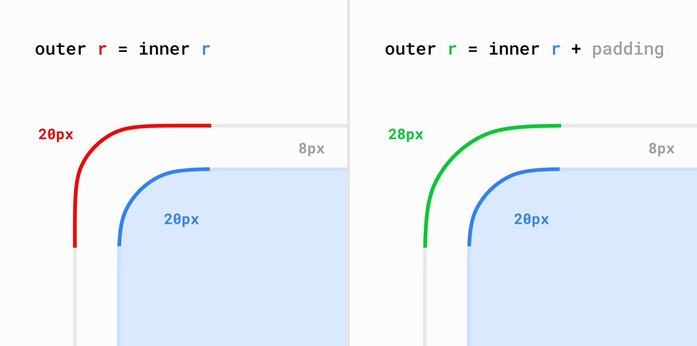
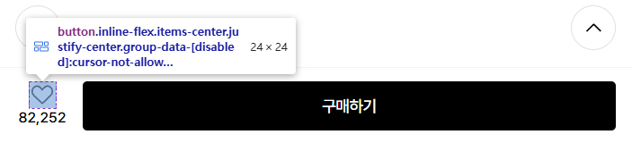
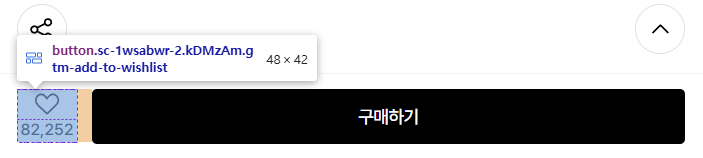

### 바깥과 안의 곡률 맞추기

### 너무 작은 폰트 지양하기

폰트 특히 한글의 경우 12px 이하의 너무 작은 폰트를 사용하게 되면 획이 뭉개지거나 글자가 뭉개져 보이는 문제가 발생할 수 있습니다.

### 버튼 크기 고려하기

아이콘 버튼을 사용할 때는 접근성을 고려하여 여유 공간을 두는 곳이 좋다

아래의 사례와 같은 경우 하트 아이콘의 영역 24x24만을 버튼 공간으로 사용하고 있다. 하트 아이콘과 좋아요 숫자를 포함한 공간을 버튼으로 만드는 것이 접근성에 좋다

