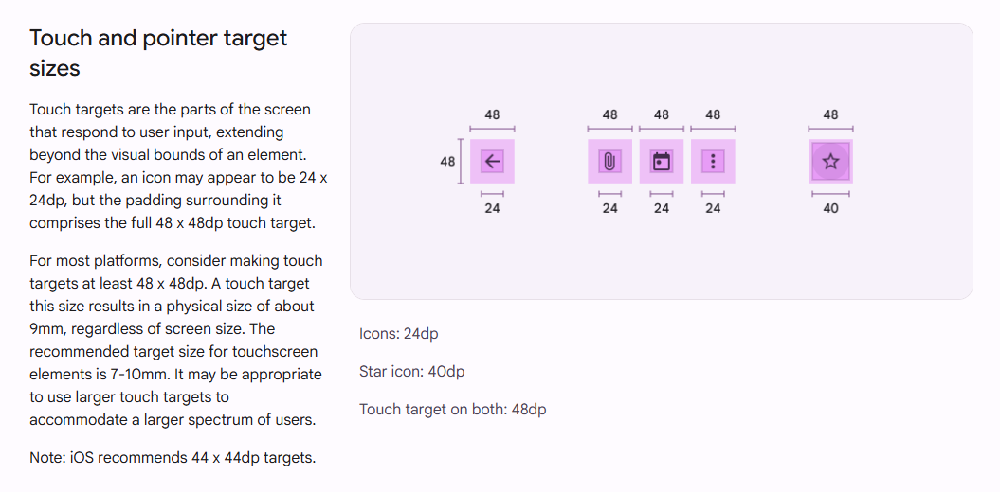
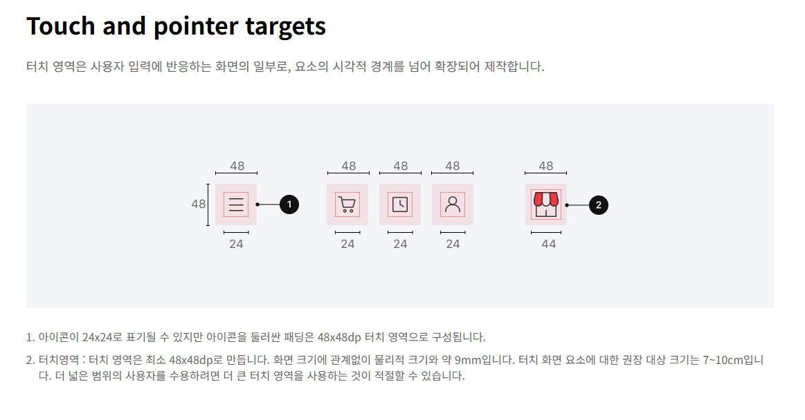

## 터치 영역이란?

터치 영역은 사용자가 버튼이나 링크 등 상호작용 가능한 요소를 터치하거나 클릭할 때 사용하는 영역을 말한다.

## 터치 영역이 중요한 이유

- **모바일 사용자의 증가**: 모바일 사용자가 증가하면서 터치를 사용하여 웹을 이용하는 사용자가 많아지고 있다.

- **고령층의 증가**: 고령층이 증가함에 따라 다양한 어려움이 있는 사용자를 위한 접근성을 고려해야 한다.

웹을 사용하는 디바이스가 다양해지면서 터치 영역은 사용자 경험에서 중요한 역할을 한다. 사용자가 버튼을 터치하거나 클릭할 때, 버튼의 크기나 간격에 따라 사용자 경험이 달라질 수 있기 때문이다. 일반적으로 PC에서 많이 사용하는 마우스 포인터와 모바일에서 주로 사용되는 손가락 터치는 여러 면에서 다른 특징을 가지고 있다.

- **마우스 포인터**:
  - **높은 정밀도**: 마우스는 작은 영역이라도 세밀하게 조작하여 클릭할 수 있다.
  - **커서 포인터**: 사용자는 화면 상의 커서 포인터를 시각적으로 계속 확인 함으로써 정확한 위치를 파악할 수 있다.
- **손가락 터치**:
  - **낮은 정밀도**: 손가락은 직접 화면을 터치하고 마우스 커서처럼 감도를 조절할 수 없기 때문에 정밀한 조작이 어렵다.
  - **낮은 가시성**: 사용자는 손가락을 사용하여 화면을 터치하므로 커서 포인터가 없어서 정확한 위치를 파악하기 어렵고, 손가락에 의해 화면이 가려지므로 사용자는 터치한 위치를 시각적으로 확인하기 어렵다.

## 터치 영역 설계 가이드라인

### 크기

손가락을 사용하는 사용자, 마우스를 사용하는 사용자, 마우스를 사용하더라도 정확하게 클릭하기 어려운 사용자 등을 고려하여 터치 영역의 크기를 충분히 크게 설계하는 것이 좋다. 일반적으로 터치 영역의 크기는 44x44px 이상으로 설정하는 것이 좋다.

권장되는 대상의 가시적 크기는 7mm - 10mm 정도이며, 이는 사용자의 평균적인 손가락 끝의 크기와 관련이 있다.

#### 해외 사례

- **Web Content Accessibility Guidelines (WCAG) 2.2**에서는 터치 영역의 크기를 44x44px 이상으로 설정, 최소 24x24px 이상으로 설정하는 것을 권장하고 있다.(<https://www.w3.org/WAI/WCAG22/Understanding/target-size-enhanced.html>)

- **Apple의 iOS Human Interface Guidelines**에서는 터치 영역의 크기를 44x44pt 이상으로 설정하는 것을 권장하고 있다.(<https://developer.apple.com/design/human-interface-guidelines/accessibility>)

- **Microsoft의 Windows UWP Guidelines**에서는 터치 영역의 크기를 7.5mm 이상으로 설정하는 것을 권장하고 있다.(<https://learn.microsoft.com/en-us/windows/apps/design/input/guidelines-for-targeting>)

- **Google의 Material Design Guidelines**에서는 터치 영역의 크기를 48x48dp 이상으로 설정하는 것을 권장하고 있다.(<https://material.io/design/usability/accessibility.html#layout-and-typography>)

#### 국내 사례

- **11번가의 디자인 가이드**에서는 구글의 Material Design과 마찬가지로 터치 영역의 크기를 48x48dp 이상으로 설정하는 것을 권장하고 있다.(<https://design.11stcorp.com/foundation/accessibility>)

- **서울시에서 발간한 고령층 친화 디지털 접근성 표준**에서는 조작 오류가 발생하지 않도록 크기와 간격을 충분하게 설정하는 것을 권장하고 있다.(<https://50plus.or.kr/detail.do?id=12800469>)

- **모바일 애플리케이션 콘텐츠 접근성 지침 2.0 (표준번호 KS X 3253)**에서는 6.5.b에서 컨트롤의 크기를 9mm*9mm 이상으로 제공하는 것을 권장하고 있다.(<http://www.kwacc.or.kr/Board/DataFile/668/Detail?page=2>)

-**한국지능정보사회진흥원 웹 접근성 실태 조사**의 검사항목 중 하나인 '조작 가능'에서는 컨트롤의 크기를 대각선 기준ㄴ 6.0mm 이상으로 제공하고 테두리 안쪽으로 1픽셀 이상의 여백을 제공할 것을 권장하고 있다.(<https://www.nia.or.kr/site/nia_kor/ex/bbs/List.do?cbIdx=99873>)

### 간격

터치 영역 사이의 간격을 충분히 확보하여 사용자가 원하는 버튼을 터치할 때 다른 버튼을 터치하는 오류를 줄이도록 설계하는 것이 좋다. 간격에 대해서는 뚜렷하게 권장되는 가이드라인이 없지만, 일반적으로 터치 영역 사이의 간격은 8px 이상으로 설정하는 것이 좋다.

요소가 충분한 크기를 가지고 있다면 붙어 있더라도 사용자가 터치할 때 다른 요소를 터치하는 오류를 줄일 수 있기 때문에 허용될 수 있다.
