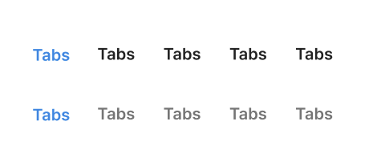
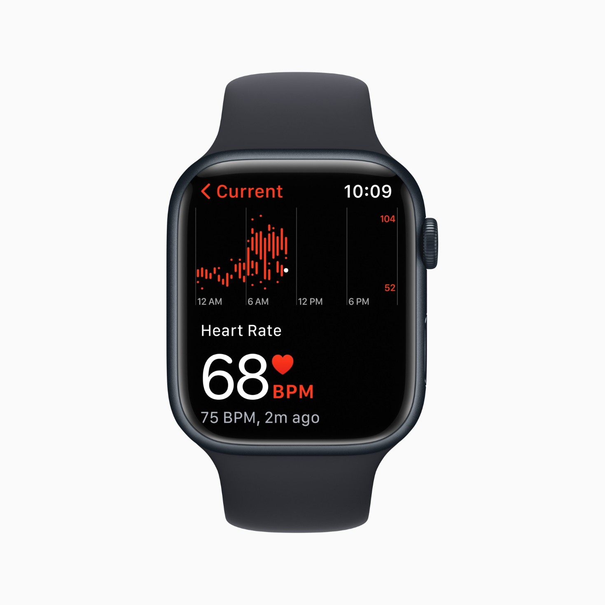
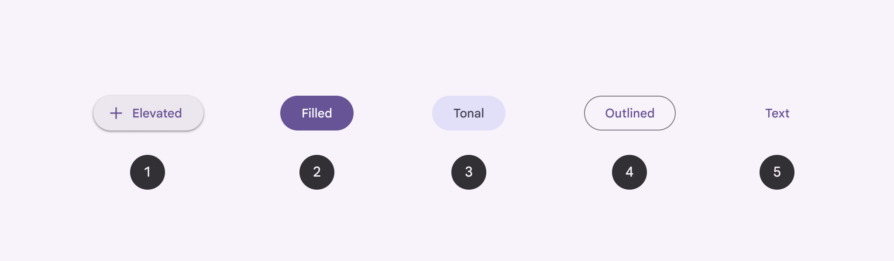

## 일단 간단하게 시작하기

새로운 프로젝트를 시작하는 디자인 초기 단계에서는 글꼴 크기나 색상, 아이콘과 같은 구체적인 결정을 내리는 데 너무 많은 시간을 들이지 않는 것이 중요합니다. 이 단계에서는 낮은 충실도의 프로토타입을 빠르게 만들어보고, 이를 통해 프로젝트의 방향성을 결정하는 것이 좋습니다. 때로는 Figma와 같은 디자인 도구도 세부적인 결정을 내리기에는 너무 무겁기 때문에, 펜과 종이로 빠르게 스케치를 그리는 것이 더 효율적일 수 있습니다.

## 모든 케이스를 처음부터 고려할 수는 없다

처음부터 디자인의 모든 케이스를 고려하는 것은 어렵습니다. 따라서 초기 단계에서는 가장 중요한 케이스에 초점을 맞추어 디자인을 진행하는 것이 좋습니다. 필요한 케이스를 배포 가능한 단위로 빠르게 만들어 코드로 구현하고, 사용자들에게 피드백을 받아 프로젝트를 개선해 나가는 것이 중요합니다.

## 매번 새로운 디자인을 하지 않는다

새로운 기능을 디자인할 때마다 글꼴 크기나 색상 등을 고민한다면 프로젝트의 통일성이 떨어지고 디자인 시간이 길어질 수 있습니다. 따라서 프로젝트의 디자인 시스템을 만들어두고, 이를 통해 디자인의 일관성을 유지하는 것이 중요합니다. 이를 통해 디자인 시간을 단축하고, 프로젝트의 품질을 높일 수 있습니다. 일반적으로 이러한 세부 사항은 디자인 시스템에서 token, foundation, theme 등의 용어로 관리합니다.

- Font: font-family, font-size, font-weight, line-height 등
- Color: primary, secondary, success, warning, danger 등
- Overlay: overlay-color, overlay-opacity 등
- Spacing: padding, margin, width, height 등
- Border: border-radius, border-width, border-color 등
- Shadow: box-shadow, text-shadow 등
- Icon: icon-size, icon-color 등
- Breakpoint: mobile, tablet, desktop 등
- Animation: duration, timing-function, delay 등
- Transition: property, duration, timing-function, delay 등

## 시각적 계층 구조를 잘 이해한다

디자인에서 **시각적 계층 구조**(Visual Hierarchy)는 사용자가 정보를 빠르게 이해하고 원하는 작업을 수행할 수 있도록 도와주는 핵심 원칙 중 하나입니다. . 시각적 계층 구조가 명확하면 사용자는 직관적으로 인터페이스를 탐색할 수 있습니다. 시각적 계층 구조가 명확하지 않거나 잘못된 경우 사용자는 혼란을 느끼고 서비를 이탈할 가능성이 높아집니다.

1. 정보의 우선순위를 정하기 - 사용자에게 어떤 정보가 더 중요한지를 파악하고, 이에 따라 시각적 계층 구조를 정의합니다.
2. 사용자의 시선 흐름을 설계하기 - 사용자가 화면을 탐색할 때 어떤 순서로 정보를 읽을지를 고려하여 시각적 계층 구조를 설계합니다.

### 시각적 계층 구조를 만드는 방법

1. **크기**
    - 중요한 요소일수록 더 크게 디자인하여 사용자의 주의를 끌 수 있습니다.
    - 예를 들어 제목 > 본문 > 부가 정보 순으로 크기를 조절합니다.
2. **색상**
    - 대조를 이용하여 중요한 요소를 강조할 수 있습니다.
    - 예를 들어 제목은 검정색, 본문은 회색, 부가 정보는 회색으로 디자인합니다.
3. **타이포그래피**
    - 폰트 굵기나 스타일을 조절하여 중요한 요소를 강조할 수 있습니다.
    - 예를 들어 제목은 Bold, 본문은 Regular, 부가 정보는 Light 굵기를 사용하여 디자인합니다.
4. **여백**
    - 요소 사이의 간격을 조절하여 시각적 계층 구조를 만들 수 있습니다. 이는 구분감을 높이거나 그룹핑을 통해 관련된 요소를 묶을 수 있습니다.
    - 예를 들어 제목과 본문 사이에 여백을 더 주어 시각적 계층 구조를 만듭니다.

## 강조를 안함으로써 강조하는 방법

특정 부분을 강조하기 위해 다른 부분의 강조를 줄이는 것이 효과적인 상황도 있습니다. 이를 통해 사용자가 더 집중할 수 있도록 도와줍니다. 예를 들어, 탭(Tabs) 컴포넌트에서 현재 선택된 탭을 강조하기 위해 문자 색상을 변경하는 것도 좋지만, 선택되지 않은 탭의 문자 색상을 더 연한 색상으로 표현함으로써 사용자가 더 집중할 수 있도록 도와줄 수 있습니다.

## 레이블이 항상 필요한 것은 아니다

레이블은 사용자가 인터페이스를 이해하고 사용할 수 있도록 도와주는 중요한 요소입니다. 하지만 레이블이 모든 것을 설명하지 않아도 되는 경우도 있습니다.

주의해야 할 점은 레이블을 생략할 때에는 사용자가 정보를 이해할 수 있는지를 항상 고려해야 합니다. 시각적으로 생략하더라도 접근성을 위해 스크린 리더 사용자가 정보를 이해할 수 있도록 대체 텍스트를 제공해야 합니다.

- 단어 자체가 이미 익숙한 경우에는 레이블을 생략할 수 있습니다. 예를 들어 직업 정보를 보여주는 경우 "직업"이라는 레이블을 붙이지 않아도 "개발자", "디자이너" 등의 단어만으로도 충분히 이해할 수 있습니다.
- 예를 들어 가격이라면 가격 단위 기호(￦, $, €)를 표시하고, 가격이 0원인 경우에는 "무료"라고 표시하여 가격에 대한 정보를 전달할 수 있습니다.
- 예를 들어 전화번호라면 전화번호 형식(010-1234-5678)을 표시하여 전화번호에 대한 정보를 전달할 수 있습니다.
- 아이콘을 사용하여 사용자가 빠르게 정보를 이해할 수 있도록 도와줄 수 있습니다. 예를 들어 검색 아이콘을 사용하여 검색 기능을 나타낼 수 있습니다.

## 레이블보다 정보가 더 중요하다

레이블은 해당 정보가 어떤 의미를 가지는지를 설명하는 중요한 요소이지만, 가장 중요한 것은 정보 자체입니다. 예를 들어 심박 수를 보여주는 시계 앱에서 심박 수를 숫자로 표시하는 것이 중요하며, 이를 설명하는 레이블은 보조적인 역할을 합니다. 따라서 레이블은 정보를 이해하는 데 도움을 주는 보조적인 역할을 하며, 정보 자체가 레이블보다 더 강조되어야 합니다.

하지만 레이블이 없으면 사용자가 정보를 이해하는 데 어려움을 겪을 수 있으므로, 정보를 이해하는 데 필요한 최소한의 레이블을 제공하는 것이 중요합니다. 여러 정보가 함께 표시되는 경우에는 정보 간의 관계를 이해할 수 있도록 레이블을 제공하는 것이 더 좋을 수 있습니다.

## 제목이 항상 큰 순서는 아니다

예를 들어 `h1`, `h2`, `h3` 등의 제목을 사용할 때, 항상 `h1`이 시각적으로 가장 큰 제목이어야 하는 것은 아닙니다. 디자인의 시각적 계층 구조에 따라 `h2`가 `h1`보다 큰 경우도 있을 수 있습니다. 따라서 제목의 크기는 디자인의 시각적 계층 구조에 따라 조절하는 것이 중요하고, 문서의 계층 구조에 따라 `h1`부터 `h6`까지 순서대로 사용하는 것이 좋습니다.

## 아이콘이 너무 강조되는 것을 조심한다

아이콘은 사용자가 정보를 빠르게 이해하고 쉽게 탐색할 수 있도록 도와주는 중요한 요소입니다. 하지만 아이콘이 너무 강조되면 사용자가 다른 중요한 정보를 놓칠 수 있습니다. 예를 들어 흰 바탕에서 검정색(#000)을 사용하거나 너무 큰 크기의 아이콘을 사용하면 사용자가 아이콘에 너무 많은 주의를 기울일 수 있습니다. 아이콘의 색상이나 굵기, 크기를 조절하여 강조를 적절히 조절하는 것이 중요합니다.

## 계층 구조 기반의 버튼 스타일

시맨틱 컬러 대신 계층 구조를 반영한 버튼 스타일의 예시(material design 3)

- 색상에 의존하지 않는 버튼 -> 접근성 향상
- 시각적으로 가장 눈에 띄는 버튼이 가장 중요한 버튼 -> 직관적

## 필요한 만큼만 공간을 사용하기

현대에 가장 일반적인 모니터는 16:9 와이드 비율의 모니터입니다. 가로로 넓은 화면은 많은 컨텐츠를 보여주기에는 좋지만 한 눈에 들어오지 않으므로 사용자가 정보를 찾기 어려울 수 있습니다. 많은 사이트들이 960px, 1200px 등의 고정된 너비를 사용하여 가운데 정렬을 하고, 좌우 여백을 두어 사용자가 정보를 빠르게 찾을 수 있도록 도와줍니다.

## 팀에서 텍스트 스케일의 필요성

팀에서 텍스트 스케일을 정의하여 사용하면 여러 가지의 장점이 있습니다. 텍스트 스케일이란 텍스트의 크기, 라인 높이, 폰트 굵기 등을 일관되게 사용하는 것을 말합니다. 예를 들어 제목은 24px, 본문은 16px, 부가 정보는 14px로 텍스트 스케일을 정의하고, 이를 모든 디자이너와 개발자가 일관되게 사용할 수 있습니다

1. **일관성 유지**  
    팀 내 모든 디자이너와 개발자가 동일한 텍스트 스케일을 사용하면 각 요소의 크기, 계층 구조, 그리고 시각적 균형이 통일됩니다. 이는 사용자 경험을 향상시키고, 애플리케이션 내에서 혼란을 줄입니다.

2. **효율적인 협업**  
    사전에 정의된 텍스트 스케일을 사용하면 디자인과 개발의 커뮤니케이션이 원활해집니다. 디자인 시스템 내의 규칙을 따르기 때문에 새로운 요소를 추가하거나 업데이트할 때 팀원이 쉽게 이해하고 적용할 수 있습니다.

3. **접근성과 반응형 디자인**  
    텍스트 크기와 스케일이 일관되면 다양한 디바이스와 스크린 크기에 맞춰 조정하기가 용이해집니다. 또한, 접근성 기준을 충족하는데 도움이 되어, 모든 사용자에게 최적화된 인터페이스를 제공할 수 있습니다.

4. **유지보수 및 확장성**  
    텍스트 스케일 규칙이 문서화되어 있으면 디자인 시스템과 코드 베이스를 장기적으로 관리하기 쉽습니다. 새로운 기능이나 페이지를 추가할 때 기존 규칙을 기반으로 확장하면, 전체 시스템의 일관성을 유지할 수 있습니다.

## 좋은 폰트를 선택하는 방법

프로젝트에 적합한 폰트를 선택하는 것은 사용자 경험을 결정하는 중요한 요소 중 하나입니다. 폰트는 사용자가 정보를 읽고 이해하는 데 큰 영향을 미치며, 디자인의 전반적인 느낌을 결정합니다. 따라서 프로젝트의 목적과 컨셉에 맞는 폰트를 선택하는 것이 중요합니다.

1. **프로젝트 목적에 맞는 폰트 선택**  
    프로젝트의 목적과 컨셉에 맞는 폰트를 선택하는 것이 중요합니다. 예를 들어 공식적인 문서를 작성하는 경우에는 세리프(Serif) 폰트를 사용하고, 현대적이고 간결한 느낌을 주고 싶은 경우에는 산세리프(Sans-serif) 폰트를 사용하는 것이 좋습니다.

2. **텍스트 용도에 맞는 폰트 선택**
    텍스트의 용도에 따라 폰트를 선택하는 것이 중요합니다. 예를 들어 제목을 위한 글꼴은 일반적으로 글자 크기가 크고 글자 간격과 행간은 좁은 글꼴을 선택하는 것이 좋습니다. 반면 본문을 위한 글꼴은 글자 크기가 작고 글자 간격과 행간이 넓은 글꼴을 선택하는 것이 좋습니다.

3. **가독성 고려**  
    폰트의 가독성은 사용자가 정보를 읽고 이해하는 데 중요한 요소입니다. 따라서 가독성이 높은 폰트를 선택하는 것이 중요합니다. 가독성이 높은 폰트는 글자 간의 간격이 적절하고, 글자의 형태가 명확하며, 글자의 두께와 굵기가 일관되어야 합니다. 특히 작은 크기의 텍스트에서 한글의 가독성을 고려하여 폰트를 선택하는 것이 중요합니다.

4. **인기도와 안정성**  
    인기 있는 폰트는 다양한 디바이스와 브라우저에서 일관된 모습으로 표시되므로 안정성이 높습니다. 또한 인기 있는 폰트는 다양한 언어와 문자를 지원하므로 다국어 웹사이트를 만들 때 유용합니다. Google Fonts, Adobe Fonts, 눈누 등의 웹폰트 서비스를 활용하여 인기 있는 폰트를 찾고 사용할 수 있습니다.

## 단락이 옆으로 넓게 펼쳐지는 것을 피한다

단락이 옆으로 넓게 펼쳐지는 것은 옆으로 글을 읽는 언어권에서 사용자가 글을 읽기 어렵게 만듭니다. 권장되는 글의 너비는 50자에서 75자 정도입니다.

## 여러 텍스트를 baseline으로 배치

여러 텍스트를 baseline으로 배치하면 텍스트 간의 일관성을 유지하고, 시각적으로 균형을 맞출 수 있습니다. baseline은 텍스트의 기준이 되는 선으로 보이지는 않지만 시각적으로 균형을 맞추는 데 중요한 역할을 합니다.

## line-height 고려 사항

행간, 줄 높이(line-height), 리딩(leading)은 글자 간의 위아래 간격을 결정하는 요소입니다. 적절한 줄 높이는 글을 편안하게 읽을 수 있도록 만들고, 정보 전달을 원활하게 할 수 있습니다

일반적인 줄 높이

- 기본: 일반적으로 1.5를 기준으로 하는 경우가 많습니다
- 글자 크기: 글자 크기에 따라 줄 높이를 조절하는 것이 좋습니다. 글자 크기가 큰 제목에서는 줄 높이를 크게 하지 않아도 글을 읽는 데 어려움이 없지만, 글자 크기가 작을 때는 줄 높이를 크게 하여 구분감을 높이는 것이 좋습니다.
- 본문 너비: 글을 담고 있는 본문의 너비에 따라 줄 높이를 조절하는 것이 좋습니다. 본문의 너비가 넓을 경우 줄 높이를 크게 하여 글을 읽는 데 편안함을 줄 수 있습니다.

## letter-spacing 고려 사항

자가느 글자 간격(letter-spacing)은 글자 사이의 간격을 조절하는 요소입니다. 적절한 글자 간격은 글자를 읽는 데 편안함을 줄 수 있으며, 글자 간의 구분을 높일 수 있습니다.

본문용으로 디자인된 폰트는 일반적으로 글자 간격이 넓게 디자인되어 있습니다. 이를 제목에 사용할 때는 글자 간격을 좁게 조절하여 제목을 강조할 수 있습니다.

## 숫자 텍스트를 오른쪽 정렬

숫자 텍스트는 오른쪽 정렬하는 것이 일반적입니다. 오른쪽 정렬은 숫자의 크기를 비교하기 쉽게 만들어주며, 텍스트의 끝을 일직선으로 만들어 시각적으로 균형을 맞출 수 있습니다.

## Hex 코드의 더 나은 대안

컬러 정의에서 hex 코드는 가장 일반적인 방법 중 하나입니다. 예를 들어 `#FF0000`은 빨간색을 나타내는 코드입니다. 이러한 방식은 7개의 문자열을 사용하는 간결한 방식이지만 시각적으로 비슷한 색상도 코드로는 전혀 다르게 표현되어 예상하기 어렵고 변형을 만들기 어렵다는 한계점이 있습니다.

hex 코드의 더 나은 대안으로 HSL(Hue, Saturation, Lightness)은 색상을 표현하는 데 더 직관적인 방법입니다. HSL은 색상, 채도, 명도를 각각 0~360, 0~100%, 0~100%의 값으로 표현합니다. 예를 들어 빨간색은 `hsl(0, 100%, 50%)`로 표현할 수 있습니다. 여기서 더 밝은 빨간색을 만들고 싶다면 명도를 높이면 되므로 `hsl(0, 100%, 70%)`과 같이 쉽게 조절할 수 있습니다. 더 진한 빨간색을 만들고 싶다면 채도를 높이면 되므로 `hsl(0, 100%, 30%)`과 같이 쉽게 조절할 수 있습니다. HSLA는 HSL에 알파값(투명도)을 추가한 것으로, 투명도를 조절할 수 있습니다.

<Info>
HSL에서 너무 높은 밝기나 낮은 밝기에서 색상을 사용할 때는 채도의 영향이 감소하므로 중간 밝기일 때보다 채도를 높여야 시각적으로 비슷한 색상을 만들 수 있습니다.
</Info>

- 장점:
  - 직관적: 색상, 채도, 명도를 각각의 값으로 표현하기 때문에 색상을 직관적으로 조절할 수 있습니다.
  - 변형: 색상을 쉽게 변형할 수 있습니다. 예를 들어 더 밝은 색상이나 더 어두운 색상을 만들 수 있습니다.
  - 보완색 찾기: 색상환에서 보완색을 찾기 쉽습니다. 보완색은 색상환에서 반대편에 있는 색상을 말하며, 보완색을 함께 사용하면 색상을 더 동적으로 표현할 수 있습니다.

CSS Color Module Level 4에서는 새로운 색상 함수로 `color()`를 제안하고 있습니다. `color()` 함수는 HSL, RGB, HWB, Lab, LCH, Gray 등 다양한 색상 모델을 지원하며, 색상을 더 다양하게 표현할 수 있습니다. 이중에서 lch() 함수는 CIE LCH 색상 모델을 사용하여 색상을 표현하는데, 색상, 채도, 명도를 각각의 값으로 표현하여 색상을 더 직관적으로 조절할 수 있습니다. 사용법은 `color(lch(70% 50 180))`와 같이 색상, 채도, 명도를 각각의 값으로 표현합니다.

## 일반적인 의미론적 컬러

- `neutral`: 중립적인 컬러로 사용되는 주요 컬러입니다. 중립적인 컬러는 배경이나 그림자, 테두리, 글자 등 중립적인 요소에 사용됩니다. 일반적으로 회색(Gray)
- `brand, primary`: 브랜드 컬러로 사용되는 주요 컬러입니다. 브랜드 컬러는 브랜드의 아이덴티티를 나타내는 중요한 요소이며, 브랜드 컬러를 사용하여 사용자가 브랜드를 쉽게 인식할 수 있도록 도와줍니다. 일반적으로 블루(Blue), 레드(Red), 그린(Green), 옐로우(Yellow) 등
- `accent`: 강조를 나타내는 컬러입니다. 강조 컬러는 사용자의 주의를 끌거나 중요한 요소를 강조하는 데 사용되며, 사용자가 주목할 수 있도록 도와줍니다. 일반적으로 오렌지(Orange), 핑크(Pink), 퍼플(Purple) 등
- `info`: 정보를 나타내는 컬러입니다. 정보 컬러는 사용자에게 정보를 제공하거나 안내하는 데 사용되며, 사용자가 정보를 빠르게 인식할 수 있도록 도와줍니다. 일반적으로 블루(Blue)
- `success`: 성공을 나타내는 컬러입니다. 성공 컬러는 사용자가 성공적으로 작업을 수행했을 때 사용되며, 사용자에게 긍정적인 메시지를 전달하는 데 사용됩니다. 일반적으로 그린(Green)
- `warning`: 경고를 나타내는 컬러입니다. 경고 컬러는 사용자에게 주의를 요하는 메시지를 전달하는 데 사용되며, 사용자가 주의를 기울이도록 도와줍니다. 일반적으로 옐로우(Yellow)
- `danger`: 위험을 나타내는 컬러입니다. 위험 컬러는 사용자에게 위험을 알리는 메시지를 전달하는 데 사용되며, 사용자가 조심하도록 도와줍니다. 일반적으로 레드(Red)

## 같은 밝기에서 색상에 따른 밝기 차이

색상에 따라 밝기 차이가 있습니다. 같은 밝기에서 색상에 따라 밝기 차이가 있으며, 이를 고려하여 색상을 조합하는 것이 중요합니다. 예를 들어 노란색은 밝기가 높고, 파란색은 밝기가 낮습니다. 따라서 노란색과 파란색을 같은 밝기에서 조합하면 노란색이 파란색보다 밝아 보일 수 있습니다.

- 밝기가 밝은 색상들: 노란색, 하늘색, 초록색
- 밝기가 어두운 색상들: 파란색, 보라색, 빨간색

이러한 밝기 차이를 고려하면 밝기를 조절하는 대신 색조를 조절하여 밝기를 조절한 듯한 효과를 줄 수 있습니다. 예를 들어 노란색에서 밝기를 낮추는 대신 색조를 조절하여 노란색을 주황색으로 변형하면 밝기를 조절한 듯한 효과를 줄 수 있습니다.

## 시맨틱 컬러는 부가적인 정보이다

시맨틱 컬러는 색상을 통해 정보의 의미를 전달하는 데 도움을 주지만 색상에만 의존해서는 안됩니다. 색상을 구분하기 어려운 사용자나 볼 수 없는 사용자를 위해 시각적인 표현 외에도 다른 방법으로 정보를 전달해야 합니다. 예를 들어 아이콘, 텍스트, 레이블 등을 함께 사용하여 정보를 전달하는 것이 좋습니다.
