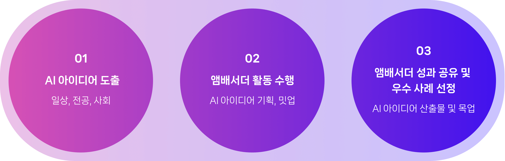

# 접근성

소유자: dongheon

<aside>
✅ 적절한 html 엘리먼트를 사용하세요. 브라우저에는 엘리먼트에 알맞는 접근성이 내장되어 있습니


</aside>

[접근성 – React](https://ko.legacy.reactjs.org/docs/accessibility.html)


## 점진적 향상

탐색이나 검색과 같이 기본적인 기능은 자바스크립트를 활성화하지 않아도 작동해야 합니다


## 키보드 접근성

대화형(상호작용 가능한) 요소는 키보드로 접근(focus)할 수 있어야 한다

[Tab]: 다음 항목으로 이동

[Shift + Tab]: 이전 항목으로 이동


## 탭 순서

읽기 순서에 맞게 탭 순서를 지정해야 한다.

일반적으로는 html의 작성 방법에 의해 정해지며 css를 사용하여 변경할 수도 있다


## 탭 인덱스(tabindex)

0: 키보드로 탐색이 가능하고 html 문서의 순서에 따라 탐색 (대화형 컨텐츠 기본값)

-1: 키보드로는 탐색할 수 없지만 시각적으로(마우스) 포커스는 가능 (비 대화형 컨텐츠 기본값)

1: 키보드로 탐색이 가능하며 인덱스 값에 따라 순서를 지정


## 포커스 링

포커스를 가질 수 있는 요소가 포커스 상태인 경우, 기본적으로 주위에 윤곽선이 표시됩니다.

미관 상 좋지 않아 이 윤곽선을 숨기고 싶을 수 있습니다. 이 때에는 최소한 키보드 탐색 사용자에게는 표시되어야 합니다

[:focus-visible - CSS: Cascading Style Sheets | MDN](https://developer.mozilla.org/en-US/docs/Web/CSS/:focus-visible#focus_vs_focus-visible)


## 의미있는 요소 사용

의미있는 html 태그를 사용하면 스크린 리더 사용자들은 이를 이해할 수 있습니다.

- 제목: `<h1>` ~ `<h6>`
- 단락: `<p>`
- 영역: `<header>`, `<nav>`, `<footer>`, `<section>`, `<article>`, `<main>` …

커스텀 요소를 만들고 싶은 경우 아래의 wai의 패턴을 참고하세요

[Patterns](https://www.w3.org/WAI/ARIA/apg/patterns/)


## 중요한 정보는 텍스트로 제공

✅html 즉 마크업으로 제공. 스크린 리더기가 읽을 수 있고 브라우저의 번역 기능이 동작 할 수 있어야 한다

❌이미지 또는 아이콘만 사용 X


## 제목 태그 사용

h1 태그는 웹사이트 제목이 아닌 페이지를 설명하는 제목을 사용하세요

h1부터 h2, h3 순서대로 사용하세요


## 적절한 input 사용

값을 입력받기 위해 적절한 input을 사용하세요. 모바일 기기에서는 input마다 위젯이 달라지므로 특히 중요합니다


## 색상 대비

최소한의 색상 대비: WCAG AA(모바일의 경우 AAA)

텍스트를 읽기 쉽게 만들기 위해 4.5 : 1 이상의 색상 대비를 유지하세요

[Web Content Accessibility Guidelines (WCAG)  2.0](https://www.w3.org/TR/WCAG20/#visual-audio-contrast-contrast)


## aria-live

초점 이동하지 않고도 스크린 리더 사용자에게  지속적으로 알림을 보낼 수 있다


## rems

작은 글씨를 읽기 어려운 사람들을 위해 폰트 크기에 상대 단위를 사용.

사용자 폰트 크기를 스스로 변경할 수 있도록 한다


## 화면 리더기 테스트

2개 이상의 화면 리더기를 사용하여 테스트


## 아이콘 접근성 향상

- 화면에는 보이지 않지만 스크린 리더기에서는 읽을 수 있는 텍스트로 라벨 명시

```html
<button type="submit">
 <i class="fas fa-search" aria-hidden="true"></i>
 <span class="visually-hidden">Search</span>
</button>
```

- 툴팁을 사용하여 마우스를 올리면 라벨을 표시
- 버튼의 라벨은 명사보다는 동사를 사용


## 소셜 로그인 접근성

소셜 로그인이 여러 개일 때 “마지막으로 로그인한 방식”을 표시→ 보안에 영향이 없으므로 로컬 스토리지에 넣어도 충분


## 표 이미지 접근성

alt 속성으로 제공하기 어려운 표 이미지에 대해서 숨겨진 마크업으로 정보 제공



```html
<div class="growth_program_box motion mo_hide on">
  
  <ul class="blind">
    <li>
      <em>01</em><strong>AI 아이디어 도출</strong>
      <p>일상, 전공, 사회</p>
    </li>
    <li>
      <em>02</em><strong>앰배서더 활동 수행</strong>
      <p>AI 아이디어 기획, 밋업</p>
    </li>
    <li>
      <em>03</em><strong>앰배서더 성과 공유 및 우수 사례 선정</strong>
      <p>AI 아이디어 산출물 및 목업</p>
    </li>
  </ul>
</div>
```
