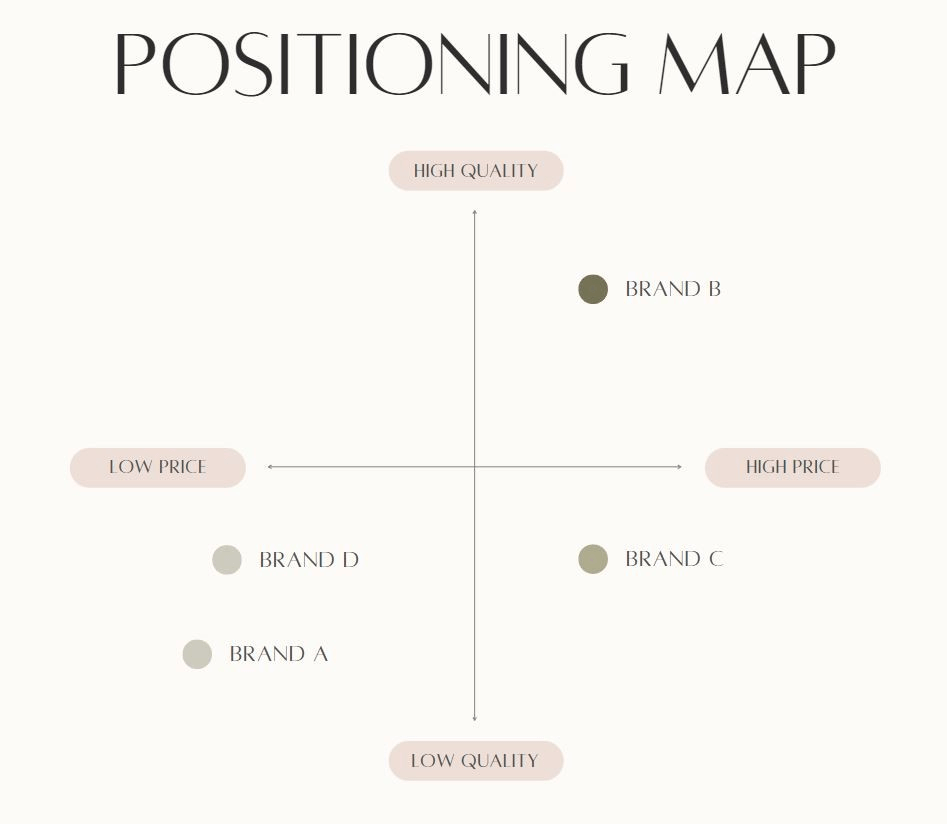
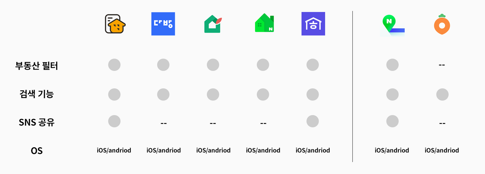

## 1. 비니니스 목표 찾기

1. 이해 관계자 인터뷰
2. 데스크 리서치

## 2. 시장 분석

### 포지셔닝 맵

시장에서 제품들의 위치를 시각적으로 표시,비교

### 경쟁 분석 표

제품들의 피처 수준이나 유무를 표로 비교

## 3. 사용자 니즈 파악

### 사용자 리서치

- 정성적 리서치: 사용자의 생각과 감정에 초점
  - 사용자 관찰, 심층 인터뷰, 포커스 그룹 인터뷰, 맥락 관찰, 오즈의 마법사
- 정량적 리서치: 측정 가능한 수치 및 데이터를 바탕으로 사용자 행동 분석
  - 데이터 자동 수집

### ux 리서치

TODO: UX 리서치에 대한 내용 추가

## 재무적 비즈니스 목표

**1. 수익성:** 회사가 외부 투자자에게 의존하는 경우 수익성에 초점을 맞춘 비즈니스 목표가 중요합니다. 수익성을 달성하고 유지하는 것은 장기적인 성공으로 이어지기 때문에 회사의 전체적인 미션 달성을 목표로 나아갈 수 있습니다.

**2. 매출:** 매출에 초점을 맞춘 비즈니스 목표를 통해 수익과 비용을 균형 있게 조정하여 비즈니스를 유지할 수 있습니다. 특정 연간 매출 목표를 달성하거나 일정 기간 동안 매출을 일정 비율로 높이기 위해 비즈니스 목표를 설정할 수 있습니다.

**3. 비용:** 비용은 비즈니스에 지출하는 돈을 의미합니다. 비용을 절감하는 것은 수익을 높이고 수익성을 달성하는 것에 유용할 수 있습니다. 비용과 관련된 비즈니스 목표를 통해 생산비 또는 운영비를 관리하여 비즈니스의 재무 성과를 개선할 수 있습니다.

**4. 현금 흐름:** 현금 흐름은 비즈니스에 들어오고 나가는 돈을 의미합니다. 현금 흐름은 지출보다 수익이 높은 경우처럼 플러스일 수도 있고, 수익보다 지출이 높은 경우처럼 마이너스일 수도 있습니다. 수익성과 마찬가지로 현금 흐름 지향적 비즈니스 목표는 장기간에 걸쳐 재무상의 성공을 지향하는 경우에 도움이 됩니다.

**5. 지속 가능한 성장:** 비즈니스로서 성장하기 위해서는 지속 가능한 방식으로 성장하는 것이 중요합니다. 지속 가능한 성장을 중심으로 비즈니스 목표를 설정하면 재무 예측, 인건비 및 기타 재무적 고려 사항을 계획하는 데 도움이 될 수 있습니다.

## 고객 중심 비즈니스 목표

**6. 경쟁력 있는 포지셔닝:** 비즈니스 전략의 큰 요소는 자사의 제품 또는 서비스가 동일한 업계의 제품 또는 서비스와 어떻게 비교되는지를 고려하는 것입니다. 경쟁력 있는 포지셔닝에 초점을 맞춘 비즈니스 목표를 설정함으로써, 자사 제품 또는 서비스를 업계의 기대치까지 끌어올리거나 경쟁력 높은 포지셔닝을 이용하여 주요 영역에서 경쟁사보다 앞서가는 결과를 낼 수 있습니다.

**7. 시장 점유율:** 이 비즈니스 목표는 제품 또는 서비스가 차지하는 시장 점유율을 의미합니다. 시장 점유율이 클수록 비즈니스의 도달률 또한 커집니다. 이러한 유형의 비즈니스 목표를 설정하는 것은 업계에서 입지를 강화하려는 경우에 유용합니다. 이는 소셜 미디어 이니셔티브, 공동 광고 캠페인, 브랜드 추적 및 성과를 통해 실시할 수 있습니다.

**8. 고객 만족도:** 비즈니스로서 성공하기 위해서는 고객을 만족시켜야 합니다. 고객 만족도 기반의 비즈니스 목표에 초점을 맞추면 고객에게 더 나은 서비스를 제공할 수 있습니다. 비즈니스 목표에 따라 고객 지지 프로그램, 더 나은 지원 센터, 유사한 고객 응대 업무에 초점을 맞출 수 있습니다.

**9. 브랜드 인지도:** 브랜드는 조직을 경쟁사와 차별화될 수 있게 해줍니다. 브랜드 인지도는 고객이 자사의 브랜드를 어떻게 생각하는지, 경쟁사의 브랜드와 비교하여 고객이 자사 브랜드를 어떻게 인지하고 있는지를 파악하는 중요한 수단입니다. 브랜드 인지도를 파악하고 높이는 것은 장기적인 마케팅 전략의 핵심적인 부분입니다.

**10. 영업:** 영업 사이클을 개선하거나 정교화하기 위한 비즈니스 목표를 쉽게 찾을 수 있습니다. 여기에는 CAC(고객 획득 비용) 절감, 잠재 고객 추적 개선, 교차 판매 증가 등 여러 사항이 포함될 수 있습니다.

**11. 이탈:** 비즈니스에서 이탈률은 일정 기간 동안 잃은 고객의 수를 의미합니다. 고객의 이탈을 줄이는 것은 매출을 늘리고 고객들이 만족할 수 있는 제품이나 서비스를 제공하기 위한 훌륭한 방법입니다.

## 사내 비즈니스 목표

**12. 직원 만족도 및 참여:** 비즈니스 중 일부는 직원이 직장에서 근무하는 것에 대해 느끼는 감정에 관한 것입니다. 직원 만족도와 참여를 높이는 것은 직원들의 행복도 향상, 번아웃 증상 감소, 팀 효율성 증가로 이어집니다.

**13. 직원 리텐션:** 사내의 주요 비즈니스 목표 중 하나는 직원들이 오랫동안 회사에서 근무하도록 하는 것입니다. 직원들의 근무 기간을 늘리고 이직률을 낮춘다면 풍부한 지식을 갖춘 직원과 함께 보다 복잡한 프로젝트를 달성할 수 있습니다.

**14. 회사 성장:** 비즈니스를 성장시키기 위해서는 채용 인원을 늘려야 합니다. 하지만 회사를 지속적으로 성장시키는 것은 쉬운 일이 아닙니다. 따라서 기업은 종종 회사 성장을 주요 비즈니스 목표로 삼습니다.

**15. 조직 문화: 조직 문화**는 이상적이고 가치적이며 팀원들이 회사 내에서 교류하는 방식을 형성하는 그룹 규범입니다. 좋은 문화를 조성하면 직원들의 참여를 도모하고 인재를 유지하는 비율이 높아집니다. 따라서 이는 많은 회사들이 조직 문화에 초점을 맞춘 비즈니스 목표를 설정하는 주요한 이유 중 하나입니다.

**16. 변경 관리:** 변경 관리를 통해 대규모의 변경을 조직에 원활히 도입할 수 있습니다. 일반적으로 이러한 유형의 비즈니스 목표를 해마다 설정하는 조직은 드물지만, 새롭게 시작되는 대규모의 변경을 계획하는 경우에는 목표를 설정하는 것이 유용할 수 있습니다.

**17. 생산성:** 직원 생산성을 높이면 팀은 영향력이 높은 업무를 보다 효율적으로 수행할 수 있습니다.

**18. 직원 유효성:** 팀은 효율성을 갖출 뿐만 아니라 올바르게 업무를 수행하는 법을 알아야 합니다. 훌륭한 회사는 효율성과 유효성을 모두 목표로 하며, 여기서 유효성 기반의 비즈니스 목표는 중요한 역할을 합니다. 자세한 내용을 위해 효율성과 유효성의 차이에 대한 기사를 참조해 주세요.

**19. 다양성 및 포용성:** 직원들이 회사 문화를 편안하게 느낄 수 있는 가장 큰 이유 중 하나는 그들이 회사에 대한 소속감을 느낄 수 있기 때문입니다. 다양성 및 포용성의 프로그램에 투자하는 것은 회사를 현재의 직원들과 향후 채용될 직원들에게 있어서 기분이 좋은 장소로 만드는 데 도움이 됩니다.

## 규정과 관련된 비즈니스 목표

**20. 품질 관리:** 품질 관리 관련 조치를 비즈니스 목표로 구현하면 자사의 제품이나 서비스의 품질이 원하는 수준에 도달하도록 보장할 수 있습니다. 이는 고객 관계 개선과 전반적인 매출 증가로 이어집니다.

**21. 규정 준수:** 규정 준수 요건을 가까운 장래에 충족햐야 하는 경우에는 그러한 규정 준수 요건을 비즈니스 목표로 설정하면 예정대로 목표를 달성할 수 있습니다.

**22. 지속 가능성 또는 낭비 줄이기:** 기업에 따라서 낭비를 줄이거나 지속 가능성을 높이는 것을 비즈니스 목표로 하는 경우가 있습니다. 이것이 비즈니스에 직접적인 영향을 미치지는 않지만, 환경에 대한 관심을 보여주는 것은 목표로 하는 특정 오디언스에게 다가가는 데 도움이 될 수 있습니다.
