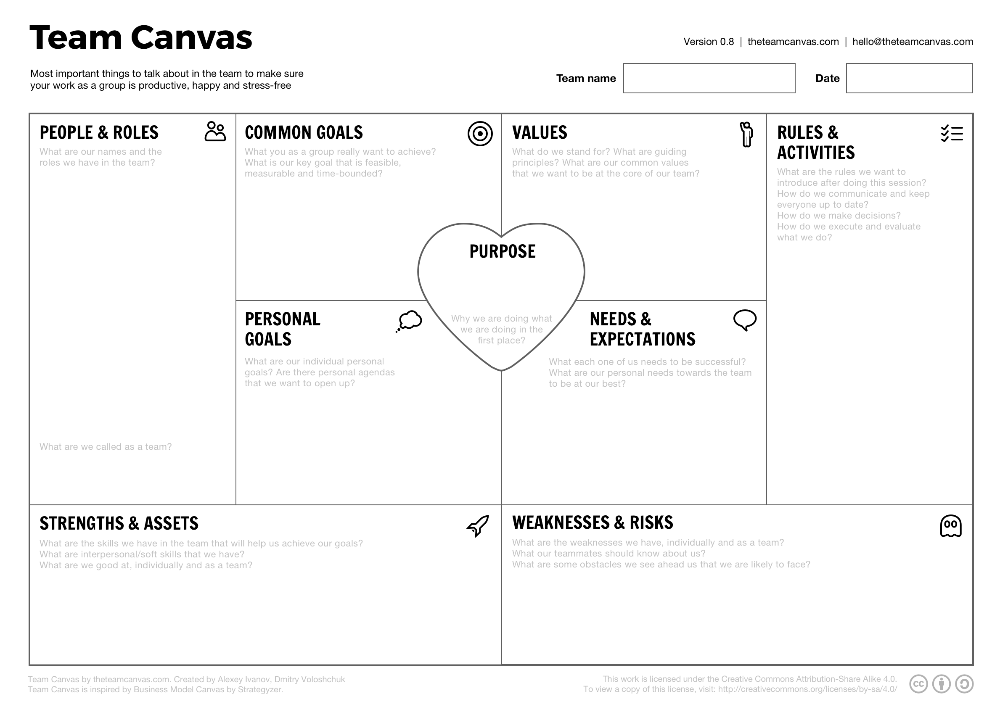

## 팀 캔버스란

팀 캔버스(Team Canvas)는 팀의 목표와 방향성을 정의하고, 팀원 간의 역할과 책임을 명확히 하는 도구입니다. 팀 캔버스는 팀원 간의 소통을 원활하게 하고, 팀의 성과를 높이기 위해 사용됩니다.

## 팀 캔버스 요소

1. 자기소개와 역할
2. 공동 목표
3. 개인 목표
4. 프로젝트 목적
5. 추구할 핵심 가치
6. 강점과 스킬셋
7. 약점과 위험
8. 필요와 기대
9. 규칙과 활동

