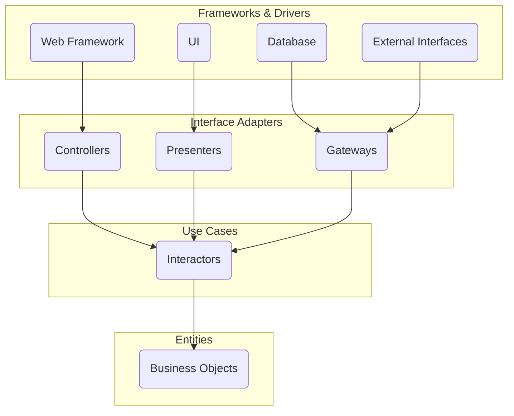

## 소프트웨어 아키텍처의 목표

좋은 소프트웨어 아키텍처는 다음과 같은 목표를 추구합니다.

1. **🧩관심사의 분리 (Separation of Concerns):** 시스템을 서로 다른 책임과 역할을 가진 독립적인 구성 요소로 나눕니다. 이를 통해 각 부분의 복잡성을 줄이고 이해도를 높입니다.
2. **🔗의존성 관리 (Dependency Management):** 구성 요소 간의 의존성을 명확하게 정의하고 제어합니다. 불필요하거나 잘못된 방향의 의존성은 시스템의 유연성을 저해하고 변경을 어렵게 만듭니다.
3. **🧪테스트 용이성 (Testability):** 시스템의 각 부분을 격리하여 독립적으로 테스트할 수 있도록 합니다. 이는 버그를 조기에 발견하고 수정하는 데 필수적입니다.
4. **🛠️유지보수성 (Maintainability):** 요구사항 변경이나 기능 추가 시 코드 수정이 용이하고, 변경의 영향 범위를 최소화할 수 있도록 합니다.
5. **🌀유연성 및 확장성 (Flexibility & Scalability):** 새로운 기능을 추가하거나 기존 기능을 변경하기 쉽고, 시스템의 규모가 커짐에 따라 성능과 구조를 효과적으로 확장할 수 있도록 합니다.
6. **🛡️기술 독립성 (Technology Independence):** 특정 프레임워크, 데이터베이스, UI 기술 등 외부 요소에 대한 의존성을 최소화하여 기술 변화에 유연하게 대처할 수 있도록 합니다.

클린 아키텍처는 이러한 목표들을 체계적으로 달성하기 위한 구체적인 구조와 규칙을 제안합니다.


## 클린 아키텍처의 핵심 원칙: 의존성 규칙 (The Dependency Rule)

클린 아키텍처의 가장 핵심적인 원칙은 **의존성 규칙**입니다. 이 규칙은 **"소스 코드 의존성은 오직 안쪽으로, 고수준 정책을 향해야 한다"**는 것입니다. 즉, 안쪽 원(계층)은 바깥쪽 원(계층)에 대해 아무것도 알지 못하며, 의존해서는 안 됩니다.

이를 시각적으로 표현하면 다음과 같습니다.



위 다이어그램에서 화살표는 의존성의 방향을 나타냅니다. 모든 화살표는 바깥쪽 계층에서 안쪽 계층을 향합니다.

- **안쪽으로 향하는 의존성:** 바깥쪽 계층은 안쪽 계층에 정의된 인터페이스나 데이터 구조를 사용할 수 있습니다. 예를 들어, `Interface Adapters` 계층의 `Controllers`는 `Use Cases` 계층의 `Interactors`를 호출할 수 있습니다.
- **바깥쪽을 모르는 안쪽 계층:** 안쪽 계층은 자신보다 바깥쪽에 있는 계층의 구체적인 구현이나 기술에 대해 전혀 알지 못합니다. `Entities`는 데이터베이스가 무엇인지, `Use Cases`는 웹 프레임워크가 무엇인지 알 필요가 없습니다.

이 의존성 규칙을 지키는 것이 클린 아키텍처의 핵심이며, 이를 통해 앞서 언급한 아키텍처 목표들을 달성할 수 있습니다. 데이터 형식 역시 마찬가지입니다. 안쪽 계층으로 전달되는 데이터는 안쪽 계층이 사용하기 편리한 형태여야 합니다. 바깥쪽 계층에서 사용되는 프레임워크나 도구가 생성하는 데이터 구조를 그대로 안쪽으로 전달해서는 안 됩니다.


## 클린 아키텍처의 계층 구조

클린 아키텍처는 일반적으로 네 개의 동심원 계층으로 표현됩니다. 각 계층은 특정한 역할과 책임을 가집니다.


### 1. 엔티티 (Entities)

- **역할:** 애플리케이션의 가장 핵심적인 비즈니스 규칙과 데이터를 캡슐화합니다. 기업 전체 또는 여러 애플리케이션에서 공유될 수 있는 고수준의 개념입니다.
- **특징:**
  - 가장 안쪽에 위치하며, 가장 안정적인 계층입니다.
  - 운영 환경의 변화(프레임워크, 데이터베이스, UI 등)에 영향을 받지 않아야 합니다.
  - 순수한 비즈니스 로직과 데이터 구조로 구성됩니다. (예: `User`, `Order`, `Product` 클래스)
  - 외부 프레임워크나 라이브러리에 대한 의존성이 없어야 합니다. (Plain Old Objects - POCO/POJO)

```typescript
// 예시: 사용자 엔티티 (TypeScript)
export class User {
  readonly id: string;
  readonly email: string;
  private name: string;
  private createdAt: Date;

  constructor(id: string, email: string, name: string) {
    // 기본적인 유효성 검사 등 비즈니스 규칙 포함 가능
    if (!id || !email || !name) {
      throw new Error("User properties cannot be empty");
    }
    if (!this.isValidEmail(email)) {
        throw new Error("Invalid email format");
    }

    this.id = id;
    this.email = email;
    this.name = name;
    this.createdAt = new Date();
  }

  getName(): string {
    return this.name;
  }

  updateName(newName: string): void {
    if (!newName) {
      throw new Error("Name cannot be empty");
    }
    this.name = newName;
  }

  getCreationDate(): Date {
    return this.createdAt;
  }

  private isValidEmail(email: string): boolean {
    // 간단한 이메일 형식 검증 로직 (실제로는 더 정교해야 함)
    const emailRegex = /^[^\s@]+@[^\s@]+\.[^\s@]+$/;
    return emailRegex.test(email);
  }
}
```


### 2. 유스 케이스 (Use Cases / Interactors)

- **역할:** 애플리케이션의 특정 사용 사례(기능)를 구현합니다. 시스템이 "무엇을 하는지"를 정의합니다.
- **특징:**
  - 엔티티를 사용하여 비즈니스 규칙을 오케스트레이션합니다.
  - 애플리케이션 고유의 비즈니스 로직을 포함합니다. (예: `CreateUserUseCase`, `PlaceOrderUseCase`)
  - 엔티티에 직접 의존하지만, 바깥쪽 계층(Interface Adapters, Frameworks)에는 의존하지 않습니다.
  - 외부 요소(데이터베이스, UI 등)와의 상호작용은 인터페이스를 통해 추상화됩니다.
  - 입력 데이터(Input Port)와 출력 데이터(Output Port)를 정의하는 인터페이스를 가질 수 있습니다.

```typescript
import { User } from './entities/User'; // 엔티티 의존
import { UserRepository } from './ports/UserRepository'; // 포트(인터페이스) 의존
import { UserPresenter } from './ports/UserPresenter'; // 포트(인터페이스) 의존

// 입력 데이터 구조 정의
export interface CreateUserInput {
  email: string;
  name: string;
}

// 유스 케이스 인터페이스 (선택적이지만 명확성을 위해 정의)
export interface CreateUserUseCase {
  execute(input: CreateUserInput): Promise<void>;
}

// 유스 케이스 구현체 (Interactor)
export class CreateUserInteractor implements CreateUserUseCase {
  // 생성자를 통해 의존성 주입 (Dependency Injection)
  constructor(
    private readonly userRepository: UserRepository, // UserRepository 인터페이스 타입
    private readonly userPresenter: UserPresenter    // UserPresenter 인터페이스 타입
  ) {}

  async execute(input: CreateUserInput): Promise<void> {
    // 1. 입력 유효성 검사 (간단한 예시)
    if (!input.email || !input.name) {
      // 실제 애플리케이션에서는 더 구체적인 에러 처리 필요
      this.userPresenter.presentError(new Error("Email and name are required"));
      return;
    }

    // 2. 이메일 중복 확인 (UserRepository 인터페이스 사용)
    const existingUser = await this.userRepository.findByEmail(input.email);
    if (existingUser) {
      this.userPresenter.presentError(new Error("Email already exists"));
      return;
    }

    // 3. 사용자 엔티티 생성 (엔티티의 비즈니스 규칙 활용)
    let newUser: User;
    try {
      // ID 생성은 실제로는 UUID 라이브러리 등을 사용
      const newUserId = `user-${Date.now()}`;
      newUser = new User(newUserId, input.email, input.name);
    } catch (error) {
      this.userPresenter.presentError(error as Error);
      return;
    }


    // 4. 사용자 저장 (UserRepository 인터페이스 사용)
    try {
        await this.userRepository.save(newUser);
    } catch(error) {
        // 저장 실패 시 에러 처리
        this.userPresenter.presentError(new Error("Failed to save user"));
        return;
    }


    // 5. 결과 프레젠테이션 (UserPresenter 인터페이스 사용)
    // 유스 케이스는 결과 데이터를 '가공되지 않은' 형태로 Presenter에게 전달
    this.userPresenter.presentSuccess({
      id: newUser.id,
      email: newUser.email,
      name: newUser.getName(),
      createdAt: newUser.getCreationDate()
    });
  }
}

// 유스 케이스에서 사용할 포트(인터페이스) 정의
// 포트는 유스 케이스 계층에 위치하며, 바깥 계층에서 구현됩니다.

// 데이터 영속성을 위한 포트
export interface UserRepository {
  findByEmail(email: string): Promise<User | null>;
  save(user: User): Promise<void>;
  findById(id: string): Promise<User | null>; // 예시: 사용자 조회 유스케이스를 위한 메서드
}

// 결과 표현을 위한 포트 (Output Port)
// 결과 데이터 구조 정의 (DTO: Data Transfer Object)
export interface UserOutputData {
    id: string;
    email: string;
    name: string;
    createdAt: Date;
}

export interface UserPresenter {
  presentSuccess(user: UserOutputData): void;
  presentError(error: Error): void;
}
```


### 3. 인터페이스 어댑터 (Interface Adapters)

- **역할:** 유스 케이스와 외부 세계(프레임워크, 드라이버) 간의 데이터 형식을 변환하고 통신을 중개합니다.
- **특징:**
  - 다양한 종류의 어댑터를 포함합니다.
    - **컨트롤러 (Controllers):** UI 또는 웹 요청과 같은 외부 입력을 받아 유스 케이스가 이해할 수 있는 형식으로 변환하고, 해당 유스 케이스를 실행합니다.
    - **프레젠터 (Presenters):** 유스 케이스의 실행 결과를 받아 UI 또는 외부 시스템이 이해할 수 있는 형식(ViewModel, JSON 등)으로 변환하여 전달합니다.
    - **게이트웨이 (Gateways):** 유스 케이스 계층에 정의된 데이터 접근 인터페이스(`UserRepository` 등)를 구현합니다. 실제 데이터베이스 프레임워크나 외부 API와 상호작용하여 데이터를 가져오거나 저장합니다.
  - 유스 케이스 계층에 의존하며, 유스 케이스가 정의한 인터페이스(포트)를 구현합니다.
  - 프레임워크나 드라이버 계층의 구체적인 기술에 의존할 수 있습니다. (예: 웹 프레임워크의 Request/Response 객체 사용, ORM 사용)

```typescript
// --- Controller 예시 (Express 프레임워크 사용 가정) ---
import { Request, Response } from 'express'; // 프레임워크 의존성
import { CreateUserUseCase, CreateUserInput } from '../usecases/CreateUserUseCase'; // 유스 케이스 의존

export class UserController {
  constructor(private readonly createUserUseCase: CreateUserUseCase) {}

  async createUser(req: Request, res: Response): Promise<void> {
    // 1. HTTP 요청에서 입력 데이터 추출 및 변환
    const input: CreateUserInput = {
      email: req.body.email,
      name: req.body.name,
    };

    // 2. 유스 케이스 실행 요청
    // 컨트롤러는 유스 케이스의 실행 결과(성공/실패)를 직접 받지 않고,
    // 프레젠터를 통해 응답이 처리되도록 구성하는 것이 일반적입니다.
    // 여기서는 간단하게 유스케이스를 호출만 합니다.
    // 실제 응답 생성은 프레젠터에서 담당합니다.
    await this.createUserUseCase.execute(input);

    // 실제 응답 전송은 아래 Presenter에서 수행됩니다.
    // 여기서는 Express의 res 객체를 직접 사용하지 않도록 주의합니다.
    // 만약 Presenter가 res 객체를 직접 사용해야 한다면, 생성자를 통해 주입합니다.
  }
}

// --- Presenter 예시 (Express 프레임워크 사용 가정) ---
import { Response } from 'express'; // 프레임워크 의존성
import { UserPresenter, UserOutputData } from '../usecases/ports/UserPresenter'; // 유스 케이스 포트 구현

export class UserApiPresenter implements UserPresenter {
  constructor(private readonly res: Response) {} // HTTP 응답 객체 주입

  presentSuccess(user: UserOutputData): void {
    // 유스 케이스 결과를 HTTP 응답 형식(JSON)으로 변환
    const viewModel = {
      userId: user.id,
      userEmail: user.email,
      userName: user.name,
      registeredAt: user.createdAt.toISOString(), // ISO 문자열로 변환
    };
    this.res.status(201).json(viewModel); // 201 Created 응답
  }

  presentError(error: Error): void {
    // 에러 종류에 따라 적절한 HTTP 상태 코드와 메시지 반환
    let statusCode = 500; // 기본값: 서버 내부 오류
    if (error.message.includes("required")) {
        statusCode = 400; // Bad Request
    } else if (error.message.includes("already exists")) {
        statusCode = 409; // Conflict
    } else if (error.message.includes("Invalid email format")) {
        statusCode = 400; // Bad Request
    } else if (error.message.includes("Failed to save user")) {
        // 로깅 등 추가 처리 가능
        console.error("User save failed:", error);
    }


    this.res.status(statusCode).json({ message: error.message });
  }
}

// --- Gateway 예시 (In-Memory 데이터베이스 사용 가정) ---
import { User } from '../entities/User'; // 엔티티 의존
import { UserRepository } from '../usecases/ports/UserRepository'; // 유스 케이스 포트 구현

// 실제 DB를 사용한다면 TypeORM, Prisma 등의 라이브러리를 여기서 사용합니다.
export class InMemoryUserRepository implements UserRepository {
  private users: Map<string, User> = new Map();

  async findByEmail(email: string): Promise<User | null> {
    for (const user of this.users.values()) {
      if (user.email === email) {
        return user; // User 엔티티 객체 반환
      }
    }
    return null;
  }

  async save(user: User): Promise<void> {
    // 실제 DB라면 INSERT 또는 UPDATE 쿼리 실행
    this.users.set(user.id, user);
    console.log(`User saved: ${user.getName()} (ID: ${user.id})`);
  }

  async findById(id: string): Promise<User | null> {
    const user = this.users.get(id);
    return user || null;
  }
}
```


### 4. 프레임워크 및 드라이버 (Frameworks & Drivers)

- **역할:** 가장 바깥쪽 계층으로, 구체적인 기술 구현 세부사항을 포함합니다.
- **특징:**
  - 웹 프레임워크 (Express, NestJS, Spring 등)
  - 데이터베이스 프레임워크 (TypeORM, Prisma, JPA 등)
  - UI 프레임워크 (React, Angular, Vue 등)
  - 외부 라이브러리 및 도구
  - 가장 변동성이 큰 계층입니다. 이 계층의 기술은 언제든지 교체될 수 있어야 합니다.
  - 주로 시스템의 진입점(Entry Point) 설정, 의존성 주입(Dependency Injection) 설정, 데이터베이스 연결 설정 등의 "연결(Wiring)" 코드가 위치합니다.

```typescript
// --- 애플리케이션 진입점 예시 (Express 사용) ---
import express, { Request, Response } from 'express';
import { UserController } from './adapters/controllers/UserController';
import { UserApiPresenter } from './adapters/presenters/UserApiPresenter';
import { InMemoryUserRepository } from './adapters/gateways/InMemoryUserRepository';
import { CreateUserInteractor } from './usecases/CreateUserInteractor';

// 1. 의존성 인스턴스 생성 (실제 애플리케이션에서는 DI 컨테이너 사용 권장)
const userRepository = new InMemoryUserRepository();

// 2. 유스 케이스와 프레젠터 연결
// Presenter는 각 요청마다 생성될 수도 있고, 싱글톤으로 관리될 수도 있습니다.
// 여기서는 각 요청마다 생성하는 방식을 가정합니다.

const createUserUseCaseFactory = (res: Response) => {
    const userPresenter = new UserApiPresenter(res); // 응답 객체를 Presenter에 주입
    return new CreateUserInteractor(userRepository, userPresenter);
}


// 3. 컨트롤러 생성
const userControllerFactory = (res: Response) => {
    const createUserUseCase = createUserUseCaseFactory(res);
    return new UserController(createUserUseCase /* 다른 유스케이스도 주입 가능 */);
}


// 4. 웹 프레임워크 설정 (Express)
const app = express();
app.use(express.json()); // JSON 파싱 미들웨어

// 5. 라우팅 설정
app.post('/users', (req: Request, res: Response) => {
    // 요청이 들어올 때마다 Controller와 그 의존성을 생성하여 주입
    const userController = userControllerFactory(res);
    userController.createUser(req, res); // 컨트롤러 메서드 호출
});

// 서버 시작
const port = 3000;
app.listen(port, () => {
  console.log(`Server is running on http://localhost:${port}`);
});
```


## 의존성 규칙의 구현: 의존성 역전 원칙 (DIP)

클린 아키텍처의 의존성 규칙은 객체 지향 설계 원칙 중 하나인 **의존성 역전 원칙 (Dependency Inversion Principle - DIP)** 을 통해 효과적으로 구현됩니다. DIP는 다음과 같은 두 가지 내용을 강조합니다.

1. **고수준 모듈은 저수준 모듈에 의존해서는 안 된다. 둘 다 추상화에 의존해야 한다.**
    - 클린 아키텍처에서 '고수준 모듈'은 안쪽 계층(예: 유스 케이스)이고, '저수준 모듈'은 바깥쪽 계층(예: 데이터베이스 구현)입니다.
    - 유스 케이스는 구체적인 데이터베이스 구현 클래스(`InMemoryUserRepository`)에 직접 의존하는 대신, 추상화된 인터페이스(`UserRepository`)에 의존해야 합니다.
2. **추상화는 세부 사항에 의존해서는 안 된다. 세부 사항이 추상화에 의존해야 한다.**
    - `UserRepository` 인터페이스는 특정 데이터베이스 기술(In-Memory, PostgreSQL, MongoDB 등)에 대한 세부 정보를 포함해서는 안 됩니다.
    - 대신, 구체적인 데이터베이스 구현 클래스(`InMemoryUserRepository`, `PostgresUserRepository` 등)가 `UserRepository` 인터페이스를 구현해야 합니다.

이 원칙을 따름으로써, 안쪽 계층(유스 케이스, 엔티티)은 바깥쪽 계층의 구체적인 구현 변경에 영향을 받지 않게 됩니다. 예를 들어, 데이터베이스를 In-Memory에서 PostgreSQL로 변경해야 할 경우, `UserRepository` 인터페이스를 구현하는 새로운 `PostgresUserRepository` 클래스를 만들고, 애플리케이션 진입점에서 의존성 주입 설정만 변경하면 됩니다. 유스 케이스 코드는 전혀 수정할 필요가 없습니다.

**인터페이스의 역할:**

클린 아키텍처에서 인터페이스(TypeScript의 `interface` 또는 추상 클래스)는 계층 간의 경계를 정의하고 의존성 역전을 구현하는 핵심 도구입니다.

- **유스 케이스 계층:** 데이터 영속성, 외부 서비스 호출, 결과 표현 등 외부 세계와의 상호작용이 필요한 부분에 대해 인터페이스(포트)를 정의합니다.
- **인터페이스 어댑터 계층:** 유스 케이스 계층에서 정의한 인터페이스를 구현합니다. 이를 통해 구체적인 기술 구현(데이터베이스 접근, API 호출, UI 렌더링)을 캡슐화합니다.


## 데이터 흐름

클린 아키텍처에서 데이터는 일반적으로 다음과 같은 흐름을 따릅니다. (웹 요청 예시)

1. **요청 (Request):** 사용자의 HTTP 요청이 웹 서버(프레임워크 및 드라이버)에 도달합니다.
2. **컨트롤러 (Controller):** 웹 프레임워크는 요청을 해당 컨트롤러(인터페이스 어댑터)로 라우팅합니다. 컨트롤러는 HTTP 요청 데이터를 파싱하여 유스 케이스가 이해할 수 있는 간단한 데이터 구조(Input Data)로 변환합니다.
3. **유스 케이스 (Use Case):** 컨트롤러는 변환된 Input Data와 함께 해당 유스 케이스(인터랙터)를 호출합니다.
4. **엔티티 (Entity) / 게이트웨이 (Gateway):** 유스 케이스는 비즈니스 로직을 수행합니다. 이 과정에서 필요에 따라 엔티티 객체를 사용하거나, 게이트웨이 인터페이스를 통해 데이터베이스 또는 외부 서비스와 상호작용합니다. 게이트웨이는 유스 케이스가 필요로 하는 형식으로 데이터를 반환합니다.
5. **프레젠터 (Presenter):** 유스 케이스는 처리 결과를 프레젠터(인터페이스 어댑터)에게 전달합니다. 이 결과는 아직 특정 UI나 포맷에 맞춰지지 않은, 비즈니스 로직의 순수한 결과 데이터(Output Data)입니다.
6. **뷰 모델 (View Model) / 응답 (Response):** 프레젠터는 유스 케이스로부터 받은 Output Data를 특정 형식(예: JSON, HTML ViewModel)으로 변환합니다.
7. **응답 전송:** 변환된 데이터는 웹 프레임워크(프레임워크 및 드라이버)를 통해 최종 사용자(브라우저 등)에게 HTTP 응답으로 전송됩니다.

**데이터 변환의 중요성:**

각 계층 경계를 넘어갈 때 데이터 형식을 변환하는 것은 중요합니다.

- **외부 -> 내부:** 외부 시스템(HTTP 요청, DB 결과)의 데이터 구조를 내부 계층(유스 케이스, 엔티티)이 직접 사용하지 않도록 변환합니다. 이는 내부 계층이 외부 변화에 영향을 받지 않도록 보호합니다. (예: Controller에서 Request Body -> Input DTO)
- **내부 -> 외부:** 내부 계층의 결과(엔티티, Output Data)를 외부 시스템(UI, API 응답)이 사용하기 편리한 형식으로 변환합니다. (예: Presenter에서 Output Data -> ViewModel/JSON)

이를 위해 DTO(Data Transfer Object), ViewModel 등의 패턴을 사용합니다.


## 클린 아키텍처의 장점

클린 아키텍처를 적용하면 다음과 같은 실질적인 이점을 얻을 수 있습니다.

1. **뛰어난 테스트 용이성:**
    - **단위 테스트:** 각 계층, 특히 유스 케이스와 엔티티는 외부 의존성이 거의 없거나 인터페이스를 통해 추상화되어 있으므로 독립적으로 쉽게 테스트할 수 있습니다. Mock 객체나 테스트 대역(Test Double)을 사용하여 외부 계층(DB, UI) 없이도 비즈니스 로직을 검증할 수 있습니다.
    - **통합 테스트:** 필요한 계층만 조합하여 통합 테스트를 수행하기 용이합니다. 예를 들어, 컨트롤러-유스케이스-Mock Repository 조합으로 특정 기능의 흐름을 테스트할 수 있습니다.

2. **향상된 유지보수성:**
    - **낮은 결합도:** 계층 간의 의존성이 명확하고 제어되므로, 한 계층의 변경이 다른 계층에 미치는 영향을 최소화할 수 있습니다. 예를 들어, UI 디자인 변경은 프레젠터와 UI 계층에만 영향을 미치고, 핵심 비즈니스 로직인 유스 케이스나 엔티티는 수정할 필요가 없습니다.
    - **높은 응집도:** 관련된 로직이 특정 계층(주로 유스 케이스)에 모여 있으므로 코드를 이해하고 수정하기 쉽습니다.

3. **최고의 유연성 및 확장성:**
    - **기술 교체 용이성:** 의존성 규칙과 DIP 덕분에 데이터베이스, 웹 프레임워크, UI 라이브러리 등 외부 기술 요소를 비교적 쉽게 교체할 수 있습니다. 해당 기술을 사용하는 인터페이스 어댑터 계층의 구현만 변경하면 됩니다.
    - **기능 추가 용이성:** 새로운 기능을 추가할 때 기존 코드에 미치는 영향을 최소화하면서 새로운 유스 케이스와 관련 어댑터를 추가하는 방식으로 확장할 수 있습니다.

4. **프레임워크 및 외부 환경으로부터의 독립성:**
    - 핵심 비즈니스 로직(엔티티, 유스 케이스)은 특정 프레임워크나 외부 환경에 종속되지 않습니다. 이는 프레임워크의 제약사항이나 변경사항으로부터 비즈니스 로직을 보호하고, 애플리케이션의 수명을 연장하는 데 기여합니다. 애플리케이션은 프레임워크를 "도구"로 사용할 뿐, 프레임워크에 "종속"되지 않습니다.


## 클린 아키텍처 적용 시 고려사항

클린 아키텍처는 많은 장점을 제공하지만, 적용 시 다음과 같은 점들을 고려해야 합니다.

1. **초기 구현 복잡성:** 계층을 나누고 인터페이스를 정의하며 의존성을 관리하는 과정에서 초기 개발 단계의 코드 양과 복잡성이 증가할 수 있습니다. 간단한 CRUD 애플리케이션의 경우, 클린 아키텍처의 모든 계층을 엄격하게 구현하는 것이 오히려 과도한 설계(Over-engineering)가 될 수 있습니다.
2. **학습 곡선:** 팀원들이 클린 아키텍처의 원칙과 구조를 이해하고 익숙해지는 데 시간이 필요할 수 있습니다.
3. **계층 간 추상화 수준 결정:** 각 계층의 역할과 책임을 명확히 하고, 계층 간 인터페이스를 적절한 수준으로 추상화하는 것이 중요합니다. 너무 과도한 추상화는 불필요한 복잡성을 야기할 수 있고, 부족한 추상화는 결합도를 높일 수 있습니다.
4. **프로젝트 규모 및 복잡성:** 클린 아키텍처는 일반적으로 복잡하고 장기적으로 유지보수해야 하는 대규모 애플리케이션에 더 적합합니다. 작고 단순한 프로젝트에서는 더 가벼운 아키텍처 패턴을 고려하는 것이 효율적일 수 있습니다.

프로젝트의 특성과 팀의 상황에 맞춰 클린 아키텍처의 원칙을 유연하게 적용하는 지혜가 필요합니다. 모든 계층을 완벽하게 구현하기보다 핵심 원칙(의존성 규칙, 관심사 분리)을 이해하고 적용하는 데 집중하는 것이 중요합니다.


## 결론

클린 아키텍처는 변화에 강하고 오랫동안 건강하게 유지될 수 있는 소프트웨어를 만들기 위한 강력한 설계 지침입니다. 핵심 원칙인 **의존성 규칙**을 통해 계층 간의 결합도를 낮추고, 각 계층이 자신의 책임에만 집중하도록 함으로써 **테스트 용이성, 유지보수성, 유연성**을 크게 향상시킵니다.

비록 초기 구현에 노력이 더 들 수 있지만, 장기적인 관점에서 보면 코드 품질을 높이고 변화에 대한 대응력을 강화하여 결과적으로 개발 생산성과 소프트웨어의 가치를 높이는 데 크게 기여합니다. 클린 아키텍처의 원칙을 꾸준히 학습하고 적용하려는 노력은 모든 개발자가 더 나은 소프트웨어를 만드는 데 중요한 밑거름이 될 것입니다. 이 원칙들을 이해하고 실제 프로젝트에 적용해보면서 그 진정한 가치를 경험하시기를 바랍니다.
