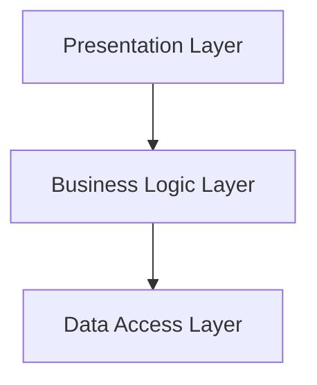
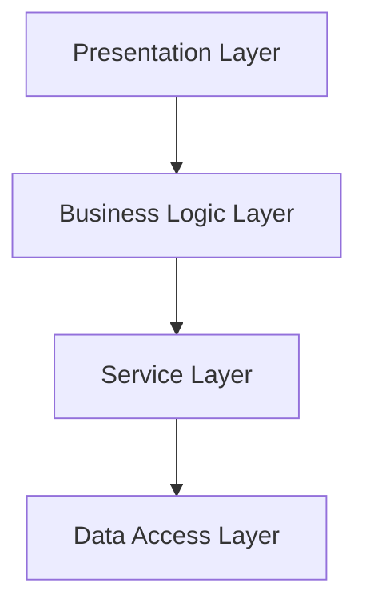
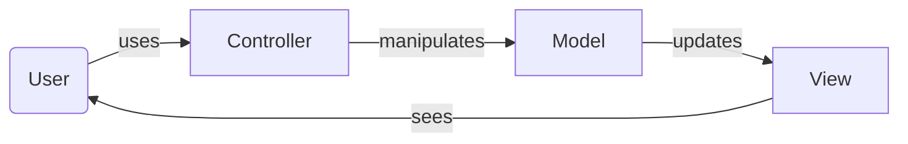
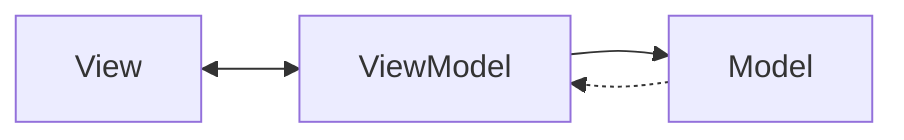
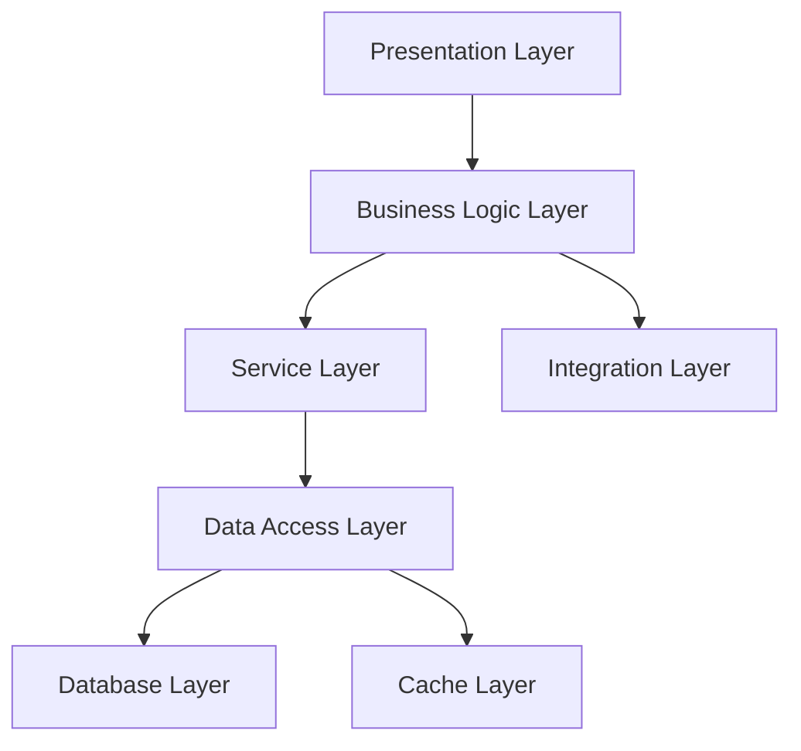

💡 아키텍처의 기술 역할에 따라 레이어를 분리하는 방식

**관심사의 분리**를 통해 레이어들은 자신이 맡은 역할만 수행

## 표준 레이어

- 프레젠테이션 레이어
- 비지니스 레이어
- 퍼시스턴스 레이어
- 데이터베이스 레이어

### 프레젠테이션 레이어

유저 인터페이스와 브라우저 통신 로직

### 비지니스 레이어

요청을 맞아 알맞은 비지니스 규칙을 실행

### 퍼시스턴스 레이어

데이터베이스로 부터 데이터를 가져오고 처리

## 레이어 아키텍처 특징

### 레이어 격리

각 레이어는 **폐쇄** 또는 **개방** 상태

각 레이어는 다른 레이어의 로직을 알 수 없다

요청은 상위 레이어에서 하위 레이어로 순서대로 이동하고, 중간에 건너뛸 수 없다

어느 레이어에서 변경 사항이 있을 때 자신의 하위 레이어 외의 다른 레이어에는 영향을 주지 않는다

레이어를 교체 시에 다른 레이어를 손대지 않고 쉽게 교체할 수 있다

## 여러 가지 변형들

### 3계층

### 4계층

### MVC

### MVVM

### N tier

- **Integration Layer**: 외부 시스템과의 통합을 처리
- **Cache Layer**: 데이터베이스의 성능을 개선하기 위한 캐시를 제공
- **N-Tier 아키텍처**는 필요한 경우 더 많은 계층을 추가하여 확장 가능

