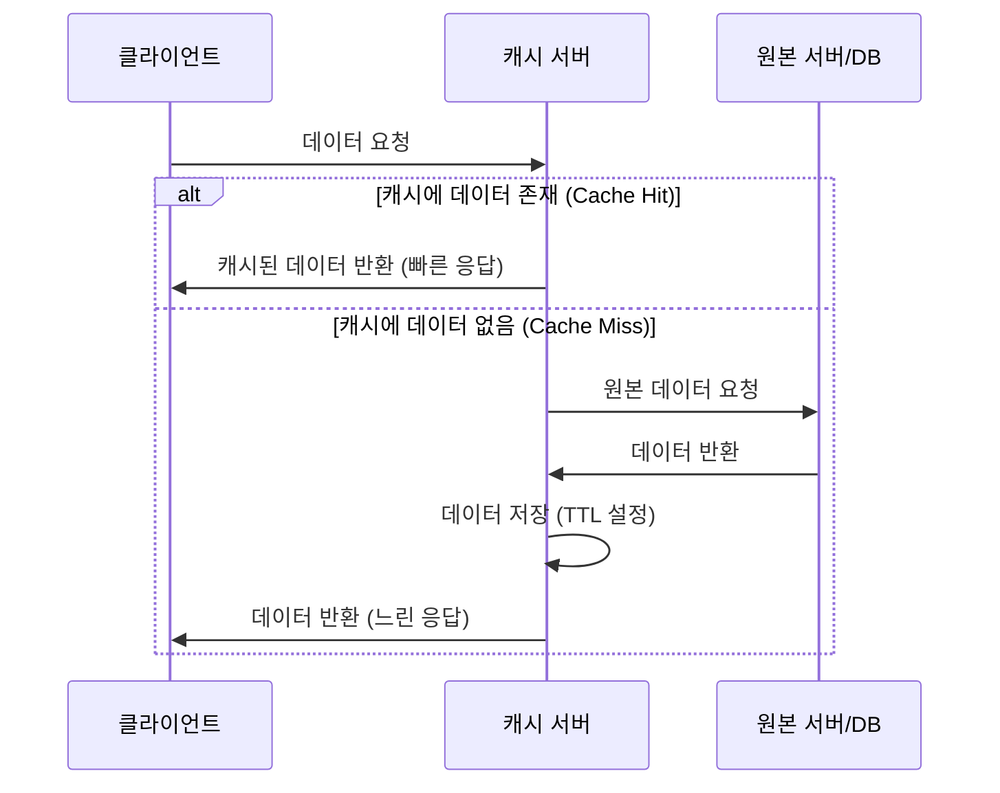

## 성능 지표


### 응답 시간

사용자의 요청이 시작되어 서버에서 처리된 후 응답이 다시 사용자에게 도달하기까지 걸리는 총 시간입니다.

<Note>응답 시간을 줄인다고 반드시 매출이나 트래픽이 증가하는 긍정적인 효과가 생기는 것은 아니지만, 응답시간이 길어질수록 부정적인 영향이 생기는 것은 확실하다.</Note>

서버 처리 시간은 다음과 같은 경우를 포함한다.

- cpu 시간(조건문 반복문 등 로직을 수행, 주로 동기적 작업)
- 데이터베이스 쿼리(주로 비동기 작업)
- 다른 외부 서버나 API와의 통신(주로 비동기 작업)

**세부 지표**

- **TTFB (Time To First Byte)**: 사용자가 웹 페이지를 요청한 시점부터 서버로부터 첫 번째 데이터 바이트를 수신하기까지 걸리는 시간입니다. DNS 검색, TCP 핸드셰이크, SSL 핸드셰이크 및 서버에서 첫 응답을 생성하는 시간이 포함됩니다.
- **FCP (First Contentful Paint)**: 사용자가 웹 페이지를 요청한 시점부터 첫 번째 DOM 요소가 화면에 표시되기까지 걸리는 시간입니다. HTML 문서가 완전히 로드되고 파싱되는 데 걸리는 시간이 포함됩니다.  이 지표가 빠를수록 사용자는 "무언가 로딩되고 있구나"를 빨리 알 수 있어 긍정적인 초기 경험을 제공합니다.
- **LCP (Largest Contentful Paint)**: 사용자가 웹 페이지를 요청한 시점부터 가장 큰 DOM 요소가 화면에 표시되기까지 걸리는 시간입니다. 사용자가 페이지의 "주요 콘텐츠"가 로드되었다고 느끼는 시점을 가장 잘 반영하는 지표입니다. 좋은 사용자 경험을 위해 2.5초 이내를 권장합니다. LCP가 느리다면 이미지 최적화, 서버 응답 시간 개선, 폰트 로딩 최적화 등을 고려해야 합니다.
- **TTI (Time To Interactive)**: 사용자가 웹 페이지를 요청한 시점부터 사용자가 페이지와 상호작용할 수 있는 시점까지 걸리는 시간입니다. 사용자에게 완전한 기능이 제공되는 시점을 측정하는 데 유용합니다.


### 처리량

처리량은 특정 시간 단위당 서버나 서비스가 처리할 수 있는 작업의 양입니다. 웹 서버의 경우 초당 요청 수(RPS), 데이터베이스의 경우 초당 쿼리 수(QPS) 등이 대표적입니다.

<Note>서비스가 얼마나 많은 부하를 감당할 수 있는지를 나타내는 지표입니다. 처리량이 감소하거나 예상치 못하게 급증하면 서비스에 문제가 발생했거나 부하 관리가 필요함을 의미합니다.</Note>

처리량의 주요 용도

- **서비스 용량 파악**: 현재 시스템이 얼마나 많은 사용자 요청이나 데이터를 처리할 수 있는지 파악하여, 예상되는 트래픽 증가에 대비한 용량 계획(Capacity Planning)을 수립하는 데 필수적입니다.
- **병목 현상 식별**: 처리량이 갑자기 감소하거나, 특정 지점 이상으로 증가하지 못한다면, 이는 시스템 내부에 병목 현상(Bottleneck)이 발생했음을 의미합니다. 이 병목 지점을 찾아 해결함으로써 전체 시스템의 처리량을 늘릴 수 있습니다.
- **성능 목표 설정**: 서비스의 SLA(Service Level Agreement)를 정의하거나, 특정 성능 목표를 설정할 때 응답 시간과 함께 주요 지표로 활용됩니다. 예를 들어, "초당 1000RPS를 200ms 이내의 응답 시간으로 처리해야 한다"와 같이 목표를 설정할 수 있습니다.
- **자원 활용 효율성 평가**: 동일한 자원(CPU, 메모리 등)을 사용하면서 처리량이 증가한다면, 이는 시스템이 더 효율적으로 작동하고 있다는 것을 의미합니다. 반대로 처리량은 그대로인데 자원 사용량이 급증한다면 비효율적인 부분이 있다는 뜻입니다.
- **비즈니스 영향 분석**: 전자상거래 사이트의 경우, 초당 주문 처리량이 곧 매출과 직결될 수 있습니다. 미디어 스트리밍 서비스의 경우, 초당 전송되는 데이터량이 곧 동시 시청 가능 인원과 직결됩니다. 처리량은 직접적으로 비즈니스 성과에 영향을 미칩니다.


### 처리량과 응답 시간

처리량은 단독으로 해석하기보다는 다른 지표들과 함께 보았을 때 더 큰 의미를 가집니다. 특히 **응답 시간(Latency)**과 매우 밀접한 관계를 가집니다.

- **역비례 관계**: 일반적으로 시스템의 처리량이 증가하면 응답 시간도 함께 증가하는 경향이 있습니다. 이는 시스템에 부하가 많아지면 요청을 처리하기 위한 대기 시간이 길어지기 때문입니다.
- **최적의 균형점**: 성능 최적화의 목표는 허용 가능한 응답 시간을 유지하면서 처리량을 최대화하는 것입니다. 무조건 처리량을 높이는 것만이 능사는 아니며, 응답 시간이 너무 길어지면 사용자가 이탈할 수 있습니다.

---


## 병목 해결하기

서버 성능 개선의 첫걸음은 **병목 지점(Bottleneck)**을 찾는 것입니다. 병목 지점은 시스템의 성능을 제한하는 주요 지점이며, 이를 식별하고 개선하는 것이 성능 개선의 핵심입니다.


### 1. 문제 정의 및 범위 설정

- **증상 구체화**
  - 언제부터 느려졌는가? (특정 시간, 특정 이벤트 발생 후)
  - 어떤 서비스나 기능이 느려졌는가? (웹 페이지 로딩, 특정 API 호출, 로그인, 결제 등)
  - 느려진 정도는 어느 정도인가? (평균 응답 시간이 1초에서 5초로 증가, 특정 작업 실패율 증가 등)
  - 모든 사용자가 겪는 문제인가, 아니면 특정 사용자/지역/조건에서만 발생하는가?

- **영향 범위 파악**
  - 단일 서버만의 문제인가, 아니면 여러 서버에 걸쳐 발생하는 문제인가?
  - 특정 시간대에만 발생하는가, 아니면 지속적으로 발생하는가?
  - 문제 발생 시 어떤 알림(Alert)이 발생했는가?


### 2. 모니터링 도구와 지표 분석

종합적인 성능 지표 검토:

- CPU 사용률: 특정 프로세스가 CPU를 과도하게 사용하는지, I/O Wait이 높은지 확인합니다.
- 메모리 사용률: 물리 메모리 부족으로 스왑이 발생하는지, 메모리 누수가 있는지 확인합니다.
- 디스크 I/O: IOPS, Throughput, I/O Latency, I/O Queue Length 등을 확인하여 디스크가 병목인지 파악합니다. 특히 I/O Wait CPU가 높다면 디스크 병목일 가능성이 큽니다.
- 네트워크 I/O: 대역폭 사용량, 패킷 손실/에러율, 연결 수 등을 확인하여 네트워크 문제가 있는지 파악합니다.
- 로드 평균 (Load Average): 시스템의 전반적인 부하를 확인하고, CPU 코어 수와 비교하여 과부하 여부를 판단합니다.
서비스 관점의 지표 분석:

응답 시간:

- 종합 응답 시간: 사용자로부터의 요청이 서버에 도달하고 다시 사용자에게 응답이 돌아오기까지의 총 시간을 확인합니다. (APM의 트랜잭션 응답 시간)
- 구성 요소별 응답 시간: APM 도구를 사용하여 DB 쿼리 시간, 외부 API 호출 시간, 캐시 접근 시간, 비즈니스 로직 처리 시간 등 각 단계별로 소요되는 시간을 분석하여 어느 단계에서 지연이 발생하는지 정확히 찾아냅니다. (예: DB 쿼리 시간이 90%를 차지한다면 DB가 병목)
- 퍼센타일 지표 (P90, P95, P99): 평균 응답 시간 외에, 느린 요청들이 실제로 얼마나 느린지를 파악하여 '꼬리 지연 시간(Tail Latency)' 문제를 진단합니다.
- 처리량 (RPS, QPS, TPS): 문제가 발생한 시점에 처리량이 급감했는지, 아니면 처리량이 급증하면서 응답 시간이 길어진 것인지 확인합니다.
- 오류율: 특정 유형의 오류(5xx HTTP 코드, DB 연결 오류 등)가 증가했는지 확인하여 문제의 원인을 추정합니다.
- 동시 사용자 수: 문제 발생 시점에 동시 접속자 수가 급증했는지 확인합니다.

추이 분석 (Trend Analysis):

- 단순히 현재 지표만 보는 것이 아니라, 과거 데이터와 비교하여 추이(Trend)를 분석하는 것이 중요합니다. 평소와 다른 패턴(예: 특정 시간대의 반복적인 성능 저하, 점진적인 자원 사용량 증가)을 찾아낼 수 있습니다.
- 갑작스러운 스파이크(Spike)나 드롭(Drop) 발생 시, 그 원인을 파적합니다.

로그 분석:

- 웹 서버 로그(Nginx, Apache), 애플리케이션 로그, 데이터베이스 로그 등을 분석하여 특정 오류 메시지, 느린 쿼리 로그, 비정상적인 접근 패턴 등을 찾아냅니다.
- 특히 애플리케이션 로그는 코드 레벨의 문제나 특정 비즈니스 로직의 지연을 파악하는 데 결정적인 단서를 제공합니다.


### 3. 잠재적 병목 지점 가설 수립 및 검증

모니터링 데이터를 바탕으로 문제의 원인이 될 만한 **가설을 수립하고, 이를 하나씩 검증**해 나갑니다.

- **일반적인 병목 시나리오**:
  - **CPU 바운드**: CPU 사용률이 지속적으로 90% 이상이고 로드 평균이 코어 수보다 높음. (애플리케이션 로직, 복잡한 계산, 무한 루프 등)
  - **메모리 바운드**: 물리 메모리 소진 및 스왑 발생, OOM(Out Of Memory) 에러. (메모리 누수, 대용량 데이터 처리, 캐시 효율 저하 등)
  - **I/O 바운드 (디스크)**: 디스크 I/O Latency 높음, I/O Queue Length 김, CPU의 I/O Wait 높음. (느린 디스크, 빈번한 디스크 접근, 대용량 로그 기록, DB 파일 I/O 등)
  - **I/O 바운드 (네트워크)**: 네트워크 대역폭 포화, 패킷 드롭 발생, 외부 서비스 응답 지연. (외부 서비스 장애, 대량 데이터 전송, DDoS 공격 등)
  - **데이터베이스 병목**: 특정 쿼리 응답 시간 김, DB 연결 풀 고갈, Lock 경합, 인덱스 부재. (느린 SQL 쿼리, 대량 데이터 조회/삽입, 잘못된 트랜잭션 처리 등)
  - **애플리케이션 로직 병목**: 특정 기능의 응답 시간만 현저히 길고, 서버 자원 사용률은 낮음. (비효율적인 알고리즘, 외부 시스템 연동 지연, 불필요한 반복문 등)
  - **동시성 문제**: 스레드/프로세스 잠금(Lock), 데드락(Deadlock) 등으로 인해 요청 처리가 지연되거나 실패.

- **가설 수립**: "현재 CPU 사용률이 높고 I/O Wait이 높은 것을 보니, 디스크 I/O가 병목인 것 같다. 특히 데이터베이스 서버의 I/O 지표가 좋지 않다."
- **가설 검증 (Drill Down)**:
  - **프로세스 상세 분석**: `top`, `htop`, `pidstat` 등으로 CPU/메모리를 가장 많이 사용하는 프로세스를 식별합니다. Java 애플리케이션이라면 `jstack`으로 스레드 덤프를 떠서 어떤 코드가 CPU를 많이 사용하는지 분석합니다.
  - **디스크 사용량 분석**: `iostat`, `vmstat`, `iotop` 등으로 어떤 프로세스가 디스크 I/O를 가장 많이 유발하는지, IOPS와 Latency가 실제 높은지 확인합니다.
  - **네트워크 상세 분석**: `netstat`, `ss` 등으로 현재 연결 상태, 송수신량, 대기열 등을 확인합니다.
  - **데이터베이스 분석**: 데이터베이스 자체의 성능 모니터링 도구(MySQL Workbench, pg_stat_activity 등)를 사용하여 현재 실행 중인 쿼리, Lock, 연결 상태 등을 상세히 분석합니다. Slow Query 로그를 확인하여 느린 쿼리를 찾습니다.
  - **코드 프로파일링**: 애플리케이션 코드를 직접 프로파일링(예: Java의 JProfiler, Python의 cProfile)하여 어떤 함수나 메서드가 가장 많은 시간을 소모하는지 정확히 찾아냅니다.
  - **부하 테스트/스트레스 테스트**: 문제가 재현 가능하다면, 동일한 조건에서 부하 테스트를 수행하여 특정 임계점에서 성능 저하가 발생하는지 확인하고, 테스트 중 자원 사용량 변화를 모니터링하여 병목을 재확인합니다.


### 4. 해결책 적용 및 재확인

병목 지점을 특정했다면, 해당 문제를 해결하기 위한 적절한 조치를 취합니다.

- **해결책 적용**:
  - **CPU**: 코드 최적화, 알고리즘 개선, 병렬 처리 도입, CPU 코어 증설 (Scale Up), 서버 증설 (Scale Out).
  - **메모리**: 메모리 누수 해결, 캐시 정책 최적화, JVM 힙 사이즈 조정, RAM 증설.
  - **디스크 I/O**: SSD로 교체, RAID 구성 변경, 디스크 접근 패턴 최적화, DB 인덱스 추가, 파일 시스템 설정 튜닝.
  - **네트워크**: 대역폭 증설, CDN 도입, 네트워크 설정 최적화, TCP/IP 튜닝.
  - **데이터베이스**: 느린 쿼리 최적화, 인덱스 추가/재구성, 쿼리 튜닝, 캐시 적용, 데이터베이스 서버 증설/샤딩.
  - **애플리케이션**: 코드 리팩토링, 비동기 처리 도입, 스레드 풀/연결 풀 최적화, 외부 서비스 호출 시간 단축.
- **결과 재확인**: 해결책을 적용한 후에는 반드시 **동일한 모니터링 지표를 다시 확인**하여 성능이 개선되었는지, 그리고 새로운 병목 지점이 생기지는 않았는지 검증합니다. 문제가 해결되지 않았다면, 다음으로 의심되는 가설을 세우고 다시 진단 과정을 반복합니다.

---


## DBMS 커넥션

DBMS 커넥션은 애플리케이션이 데이터베이스와 통신하기 위한 통로로 서비스의 성능과 안정성에 직접적인 영향을 미치는 매우 중요한 요소입니다. 부적절하게 관리될 경우, 서비스 응답 지연, 장애 발생, 리소스 고갈 등 심각한 문제를 야기할 수 있습니다. 클라이언트(애플리케이션)가 데이터베이스에 쿼리를 보내거나 데이터를 주고받으려면 먼저 커넥션을 맺어야 합니다.

- **커넥션 생성 비용**: DBMS 커넥션을 생성하는 것은 비용이 많이 드는 작업입니다. 네트워크 핸드셰이크, 인증, 세션 설정 등 여러 단계를 거치기 때문에 상당한 시간(수십 ms ~ 수백 ms)과 CPU 자원을 소모합니다.
- **커넥션의 생명 주기**:
    1. 애플리케이션이 DBMS에 커넥션 요청
    2. DBMS가 커넥션 수락 및 생성
    3. 애플리케이션이 커넥션을 통해 쿼리 실행
    4. 애플리케이션이 커넥션 종료

---


### DBMS 커넥션  문제


#### 커넥션 누수 (Connection Leak)

가장 흔하고 치명적인 문제 중 하나입니다.

- **정의**: 애플리케이션이 데이터베이스 커넥션을 사용한 후 명시적으로 반환(close)하지 않아 커넥션 풀 또는 데이터베이스에 커넥션이 계속 남아있게 되는 현상입니다.
- **영향**:
  - **커넥션 풀 고갈**: 커넥션 풀의 가용 커넥션이 0이 되어 새로운 요청이 데이터베이스에 접근할 수 없게 됩니다. 이는 서비스 장애로 직결됩니다.
  - **DB 리소스 고갈**: DBMS 서버 입장에서 사용되지 않는 커넥션이 쌓여 메모리, 프로세스 스레드 등 DB 자원을 낭비하고, 결국 DB가 과부하로 다운될 수 있습니다.
  - **응답 시간 지연**: 새로운 커넥션 생성을 시도하거나, 커넥션 풀의 대기열에서 기다리는 시간이 길어져 서비스 응답 시간이 지연됩니다.
- **방지책**:
  - **`try-with-resources` (Java) 또는 `using` (C#)**: 커넥션 및 리소스 관리를 자동으로 처리하여 명시적인 `close()` 호출 누락을 방지합니다.
  - **`finally` 블록**: 커넥션 `close()` 로직을 `finally` 블록에 넣어 예외 발생 여부와 관계없이 항상 커넥션이 닫히도록 합니다.
  - **코드 리뷰 및 정적 분석**: 커넥션 획득 및 반환 로직에 대한 철저한 코드 리뷰와 정적 분석 도구를 활용하여 잠재적인 누수 지점을 찾아냅니다.
  - **모니터링**: 커넥션 풀의 활성/유휴 커넥션 수, 획득/반환 속도 등을 지속적으로 모니터링하여 비정상적인 증가 추이를 감지합니다.


#### 과도한 커넥션 생성/파괴 (Excessive Connection Creation/Destruction)

커넥션 풀을 사용하지 않거나 잘못 사용할 때 발생합니다.

- **영향**: 매번 요청마다 커넥션을 생성하고 사용 후 바로 닫으면, 커넥션 생성 및 파괴에 드는 오버헤드가 누적되어 전체적인 서비스 응답 시간이 지연됩니다. 특히 고빈도 호출이 필요한 서비스에서 치명적입니다.
- **방지책**: **커넥션 풀 사용을 필수화**합니다. (자세한 내용은 최적화 부분에서 다룹니다.)


#### 커넥션 풀 크기 설정의 부적절성

커넥션 풀의 크기는 서비스의 성능과 안정성에 매우 중요합니다.

- **너무 작은 풀**: 동시 요청 수가 풀의 크기를 초과하면, 요청들이 커넥션을 기다리면서 지연되거나 타임아웃이 발생할 수 있습니다.
- **너무 큰 풀**: 불필요하게 많은 커넥션을 유지하면 DBMS 서버의 자원을 낭비하고, 각 커넥션에 대한 관리 오버헤드가 증가하여 오히려 성능 저하를 일으킬 수 있습니다. 또한, 많은 커넥션은 Lock 경합 증가 등 다른 문제로 이어질 수 있습니다.
- **방지책**: 부하 테스트를 통해 서비스의 최대 동시 요청 수와 DBMS 서버의 최대 처리량(QPS/TPS)을 고려하여 적절한 크기를 설정해야 합니다. (자세한 내용은 최적화 부분에서 다룹니다.)


#### 장시간 미사용 커넥션 (Idle Connections)

- **영향**: 커넥션 풀에 오랫동안 사용되지 않는 커넥션이 쌓여있으면 DBMS 자원을 점유하고, 네트워크 장비(방화벽, 로드 밸런서 등)의 타임아웃 정책에 의해 중간에 끊어질 수 있습니다. 끊어진 커넥션을 애플리케이션이 사용하려 하면 "Broken Pipe" 또는 "Connection reset by peer"와 같은 오류가 발생합니다.
- **방지책**:
  - **유휴 커넥션 타임아웃 설정**: 커넥션 풀에서 일정 시간 사용되지 않은 커넥션을 자동으로 닫도록 설정합니다.
  - **커넥션 유효성 검사**: 커넥션을 풀에서 반환받을 때 또는 주기적으로 커넥션의 유효성을 검사(validation query)하여 끊어진 커넥션을 제거하고 새로운 커넥션으로 대체합니다.


#### 트랜잭션 경합 및 Lock (Transaction Contention & Locking)

커넥션 자체의 문제는 아니지만, 커넥션을 통해 수행되는 트랜잭션과 밀접하게 연관됩니다.

- **영향**: 여러 커넥션이 동시에 동일한 데이터에 접근하거나 업데이트하려 할 때 Lock이 발생하고, 이로 인해 다른 트랜잭션이 대기하면서 응답 시간이 지연되거나 데드락(Deadlock)이 발생할 수 있습니다.
- **방지책**:
  - **짧은 트랜잭션 유지**: 트랜잭션 범위를 최소화하여 Lock을 잡고 있는 시간을 줄입니다.
  - **적절한 격리 수준**: DBMS 트랜잭션 격리 수준을 서비스 요구 사항에 맞게 조정합니다. (예: `READ COMMITTED`는 `SERIALIZABLE`보다 경합이 적음)
  - **인덱스 최적화**: 쿼리 성능을 개선하여 Lock이 발생하는 시간을 줄입니다.
  - **동시성 제어**: 애플리케이션 레벨에서 낙관적/비관적 Lock 전략을 신중하게 적용합니다.
  - **모니터링**: DBMS의 Lock 대기, 데드락 관련 지표를 모니터링하고, 발생 시 로그를 통해 원인을 분석합니다.


### DBMS 커넥션 최적화 방법

대부분의 최적화는 **커넥션 풀(Connection Pool)**을 효과적으로 사용하는 것에 집중됩니다.


#### 커넥션 풀 사용 (Connection Pooling)

- **개념**: 미리 일정 개수의 데이터베이스 커넥션을 생성하여 풀(Pool)에 보관해두고, 애플리케이션이 필요할 때 풀에서 커넥션을 빌려 쓰고 반환하는 방식입니다.
- **장점**:
  - **성능 향상**: 커넥션 생성/파괴 오버헤드를 줄여 서비스 응답 시간을 단축하고 처리량을 증가시킵니다.
  - **자원 효율성**: 필요한 만큼의 커넥션만 유지하여 DBMS 리소스 낭비를 줄입니다.
  - **안정성**: 최대 커넥션 수를 제한하여 DBMS 과부하를 방지하고, 커넥션 누수 시에도 풀 고갈로 문제를 조기에 감지할 수 있습니다.
- **주요 커넥션 풀 라이브러리**:
  - **Java**: HikariCP (가장 빠르고 가볍다고 알려짐), Apache Commons DBCP, Tomcat JDBC Connection Pool.
  - **Python**: SQLAlchemy의 Connection Pooling.
  - **Node.js**: `pg` (PostgreSQL), `mysql2` (MySQL) 등 각 드라이버에서 제공하는 풀링 기능.


#### 커넥션 풀 크기 설정 (Pool Size Configuration)

가장 중요한 최적화 요소 중 하나이며, 정답은 없습니다. 서비스의 특성과 시스템 자원에 따라 달라집니다.

- **고려 사항**:
  - **애플리케이션 스레드 수**: 웹 서버(Tomcat, Jetty)의 최대 스레드 수, 비동기 작업의 스레드 풀 크기 등을 고려합니다. 풀 크기가 스레드 수보다 너무 작으면 스레드가 커넥션을 기다리느라 지연될 수 있습니다.
  - **DBMS의 최대 커넥션 수**: DBMS의 `max_connections` 설정보다 풀 크기가 작아야 합니다.
  - **DBMS의 동시 처리 능력**: QPS/TPS 및 DBMS 서버의 CPU, 메모리, 디스크 I/O 능력.
  - **쿼리의 복잡성 및 실행 시간**: 장시간 실행되는 쿼리가 많다면 더 많은 커넥션이 필요할 수 있습니다.
  - **부하 테스트 결과**: 다양한 풀 크기로 부하 테스트를 수행하여 최적의 응답 시간과 처리량을 제공하는 지점을 찾습니다.
- **일반적인 가이드라인 (하지만 맹신 금지)**:
  - `min_idle = max_pool_size`로 설정하여 유휴 커넥션이 발생하지 않도록 하여 생성 비용을 최소화합니다.
  - `max_pool_size`는 `(코어 수 * 2) + 효율적인 디스크 I/O를 위한 추가 스레드` 또는 `애플리케이션 서버 스레드 수 / 평균 쿼리 시간` 등을 고려하여 초기값을 설정합니다.
  - 작은 값부터 시작하여 점진적으로 증가시키면서 성능 변화를 모니터링하는 것이 좋습니다.


#### 유휴 커넥션 관리 (Idle Connection Management)

- **`idleTimeout` (HikariCP 기준)**: 일정 시간(예: 10분) 동안 사용되지 않은 커넥션을 풀에서 제거합니다. 이는 DBMS 리소스를 확보하고, 네트워크 장비 타임아웃으로 인한 "Broken Pipe" 문제를 줄입니다.
- **`maxLifetime`**: 커넥션의 최대 생명주기를 설정합니다. 이 시간이 지나면 커넥션이 재생성되어 DBMS의 주기적인 커넥션 정리나 로드 밸런서의 커넥션 교체 정책에 유연하게 대응할 수 있습니다.
- **`connectionTestQuery` / `validationTimeout`**: 커넥션을 풀에서 빌려갈 때 또는 주기적으로 DB에 간단한 쿼리(예: `SELECT 1`)를 보내 커넥션이 유효한지 확인합니다. 끊어진 커넥션 사용으로 인한 오류를 방지합니다.


#### 모니터링 강화

- **커넥션 풀 지표**:
  - `activeConnections`: 현재 사용 중인 커넥션 수
  - `idleConnections`: 풀에 대기 중인 커넥션 수
  - `waitingConnections`: 커넥션을 얻기 위해 대기 중인 요청 수
  - `connectionAcquisitionLatency`: 커넥션을 풀에서 획득하는 데 걸리는 시간
- **DBMS 서버 지표**:
  - `max_connections` 대비 현재 커넥션 수
  - `Aborted_clients`, `Aborted_connects` (MySQL): 비정상적으로 끊긴 커넥션 수
  - Lock 관련 지표 (대기 중인 트랜잭션, 데드락 발생 횟수)
  - 쿼리 실행 시간 (특히 느린 쿼리 로그)
- **알림 설정**: 주요 지표(예: `activeConnections`가 `max_pool_size`에 근접, `waitingConnections`가 임계치를 초과)에 대한 알림을 설정하여 문제 발생 시 즉각적으로 대응합니다.


#### 기타 최적화 고려 사항

- **트랜잭션 최적화**: 트랜잭션의 범위를 최소화하고, 필요한 경우 비관적 Lock 대신 낙관적 Lock을 고려합니다.
- **쿼리 최적화**: DBMS 커넥션을 아무리 잘 관리해도 쿼리 자체가 느리면 전체 성능은 저하됩니다. 인덱스 최적화, 불필요한 조인 제거, N+1 쿼리 문제 해결 등이 중요합니다.
- **읽기/쓰기 분리 (Read/Write Splitting)**: 읽기 부하가 압도적으로 높다면, 읽기 전용 복제본(Read Replica)을 두고 읽기 요청을 분산하여 Master DB의 부하와 커넥션 사용량을 줄입니다.
- **샤딩 (Sharding)**: 데이터베이스 부하가 매우 커진 경우, 데이터를 여러 개의 독립적인 DB로 분산하여 전체 커넥션 부하를 분산시킬 수 있습니다.

DBMS 커넥션 관리는 서비스 안정성과 성능의 기반이 되는 중요한 작업입니다. 위 유의사항들을 항상 염두에 두고, 모니터링을 통해 현재 상태를 파악하며, 지속적인 최적화 노력을 기울여야 합니다.

---


## 서버 확장

서버 확장은 서비스의 성장과 부하 증가에 따라 필수적으로 고려해야 하는 요소입니다. 크게 **수직 확장(Scale Up)**과 **수평 확장(Scale Out)** 두 가지 방법이 있으며, 각 방법은 고유한 장단점을 가지고 있어 서비스의 특성과 시나리오에 따라 적절한 선택이 필요합니다.


### 수직 확장 (Scale Up / Vertical Scaling)

수직 확장은 **단일 서버의 성능을 높이는 방법**입니다. 현재 서버의 CPU 코어 수, RAM 용량, 디스크 성능(SSD로 교체, 더 빠른 디스크 추가), 네트워크 대역폭 등을 업그레이드하는 것을 의미합니다.


#### 장점

- **간단한 관리**: 단일 서버를 관리하므로 아키텍처가 복잡해지지 않고 관리 포인트가 적습니다.
- **데이터 일관성 유지 용이**: 데이터베이스 등 상태(State)를 가진 애플리케이션의 경우, 여러 서버에 걸쳐 데이터를 분산할 필요가 없어 데이터 일관성을 유지하기 쉽습니다.
- **설정 및 배포 용이**: 기존 시스템 설정을 크게 변경할 필요 없이 하드웨어만 교체/추가하면 됩니다.
- **비용 효율성 (초기)**: 트래픽이 크게 변동하지 않고 예측 가능한 경우, 초기에는 수평 확장보다 비용 효율적일 수 있습니다.


#### 단점

- **확장 한계**: 물리적인 하드웨어의 한계가 존재합니다. 아무리 좋은 장비를 사용해도 무한정 성능을 올릴 수는 없습니다. (예: 128코어 CPU 이상은 드물고 매우 비쌈)
- **단일 실패 지점 (Single Point of Failure, SPOF)**: 단일 서버에 장애가 발생하면 서비스 전체가 중단될 수 있습니다. 고가용성(High Availability) 확보가 어렵습니다.
- **서비스 중단**: 대부분의 경우 하드웨어 업그레이드 시 서비스 중단(다운타임)이 발생합니다.
- **비용 효율성 (장기)**: 고성능의 단일 서버는 일반 서버 여러 대를 합친 것보다 훨씬 비쌀 수 있어 장기적으로는 비효율적일 수 있습니다.


#### 적합한 시나리오

- **초기 서비스 단계**: 트래픽이 많지 않고, 빠른 개발 및 배포가 중요한 소규모 서비스.
- **CPU 또는 메모리 바운드 애플리케이션**: 특정 애플리케이션이 단일 서버의 CPU나 메모리에 집중적으로 의존하는 경우 (예: 복잡한 연산을 수행하는 배치 처리 서버, 대용량 인메모리 캐시 서버).
- **데이터베이스 서버**: 데이터 일관성과 트랜잭션 무결성이 매우 중요하고, 샤딩(Sharding)이 복잡하거나 아직 필요하지 않은 단계의 데이터베이스. (다만, 데이터베이스도 일정 수준 이상에서는 수평 확장을 고려해야 합니다.)
- **단일 인스턴스로만 실행 가능한 레거시 시스템**.


### 수평 확장 (Scale Out / Horizontal Scaling)

수평 확장은 **여러 대의 서버를 추가하여 시스템의 처리 능력을 높이는 방법**입니다. 로드 밸런서(Load Balancer)를 사용하여 들어오는 요청을 여러 서버에 분산시키는 방식이 일반적입니다.


#### 장점

- **무한한 확장성**: 이론적으로는 서버를 계속 추가함으로써 무한한 수준으로 확장할 수 있습니다.
- **고가용성 (High Availability)**: 한두 대의 서버에 장애가 발생해도 로드 밸런서가 해당 서버를 제외하고 정상 서버로 트래픽을 보내므로 서비스 중단 없이 안정적으로 운영될 수 있습니다.
- **비용 효율성 (장기/대규모)**: 저렴한 일반 서버 여러 대를 사용하는 것이 고성능 단일 서버보다 총 비용 효율적일 수 있습니다. 클라우드 환경에서는 필요에 따라 서버를 늘리고 줄이는 유연한 비용 관리가 가능합니다 (오토 스케일링).
- **무중단 서비스 운영**: 새로운 서버를 추가하거나 기존 서버를 제거할 때 서비스 중단 없이 유연하게 작업할 수 있습니다.


#### 단점

- **복잡성 증가**: 로드 밸런서, 분산 캐시, 메시지 큐 등 분산 시스템 아키텍처가 복잡해지고 관리할 요소가 많아집니다.
- **데이터 일관성 문제**: 여러 서버에 걸쳐 데이터를 저장하고 처리해야 할 경우 데이터 일관성 유지가 어렵습니다. (예: 세션 공유, 분산 트랜잭션, 데이터베이스 복제/샤딩 고려)
- **개발 및 운영의 어려움**: 분산 시스템 환경에 맞는 애플리케이션 개발(상태 없음, Stateless), 배포, 모니터링, 로깅 등 운영 방식의 변화가 필요합니다.
- **네트워크 오버헤드**: 서버 간 통신, 로드 밸런싱 등으로 인한 네트워크 오버헤드가 발생할 수 있습니다.


#### 적합한 시나리오

- **대규모 웹 서비스/API 서비스**: 사용자 요청이 많고 트래픽 변동성이 큰 서비스.
- **스테이트리스(Stateless) 애플리케이션**: 세션 정보를 서버에 저장하지 않는 애플리케이션 (예: RESTful API 서버).
- **마이크로서비스 아키텍처**: 각 마이크로서비스를 독립적으로 확장해야 할 때.
- **빅데이터 처리**: 대용량 데이터를 병렬로 처리해야 하는 분석 시스템.
- **예측 불가능한 트래픽 변동**: 갑작스러운 이벤트 등으로 인해 트래픽이 폭증할 가능성이 있는 서비스 (오토 스케일링과 결합 시 유리).


### 확장 방법 비교

| 특징/시나리오       | 수직 확장 (Scale Up)                               | 수평 확장 (Scale Out)                                    |
| :------------------ | :------------------------------------------------- | :------------------------------------------------------- |
| **목표** | 단일 서버 성능 극대화                              | 여러 서버를 통한 전체 시스템 용량 증대                   |
| **방법** | CPU, RAM, Disk, Network 업그레이드               | 서버 추가, 로드 밸런서, 분산 아키텍처                    |
| **관리 복잡성** | 낮음                                               | 높음                                                     |
| **확장성** | 한계가 명확함                                      | 무한대에 가까움                                          |
| **가용성** | 낮음 (SPOF 존재)                                   | 높음 (장애 발생 시 다른 서버로 트래픽 분산)              |
| **비용 효율성** | 초기 소규모 유리, 대규모 비효율적                  | 초기 대규모 투자, 장기적으로 비용 효율적 (클라우드에서 특히) |
| **다운타임** | 발생 가능성 높음                                   | 최소화 또는 없음                                         |
| **데이터 일관성** | 유지 용이                                          | 관리가 복잡 (세션, DB 복제/샤딩 고려)                    |
| **적합한 앱 유형** | CPU/메모리 바운드, DB (초기), 스테이트풀 앱        | 웹/API 서비스, 마이크로서비스, 빅데이터, 스테이트리스 앱 |
| **초기 개발 단계** | 유리                                               | 불리 (복잡성 증가)                                       |
| **급격한 트래픽 증가** | 대처 어려움                                        | 오토 스케일링으로 유연하게 대처 가능                     |
| **예시** | 단일 EC2 인스턴스 타입 변경 (t2.medium -> m5.xlarge) | EC2 인스턴스 여러 대 추가 및 ALB (Application Load Balancer) |


### 실제 서비스에서의 확장 전략

대부분의 실제 서비스는 위 두 가지 방법을 혼합하여 사용합니다.

- **웹/API 서버**: 주로 **수평 확장**을 기본 전략으로 가져갑니다. stateless하게 설계하여 로드 밸런서 뒤에 여러 대의 서버를 두고, 트래픽 증가에 따라 자동으로 서버 인스턴스를 늘리는 오토 스케일링(Auto Scaling) 그룹을 활용합니다.
- **데이터베이스 서버**:
  - 초기에는 **수직 확장**을 통해 성능을 확보합니다.
  - 한계를 넘어서면 **읽기 전용 복제본(Read Replica)**을 추가하여 읽기 부하를 분산하는 방식으로 부분적인 **수평 확장**을 시도합니다.
  - 정말 대규모가 되면 **데이터베이스 샤딩(Sharding)**을 통해 수평 확장을 합니다. 이는 가장 복잡하고 많은 아키텍처 변경을 요구합니다.
- **캐시 서버 (Redis, Memcached)**: 분산 캐시 시스템을 구축하여 **수평 확장**을 통해 읽기 성능과 용량을 늘립니다.
- **메시지 큐 (Kafka, RabbitMQ)**: 분산 클러스터 형태로 **수평 확장**하여 메시지 처리량과 안정성을 확보합니다.

서버 확장 방법을 선택할 때는 현재 서비스의 규모, 예상되는 성장률, 애플리케이션의 특성(Stateful vs. Stateless), 예산, 개발 및 운영팀의 역량 등을 종합적으로 고려해야 합니다.

- **작은 규모에서는 수직 확장으로 시작**하여 빠르게 서비스를 런칭하고 초기 운영의 복잡성을 줄이는 것이 좋습니다.
- **트래픽이 증가하고 고가용성이 중요해지는 시점**부터는 **수평 확장으로 전환하거나 수평 확장을 적극적으로 도입**하여 유연성과 안정성을 확보해야 합니다.
- **데이터베이스와 같이 상태를 가지는 시스템**은 수평 확장이 복잡하므로, 가능한 한 **수직 확장을 최대한 활용**하다가 한계에 봉착할 때 복제 또는 샤딩과 같은 고급 수평 확장 기법을 고려해야 합니다.


## 캐싱(Caching)


### 캐싱(Caching)이란?

캐싱은 **자주 접근되거나 계산 비용이 높은 데이터의 복사본을 더 빠르고 가까운 저장소에 임시로 저장해두었다가, 다음 요청 시 원본 데이터 대신 캐시된 복사본을 제공하여 응답 시간을 단축하고 원본 시스템의 부하를 줄이는 기술**입니다.

비유하자면, 도서관에서 자주 빌려가는 책을 대출대 근처에 미리 비치해두어 사람들이 서가 깊숙이 들어가지 않고도 바로 책을 가져갈 수 있도록 하는 것과 같습니다.




### 캐싱의 목적 및 이점

1. **응답 시간 단축 (Latency Reduction)**:
    - 데이터를 원본 저장소(DB, 외부 API)에서 가져오는 대신 캐시에서 바로 가져오므로, 네트워크 지연 및 데이터 처리 시간을 크게 줄여 서비스 응답 시간을 단축합니다.
    - 사용자 경험을 향상시키고, 이탈률을 낮추며, 전환율을 높이는 데 기여합니다.

2. **원천 시스템 부하 감소 (Origin Server Offloading)**:
    - 데이터베이스, 백엔드 서비스, 외부 API 등 원천 시스템에 대한 요청 횟수를 줄여 부하를 경감시킵니다.
    - 이는 원천 시스템의 안정성을 높이고, 더 많은 동시 요청을 처리할 수 있게 합니다.

3. **처리량 증가 (Throughput Increase)**:
    - 더 적은 리소스로 더 많은 요청을 처리할 수 있게 되어 시스템의 전반적인 처리량(RPS, QPS 등)을 향상시킵니다.
    - 이는 수직/수평 확장에 드는 비용을 절감하는 효과도 가져옵니다.

4. **비용 절감**:
    - 클라우드 환경에서 DB 트래픽 비용, 외부 API 호출 비용 등을 절감할 수 있습니다.
    - 하드웨어 증설 시기를 늦추거나, 더 작은 규모의 서버로도 동일한 성능을 낼 수 있게 하여 인프라 비용을 줄입니다.


### 캐싱의 종류 및 계층

캐싱은 다양한 계층에서 적용될 수 있으며, 각 계층마다 역할과 장단점이 다릅니다.

1. **클라이언트 측 캐시 (Browser Cache)**:
    - **위치**: 사용자의 웹 브라우저 또는 모바일 앱.
    - **저장 대상**: HTML, CSS, JavaScript, 이미지, 비디오 등 정적 파일.
    - **동작 방식**: `Cache-Control`, `Expires`, `ETag`, `Last-Modified` 등의 HTTP 헤더를 통해 캐싱 정책을 제어합니다.
    - **이점**: 서버에 요청이 도달하기 전에 응답하여 가장 빠른 사용자 경험을 제공하고 서버 부하를 최소화합니다.
    - **유의사항**: 캐시 무효화(Cache Invalidation) 전략이 중요합니다. 새로운 버전의 파일이 배포될 때 캐시가 갱신되지 않으면 구 버전의 콘텐츠가 보여질 수 있습니다.

2. **CDN 캐시 (Content Delivery Network Cache)**:
    - **위치**: 사용자와 지리적으로 가장 가까운 CDN 엣지 서버.
    - **저장 대상**: 정적 콘텐츠(이미지, 비디오, JS, CSS) 및 동적 콘텐츠(API 응답)까지도 캐싱 가능.
    - **동작 방식**: CDN 공급자(Cloudflare, Akamai, AWS CloudFront 등)가 전 세계에 분산된 엣지 서버에 콘텐츠를 복제하여 저장합니다.
    - **이점**: 전 세계 사용자에게 낮은 지연 시간으로 콘텐츠를 제공하고, 원본 서버의 부하를 대폭 줄여줍니다. DDoS 공격 방어 기능도 제공하는 경우가 많습니다.
    - **유의사항**: 캐시 갱신 정책, 무효화 전략, 그리고 동적 콘텐츠 캐싱 시 데이터 신선도(freshness) 관리가 중요합니다.

3. **프록시 캐시 / 리버스 프록시 캐시 (Proxy Cache / Reverse Proxy Cache)**:
    - **위치**: 웹 서버 앞단. (Nginx, Apache, Varnish Cache 등)
    - **저장 대상**: 웹 페이지, API 응답 등.
    - **동작 방식**: 클라이언트와 웹 서버 사이에 위치하여 클라이언트의 요청을 가로채고, 캐시된 응답이 있다면 바로 돌려줍니다.
    - **이점**: 웹 서버의 부하를 줄이고 응답 속도를 향상시킵니다. 웹 애플리케이션의 복잡성과 관계없이 범용적으로 적용할 수 있습니다.
    - **유의사항**: 캐시 히트율을 높이기 위한 설정, 캐시 무효화 전략, 그리고 캐시할 수 없는 요청(예: 로그인된 사용자별 개인화된 페이지)에 대한 처리 로직을 잘 설계해야 합니다.

4. **애플리케이션 캐시 (Application-Level Cache)**:
    - **위치**: 애플리케이션 서버 내부 (인메모리 캐시) 또는 별도의 캐시 서버 (분산 캐시).
    - **저장 대상**: 데이터베이스 쿼리 결과, 계산된 복잡한 객체, 자주 참조되는 설정 값 등.
    - **인메모리 캐시**: 애플리케이션 프로세스 내부에 캐시를 저장 (예: Ehcache, Caffeine, Guava Cache). 빠르지만 서버 재시작 시 캐시 소실, 다중 서버 환경에서 데이터 불일치 문제 발생 가능.
    - **분산 캐시**: 별도의 캐시 서버 클러스터를 구축하여 여러 애플리케이션 서버가 공유 (예: Redis, Memcached).
        - **이점**: 다중 서버 환경에서 데이터 일관성 유지, 캐시 서버 확장성 용이, 인메모리 캐시보다 큰 용량 저장 가능.
        - **유의사항**: 캐시 서버 관리 및 운영 오버헤드, 네트워크 지연 발생 가능성, 캐시 서버 자체의 고가용성 고려.

5. **데이터베이스 캐시 (Database Cache)**:
    - **위치**: 데이터베이스 서버 내부.
    - **저장 대상**: 쿼리 결과, 데이터 페이지, 인덱스 등.
    - **동작 방식**: DBMS 자체가 쿼리 결과를 메모리에 캐싱하거나, 자주 접근하는 데이터를 버퍼 풀에 유지합니다. (예: MySQL Query Cache, PostgreSQL shared_buffers)
    - **이점**: DB 쿼리 성능 향상.
    - **유의사항**: 최신 DBMS는 쿼리 캐시의 효율성이 떨어져 잘 사용되지 않거나 기본 비활성화되어 있는 경우가 많습니다 (특히 쓰기 작업이 많은 경우). DB 자체의 튜닝(버퍼 풀 사이즈 등)이 더 중요합니다.


### 캐싱 전략 (Cache Strategy)

캐싱을 효과적으로 사용하기 위한 주요 전략들입니다.

1. **Cache-Aside (Lazy Loading / Read-Through)**:
    - **가장 흔하게 사용**: 애플리케이션이 데이터를 조회할 때, 먼저 캐시를 확인합니다.
    - 캐시에 데이터가 있으면 캐시에서 반환합니다 (Cache Hit).
    - 캐시에 데이터가 없으면(Cache Miss), 원본 데이터베이스에서 데이터를 조회하여 캐시에 저장한 후 반환합니다.
    - **장점**: 쓰기(Write) 작업 시 캐시 무효화가 간단하고, 필요한 데이터만 캐싱되므로 공간 효율적입니다.
    - **단점**: 첫 요청 시 Cache Miss로 인해 지연이 발생할 수 있습니다 (Cold Cache).

2. **Write-Through**:
    - 데이터를 쓸 때마다 캐시와 원본 데이터베이스에 동시에 업데이트합니다.
    - **장점**: 캐시와 원본 데이터의 일관성이 보장됩니다. 읽기 시 항상 캐시에서 최신 데이터를 얻을 수 있습니다.
    - **단점**: 쓰기 작업 시 캐시와 DB 모두에 써야 하므로 쓰기 성능이 저하될 수 있습니다.

3. **Write-Back (Write-Behind)**:
    - 데이터를 쓸 때 캐시에만 먼저 기록하고, 캐시 시스템이 비동기적으로(지연해서) 원본 데이터베이스에 업데이트합니다.
    - **장점**: 쓰기 성능이 매우 빠릅니다.
    - **단점**: 캐시 시스템에 장애가 발생하면 캐시에만 있는 데이터(dirty data)가 손실될 위험이 있습니다. 데이터 일관성 유지가 복잡합니다.

4. **Cache Invalidation (캐시 무효화) 및 Expiration (만료)**:
    - **만료 시간 (TTL - Time To Live)**: 캐시된 데이터에 만료 시간을 설정하여, 일정 시간 후 자동으로 캐시에서 삭제되도록 합니다. 가장 간단한 일관성 유지 방법입니다.
    - **명시적 무효화**: 원본 데이터가 변경될 때마다 관련 캐시를 즉시 삭제하거나 갱신하는 방식입니다. (예: DB 업데이트 후, 해당 캐시 키를 Redis에서 `DEL` 명령으로 삭제)
    - **Tag-based Invalidation**: 여러 캐시 항목이 연관되어 있을 때 태그를 활용하여 일괄적으로 무효화하는 방법입니다.


### 실무적인 캐싱 팁

1. **무엇을 캐싱할 것인가? (Cache What?)**
    - **자주 읽히고, 변경이 적은 데이터**: 사용자 프로필, 상품 정보, 설정 값, 게시판의 인기글 목록 등.
    - **계산 비용이 높은 데이터**: 복잡한 통계 계산 결과, 외부 API 호출 결과 등.
    - **작은 크기의 데이터**: 캐시 메모리 효율을 위해 너무 큰 데이터는 피하는 것이 좋습니다.

2. **어디에 캐싱할 것인가? (Cache Where?)**
    - **정적 콘텐츠**: CDN, 웹 서버(Nginx) 프록시 캐시.
    - **동적 API 응답**: 프록시 캐시 (Varnish, Nginx `proxy_cache`), 분산 캐시 (Redis).
    - **DB 쿼리 결과, 애플리케이션 객체**: 분산 캐시 (Redis, Memcached), 애플리케이션 인메모리 캐시.
    - **세션 데이터**: 분산 캐시 (Redis)를 활용하여 다중 서버 간 세션 공유.

3. **캐시 키(Key) 설계**:
    - **명확성**: 캐시 키만 보고 어떤 데이터인지 알 수 있도록 의미 있게 작성합니다. (예: `user:123`, `product:category:laptop:page:1`)
    - **유니크함**: 동일한 데이터에 대해 항상 동일한 키를 사용하고, 다른 데이터에 대해서는 다른 키를 사용해야 합니다.
    - **버전 관리**: 데이터 스키마가 변경되거나 캐시 로직이 변경될 경우, 키에 버전 정보를 포함하여 이전 캐시 데이터를 무효화할 수 있습니다. (예: `user:v2:123`)

4. **캐시 만료 시간 (TTL) 설정**:
    - 데이터의 변경 빈도와 데이터 신선도 요구 사항에 따라 적절한 TTL을 설정합니다.
    - **읽기 중심, 변경 거의 없음**: 긴 TTL (몇 시간~며칠).
    - **변경은 있지만 즉시 반영될 필요 없음**: 중간 TTL (몇 분~몇 십분).
    - **즉시성 필요**: 짧은 TTL (몇 초~몇 분) 또는 명시적 무효화 전략과 함께 사용.
    - TTL이 너무 길면 오래된 데이터가 제공될 수 있고, 너무 짧으면 캐시 히트율이 낮아져 캐싱 효과가 반감됩니다.

5. **캐시 무효화 전략**:
    - **"Stale-While-Revalidate"**: 캐시된 데이터가 만료되었더라도, 일단 만료된 데이터를 사용자에게 제공하고, 동시에 백그라운드에서 새로운 데이터를 가져와 캐시를 갱신하는 방식입니다. 사용자에게는 항상 빠른 응답을 주면서 캐시를 최신으로 유지할 수 있습니다. (CDN, Nginx 등에서 지원)
    - **Pub/Sub (Publish/Subscribe) 패턴**: 데이터 변경 시 발행(Publish)하면, 캐시 서버나 애플리케이션이 구독(Subscribe)하여 해당 캐시를 무효화하는 방식. 분산 환경에서 실시간 캐시 무효화에 유용합니다.
    - **Lazy Invalidation**: 캐시에 데이터가 변경되었다고 즉시 무효화하지 않고, 다음 읽기 요청 시 캐시와 원본 데이터의 불일치를 감지하여 무효화하는 방식입니다. 구현이 간단하나, 짧은 시간 동안 불일치가 발생할 수 있습니다.

6. **캐시 히트율(Cache Hit Ratio) 모니터링**:
    - `Cache Hit Rate = (Cache Hit Count / Total Request Count) * 100`
    - 이 지표는 캐싱이 얼마나 효과적으로 작동하는지 보여줍니다. 히트율이 낮다면 캐싱 전략이나 TTL 설정을 재검토해야 합니다.
    - 캐시 미스(Cache Miss) 시 원본 시스템에 가해지는 부하를 함께 모니터링합니다.

7. **장애 대비 (Cache Fallback)**:
    - 캐시 서버에 장애가 발생할 경우를 대비하여 원본 데이터베이스로 직접 접근할 수 있는 폴백(Fallback) 로직을 구현해야 합니다.
    - 캐시 장애가 전체 서비스 장애로 이어지지 않도록 하는 것이 중요합니다. (Cache-Aside 패턴이 이점에 유리)
    - 캐시 서버 자체의 고가용성(클러스터링, 복제)을 고려합니다.

8. **Hot Keys/Large Keys 관리**:
    - **Hot Keys**: 특정 키에 대한 요청이 비정상적으로 많아 해당 캐시 서버에 부하가 집중되는 경우. 캐시 샤딩 또는 핫 키 분산 전략을 고려합니다.
    - **Large Keys**: 캐시 객체의 크기가 너무 커서 네트워크 전송 비용이나 메모리 사용량이 비효율적인 경우. 데이터를 분할하거나 필요한 부분만 캐싱합니다.

9. **데이터 무결성(Integrity)과 일관성(Consistency) 고려**:
    - 캐싱은 데이터 무결성을 희생하는 경우가 있습니다 (Stale data). 서비스의 요구 사항에 따라 어느 정도의 오래된 데이터를 허용할 수 있는지 판단해야 합니다.
    - 금융 거래, 재고 관리 등 엄격한 일관성이 요구되는 데이터는 캐싱에 신중해야 합니다.

10. **캐싱 사전 적재 (Preloading)**:
    - 캐싱을 사전 적재하여 트래픽이 증가할 때 캐시 히트율이 떨어지지 않도록 합니다.


### 캐싱 적용의 예시

- **웹 페이지 캐싱**: Nginx `proxy_cache`를 사용하여 자주 접속되는 웹 페이지(정적 HTML)를 캐싱.
- **API 응답 캐싱**: Redis에 특정 API 엔드포인트의 응답 결과를 JSON 형태로 캐싱. (예: `GET /users/{id}` 요청 시 사용자 정보를 Redis에 캐싱)
- **DB 쿼리 결과 캐싱**: MyBatis, Hibernate 등 ORM에서 2차 캐시를 사용하여 DB 쿼리 결과를 애플리케이션 레벨 또는 분산 캐시에 캐싱.
- **세션 캐싱**: Spring Session Redis 등을 이용하여 여러 웹 서버 간 세션 데이터를 Redis에 저장하여 공유.

---


## 응답 데이터 압축(Response Data Compression)

응답 데이터 압축은 서버 성능을 최적화하고 사용자 경험을 향상시키는 데 매우 효과적인 기술 중 하나입니다. 특히 웹 서비스에서 네트워크 대역폭 사용량을 줄이고 응답 시간을 단축하는 데 핵심적인 역할을 합니다.


### 응답 데이터 압축이란?

응답 데이터 압축은 **서버가 클라이언트에게 전송할 데이터를 압축하여 파일 크기를 줄이는 과정**을 의미합니다. 클라이언트는 압축된 데이터를 수신한 후 이를 다시 압축 해제하여 원본 데이터를 복원하고 사용합니다. 이 과정은 HTTP 프로토콜 내에서 `Accept-Encoding` 및 `Content-Encoding` 헤더를 통해 자동으로 처리됩니다.


### 응답 데이터 압축의 목적 및 이점

1. **네트워크 대역폭 절약**:
    - 가장 큰 이점입니다. 압축을 통해 전송할 데이터의 양을 줄여 네트워크 대역폭 사용량을 절감합니다. 이는 특히 모바일 환경이나 네트워크 속도가 느린 지역의 사용자에게 큰 이점을 제공합니다.
    - 클라우드 환경에서는 데이터 전송 비용(Data Transfer Out) 절감에도 기여할 수 있습니다.

2. **응답 시간 단축 (Latency Reduction)**:
    - 데이터 전송 시간이 줄어들기 때문에 클라이언트가 데이터를 더 빨리 수신할 수 있습니다. 이는 특히 큰 HTML 파일, CSS, JavaScript, JSON 응답 등에서 체감 응답 시간을 크게 단축시킵니다.
    - FCP (First Contentful Paint) 및 LCP (Largest Contentful Paint) 등 사용자 경험 관련 웹 성능 지표 개선에 긍정적인 영향을 미칩니다.

3. **서버 부하 감소 (간접적 효과)**:
    - 네트워크 I/O가 줄어들기 때문에 서버의 네트워크 관련 부하가 감소합니다.
    - 클라이언트가 데이터를 더 빨리 받으므로, 동일한 시간 동안 더 많은 요청을 처리할 수 있는 간접적인 처리량 증가 효과도 기대할 수 있습니다.


### 압축 알고리즘

HTTP 압축에 주로 사용되는 알고리즘은 다음과 같습니다.

- **Gzip**:
  - 가장 널리 사용되고 보편적인 압축 알고리즘입니다. 대부분의 웹 서버와 브라우저가 Gzip 압축을 지원합니다.
  - 압축률이 좋고, 압축/해제 속도도 비교적 빠릅니다.

- **Brotli**:
  - Google에서 개발한 압축 알고리즘으로, Gzip보다 더 높은 압축률을 제공합니다 (특히 텍스트 기반 데이터에서).
  - Gzip보다 압축 시간은 길 수 있지만, 해제 속도는 Gzip과 비슷하거나 더 빠릅니다.
  - 최신 브라우저 대부분이 지원하며, CDN에서도 Brotli를 지원하는 곳이 많습니다.

- **Deflate**:
  - Gzip과 유사한 알고리즘이지만, Gzip보다 압축률이 약간 낮고 일반적으로 덜 사용됩니다.

서버는 클라이언트의 `Accept-Encoding` 헤더를 확인하여 클라이언트가 어떤 압축 방식을 지원하는지 파악하고, 서버가 지원하는 가장 효율적인 방식으로 압축하여 전송합니다.

예시 HTTP 헤더:

- 클라이언트 요청: `Accept-Encoding: gzip, deflate, br` (나는 gzip, deflate, brotli를 지원한다)
- 서버 응답: `Content-Encoding: br` (brotli로 압축하여 보낸다)


### 압축 대상과 제외 대상

모든 데이터를 압축하는 것이 능사는 아닙니다. 압축은 CPU 자원을 소모하므로, 이득이 없는 경우 압축을 하지 않거나, 이미 압축된 파일을 다시 압축하지 않도록 설정해야 합니다.


#### 압축 대상

- **HTML 파일 (.html)**: 웹 페이지의 구조와 텍스트.
- **CSS 파일 (.css)**: 웹 페이지 스타일시트.
- **JavaScript 파일 (.js)**: 웹 페이지 스크립트.
- **JSON/XML 응답**: API 서버의 응답 데이터.
- **Plain Text (.txt)**: 일반 텍스트 파일.
- **SVG 파일 (.svg)**: 벡터 이미지.

이러한 파일들은 중복되는 패턴이 많아 압축 효율이 매우 높습니다.


#### 압축 제외 대상

- **이미지 파일 (.jpg, .png, .gif)**: JPEG, PNG, GIF 등 대부분의 이미지 포맷은 이미 자체적으로 압축되어 있습니다. 다시 압축해도 효과가 미미하거나 오히려 파일 크기가 커질 수 있습니다.
- **비디오 파일 (.mp4, .webm)**: 비디오 파일도 고도로 압축되어 있습니다.
- **오디오 파일 (.mp3, .wav)**: 오디오 파일도 마찬가지입니다.
- **PDF 파일 (.pdf)**: 대부분 이미 압축된 형태입니다.
- **압축 파일 (.zip, .rar, .7z)**: 이미 압축된 파일이므로 다시 압축할 필요가 없습니다.

**핵심**: 압축은 CPU 자원을 소모하므로, 압축 효율이 낮거나 이미 압축된 데이터를 압축하면 오히려 서버에 불필요한 부하만 가중시키고 성능 이득은 얻지 못하게 됩니다.


### 응답 데이터 압축 구현 방법 (실무적인 팁)

대부분의 웹 서버 및 웹 애플리케이션 프레임워크는 응답 압축 기능을 내장하고 있거나 라이브러리를 통해 쉽게 설정할 수 있습니다.


#### 웹 서버 레벨 (Nginx, Apache)

가장 권장되는 방법입니다. 웹 서버는 일반적으로 애플리케이션 서버보다 압축 처리에 더 효율적입니다.

- **Nginx (가장 널리 사용)**:

    ```nginx
    http {
        # Gzip 압축 활성화
        gzip on;
        # 최소 압축 파일 크기 (바이트). 이보다 작은 파일은 압축하지 않음 (오버헤드 방지)
        gzip_min_length 1000;
        # 압축할 MIME 타입 지정 (text 기반)
        gzip_types text/plain text/css application/json application/javascript text/xml application/xml application/xml+rss text/javascript;
        # 압축 수준 (1-9, 1이 빠르고 낮음, 9가 느리고 높음). 보통 4-6 권장.
        gzip_comp_level 6;
        # 프록시된 요청에 대한 압축 허용
        gzip_proxied any;
        # Vary 헤더 추가 (클라이언트가 압축된/압축되지 않은 응답을 캐시할 수 있도록)
        gzip_vary on;

        # Brotli 압축 (ngx_brotli 모듈 설치 필요)
        # brotli on;
        # brotli_comp_level 6;
        # brotli_types text/plain text/css application/json application/javascript text/xml application/xml application/xml+rss text/javascript;
    }
    ```

  - **팁**: `gzip_min_length`는 매우 중요합니다. 너무 작은 파일은 압축 오버헤드가 더 커서 오히려 성능이 저하될 수 있습니다. 1KB 이상 권장.

- **Apache HTTP Server**:
  - `mod_deflate` 모듈을 사용하여 Gzip 압축을 설정합니다.

    ```apache
    <IfModule mod_deflate.c>
        AddOutputFilterByType DEFLATE text/plain
        AddOutputFilterByType DEFLATE text/html
        AddOutputFilterByType DEFLATE text/xml
        AddOutputFilterByType DEFLATE text/css
        AddOutputFilterByType DEFLATE application/javascript
        AddOutputFilterByType DEFLATE application/json
        # 이미 압축된 파일은 압축하지 않도록 NoCompressionForMIMEType 설정
        SetEnvIfNoCase Request_URI \.(?:gif|jpe?g|png|pdf|zip|mp3|mp4)$ no-gzip dont-vary
        Header append Vary Accept-Encoding
    </IfModule>
    ```


#### 애플리케이션 서버 레벨

웹 서버 앞단에 리버스 프록시(Nginx 등)가 없다면 애플리케이션 서버에서 직접 압축을 처리할 수 있습니다.

- **Spring Boot (Java)**: `application.properties` 또는 `application.yml`에 설정.

    ```yaml
    server:
      compression:
        enabled: true
        mime-types: application/json,application/xml,text/html,text/xml,text/plain,application/javascript,text/css
        min-response-size: 1024 # 1KB
    ```

- **Node.js (Express)**: `compression` 미들웨어 사용.

    ```javascript
    const express = require('express');
    const compression = require('compression');
    const app = express();

    app.use(compression({
        filter: (req, res) => {
            if (req.headers['x-no-compression']) {
                // 특정 헤더가 있으면 압축 안 함
                return false;
            }
            // 기본 압축 필터 사용
            return compression.filter(req, res);
        },
        level: 6, // 압축 수준 (1-9)
        threshold: 1024 // 최소 압축 파일 크기 (바이트)
    }));

    // ... your routes
    ```

- **Python (Flask/Django)**: 대부분의 프레임워크는 미들웨어/데코레이터 형태로 압축 기능을 제공합니다.


#### CDN (Content Delivery Network)

CDN은 정적 파일뿐만 아니라, 특정 조건(예: 캐시 히트)에서 동적 콘텐츠까지 압축하여 전송해 줄 수 있습니다. CDN은 엣지 서버에서 압축을 처리하므로 원본 서버의 부하를 줄이는 데 매우 효과적입니다.

- **AWS CloudFront**: 기본적으로 Gzip 및 Brotli 압축을 지원하며, 뷰어(클라이언트)가 지원하는 경우 자동으로 압축하여 전송합니다.


### 유의사항 및 고려사항

1. **CPU 오버헤드**: 압축은 CPU를 소모하는 작업입니다. 압축률이 높을수록 CPU 사용량이 증가합니다. 서버의 CPU 리소스에 여유가 없는 상황에서 너무 높은 압축 수준을 설정하면 오히려 서버 병목 현상을 유발할 수 있습니다. 일반적으로 압축 수준 4-6이 균형이 좋습니다.

2. **이미 압축된 파일 제외**: 위에서 언급했듯이, 이미지/비디오/오디오 파일 등은 이미 압축되어 있으므로 다시 압축하지 않도록 MIME 타입을 정확히 지정해야 합니다.

3. **캐싱과의 연동**:
    - 압축된 응답이 캐시될 때 `Vary: Accept-Encoding` 헤더를 포함하는 것이 중요합니다. 이는 프록시 서버나 CDN이 클라이언트의 `Accept-Encoding` 헤더에 따라 압축된 버전과 압축되지 않은 버전을 구분하여 캐시하도록 합니다. 이렇게 하지 않으면 압축을 지원하지 않는 클라이언트가 압축된 응답을 받으려고 시도할 수 있습니다.

4. **클라이언트 호환성**: 대부분의 최신 브라우저는 Gzip과 Brotli를 지원하지만, 아주 구형 클라이언트나 특정 환경에서는 지원하지 않을 수도 있습니다. 이 경우 압축되지 않은 원본 데이터를 전송하도록 폴백(Fallback) 로직이 자동으로 작동하는지 확인해야 합니다.

5. **보안 고려사항 (BREACH 공격)**: 압축이 활성화된 상태에서 HTTPS를 사용하는 경우, 특정 환경에서 BREACH 공격에 취약할 수 있습니다. 이는 주로 사용자 입력이 포함된 동적 페이지의 압축에 해당되며, CSRF 토큰 등에 임의의 바이트를 추가하여 압축 공격을 완화할 수 있습니다. 일반적인 웹 페이지나 API 응답에는 크게 우려할 필요는 없지만, 민감한 데이터 처리 시에는 보안 전문가와 상담하는 것이 좋습니다.

6. **정적 파일 압축**:
    - 빌드/배포 단계에서 정적 파일(JS, CSS 등)을 미리 압축(.gz, .br 파일로)해두는 것을 고려할 수 있습니다.
    - 이렇게 하면 웹 서버는 요청이 들어올 때마다 파일을 압축할 필요 없이, 미리 압축된 파일을 바로 전송할 수 있어 CPU 부하를 더욱 줄일 수 있습니다.
    - Nginx는 `gzip_static on;` 설정으로 `.gz` 파일을 우선적으로 전송하도록 할 수 있습니다.


## 데이터베이스


### 설계 단계 최적화


#### 정규화

- **정규화**: 데이터 중복을 최소화하고 데이터 무결성을 보장하는 데 목적이 있습니다. 1NF, 2NF, 3NF, BCNF 등의 단계를 통해 데이터 일관성을 유지하고 갱신 이상(Update Anomaly), 삽입 이상(Insertion Anomaly), 삭제 이상(Deletion Anomaly)을 방지합니다. 일반적으로 3NF 또는 BCNF 수준까지 정규화하는 것이 권장됩니다.
- **비정규화**: 과도한 정규화는 조인(JOIN) 연산을 증가시켜 쿼리 성능 저하를 야기할 수 있습니다. 읽기(Read) 성능이 매우 중요한 경우, 의도적으로 데이터를 중복시키거나 테이블을 통합하는 비정규화를 고려할 수 있습니다. 예를 들어, 자주 함께 조회되는 데이터를 하나의 테이블에 두어 조인 비용을 줄이거나, 집계된 데이터를 별도의 테이블에 미리 저장해 두는 방식입니다. 정규화와 비정규화 사이의 균형점을 찾는 것이 중요하며, 이는 애플리케이션의 특성과 데이터 접근 패턴에 따라 달라집니다.


#### 적절한 자료형

각 컬럼에 저장될 데이터의 특성을 고려하여 가장 적합하고 효율적인 자료형을 선택해야 합니다. 예를 들어, VARCHAR 대신 CHAR를 사용하거나, 실제 필요한 길이보다 훨씬 큰 문자열 길이를 할당하는 것은 공간 낭비와 성능 저하를 초래할 수 있습니다. 정수형의 경우에도 TINYINT, SMALLINT, MEDIUMINT, INT, BIGINT 중 데이터 범위에 맞는 최소한의 크기를 선택하는 것이 메모리 효율성을 높입니다.


### 인덱스 설계

인덱스는 데이터베이스 성능 최적화의 핵심 요소로, 데이터 검색 속도를 크게 향상시킵니다.

네, 데이터베이스 성능 최적화의 핵심 중 하나인 인덱스 설계에 대해 더 자세하고 구체적인 예시를 포함하여 설명해 드리겠습니다. 인덱스는 단순히 '빠르게 찾기 위한 도구'를 넘어, 데이터베이스의 자원 사용 효율성과 시스템의 안정성에도 큰 영향을 미치므로 신중한 설계가 필요합니다.


#### **인덱스(Index)의 기본 개념**

인덱스는 데이터베이스 테이블에 대한 검색 속도를 향상시키는 데이터 구조입니다. 마치 책의 색인(찾아보기)과 같다고 생각하시면 됩니다. 책의 색인에는 특정 단어가 어느 페이지에 있는지 정보가 담겨 있어서, 책 전체를 훑어보지 않고도 원하는 정보를 빠르게 찾을 수 있습니다. 데이터베이스 인덱스도 마찬가지로, 특정 컬럼(또는 컬럼들의 조합)의 값을 기준으로 데이터 레코드의 물리적 위치를 저장하고 있어서, `WHERE` 절이나 `JOIN` 조건에서 해당 컬럼을 사용할 때 Full Table Scan(테이블 전체를 스캔)을 피하고 필요한 데이터만 빠르게 찾아낼 수 있게 해줍니다.

**장점:**

- **읽기(Read) 성능 향상:** `SELECT` 쿼리, `WHERE` 절, `JOIN` 연산, `ORDER BY` 절의 속도를 크게 향상시킵니다.
- **데이터 정렬 시간 감소:** 미리 정렬된 형태로 저장되므로 `ORDER BY` 연산 시 추가적인 정렬 작업이 필요 없거나 감소합니다.

**단점:**

- **쓰기(Write) 성능 저하:** `INSERT`, `UPDATE`, `DELETE`와 같은 데이터 변경 작업 시 인덱스도 함께 갱신해야 하므로 오버헤드가 발생하여 쓰기 성능이 저하됩니다.
- **디스크 공간 소모:** 인덱스도 데이터의 한 형태이므로 디스크 공간을 차지합니다. 인덱스가 많아질수록 필요한 디스크 공간이 증가합니다.
- **유지보수 비용:** 인덱스가 너무 많거나 불필요한 인덱스는 관리의 복잡성을 증가시키고, 성능 저하의 원인이 될 수도 있습니다.


#### **주요 인덱스 유형 (예시: MySQL)**

관계형 데이터베이스에서 가장 일반적으로 사용되는 인덱스 유형을 설명하고 예시를 들겠습니다.

1. **B-Tree 인덱스 (B-Tree Index):**
    - 가장 일반적이고 다용도로 사용되는 인덱스입니다. 대부분의 관계형 데이터베이스에서 기본 인덱스 유형입니다.
    - 균형 트리(Balanced Tree) 구조로, 데이터가 항상 정렬된 상태를 유지하여 범위 검색(Range Search), 정확한 값 검색(Exact Match), 정렬(Sorting)에 매우 효율적입니다.
    - **예시:** `users` 테이블에 `user_id` 컬럼에 B-Tree 인덱스를 생성합니다.

        ```sql
        CREATE INDEX idx_user_id ON users (user_id);
        ```

        - `SELECT * FROM users WHERE user_id = 123;`
        - `SELECT * FROM users WHERE user_id BETWEEN 100 AND 200;`
        - `SELECT * FROM users ORDER BY user_id DESC;`
        위와 같은 쿼리에서 `idx_user_id` 인덱스가 효율적으로 사용됩니다.

2. **해시 인덱스 (Hash Index):**
    - 데이터의 해시 값을 사용하여 인덱스를 구성합니다.
    - 정확한 값 검색(Exact Match)에 매우 빠르지만, 범위 검색이나 정렬에는 사용할 수 없습니다.
    - **제약:** 일반적으로 B-Tree 인덱스만큼 널리 사용되지 않으며, 특정 상황(예: 메모리 기반의 테이블)에서만 효율적입니다. InnoDB 스토리지 엔진은 명시적인 해시 인덱스 생성을 지원하지 않고, Adaptive Hash Index라는 내부 최적화 기법을 사용합니다.
    - **예시 (Memory 스토리지 엔진):**

        ```sql
        CREATE TABLE products_memory (
            product_id INT PRIMARY KEY USING HASH,
            product_name VARCHAR(100)
        ) ENGINE=MEMORY;
        ```

        - `SELECT * FROM products_memory WHERE product_id = 456;` 와 같은 정확한 검색에 매우 빠릅니다.

3. **전문(Full-Text) 인덱스:**
    - 텍스트 데이터 내에서 키워드를 검색하는 데 최적화된 인덱스입니다. `LIKE '%keyword%'`와 같은 방식보다 훨씬 효율적인 검색을 제공합니다.
    - `MATCH...AGAINST` 구문과 함께 사용됩니다.
    - **예시:** `articles` 테이블의 `content` 컬럼에 전문 인덱스를 생성합니다.

        ```sql
        CREATE FULLTEXT INDEX idx_content_fulltext ON articles (content);
        ```

        - `SELECT * FROM articles WHERE MATCH(content) AGAINST('데이터베이스 성능 최적화' IN NATURAL LANGUAGE MODE);`
        이 쿼리는 `content` 컬럼 내에서 지정된 키워드를 포함하는 문서를 효율적으로 찾아냅니다.

4. **공간(Spatial) 인덱스 (GIS Index):**
    - 지리 정보 시스템(GIS) 데이터(좌표, 다각형 등)를 저장하고 검색하는 데 사용됩니다. `POINT`, `LINESTRING`, `POLYGON`과 같은 공간 데이터 타입에 적용됩니다.
    - **예시:** `locations` 테이블의 `coordinates` 컬럼에 공간 인덱스를 생성합니다.

        ```sql
        CREATE SPATIAL INDEX idx_coordinates ON locations (coordinates);
        ```

        - `SELECT * FROM locations WHERE MBRContains(boundary, coordinates);` (특정 경계 내 위치 찾기)


#### **인덱스 설계의 핵심 원칙 및 구체적 예시**

인덱스 설계는 단순히 컬럼에 인덱스를 거는 것이 아니라, **어떤 컬럼에, 어떤 순서로, 어떤 유형으로 인덱스를 걸 것인가**를 깊이 고민하는 과정입니다.

1. **쿼리 패턴 분석이 최우선:**
    - 가장 중요한 원칙은 **가장 빈번하게 실행되고, 성능에 Critical 한 쿼리들을 분석하여 인덱스를 설계**하는 것입니다.
    - `WHERE` 절, `JOIN` 조건, `ORDER BY` 절, `GROUP BY` 절에 사용되는 컬럼들을 식별합니다.
    - **예시:** `orders` 테이블에 다음과 같은 쿼리가 빈번하게 발생한다고 가정해봅시다.

        ```sql
        SELECT order_id, customer_id, order_date, total_amount
        FROM orders
        WHERE customer_id = 123 AND order_date >= '2023-01-01'
        ORDER BY order_date DESC;
        ```

        - `customer_id`와 `order_date`는 `WHERE` 절에 사용되고, `order_date`는 `ORDER BY`에도 사용됩니다.
        - 이 경우, `(customer_id, order_date)` 복합 인덱스를 고려할 수 있습니다. `customer_id`로 필터링하고, 그 안에서 `order_date`로 다시 필터링 및 정렬하는 데 효율적입니다.

        ```sql
        CREATE INDEX idx_customer_order_date ON orders (customer_id, order_date DESC);
        ```

        - **`DESC` 키워드:** MySQL 8.0부터는 인덱스 생성 시 `DESC`를 명시하여 `ORDER BY DESC` 쿼리 성능을 최적화할 수 있습니다.

2. **카디널리티(Cardinality) 고려:**
    - 카디널리티는 컬럼의 값들이 얼마나 다양한가를 나타내는 지표입니다. 고유한 값이 많을수록(카디널리티가 높을수록) 인덱스의 효율성이 높아집니다.
    - **예시:**
        - `gender` (성별: 'M', 'F')와 같이 카디널리티가 낮은 컬럼에 인덱스를 거는 것은 비효율적일 수 있습니다. 해당 컬럼으로 필터링해도 전체 레코드의 절반이 선택될 수 있으므로, 인덱스 스캔보다 Full Table Scan이 더 빠를 수도 있습니다.
        - `user_id`, `email`, `주민등록번호`와 같이 카디널리티가 매우 높은 컬럼은 인덱스 생성에 매우 적합합니다.

3. **복합 인덱스(Composite Index) 설계:**
    - 두 개 이상의 컬럼을 묶어 하나의 인덱스를 생성하는 것입니다. 복합 인덱스에서 컬럼의 순서(Leading Column)가 매우 중요합니다.
    - **왼쪽 접두사(Leftmost Prefix) 원칙:** 복합 인덱스는 선행 컬럼부터 순서대로 사용될 때만 인덱스를 활용할 수 있습니다.
    - **예시:** `(col1, col2, col3)`으로 구성된 복합 인덱스.
        - `WHERE col1 = 'A'` -> 인덱스 사용 가능
        - `WHERE col1 = 'A' AND col2 = 'B'` -> 인덱스 사용 가능
        - `WHERE col1 = 'A' AND col2 = 'B' AND col3 = 'C'` -> 인덱스 사용 가능
        - `WHERE col2 = 'B'` -> 인덱스 사용 불가 (col1이 없으므로)
        - `WHERE col1 = 'A' AND col3 = 'C'` -> `col1` 부분만 인덱스 사용, `col3`는 필터링 적용 (부분 인덱스 사용)
    - **설계 팁:** `WHERE` 절에서 가장 자주 사용되는 컬럼을 맨 앞에 두고, 그 다음으로 자주 사용되는 컬럼을 순서대로 배치합니다. 등호(=) 조건으로 사용되는 컬럼을 먼저 배치하고, 범위(Range) 조건(`>`, `<`, `BETWEEN`)으로 사용되는 컬럼을 그 뒤에 배치하는 것이 일반적입니다.

4. **커버링 인덱스(Covering Index):**
    - 쿼리에 필요한 모든 컬럼이 인덱스 자체에 포함되어 있어, 데이터 파일(Heap)까지 접근할 필요 없이 인덱스만으로 쿼리를 완료할 수 있는 인덱스입니다.
    - 인덱스 스캔만으로 쿼리를 처리할 수 있으므로, 추가적인 디스크 I/O가 발생하지 않아 성능이 극대화됩니다.
    - **예시:**

        ```sql
        SELECT customer_id, order_date
        FROM orders
        WHERE customer_id = 123 AND order_date >= '2023-01-01';
        ```

        위 쿼리에 대해 `(customer_id, order_date)` 복합 인덱스를 생성하면 이 인덱스는 커버링 인덱스가 됩니다. 쿼리가 요구하는 `customer_id`와 `order_date` 컬럼이 모두 인덱스 내에 존재하기 때문입니다. 데이터 레코드를 직접 찾아갈 필요가 없습니다.

5. **프라이머리 키(Primary Key)와 유니크 인덱스(Unique Index):**
    - **프라이머리 키:** 테이블의 모든 행을 고유하게 식별하는 컬럼(또는 컬럼들의 조합)입니다. 프라이머리 키는 자동으로 인덱스가 생성되며, 대부분의 데이터베이스에서 클러스터형 인덱스(Clustered Index)로 구현됩니다. (MySQL InnoDB 기준)
        - **클러스터형 인덱스:** 데이터 레코드 자체가 인덱스의 리프 노드에 정렬되어 저장됩니다. 따라서 테이블당 하나만 존재할 수 있으며, 이 인덱스 순서가 데이터의 물리적 저장 순서를 결정합니다. 검색 속도가 매우 빠릅니다.
    - **유니크 인덱스:** 해당 컬럼(또는 컬럼들의 조합)의 값이 중복될 수 없도록 제약하는 인덱스입니다. 프라이머리 키와 유사하게 빠른 검색 성능을 제공하지만, 클러스터형 인덱스는 아닙니다.
    - **예시:** `users` 테이블에 `email` 컬럼의 유니크 제약과 인덱스 생성.

        ```sql
        CREATE UNIQUE INDEX idx_email ON users (email);
        ```

        - `SELECT user_id FROM users WHERE email = 'test@example.com';`
        이 쿼리에서 `idx_email` 인덱스가 효율적으로 사용되며, `email` 값의 고유성을 보장합니다.

6. **너무 많은 인덱스는 독(Poison):**
    - 인덱스의 단점(쓰기 성능 저하, 디스크 공간 소모)을 항상 염두에 두어야 합니다.
    - 불필요하거나 중복되는 인덱스는 제거해야 합니다.
    - 예를 들어, `(col1, col2)` 인덱스가 있는데 `col1`에 단일 컬럼 인덱스가 있다면, `col1` 단일 인덱스는 제거를 고려할 수 있습니다. (물론 `col1`만 사용하는 쿼리가 매우 빈번하고 `(col1, col2)` 인덱스의 추가 컬럼이 부담이 된다면 유지할 수도 있습니다. 항상 트레이드오프를 고려해야 합니다.)

7. **인덱스 관리 및 모니터링:**
    - 인덱스 설계는 한 번으로 끝나지 않습니다. 시스템 운영 중 쿼리 패턴이 변경되거나 데이터 분포가 달라질 수 있습니다.
    - 정기적으로 슬로우 쿼리 로그를 분석하고 `EXPLAIN` 명령으로 쿼리 실행 계획을 확인하여 인덱스 사용 효율성을 검토해야 합니다.
    - 사용되지 않는 인덱스는 제거하여 쓰기 오버헤드와 디스크 공간을 절약해야 합니다. (`SHOW INDEX FROM table_name;` 또는 `INFORMATION_SCHEMA` 테이블을 통해 인덱스 사용 통계를 확인할 수 있습니다.)


#### **인덱스 설계 시 피해야 할 일반적인 실수**

- **모든 컬럼에 인덱스 생성:** 성능 향상보다는 오히려 전체 시스템 성능을 저하시킵니다.
- **카디널리티가 낮은 컬럼에 단독 인덱스 생성:** 효과가 미미하거나 Full Table Scan이 더 빠를 수 있습니다.
- **WHERE 절에 함수나 연산을 적용하는 컬럼에 인덱스 생성:** 인덱스 스캔을 방해하고 Full Table Scan을 유도합니다.
  - `WHERE YEAR(order_date) = 2023` (X) -> `WHERE order_date BETWEEN '2023-01-01' AND '2023-12-31'` (O)
- **`LIKE '%keyword'`와 같은 패턴:** 선행 와일드카드(`%`)는 B-Tree 인덱스를 활용할 수 없습니다. 대신 Full-Text 인덱스나 다른 검색 엔진(Elasticsearch 등)을 고려해야 합니다.
- **중복 인덱스가 발생하는지 확인:** 인덱스가 많아지면서 중복되는 인덱스가 발생할 수 있습니다. 이를 확인하고 필요하지 않은 인덱스는 제거해야 합니다.


### **데이터베이스 트랜잭션(Transaction)**

트랜잭션은 데이터베이스에서 수행되는 **하나 이상의 논리적인 작업 단위(Logical Unit of Work)**를 의미합니다. 이 작업 단위는 **모두 성공적으로 완료되거나(Commit) 아니면 모두 취소되어야(Rollback)** 합니다. 즉, 트랜잭션 내의 모든 연산이 완벽하게 처리되거나, 전혀 처리되지 않아야 한다는 **'원자성(Atomicity)'**의 개념을 내포합니다.

> **일상 속 예시: 온라인 쇼핑몰 주문**
> 여러분이 쇼핑몰에서 원하는 상품을 장바구니에 담고 '주문하기' 버튼을 누르는 순간을 떠올려 보세요. 이 하나의 주문 행위는 데이터베이스 내부에서 여러 작업으로 나뉩니다.
>
> 1. 상품 재고 수량 감소
> 2. 결제 금액에 대한 포인트 적립
> 3. 배송 정보 기록
> 4. 주문 내역 생성
>
> 이 네 가지 작업이 모두 성공해야만 하나의 완전한 '주문'이 됩니다. 만약 1번(재고 감소)은 성공했는데, 3번(배송 정보 기록)에서 시스템 오류가 발생한다면 어떻게 될까요? 재고만 줄어들고 주문은 접수되지 않는 문제가 생깁니다. 트랜잭션은 이 네 가지 작업을 하나의 묶음으로 취급하여, 중간에 하나라도 실패하면 재고를 원상 복구하고 포인트 적립을 취소하는 등 모든 과정을 주문 이전 상태로 되돌립니다.

**은행 계좌 이체 예시:** A 계좌에서 B 계좌로 10,000원을 이체하는 과정은 여러 개의 데이터베이스 연산으로 구성됩니다:

1. A 계좌에서 10,000원을 인출 (`UPDATE accounts SET balance = balance - 10000 WHERE account_id = 'A'`)
2. B 계좌에 10,000원을 입금 (`UPDATE accounts SET balance = balance + 10000 WHERE account_id = 'B'`)

만약 1번 연산은 성공하고 2번 연산은 실패한다면, A 계좌에서는 돈이 빠져나갔는데 B 계좌에는 돈이 들어가지 않아 10,000원이 증발하는 심각한 데이터 불일치가 발생합니다. 이를 방지하기 위해 이 두 연산은 하나의 트랜잭션으로 묶여야 합니다. 둘 중 하나라도 실패하면 전체 트랜잭션을 취소(Rollback)하여 A 계좌의 인출도 원상 복구시켜야 합니다.


### **ACID 속성 (ACID Properties)**

트랜잭션이 데이터의 일관성과 무결성을 보장하기 위해 반드시 지켜야 하는 네 가지 중요한 속성을 ACID 속성이라고 합니다.

1. **원자성 (Atomicity):**
    - 트랜잭션 내의 모든 연산은 완전히 실행되거나, 전혀 실행되지 않아야 합니다. "All or Nothing" 법칙입니다.
    - 중간에 오류가 발생하면, 트랜잭션은 시작되기 전의 상태로 되돌려져야 합니다(Rollback).
    - **예시:** 계좌 이체 중 B 계좌에 입금하려는 순간 정전이 발생했습니다. 원자성이 보장된다면, 시스템이 재부팅된 후 A 계좌에서 인출되었던 10,000원은 원래대로 복구되어 있습니다. 마치 이체 시도 자체가 없었던 것처럼 말입니다.

2. **일관성 (Consistency):**
    - 트랜잭션이 성공적으로 완료되면, 데이터베이스는 항상 유효하고 일관된 상태를 유지해야 합니다.
    - 트랜잭션은 데이터베이스에 정의된 모든 제약 조건(Primary Key, Foreign Key, Check Constraint 등)과 규칙(Trigger 등)을 만족시켜야 합니다.
    - **예시 1 (규칙 준수):** 계좌 이체 전후에 A 계좌 + B 계좌의 총액은 변함이 없어야 합니다. 만약 이체 후 두 계좌의 총액이 달라진다면 일관성이 깨진 것입니다.
    - **예시 2 (제약 조건 준수):** 쇼핑몰의 '상품 재고'는 0보다 작을 수 없다는 제약 조건(`CHECK (stock >= 0)`)이 있다고 가정해봅시다. 재고가 1개 남은 상품을 두 명의 사용자가 동시에 주문하는 트랜잭션을 시도하면, 데이터베이스는 한 명의 주문만 성공시키고 다른 한 명의 주문은 재고 부족으로 실패시켜 '재고가 -1'이 되는 모순적인 상황을 막습니다. 이로써 데이터의 일관성을 지킵니다.

3. **고립성 (Isolation):**
    - 여러 트랜잭션이 동시에 실행될 때, 각 트랜잭션은 마치 다른 트랜잭션의 영향을 받지 않고 단독으로 실행되는 것처럼 보여야 합니다.
    - 한 트랜잭션이 데이터를 변경하는 동안 다른 트랜잭션이 그 변경 중인 데이터를 볼 수 없도록 보장합니다.
    - **예시 (항공권 예약):** 마지막 남은 제주도행 항공권 1석을 A와 B가 동시에 예약하려고 합니다. 고립성이 보장되지 않는다면, 두 사람 모두 예약이 성공한 것처럼 보이고 실제로는 좌석 수보다 많은 예약이 발생하는 '오버부킹' 문제가 생길 수 있습니다. 고립성은 A의 예약 트랜잭션이 진행되는 동안 B는 A의 작업이 끝날 때까지 기다리게 하거나, A가 예약 중인 좌석을 볼 수 없게 만듭니다. 결과적으로 A가 예약을 완료하면, B에게는 '매진'이라는 정확한 상태를 보여주게 됩니다.

4. **영속성 (Durability):**
    - 트랜잭션이 성공적으로 완료(Commit)되면, 해당 변경 사항은 시스템 오류(하드웨어 고장, 전원 장애 등)가 발생해도 영구적으로 데이터베이스에 반영되어야 합니다.
    - 데이터베이스는 트랜잭션 커밋 후 변경된 데이터를 비휘발성 저장 장치(하드 디스크 등)에 기록하는 메커니즘을 가지고 있습니다.
    - **예시:** ATM에서 10만원을 인출하고 "거래가 성공적으로 완료되었습니다."라는 메시지를 확인했습니다. 그 직후 은행 전산 시스템에 전원 장애가 발생하더라도, 나의 인출 기록은 절대 사라지지 않고 영구적으로 저장됩니다. 시스템이 복구된 후에도 내 계좌 잔액은 10만원이 인출된 상태로 정확하게 유지됩니다.


### **트랜잭션의 상태 (Transaction States)**

트랜잭션은 생명주기 동안 다음과 같은 상태를 가질 수 있습니다. 온라인 쇼핑몰 주문 과정을 통해 각 상태를 이해해 봅시다.

1. **활성 (Active):** '결제하기' 버튼을 누른 직후, 트랜잭션이 시작되어 실행 중인 상태입니다. 재고를 확인하고, 주문서를 생성하는 등의 작업이 진행됩니다.
2. **부분 완료 (Partially Committed):** 주문 관련 모든 DB 연산(재고 감소, 주문서 생성 등)이 성공적으로 끝났습니다. 이제 이 변경사항을 영구 저장(Commit)하기 직전의 상태입니다.
3. **실패 (Failed):** 연산 도중 문제가 발생한 상태입니다. 예를 들어, 재고를 감소시키려는데 누군가 먼저 구매하여 재고가 부족해졌거나, 카드 한도가 초과되어 결제가 거부된 경우입니다.
4. **철회 (Aborted/Rolled Back):** 트랜잭션이 실패하여, 지금까지 실행했던 모든 변경 사항을 취소하고 시작 전 상태로 되돌린 상태입니다. 결제 실패 시, 감소시켰던 재고를 다시 원래대로 복구하고 생성 중이던 주문서를 삭제합니다.
5. **완료 (Committed):** 모든 연산이 성공적으로 실행되어 '주문 완료' 페이지가 사용자에게 보이고, 이 변경사항이 데이터베이스에 영구적으로 반영된 상태입니다.


### **트랜잭션 동시성 제어 (Concurrency Control)**

여러 트랜잭션이 동시에 실행될 때, 고립성(Isolation)을 보장하면서도 성능을 최적화하기 위해 동시성 제어 메커니즘이 필요합니다. 동시성 제어가 없으면 다음과 같은 문제가 발생할 수 있습니다.

- **갱신 손실 (Lost Update):** 두 트랜잭션이 동일한 데이터를 동시에 읽고 수정할 때, 한 트랜잭션의 변경 사항이 다른 트랜잭션에 의해 덮어씌워져 손실되는 현상입니다.
  - **예시:** 고객센터 직원 A와 B가 동시에 고객 '홍길동'의 정보를 수정합니다.
        1. 직원 A가 '홍길동'의 주소 정보를 불러옵니다. (주소: 서울, 연락처: 010-1111)
        2. 직원 B도 '홍길동'의 주소 정보를 불러옵니다. (주소: 서울, 연락처: 010-1111)
        3. 직원 A가 연락처를 010-2222로 수정하고 저장합니다.
        4. 직원 B가 주소를 '부산'으로 수정하고 저장합니다.
        5. 결과: B의 저장이 A의 저장을 덮어쓰면서, 주소는 '부산'으로 잘 바뀌었지만 A가 수정한 연락처(010-2222)는 사라지고 원래의 010-1111로 돌아가 버립니다. A의 업데이트가 손실된 것입니다.

- **더티 리드 (Dirty Read / Uncommitted Read):** 한 트랜잭션이 아직 커밋되지 않은 다른 트랜잭션의 변경 데이터를 읽는 현상입니다.
  - **예시:** 팀장(T1)이 모든 팀원의 월급을 10% 인상하는 트랜잭션을 시작했습니다. (아직 커밋 전)
        1. T1: '박사원'의 월급을 300만원에서 330만원으로 변경합니다. (아직 커밋 안 함)
        2. 회계팀 직원(T2)이 급여 보고서를 작성하기 위해 '박사원'의 월급을 조회하니, 330만원으로 보입니다.
        3. T1: 갑자기 예산 문제로 월급 인상안이 반려되어, 트랜잭션을 롤백합니다. '박사원'의 월급은 다시 300만원이 됩니다.
        4. T2는 존재하지 않았던 '더티' 데이터(330만원)를 기반으로 잘못된 보고서를 작성하게 됩니다.

- **반복 불가능한 읽기 (Non-Repeatable Read):** 한 트랜잭션 내에서 동일한 데이터를 두 번 이상 읽을 때, 그 사이에 다른 트랜잭션이 데이터를 변경하고 커밋하여 두 번의 읽기 결과가 달라지는 현상입니다.
  - **예시:** 사용자가 상품 목록 페이지에서 '특가 세일' 상품의 가격(10,000원)을 확인하고 장바구니에 담는 트랜잭션을 시작했습니다.
        1. T1(사용자): 상품 가격이 10,000원임을 조회합니다.
        2. T2(운영자): '특가 세일'이 종료되어 상품 가격을 원래 가격인 12,000원으로 수정하고 커밋합니다.
        3. T1(사용자): 결제 페이지로 이동하여 최종 가격을 다시 확인하니, 12,000원으로 표시됩니다.
        4. 사용자는 같은 상품을 조회했는데 가격이 달라져 혼란을 겪게 됩니다.

- **유령 읽기 (Phantom Read):** 한 트랜잭션 내에서 특정 조건으로 데이터를 조회했을 때, 그 사이에 다른 트랜잭션이 해당 조건에 맞는 새로운 데이터를 삽입하고 커밋하여, 재조회 시 이전에 없던 '유령' 같은 데이터가 나타나는 현상입니다.
  - **예시:** 관리자가 '개발팀' 소속 직원 수를 파악하여 보고서를 작성하는 트랜잭션을 시작했습니다.
        1. T1(관리자): '소속=개발팀' 조건으로 직원을 조회하니 10명이었습니다.
        2. T2(인사팀): 새로운 개발자를 채용하여 '소속=개발팀'으로 데이터를 추가하고 커밋합니다.
        3. T1(관리자): 보고서 작성을 마치고 최종 확인을 위해 다시 '소속=개발팀' 직원을 조회하니, 갑자기 11명이 나타납니다.
        4. 이전에 없던 새로운 데이터가 마치 '유령'처럼 나타난 것입니다.


#### **격리 수준 (Isolation Levels)**

위에서 언급된 동시성 문제를 해결하기 위해 ANSI/ISO SQL 표준은 4가지 트랜잭션 격리 수준을 정의합니다.

1. **READ UNCOMMITTED (Lv.0):**
    - 커밋되지 않은 다른 트랜잭션의 변경 사항을 읽을 수 있습니다.
    - **발생 문제:** Dirty Read, Non-Repeatable Read, Phantom Read
    - **어떤 상황에 쓸까?** 실시간으로 집계되는 대략적인 카운트 값(예: '현재 사이트 동시 접속자 수')처럼, 데이터가 100% 정확하지 않아도 되며 속도가 매우 중요할 때 제한적으로 사용합니다.

2. **READ COMMITTED (Lv.1):**
    - 커밋된 데이터만 읽을 수 있습니다. (Dirty Read 방지)
    - **발생 문제:** Non-Repeatable Read, Phantom Read
    - **어떤 상황에 쓸까?** 대부분의 온라인 서비스(웹, 앱)의 기본 설정으로 적합합니다. 사용자가 게시물을 읽는 동안 다른 사용자가 댓글을 달거나(Phantom Read), 상품 가격을 조회하는 사이 다른 운영자가 가격을 변경(Non-Repeatable Read)하는 것은 일반적으로 허용되는 수준이기 때문입니다. Oracle, PostgreSQL 등의 기본 격리 수준입니다.

3. **REPEATABLE READ (Lv.2):**
    - 트랜잭션 내에서 한 번 읽은 데이터는 트랜잭션이 종료될 때까지 다른 트랜잭션에 의해 변경되더라도 처음 읽은 그대로를 보장합니다. (Non-Repeatable Read 방지)
    - **발생 문제:** Phantom Read
    - **어떤 상황에 쓸까?** 하나의 트랜잭션이 여러 단계로 이루어져 있고, 그 과정에서 데이터의 일관성이 매우 중요한 금융 업무나 복잡한 배치 작업에 사용됩니다. 예를 들어, 보고서를 생성할 때 처음 조회한 데이터가 보고서 작성이 끝날 때까지 변하지 않아야 할 때 유용합니다. MySQL의 기본 격리 수준입니다.

4. **SERIALIZABLE (Lv.3):**
    - 모든 동시성 문제를 방지합니다. 트랜잭션을 순서대로 하나씩 실행되는 것처럼 만듭니다.
    - **단점:** 동시성이 가장 많이 저해되어 성능이 크게 떨어질 수 있습니다.
    - **어떤 상황에 쓸까?** 아주 드물지만, 데이터의 일관성이 시스템의 성패를 좌우하는 경우에 사용됩니다. 예를 들어, 은행의 입출금 처리나 주식 거래의 체결과 같이 단 1원의 오차나 단 1건의 데이터 불일치도 허용되지 않는 매우 중요한 시스템에서 사용될 수 있습니다.


#### **동시성 제어 메커니즘**

- **잠금 (Locking):**
  - 데이터에 대한 접근을 제어하여 동시성 문제를 해결합니다.
  - **공유 잠금 (Shared Lock):** 도서관에서 여러 사람이 같은 책을 '읽는' 것과 같습니다. 내가 책을 읽는 동안 다른 사람도 그 책을 읽을 수 있지만, 아무도 그 책에 낙서를 할(수정할) 수는 없습니다.
  - **독점 잠금 (Exclusive Lock):** 내가 화장실에 들어가 문을 '잠그는' 것과 같습니다. 내가 화장실을 사용하는 동안 다른 사람은 들어올 수도, 안을 들여다볼 수도 없습니다.
  - **교착 상태 (Deadlock):** 두 사람이 외나무다리 양 끝에서 만나 서로 비켜주기만 기다리는 상황과 같습니다. 트랜잭션 A는 자원 1을 점유하고 자원 2를 기다리고, 트랜잭션 B는 자원 2를 점유하고 자원 1을 기다리며 무한 대기에 빠집니다. DBMS는 이를 감지하고 한 트랜잭션을 강제 종료(롤백)시켜 상황을 해결합니다.

- **다중 버전 동시성 제어 (MVCC):**
  - `READ COMMITTED` 또는 `REPEATABLE READ`와 같은 격리 수준에서 주로 사용됩니다.
  - **비유:** 누군가 위키피디아 문서를 수정하고 있을 때, 나는 그 수정이 완료되기 전의 '최신 안정 버전'을 읽는 것과 같습니다. 데이터를 변경할 때마다 새로운 버전을 만들고, 각 트랜잭션은 자신이 시작된 시점의 데이터 버전을 보기 때문에, 읽기 작업과 쓰기 작업이 서로를 방해하지 않아 동시성이 크게 향상됩니다. MySQL(InnoDB), PostgreSQL 등 현대적인 DBMS가 채택한 방식입니다.


### **트랜잭션 관리와 성능**

- **짧고 간결한 트랜잭션 유지:**
  - **나쁜 예:** `트랜잭션 시작` -> 외부 결제 API 호출(수 초 소요) -> 이메일 발송(수 초 소요) -> 데이터베이스에 주문 상태 업데이트 -> `커밋` (트랜잭션이 너무 길어 다른 사용자의 상품 재고 접근을 오랫동안 막을 수 있음)
  - **좋은 예:** 외부 결제 API 호출 -> 이메일 발송에 필요한 정보 준비 -> `트랜잭션 시작` -> 데이터베이스에 주문 상태 업데이트 -> `커밋` (DB 작업과 직접 관련 없는 느린 작업들을 트랜잭션 밖으로 빼서 잠금 시간을 최소화)
- **적절한 격리 수준 선택:** 무조건 높은 격리 수준을 사용하는 것은 성능에 치명적입니다. 애플리케이션의 요구사항과 데이터 일관성의 중요도를 고려하여 최적의 격리 수준을 선택해야 합니다.
- **명시적인 `BEGIN`, `COMMIT`, `ROLLBACK` 사용:** 자동 커밋(Auto-commit) 설정이 활성화되어 있다면, 모든 단일 SQL 문이 하나의 트랜잭션으로 처리됩니다. 계좌 이체나 쇼핑몰 주문처럼 여러 SQL을 하나의 논리적 단위로 묶으려면, 명시적으로 트랜잭션을 시작하고 종료하는 것이 필수적입니다.
- **예외 처리:** 트랜잭션 내에서 예외 발생 시 반드시 `ROLLBACK`을 수행하여 데이터 불일치를 방지해야 합니다. `try-catch` 구문 등을 사용하여 오류 발생 시 롤백 로직이 반드시 실행되도록 보장해야 합니다.


### **백엔드 서버에서의 동기와 비동기 (Synchronous vs. Asynchronous)**

백엔드 서버는 여러 클라이언트의 요청을 동시에 처리해야 하는 경우가 많습니다. 이때 요청을 어떻게 처리할 것인가에 따라 동기/비동기 방식이 나뉩니다. 이 두 가지 개념은 '작업의 흐름 제어'와 '자원 효율성'이라는 두 가지 큰 축에서 이해하는 것이 중요합니다.


#### **동기 (Synchronous) 처리**

**개념:**
동기 방식은 **요청을 보낸 후 응답을 받을 때까지 기다렸다가 다음 작업을 수행하는 방식**입니다. 즉, 특정 작업이 완료될 때까지 다른 작업이 블로킹(Blocking)되는 형태로 진행됩니다.

**실생활 비유:**
식당에서 "주문하시겠어요?" (요청) -> "네, 짜장면 주세요." (응답) -> "잠시만 기다려주세요." (처리) -> "짜장면 나왔습니다." (완료 및 다음 요청 대기). 이 과정에서 주문을 받은 웨이터는 짜장면이 나올 때까지 다른 손님의 주문을 받지 않고 기다리는 것과 유사합니다.

**백엔드 서버에서의 작동 방식:**

1. 클라이언트 A가 백엔드 서버에 요청을 보냅니다 (예: `/users/123` 조회).
2. 서버는 이 요청을 처리하기 위해 DB 조회, 외부 API 호출 등 필요한 작업을 수행합니다.
3. **이 작업이 완료되고 응답이 클라이언트 A에게 돌아갈 때까지, 해당 요청을 처리하는 스레드(Thread)는 다른 작업을 처리하지 않고 대기(블로킹)합니다.**
4. 응답을 받은 클라이언트 A는 다음 작업을 진행하고, 서버 스레드도 자유로워져 다음 요청을 처리할 수 있게 됩니다.

**장점:**

- **직관적이고 코드 이해가 용이:** 코드의 흐름이 위에서 아래로 순차적으로 진행되므로, 논리적으로 이해하고 디버깅하기 쉽습니다.
- **간단한 구현:** 비동기 처리에 비해 복잡한 콜백 함수나 비동기 라이브러리를 고려할 필요가 적습니다.
- **데이터 일관성 보장 용이:** 작업이 순차적으로 진행되므로 공유 자원에 대한 동시성 문제가 비교적 적습니다 (락(Lock)을 덜 신경 써도 되거나, 자동으로 처리되는 경우가 많음).

**단점:**

- **성능 저하 (I/O Bound 작업 시):** DB I/O, 네트워크 I/O(외부 API 호출) 등 시간이 오래 걸리는 I/O Bound 작업이 발생할 경우, 해당 스레드가 작업을 기다리는 동안 아무것도 하지 못하고 블로킹됩니다.
- **확장성 제한:** 동시 처리 가능한 요청 수가 스레드 수에 비례하며, 스레드 수가 너무 많아지면 컨텍스트 스위칭 오버헤드로 인해 오히려 성능이 저하될 수 있습니다. 대기 시간이 긴 작업이 많아지면, 서버는 금방 자원이 고갈되어 응답이 느려지거나 멈출 수 있습니다.
- **사용자 경험 저해:** 클라이언트 입장에서는 서버 응답을 기다리는 동안 아무것도 할 수 없어 '멈춘' 것처럼 느껴질 수 있습니다.

**적합한 상황:**

- 작업 처리 시간이 매우 짧고 예측 가능한 경우 (CPU Bound 작업).
- 데이터 일관성 및 순서가 절대적으로 중요한 경우.
- 구현의 단순성이 최우선 고려 사항인 소규모 서비스.


#### **비동기 (Asynchronous) 처리**

**개념:**
비동기 방식은 **요청을 보낸 후 응답을 기다리지 않고, 다른 작업을 계속 수행하다가 응답이 오면 그때 특정 작업을 처리하는 방식**입니다. 작업의 완료를 기다리지 않고 바로 다음 코드를 실행하며, 완료 시 알려주는 메커니즘(콜백, Promise, Future, Coroutine 등)을 사용합니다.

**실생활 비유:**
식당에서 "주문하시겠어요?" (요청) -> "네, 짜장면 주세요. 그리고 김치도 좀 가져다주세요." (동시에 여러 요청) -> 웨이터는 주방에 짜장면 주문을 넣고, 동시에 김치를 가져다줍니다. 짜장면이 나오면 주방에서 웨이터를 부르는 것과 유사합니다. 웨이터는 손님의 주문을 받고 바로 다음 손님을 응대하거나 다른 일을 할 수 있습니다.

**백엔드 서버에서의 작동 방식:**

1. 클라이언트 A가 백엔드 서버에 요청을 보냅니다 (예: `/users/123` 조회).
2. 서버는 이 요청을 처리하기 위해 DB 조회(I/O Bound)를 시작합니다.
3. **DB 조회 작업이 시작되면, 해당 스레드는 DB 응답을 기다리지 않고 즉시 다른 클라이언트의 요청을 처리하거나 다른 작업을 수행합니다.** (Non-Blocking I/O)
4. DB에서 조회 결과가 도착하면, 미리 등록해둔 콜백 함수나 이벤트 핸들러가 실행되어 남은 작업을 마저 처리하고 클라이언트 A에게 응답을 보냅니다.

**장점:**

- **높은 자원 효율성:** I/O Bound 작업(DB 조회, 외부 API 호출, 파일 읽기/쓰기 등)이 많은 서비스에서 스레드를 블로킹시키지 않으므로, 제한된 수의 스레드로 훨씬 많은 동시 요청을 처리할 수 있습니다.
- **확장성 우수:** 서버가 더 많은 요청을 동시에 처리할 수 있어, 높은 트래픽에 효과적으로 대응할 수 있습니다.
- **응답성 향상:** 클라이언트 요청 처리 중에 느린 작업이 있더라도, 다른 요청들은 빠르게 처리될 수 있어 전반적인 사용자 경험이 좋습니다.

**단점:**

- **복잡한 코드 흐름:** 코드의 논리적 흐름이 끊기므로, 콜백 지옥(Callback Hell), Promise 체이닝, 비동기 컨텍스트 관리 등으로 인해 코드의 가독성이 떨어지고 디버깅이 어려울 수 있습니다.
- **예외 처리의 복잡성:** 비동기 작업에서 발생하는 예외를 적절히 처리하기 위한 메커니즘(try-catch 외에 추가적인 비동기 에러 핸들링)이 필요합니다.
- **동시성 문제 발생 가능성 증가:** 여러 비동기 작업이 동시에 공유 자원에 접근할 때 Race Condition(경쟁 조건)이나 Deadlock(교착 상태)과 같은 동시성 문제가 발생할 가능성이 높아지므로, 락(Lock)이나 동기화 메커니즘에 대한 이해와 적용이 필수적입니다.

**적합한 상황:**

- I/O Bound 작업(DB, 네트워크, 파일 시스템 등)이 많아 작업 대기 시간이 긴 서비스.
- 높은 동시 처리량과 확장성이 요구되는 대규모 서비스.
- 실시간성이 중요하고 사용자 응답성이 중요한 서비스 (채팅, 스트리밍 등).


#### **비동기 적용**

주니어 개발자들이 동기/비동기 개념을 배울 때, 단순히 이론을 넘어 실제 백엔드 개발에서 어떻게 적용되는지 아는 것이 중요합니다.

**실무에서 만나는 동기/비동기 예시:**

- **웹 서버 프레임워크:**
  - **동기 방식:** Spring MVC (기본 동작), Express.js (기본 동작)
    - `@RequestMapping`으로 들어온 요청을 처리하는 컨트롤러 메서드는 기본적으로 동기적으로 동작합니다. DB 조회, 비즈니스 로직 처리 후 결과를 반환하기까지 스레드는 대기합니다.
  - **비동기 방식:** Spring WebFlux (Reactive Programming), Node.js (Event Loop 기반), Golang (Goroutine)
    - Spring WebFlux의 `Mono`나 `Flux` 같은 리액티브 타입을 반환하는 컨트롤러는 논블로킹 방식으로 동작합니다. DB 접근이나 외부 API 호출 시 스레드를 블로킹하지 않고 다른 작업을 처리하다가, 결과가 오면 콜백을 통해 처리합니다.
    - Node.js는 단일 스레드의 이벤트 루프(Event Loop) 기반으로, 모든 I/O 작업이 비동기로 처리됩니다. `fs.readFile()`이나 `http.get()` 같은 함수는 콜백 함수를 받아 즉시 제어권을 반환합니다.

- **데이터베이스 드라이버:**
  - **동기 DB 드라이버:** JDBC (Java), `mysql` (Node.js의 일부 드라이버), `psycopg2` (Python)
    - `connection.execute()` 같은 메서드를 호출하면 쿼리 결과가 올 때까지 스레드가 대기합니다.
  - **비동기 DB 드라이버:** R2DBC (Java Reactive Relational Database Connectivity), `node-postgres` (Node.js), `asyncpg` (Python)
    - 쿼리 실행 후 `Promise`나 `Future`를 반환하고, 스레드는 다른 작업을 합니다. 쿼리 결과는 나중에 비동기적으로 처리됩니다.

- **메시지 큐 (Message Queue):**
  - 대용량/느린 작업을 비동기적으로 처리하기 위한 대표적인 방법입니다.
  - **예시:** 카프카(Kafka), 래빗MQ(RabbitMQ), AWS SQS
  - 사용자가 주문을 했을 때, `주문 생성`은 동기적으로 빠르게 처리하고, `재고 감소`나 `이메일 발송`, `포인트 적립` 같은 오래 걸릴 수 있는 작업은 메시지 큐에 넣어 다른 워커(Worker) 프로세스가 비동기적으로 처리하도록 합니다. 이는 사용자에게 빠른 응답을 줄 수 있게 합니다.

**비동기 팁:**

1. **성능 병목 지점 파악:**
    - 어떤 작업이 시간을 가장 많이 잡아먹는지(DB 조회, 외부 API, 복잡한 계산 등) 프로파일링(Profiling)하고 모니터링해야 합니다.
    - **I/O Bound 작업이 병목이라면 비동기 처리를 고려**하고, **CPU Bound 작업이 병목이라면 알고리즘 최적화나 수평 확장을 고려**해야 합니다.

2. **Trade-off 이해:**
    - 동기/비동기는 항상 장단점이 있습니다. 무조건 비동기가 좋다고 생각하는 것은 위험합니다.
    - 복잡한 비동기 코드는 개발 및 유지보수 비용을 증가시키므로, **프로젝트의 규모, 요구되는 동시성, 개발팀의 숙련도 등을 고려하여 적절한 균형점을 찾아야 합니다.**

3. **에러 핸들링과 로깅:**
    - 비동기 환경에서는 예외가 발생했을 때 호출 스택을 추적하기 어려울 수 있습니다. `try-catch` 블록 외에 비동기 에러 핸들링 메커니즘을 명확히 이해하고 적용해야 합니다.
    - 로그를 남길 때도 어떤 스레드에서 어떤 작업이 실행되었는지, 비동기 작업의 흐름이 어떻게 되는지 파악하기 쉽도록 컨텍스트 정보를 잘 기록하는 것이 중요합니다.

4. **트랜잭션 관리:**
    - 동기 환경에서는 트랜잭션 범위 설정이 비교적 명확합니다. 하지만 비동기 작업이 섞이면 트랜잭션의 시작과 끝을 어디로 잡을지, 그리고 비동기 작업에서 발생하는 DB 연산을 같은 트랜잭션으로 묶을지 등을 신중하게 고려해야 합니다. 분산 트랜잭션(Distributed Transaction)의 필요성을 야기할 수도 있습니다.

5. **학습 곡선:**
    - Java의 Reactive Programming (Reactor, RxJava), Python의 `asyncio`, JavaScript의 `Promise`와 `async/await` 등 각 언어의 비동기 패러다임을 깊이 이해하는 데 시간이 필요합니다.
    - 처음에는 동기 방식으로 간단하게 구현하고, 성능 병목이 발생하면 비동기로 전환하는 점진적인 접근 방식도 좋습니다.~
