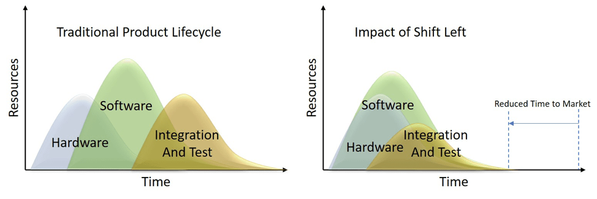
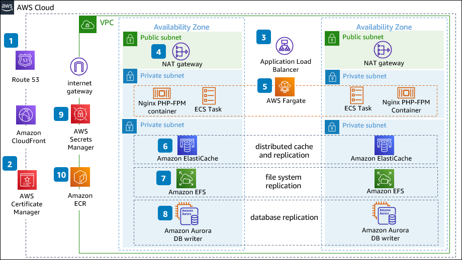

## 1. 서론: '나중에 고치는 것'의 대가 – 왜 사전 예방인가?

오늘날 소프트웨어는 더 이상 특정 산업 분야에 국한된 도구가 아닙니다. 우리의 일상생활, 비즈니스 운영, 심지어 국가 기반시설에 이르기까지 사회의 모든 영역에 깊숙이 스며들어, 마치 복잡한 생명체의 신경망처럼 기능하고 있습니다. 스마트폰 앱을 통해 금융 거래를 하고, 클라우드 기반 플랫폼으로 전 세계와 협업하며, 자율주행 차량이 도로를 누비는 시대에 소프트웨어의 안정성과 신뢰성은 단순한 기술적 요구사항을 넘어, 우리의 삶의 질과 기업의 존폐를 결정짓는 핵심 요소가 되었습니다. 이러한 막중한 책임에도 불구하고, 소프트웨어 개발 현장에서는 여전히 끊임없이 터져 나오는 문제를 해결하느라 고군분투하는, 마치 '소방수'와 같은 상황을 자주 목격하곤 합니다.

### 개발 현장의 흔한 풍경: 긴급 패치, 밤샘 작업, 불타는 프로젝트

"오전 10시, 긴급 알림! 결제 시스템에 장애가 발생했습니다! 즉시 원인을 파악하고 롤백 또는 패치를 진행해야 합니다!"
"서비스 담당자로부터 전화가 왔어요. 특정 기능 사용 시 속도가 너무 느리다는 불만이 폭주하고 있습니다. 고객들이 이탈하고 있어요!"
"팀장님, QA팀에서 보고한 버그가 너무 많아서 이대로는 다음 주 출시가 불가능합니다. 일정 재조정이 필요합니다!"

이러한 메시지들은 소프트웨어 개발팀이 일상적으로 직면하는 위기 상황의 단면을 보여줍니다. 예측 불가능한 시스템 오류, 심각한 성능 저하, 뒤늦게 발견되는 치명적인 보안 취약점 등은 개발자들을 '소방수' 역할로 내몰기 일쑤입니다. 한밤중이나 주말에도 울리는 장애 알림, 급하게 소집된 회의와 밤샘 작업, 그리고 마감일을 맞추기 위해 벼락치기식으로 진행되는 개발은 이제 너무나 익숙한 풍경이 되어버렸습니다. 프로젝트는 비상등을 켜고, 팀원들은 지쳐 쓰러지기 일보 직전의 '번아웃(Burnout)' 상태에 이릅니다.

이러한 '불타는 프로젝트'의 핵심에는 문제 발생 후 대응하는 **사후 대응(Reactive)** 방식의 개발 문화가 깊이 자리 잡고 있습니다. 개발 초기 단계에서는 주로 기능 구현에만 집중하고, 시스템의 안정성, 확장성, 보안, 유지보수성 등과 같은 **비기능적 요구사항(Non-Functional Requirements, NFRs)**에 대한 깊은 고려가 부족하거나, 혹은 "일단 돌아가게 만들고 나중에 고치자"는 생각으로 쉽게 간과되는 경향이 있습니다. 언뜻 보면 이는 개발 속도를 높이는 효율적인 방법처럼 보일 수 있습니다. 당장 눈앞의 기능 개발에만 몰두하면 단기적인 생산성이 올라가는 것처럼 느껴지기 때문입니다. 하지만 이는 마치 부실한 기초 위에 건물을 짓는 것과 다름없습니다. 겉으로는 멀쩡해 보이지만, 작은 충격에도 언제든 무너질 수 있는 위태로운 상태인 것입니다.

이러한 접근 방식은 필연적으로 **기술 부채(Technical Debt)**를 눈덩이처럼 불려나가게 합니다. 기술 부채는 소프트웨어의 품질을 저해하는 모든 요소들을 통칭하며, 마치 실제 부채처럼 이자가 붙어 미래의 개발 속도를 좀먹고, 시스템의 안정성을 위협하며, 결국에는 천문학적인 비용과 시간을 요구하는 대형 장애나 서비스 중단으로 귀결되곤 합니다. 유명한 소프트웨어 개발자 마틴 파울러(Martin Fowler)는 기술 부채를 "지금 빨리 가기 위해 미래에 지불해야 할 비용"이라고 정의했습니다. 당장의 편리함을 위해 미래의 고통을 저당 잡히는 것이죠. 개발자 개인의 입장에서도 이러한 환경은 매우 해롭습니다. 반복적인 '땜질 처방'과 긴급 대응에 매몰되면서 본질적인 문제 해결 능력이나 혁신적인 아이디어를 구현할 기회를 잃게 되고, 이는 결국 개인의 성장 정체와 높은 이직률로 이어지는 악순환의 고리가 됩니다.

### 문제 발생 후 대응의 한계와 비용

'나중에 고치는 것'의 대가는 생각보다 훨씬 더 혹독하고 복잡합니다. 소프트웨어 개발 생명 주기(Software Development Life Cycle, SDLC) 전반에 걸쳐 문제 발견 시점이 늦어질수록, 해당 문제를 수정하는 데 필요한 비용과 노력은 기하급수적으로 증가한다는 것은 소프트웨어 공학의 오랜 통찰이자 보편적인 원칙입니다. 이를 가장 잘 설명하는 것이 바로 **'Boehm의 법칙'** 또는 **'코스트 오브 체인지(Cost of Change) 곡선'**입니다. 이 원칙에 따르면, 요구사항 분석 단계에서 발견된 오류를 수정하는 비용을 1x라고 할 때, 설계 단계에서는 5-10x, 구현 단계에서는 10-50x, 그리고 심지어 운영 단계에서 발견된 동일한 오류를 수정하는 비용은 100-1000x에 달할 수 있다고 설명합니다.

예를 들어, 핵심 비즈니스 로직에 중대한 설계상 오류가 있음을 서비스 출시 후 운영 환경에서 발견했다고 가정해봅시다. 이 오류는 단순한 코드 한 줄의 문제가 아니라, 시스템의 근본적인 아키텍처나 데이터 모델을 재고해야 하는 상황일 수 있습니다. 이미 수많은 기능들이 이 잘못된 설계 위에서 구현되었을 것이고, 관련 서비스들이 배포되어 활발히 운영되고 있을 것입니다. 이 경우, 해당 오류를 수정하기 위해서는 단순히 개발 인력의 추가 투입, 밤샘 작업, 긴급 서버 증설과 같은 **직접적인 비용**뿐만 아니라, 훨씬 더 광범위하고 치명적인 **간접적인 비용**이 발생합니다.

*   **직접적인 비용:**
    *   **재작업(Rework) 비용:** 이미 작성된 코드를 폐기하고 재작성하는 비용. 이는 단순히 개발 시간뿐만 아니라, 관련 문서를 업데이트하고, 테스트 케이스를 수정하는 등의 부수적인 작업까지 포함합니다.
    *   **디버깅 및 테스트 비용:** 복잡한 시스템에서 오류의 근본 원인을 찾아내고, 수정된 부분이 다른 부분에 영향을 미치지 않는지 철저히 재검증하는 데 드는 막대한 시간과 리소스.
    *   **긴급 인프라 비용:** 서비스 중단 시 급하게 서버를 증설하거나 네트워크 대역폭을 늘리는 등 예상치 못한 인프라 비용.
    *   **인력 투입 비용:** 비상 상황에 투입되는 개발자, 운영자, QA 인력의 추가 인건비 (야근 수당, 주말 근무 수당 등).

*   **간접적인 비용:**
    *   **서비스 중단 및 매출 손실:** 금융, 전자상거래, 게임 등 실시간 서비스의 경우, 단 몇 분의 다운타임도 수십억 원의 매출 손실로 이어질 수 있습니다. 미국의 한 통계에 따르면, 기업의 시간당 다운타임 비용은 평균 5,600달러(약 750만 원) 이상이며, 일부 기업은 수십만 달러에 달한다고 합니다.
    *   **고객 불만 및 이탈:** 불안정한 서비스는 고객의 신뢰를 무너뜨리고, 결국 경쟁사로의 이탈을 가속화합니다. 이는 장기적인 고객 생애 가치(Customer Lifetime Value) 손실로 이어집니다.
    *   **기업 이미지 및 브랜드 가치 손상:** 반복되는 장애나 보안 사고는 기업의 명성을 실추시키고, 회복하기 어려운 부정적인 이미지를 각인시킬 수 있습니다. 이는 투자 유치, 인재 확보 등 기업의 미래에도 악영향을 미칩니다.
    *   **법적 및 규제 준수 문제:** 개인정보 유출, 금융 시스템 장애 등은 막대한 벌금이나 법적 소송으로 이어질 수 있습니다. GDPR, HIPAA 등 강화된 규제들은 이러한 위험을 더욱 증대시킵니다.
    *   **직원 사기 저하 및 번아웃:** 잦은 비상 상황과 밤샘 작업은 개발팀의 사기를 떨어뜨리고, 스트레스와 피로 누적으로 인한 번아웃을 유발합니다. 이는 생산성 저하, 결함 증가, 그리고 궁극적으로 핵심 인력의 이탈로 이어지는 악순환을 만듭니다.

더욱이, 사후 대응은 본질적인 문제 해결보다는 임시방편적인 '땜질 처방'에 그치는 경우가 많습니다. 급하게 적용된 패치들은 또 다른 버그를 유발하거나 시스템의 복잡성을 증가시켜, 시간이 지날수록 시스템은 더욱 취약하고 예측 불가능해집니다. 이는 마치 밑 빠진 독에 아무리 열심히 물을 부어도 채울 수 없는 것처럼, 사후 대응만으로는 근본적인 시스템의 안정성과 품질을 확보하기 어렵습니다. 결국 이러한 악순환은 개발 팀의 자율성을 저해하고, 혁신적인 기능을 개발할 여유를 빼앗으며, 시장 경쟁사 대비 뒤처지는 결과를 초래할 수 있습니다. 스티브 잡스는 "품질은 양보다 훨씬 중요하다. 최고급 바이올린은 수백 개의 평범한 바이올린보다 훨씬 가치가 있다"고 말했습니다. 이는 소프트웨어에도 동일하게 적용됩니다.

### 사전 예방 시스템 엔지니어링(Preventative Systems Engineering)의 등장 배경 및 필요성

이러한 문제의식 속에서, 소프트웨어 개발 패러다임의 근본적인 변화를 요구하는 목소리가 높아졌고, 그 결과로 등장한 것이 바로 **사전 예방 시스템 엔지니어링(Preventative Systems Engineering, 이하 PSE)**입니다. PSE는 문제 발생 후 대응하는 전통적인 '소방수' 역할에서 벗어나, 시스템 개발 생명 주기 전반에 걸쳐 잠재적인 문제점과 위험 요소를 사전에 식별하고, 이를 체계적으로 예방하며, 궁극적으로는 견고하고 안정적이며 지속 가능한 시스템을 구축하는 데 중점을 둡니다. 이는 단순히 '버그를 미리 잡자'는 수준을 넘어, 시스템의 복잡성을 관리하고, 미래의 위험을 최소화하며, 예측 가능한 개발 환경을 조성하려는 철학이자 접근 방식입니다.

PSE의 등장은 현대 소프트웨어 시스템이 직면한 다음과 같은 중대한 도전 과제들에 대한 해답을 제시합니다.

1.  **폭발적인 시스템 복잡성 증가:** 클라우드 컴퓨팅, 마이크로서비스 아키텍처, 분산 시스템, 서버리스, IoT, AI/ML 등 최신 기술의 도입은 시스템을 전례 없이 유연하고 강력하게 만들었지만, 동시에 예측하기 어려운 새로운 형태의 실패 지점과 취약점을 만들어냈습니다. 단일 장애 지점(Single Point of Failure)이 시스템 전체를 마비시키는 경우를 막기 위해, 시스템의 복원력(Resilience), 가용성(Availability), 내결함성(Fault Tolerance)을 설계 단계부터 심도 있게 고려해야 하는 필요성이 증대되었습니다.

2.  **높아진 비즈니스 및 사회적 영향력:** 소프트웨어는 이제 단순한 보조 도구가 아니라, 금융 거래, 의료 시스템, 교통 통제, 국가 안보 등 사회의 핵심 인프라를 직접 구동합니다. 이러한 시스템의 장애는 단순히 불편을 넘어, 경제적 손실, 인명 피해, 사회적 혼란 등 돌이킬 수 없는 치명적인 결과를 초래할 수 있습니다. 이로 인해 소프트웨어에 대한 신뢰성과 안전성 요구 수준이 과거와는 비교할 수 없을 정도로 높아졌습니다.

3.  **가속화되는 시장 경쟁과 출시 압박:** 애자일(Agile), 데브옵스(DevOps) 문화의 확산으로 소프트웨어 출시 주기는 현저히 짧아졌습니다. '빠른 출시'가 경쟁력의 핵심이 되었지만, 이 속도 경쟁 속에서 품질과 안정성을 간과한다면, 결국 앞서 언급한 막대한 대가를 치르게 됩니다. PSE는 '빠르게' 만들되 '제대로' 만들어서, 지속 가능한 속도를 유지할 수 있도록 돕습니다. 이는 즉, 'Shift-Left' 사고방식과 일맥상통합니다. 개발 생명 주기의 가능한 한 초기 단계에서부터 품질과 안정성을 고려하자는 것입니다.

    
    
4.  **점점 더 정교해지는 보안 위협:** 데이터 유출, 랜섬웨어 공격, 서비스 마비 등 사이버 보안 위협은 기업에 치명적인 영향을 미칠 수 있습니다. 보안은 더 이상 시스템 구축 후 '나중에 덧붙이는' 기능이 아니라, 기획 단계에서부터 설계에 내재되어야 할 핵심 요소가 되었습니다. '보안 바이 디자인(Security by Design)'의 원칙이 PSE의 중요한 축을 이룹니다.

PSE는 이러한 현대 소프트웨어 개발의 복잡하고 다층적인 도전 과제에 대한 종합적인 해답을 제시합니다. 이는 '품질은 최종 검사 단계에서 주입되는 것이 아니라, 설계 단계에서부터 내재되어야 한다'는 품질 관리의 보편적인 원칙과 궤를 같이 합니다. 즉, 요구사항 분석 단계에서부터 잠재적 위험을 식별하고, 아키텍처 설계에서 견고함과 복원력을 확보하며, 코드 구현 단계에서 오류를 줄이고, 테스트 단계에서 철저히 검증하며, 배포 및 운영 단계에서 지속적으로 모니터링하고 개선하는 전 과정이 유기적으로 연결되어야 함을 강조합니다.

결론적으로, 사전 예방 시스템 엔지니어링은 더 이상 선택 사항이 아닌, 현대 개발 조직의 필수적인 역량입니다. 이는 단기적인 개발 속도보다는 장기적인 시스템의 안정성과 지속 가능성을 추구하며, '불타는 프로젝트'의 악순환을 끊고 예측 가능하며 효율적인 개발 문화를 정착시키는 길입니다. 궁극적으로 PSE는 개발자들이 단순히 코드를 작성하는 것을 넘어, 시스템 전체의 '수호자'이자 '설계자'로서 역할을 수행하도록 돕고, 이를 통해 더욱 신뢰할 수 있고 가치 있는 소프트웨어를 세상에 선보일 수 있게 할 것입니다. 다음 장에서는 사전 예방 시스템 엔지니어링이 정확히 무엇인지, 그리고 전통적인 시스템 엔지니어링과의 차이점을 통해 그 본질을 더욱 깊이 이해해 보도록 하겠습니다.

## 2. 사전 예방 시스템 엔지니어링이란 무엇인가?

지난 서론에서 우리는 문제 발생 후 사후 대응하는 방식이 야기하는 막대한 대가와, 이러한 악순환에서 벗어나기 위한 사전 예방의 중요성을 논했습니다. 이제 우리는 이 '사전 예방 시스템 엔지니어링(Preventative Systems Engineering, 이하 PSE)'이라는 개념이 정확히 무엇을 의미하며, 어떤 본질을 담고 있는지 깊이 있게 탐구하고자 합니다. 이는 단순히 개발 방법론이나 특정 도구의 나열을 넘어, 시스템을 바라보고 구축하는 근본적인 관점의 전환을 의미합니다.

### 단순한 '버그 잡기'를 넘어선 시스템적 사고

많은 개발자들에게 '버그 잡기'는 일상적인 업무의 일부입니다. 그러나 PSE는 단순히 코딩 오류나 기능적 결함을 수정하는 수준의 '버그 잡기'를 훨씬 뛰어넘습니다. 이는 마치 질병의 증상만을 치료하는 것이 아니라, 질병의 근본 원인을 찾아내고 예방하는 의학적 접근과 유사합니다.

PSE는 버그를 시스템의 **결함(Defect)** 또는 **실패 모드(Failure Mode)**로 간주하며, 이러한 결함이 발생하기 전에 미리 인지하고 제거하거나, 그 발생 가능성을 최소화하는 데 주력합니다. 여기서 중요한 것은 '결함'이 단순히 코드 한 줄의 오타나 논리적 오류만을 의미하는 것이 아니라는 점입니다. 모호한 요구사항, 부적절한 아키텍처 설계, 비효율적인 개발 프로세스, 심지어 팀원 간의 소통 부재 등 시스템의 **전체적인 맥락**에서 발생할 수 있는 모든 잠재적 문제점을 포괄합니다.

이는 **시스템적 사고(Systems Thinking)**를 기반으로 합니다. 시스템적 사고는 개별 구성 요소만을 보는 것이 아니라, 구성 요소들 간의 상호작용과 전체적인 흐름 속에서 문제를 이해하려는 접근 방식입니다. 예를 들어, 웹 서비스의 응답 속도가 느려지는 문제가 발생했을 때, 단순한 코드 최적화만을 고려하는 것이 아니라, 데이터베이스 쿼리 효율성, 네트워크 지연, 서버 리소스 부족, 캐싱 전략의 부재, 심지어 동시 접속자 수 증가에 대한 아키텍처적 대응 미흡 등 시스템을 구성하는 모든 요소와 그들의 연관성을 종합적으로 분석하여 근본적인 해결책을 찾는 것입니다.

품질 관리의 대가인 **W. Edwards Deming**은 "품질은 최종 검사 단계에서 주입되는 것이 아니라, 설계 단계에서부터 내재되어야 한다(Quality is built in, not inspected in)"고 강조했습니다. 이 명언은 PSE의 핵심 철학을 관통합니다. 문제가 터진 후에 허둥지둥 고치는 '사후 교정(Correction)' 방식이 아니라, 처음부터 문제가 발생할 여지를 최소화하도록 시스템을 설계하고 구현하는 '사전 예방(Prevention)'에 초점을 맞춥니다. 이는 '결함 발견(Defect Detection)'을 넘어 '결함 예방(Defect Prevention)'으로의 패러다임 전환을 의미합니다. 오류를 찾아내기 위해 시간을 쓰는 대신, 오류가 처음부터 발생하지 않도록 프로세스와 설계를 개선하는 데 집중하는 것입니다.

이러한 시스템적 사고를 통해 개발팀은 단순히 기능 구현에 급급하는 것을 넘어, 미래의 시스템 안정성, 확장성, 보안성, 그리고 유지보수성까지 고려하는 장기적인 관점을 갖게 됩니다. 이는 궁극적으로 개발 초기 단계에서 발생하는 작은 투자와 노력이, 시스템 생명 주기 후반부에서 발생할 수 있는 막대한 손실을 효과적으로 막아주는 방패 역할을 하게 됩니다.

### 전체 생명 주기(Life Cycle) 관점에서의 위험 관리

PSE는 소프트웨어 개발의 특정 단계에만 국한되지 않습니다. 오히려 시스템의 **전체 생명 주기(Life Cycle)**, 즉 아이디어 구상 단계부터 요구사항 분석, 설계, 구현, 테스트, 배포, 운영, 유지보수, 그리고 심지어 시스템 폐기에 이르기까지 모든 과정에 걸쳐 잠재적인 위험을 체계적으로 관리하는 접근 방식입니다. 이는 시스템이 살아 숨 쉬는 유기체와 같다고 인식하며, 각 생명 주기 단계마다 특정한 형태의 위험이 존재하고, 이를 적절히 관리해야 한다는 철학을 내포합니다.

**위험 관리(Risk Management)**는 PSE의 핵심 축입니다. 여기서 위험이란 단순히 '코드가 작동하지 않는 것'만을 의미하지 않습니다. 시스템 장애, 보안 침해, 성능 저하, 예산 초과, 일정 지연, 심지어 법적 문제나 사용자 불만족까지, 프로젝트와 시스템에 부정적인 영향을 미칠 수 있는 모든 불확실성을 포괄합니다. PSE는 이러한 위험을 단순히 회피하는 것을 넘어, 위험을 **식별(Identification)**하고, **분석(Analysis)**하며(발생 확률과 영향도), **완화(Mitigation)**하고, **모니터링(Monitoring)**하는 일련의 과정을 개발의 모든 단계에 통합시킵니다.

*   **요구사항 단계:** 모호하거나 불완전한 요구사항은 미래의 오해와 재작업의 근본 원인이 됩니다. 이 단계에서는 요구사항의 명확성, 일관성, 그리고 테스트 가능성을 검토하여 잠재적 위험을 식별합니다. 비기능적 요구사항(예: 성능, 보안)을 명확히 정의함으로써 미래의 병목 현상이나 취약점을 사전에 방지합니다.
*   **설계 단계:** 시스템 아키텍처의 부적절한 설계는 확장성 문제, 성능 저하, 유지보수의 어려움 등을 야기합니다. PSE는 이 단계에서 **장애 모드 및 영향 분석(FMEA: Failure Mode and Effects Analysis)**이나 **위협 모델링(Threat Modeling)**과 같은 기법을 활용하여 잠재적 실패 지점이나 보안 취약점을 예측하고, 이를 견고한 설계로써 완화합니다. 예를 들어, 분산 시스템의 각 컴포넌트가 독립적으로 실패하더라도 전체 시스템이 마비되지 않도록 복원력 있는 패턴(Circuit Breaker, Bulkhead 등)을 적용하는 것이 이에 해당합니다.
*   **구현 단계:** 코딩 컨벤션 미준수, 비효율적인 알고리즘, 부적절한 예외 처리 등은 버그와 보안 취약점의 직접적인 원인이 됩니다. 코드 리뷰, 정적/동적 코드 분석 도구 활용, 테스트 주도 개발(TDD) 등을 통해 결함을 조기에 발견하고 예방합니다.
*   **테스트 및 검증 단계:** 단순히 기능이 작동하는지 확인하는 것을 넘어, 시스템이 다양한 부하 조건, 악의적인 공격, 예외 상황에서도 견고하게 동작하는지 검증합니다. 성능 테스트, 보안 테스트, 스트레스 테스트 등은 잠재적 위험을 운영 환경에 배포하기 전에 노출시키고 해결하는 핵심적인 예방 활동입니다.
*   **배포 및 운영 단계:** CI/CD 파이프라인을 통한 자동화된 배포, 체계적인 모니터링, 로깅, 알림 시스템 구축은 운영 중 발생할 수 있는 문제를 조기에 감지하고 신속하게 대응할 수 있도록 돕습니다. 장애 발생 시 **블레임리스 포스트모템(Blameless Postmortem)** 문화를 통해 개인의 잘못을 지적하기보다는 시스템과 프로세스의 개선점을 찾아 재발을 방지하는 것도 중요한 위험 관리 활동입니다.

PSE는 이러한 생명 주기 전반에 걸쳐 위험을 끊임없이 평가하고, 우선순위를 정하며, 그에 맞는 예방 활동을 통합함으로써, 시스템의 안정성과 신뢰성을 점진적으로 높여나가는 지속적인 프로세스를 강조합니다.

### '시스템'의 정의 확장: 코드, 인프라, 프로세스, 사람까지

사전 예방 시스템 엔지니어링에서 말하는 '시스템'은 단순히 우리가 작성하는 코드나 소프트웨어 애플리케이션만을 의미하지 않습니다. 이는 시스템을 구성하는 모든 요소를 포함하는 훨씬 더 광범위하고 포괄적인 개념입니다. PSE는 소프트웨어 시스템을 **코드(Software)**, **하드웨어/인프라(Hardware/Infrastructure)**, **프로세스(Process)**, 그리고 **사람(People)**의 네 가지 핵심 구성 요소가 상호작용하는 복합적인 엔티티로 간주합니다. 이 네 가지 요소 중 어느 하나라도 문제가 발생하면 전체 시스템의 안정성과 효율성에 치명적인 영향을 미칠 수 있습니다.

*   **코드 (Software):** 물론, 가장 기본적인 구성 요소입니다. 기능적 정확성, 성능 효율성, 보안 취약점 유무, 그리고 유지보수 용이성 등이 중요합니다. 클린 코드(Clean Code), 테스트 주도 개발(TDD), 코드 리뷰, 정적/동적 코드 분석 도구 활용 등은 코드 품질을 사전에 확보하는 핵심 예방 활동입니다. "코드 품질이 곧 소프트웨어 품질이다"라는 말처럼, 잘 작성된 코드는 그 자체로 미래의 버그와 복잡성을 예방하는 가장 강력한 수단입니다.

*   **하드웨어 및 인프라 (Hardware & Infrastructure):** 서버, 네트워크, 데이터베이스, 스토리지, 그리고 클라우드 환경(가상 머신, 컨테이너, 네트워크 설정, 로드 밸런서 등)과 같은 물리적/논리적 기반 시설을 포함합니다. 인프라의 불안정성은 소프트웨어 자체의 문제가 없더라도 서비스 장애를 유발할 수 있습니다. **인프라스트럭처 애즈 코드(Infrastructure as Code, IaC)**를 통해 인프라 환경을 코드처럼 관리하고 자동화하며, 고가용성(High Availability) 및 재해 복구(Disaster Recovery) 아키텍처를 설계하는 것은 인프라 관련 문제를 사전에 예방하는 중요한 접근 방식입니다. 예를 들어, 특정 데이터센터에 장애가 발생하더라도 다른 데이터센터로 자동 전환되도록 시스템을 설계하는 것이 이에 해당합니다.

*   **프로세스 (Process):** 시스템을 개발하고 운영하는 데 사용되는 모든 절차와 워크플로우를 의미합니다. 요구사항 수집 방식, 아키텍처 설계 방법, 코드 통합 및 배포 프로세스(CI/CD), 테스트 전략, 장애 대응 절차 등이 포함됩니다. 비효율적이거나 불분명한 프로세스는 소통 오류, 지연, 품질 저하의 직접적인 원인이 됩니다. 애자일(Agile) 방법론, 데브옵스(DevOps) 문화, 표준화된 코드 리뷰 절차, 그리고 명확한 비상 대응 계획(Runbook) 등은 프로세스상의 위험을 예방하고 효율성을 높이는 데 기여합니다. 프로세스가 견고해야 예측 가능하고 안정적인 개발 및 운영이 가능합니다.

*   **사람 (People):** 시스템을 기획하고, 설계하며, 구현하고, 테스트하고, 운영하는 모든 개발자, 엔지니어, 관리자, 사용자 등 인간적인 요소를 포함합니다. '사람'은 시스템의 가장 중요한 부분이면서도 가장 예측하기 어려운 요소입니다. 의사소통의 부재, 지식 공유의 부족, 피로 누적, 문화적 문제 등은 기술적 문제 못지않게 치명적인 시스템 실패의 원인이 될 수 있습니다. PSE는 팀원 간의 투명한 소통, 지식 공유 문화 구축, 적절한 교육 및 훈련, 그리고 심리적 안정감을 제공하는 문화(Psychological Safety)를 강조합니다. 이는 팀원들이 오류를 두려워하지 않고 솔직하게 문제를 공유하며, 함께 학습하고 개선해나갈 수 있는 환경을 조성하는 데 필수적입니다. '인간은 실수한다(To err is human)'는 전제하에, 인간의 실수가 시스템 실패로 이어지지 않도록 시스템과 프로세스를 설계하는 것이 중요합니다.

이러한 네 가지 요소가 상호 의존적이며, 하나의 문제점이 다른 요소에 연쇄적으로 영향을 미칠 수 있다는 점을 이해하는 것이 PSE의 핵심입니다. 예를 들어, 코딩의 버그(코드)는 부적절한 테스트 프로세스(프로세스)로 인해 운영 환경까지 도달할 수 있고, 이는 결국 인프라 장애(인프라)를 유발하여 사용자의 불만(사람)으로 이어질 수 있습니다. 따라서 PSE는 이 모든 요소들을 통합적으로 고려하여 총체적인 관점에서 위험을 예방하고 시스템의 견고함을 확보하는 데 주력합니다.

### 전통적인 시스템 엔지니어링과의 차이점 및 강조점

'시스템 엔지니어링'이라는 용어는 원래 항공우주, 국방, 대규모 산업 설비 등 복잡하고 대규모의 물리적 시스템을 설계, 구현, 운영하는 분야에서 발전해 왔습니다. 국제 시스템 엔지니어링 협회(INCOSE)는 시스템 엔지니어링을 "요구사항 정의부터 최종 시스템의 통합 및 검증에 이르기까지 복잡한 시스템의 개발 및 관리에 대한 학제 간 접근 방식과 수단"으로 정의합니다. 이러한 전통적인 시스템 엔지니어링은 시스템의 전체 생명 주기를 다루며, 다양한 분야의 지식을 통합하여 복잡한 문제를 해결하는 데 중점을 둡니다.

그렇다면 '사전 예방 시스템 엔지니어링(PSE)'은 전통적인 시스템 엔지니어링과 어떻게 다르며, 무엇을 특별히 강조하는 것일까요? PSE는 전통적인 시스템 엔지니어링의 핵심 원칙을 계승하면서도, 특히 현대 소프트웨어 중심의 복잡한 시스템 환경에서 **'예방'**이라는 요소에 극대화된 방점을 찍습니다.

1.  **'사후 대응'에서 '사전 예방'으로의 전환:**
    *   **전통적 SE:** 문제 해결(Problem Solving)과 관리(Management)에 중점을 두지만, 예방의 중요성을 인식하더라도 '어떤 문제가 발생할 수 있는지'에 대한 예측보다는 '문제가 발생했을 때 어떻게 해결할 것인가'에 더 집중하는 경향이 있을 수 있습니다.
    *   **PSE:** 모든 단계에서 **잠재적 위험을 적극적으로 예측하고 제거**하는 데 최고의 가치를 둡니다. '무엇이 잘못될 수 있는가?'라는 질문을 끊임없이 던지고, 그에 대한 예방책을 시스템 설계와 프로세스에 내재화하는 것을 최우선으로 합니다. 이는 '방어적 설계(Defensive Design)'의 철학을 시스템 전반에 적용하는 것과 같습니다.

2.  **'Shift-Left' 사고방식의 극대화:**
    *   **전통적 SE:** 생명 주기 전체를 다루지만, 실제적인 문제 해결 및 테스트는 후반 단계에 집중될 수 있습니다.
    *   **PSE:** 문제가 더 비싸고 해결하기 어려운 하류(Downstream) 단계로 흘러가지 않도록, **가능한 한 개발 생명 주기의 초기 단계(좌측, Left)**에서 품질, 보안, 안정성, 성능 등의 비기능적 요구사항을 충분히 고려하고 반영하는 것을 강조합니다. 예를 들어, 보안 취약점 분석은 코딩 완료 후가 아니라, 설계 단계에서부터 위협 모델링을 통해 시작되어야 한다는 식입니다.

3.  **소프트웨어 및 '사람' 요소의 강조:**
    *   **전통적 SE:** 주로 하드웨어 중심의 물리적 시스템에 대한 적용 사례가 많으며, 시스템을 구성하는 '사람'과 '프로세스' 요소를 다루지만, 주로 기술적 측면에 초점을 맞춥니다.
    *   **PSE:** 복잡한 소프트웨어 시스템의 특성(예: 급변하는 요구사항, 높은 추상화, 분산 환경)을 깊이 이해하고 이에 맞는 예방 전략을 제시합니다. 또한, '사람'이 시스템의 오류를 유발할 수도 있지만, 동시에 '사람'이야말로 예방 활동의 가장 중요한 주체임을 인식하여, 조직 문화, 소통, 학습 등 인적 요소를 적극적으로 관리하고 개선하는 데 큰 비중을 둡니다.

4.  **지속적인 학습과 개선의 문화:**
    *   **전통적 SE:** 프로젝트 기반으로 시스템을 완성하고 전달하는 데 초점을 맞추는 경향이 있습니다.
    *   **PSE:** 시스템은 배포 후에도 계속해서 변화하고 진화하며, 새로운 위험에 노출될 수 있다는 점을 인식합니다. 따라서 장애 발생 후의 **블레임리스 포스트모템(Blameless Postmortem)**을 통해 개인을 비난하는 대신 시스템과 프로세스의 개선점을 찾아 끊임없이 학습하고 재발을 방지하는 문화를 장려합니다. 이는 '예방의 선순환'을 구축하는 핵심 요소입니다.

이처럼 사전 예방 시스템 엔지니어링은 전통적인 시스템 엔지니어링의 견고한 기반 위에 '예방'이라는 철학을 더욱 강력하게 주입하고, 현대 소프트웨어 개발의 특성과 도전 과제에 맞춰 그 범위를 확장한 진화된 접근 방식이라고 할 수 있습니다. 이는 개발팀이 단순히 '일을 하는' 것을 넘어, '더 잘 일하고' '더 안전하게 일하는' 방법을 끊임없이 탐구하고 적용하도록 이끌 것입니다. 다음 장에서는 이러한 사전 예방의 철학이 왜 현대 소프트웨어 개발에 있어 필수불가결한 요소가 되었는지, 즉 사후 대응의 늪에서 벗어나기 위한 구체적인 이유들을 살펴보겠습니다.

## 3. 왜 사전 예방인가?

우리는 앞서 소프트웨어 개발 현장에서 흔히 목격되는 '소방수' 역할의 비효율성과 '나중에 고치는 것'이 초래하는 막대한 대가에 대해 심도 깊게 논의했습니다. 그렇다면 사전 예방 시스템 엔지니어링(PSE)을 도입하고 실천하는 것이 왜 그토록 중요하며, 사후 대응의 늪에서 벗어나기 위해 반드시 필요한가요? 이 장에서는 PSE가 제공하는 핵심적인 이점들을 구체적으로 살펴보며, 개발 조직과 비즈니스 전체에 미치는 긍정적인 파급효과를 조명하고자 합니다.

### 기술 부채(Technical Debt)의 누적 방지

기술 부채는 오늘날 소프트웨어 개발자들이 가장 심각하게 인식하고 있는 문제 중 하나입니다. 워드 커닝햄(Ward Cunningham)이 처음 제안한 이 개념은 소프트웨어 시스템의 설계나 코드가 좋지 않아 미래에 추가적인 비용을 유발하는 상황을 비유합니다. 그는 "지금 빨리 가기 위해 미래에 지불해야 할 비용"이라고 기술 부채를 정의하며, 마치 실제 금융 부채처럼 원금(나쁜 설계나 코드)에 이자(유지보수 어려움, 버그 발생률 증가 등)가 붙어 시간이 지날수록 갚기 어려워진다고 설명했습니다.

기술 부채는 다양한 방식으로 누적됩니다. 촉박한 마감일 때문에 '일단 작동하게만 만드는' 임시방편적인 해결책을 선택하거나, 확장성이나 유지보수성을 고려하지 않은 조악한 설계, 혹은 잘못된 아키텍처 결정 등이 대표적입니다. 개발팀 내에서 명확한 코딩 표준이나 디자인 원칙이 부재하거나, 충분한 코드 리뷰 없이 기능 구현에만 급급할 때도 기술 부채는 빠르게 쌓여갑니다. 이 부채가 일정 수준 이상으로 쌓이면, 새로운 기능을 추가하거나 기존 기능을 수정하는 것이 점점 더 어려워지고, 사소한 변경에도 예상치 못한 버그가 발생하며, 전체 시스템의 복잡성은 통제 불가능한 수준으로 증가합니다. 이는 결국 개발 속도 저하, 잦은 장애 발생, 그리고 개발팀의 사기 저하로 이어지는 악순환의 핵심 원인이 됩니다.

사전 예방 시스템 엔지니어링은 이러한 기술 부채의 누적을 근본적으로 방지하는 데 주력합니다. PSE는 개발 생명 주기 초반부터 **품질을 내재화**하는 데 집중합니다. 요구사항 분석 단계에서부터 모호함을 제거하고, 확장성과 안정성을 고려한 견고한 아키텍처를 설계하며, 클린 코드(Clean Code) 원칙과 테스트 주도 개발(TDD)을 통해 고품질의 코드를 작성하도록 유도합니다. 코드 리뷰와 정적/동적 코드 분석 도구를 활용하여 잠재적 결함을 조기에 발견하고 수정하며, 지속적인 리팩토링(Refactoring)을 통해 코드베이스를 건강하게 유지합니다. 예를 들어, 한 개발팀이 특정 모듈의 복잡성이 지나치게 높다는 정적 분석 결과를 발견했을 때, PSE 관점에서는 이를 단순히 '경고'로 치부하는 것이 아니라, 해당 모듈이 미래에 버그를 유발하고 유지보수를 어렵게 할 잠재적 기술 부채임을 인지하고, 즉시 리팩토링 계획을 수립하여 해결합니다. 이처럼 기술 부채를 '빚'으로 인식하고, 사전에 예방하거나 발생 즉시 '갚는' 문화를 정착시키는 것이 PSE의 핵심 목표 중 하나입니다. 이는 마치 자동차를 정기적으로 점검하고 관리하여 고장을 예방하는 것과 같습니다. 적절한 예방 정비는 예상치 못한 고장으로 인한 막대한 수리 비용과 시간을 절약해 줍니다.

### 장애 및 다운타임 최소화

현대 사회에서 소프트웨어 시스템의 장애나 다운타임은 단순한 불편을 넘어, 비즈니스에 직접적인 타격을 입히고 고객 신뢰를 심각하게 훼손하는 치명적인 결과를 초래합니다. 2021년 페이스북(현 Meta)의 6시간 서비스 장애는 전 세계 수십억 명의 사용자에게 영향을 미쳤고, 회사 주가 하락 및 광고 수익 손실로 이어졌습니다. 국내에서도 금융권의 전산 시스템 장애, 대형 온라인 쇼핑몰의 서버 다운은 매년 수십억 원 이상의 매출 손실과 수많은 고객 불만을 야기합니다. 데이터에 따르면, 많은 기업에게 시간당 다운타임 비용은 수천만 원에서 수억 원에 달하며, 심지어 특정 산업군에서는 그보다 훨씬 높다고 합니다.

사전 예방 시스템 엔지니어링은 이러한 장애와 다운타임을 최소화하는 데 핵심적인 역할을 수행합니다. PSE는 시스템 설계 단계에서부터 **고가용성(High Availability)**, **확장성(Scalability)**, 그리고 **복원력(Resilience)**을 최우선적으로 고려하도록 요구합니다.

*   **고가용성 설계:** 단일 장애 지점(Single Point of Failure)을 제거하고, 로드 밸런싱, 다중화(Redundancy), 클러스터링 등을 통해 시스템의 일부에 문제가 발생하더라도 전체 서비스가 중단되지 않도록 설계합니다. 예를 들어, 특정 서버가 다운되어도 다른 서버가 자동으로 부하를 분산받아 서비스를 이어가는 아키텍처를 구축하는 것입니다.
*   **복원력 강화:** 시스템 구성 요소 간의 의존성을 최소화하고, 장애 전파를 방지하는 패턴(예: Circuit Breaker, Bulkhead)을 적용하여, 한 부분의 실패가 전체 시스템으로 확산되지 않도록 방어합니다. 이는 마치 선박이 여러 개의 격실로 나뉘어 있어 한 격실에 물이 들어와도 다른 격실이 침수되지 않도록 하는 것과 유사합니다.
*   **철저한 테스트 및 검증:** 단위 테스트, 통합 테스트, 시스템 테스트는 물론, 예상치 못한 상황을 시뮬레이션하는 카오스 엔지니어링(Chaos Engineering)이나 장애 주입 테스트(Fault Injection Testing)를 통해 시스템의 약점을 사전에 파악하고 보완합니다. 넷플릭스의 카오스 몽키(Chaos Monkey)는 이러한 예방 활동의 대표적인 사례로, 운영 환경에서 무작위로 서버를 종료하여 시스템의 복원력을 테스트합니다.
*   **강력한 모니터링 및 알림 시스템:** 시스템 운영 중 발생하는 모든 이벤트를 실시간으로 모니터링하고, 이상 징후 발생 시 즉각적으로 관련 담당자에게 알림을 전송하여 문제가 심각해지기 전에 조치할 수 있도록 합니다. 이는 마치 항공기 조종실에서 수많은 계기판을 통해 비행 상태를 실시간으로 확인하며 잠재적 문제를 감지하는 것과 같습니다.

PSE를 통해 구축된 시스템은 '고장 나지 않는' 완벽한 시스템이 아니라, '고장이 나더라도 빠르게 회복하고 서비스 연속성을 유지할 수 있는' 견고한 시스템이 됩니다. 이는 비즈니스 연속성을 보장하고, 고객에게 끊김 없는 안정적인 서비스를 제공하여 기업의 신뢰도와 경쟁력을 극대화합니다.

### 보안 취약점 조기 발견 및 제거

오늘날 사이버 보안 위협은 단순한 기술적 문제를 넘어, 기업의 생존을 위협하는 가장 심각한 비즈니스 위험 요소 중 하나로 부상했습니다. 대규모 개인정보 유출, 랜섬웨어 공격, 서비스 마비 등은 기업에 막대한 금전적 손실(벌금, 보상금, 매출 손실 등)과 함께 회복하기 어려운 브랜드 이미지 손상, 그리고 법적 소송까지 야기할 수 있습니다. 이미 GDPR, CCPA와 같은 데이터 보호 규제는 기업에게 개인정보 보호에 대한 막중한 책임을 부여하고 있으며, 이를 위반할 시 천문학적인 벌금을 부과합니다.

전통적인 보안 접근 방식은 소프트웨어 개발이 완료된 후 취약점을 검사하고 수정하는 방식이었습니다. 이는 마치 건물이 완공된 후에야 내진 설계가 제대로 되었는지 확인하는 것과 같아서, 뒤늦게 발견된 취약점은 수정하는 데 막대한 비용과 시간이 소요되거나, 아예 수정 자체가 불가능한 경우도 많았습니다. 이에 반해 사전 예방 시스템 엔지니어링은 **'보안 바이 디자인(Security by Design)'**과 **'Shift-Left Security'**의 철학을 기반으로 합니다.

PSE는 보안을 개발 생명 주기의 가장 초기 단계부터 통합하여, 잠재적인 보안 취약점을 미리 식별하고 제거하는 데 집중합니다.

*   **요구사항 및 설계 단계에서의 위협 모델링(Threat Modeling):** 시스템이 직면할 수 있는 잠재적인 위협(예: 데이터 변조, 서비스 거부 공격, 권한 탈취)을 식별하고, 각 위협에 대한 방어 전략을 설계에 반영합니다. 이는 공격자의 관점에서 시스템을 분석하여 약점을 찾아내는 체계적인 과정입니다. 예를 들어, 민감한 개인정보를 다루는 서비스의 경우, 설계 단계에서부터 데이터 암호화, 접근 제어, 안전한 인증 메커니즘 등을 필수적으로 포함하도록 합니다.
*   **안전한 코딩 원칙 및 가이드라인 준수:** OWASP Top 10과 같은 주요 보안 취약점 목록을 참고하여 개발자들이 안전한 코드를 작성하도록 교육하고, 이를 코딩 표준에 반영합니다. 입력값 검증, 안전한 인증/인가 처리, 민감 정보 보호 등의 원칙을 철저히 준수합니다.
*   **자동화된 보안 테스트:** 정적 애플리케이션 보안 테스트(SAST) 도구를 통해 코딩 단계에서 잠재적인 취약점을 자동으로 검사하고, 동적 애플리케이션 보안 테스트(DAST) 도구를 통해 실행 중인 애플리케이션의 취약점을 분석합니다. 또한, 모의 침투 테스트(Penetration Testing)를 주기적으로 수행하여 실제 공격자의 관점에서 시스템의 방어 능력을 검증합니다.
*   **보안 전문가와의 협업:** 개발 초기부터 보안 전문가의 자문을 구하고, 주기적인 보안 검토를 통해 시스템 전반의 보안 수준을 강화합니다.

결국, PSE는 보안을 '나중에 덧붙이는(Add-on)' 요소가 아니라, 시스템의 '핵심적인 내재된(Built-in)' 요소로 간주함으로써, 사이버 공격으로부터 시스템과 데이터를 효과적으로 보호하고, 기업의 신뢰도와 규제 준수 역량을 강화합니다. 이는 "한 번의 예방이 열 번의 치료보다 낫다(An ounce of prevention is worth a pound of cure)"는 옛말이 보안 분야에서 가장 잘 적용되는 사례입니다.

### 개발 비용 및 시간 절감

소프트웨어 개발 프로젝트에서 예산을 초과하고 일정이 지연되는 것은 흔한 일입니다. 그 주된 원인 중 하나는 '재작업(Rework)'입니다. 잘못된 요구사항, 설계 오류, 혹은 구현 단계의 버그가 뒤늦게 발견되면, 이미 만들어진 부분을 상당 부분 폐기하고 다시 만들어야 하는데, 이는 막대한 시간과 자원 낭비를 초래합니다. 앞서 'Boehm의 법칙'에서 설명했듯이, 문제가 개발 생명 주기의 후반부로 갈수록 수정 비용은 기하급수적으로 증가합니다. 운영 환경에서 발견된 사소한 버그 하나를 수정하고 배포하는 데도 수많은 관계자의 협업, 테스트, 승인 과정이 필요하며, 이는 곧 비용으로 직결됩니다.

사전 예방 시스템 엔지니어링은 이러한 재작업과 불필요한 비용 발생을 최소화하여 궁극적으로 개발 비용과 시간을 절감하는 데 크게 기여합니다.

*   **조기 결함 발견 및 수정:** PSE는 요구사항 분석, 설계, 코딩 등 개발 초기 단계에서부터 잠재적 결함을 식별하고 수정하는 데 집중합니다. 예를 들어, 설계 리뷰 과정에서 특정 기능의 확장성 문제가 예상된다면, 코딩이 시작되기 전에 아키텍처를 변경하여 미래에 발생할 수 있는 대규모 재작업을 막을 수 있습니다. 이는 마치 건축에서 기초 공사를 튼튼히 하여 나중에 건물이 기울어지는 것을 막는 것과 같습니다.
*   **예측 가능성 향상:** 철저한 사전 예방 활동은 프로젝트의 위험 요소를 줄여, 개발 일정과 예산을 더 정확하게 예측할 수 있도록 돕습니다. 예측 가능한 개발은 불필요한 비상 투입이나 야근, 주말 근무 등을 줄여 인건비 초과를 방지합니다.
*   **자동화된 프로세스 구축:** CI/CD(Continuous Integration/Continuous Deployment) 파이프라인과 자동화된 테스트는 개발 효율성을 크게 높입니다. 코드 변경 시마다 자동으로 빌드, 테스트, 배포가 이루어지므로, 수동으로 인한 오류를 줄이고 개발 주기를 단축시킵니다. 이는 개발자가 반복적인 작업에 시간을 낭비하는 대신, 더욱 가치 있는 기능 개발에 집중할 수 있도록 합니다.
*   **유지보수 비용 절감:** PSE를 통해 구축된 견고하고 잘 정리된 시스템은 유지보수 비용을 현저히 낮춥니다. 버그 발생률이 낮고, 새로운 기능을 추가하거나 기존 기능을 수정하는 것이 용이해지며, 기술 부채가 적어 미래의 복잡성 관리 비용도 줄어듭니다. 시스템의 수명주기 전체를 놓고 볼 때, 초기 예방에 투자한 비용은 비교할 수 없을 정도로 큰 투자 회수(ROI)를 가져다줍니다.

PSE는 단순히 '비용을 절약'하는 것을 넘어, '자원을 효율적으로 배분'하고 '투자 대비 최대의 가치'를 창출하는 스마트한 개발 전략입니다.

### 팀 생산성 및 사기 증진

끊임없이 발생하는 장애와 긴급 패치, 불확실한 일정, 그리고 누적되는 기술 부채는 개발팀의 사기를 저하시키고 번아웃을 유발하는 주요 원인입니다. 개발자들이 매일 '소방수' 역할에 시달리고, 본인의 노력이 일회성 땜질 처방으로만 끝나며, 개선의 여지가 보이지 않는 환경에 처하면 심리적 피로감은 극에 달합니다. 이는 결국 생산성 저하, 결함 발생률 증가, 그리고 핵심 인력의 이탈로 이어지는 악순환을 초래합니다.

사전 예방 시스템 엔지니어링은 이러한 부정적인 환경을 긍정적으로 전환하여 팀의 생산성과 사기를 크게 증진시킵니다.

*   **예측 가능한 개발 환경 구축:** PSE는 개발 프로세스 전반에 걸쳐 위험을 줄이고 안정성을 높임으로써, 개발 일정을 더 정확하게 예측하고 불필요한 야근이나 비상 상황을 줄여줍니다. 개발자들은 자신의 작업이 언제 끝날지, 어떤 문제가 발생할지 어느 정도 예측할 수 있게 되어 심리적 안정감을 얻습니다.
*   **혁신에 집중할 수 있는 시간 확보:** 더 이상 긴급 버그 수정이나 장애 대응에 매달리지 않아도 되므로, 개발자들은 새로운 기술을 학습하거나, 혁신적인 기능을 개발하거나, 시스템의 장기적인 개선에 집중할 수 있는 충분한 시간을 확보하게 됩니다. 이는 개발자 개인의 성장뿐만 아니라, 팀 전체의 기술 역량 향상과 서비스의 경쟁력 강화로 이어집니다.
*   **업무 만족도 향상:** 자신이 기여한 코드가 안정적으로 운영되고, 사용자들에게 긍정적인 경험을 제공하는 것을 직접 목격하는 것은 개발자에게 큰 만족감을 줍니다. 버그를 고치는 것보다 새로운 가치를 창출하는 것에 더 많은 시간을 할애할 수 있게 되면, 업무에 대한 흥미와 몰입도가 자연스럽게 높아집니다.
*   **책임감과 주도성 강화:** PSE는 개발 생명 주기의 모든 단계에서 개발자들이 품질과 안정성에 대한 책임을 가지고 주도적으로 참여하도록 장려합니다. 이는 개발자들에게 단순한 코드 작성자를 넘어 시스템 전체의 '오너'이자 '설계자'라는 인식을 심어주어 업무에 대한 주인의식을 높입니다.
*   **심리적 안정감(Psychological Safety) 증진:** PSE는 장애 발생 시 개인의 잘못을 지적하기보다는 시스템과 프로세스의 개선점을 찾는 '블레임리스 포스트모템(Blameless Postmortem)' 문화를 장려합니다. 이는 팀원들이 실수나 문제점을 솔직하게 공유하고, 이를 통해 함께 배우고 성장할 수 있는 안전한 환경을 조성하여, 팀워크와 협업을 강화합니다. 구글의 프로젝트 아리스토텔레스(Project Aristotle) 연구 결과에 따르면, 팀 성과에 가장 큰 영향을 미치는 요인은 바로 '심리적 안정감'이었다고 합니다.

결과적으로 PSE는 개발팀이 지속 가능한 방식으로 높은 생산성을 유지하고, 팀원들이 만족하며 성장할 수 있는 긍정적인 개발 문화를 구축하는 데 필수적인 기반을 제공합니다.

### 비즈니스 연속성 및 시장 경쟁력 강화

오늘날의 디지털 시대에서 비즈니스 연속성은 곧 소프트웨어 시스템의 안정성과 직결됩니다. 서비스가 중단되거나 주요 기능에 문제가 발생하면, 이는 단순히 기술팀만의 문제가 아니라 비즈니스 전체의 위기로 확대됩니다. 금융 서비스의 결제 시스템 장애, 통신사의 네트워크 마비, 대형 온라인 상점의 웹사이트 다운 등은 매출 손실을 넘어 기업의 신뢰도에 치명타를 입히고, 장기적으로는 고객 이탈과 시장 점유율 하락으로 이어집니다.

사전 예방 시스템 엔지니어링은 이러한 비즈니스 연속성을 보장하고, 기업의 시장 경쟁력을 강화하는 강력한 무기입니다.

*   **최고 수준의 신뢰성 확보:** PSE는 시스템의 안정성과 신뢰성을 최우선 가치로 두어, 고객에게 끊김 없는 고품질 서비스를 제공할 수 있도록 합니다. 안정적인 서비스는 고객 만족도를 높이고, 충성도 높은 고객층을 확보하는 데 결정적인 역할을 합니다. 고객들은 오류가 잦고 불안정한 서비스보다 안정적이고 예측 가능한 서비스를 선호하며, 이는 브랜드 가치와 직결됩니다.
*   **빠른 혁신과 시장 민첩성:** 견고하고 잘 관리된 시스템은 기술 부채가 적으므로, 새로운 기능의 개발 및 배포가 훨씬 용이해집니다. 개발팀은 '불 끄기'에 시간을 낭비하는 대신, 시장의 변화에 빠르게 대응하고, 혁신적인 기능을 선제적으로 출시하여 경쟁 우위를 확보할 수 있습니다. 예를 들어, 안정적인 CI/CD 파이프라인이 구축되어 있다면, 새로운 아이디어를 빠르게 테스트하고 시장에 선보일 수 있어 '타임-투-마켓(Time-to-Market)'을 단축시킵니다.
*   **위험 관리 및 규제 준수:** PSE는 보안, 데이터 보호, 장애 복구 계획 등 비즈니스에 치명적인 영향을 미칠 수 있는 위험 요소를 사전에 식별하고 관리합니다. 이는 금융, 의료 등 규제가 엄격한 산업에서 필수적인 규제 준수(Compliance) 역량을 강화하고, 잠재적인 법적 분쟁이나 막대한 벌금으로부터 기업을 보호합니다. ISO 27001, GDPR, HIPAA 등 다양한 표준 및 규제는 시스템의 안정성과 보안에 대한 체계적인 접근을 요구하며, PSE는 이를 충족하는 데 필요한 기반을 제공합니다.
*   **투자자와 파트너의 신뢰 확보:** 안정적이고 지속 가능한 성장 모델을 가진 기업은 투자자와 파트너로부터 더 큰 신뢰를 얻습니다. 시스템의 높은 신뢰성은 기업의 투자 유치 기회를 확대하고, 장기적인 비즈니스 파트너십을 구축하는 데 긍정적인 영향을 미칩니다.

결론적으로, 사전 예방 시스템 엔지니어링은 단순히 기술적인 우수성을 넘어, 기업의 지속 가능한 성장과 시장에서의 성공을 위한 필수적인 전략적 투자입니다. 안정적인 시스템은 단순한 비용 절감 차원을 넘어, 새로운 가치를 창출하고, 기업의 브랜드 이미지를 제고하며, 미래의 비즈니스 기회를 확대하는 근간이 됩니다. 이는 모든 개발자가 '기술적인 측면뿐만 아니라 비즈니스적인 관점'에서 PSE의 중요성을 인식하고 실천해야 하는 강력한 이유입니다.

## 4. 사전 예방에 대한 실천적 접근

사전 예방 시스템 엔지니어링(PSE)이 왜 중요한지에 대해 충분히 이해했다면, 이제는 이 강력한 개념을 실제 개발 현장에서 어떻게 적용하고 실천할 수 있는지 구체적인 전략들을 논의할 차례입니다. PSE는 추상적인 개념이 아니라, 소프트웨어 개발 생명 주기(SDLC)의 각 단계마다 개발자들이 적용할 수 있는 명확한 원칙과 실천 방안들을 제시합니다. 이 장에서는 요구사항 단계부터 배포 및 운영 단계에 이르기까지, 개발자의 관점에서 실질적으로 기여할 수 있는 사전 예방 전략들을 자세히 살펴보겠습니다.

### 요구사항 단계: 모호함의 씨앗 제거하기

소프트웨어 개발 프로젝트의 실패 원인 중 상당수는 요구사항의 모호함, 불완전성, 또는 빈번한 변경에서 비롯됩니다. 잘못된 요구사항은 마치 잘못된 지도와 같아서, 아무리 열심히 달려도 목적지에 도달할 수 없게 만듭니다. 개발 생명 주기 초기에 발생하는 오류는 수정 비용이 가장 낮다는 'Boehm의 법칙'을 기억한다면, 요구사항 단계에서 잠재적 문제의 씨앗을 제거하는 것이 얼마나 중요한지 알 수 있습니다.

*   **명확하고 테스트 가능한 요구사항 도출 (NFRs 포함):**
    *   **"무엇을 만들 것인가?" 명확화:** 기능적 요구사항(Functional Requirements)뿐만 아니라, 시스템이 '어떻게 작동해야 하는지'를 정의하는 비기능적 요구사항(Non-Functional Requirements, NFRs)을 충분히 고려해야 합니다. NFRs는 성능(Performance), 확장성(Scalability), 보안(Security), 가용성(Availability), 유지보수성(Maintainability), 사용성(Usability), 복원력(Resilience) 등을 포함합니다. "응답 속도가 빨라야 한다"는 모호한 요구사항 대신, "모든 API 호출은 200ms 이내에 응답해야 하며, 동시 사용자 1,000명 환경에서도 99%의 요청이 500ms 이내에 처리되어야 한다"와 같이 **측정 가능하고, 테스트 가능한** 형태로 구체화해야 합니다.
    *   **요구사항 명세서(SRS) 작성:** 이해관계자들과의 충분한 협의를 통해 요구사항을 문서화하고, 모든 구성원이 동일한 이해를 갖도록 합니다. 사용자 스토리, 유스케이스 다이어그램, 활동 다이어그램 등 다양한 기법을 활용하여 요구사항을 시각화하고 명확히 합니다.
    *   **경험 기반 요구사항 도출:** 과거 유사 프로젝트의 실패 사례, 고객 불만 데이터, 운영 중인 시스템의 장애 로그 등을 분석하여, 잠재적인 문제점을 미리 예측하고 이를 해결할 수 있는 요구사항을 반영합니다.

*   **시스템 경계 및 인터페이스 정의의 중요성:**
    *   **"무엇을 만들고, 무엇을 만들지 않을 것인가?" 설정:** 프로젝트의 범위(Scope)를 명확히 정의하고, 시스템의 경계를 설정합니다. 어떤 기능이 우리 시스템의 책임 영역이고, 어떤 기능은 외부 시스템의 책임 영역인지 명확히 함으로써 불필요한 복잡성과 미래의 통합 문제를 방지합니다.
    *   **외부 시스템과의 통합 명세:** 다른 시스템(예: 외부 API, 레거시 시스템)과 연동해야 하는 경우, 각 인터페이스의 데이터 형식, 통신 프로토콜, 에러 처리 방식 등을 상세히 정의하고 문서화합니다. 이는 나중에 발생할 수 있는 통합 오류나 데이터 불일치 문제를 사전에 예방합니다. API 명세서(예: OpenAPI/Swagger)를 활용하여 인터페이스 계약을 명확히 하는 것이 효과적입니다.

*   **위험 기반 요구사항 분석 (Risk-based Requirements Analysis):**
    *   **잠재적 위험 식별:** 각 요구사항이 어떤 잠재적 위험(예: 높은 구현 난이도, 성능 병목, 보안 취약점 유발 가능성)을 내포하고 있는지 분석합니다. 예를 들어, "실시간으로 수천만 건의 데이터를 처리해야 한다"는 요구사항은 높은 성능 위험을 내포하고 있음을 인지해야 합니다.
    *   **위험 우선순위 지정 및 완화 전략 수립:** 식별된 위험의 발생 가능성과 영향도를 평가하여 우선순위를 부여하고, 각 위험에 대한 완화 전략을 요구사항 정의 단계에서부터 반영합니다. 예를 들어, 높은 성능 위험이 있다면, 해당 요구사항에 대한 초기 PoC(개념 증명)를 진행하거나, 분산 처리 아키텍처를 도입하는 등의 대책을 미리 수립합니다. 이는 나중에 프로젝트 진행 중 예상치 못한 난관에 부딪히는 것을 예방합니다.

### 설계 및 아키텍처 단계: 견고한 시스템 뼈대 만들기

요구사항을 바탕으로 시스템의 뼈대를 만드는 설계 및 아키텍처 단계는 PSE에서 가장 중요한 부분 중 하나입니다. 잘못된 아키텍처 결정은 아무리 훌륭한 코드로 채워져도 시스템의 한계를 명확히 합니다. 이는 마치 부실한 골조로 지어진 건물에 아무리 고급 마감재를 사용해도 결국 안전하지 못한 것과 같습니다. 이 단계에서는 미래의 변화를 예측하고, 시스템의 지속 가능성을 담보할 수 있는 견고함을 구축해야 합니다.

*   **고가용성(High Availability), 확장성(Scalability), 복원력(Resilience) 고려:**
    *   **고가용성:** 시스템의 다운타임을 최소화하기 위한 설계를 의미합니다. 단일 장애 지점(Single Point of Failure, SPOF)을 제거하고, 로드 밸런서, 다중화(Redundancy)된 서버, 데이터베이스 클러스터링, 다중 리전/가용 영역 배포 등을 고려합니다. 예를 들어, 한 서버가 다운되어도 다른 서버가 자동으로 부하를 분산받아 서비스가 중단 없이 이어지도록 설계합니다.
    *   **확장성:** 시스템이 증가하는 부하나 요구사항에 유연하게 대응할 수 있도록 설계하는 것입니다. 수직 확장(Vertical Scaling)과 수평 확장(Horizontal Scaling)을 모두 고려하되, 클라우드 환경에서는 수평 확장을 통해 트래픽 증가에 따라 자동으로 서버를 늘리는 오토 스케일링(Auto Scaling)을 적극적으로 활용합니다. 마이크로서비스 아키텍처는 각 서비스의 독립적인 확장을 용이하게 합니다.
    *   **복원력:** 시스템의 일부 구성 요소에 장애가 발생하더라도 전체 시스템이 마비되지 않고 정상적으로 동작하거나, 신속하게 복구될 수 있도록 하는 능력입니다. 서킷 브레이커(Circuit Breaker), 벌크헤드(Bulkhead), 타임아웃/재시도(Timeout/Retry) 패턴 등을 적용하여 장애가 시스템 전체로 전파되는 것을 방지합니다.

*   **모듈성, 응집도, 결합도(Cohesion, Coupling) 설계 원칙 준수:**
    *   **모듈성(Modularity):** 시스템을 독립적인 기능 단위인 모듈로 분리하여 설계합니다. 각 모듈은 고유한 책임을 가지며, 다른 모듈과의 의존성을 최소화합니다. 이는 유지보수를 용이하게 하고, 특정 모듈의 변경이 다른 모듈에 미치는 영향을 줄여줍니다.
    *   **응집도(Cohesion):** 한 모듈 내의 요소들이 얼마나 밀접하게 관련되어 있는지를 나타냅니다. 응집도가 높을수록 하나의 모듈은 명확한 단일 책임을 가지며, 이는 이해하기 쉽고 재사용성이 높으며, 변경에 강한 모듈을 만듭니다.
    *   **결합도(Coupling):** 서로 다른 모듈 간의 의존성 정도를 나타냅니다. 결합도가 낮을수록 모듈 간의 의존성이 적어지므로, 한 모듈의 변경이 다른 모듈에 미치는 영향이 최소화됩니다. 이는 유지보수와 테스트를 용이하게 하고, 시스템의 유연성을 높입니다. '느슨한 결합(Loose Coupling)'은 마이크로서비스 아키텍처의 핵심 원칙 중 하나입니다.

*   **디자인 패턴 및 아키텍처 패턴의 적절한 활용:**
    *   오랜 기간 검증된 디자인 패턴(예: 싱글턴, 팩토리, 옵저버 등)과 아키텍처 패턴(예: 레이어드 아키텍처, 클린 아키텍처, 마이크로서비스, 이벤트 주도 아키텍처 등)을 프로젝트의 특성과 요구사항에 맞게 적절히 활용합니다. 이는 일반적인 문제에 대한 검증된 해결책을 제공함으로써, 시행착오를 줄이고 시스템의 품질과 유지보수성을 향상시킵니다. 단순히 유행을 쫓아 패턴을 적용하기보다는, 각 패턴의 장단점과 적용 가능성을 면밀히 검토해야 합니다.

*   **장애 모드 및 영향 분석(FMEA), 위협 모델링(Threat Modeling):**
    *   **FMEA:** 시스템의 잠재적인 실패 모드(어떻게 고장 날 수 있는가?)를 식별하고, 각 실패 모드가 시스템에 미칠 영향(얼마나 심각한가?)을 분석하는 체계적인 방법론입니다. 이를 통해 가장 치명적인 실패 모드를 찾아내고, 해당 실패가 발생하지 않도록 예방하거나, 발생하더라도 그 영향을 최소화할 수 있는 설계적 대안을 마련합니다. 예를 들어, "데이터베이스 서버가 다운되면 어떻게 되는가?"라는 질문에 대해 "결제 서비스가 완전히 중단된다"는 치명적 영향이 예상된다면, 데이터베이스 이중화나 캐싱 전략 도입 등의 예방책을 마련하는 것입니다.
    *   **위협 모델링:** 시스템의 보안 취약점을 사전에 식별하고 완화하기 위한 접근 방식입니다. STRIDE (Spoofing, Tampering, Repudiation, Information Disclosure, Denial of Service, Elevation of Privilege)와 같은 프레임워크를 활용하여 공격자의 관점에서 시스템의 잠재적 약점을 분석하고, 이를 설계 단계에서부터 반영하여 '보안 바이 디자인'을 실현합니다. 예를 들어, 사용자 인증 과정에서 발생할 수 있는 스푸핑(위장) 공격을 막기 위해 다단계 인증(MFA)을 설계에 포함합니다.

### 개발 및 구현 단계: 깨끗한 코드, 단단한 기반 다지기

아무리 훌륭한 요구사항 분석과 아키텍처 설계가 이루어졌더라도, 실제 코딩 단계에서 품질이 저하되면 전체 시스템의 견고함은 무너집니다. 이 단계에서는 '코드 품질'이 곧 '시스템 품질'이라는 인식을 가지고, 미래의 버그와 유지보수 비용을 줄일 수 있는 실천적인 예방 활동에 집중해야 합니다.

*   **클린 코드(Clean Code) 원칙 및 리팩토링의 생활화:**
    *   **클린 코드:** 로버트 마틴(Robert C. Martin)이 주창한 클린 코드 원칙은 가독성, 유지보수성, 테스트 용이성을 높이는 코드 작성 방법론을 제시합니다. 의미 있는 변수/함수명 사용, 함수/클래스의 단일 책임 원칙(Single Responsibility Principle, SRP) 준수, 중복 코드 제거, 적절한 주석 등이 이에 해당합니다. 클린 코드는 코드를 이해하고 수정하는 데 드는 시간을 획기적으로 줄여, 미래의 버그 발생 가능성을 낮춥니다.
    *   **리팩토링(Refactoring):** 코드의 외부 동작은 변경하지 않으면서 내부 구조를 개선하는 작업입니다. 주기적인 리팩토링은 기술 부채가 쌓이는 것을 방지하고, 코드베이스를 항상 건강하게 유지하여 미래의 기능 확장이나 수정 작업을 용이하게 합니다. 이는 마치 집을 정기적으로 청소하고 관리하여 큰 수리 비용을 줄이는 것과 같습니다. 개발 단계에서 새로운 기능을 구현하기 전에 기존 코드를 리팩토링하여 기반을 다지는 습관이 필요합니다.

*   **테스트 주도 개발(TDD) 및 행동 주도 개발(BDD):**
    *   **TDD (Test-Driven Development):** 실패하는 테스트 코드를 먼저 작성한 후, 이 테스트를 통과할 수 있는 최소한의 코드를 작성하고, 마지막으로 코드를 리팩토링하는 개발 방법론입니다. TDD는 개발자가 코드 작성 전 기능에 대해 명확히 생각하도록 유도하며, 높은 테스트 커버리지(Test Coverage)를 보장하여 버그 발생을 사전에 방지합니다. 또한, 견고한 회귀 테스트(Regression Test) 스위트를 구축하여 향후 코드 변경 시 기존 기능이 손상되지 않도록 보호합니다.
    *   **BDD (Behavior-Driven Development):** TDD의 확장된 개념으로, 개발자뿐만 아니라 비즈니스 이해관계자들도 이해할 수 있는 자연어 기반의 명세를 사용하여 시스템의 '행동'을 정의하고, 이를 기반으로 테스트 코드를 작성합니다. BDD는 요구사항과 실제 구현 간의 간극을 줄이고, 모든 팀 구성원이 시스템의 기대 동작에 대해 동일한 이해를 갖도록 하여 잘못된 구현으로 인한 오류를 예방합니다.

*   **코드 리뷰 및 정적/동적 분석 도구 활용:**
    *   **코드 리뷰(Code Review):** 동료 개발자가 작성된 코드를 검토하며 잠재적 버그, 비효율적인 코드, 설계 오류, 보안 취약점 등을 찾아내는 과정입니다. 코드 리뷰는 단순히 버그를 찾는 것을 넘어, 팀원 간의 지식 공유를 촉진하고, 코딩 표준 준수를 강제하며, 팀 전체의 코드 품질을 상향 평준화하는 데 결정적인 역할을 합니다.
    *   **정적 코드 분석(Static Code Analysis) 도구:** 코드가 실행되기 전에 소스 코드를 분석하여 잠재적 버그, 코딩 표준 위반, 보안 취약점(예: SQL Injection, XSS) 등을 자동으로 탐지합니다. SonarQube, Checkmarx, ESLint, Pylint 등 다양한 도구가 있으며, CI/CD 파이프라인에 통합하여 코드 푸시 시 자동으로 분석되도록 설정할 수 있습니다.
    *   **동적 코드 분석(Dynamic Code Analysis) 도구:** 코드가 실행되는 시점에 애플리케이션의 동작을 분석하여 메모리 누수, 성능 병목, 런타임 오류 등을 탐지합니다. 이는 실제 운영 환경과 유사한 조건에서 잠재적 문제를 발견하는 데 유용합니다.

*   **예외 처리(Error Handling) 및 로깅(Logging) 전략:**
    *   **견고한 예외 처리:** 시스템이 예상치 못한 상황(예: 네트워크 오류, 데이터베이스 연결 실패, 사용자 입력 오류)에 직면했을 때, 단순히 크래시(Crash)되는 것이 아니라, 적절하게 오류를 처리하고 복구하거나, 사용자에게 친절한 메시지를 제공하며, 시스템의 안정성을 유지하도록 설계합니다. 모든 잠재적 실패 지점에 대한 예외 처리를 고려하고, 전파되는 오류를 최소화합니다.
    *   **체계적인 로깅:** 시스템의 중요한 이벤트, 오류, 경고 등을 체계적으로 기록합니다. 잘 구조화된 로그는 나중에 문제 발생 시 원인을 빠르게 파악하고 디버깅하는 데 필수적인 정보를 제공합니다. 로그 레벨(INFO, WARN, ERROR, DEBUG 등)을 적절히 사용하고, 민감 정보가 로그에 노출되지 않도록 주의합니다. 통합 로그 시스템(ELK Stack, Splunk 등)을 구축하여 로그를 중앙에서 수집하고 분석하면 효과적입니다.

### 테스트 및 검증 단계: 방어막 겹겹이 쌓기

코드가 구현되었다고 해서 개발이 끝난 것이 아닙니다. 시스템이 기대한 대로 작동하고, 다양한 외부 요인에 견딜 수 있는지 철저히 검증하는 단계는 사전 예방 활동의 마지막 방어선이자 가장 중요한 과정입니다. 테스트는 단순히 '버그를 찾는' 것을 넘어, '시스템의 품질을 보증하고 잠재적 위험을 미리 해소하는' 예방적 활동입니다.

*   **자동화된 유닛, 통합, 시스템 테스트:**
    *   **유닛 테스트(Unit Test):** 코드의 가장 작은 단위(함수, 메서드)를 독립적으로 테스트합니다. 이는 특정 기능의 동작을 보장하고, 리팩토링 시 기존 기능이 손상되지 않음을 확인하는 데 필수적입니다. 개발자가 TDD와 함께 작성하며, 테스트 속도가 가장 빠르므로 자주 실행됩니다.
    *   **통합 테스트(Integration Test):** 여러 유닛이나 모듈이 함께 작동할 때의 상호작용을 테스트합니다. API 연동, 데이터베이스 연동, 모듈 간 통신 등이 제대로 이루어지는지 확인하여, 인터페이스 오류를 사전에 방지합니다.
    *   **시스템 테스트(System Test):** 전체 시스템이 요구사항에 따라 올바르게 작동하는지 종합적으로 테스트합니다. 사용자 시나리오 기반의 테스트를 통해 실제 사용 환경에서의 동작을 검증합니다.
    *   **자동화:** 이러한 테스트들은 수동으로 수행하기에는 시간과 비용이 너무 많이 들므로, CI/CD 파이프라인에 통합하여 코드 변경 시 자동으로 실행되도록 설정하는 것이 중요합니다. 자동화된 테스트는 빠르고 일관된 피드백을 제공하여 개발자가 문제를 조기에 파악하고 수정할 수 있도록 돕습니다.

*   **성능, 부하, 스트레스 테스트:**
    *   **성능 테스트(Performance Test):** 시스템이 특정 작업(예: 페이지 로딩, API 응답)을 얼마나 빨리 처리하는지 측정합니다.
    *   **부하 테스트(Load Test):** 예상되는 최대 사용자 수나 트래픽 조건에서 시스템이 얼마나 안정적으로 동작하는지 확인합니다. 시스템의 병목 현상을 식별하고, 성능 요구사항을 충족하는지 검증합니다.
    *   **스트레스 테스트(Stress Test):** 시스템이 정상적인 부하 범위를 넘어선 극한의 조건(예: 동시 접속자 폭주, 자원 고갈 상황)에서도 얼마나 견딜 수 있는지, 그리고 장애 발생 시 어떻게 동작하는지 테스트합니다. 이를 통해 시스템의 한계점을 파악하고, 복원력을 검증합니다. JMeter, Locust, k6와 같은 도구들을 활용할 수 있습니다. 이러한 테스트들은 서비스 출시 후 발생할 수 있는 대규모 트래픽으로 인한 장애를 사전에 예방합니다.

*   **보안 테스트(Penetration Testing, Vulnerability Scanning):**
    *   **취약점 스캐닝(Vulnerability Scanning):** 자동화된 도구를 사용하여 알려진 보안 취약점(예: SQL Injection, XSS, CSRF)이 있는지 시스템을 스캔합니다.
    *   **모의 침투 테스트(Penetration Testing):** 실제 해커의 관점에서 시스템을 공격하여 숨겨진 보안 취약점을 찾아내는 수동 및 반자동 테스트입니다. 이는 개발 단계에서 미처 발견하지 못한 논리적 취약점이나 복합적인 공격 경로를 발견하는 데 효과적입니다.
    *   **보안 코드 리뷰:** 보안 전문가가 코드를 직접 검토하여 잠재적 보안 결함을 찾아냅니다.
    이러한 테스트들은 시스템이 악의적인 공격으로부터 얼마나 안전한지 검증하고, 규제 준수(Compliance)를 위한 필수적인 예방 활동입니다.

*   **카나리 배포, A/B 테스트 등 점진적 배포 전략:**
    *   새로운 기능을 한 번에 모든 사용자에게 배포하는 대신, 소수의 사용자에게만 먼저 배포(카나리 배포)하거나, 두 가지 버전의 기능을 동시에 배포하여 비교(A/B 테스트)하는 등의 전략을 사용합니다. 이를 통해 새로운 기능이나 변경 사항으로 인한 잠재적 문제를 전체 서비스에 영향을 미 미치기 전에 조기에 발견하고 해결할 수 있습니다. 이는 배포 리스크를 최소화하는 중요한 예방 기법입니다.

### 배포 및 운영 단계: 끊임없이 관찰하고 개선하기

시스템이 배포되었다고 해서 사전 예방 활동이 끝나는 것은 아닙니다. 오히려 운영 환경에서 시스템은 예측 불가능한 다양한 상황에 직면하게 되므로, 끊임없는 관찰과 개선을 통해 시스템의 견고함을 유지하는 것이 중요합니다. 이 단계는 '데브옵스(DevOps)' 문화의 핵심이기도 합니다.

*   **CI/CD(Continuous Integration/Continuous Deployment) 파이프라인 구축:**
    *   **지속적 통합(CI):** 개발자들이 작성한 코드를 주기적으로 메인 브랜치에 통합하고, 통합될 때마다 자동으로 빌드 및 유닛/통합 테스트를 실행하여 통합 오류를 조기에 발견합니다. 이는 개발 과정에서 발생하는 충돌과 오류를 최소화하여 개발 속도를 유지하고 품질을 높입니다.
    *   **지속적 배포(CD):** 테스트를 통과한 코드를 자동으로 운영 또는 스테이징 환경에 배포하는 프로세스를 의미합니다. CD는 배포 과정을 자동화하여 수동 오류를 줄이고, 빠르고 안전하게 새로운 기능을 출시할 수 있도록 돕습니다. 배포 자동화는 '배포가 너무 어렵다'는 이유로 코드베이스를 오랫동안 통합하지 않는 문제를 예방합니다.

*   **모니터링, 로깅, 알림 시스템 강화 (Observability):**
    *   **관측 가능성(Observability) 확보:** 시스템의 내부 상태를 외부에서 쉽게 파악할 수 있도록 모니터링, 로깅, 트레이싱(Tracing)을 강화합니다. 이는 단순히 CPU 사용률이나 메모리 점유율을 보는 것을 넘어, 애플리케이션의 비즈니스 로직 수준에서 어떤 문제가 발생하고 있는지, 어떤 요청이 느린지 등을 상세히 파악할 수 있도록 합니다.
    *   **실시간 모니터링:** Prometheus, Grafana, Datadog, ELK Stack(Elasticsearch, Logstash, Kibana) 등의 도구를 활용하여 시스템의 성능 지표(CPU, 메모리, 네트워크, 디스크 I/O), 애플리케이션 지표(응답 시간, 에러율, TPS), 비즈니스 지표(결제 성공률, 로그인 성공률) 등을 실시간으로 모니터링합니다.
    *   **중앙 집중식 로깅:** 모든 서비스에서 발생하는 로그를 중앙 시스템으로 수집하여 쉽게 검색하고 분석할 수 있도록 합니다. 이는 문제 발생 시 원인을 빠르게 파악하고 진단하는 데 필수적입니다.
    *   **지능형 알림 시스템:** 모니터링 지표나 로그에서 이상 징후가 감지되면, 관련 담당자에게 즉시 알림(슬랙, 이메일, SMS 등)을 전송하여 문제가 심각해지기 전에 조치할 수 있도록 합니다. 오탐을 줄이고, 실제 중요한 문제에 대한 알림만 전달되도록 임계값을 신중하게 설정해야 합니다.

*   **인프라스트럭처 애즈 코드(Infrastructure as Code)를 통한 환경 일관성 유지:**
    *   서버, 네트워크, 데이터베이스, 스토리지 등 인프라 자원을 코드로 정의하고 관리(예: Terraform, Ansible, CloudFormation)함으로써, 개발, 테스트, 운영 환경 간의 불일치로 인해 발생하는 문제를 예방합니다. IaC는 인프라를 버전 관리하고, 변경 이력을 추적하며, 동일한 환경을 일관성 있게 프로비저닝할 수 있도록 하여 '내 컴퓨터에서는 잘 되는데...'와 같은 문제를 줄여줍니다.

*   **장애 대응 플레이북(Runbook) 및 롤백 전략:**
    *   주요 장애 시나리오에 대한 상세한 대응 절차(Runbook)를 문서화하고, 주기적으로 훈련합니다. 이는 실제 장애 발생 시 혼란을 줄이고 신속하고 체계적인 복구를 가능하게 합니다.
    *   새로운 버전 배포 시 문제가 발생할 경우, 이전 안정적인 버전으로 신속하게 되돌릴 수 있는 명확한 롤백(Rollback) 전략을 수립하고 테스트합니다. 이는 배포의 위험을 줄이고 서비스 중단을 최소화하는 중요한 예방책입니다.

이처럼 SDLC 전반에 걸친 사전 예방 전략들은 개발자들이 단순히 기능 구현에만 몰두하는 것이 아니라, 시스템 전체의 견고함과 지속 가능성을 책임지는 '시스템 엔지니어'로서의 마인드셋을 갖추도록 이끌 것입니다. 이러한 실천적 접근은 단순히 기술적인 우수성을 넘어, 개발팀의 효율성과 만족도를 높이고, 궁극적으로 비즈니스 성공에 기여하는 핵심적인 요소가 됩니다.

## 5. 사전 예방 시스템 엔지니어링과 최신 트렌드

사전 예방 시스템 엔지니어링(PSE)은 특정 기술 스택이나 방법론에 얽매이지 않는 보편적인 원칙과 철학을 담고 있습니다. 하지만 현대 소프트웨어 개발의 흐름을 주도하는 최신 트렌드와 결합될 때, PSE의 효과는 더욱 강력해지며 상호 시너지 효과를 창출합니다. 이 장에서는 애자일, 데브옵스, 마이크로서비스 아키텍처, 클라우드 네이티브, AI/MLOps와 같은 주요 트렌드들이 PSE의 목표 달성에 어떻게 기여하며, 반대로 PSE가 이들 트렌드의 성공적인 안착을 어떻게 돕는지 상세히 살펴보겠습니다.

### 애자일(Agile) 개발과의 통합: 짧은 피드백 루프를 통한 위험 조기 감지

애자일 개발은 변화에 대한 민첩한 대응과 반복적인 개발을 통해 고객 가치를 빠르게 전달하는 데 중점을 둡니다. 이는 전통적인 폭포수 모델(Waterfall Model)의 단점, 즉 뒤늦게 발견되는 오류와 비효율적인 피드백 루프를 극복하고자 탄생했습니다. PSE는 이러한 애자일의 철학을 더욱 강화하고, 애자일 프로젝트의 성공적인 안착을 돕는 중요한 기반이 됩니다.

*   **짧은 피드백 루프의 활용:** 애자일은 짧은 스프린트(Sprint) 주기를 통해 기능 개발, 테스트, 피드백을 반복합니다. PSE는 이 짧은 주기를 활용하여 잠재적인 문제점과 위험을 조기에 식별하고 해결하는 데 집중합니다. 매 스프린트마다 기능이 제대로 작동하는지, 성능 문제가 없는지, 보안 취약점이 없는지 등을 점검하며, 문제를 다음 스프린트로 넘기지 않고 즉시 해결하는 'Shift-Left' 원칙을 적용합니다. 예를 들어, 스프린트 회고(Retrospective)에서 발견된 프로세스상의 비효율성이나 기술 부채는 즉시 다음 스프린트의 개선 과제로 반영되어 누적을 방지합니다.
*   **지속적인 개선 문화:** 애자일은 '지속적인 개선(Continuous Improvement)'을 핵심 가치로 삼습니다. PSE는 이를 시스템의 안정성과 품질 측면에서 구체화합니다. 정기적인 코드 리뷰, 리팩토링, 자동화된 테스트, 회고 등을 통해 시스템과 프로세스의 약점을 끊임없이 찾아내고 보완합니다. 이는 기술 부채를 지속적으로 관리하고, 시스템의 건강성을 유지하여 미래의 대규모 장애를 예방합니다.
*   **명확한 비기능적 요구사항(NFRs) 명세:** 애자일 프로젝트는 기능 구현에 집중하다가 NFRs를 간과하기 쉽습니다. PSE는 NFRs를 사용자 스토리나 DoD(Definition of Done)에 명확히 포함하도록 권장하여, 개발팀이 기능 개발과 동시에 성능, 보안, 확장성 등을 고려하도록 유도합니다. "사용자 로그인은 2초 이내에 이루어져야 한다"는 성능 요구사항을 DoD에 포함함으로써, 매 스프린트마다 이를 만족하는지 검증하게 됩니다. 이는 비기능적 요구사항이 미래의 큰 문제가 되는 것을 사전에 방지합니다.

애자일과 PSE는 상호 보완적입니다. 애자일의 민첩성과 반복성은 PSE가 위험을 조기에 감지하고 완화할 수 있는 기회를 제공하며, PSE의 예방적 접근 방식은 애자일 프로젝트가 '빠르게' 움직이면서도 '안정적이고 지속 가능한' 결과물을 만들어낼 수 있도록 돕습니다.

### 데브옵스(DevOps) 문화: 'Shift-Left' 사고방식의 핵심

데브옵스(DevOps)는 개발(Development)과 운영(Operations)의 경계를 허물고, 소프트웨어 개발, 배포, 운영 전반에 걸쳐 협업, 자동화, 지속적인 통합 및 배포를 강조하는 문화적, 기술적 프랙티스 집합입니다. 데브옵스의 핵심 철학인 'Shift-Left'는 사전 예방 시스템 엔지니어링의 핵심 개념과 완벽하게 일치합니다.

*   **'Shift-Left' 사고방식의 구현:** 데브옵스는 품질, 보안, 안정성에 대한 책임을 개발 생명 주기의 가능한 한 초기 단계(왼쪽)로 이동시키는 것을 강조합니다. 개발자가 코드를 작성하는 순간부터 보안 취약점을 고려하고(DevSecOps), 자동으로 테스트를 실행하며, 인프라 구성을 코드로 관리(Infrastructure as Code)하는 것이 대표적인 예입니다. PSE는 이러한 Shift-Left 사고방식을 통해 문제가 운영 환경에 도달하기 전에 미리 발견하고 해결하여, 막대한 수정 비용과 시간을 절약합니다.
*   **자동화된 CI/CD 파이프라인:** 데브옵스의 핵심인 CI/CD 파이프라인은 PSE의 강력한 실천 도구입니다. 코드가 커밋되는 순간부터 빌드, 테스트(유닛, 통합, 성능, 보안), 정적 분석, 배포까지 전 과정을 자동화하여, 수동 작업으로 인한 오류를 최소화하고 일관된 품질을 보장합니다. 자동화된 테스트는 잠재적 결함을 조기에 발견하고, 자동화된 배포는 배포 리스크를 줄여줍니다.
*   **지속적인 모니터링 및 관측 가능성(Observability):** 데브옵스는 배포 후 시스템의 상태를 끊임없이 모니터링하고, 여기서 얻은 데이터를 바탕으로 개선점을 찾는 것을 중요하게 생각합니다. PSE는 이러한 모니터링 및 관측 가능성(Observability) 도구를 활용하여 시스템의 이상 징후를 조기에 감지하고, 실제 장애가 발생하기 전에 예방적 조치를 취할 수 있도록 합니다. 로그, 메트릭, 트레이싱 데이터를 분석하여 시스템의 '건강 상태'를 실시간으로 파악하고, 미래의 문제를 예측합니다.
*   **블레임리스 포스트모템(Blameless Postmortem):** 데브옵스 문화에서 장애 발생 시 개인을 비난하지 않고, 시스템과 프로세스의 개선점을 찾아 재발을 방지하는 블레임리스 포스트모템은 PSE의 핵심적인 학습 메커니즘입니다. 이를 통해 팀은 과거의 실패로부터 배우고, 시스템의 복원력을 지속적으로 향상시키는 예방적 조치를 적용합니다.

데브옵스는 PSE의 원칙을 기술적, 문화적으로 구현하는 강력한 방법론이자 문화입니다. PSE는 데브옵스가 추구하는 '빠르고 안정적인 배포'를 위한 기반을 제공하며, 데브옵스는 PSE의 '사전 예방' 철학을 현실화하는 데 필요한 도구와 문화를 제공합니다.

### 마이크로서비스 아키텍처: 분산 시스템에서의 복원력 설계

마이크로서비스 아키텍처는 단일의 거대한 애플리케이션(모놀리식)을 작고 독립적인 서비스들로 분리하여 개발하고 배포하는 방식입니다. 이는 각 서비스의 독립적인 배포, 확장, 기술 스택 선택의 유연성을 제공하지만, 동시에 분산 시스템의 복잡성과 새로운 형태의 장애 가능성을 증가시킵니다. PSE는 이러한 마이크로서비스 환경에서 발생할 수 있는 잠재적 위험을 사전에 관리하고, 시스템의 복원력을 확보하는 데 필수적입니다.

*   **분산 시스템의 복원력 설계:** 마이크로서비스 환경에서는 하나의 서비스 장애가 전체 시스템으로 전파될 위험이 큽니다. PSE는 서킷 브레이커(Circuit Breaker), 벌크헤드(Bulkhead), 타임아웃/재시도(Timeout/Retry) 등과 같은 패턴을 설계 단계에서부터 적극적으로 적용하여, 특정 서비스의 실패가 다른 서비스로 영향을 미 미치지 않도록 방어합니다. 예를 들어, 결제 서비스가 응답하지 않을 때, 사용자에게 오류를 즉시 알리고, 다른 서비스의 요청이 결제 서비스에 쌓여 시스템 전체가 마비되는 것을 방지하기 위해 서킷 브레이커 패턴을 적용합니다.
*   **서비스 간 통신 및 데이터 일관성 관리:** 마이크로서비스는 서비스 간 통신(API 호출, 메시지 큐)을 통해 상호작용합니다. PSE는 이러한 통신 과정에서 발생할 수 있는 데이터 불일치, 네트워크 지연, 서비스 간 의존성 문제를 사전에 예측하고, 비동기 통신, 이벤트 기반 아키텍처, 트랜잭션 관리 전략 등을 통해 완화합니다.
*   **독립적인 테스트 및 배포 용이성:** 각 마이크로서비스는 독립적으로 개발, 테스트, 배포될 수 있습니다. PSE는 이러한 장점을 활용하여 각 서비스의 품질을 개별적으로 보증하고, 변경으로 인한 전체 시스템의 영향을 최소화합니다. 카나리 배포나 A/B 테스트와 같은 점진적 배포 전략은 마이크로서비스 환경에서 새로운 버전의 안정성을 검증하고 잠재적 위험을 조기에 발견하는 데 매우 효과적입니다.
*   **분산 로깅 및 모니터링:** 마이크로서비스 환경에서 문제 발생 시 원인을 파악하는 것은 매우 복잡합니다. PSE는 분산 추적(Distributed Tracing, 예: OpenTelemetry)과 중앙 집중식 로깅 시스템을 구축하여, 여러 서비스에 걸쳐 발생하는 요청의 흐름을 추적하고, 장애 발생 지점을 정확히 파악하여 신속하게 대응할 수 있도록 합니다.

마이크로서비스 아키텍처의 장점을 최대한 활용하면서도 그 복잡성으로 인한 위험을 최소화하기 위해서는 PSE의 원칙과 기법들이 반드시 선행되어야 합니다. 그렇지 않으면 마이크로서비스는 '분산된 모놀리스(Distributed Monolith)'가 되어 관리하기 더욱 어려운 시스템이 될 수 있습니다.

### 클라우드 네이티브 개발: 서비스형(XaaS) 모델 활용 및 최적화

클라우드 네이티브 개발은 클라우드 환경의 이점을 최대한 활용하여 애플리케이션을 설계, 구축, 배포, 운영하는 방식입니다. 컨테이너, 서버리스, 마이크로서비스, 관리형 서비스(DBaaS, Message Queue as a Service 등)를 적극적으로 활용합니다. 클라우드의 유연성과 확장성은 개발 속도를 높이지만, 동시에 클라우드 환경에 대한 깊은 이해 없이는 불필요한 비용 발생, 성능 문제, 보안 취약점 등의 위험을 초래할 수 있습니다. PSE는 클라우드 네이티브 환경에서 이러한 위험을 사전에 관리하고, 클라우드의 잠재력을 최대한 활용할 수 있도록 돕습니다.

*   **클라우드 서비스의 '책임 공유 모델(Shared Responsibility Model)' 이해:** 클라우드 제공업체와 사용자 간의 보안 및 운영 책임 경계를 명확히 이해하고, 개발자가 책임져야 하는 영역(예: 애플리케이션 보안, 데이터 암호화)에서 예방 활동을 강화합니다. "클라우드니까 안전하겠지"라는 안일한 생각은 큰 위험으로 이어질 수 있습니다.
*   **클라우드 인프라 최적화 및 비용 관리:** PSE는 인프라스트럭처 애즈 코드(IaC)를 통해 클라우드 리소스를 일관성 있게 프로비저닝하고 관리하여 환경 불일치로 인한 문제를 예방합니다. 또한, 비용 최적화(Cost Optimization)를 설계 단계부터 고려하여 불필요한 리소스 낭비를 막고, 과금 폭탄과 같은 예상치 못한 비용 발생 위험을 사전에 방지합니다. 예를 들어, 개발/테스트 환경 리소스를 자동으로 종료하는 스케줄러를 적용합니다.
*   **클라우드 기반 서비스의 복원력 및 확장성 활용:** 클라우드 환경은 기본적으로 고가용성 및 확장성을 위한 다양한 기능을 제공합니다(예: 로드 밸런서, 오토 스케일링, 다중 가용 영역/리전). PSE는 이러한 클라우드 서비스의 이점을 설계에 적극적으로 반영하여 시스템의 복원력과 안정성을 극대화합니다.
*   **클라우드 보안 베스트 프랙티스 적용:** 클라우드 환경에 특화된 보안 취약점(예: 잘못된 IAM 정책, 공개된 S3 버킷)을 이해하고, 클라우드 보안 베스트 프랙티스를 적용하여 잠재적 위협을 사전에 차단합니다. 클라우드 보안 도구(CSPM, CWPP)를 활용하여 설정 오류를 감지하고 수정합니다.

클라우드 네이티브는 개발 속도를 높이고 혁신을 가속화할 수 있지만, PSE의 관점에서 접근하지 않으면 오히려 더 큰 문제에 직면할 수 있습니다. 클라우드의 강력한 기능을 '예방'의 관점에서 활용하는 것이 성공적인 클라우드 네이티브 개발의 열쇠입니다.

### AI/MLOps: 데이터 품질, 모델 편향, 재현성 관리의 중요성

인공지능(AI)과 머신러닝(ML)은 이미 다양한 산업에서 혁신을 이끌고 있습니다. 그러나 AI/ML 모델의 개발, 배포, 운영은 기존 소프트웨어 개발과는 다른 복잡성과 위험 요소를 내포합니다. **MLOps**는 이러한 AI/ML 모델의 생명 주기 전반을 관리하고 자동화하는 프랙티스로, PSE의 원칙이 특히 중요하게 적용됩니다.

*   **데이터 품질 및 편향 관리:** ML 모델의 성능은 전적으로 학습 데이터의 품질에 달려 있습니다. 오염되거나 편향된 데이터는 모델의 성능 저하, 잘못된 예측, 심지어 윤리적/사회적 문제(예: 인종 차별적 예측)를 유발할 수 있습니다. PSE는 데이터 수집, 전처리, 라벨링 과정에서부터 데이터의 품질을 검증하고, 잠재적인 편향을 사전에 식별하고 완화하는 전략을 강조합니다. 데이터 감사(Data Auditing) 및 데이터 거버넌스(Data Governance)가 필수적입니다.
*   **모델 재현성(Reproducibility) 및 버전 관리:** AI/ML 모델은 코드, 데이터, 하이퍼파라미터 등 여러 요소에 의해 결정됩니다. 특정 모델의 성능을 재현하거나 문제를 디버깅하기 위해서는, 모델을 학습시켰던 코드, 데이터, 환경을 정확히 추적할 수 있어야 합니다. PSE는 모델 버전 관리, 실험 관리 시스템(MLflow, Kubeflow 등)을 통해 이러한 재현성을 확보하여, 미래의 문제 발생 시 원인 파악 및 해결을 용이하게 합니다.
*   **모델 모니터링 및 성능 저하 예측:** 배포된 ML 모델은 시간이 지남에 따라 성능이 저하될 수 있습니다(모델 드리프트, Data Drift). 이는 실제 데이터 분포가 학습 데이터 분포와 달라지거나, 외부 환경 변화 때문일 수 있습니다. PSE는 배포된 모델의 예측 결과, 데이터 분포, 피처(Feature) 중요도 등을 지속적으로 모니터링하여 모델 성능 저하 징후를 조기에 감지하고, 필요시 모델을 재학습하거나 업데이트할 수 있도록 합니다. 이는 잘못된 예측으로 인한 비즈니스 손실을 사전에 예방합니다.
*   **윤리적 AI 및 설명 가능 AI(Explainable AI, XAI):** AI 모델의 의사결정 과정이 불투명하거나, 사회적으로 부정적인 영향을 미 미칠 수 있는 경우 큰 문제가 됩니다. PSE는 모델의 예측 결과에 대한 설명 가능성을 높이고, 윤리적 기준을 설계 단계에서부터 반영하여 잠재적인 사회적 위험을 사전에 관리합니다.

AI/ML 시스템의 잠재력을 최대한 발휘하고, 동시에 그 복잡성과 위험을 관리하기 위해서는 PSE의 원칙이 MLOps 전반에 걸쳐 깊이 있게 통합되어야 합니다. 데이터부터 모델, 그리고 운영에 이르기까지 모든 단계에서 '예방'의 관점을 적용하는 것이 AI 프로젝트의 성공을 좌우할 것입니다.

이처럼 사전 예방 시스템 엔지니어링은 최신 개발 트렌드와 결합될 때 더욱 강력한 힘을 발휘합니다. 각 트렌드가 제시하는 새로운 도전 과제에 대해 PSE는 견고한 해결책을 제공하며, 동시에 이들 트렌드의 장점을 극대화하여 시너지 효과를 창출합니다. 이는 곧 개발자들이 변화하는 기술 환경 속에서 '소방수'가 아닌 '혁신가'이자 '시스템의 수호자'로서 역할을 수행할 수 있도록 돕는 기반이 됩니다.