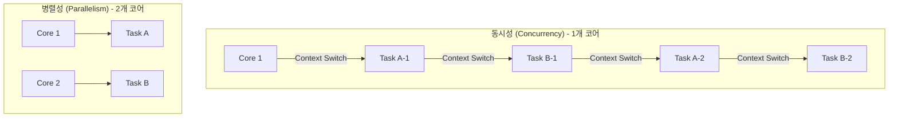
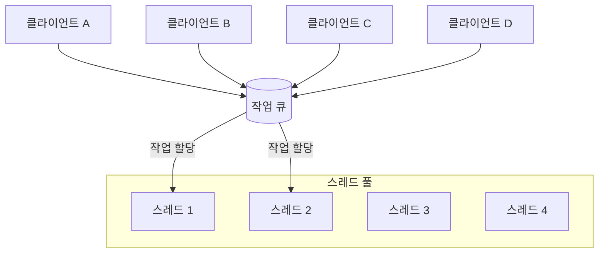
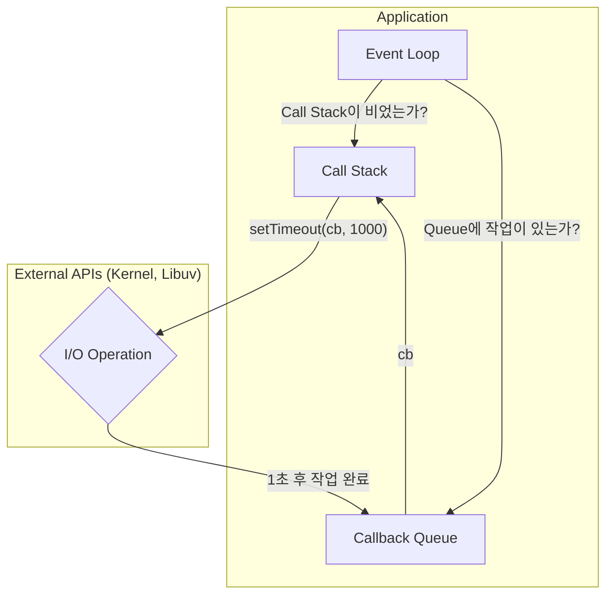
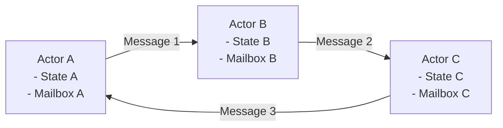
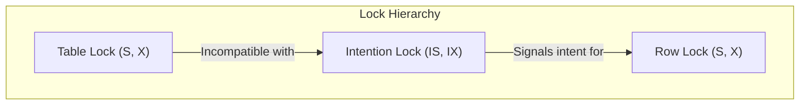
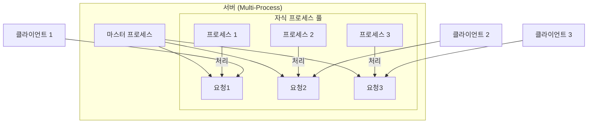
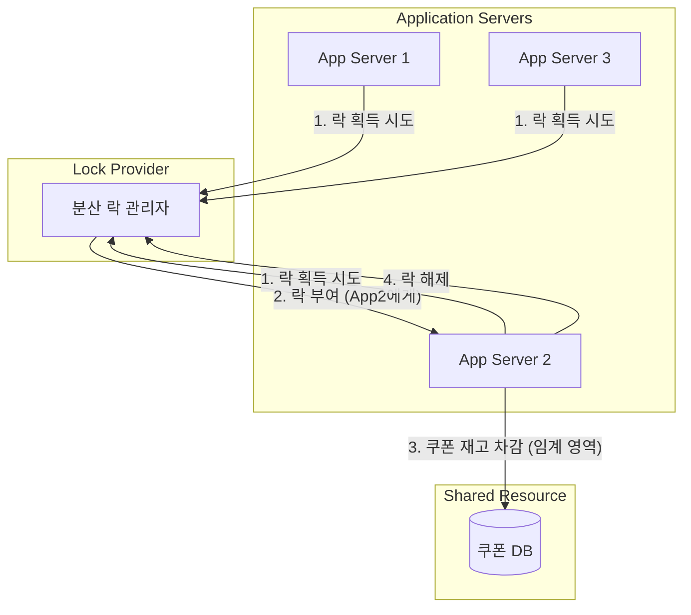
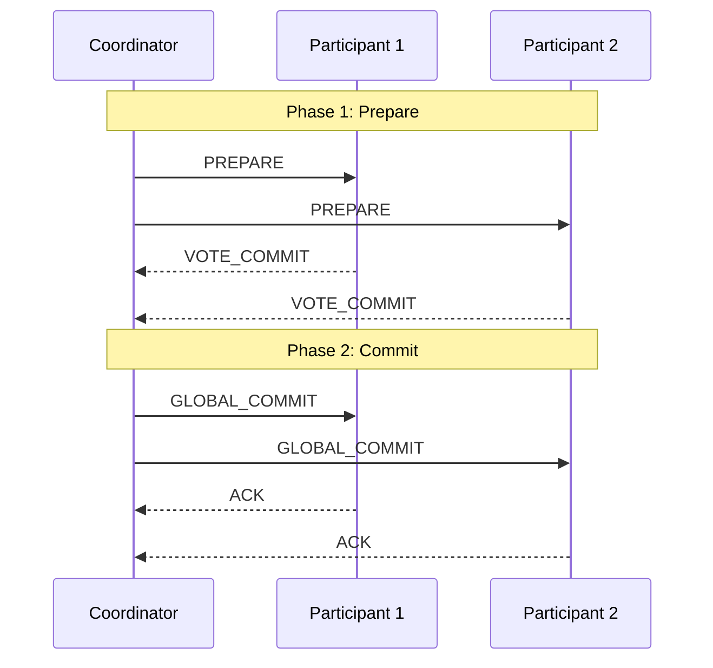
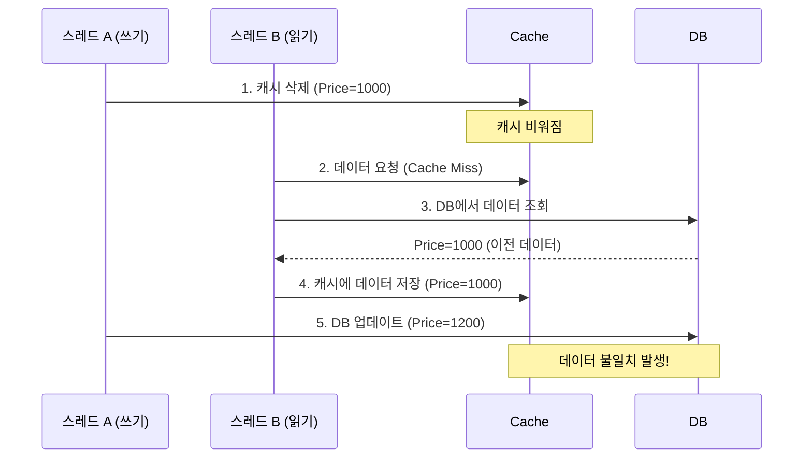

## 1. 동시성 기초 개념  기초

현대적인 백엔드 시스템을 설계하고 구현하는 데 있어 '동시성(Concurrency)'은 더 이상 선택이 아닌 필수 요소입니다. 사용자는 빠른 응답 시간을 기대하고, 비즈니스는 수많은 요청을 안정적으로 처리할 수 있는 확장성을 요구합니다. 이 모든 요구사항의 중심에는 바로 동시성이라는 개념이 자리 잡고 있습니다.

본 장에서는 서버 동시성의 여정을 시작하기 위한 가장 기본적인 개념들을 다룹니다. 이 개념들은 앞으로 논의될 모든 고급 주제의 근간이 되므로, 명확하게 이해하고 넘어가는 것이 매우 중요합니다. 시니어 개발자에게는 이미 익숙한 내용일 수 있으나, 개념을 재정립하고 놓치기 쉬운 미묘한 차이를 파악하는 계기가 될 것입니다.

### 1.1 동시성(Concurrency)의 정의와 중요성 💡

#### 동시성 vs 병렬성(Parallelism) 차이점

많은 개발자들이 동시성과 병렬성을 혼용하여 사용하지만, 이 둘은 근본적으로 다른 개념입니다. 이 차이를 이해하는 것이 동시성 학습의 첫걸음입니다.

*   **동시성(Concurrency)**: **논리적인 개념**으로, 여러 개의 작업을 **동시에 처리하는 것처럼** 보이게 만드는 기술입니다. 실제로는 하나의 코어(Core)에서 여러 작업을 매우 짧은 시간 간격으로 번갈아 가며(Context Switching) 처리할 수 있습니다. 마치 한 명의 요리사가 파스타를 삶는 동안(시간이 걸리는 작업) 소스를 만드는 것과 같습니다. 요리사는 한 명이지만, 두 가지 일을 동시에 진행하는 것처럼 보입니다.

*   **병렬성(Parallelism)**: **물리적인 개념**으로, 여러 개의 작업을 **실제로 동시에** 처리하는 기술입니다. 이는 멀티코어 프로세서와 같이 물리적으로 분리된 여러 실행 유닛이 각 작업을 독립적으로 처리할 때 가능합니다. 두 명의 요리사가 한 명은 파스타를 삶고, 다른 한 명은 소스를 만드는 상황에 비유할 수 있습니다.

이를 다이어그램으로 표현하면 다음과 같습니다.



> **핵심**: 동시성은 작업의 구조화에, 병렬성은 작업의 실행에 관한 것입니다. 잘 설계된 동시성 코드는 병렬 환경에서 더 나은 성능을 발휘할 수 있습니다.

#### 백엔드 시스템에서 동시성이 필요한 이유

가상의 시나리오를 통해 동시성의 중요성을 살펴보겠습니다.

**상황**: 당신은 인기 있는 온라인 쇼핑몰의 백엔드 개발자입니다. 대규모 할인 이벤트가 시작되자마자 수만 명의 사용자가 동시에 상품 조회, 장바구니 담기, 주문 등 다양한 요청을 보내기 시작했습니다.

*   **동시성 처리가 없는 서버 (순차 처리)**:
    1.  사용자 A의 상품 조회 요청을 받습니다.
    2.  데이터베이스에서 상품 정보를 조회하는 동안(수십~수백 ms 소요) 서버는 아무 일도 하지 않고 기다립니다.
    3.  조회가 끝나고 사용자 A에게 응답을 보냅니다.
    4.  그제서야 사용자 B의 장바구니 담기 요청을 처리하기 시작합니다.

이 경우, 뒤따르는 수만 명의 사용자는 앞선 사용자의 요청이 끝날 때까지 무한정 기다려야 하며, 대부분의 요청은 타임아웃(Timeout)으로 실패할 것입니다. 이는 최악의 사용자 경험과 비즈니스 손실로 이어집니다.

*   **동시성 처리가 있는 서버**:
    1.  사용자 A의 상품 조회 요청을 받고, 데이터베이스 I/O 작업을 시작시킵니다.
    2.  데이터베이스가 응답을 주기까지 기다리는 동안(IDLE 상태), 서버는 사용자 B의 장바구니 담기 요청을 받아 처리합니다.
    3.  마찬가지로 사용자 C의 주문 요청도 처리합니다.
    4.  데이터베이스로부터 사용자 A의 상품 정보가 도착하면, 그 시점에 사용자 A에게 응답을 보냅니다.

이처럼 동시성은 하나의 요청이 I/O(예: 데이터베이스 조회, 외부 API 호출, 파일 읽기)로 인해 대기하는 동안 다른 요청을 처리함으로써, 서버의 자원을 최대한 효율적으로 활용하고 전체 시스템의 처리량(Throughput)을 극대화합니다.

#### 동시성과 성능, 확장성의 관계

-   **성능(Performance)**: 동시성은 단일 작업의 처리 속도(Latency)를 줄이기보다는, 단위 시간당 처리할 수 있는 작업의 양(Throughput)을 늘리는 데 기여합니다. 또한, 시스템이 여러 요청에 동시에 응답할 수 있게 하여 사용자 체감 응답성(Responsiveness)을 향상시킵니다.
-   **확장성(Scalability)**: 동시성을 효율적으로 처리하는 시스템은 부하가 증가했을 때 자원(CPU, 메모리)을 추가하여 선형적으로 성능을 향상시키기 용이합니다. 즉, 수직적 확장(Scale-up)과 수평적 확장(Scale-out) 모두에 유리한 구조를 갖추게 됩니다.

---

### 1.2 동시성 관련 핵심 용어 📚

동시성을 깊이 있게 이해하려면 몇 가지 핵심 용어에 대한 명확한 정의가 필요합니다. 이 용어들은 서로 밀접하게 연관되어 있습니다.

#### 프로세스(Process) vs 스레드(Thread)

-   **프로세스(Process)**: 운영체제로부터 자원을 할당받는 작업의 단위입니다. 각 프로세스는 자신만의 독립적인 메모리 공간(Code, Data, Stack, Heap)을 가집니다. 따라서 한 프로세스는 다른 프로세스의 메모리에 직접 접근할 수 없습니다. 프로세스 간 통신(IPC, Inter-Process Communication)을 위해서는 별도의 복잡한 메커니즘이 필요합니다.
-   **스레드(Thread)**: 프로세스 내에서 실행되는 흐름의 단위입니다. 하나의 프로세스는 여러 개의 스레드를 가질 수 있으며, 이 스레드들은 프로세스의 메모리 공간(Code, Data, Heap)을 공유합니다. 단, 각 스레드는 자신만의 스택(Stack)과 프로그램 카운터(Program Counter)를 가집니다.

> **비유**: 프로세스를 '공장'에, 스레드를 공장 안의 '일꾼'에 비유할 수 있습니다.
> *   공장(프로세스)은 독립된 공간과 설비(메모리)를 가집니다.
> *   일꾼들(스레드)은 같은 공장 설비(메모리)를 공유하며 각자의 작업(실행 흐름)을 수행합니다.
>
> 자원 공유가 쉽다는 장점 때문에, 현대적인 서버 애플리케이션에서는 멀티프로세스보다 멀티스레드 모델을 더 널리 사용합니다. 하지만 자원 공유는 동기화 문제(Synchronization Problem)라는 새로운 과제를 낳습니다. (3장에서 자세히 다룹니다)

```mermaid
graph TD
    subgraph Process A
        direction TB
        subgraph "Memory (Shared)"
            Heap_A[Heap]
            Data_A[Data Segment]
            Code_A[Code Segment]
        end
        subgraph Thread 1
            direction LR
            Stack_T1[Stack]
            PC_T1[PC]
        end
        subgraph Thread 2
            direction LR
            Stack_T2[Stack]
            PC_T2[PC]
        end
        Thread 1 -- shares --> Heap_A
        Thread 2 -- shares --> Heap_A
    end

    subgraph Process B
        direction TB
        subgraph "Memory (Independent)"
            Heap_B[Heap]
            Data_B[Data Segment]
            Code_B[Code Segment]
        end
    end
```

#### 동기(Synchronous) vs 비동기(Asynchronous)

이 두 개념은 작업의 **결과를 기다리는 주체**와 **흐름 제어**의 관점에서 구분됩니다.

-   **동기(Synchronous)**: 함수 A가 함수 B를 호출했을 때, 함수 B의 실행이 **완료될 때까지 함수 A는 기다립니다(블로킹)**. 작업의 순서가 명확하게 보장됩니다.

-   **비동기(Asynchronous)**: 함수 A가 함수 B를 호출할 때, 함수 B의 실행 **완료 여부와 상관없이 즉시 반환**하여 자신의 다음 코드를 실행합니다. 결과는 나중에 콜백(Callback), 프로미스(Promise) 등을 통해 전달받습니다.

**시나리오**: 클라이언트가 서버에 이미지 리사이징을 요청하는 경우

```mermaid
sequenceDiagram
    participant Client
    participant Server

    box "동기(Synchronous) 방식"
        Client->>Server: 이미지 리사이징 요청 (파일과 함께)
        Note right of Server: 리사이징 작업 시작 (수 초 소요)
        Server-->>Client: 작업 완료 후 결과 이미지 반환
        Note left of Client: 서버 응답 올 때까지 대기 (Blocked)
    end

    box "비동기(Asynchronous) 방식"
        Client->>Server: 이미지 리사이징 요청 (파일과 함께)
        Server-->>Client: "요청 접수 완료" 즉시 응답 (Job ID 등)
        Note left of Client: 다른 작업 수행 가능 (Non-blocked)
        Server->>Server: 백그라운드에서 리사이징 작업 수행
        Server-->>Client: 작업 완료 후 알림 (e.g., Webhook, Polling)
    end
```

#### 블로킹(Blocking) vs 논블로킹(Non-blocking)

이 두 개념은 호출된 함수가 **제어권을 즉시 반환하는지**의 여부, 즉 I/O 작업의 처리 방식과 관련이 깊습니다.

-   **블로킹(Blocking)**: A 함수가 B 함수를 호출하면, B 함수의 작업이 끝날 때까지 A 함수는 제어권을 잃고 대기 상태(Blocked)에 빠집니다. CPU 자원을 다른 스레드에 넘겨줄 수는 있지만, A 함수 자체는 멈춰있습니다.

-   **논블로킹(Non-blocking)**: A 함수가 B 함수를 호출하면, B 함수는 작업 완료 여부와 상관없이 즉시 제어권을 A 함수에 반환합니다. 만약 작업이 완료되지 않았다면, "아직 준비 안 됨"과 같은 상태를 반환합니다.

> **헷갈리기 쉬운 지점**: 동기/비동기와 블로킹/논블로킹은 종종 함께 사용되어 혼동을 일으킵니다.
>
> *   **Sync-Blocking**: 가장 흔한 조합. 함수를 호출하고, 작업이 끝날 때까지 기다립니다.
> *   **Async-Non-blocking**: 현대적인 고성능 서버의 핵심. 작업을 요청하고 즉시 제어권을 돌려받습니다. 작업이 완료되면 이벤트 루프 등이 알려줍니다. (e.g., Node.js, Netty)
> *   **Sync-Non-blocking**: 함수를 호출하고 제어권은 즉시 받지만, 원하는 결과를 얻을 때까지 계속해서 함수를 호출하며 확인합니다 (Polling). 비효율적인 busy-waiting을 유발할 수 있습니다.
> *   **Async-Blocking**: 다른 스레드에게 작업을 위임하고 즉시 응답을 받지만, 작업을 위임받은 스레드는 블로킹 방식으로 동작합니다. (e.g., Java의 Servlet 모델)

#### CPU 바운드(CPU-bound) vs I/O 바운드(I/O-bound) 작업

서버가 처리하는 작업의 성격을 이해하는 것은 올바른 동시성 모델을 선택하는 데 매우 중요합니다.

-   **CPU 바운드 작업 (CPU-bound Task)**: 작업 시간의 대부분을 CPU 연산에 사용하는 작업입니다.
    -   **예시**: 복잡한 수학 계산, 비디오/이미지 인코딩, 데이터 압축, 암호화
    -   **특징**: 스레드가 대기 상태(WAITING)에 거의 빠지지 않고 계속 실행 상태(RUNNING)를 유지합니다.
    -   **적합한 동시성 모델**: **병렬 처리(Parallelism)**가 효과적입니다. 코어 수만큼 스레드를 생성하여 작업을 분산시키면 성능이 향상됩니다. 스레드 수가 코어 수를 초과하면 잦은 컨텍스트 스위칭으로 오히려 성능이 저하될 수 있습니다.

```java
// CPU-bound 작업 예시 (Java)
public long calculateSum() {
    long sum = 0;
    // 복잡하고 긴 연산
    for (long i = 0; i < 1_000_000_000L; i++) {
        sum += i;
    }
    return sum;
}
```

-   **I/O 바운드 작업 (I/O-bound Task)**: 작업 시간의 대부분을 I/O 작업(디스크 읽기/쓰기, 네트워크 통신, 데이터베이스 조회)을 기다리는 데 사용하는 작업입니다.
    -   **예시**: 대부분의 웹 애플리케이션 요청 (DB 쿼리, 외부 API 호출, 파일 다운로드)
    -   **특징**: 스레드가 I/O 응답을 기다리며 대부분의 시간 동안 대기 상태(WAITING/BLOCKED)에 있습니다. 이 시간 동안 CPU는 유휴 상태가 됩니다.
    -   **적합한 동시성 모델**: **비동기 논블로킹(Asynchronous Non-blocking)** 또는 적은 수의 스레드로 많은 작업을 처리하는 동시성 모델이 효과적입니다. 스레드가 I/O 대기 중일 때 다른 작업을 처리함으로써 CPU를 쉬지 않고 활용할 수 있습니다.

```java
// I/O-bound 작업 예시 (Java - Blocking)
public String fetchDataFromRemote() {
    // 이 호출은 네트워크 응답이 올 때까지 현재 스레드를 블로킹합니다.
    // 이 시간 동안 CPU는 낭비됩니다.
    RestTemplate restTemplate = new RestTemplate();
    return restTemplate.getForObject("https://api.example.com/data", String.class);
}
```

백엔드 개발자는 자신이 다루는 작업이 CPU 바운드인지, I/O 바운드인지를 명확히 파악하고, 그에 맞는 최적의 동시성 전략을 수립해야 합니다. 대부분의 웹 서비스는 압도적으로 I/O 바운드 작업의 비중이 높습니다. 이것이 바로 Node.js와 같은 비동기 I/O 기반 프레임워크가 웹 서버 개발에서 각광받는 이유입니다.


## 2. 동시성 모델과 패턴 🏛️

1장에서 동시성의 기초 개념을 다졌다면, 이제는 그 개념을 실제로 구현하기 위한 구체적인 청사진, 즉 **동시성 모델(Concurrency Model)**과 **패턴(Pattern)**에 대해 알아볼 차례입니다. 동시성 모델은 여러 작업을 조율하고 실행하는 방법에 대한 추상적인 프레임워크를 의미합니다. 어떤 모델을 선택하느냐에 따라 애플리케이션의 구조, 성능 특성, 그리고 개발의 복잡성이 크게 달라집니다.

각 모델은 특정 유형의 문제를 해결하는 데 특화되어 있으며, 저마다의 장단점을 가집니다. 시니어 개발자는 단순히 하나의 모델에 정통한 것을 넘어, 해결하려는 문제의 본질(I/O 바운드 vs CPU 바운드, 상태 관리의 복잡성 등)을 파악하고 가장 적합한 모델을 선택하거나 조합할 수 있는 능력을 갖추어야 합니다.

---

### 2.1 멀티스레딩 (Multi-threading) ⚙️

멀티스레딩은 가장 전통적이고 널리 알려진 동시성 모델입니다. 하나의 프로세스 내에서 여러 스레드를 생성하여 작업을 분담하고, 운영체제의 스케줄러에 의해 이 스레드들이 CPU 시간을 나누어 쓰는 방식(선점형 멀티태스킹, Preemptive Multitasking)입니다.

#### 스레드 생성과 관리

가장 기본적인 방식은 필요할 때마다 새로운 스레드를 생성하는 것입니다.

```java
// 새로운 요청이 올 때마다 스레드를 생성하는 원시적인 방식
void handleRequest(Request request) {
    Thread thread = new Thread(() -> {
        // 요청 처리 로직...
        process(request);
    });
    thread.start();
}
```

하지만 이 방식은 심각한 문제를 야기합니다.
1.  **리소스 낭비**: 스레드를 생성하고 파괴하는 것은 운영체제 수준에서 상당한 비용(메모리, 시간)이 드는 작업입니다. 요청이 폭주하면 스레드 생성/소멸 오버헤드만으로도 시스템이 마비될 수 있습니다.
2.  **자원 고갈**: 시스템이 생성할 수 있는 스레드의 수는 제한적입니다. 무분별한 스레드 생성은 `OutOfMemoryError`를 유발하며 시스템 전체를 다운시킬 수 있습니다.

#### 스레드 풀(Thread Pool) 패턴

이러한 문제를 해결하기 위해 등장한 것이 바로 **스레드 풀(Thread Pool)** 패턴입니다. 미리 일정 개수의 스레드를 생성해 '풀(Pool)'에 담아두고, 작업 요청이 들어오면 대기 중인 스레드에 작업을 할당하는 방식입니다. 작업이 끝나면 스레드는 파괴되지 않고 다시 풀로 돌아가 다음 작업을 기다립니다.

**동작 방식 시나리오**:
1.  애플리케이션 시작 시, 미리 정해진 개수(예: 10개)의 스레드를 생성하여 스레드 풀을 구성합니다.
2.  클라이언트로부터 작업 요청이 들어오면, 이 작업은 '작업 큐(Task Queue)'에 추가됩니다.
3.  스레드 풀의 놀고 있는 스레드가 작업 큐에서 작업을 하나 가져와 실행합니다.
4.  실행이 끝나면, 스레드는 다시 풀로 돌아와 다음 작업을 기다립니다.
5.  만약 모든 스레드가 일하고 있다면, 새로운 작업은 작업 큐에서 대기합니다.



스레드 풀은 시스템의 부하를 조절하고 자원을 효율적으로 재사용하는 핵심적인 패턴입니다. 대부분의 현대 언어와 프레임워크는 고도로 최적화된 스레드 풀 구현체(예: Java의 `ExecutorService`)를 제공합니다.

#### 스레드 안전성(Thread Safety)

멀티스레딩의 가장 큰 장점이자 동시에 가장 큰 난관은 **메모리 공유**입니다. 여러 스레드가 같은 데이터(공유 자원, Shared Resource)에 동시에 접근하여 수정하려고 할 때, 예측 불가능한 결과가 발생하는 **경쟁 상태(Race Condition)**에 빠질 수 있습니다.

**문제 상황**: 쇼핑몰의 재고 수량을 관리하는 시나리오

-   현재 재고: 1개
-   스레드 A와 스레드 B가 동시에 이 상품을 주문하려고 합니다.

1.  **스레드 A**가 현재 재고(1)를 읽습니다.
2.  (컨텍스트 스위칭 발생)
3.  **스레드 B**가 현재 재고(1)를 읽습니다.
4.  **스레드 A**가 재고를 1 감소시키고(1-1=0), 결과를 저장합니다. (재고: 0)
5.  (컨텍스트 스위칭 발생)
6.  **스레드 B**도 자신이 읽었던 값을 기준으로 재고를 1 감소시키고(1-1=0), 결과를 저장합니다. (재고: 0)

**결과**: 상품은 1개 팔렸지만, 재고는 2개 감소한 것처럼 처리되어 데이터 불일치가 발생합니다. (실제로는 재고가 -1이 되어야 하지만, 로직에 따라 0으로 덮어쓰여짐)

#### 공유 자원과 임계 영역(Critical Section)

-   **공유 자원(Shared Resource)**: 여러 스레드가 공유하는 메모리 영역이나 데이터(예: 전역 변수, 객체의 인스턴스 필드, 파일). 위의 예시에서는 '재고 수량' 변수입니다.
-   **임계 영역(Critical Section)**: 공유 자원에 접근하여 조작하는 코드 블록. 이 영역은 한 번에 하나의 스레드만 실행하도록 보장되어야 합니다. (상호 배제, Mutual Exclusion)

이러한 문제를 해결하기 위해 `synchronized`, `Lock`, `Mutex` 등 **동기화 메커니즘**을 사용하며, 이는 3장에서 자세히 다룰 것입니다. 멀티스레딩 환경에서는 어떤 코드가 임계 영역인지 식별하고 적절히 보호하는 것이 무엇보다 중요합니다.

---

### 2.2 비동기 프로그래밍 (Asynchronous Programming) ⚡

비동기 프로그래밍 모델은 '기다리지 않는다'는 철학에 기반합니다. 특히 I/O 바운드 작업이 많은 웹 서버 환경에서 강력한 성능을 발휘합니다. 멀티스레딩이 '일꾼(스레드)을 늘려서' 동시성을 확보한다면, 비동기 모델은 '하나의 일꾼이 쉬는 시간 없이' 일하게 만들어 동시성을 확보합니다.

#### 이벤트 루프(Event Loop) 모델

비동기 모델의 핵심 엔진은 **이벤트 루프**입니다. Node.js, Netty(Java), asyncio(Python) 등이 이 모델을 사용합니다.

-   **동작 원리**:
    1.  모든 I/O 작업(네트워크 요청, DB 쿼리 등)은 **논블로킹** 방식으로 요청됩니다. 즉, 작업을 요청한 후 결과를 기다리지 않고 즉시 다음 코드로 넘어갑니다.
    2.  요청한 작업과 그 작업이 완료되었을 때 실행할 **콜백(Callback) 함수**를 함께 시스템(커널)에 등록합니다.
    3.  **이벤트 루프**는 단일 스레드(또는 소수의 스레드)에서 계속 돌면서, 완료된 이벤트가 있는지 확인합니다.
    4.  작업이 완료되면(예: DB에서 데이터 도착), 커널은 해당 이벤트를 '이벤트 큐'에 넣습니다.
    5.  이벤트 루프는 이벤트 큐에서 완료된 이벤트를 하나씩 꺼내, 미리 등록된 콜백 함수를 실행시킵니다.



이 모델의 핵심은 **"절대 이벤트 루프 스레드를 블로킹하지 말라"**는 것입니다. 만약 콜백 함수 내에서 무거운 CPU 연산이나 블로킹 I/O를 수행하면, 이벤트 루프 전체가 멈추고 다른 어떤 이벤트도 처리할 수 없게 되어 시스템 전체의 성능이 급격히 저하됩니다.

#### async/await 패턴

전통적인 콜백 방식은 코드가 깊어질수록 **콜백 헬(Callback Hell)** 또는 **파멸의 피라미드(Pyramid of Doom)**라 불리는 가독성 문제를 야기합니다.

```javascript
// 콜백 헬 예시
step1(function (value1) {
    step2(value1, function(value2) {
        step3(value2, function(value3) {
            // ... 계속 중첩됨
        });
    });
});
```

이를 해결하기 위해 **Promise(또는 Future)** 개념이 도입되었고, 최신 언어들은 이를 더 쉽게 사용할 수 있도록 **async/await**라는 문법적 설탕(Syntactic Sugar)을 제공합니다. async/await를 사용하면 비동기 코드를 마치 동기 코드처럼 순차적이고 읽기 쉽게 작성할 수 있습니다.

```javascript
// async/await 예시
async function myAsyncFunction() {
    try {
        const value1 = await step1();
        const value2 = await step2(value1);
        const value3 = await step3(value2);
        return value3;
    } catch (error) {
        console.error(error);
    }
}
```
컴파일러(또는 인터프리터)는 이 코드를 내부적으로 Promise와 이벤트 루프 기반으로 변환해줍니다. 개발자는 복잡한 콜백 체인 없이 비즈니스 로직에 집중할 수 있습니다.

#### 코루틴(Coroutine)과 협력적 멀티태스킹

코루틴은 `async/await`보다 더 일반화된 개념으로, 실행을 **일시 중단(suspend)**하고 나중에 **재개(resume)**할 수 있는 함수입니다. 스레드가 운영체제에 의해 강제로 제어권이 전환되는 선점형 멀티태스킹인 반면, 코루틴은 스스로 제어권을 양보하는 **협력적 멀티태스킹(Cooperative Multitasking)**입니다.

Go 언어의 **고루틴(Goroutine)**, Kotlin의 **코루틴**, Python의 **asyncio**가 대표적인 예입니다. 스레드보다 훨씬 가벼워(적은 메모리 사용, 빠른 컨텍스트 스위칭) 수십만, 수백만 개를 동시에 실행하는 것이 가능하며, 이는 극단적인 동시성 요구사항을 만족시키는 데 유리합니다.

---

### 2.3 액터 모델 (Actor Model) 🎭

액터 모델은 "모든 것을 액터(Actor)로 취급한다"는 철학을 가진 동시성 모델입니다. 멀티스레딩의 가장 큰 골칫거리인 '공유 상태'와 '락(Lock)'을 원천적으로 제거하는 것을 목표로 합니다. Erlang/Elixir, Akka(Java/Scala)가 이 모델을 구현한 대표적인 기술입니다.

#### 액터 시스템의 개념

-   **액터(Actor)**: 상태(State), 로직(Behavior), 그리고 메일박스(Mailbox)를 가진 독립적인 실행 단위입니다.
-   **메시지 패싱(Message Passing)**: 액터들은 절대로 직접 서로의 상태를 공유하거나 메서드를 호출하지 않습니다. 유일한 소통 방법은 비동기적으로 **메시지**를 주고받는 것입니다. 메시지는 불변(Immutable) 객체인 것이 권장됩니다.
-   **메일박스(Mailbox)**: 각 액터는 자신에게 온 메시지를 저장하는 큐(메일박스)를 가지고 있으며, 메시지를 순차적으로 하나씩 꺼내 처리합니다.



#### 상태 격리와 장애 격리

액터 모델의 가장 강력한 장점은 **격리(Isolation)**입니다.
-   **상태 격리(State Isolation)**: 각 액터는 자신만의 상태를 가지며 외부에서 직접 접근할 수 없습니다. 따라서 락이나 동기화 없이도 상태를 안전하게 변경할 수 있습니다. "공유하지 않으면 동기화할 필요도 없다(Share nothing, synchronize nothing)"는 철학입니다.
-   **장애 격리(Fault Isolation)**: 하나의 액터에서 오류가 발생하더라도 다른 액터에 영향을 주지 않습니다. 감독자(Supervisor) 액터는 하위 액터의 실패를 감지하고, 해당 액터만 재시작하거나 다른 조치를 취할 수 있습니다. 이는 매우 견고하고 자기 치유(Self-healing)가 가능한 시스템을 만드는 데 기여합니다.

---

### 2.4 리액티브 프로그래밍 (Reactive Programming) 🌊

리액티브 프로그래밍은 데이터 스트림(Data Stream)과 변경 사항 전파(Propagation of Change)에 중점을 둔 프로그래밍 패러다임입니다. 간단히 말해, **비동기 데이터 스트림**을 다루는 모델입니다. 스프레드시트에서 한 셀의 값을 바꾸면 그 셀을 참조하는 다른 셀들의 값이 자동으로 바뀌는 것을 생각하면 이해하기 쉽습니다.

#### 옵저버 패턴과 스트림 처리

리액티브 프로그래밍은 고전적인 옵저버 패턴(Observer Pattern)을 확장한 형태입니다.
-   **Publisher(Observable)**: 데이터 스트림(이벤트)을 발행합니다.
-   **Subscriber(Observer)**: 스트림을 구독하고, 발행되는 데이터(`onNext`), 스트림의 완료(`onComplete`), 또는 에러(`onError`)에 반응합니다.

이 모델은 시간에 따라 발생하는 무한한(또는 유한한) 데이터 스트림을 `map`, `filter`, `reduce` 등과 같은 다양한 연산자(Operator)를 통해 조합하고 변환하여 처리하는 데 매우 강력합니다.

#### 백프레셔(Backpressure) 처리

리액티브 시스템의 핵심적인 개념 중 하나는 **백프레셔(역압)**입니다. 이는 Publisher가 Subscriber가 처리할 수 있는 속도보다 훨씬 빠르게 데이터를 발행할 때 발생하는 문제를 해결하기 위한 메커니즘입니다. 백프레셔를 통해 Subscriber는 자신이 처리할 수 있는 데이터의 양(`request(n)`)을 Publisher에게 역으로 알려줄 수 있고, Publisher는 그에 맞춰 데이터 발행 속도를 조절합니다. 이는 시스템이 과부하로 인해 메모리 부족으로 다운되는 것을 방지하는 중요한 안정 장치입니다.

#### 리액티브 스트림 명세

Java, Scala, JavaScript 등 다양한 환경에서 리액티브 라이브러리들이 호환성을 가질 수 있도록 정의된 표준 사양입니다. `Publisher`, `Subscriber`, `Subscription`, `Processor`라는 4개의 핵심 인터페이스를 정의하여, 서로 다른 라이브러리들이 함께 동작할 수 있는 기반을 제공합니다.

---

각 동시성 모델은 문제 해결을 위한 서로 다른 도구 상자와 같습니다. 어떤 도구가 가장 좋은지는 만들려는 대상에 따라 결정됩니다. 다음 장에서는 이 모델들, 특히 멀티스레딩 환경에서 발생하는 문제를 해결하기 위한 구체적인 기술인 **동기화 메커니즘**에 대해 깊이 파고들 것입니다.

## 3. 동기화 메커니즘 (Synchronization Mechanisms) 🚦

2장에서 멀티스레딩 모델의 강력함과 그 이면에 숨겨진 '공유 자원' 문제, 즉 경쟁 상태(Race Condition)를 살펴보았습니다. 아무리 많은 스레드를 만들어 작업을 병렬로 처리한들, 공유 데이터가 망가진다면 시스템 전체의 신뢰성은 무너지고 맙니다.

**동기화 메커니즘**은 바로 이 혼돈에 질서를 부여하는 도구입니다. 여러 스레드가 공유 자원에 안전하게 접근하도록 통제하는 '교통 경찰'의 역할을 합니다. 락(Lock)을 사용하여 한 번에 한 스레드만 임계 영역에 진입하도록 하거나, 더 정교한 방법으로 접근을 제어합니다.

이번 장에서는 가장 기본적인 동기화 기법부터 하드웨어 수준의 최적화 기법까지, 백엔드 개발자라면 반드시 알아야 할 핵심 동기화 메커니즘을 깊이 있게 탐구합니다. 이 도구들의 특성과 비용을 정확히 이해해야만, 성능과 안정성 사이에서 최적의 균형을 맞출 수 있습니다.

---

### 3.1 뮤텍스(Mutex)와 세마포어(Semaphore) 🚧

뮤텍스와 세마포어는 운영체제 수준에서 제공되는 가장 고전적이고 근본적인 동기화 프리미티브(Primitive)입니다.

#### 상호배제(Mutual Exclusion) 구현

**뮤텍스(Mutex, MUTual EXclusion)**는 이름 그대로 '상호 배제'를 위한 도구입니다. 하나의 자원에 대해 오직 하나의 스레드만 접근을 허용하는, 가장 단순하고 강력한 락입니다.

-   **동작 원리**: 임계 영역에 진입하려는 스레드는 먼저 뮤텍스 락을 획득(acquire)해야 합니다. 만약 다른 스레드가 이미 락을 소유하고 있다면, 락이 해제(release)될 때까지 해당 스레드는 대기(블로킹) 상태에 빠집니다.
-   **비유**: 1인용 화장실 열쇠와 같습니다. 한 사람이 열쇠(락)를 가지고 들어가면, 다른 사람들은 그 사람이 나와서 열쇠를 반납할 때까지 밖에서 기다려야 합니다.

```java
// Java의 ReentrantLock을 사용한 뮤텍스 구현 예
public class Counter {
    private final Lock lock = new ReentrantLock();
    private int count = 0;

    // 임계 영역(Critical Section)
    public void increment() {
        lock.lock(); // 락 획득 (화장실 문 잠그기)
        try {
            count++;
        } finally {
            lock.unlock(); // 락 해제 (반드시 실행되도록 finally 블록 사용)
        }
    }

    public int getCount() {
        lock.lock();
        try {
            return count;
        } finally {
            lock.unlock();
        }
    }
}
```

**세마포어(Semaphore)**는 뮤텍스의 일반화된 버전입니다. 뮤텍스가 오직 '1개'의 접근만 허용한다면, 세마포어는 **정해진 개수(N)만큼**의 스레드가 자원에 동시 접근하는 것을 허용합니다.

-   **동작 원리**: 세마포어는 내부적으로 허용 가능한 자원의 개수를 카운터로 관리합니다. 스레드가 자원을 요청(acquire)하면 카운터가 1 감소하고, 자원을 반납(release)하면 카운터가 1 증가합니다. 만약 카운터가 0이라면, 자원을 요청한 스레드는 카운터가 0보다 커질 때까지 대기합니다.
-   **비유**: 5개의 주차 공간이 있는 주차장과 같습니다. 주차장 입구의 전광판(카운터)에는 '5'라고 표시되어 있습니다. 차가 한 대 들어올 때마다 숫자는 1씩 줄고, 5대의 차가 모두 들어가면 전광판은 '0'이 되어 다음 차는 밖에서 기다려야 합니다. 차가 한 대 나가면 숫자가 '1'로 바뀌고, 기다리던 차가 들어올 수 있습니다.

```java
// 동시에 3개의 DB 커넥션만 허용하는 세마포어 예
public class ConnectionPool {
    private final Semaphore semaphore = new Semaphore(3, true); // 3개의 허가, 공정(fair) 모드

    public Connection getConnection() throws InterruptedException {
        semaphore.acquire(); // 허가 요청, 없으면 대기
        try {
            return createPhysicalConnection();
        } catch (Exception e) {
            semaphore.release(); // 예외 발생 시 허가 반납
            throw e;
        }
    }

    public void releaseConnection(Connection conn) {
        // ... 커넥션 닫는 로직 ...
        semaphore.release(); // 허가 반납
    }
}
```

#### 데드락(Deadlock), 라이브락(Livelock)과 기아 상태(Starvation)

동기화 메커니즘은 문제를 해결하지만, 잘못 사용하면 더 심각한 문제를 낳습니다.

-   **데드락 (Deadlock, 교착 상태)**: 두 개 이상의 스레드가 서로가 점유한 자원을 기다리며 무한 대기 상태에 빠지는 현상입니다. 시스템이 완전히 멈추게 됩니다.
    -   **발생 시나리오**:
        1.  스레드 A가 자원 1에 대한 락을 획득합니다.
        2.  스레드 B가 자원 2에 대한 락을 획득합니다.
        3.  스레드 A가 자원 2에 대한 락을 획득하려고 시도하지만, 스레드 B가 소유하고 있어 대기합니다.
        4.  스레드 B가 자원 1에 대한 락을 획득하려고 시도하지만, 스레드 A가 소유하고 있어 대기합니다.
        -> 서로가 서로를 영원히 기다립니다.

    ```mermaid
    graph TD
        Thread_A -- "Waits for" --> Lock_2
        Lock_2 -- "Held by" --> Thread_B
        Thread_B -- "Waits for" --> Lock_1
        Lock_1 -- "Held by" --> Thread_A
    ```
    -   **방지 기법**: 가장 실용적인 방법은 **락 획득 순서를 강제**하는 것입니다. 모든 스레드가 항상 자원 1 -> 자원 2 순서로 락을 획득하도록 규칙을 정하면 데드락은 발생하지 않습니다.

-   **라이브락 (Livelock)**: 스레드들이 실제로 작업을 진행하지는 못하면서, 상태를 계속 바꾸며 바쁘게 움직이는 현상입니다. 스레드가 블로킹되지는 않지만, 실질적으로는 멈춘 것과 같습니다.
    -   **비유**: 좁은 복도에서 마주친 두 사람이 서로 길을 비켜주려고 동시에 같은 방향으로 움직이는 것을 반복하는 상황과 같습니다. 둘 다 활발히 움직이지만 앞으로 나아가지는 못합니다.

-   **기아 상태 (Starvation)**: 특정 스레드가 자원을 할당받을 기회를 영원히(또는 매우 오랫동안) 얻지 못하는 현상입니다.
    -   **원인**: 스레드 우선순위가 너무 낮거나, 락 구현이 불공정(unfair)하여 특정 스레드들만 계속 락을 획득하는 경우 발생할 수 있습니다. 예를 들어, Java의 `ReentrantLock`은 기본적으로 불공정 모드이며, 이는 락을 기다리는 순서와 상관없이 락을 획득할 기회를 줍니다. 이는 처리량을 높일 수 있지만 기아 상태를 유발할 수 있습니다. `new ReentrantLock(true)`와 같이 공정(fair) 모드를 사용하면 이를 방지할 수 있지만, 성능 저하가 발생합니다.

---

### 3.2 원자적 연산 (Atomic Operations) ⚛️

뮤텍스나 세마포어 같은 락은 강력하지만 비용이 비쌉니다. 락을 획득하고 해제하는 과정에서 운영체제 커널의 개입과 스레드 컨텍스트 스위칭이 발생하여 오버헤드가 큽니다. 간단한 카운터 증가와 같은 연산을 위해 이러한 무거운 락을 사용하는 것은 비효율적일 수 있습니다.

**원자적 연산**은 이러한 락 없이(lock-free) 동시성을 처리하는 저수준(low-level) 기법입니다. "원자적"이란, 해당 연산이 실행되는 동안 누구에게도 방해받지 않고 단 한 번의 기계어 명령처럼 실행되는 것을 보장한다는 의미입니다.

#### Compare-and-Swap (CAS) 연산

대부분의 현대 CPU는 원자적 연산을 위한 특별한 하드웨어 명령어를 지원합니다. 그중 가장 대표적인 것이 **CAS(Compare-and-Swap)** 입니다.

-   **동작 원리**: CAS 연산은 세 개의 인자(메모리 주소 `V`, 예상되는 기존 값 `A`, 새로운 값 `B`)를 받습니다.
    1.  메모리 주소 `V`의 현재 값이 예상 값 `A`와 같은지 비교합니다.
    2.  만약 같다면, `V`의 값을 새로운 값 `B`로 교체하고 `true`를 반환합니다.
    3.  만약 다르다면(그 사이 다른 스레드가 값을 변경했다는 의미), 아무 작업도 하지 않고 `false`를 반환합니다.
    이 모든 과정은 **원자적으로** 일어납니다.

-   **CAS를 이용한 락-프리 카운터 구현**:
    ```java
    // Java의 AtomicInteger는 내부적으로 CAS를 사용합니다.
    public class AtomicCounter {
        private AtomicInteger count = new AtomicInteger(0);
    
        public void increment() {
            // 루프를 돌며 CAS 시도
            while (true) {
                int existingValue = count.get();
                int newValue = existingValue + 1;
                // 현재 값이 existingValue일 때만 newValue로 변경
                if (count.compareAndSet(existingValue, newValue)) {
                    return; // 성공하면 루프 탈출
                }
                // 실패하면 다른 스레드가 값을 변경한 것이므로, 다시 시도
            }
        }
    
        public int get() {
            return count.get();
        }
    }
    ```
    이 방식은 락을 사용하지 않으므로 스레드가 블로킹되지 않아 성능상 이점을 가집니다. 경쟁이 심하지 않은 상황에서는 매우 효율적이지만, 경쟁이 심하면 CAS 실패와 재시도가 반복되어 오히려 성능이 저하될 수 있습니다.

#### 락 프리(Lock-free) 자료구조

CAS와 같은 원자적 연산을 기반으로, 락을 사용하지 않는 동시성 자료구조를 만들 수 있습니다. Java의 `java.util.concurrent` 패키지에 있는 `ConcurrentLinkedQueue`, `ConcurrentHashMap` 등이 대표적인 예입니다. 이러한 자료구조는 여러 스레드가 동시에 접근해도 데이터의 일관성을 보장하면서 높은 처리량을 제공합니다.

> **ABA 문제**: CAS의 고질적인 문제 중 하나입니다. 한 스레드가 값을 읽고(A) CAS를 시도하는 사이, 다른 스레드가 값을 B로 바꿨다가 다시 A로 돌려놓는 경우입니다. 첫 번째 스레드는 값이 변하지 않았다고 착각하고 CAS를 성공시키지만, 실제로는 중간에 변경이 있었습니다. 이는 논리적 오류를 유발할 수 있습니다. 이를 해결하기 위해 값과 함께 버전(또는 스탬프)을 같이 비교하는 `AtomicStampedReference`와 같은 기법이 사용됩니다.

#### 메모리 모델과 메모리 배리어

멀티코어 환경에서는 각 CPU 코어가 자신만의 캐시(Cache)를 가집니다. 한 코어에서 변경한 내용이 즉시 메인 메모리로 전파되지 않고, 다른 코어에 즉시 보이지 않을 수 있습니다. 또한 컴파일러나 CPU가 성능 최적화를 위해 코드의 실행 순서를 임의로 재배치(Reordering)할 수 있습니다. 이러한 문제들 때문에 동시성 프로그래밍은 예측하기 어렵게 됩니다.

-   **메모리 모델 (Memory Model)**: 특정 스레드의 메모리 작업(읽기, 쓰기) 결과가 다른 스레드에게 언제 어떻게 보이는지를 정의하는 규칙입니다. (e.g., Java Memory Model)
-   **메모리 배리어 (Memory Barrier, 또는 Fence)**: 코드 실행 순서 재배치를 막고, 캐시의 내용을 강제로 메인 메모리에 쓰거나(flush) 메인 메모리에서 읽어오도록(invalidate) 하는 CPU 명령어입니다.
    -   **`volatile` 키워드**: Java나 C#에서 `volatile`로 선언된 변수는 항상 메인 메모리에서 직접 읽고 쓰며, 해당 변수에 대한 연산의 순서 재배치를 금지하는 메모리 배리어 역할을 합니다.
    -   원자적 연산과 락은 내부적으로 이러한 메모리 배리어 기능을 포함하고 있어, 값의 변경 사항이 다른 스레드에게 올바르게 전파되도록 보장합니다.

---

### 3.3 읽기-쓰기 락 (Read-Write Lock) 📖✍️

일반적인 뮤텍스는 자원에 대한 접근을 읽기/쓰기 구분 없이 무조건 막습니다. 하지만 많은 애플리케이션에서는 '쓰기' 작업보다 '읽기' 작업이 압도적으로 많습니다. (예: 시스템 설정값 조회, 캐시 데이터 조회)

이런 상황에서 여러 스레드가 동시에 데이터를 읽기만 하는데도 뮤텍스로 인해 순차적으로 처리된다면 매우 비효율적입니다. **읽기-쓰기 락(Read-Write Lock)**은 이러한 시나리오를 위해 고안된 더 정교한 락입니다.

#### 공유-독점 락 패턴

읽기-쓰기 락은 두 종류의 락을 제공합니다.
-   **읽기 락 (Read Lock, 또는 공유 락, Shared Lock)**: 여러 스레드가 동시에 획득할 수 있습니다. 읽기 락이 하나라도 걸려 있으면 쓰기 락은 획득할 수 없습니다.
-   **쓰기 락 (Write Lock, 또는 독점 락, Exclusive Lock)**: 오직 하나의 스레드만 획득할 수 있습니다. 쓰기 락이 걸려 있으면 다른 어떤 스레드도 읽기 락이나 쓰기 락을 획득할 수 없습니다.

**규칙 요약**:
-   읽기 vs 읽기: 동시 접근 가능 (O)
-   읽기 vs 쓰기: 동시 접근 불가 (X)
-   쓰기 vs 쓰기: 동시 접근 불가 (X)

```java
// Java의 ReentrantReadWriteLock 사용 예
public class ConfigManager {
    private final ReadWriteLock rwLock = new ReentrantReadWriteLock();
    private final Lock readLock = rwLock.readLock();
    private final Lock writeLock = rwLock.writeLock();
    private Map<String, String> config = new HashMap<>();

    public String getConfig(String key) {
        readLock.lock(); // 읽기 락 획득
        try {
            return config.get(key);
        } finally {
            readLock.unlock();
        }
    }

    public void setConfig(String key, String value) {
        writeLock.lock(); // 쓰기 락 획득
        try {
            config.put(key, value);
        } finally {
            writeLock.unlock();
        }
    }
}
```

#### 업그레이드 가능한 락

때로는 데이터를 읽은 후, 특정 조건이 맞으면 데이터를 써야 하는 경우가 있습니다. 이 경우, 읽기 락을 해제하고 쓰기 락을 다시 획득해야 하는데, 그 사이에 다른 스레드가 쓰기 락을 먼저 획득할 수 있습니다. 이를 방지하기 위해 락 **다운그레이드(Downgrade)**는 허용되지만(쓰기 락을 가진 상태에서 읽기 락을 추가 획득), **업그레이드(Upgrade)**(읽기 락 -> 쓰기 락)는 일반적으로 데드락 위험 때문에 직접 지원되지 않는 경우가 많습니다(예: Java의 `ReentrantReadWriteLock`). 필요하다면 락을 완전히 해제하고 다시 시도하는 패턴을 사용해야 합니다.

#### 순서 보장과 공정성

읽기-쓰기 락은 **쓰기 스레드의 기아 상태(Writer Starvation)**를 유발할 수 있습니다. 읽기 요청이 끊임없이 들어오면, 쓰기 스레드는 영원히 쓰기 락을 획득하지 못할 수 있습니다.

이를 해결하기 위해 공정(fair) 정책을 가진 읽기-쓰기 락 구현체를 사용할 수 있습니다. 공정한 락은 락을 기다리는 큐를 두어, 먼저 온 요청(읽기/쓰기 무관)에게 우선권을 줍니다. 만약 쓰기 요청이 큐에 대기 중이라면, 그 뒤에 도착한 읽기 요청들은 쓰기 요청이 처리될 때까지 대기하게 됩니다. 이는 쓰기 스레드의 기아를 막아주지만, 읽기 작업의 동시성을 저해하여 전체적인 처리량을 감소시킬 수 있습니다.

동기화 메커니즘을 선택하는 것은 언제나 **성능과 정확성, 그리고 공정성 사이의 트레이드오프**입니다. 다음 장에서는 이러한 동기화 문제가 가장 첨예하게 드러나는 영역 중 하나인 **데이터베이스 동시성**에 대해 알아보겠습니다.

## 4. 데이터베이스 동시성 (Database Concurrency) 💾

애플리케이션 레벨에서 아무리 동시성을 훌륭하게 처리하더라도, 결국 데이터의 최종 저장소이자 진실의 원천(Source of Truth)인 데이터베이스에서 병목이 발생하거나 데이터 정합성이 깨진다면 모든 노력은 수포로 돌아갑니다. 상태를 가지지 않는(Stateless) 웹 애플리케이션 서버와 달리, 데이터베이스는 상태(State)를 직접 다루는 시스템이기에 동시성 문제는 훨씬 더 치명적입니다.

이번 장에서는 데이터베이스가 어떻게 수많은 동시 요청 속에서 데이터의 무결성을 지켜내는지, 그리고 우리가 어떤 것들을 이해하고 활용해야 하는지에 대해 집중적으로 다룹니다. 데이터베이스 동시성 제어는 백엔드 성능과 안정성의 심장과도 같습니다.

---

### 4.1 트랜잭션과 ACID 속성 🛡️

**트랜잭션(Transaction)**은 데이터베이스의 상태를 변화시키기 위해 수행하는 **하나의 논리적인 작업 단위**입니다. 여러 개의 SQL 쿼리가 하나의 트랜잭션으로 묶일 수 있습니다. 데이터베이스 동시성을 논하기 위한 가장 근본적인 개념이 바로 이 트랜잭션과, 트랜잭션이 반드시 지켜야 할 4가지 성질인 **ACID**입니다.

**시나리오**: 온라인 쇼핑몰에서 사용자가 상품을 주문하는 상황
1.  `UPDATE`: 상품 테이블의 재고를 1 감소시킨다.
2.  `INSERT`: 주문 테이블에 새로운 주문 내역을 추가한다.
3.  `UPDATE`: 사용자 테이블의 포인트를 100점 적립한다.

이 세 가지 작업은 반드시 하나의 논리적인 단위, 즉 트랜잭션으로 묶여야 합니다.

#### 원자성 (Atomicity)

"All or Nothing". 트랜잭션에 속한 모든 작업이 **전부 성공적으로 실행되거나, 하나라도 실패하면 모두 실패한 것으로 간주하고 이전 상태로 되돌리는(Rollback)** 성질입니다.

-   **문제 상황**: 위 시나리오에서 1번(재고 감소)과 2번(주문 추가)은 성공했지만, 3번(포인트 적립)에서 데이터베이스 오류가 발생했습니다.
-   **원자성이 없다면**: 재고는 줄고 주문은 생성되었지만, 사용자는 포인트를 받지 못합니다. 데이터는 불일치 상태에 빠집니다.
-   **원자성이 있다면**: 데이터베이스는 1, 2번 작업까지 모두 취소(Rollback)하여 트랜잭션 시작 전의 상태로 완벽하게 되돌립니다. 데이터의 일관성이 유지됩니다.

#### 일관성 (Consistency)

트랜잭션이 성공적으로 완료되면, 데이터베이스는 **항상 일관된 상태(Valid State)를 유지**해야 한다는 성질입니다. 여기서 일관성이란 데이터베이스에 정의된 모든 규칙(제약 조건, 트리거 등)을 위반하지 않는 상태를 의미합니다.

-   **예시**: 계좌 잔고는 음수가 될 수 없다는 `CHECK (balance >= 0)` 제약 조건이 있는 테이블이 있습니다.
-   **일관성 보장**: A 계좌에 10,000원이 있을 때, 20,000원을 인출하려는 트랜잭션은 제약 조건을 위반하므로 시스템에 의해 거부(Rollback)됩니다. 이로써 데이터베이스는 항상 '잔고가 0 이상'이라는 일관된 상태를 유지합니다.

#### 격리성 (Isolation)

"서로 간섭하지 마". 여러 트랜잭션이 **동시에 실행될 때, 각 트랜잭션은 마치 다른 트랜잭션과 격리되어 혼자 실행되는 것처럼 보여야 한다**는 성질입니다. 동시성의 핵심이며, 이 장의 나머지 부분에서 집중적으로 다룰 주제입니다. 격리성이 없다면 한 트랜잭션이 다른 트랜잭션의 중간 결과(아직 커밋되지 않은)를 보게 되어 온갖 문제가 발생합니다.

#### 지속성 (Durability)

"한 번 저장된 것은 영원히". 성공적으로 완료(Commit)된 트랜잭션의 결과는 시스템에 장애가 발생하더라도 **영구적으로 저장되어야 한다**는 성질입니다. 데이터베이스가 `COMMIT` 응답을 보냈다면, 그 직후에 정전이 되거나 시스템이 다운되어도 해당 데이터는 보존됨을 보장해야 합니다. 이는 주로 WAL(Write-Ahead Logging)과 같은 로깅 및 복구 메커니즘을 통해 구현됩니다.

---

### 4.2 트랜잭션 격리 수준 (Transaction Isolation Levels) 📊

격리성(Isolation)을 100% 완벽하게 지키는 것(Serializable)은 동시성을 크게 해쳐 성능 저하를 유발합니다. 그래서 대부분의 데이터베이스는 성능과 데이터 정합성 사이의 트레이드오프를 위해 여러 단계의 **격리 수준**을 제공합니다. 개발자는 애플리케이션의 요구사항에 맞춰 적절한 격리 수준을 선택해야 합니다.

아래로 갈수록 격리 수준이 높아지지만, 동시성은 떨어집니다. 각 수준에서 발생할 수 있는 이상 현상(Phenomenon)을 이해하는 것이 중요합니다.

| 격리 수준 (Isolation Level) | 더티 리드 (Dirty Read) | 반복 불가능한 읽기 (Non-Repeatable Read) | 팬텀 리드 (Phantom Read) |
| :--- | :---: | :---: | :---: |
| **READ UNCOMMITTED** | 발생 | 발생 | 발생 |
| **READ COMMITTED** | 방지 | 발생 | 발생 |
| **REPEATABLE READ** | 방지 | 방지 | 발생 |
| **SERIALIZABLE** | 방지 | 방지 | 방지 |

#### 1. READ UNCOMMITTED

-   **설명**: 다른 트랜잭션이 **커밋하지 않은 데이터**까지 읽는 것을 허용합니다.
-   **문제점 (Dirty Read)**:
    1.  `Tx1`: 상품 A의 가격을 10000원에서 12000원으로 변경 (아직 커밋 안 함).
    2.  `Tx2`: 상품 A의 가격을 조회. **12000원**을 읽어 사용자에게 보여줌.
    3.  `Tx1`: 문제가 생겨 작업을 롤백. 상품 A의 가격은 다시 10000원으로 돌아감.
    4.  `Tx2`는 유령 데이터를 본 셈이며, 이를 기반으로 잘못된 결정을 내릴 수 있습니다. 정합성 문제가 매우 심각하여 거의 사용되지 않습니다.

#### 2. READ COMMITTED

-   **설명**: **커밋된 데이터**만 읽는 것을 보장합니다. 대부분의 데이터베이스(Oracle, PostgreSQL 등)의 기본 격리 수준입니다.
-   **문제점 (Non-Repeatable Read)**: 한 트랜잭션 내에서 **같은 로우(row)를 두 번 조회했을 때 결과가 다를 수** 있습니다.
    1.  `Tx1`: 상품 A의 재고를 조회 (결과: 10개).
    2.  `Tx2`: 상품 A를 1개 주문하고 **커밋**. (재고는 9개로 변경됨)
    3.  `Tx1`: 같은 트랜잭션 내에서 다시 상품 A의 재고를 조회. (결과: **9개**)
    4.  `Tx1` 입장에서는 데이터가 '깜빡'하고 변한 것처럼 보입니다. 데이터 일관성이 중요한 로직에서는 문제가 될 수 있습니다.

#### 3. REPEATABLE READ

-   **설명**: 트랜잭션이 시작된 시점의 데이터 스냅샷을 만들어, 트랜잭션이 끝날 때까지 **한 번 조회한 로우는 계속 같은 값을 반환**함을 보장합니다. MySQL(InnoDB)의 기본 격리 수준입니다.
-   **문제점 (Phantom Read)**: 특정 **범위를 조회했을 때, 처음에는 없던 '유령' 로우가 나타날 수** 있습니다.
    1.  `Tx1`: '전자제품' 카테고리의 상품 수를 조회 (결과: 5개).
    2.  `Tx2`: '전자제품' 카테고리에 새로운 상품(예: '스마트워치')을 추가하고 **커밋**.
    3.  `Tx1`: 같은 트랜잭션 내에서 다시 '전자제품' 카테고리의 상품 수를 조회 (결과: **6개**).
    4.  `Tx1`은 자신이 보지 못했던 유령 데이터를 보게 됩니다.

#### 4. SERIALIZABLE

-   **설명**: 가장 엄격한 격리 수준. 트랜잭션을 순서대로 하나씩 실행하는 것처럼 동작시켜 모든 이상 현상을 방지합니다.
-   **동작 방식**: 보통 테이블 전체 또는 넓은 범위의 공유 락(Shared Lock)과 배타 락(Exclusive Lock)을 사용하여 구현됩니다.
-   **단점**: 동시성이 크게 저하되므로, 극단적인 데이터 일관성이 요구되는 경우가 아니면 잘 사용되지 않습니다.

---

### 4.3 동시성 제어 기법 (Concurrency Control Techniques)

데이터베이스는 위와 같은 격리 수준을 구현하기 위해 내부적으로 다양한 동시성 제어 기법을 사용합니다.

-   **비관적 동시성 제어 (Pessimistic Concurrency Control)**: "충돌은 분명히 일어날 것이니, 미리 막자." 데이터에 접근할 때부터 락(Lock)을 걸어 다른 트랜잭션의 접근을 막는 방식입니다.
    -   **예시**: **두 단계 락킹 (Two-Phase Locking, 2PL)**. 대부분의 RDBMS가 사용하는 전통적인 방식입니다.
        1.  **확장 단계 (Growing Phase)**: 트랜잭션이 진행되면서 필요한 락을 계속 획득합니다.
        2.  **축소 단계 (Shrinking Phase)**: 트랜잭션이 커밋되거나 롤백될 때, 획득한 락을 모두 해제합니다. **중요한 점은, 일단 락을 하나라도 해제하면 더 이상 새로운 락을 획득할 수 없다는 것**입니다.

-   **낙관적 동시성 제어 (Optimistic Concurrency Control)**: "충돌은 거의 안 일어날 테니, 일단 진행하고 마지막에 확인하자." 락을 사용하지 않고, 커밋 시점에 데이터가 변경되었는지(충돌이 발생했는지)를 검사하는 방식입니다.
    -   **동작**: 보통 데이터에 버전(version) 번호를 두고, 데이터를 수정할 때마다 버전을 1씩 증가시킵니다. 트랜잭션이 데이터를 수정하고 커밋하려 할 때, 자신이 읽었던 버전과 현재 데이터베이스의 버전이 같은지 확인합니다. 버전이 다르면 충돌로 간주하고 롤백합니다.
    -   **장단점**: 충돌이 적은 환경(주로 읽기 작업)에서는 락 오버헤드가 없어 성능이 좋지만, 충돌이 잦은 환경에서는 롤백 비용이 커져 오히려 비효율적입니다.

-   **다중 버전 동시성 제어 (Multi-Version Concurrency Control, MVCC)**: 현대적인 데이터베이스(PostgreSQL, MySQL InnoDB 등)가 주로 사용하는 매우 정교한 기법입니다.
    -   **핵심 아이디어**: "읽기 작업은 쓰기 작업을 방해하지 않고, 쓰기 작업도 읽기 작업을 방해하지 않는다."
    -   **동작**: 데이터를 수정할 때 덮어쓰는 것이 아니라, **새로운 버전의 데이터를 생성**하고 이전 버전의 데이터는 따로 보관합니다(Undo Log 또는 Rollback Segment). 각 트랜잭션은 자신이 시작된 시점을 기준으로, 그 시점 이전에 커밋된 데이터 버전만 볼 수 있습니다.
    -   **장점**: 읽기 작업 시 락이 전혀 필요 없어 동시성이 매우 높습니다. `READ COMMITTED`와 `REPEATABLE READ` 격리 수준을 낮은 비용으로 구현할 수 있습니다.

---

### 4.4 데이터베이스 락킹 (Database Locking) 🔒

데이터베이스 락은 동시성 제어의 가장 기본적인 도구입니다. 락의 종류와 범위를 이해하는 것은 성능 튜닝과 데드락 문제 해결에 필수적입니다.

-   **락의 대상(Granularity)**
    -   **테이블 수준 락 (Table-level Lock)**: 테이블 전체에 락을 겁니다. 구현은 간단하지만 동시성이 최악입니다. `ALTER TABLE`과 같은 DDL 작업 시 주로 사용됩니다.
    -   **행 수준 락 (Row-level Lock)**: 특정 행(row)에만 락을 겁니다. 동시성이 가장 높지만, 락 관리 오버헤드가 큽니다. 대부분의 OLTP(Online Transaction Processing) 시스템에서 사용됩니다.

-   **의도 락 (Intention Lock)**
    테이블 락과 로우 락을 함께 사용할 때 발생하는 문제를 해결하기 위한 독특한 락입니다.
    -   **문제 상황**: `Tx1`이 테이블 T의 특정 로우 R에 배타적 락(X-Lock)을 걸었습니다. 잠시 후 `Tx2`가 테이블 T 전체에 공유 락(S-Lock)을 걸려고 합니다. `Tx2`는 테이블 T의 모든 로우를 일일이 스캔해서 다른 락이 없는지 확인해야만 합니다. 이는 매우 비효율적입니다.
    -   **해결책 (의도 락)**: 로우에 락을 걸기 전에, **테이블에 먼저 "내가 이 테이블의 특정 로우에 락을 걸려고 한다"는 의도(Intention)를 표시**하는 락을 겁니다. (예: `Intention Exclusive (IX)`)
    -   **동작**: `Tx2`는 테이블 T에 락을 걸기 전, 테이블에 의도 락이 있는지 확인합니다. 만약 IX 락이 걸려 있다면, "누군가 이 테이블 안의 로우를 수정하고 있구나"라고 판단하고 즉시 대기합니다. 모든 로우를 스캔할 필요가 없어집니다.



-   **데드락 탐지와 해결**
    데이터베이스는 애플리케이션과 달리 데드락을 방치하지 않습니다. 내부적으로 트랜잭션 간의 **대기 그래프(waits-for graph)**를 그려 주기적으로 순환(cycle)이 발생하는지 감지합니다. 순환이 감지되면(데드락 발생), 두 트랜잭션 중 하나를 '희생양'으로 선택하여 강제로 롤백시키고 다른 트랜잭션이 진행되도록 합니다. 개발자는 데드락 발생 시 애플리케이션에서 해당 트랜잭션을 재시도하는 로직을 구현해야 할 수 있습니다.


## 5. 웹 서버 동시성 (Web Server Concurrency) 🌐

지금까지 논의한 동시성 개념과 패턴들이 실제 세상과 만나는 최전선이 바로 **웹 서버**입니다. 웹 서버는 불특정 다수의 클라이언트로부터 들어오는 수많은 동시 요청을 받아내고 처리하는 관문 역할을 합니다. 웹 서버의 동시성 처리 능력은 전체 시스템의 성능, 안정성, 확장성을 결정짓는 가장 중요한 요소 중 하나입니다.

과거에는 1만 개의 동시 커넥션을 처리하는 것을 목표로 하는 **C10K 문제(Problem)**가 큰 기술적 과제였지만, 현대 웹 서버 아키텍처는 이를 넘어 수십, 수백만 개의 동시 커넥션을 처리할 수 있도록 발전했습니다. 이번 장에서는 이러한 발전을 가능하게 한 핵심 아키텍처 모델과 기술들을 살펴보겠습니다.

---

### 5.1 웹 서버 아키텍처 모델 🏗️

웹 서버가 동시 요청을 처리하는 방식은 크게 세 가지 모델로 발전해왔습니다. 각 모델의 장단점을 이해하는 것은 Nginx, Apache, Node.js와 같은 다양한 웹 서버/플랫폼의 특성을 파악하는 데 필수적입니다.

#### 1. 멀티프로세스 모델 (Multi-Process) - Apache MPM prefork

-   **개념**: 클라이언트의 **요청 하나당 프로세스 하나를 할당**하는 가장 고전적인 방식입니다. Apache 웹 서버의 `prefork` MPM(Multi-Processing Module)이 대표적인 예입니다.
-   **동작 방식**: 웹 서버는 시작 시 미리 여러 개의 자식 프로세스를 생성(pre-fork)해 둡니다. 요청이 들어오면 유휴 상태의 자식 프로세스가 해당 요청을 맡아 처리하고, 처리가 끝나면 다시 대기 상태로 돌아갑니다.
-   **장점**:
    -   **안정성 및 격리**: 각 프로세스는 독립된 메모리 공간을 가지므로, 하나의 요청을 처리하던 프로세스에 문제가 생겨도 다른 프로세스에 영향을 주지 않습니다.
-   **단점**:
    -   **높은 메모리 사용량**: 프로세스는 스레드보다 훨씬 무거운 자원입니다. 동시 접속자 수가 늘어날수록 메모리 사용량이 기하급수적으로 증가합니다.
    -   **느린 컨텍스트 스위칭**: 프로세스 간의 컨텍스트 스위칭은 스레드보다 훨씬 많은 오버헤드를 유발하여 성능 저하의 원인이 됩니다. C10K 문제를 해결하기 어렵습니다.



#### 2. 멀티스레드 모델 (Multi-Threaded) - Apache MPM worker

-   **개념**: 멀티프로세스 모델의 메모리 문제를 개선하기 위해, **요청 하나당 스레드 하나를 할당**하는 방식입니다. Apache의 `worker`나 `event` MPM이 이 방식을 사용합니다.
-   **동작 방식**: 여러 개의 프로세스를 띄우되, 각 프로세스는 내부에 여러 개의 스레드를 생성하여 스레드 풀처럼 운영합니다.
-   **장점**:
    -   **낮은 메모리 사용량**: 프로세스 대신 가벼운 스레드를 사용하므로 멀티프로세스 모델보다 훨씬 적은 메모리로 더 많은 동시 요청을 처리할 수 있습니다.
-   **단점**:
    -   **스레드 안전성 문제**: 스레드들은 메모리를 공유하므로, 하나의 스레드에서 발생한 문제가 전체 프로세스를 다운시킬 수 있습니다. (2.1절 스레드 안전성 참고)
    -   **여전한 확장성 한계**: 결국 '커넥션당 스레드 하나'라는 구조적 한계 때문에 동시 접속자 수가 수만 개를 넘어가면 스레드 생성 및 컨텍스트 스위칭 비용으로 인해 성능이 저하됩니다.

#### 3. 이벤트 기반 모델 (Event-Driven) - Nginx, Node.js

-   **개념**: **적은 수의 고정된 스레드(주로 CPU 코어 수와 동일)**와 **이벤트 루프**, 그리고 **논블로킹 I/O**를 사용하여 수많은 동시 커넥션을 처리하는 가장 현대적인 방식입니다.
-   **동작 방식**:
    1.  클라이언트의 모든 요청(커넥션)은 이벤트 루프에 등록됩니다.
    2.  이벤트 루프는 단일 스레드에서 실행되며, I/O 작업이 실제로 가능한(읽을 데이터가 도착했거나, 데이터를 보낼 준비가 된) 커넥션들을 감지합니다. (내부적으로 `epoll`, `kqueue` 사용)
    3.  준비된 커넥션에 대해서만 짧은 시간 동안 CPU를 할당하여 작업을 처리하고, 다시 이벤트 루프로 제어권을 넘깁니다.
    4.  I/O 대기 중인 커넥션은 CPU 자원을 전혀 소모하지 않습니다.
-   **장점**:
    -   **매우 높은 동시성**: '커넥션당 스레드' 모델의 한계를 극복하고, 적은 메모리와 CPU로 수만~수십만 개의 동시 커넥션을 효율적으로 처리할 수 있습니다.
    -   **낮은 컨텍스트 스위칭 비용**: 스레드 수가 고정되어 있어 불필요한 컨텍스트 스위칭이 거의 없습니다.
-   **단점**:
    -   **CPU 바운드 작업에 취약**: 만약 하나의 작업이 이벤트 루프를 오래 점유하는 CPU 연산을 수행하면, 해당 스레드에서 처리 중인 다른 모든 커넥션의 처리가 지연됩니다. (Head-of-Line Blocking)

```mermaid
graph TD
    subgraph "서버 (Event-Driven)"
        WorkerProcess[워커 프로세스 (Single Thread)]
        EventLoop{"이벤트 루프"}
        
        WorkerProcess -- 포함 --> EventLoop
        
        EventLoop <--> C1[커넥션 1 (I/O 작업)]
        EventLoop <--> C2[커넥션 2 (I/O 작업)]
        EventLoop <--> C3[커넥션 3 (I/O 작업)]
        EventLoop <--> C_N[... 수천개 커넥션]
    end
    
    C1 --- Client1[클라이언트 1]
    C2 --- Client2[클라이언트 2]
    C3 --- Client3[클라이언트 3]
```

---

### 5.2 커넥션 풀링 (Connection Pooling) 🏊

웹 서버가 요청을 처리하는 과정에서 가장 비용이 비싼 작업 중 하나는 외부 자원(특히 데이터베이스)과의 **네트워크 커넥션을 생성**하는 것입니다. 매 요청마다 커넥션을 새로 맺고 끊는 것은 엄청난 오버헤드를 유발합니다. **커넥션 풀링**은 이 문제를 해결하는 핵심 패턴입니다.

#### 데이터베이스 커넥션 풀 (Database Connection Pool)

-   **개념**: 애플리케이션 시작 시, 미리 일정량의 데이터베이스 커넥션을 생성하여 '풀(Pool)'에 보관해 둡니다. 요청 처리 시 풀에서 커넥션을 빌려 쓰고, 사용이 끝나면 풀에 반납하여 재사용합니다.
-   **동작**:
    1.  애플리케이션이 풀에 커넥션을 요청합니다.
    2.  풀은 유휴 상태의 커넥션이 있으면 즉시 반환합니다. 없다면, 유휴 커넥션이 생길 때까지 대기하거나(타임아웃 설정 가능) 새 커넥션을 생성합니다.
    3.  요청 처리가 끝나면, 커넥션을 `close()`하는 대신 풀에 `return()`합니다.
-   **주요 라이브러리**: HikariCP (Spring Boot 기본), c3p0, DBCP

#### HTTP 커넥션 풀 (HTTP Connection Pool)

마이크로서비스 아키텍처(MSA)에서는 하나의 서비스가 다른 서비스를 HTTP API로 호출하는 일이 빈번합니다. 이 경우에도 매번 TCP 핸드셰이크와 TLS 핸드셰이크를 거쳐 HTTP 커넥션을 맺는 것은 비효율적입니다. `HTTP Keep-Alive` 옵션과 함께 HTTP 커넥션 풀을 사용하면, 한 번 맺은 TCP 커넥션을 재사용하여 API 호출의 지연 시간을 크게 줄일 수 있습니다.

#### 풀 크기 최적화 전략

커넥션 풀의 크기를 얼마로 설정할지는 시스템 성능에 지대한 영향을 미칩니다.
-   **너무 작은 풀**: 커넥션을 얻기 위한 대기 시간이 길어져 애플리케이션 스레드들이 대기 상태에 빠지고, 전체 처리량이 감소합니다.
-   **너무 큰 풀**: 메모리 자원을 낭비하고, 데이터베이스 서버에 불필요한 부하를 줍니다. 데이터베이스는 자신이 감당할 수 있는 커넥션 수에 한계가 있습니다.

**실용적인 출발점 (HikariCP 공식 문서 기반)**:
> `풀 크기 = (CPU 코어 수 * 2) + 1`

이 공식은 CPU 바운드와 I/O 바운드가 혼합된 일반적인 워크로드를 가정한 것입니다. 하지만 이는 절대적인 규칙이 아니며, 시스템의 부하 테스트를 통해 최적의 값을 찾아가는 **모니터링과 튜닝** 과정이 반드시 필요합니다.

---

### 5.3 비동기 I/O (Asynchronous I/O) ⚡

이벤트 기반 모델의 심장에는 운영체제 수준에서 제공하는 효율적인 **비동기 I/O** 또는 **I/O 멀티플렉싱** 기능이 있습니다.

#### epoll, kqueue, IOCP

과거에는 `select()`, `poll()`과 같은 시스템 콜을 사용했습니다. 이들은 감시할 커넥션(소켓)이 많아질수록 성능이 선형적으로 저하되는(O(N)) 한계가 있었습니다. 현대적인 운영체제들은 이를 개선한 훨씬 효율적인 메커니즘을 제공합니다.

-   **`epoll` (Linux)**: 상태 변화가 발생한 소켓만 알려주므로, 감시할 소켓 수에 상관없이 거의 일정한 성능(O(1))을 보입니다. Nginx, Netty, Node.js(libuv) 등 리눅스 기반의 고성능 네트워크 라이브러리/서버의 핵심 기술입니다.
-   **`kqueue` (BSD, macOS)**: `epoll`과 유사한 개념으로, 소켓 I/O 뿐만 아니라 파일 변경, 시그널 등 다양한 종류의 이벤트를 효율적으로 감시할 수 있습니다.
-   **`IOCP` (Windows)**: I/O 작업이 완료되면 미리 지정된 스레드에게 알려주는 방식으로, 윈도우 환경에서 가장 성능이 좋은 비동기 I/O 모델입니다.

#### 논블로킹 소켓 프로그래밍

이러한 I/O 멀티플렉싱 기술을 사용하려면, 모든 소켓은 **논블로킹(Non-blocking)** 모드로 설정되어야 합니다.
-   **블로킹 소켓**: `read()`를 호출했을 때 읽을 데이터가 없으면 데이터가 들어올 때까지 해당 스레드는 영원히 대기(블록)합니다.
-   **논블로킹 소켓**: `read()`를 호출했을 때 읽을 데이터가 없으면, 대기하지 않고 즉시 "데이터 없음"(`EWOULDBLOCK` 에러)을 반환하고 제어권을 애플리케이션에 넘겨줍니다.

#### 이벤트 기반 아키텍처의 완성

1.  애플리케이션은 모든 소켓을 논블로킹 모드로 설정합니다.
2.  모든 소켓을 `epoll`과 같은 I/O 멀티플렉싱 API에 등록합니다.
3.  애플리케이션의 이벤트 루프는 `epoll_wait()`를 호출하며 이벤트가 발생하기를 기다립니다. (이때 스레드는 효율적인 대기 상태에 들어감)
4.  네트워크로부터 데이터가 도착하면, OS 커널은 이를 감지하고 `epoll_wait()`를 깨워 어떤 소켓에서 이벤트가 발생했는지 알려줍니다.
5.  이벤트 루프는 해당 소켓에 연결된 콜백 함수나 로직을 실행하여 데이터를 읽고 처리합니다.

이러한 흐름을 통해 단일 스레드가 수천, 수만 개의 I/O 작업을 블로킹 없이 효율적으로 처리하는 고성능 동시성 모델이 완성됩니다.

다음 장에서는 애플리케이션과 데이터베이스를 넘어, 여러 시스템이 함께 동작하는 **분산 환경에서의 동시성** 문제라는 더 넓은 영역으로 나아갑니다.


## 6. 분산 시스템 동시성 (Distributed Systems Concurrency) 🏢

지금까지의 논의는 단일 머신, 단일 데이터베이스라는 경계 안에서 이루어졌습니다. 그러나 현대적인 대규모 서비스는 여러 서버와 데이터베이스가 네트워크를 통해 협력하는 **분산 시스템(Distributed System)**으로 구성됩니다. 분산 환경으로 전환되는 순간, 동시성 문제는 완전히 새로운 차원으로 접어듭니다.

단일 머신에서는 프로세서와 메모리가 '진실'의 유일한 원천이었지만, 분산 시스템에는 '하나의 진실'이 존재하지 않습니다. 네트워크 지연(Latency), 네트워크 단절(Partition), 그리고 개별 노드의 장애는 피할 수 없는 현실입니다. 이러한 불확실성 속에서 여러 노드가 데이터를 일관되게 처리하도록 만드는 것이 바로 분산 시스템 동시성의 핵심 과제입니다.

---

### 6.1 분산 락 (Distributed Lock) 🗝️

여러 서버에 배포된 애플리케이션 인스턴스들이 공유 자원(예: 한정 수량 쿠폰, 티켓)에 동시에 접근해야 할 때, 단일 머신에서 사용하던 `synchronized`나 `Lock`은 더 이상 유효하지 않습니다. 각 서버의 JVM은 서로를 인지하지 못하기 때문입니다. 이때 필요한 것이 바로 **분산 락**입니다. 분산 락은 네트워크상의 모든 노드가 동의할 수 있는 제3의 중앙화된 락 관리자를 이용합니다.

**시나리오**: 선착순 100명에게만 발급되는 쿠폰 시스템. 여러 대의 애플리케이션 서버가 동시에 쿠폰 발급 요청을 처리합니다.



#### Redis 기반 분산 락

가장 널리 사용되는 방법 중 하나로, Redis의 원자적(Atomic) 명령어인 `SETNX` (SET if Not eXists) 또는 확장된 `SET` 명령어를 활용합니다.

-   **핵심 로직**: `SET lock_key random_value NX PX 30000`
    -   `lock_key`: 락의 이름 (예: `lock:coupon:123`)
    -   `random_value`: 락을 획득한 클라이언트만 해제할 수 있도록 식별하기 위한 임의의 값.
    -   `NX`: 키가 존재하지 않을 때만 값을 설정합니다. 이 연산 자체가 원자적이라 여러 클라이언트가 동시에 시도해도 단 하나만 성공합니다.
    -   `PX 30000`: 30초의 만료 시간(TTL)을 설정합니다. 락을 획득한 클라이언트가 장애로 인해 락을 해제하지 못하더라도, 일정 시간 후 자동으로 락이 해제되어 다른 클라이언트가 락을 획득할 수 있도록 합니다. (Deadlock 방지)

```java
// Redisson 클라이언트를 사용한 분산 락 예제
RLock lock = redissonClient.getLock("couponLock");

// 10초 동안 락 획득을 시도, 락을 획득하면 30초간 유지
boolean isLocked = lock.tryLock(10, 30, TimeUnit.SECONDS);

if (isLocked) {
    try {
        // --- 임계 영역 시작 ---
        issueCoupon();
        // --- 임계 영역 종료 ---
    } finally {
        lock.unlock();
        // 내가 획득한 락만 해제됨이 보장됨
    }
}
```

-   **한계와 고려사항**:
    -   **TTL과 GC Pause**: 락을 획득한 클라이언트에서 Full GC 등으로 인해 애플리케이션이 오래 멈추면, 로직이 끝나기 전에 Redis의 TTL이 만료될 수 있습니다. 이때 다른 클라이언트가 락을 획득하여 임계 영역 코드가 동시에 실행될 위험이 있습니다.
    -   **Redis 장애**: 단일 인스턴스 Redis를 사용하면 Redis 장애 시 전체 시스템이 멈춥니다. Redis 클러스터나 Sentinel을 사용하더라도, Master-Slave 장애 조치(Failover) 과정에서 아주 짧은 순간 락 정보가 유실될 수 있습니다. (이를 해결하기 위해 Redlock 알고리즘이 제안되었으나, 그 유효성에 대한 논쟁이 있습니다.)

#### ZooKeeper를 이용한 분산 동기화

ZooKeeper는 분산 시스템의 코디네이션을 위해 설계된 서비스로, 분산 락을 구현하는 매우 안정적인 방법을 제공합니다.

-   **동작 원리**:
    1.  클라이언트는 락을 나타내는 Znode(ZooKeeper의 파일 시스템 노드, 예: `/locks/coupon_lock`) 아래에 **임시 순차 노드(Ephemeral Sequential Znode)**를 생성합니다. (예: `/locks/coupon_lock/node-0000000001`)
    2.  자신이 생성한 노드의 순번이 가장 낮은 클라이언트가 락을 획득합니다.
    3.  락을 획득하지 못한 클라이언트는 자신보다 바로 앞 순번의 노드를 **주시(Watch)**합니다.
    4.  락을 가진 클라이언트가 작업을 마치고 접속을 끊으면, 임시 노드는 자동으로 사라집니다.
    5.  앞 노드가 사라진 것을 감지한 다음 순번의 클라이언트가 락을 획득합니다.
-   **장점**:
    -   **Thundering Herd 문제 해결**: 모든 클라이언트가 하나의 락 노드를 주시하는 것이 아니라, 자신의 바로 앞 노드만 주시하므로 효율적입니다.
    -   **안정성**: ZooKeeper는 분산 합의 알고리즘(ZAB)을 통해 강력한 일관성을 보장하므로 Redis보다 더 신뢰성 높은 락을 구현할 수 있습니다.

---

### 6.2 분산 트랜잭션 (Distributed Transaction) ⛓️

여러 마이크로서비스에 걸쳐 있는 비즈니스 로직을 어떻게 원자적으로(All or Nothing) 처리할 수 있을까요? 이것이 바로 **분산 트랜잭션**의 과제입니다.

**시나리오**: `주문 서비스`, `결제 서비스`, `재고 서비스`가 각각 독립된 DB를 가지고 있을 때, 사용자의 주문 요청 처리하기.
1.  주문 서비스: 주문 생성 (상태: PENDING)
2.  결제 서비스: 사용자 결제 처리
3.  재고 서비스: 상품 재고 감소
이 세 작업이 모두 성공해야 주문이 완료되고, 하나라도 실패하면 앞서 성공한 모든 작업을 되돌려야 합니다.

#### 두 단계 커밋 (Two-Phase Commit, 2PC)

가장 고전적인 분산 트랜잭션 프로토콜입니다. 트랜잭션을 관리하는 **코디네이터(Coordinator)**와 실제 작업을 수행하는 **참여자(Participant)**로 구성됩니다.

-   **Phase 1: Prepare (준비) 단계**
    1.  코디네이터가 모든 참여자에게 "트랜잭션을 커밋할 준비가 되었는가?"라고 묻습니다.
    2.  참여자들은 실제 작업을 수행할 수 있는지 확인하고, 관련 리소스를 락(Lock) 건 후, "준비 완료(Prepared)" 또는 "거절(Abort)"을 응답합니다.
-   **Phase 2: Commit (커밋) 단계**
    1.  **모든** 참여자가 "준비 완료"를 응답하면, 코디네이터는 모든 참여자에게 "커밋하라"고 명령합니다.
    2.  **한 명이라도** "거절"을 응답하거나 타임아웃이 발생하면, 코디네이터는 모든 참여자에게 "롤백(Abort)하라"고 명령합니다.


-   **문제점**: 2PC는 치명적인 단점 때문에 현대적인 MSA 환경에서는 거의 사용되지 않습니다.
    -   **블로킹(Blocking) 프로토콜**: 모든 참여자가 응답할 때까지, 그리고 코디네이터가 최종 결정을 내릴 때까지 관련 리소스는 모두 락이 걸려 대기해야 합니다. 이는 시스템 전체의 성능을 심각하게 저하시킵니다.
    -   **코디네이터 단일 장애점(SPOF)**: 만약 Prepare 단계 이후 코디네이터에 장애가 발생하면, 참여자들은 커밋해야 할지 롤백해야 할지 알 수 없어 리소스를 무한정 락을 건 채로 멈춰버릴 수 있습니다.

#### 세이가 패턴 (Saga Pattern)

2PC의 단점을 극복하기 위한 대안으로, 현대적인 마이크로서비스 아키텍처에서 널리 사용되는 패턴입니다.

-   **개념**: 하나의 긴 분산 트랜잭션을 여러 개의 **로컬 트랜잭션**의 연속으로 분해합니다. 각 로컬 트랜잭션이 끝날 때마다 다음 트랜잭션을 실행시키는 이벤트를 발행합니다. 만약 중간에 어떤 로컬 트랜잭션이 실패하면, 이전 단계들이 수행했던 작업을 **보상 트랜잭션(Compensating Transaction)**을 통해 역순으로 취소합니다.
-   **동작 (위 주문 시나리오)**:
    1.  `Order Service`: 주문 생성(상태: `PENDING`) → `OrderCreated` 이벤트 발행
    2.  `Payment Service`: `OrderCreated` 이벤트 수신 → 결제 처리. 성공 시 `PaymentSucceeded` 이벤트 발행, 실패 시 `PaymentFailed` 이벤트 발행.
    3.  `Inventory Service`: `PaymentSucceeded` 이벤트 수신 → 재고 감소. 성공 시 `InventoryUpdated` 이벤트 발행.
    4.  `Order Service`: `InventoryUpdated` 이벤트 수신 → 주문 상태 `COMPLETED`로 변경.
-   **실패 시 보상**: 만약 3번 재고 감소가 실패하면(`InventoryFailed` 이벤트 발행),
    1.  `Payment Service`: `InventoryFailed` 이벤트 수신 → **보상 트랜잭션 실행**: 결제 취소.
    2.  `Order Service`: 결제 취소 이벤트 수신 → **보상 트랜잭션 실행**: 주문 상태 `CANCELLED`로 변경.
-   **장점**: 락을 걸지 않아(Non-blocking) 시스템 가용성이 높습니다.
-   **단점**:
    -   **격리성(Isolation) 상실**: Saga가 진행되는 중간 상태(예: 결제는 됐지만 재고는 아직 감소하지 않은 상태)가 다른 트랜잭션에 노출될 수 있습니다.
    -   **최종 일관성(Eventual Consistency)**: 트랜잭션이 완료되거나 완전히 롤백되기까지 시간이 걸리므로, 데이터는 즉시가 아닌 최종적으로 일관된 상태가 됩니다.
    -   **구현 복잡성**: 모든 단계에 대한 보상 트랜잭션을 개발자가 직접 구현해야 하고, 전체 흐름을 추적하고 디버깅하기 어렵습니다.

---

### 6.3 일관성 모델 (Consistency Models) ⚖️

분산 시스템에서는 "일관성"이라는 단어가 단일 시스템에서보다 훨씬 더 복잡한 의미를 가집니다. 이는 CAP 정리와 밀접한 관련이 있습니다.

-   **CAP 정리 (CAP Theorem)**: 분산 컴퓨팅 시스템은 **일관성(Consistency)**, **가용성(Availability)**, **분할 용인성(Partition Tolerance)** 세 가지 중 최대 두 가지만 동시에 만족시킬 수 있다는 이론입니다.
    -   현실의 네트워크는 언제든 단절(Partition)될 수 있으므로, **P는 포기할 수 없는 옵션**입니다. 따라서 분산 시스템 설계자는 **C(일관성)와 A(가용성) 사이에서 선택**을 해야 합니다.
        -   **CP 시스템**: 네트워크 단절 시, 데이터 불일치를 막기 위해 일부 노드의 요청 처리를 중단하여 일관성을 우선합니다. (예: ZooKeeper, HBase)
        -   **AP 시스템**: 네트워크 단절 시, 모든 노드가 요청을 계속 처리하여 가용성을 우선합니다. 단절이 해결되면 나중에 데이터를 동기화합니다. (예: Cassandra, DynamoDB)

이러한 선택의 결과로 다양한 수준의 일관성 모델이 나타납니다.

-   **강한 일관성 (Strong Consistency)**:
    -   **정의**: 트랜잭션이 커밋된 직후, 시스템의 모든 노드에서 해당 데이터를 조회하면 항상 가장 최신의 값을 볼 수 있습니다. 마치 단일 시스템처럼 동작합니다.
    -   **특징**: 데이터 정합성이 매우 중요하지만, 쓰기 작업 시 모든 노드에 데이터가 동기화될 때까지 기다려야 하므로 지연 시간이 길고 가용성이 떨어질 수 있습니다. (CP 시스템의 특징)

-   **최종 일관성 (Eventual Consistency)**:
    -   **정의**: 시스템에 더 이상 새로운 쓰기 작업이 없다고 가정하면, **결국(eventually)** 모든 복제본이 동일한 값을 갖게 되는 모델입니다. 하지만 '결국'이 되기 전까지는 노드마다 다른 값을 읽을 수 있습니다.
    -   **특징**: 쓰기 작업이 매우 빠르고 가용성이 높습니다. SNS의 타임라인, 좋아요 수 등 즉각적인 정합성이 중요하지 않은 곳에 적합합니다. (AP 시스템의 특징)

-   **인과 일관성 (Causal Consistency)**:
    -   **정의**: 최종 일관성보다는 강하고, 강한 일관성보다는 약한 중간 모델입니다. **원인-결과 관계(Causal Relationship)**가 있는 연산들의 순서는 모든 노드에서 동일하게 보장됩니다.
    -   **시나리오**: A 사용자가 "오늘 날씨 어때요?"라고 글을 씁니다 (연산 W1). B 사용자가 그 글을 보고 "맑아요!"라고 댓글을 답니다 (연산 W2). W1이 W2의 원인이 됩니다.
    -   **보장**: 모든 사용자는 반드시 "오늘 날씨 어때요?"라는 글을 본 후에 "맑아요!"라는 댓글을 보게 됩니다. 하지만 이와 관련 없는 C 사용자의 글은 보는 사람마다 다른 순서로 보일 수 있습니다.

분산 시스템을 설계하는 것은 이러한 다양한 동시성, 트랜잭션, 일관성 모델의 트레이드오프를 이해하고, 비즈니스 요구사항에 가장 적합한 조합을 선택하는 정교한 엔지니어링 과정입니다.

## 7. 캐싱과 동시성 (Caching and Concurrency) 💾

성능 최적화의 가장 강력한 무기 중 하나는 단연 **캐싱(Caching)**입니다. 반복적으로 요청되는 데이터를 비용이 비싼 원본 저장소(주로 데이터베이스)까지 가지 않고, 빠르고 가까운 메모리 저장소(캐시)에서 즉시 제공함으로써 시스템의 응답 시간을 획기적으로 단축시키고 부하를 줄일 수 있습니다.

하지만 캐시의 도입은 '진실의 원천(Source of Truth)'을 두 개로 만드는 것과 같습니다. 하나는 영구 저장소인 데이터베이스, 다른 하나는 임시 저장소인 캐시입니다. 이 두 데이터 저장소 간의 불일치를 막고, 여러 스레드/서버가 동시에 캐시에 접근할 때 발생하는 동시성 문제를 해결하는 것은 안정적인 캐싱 전략의 핵심입니다.

---

### 7.1 캐시 동시성 문제 💥

캐싱을 적용하는 순간, 우리는 다양한 동시성 문제에 직면하게 됩니다. 이러한 문제들은 시스템의 데이터 정합성을 깨뜨리거나, 심지어 캐시를 사용하지 않았을 때보다 더 심각한 장애를 유발할 수도 있습니다.

#### 캐시 무효화 (Cache Invalidation)

가장 근본적인 문제입니다. 데이터베이스의 원본 데이터는 변경되었는데, 캐시에는 이전 데이터(Stale Data)가 남아있는 상황을 어떻게 해결할 것인가? 가장 널리 쓰이는 Cache-Aside 패턴에서 이 문제는 첨예하게 드러납니다.

**Cache-Aside Pattern**:
1.  **Read**: 애플리케이션은 먼저 캐시에서 데이터를 찾는다.
2.  (Cache Hit) 캐시에 데이터가 있으면, 그 데이터를 사용한다.
3.  (Cache Miss) 캐시에 데이터가 없으면, 데이터베이스에서 데이터를 읽어와 캐시에 저장한 후, 그 데이터를 사용한다.
4.  **Write**: 데이터베이스의 데이터를 변경하고, **관련된 캐시 데이터를 삭제(Invalidate)한다.**

여기서 4번 쓰기 전략에서 미묘한 경쟁 상태가 발생할 수 있습니다.

-   **전략 1: Update DB, then Invalidate Cache (권장)**
    1.  데이터베이스의 값을 변경합니다.
    2.  캐시의 값을 삭제합니다.
    -   **문제점**: 만약 2번 캐시 삭제 단계가 실패하면(네트워크 오류, 캐시 서버 다운 등), DB와 캐시의 데이터 불일치가 발생합니다. 이 문제를 완화하려면 삭제 실패 시 재시도하는 로직이나, 별도의 큐를 통해 삭제를 보장하는 등의 추가 구현이 필요합니다.

-   **전략 2: Invalidate Cache, then Update DB**
    1.  캐시의 값을 먼저 삭제합니다.
    2.  데이터베이스의 값을 변경합니다.
    -   **치명적인 경쟁 상태**:
        1.  `Thread A`가 캐시를 삭제합니다 (`Invalidate`).
        2.  (컨텍스트 스위칭) `Thread B`가 해당 데이터를 조회합니다. 캐시에 없으므로 DB에서 **이전 데이터(아직 A가 업데이트하기 전)**를 읽어와 캐시에 다시 저장합니다.
        3.  (컨텍스트 스위칭) `Thread A`가 DB를 업데이트합니다.
        4.  **결과**: DB는 업데이트되었지만, 캐시에는 영원히 이전 데이터가 남게 됩니다.



#### 더블 체킹 락킹 (Double-Checked Locking)

캐시 미스가 발생했을 때, 여러 스레드가 동시에 DB에서 데이터를 읽어와 캐시를 채우려는 시도를 막기 위한 패턴입니다. 순진하게 `synchronized` 블록으로 전체 로직을 감싸면 캐시 히트 시에도 락이 걸려 성능이 저하되므로, 락의 범위를 최소화하려는 시도에서 비롯됩니다.

```java
public class CacheService {
    private volatile Map<String, Object> cache = new ConcurrentHashMap<>();
    // 'volatile' 키워드가 매우 중요!
    private final Object lock = new Object();

    public Object getData(String key) {
        Object data = cache.get(key); // 1. 첫 번째 체크 (락 없이)
        if (data == null) {
            synchronized (lock) {
                data = cache.get(key); // 2. 두 번째 체크 (락 획득 후)
                if (data == null) {
                    data = loadFromDb(key); // 실제 데이터 로딩
                    cache.put(key, data);
                }
            }
        }
        return data;
    }
}
```

-   **핵심 원리**:
    1.  먼저 락 없이 캐시를 확인합니다. 대부분의 경우(Cache Hit) 락 비용 없이 즉시 반환됩니다.
    2.  캐시 미스인 경우에만 `synchronized` 블록으로 진입하여 락을 획득합니다.
    3.  락을 획득한 후, 다른 스레드가 먼저 캐시를 채웠을 수도 있으므로 **다시 한번** 캐시를 확인합니다.
-   **놓치기 쉬운 부분 (`volatile`)**: `volatile` 키워드가 없다면 이 코드는 깨질 수 있습니다. Java 메모리 모델에서는 컴파일러나 CPU가 코드 순서를 재배치할 수 있습니다. `data = new Data()`와 같은 코드에서, 객체 생성이 완료되기 전에 `data` 참조 변수에 메모리 주소가 먼저 할당될 수 있습니다. `volatile`은 이러한 재배치를 막고, `data` 변수에 대한 쓰기 결과가 다른 스레드에게 즉시 보이도록 보장하여 DCL 패턴을 안전하게 만듭니다.
-   **현대적 대안**: 이 패턴은 복잡하고 실수하기 쉽습니다. Java 8 이상의 `ConcurrentHashMap.computeIfAbsent()`나 Caffeine, Guava Cache 같은 현대적인 캐시 라이브러리를 사용하면 이 로직을 내부적으로, 더 안전하고 효율적으로 처리해줍니다.

#### 캐시 스탬피드 (Cache Stampede)

"몰려드는 소 떼"라는 의미로, 특정 시점에 수많은 요청이 동시에 캐시 미스를 유발하여 DB에 엄청난 부하를 주는 현상입니다. **Thundering Herd** 문제라고도 합니다.

-   **발생 시나리오**:
    1.  사이트의 메인 페이지와 같이 매우 트래픽이 많은 데이터가 캐시되어 있습니다 (예: TTL 1분).
    2.  캐시가 만료되는 정확한 시점에 수천, 수만 개의 요청이 동시에 들어옵니다.
    3.  모든 요청은 캐시 미스를 겪고, 전부 다 DB로 몰려가 동일한 데이터를 조회하려고 합니다.
    4.  DB는 순간적인 부하를 감당하지 못하고 응답이 지연되거나 다운될 수 있습니다.

```mermaid
graph TD
    subgraph "정상 상태"
        Requests1(다수 요청) --> Cache1[캐시 (Hit)]
        Cache1 --> Response1(빠른 응답)
    end
    
    subgraph "캐시 만료 시점 (Stampede)"
        Requests2(다수 요청) --"모두 Miss"--> Cache2[캐시 (Expired)]
        Cache2 --> DB{데이터베이스}
        DB ==> Overload[과부하 발생!]
    end
```

-   **해결 전략**:
    1.  **락/뮤텍스 사용**: 캐시 미스가 발생했을 때, 첫 번째 스레드만 락을 획득하고 DB에서 데이터를 가져와 캐시를 채우도록 합니다. 나머지 스레드들은 락이 해제될 때까지 잠시 대기했다가, 채워진 캐시 데이터를 사용합니다.
    2.  **Promise/Future 패턴**: 첫 번째 스레드는 DB 조회 작업을 시작하고, 실제 데이터 대신 `Promise`나 `Future` 객체를 즉시 캐시에 넣습니다. 이후의 스레드들은 이 `Promise` 객체를 받고 결과가 준비될 때까지 기다립니다. 이는 락보다 더 정교한 방식입니다.
    3.  **Probabilistic Early Expiration**: TTL이 거의 다 된 캐시 아이템에 대해, 일부 요청이 확률적으로 만료 시간 전에 미리 캐시를 갱신하도록 하여 부하를 분산시킵니다.

---

### 7.2 분산 캐시 (Distributed Cache) 📤

여러 애플리케이션 서버 인스턴스가 하나의 공유된 캐시를 사용하는 환경입니다. Memcached나 Redis가 대표적인 분산 캐시 서버입니다.

#### Memcached 동시성

-   **아키텍처**: Memcached 서버 자체는 **멀티스레드**로 동작하여 여러 클라이언트의 요청을 동시에 처리합니다.
-   **동시성 제어**: Memcached는 `get`, `set`과 같은 단순한 명령어만 제공합니다. 복잡한 원자적 연산이나 락킹 기능은 내장되어 있지 않습니다. 따라서 **동시성 제어의 책임은 전적으로 클라이언트 애플리케이션에게** 있습니다. 위에서 언급된 Cache Stampede 같은 문제를 해결하려면, 애플리케이션 레벨에서 Redis나 ZooKeeper 같은 별도의 분산 락을 사용해야 합니다.

#### Redis 동시성

-   **아키텍처**: Redis는 근본적으로 **싱글 스레드** 기반의 이벤트 루프 모델로 동작합니다.
-   **원자성 보장**: 싱글 스레드이기 때문에, 한 번에 하나의 명령어만 순차적으로 처리합니다. 이는 `INCR`(값 1 증가), `SETNX`(키가 없을 때만 설정) 같은 개별 명령어가 **자연스럽게 원자성을 보장받음**을 의미합니다. 이러한 특성 덕분에 Redis는 분산 락이나 카운터 구현에 매우 효과적으로 사용됩니다.
-   **Lua 스크립트**: 여러 개의 명령어를 하나의 원자적인 단위로 묶고 싶을 때 **Lua 스크립트**를 사용합니다. Redis는 제출된 Lua 스크립트 전체가 실행될 때까지 다른 어떤 명령어도 처리하지 않으므로, 복잡한 '읽기-수정-쓰기' 연산을 경쟁 상태 없이 안전하게 실행할 수 있습니다.

```lua
-- 특정 키의 값이 예상 값과 같을 때만 새로운 값으로 변경하는 원자적 스크립트
local key = KEYS[1]
local expected = ARGV[1]
local new_value = ARGV[2]

if redis.call('get', key) == expected then
  return redis.call('set', key, new_value)
end
return 0
```

#### 캐시 클러스터 일관성

고가용성과 확장성을 위해 Redis Cluster와 같은 분산 캐시 클러스터를 운영할 경우, 데이터 복제(Replication)로 인한 일관성 문제가 발생합니다.

-   **동작 방식**: 보통 마스터(Master) 노드가 쓰기 작업을 처리하고, 이를 슬레이브(Slave) 노드들에게 **비동기적으로** 복제합니다.
-   **일관성 모델**: 이는 **최종 일관성(Eventual Consistency)** 모델입니다.
-   **문제점 (Replication Lag)**: 마스터에 데이터가 쓰여진 후 슬레이브에 복제되기까지 아주 짧은 지연(Replication Lag)이 존재합니다. 만약 쓰기 직후에 슬레이브 노드로 읽기 요청이 라우팅된다면, 이전 데이터를 읽을 수 있습니다.
-   **고려사항**: 대부분의 캐싱 시나리오에서는 이 정도의 약한 불일치를 감수할 수 있습니다. 하지만 금융 거래와 같이 강한 일관성이 필요한 데이터는 캐싱 전략을 매우 신중하게 설계하거나, 읽기 요청도 마스터 노드로 보내는 등의 방법을 고려해야 합니다.

다음 장에서는 비동기 처리의 핵심이자 시스템 간의 결합도를 낮추는 데 필수적인 **메시지 큐** 환경에서의 동시성 문제를 다루겠습니다.


## 8. 메시지 큐와 이벤트 스트리밍 (Message Queues and Event Streaming) 📨

애플리케이션이 성장하고 마이크로서비스 아키텍처(MSA)가 보편화되면서, 시스템 간의 결합도를 낮추고 비동기적으로 통신해야 할 필요성이 급증했습니다. **메시지 큐(Message Queue)**와 **이벤트 스트리밍(Event Streaming)** 플랫폼은 이러한 현대적인 아키텍처의 중추 신경계 역할을 합니다. 이들은 요청을 즉시 처리하는 대신, 나중에 처리할 작업으로 '큐'에 넣어두거나, 발생한 '이벤트'를 연속적인 스트림으로 발행하여 시스템 간의 시간적 결합을 제거합니다.

하지만 이러한 비동기 통신은 새로운 동시성 과제를 제시합니다. 메시지를 처리하는 순서는 어떻게 보장할 것인가? 실패로 인해 같은 메시지가 여러 번 처리되면 어떻게 해야 하는가? 대량의 메시지가 몰려들 때 시스템은 어떻게 안정성을 유지할 것인가? 이번 장에서는 이러한 문제들을 해결하기 위한 핵심 개념과 패턴을 다룹니다.

---

### 8.1 메시지 큐 동시성 (Message Queue Concurrency) 📥

RabbitMQ, Amazon SQS와 같은 전통적인 메시지 큐는 주로 '작업 분배(Work Distribution)'를 위해 사용됩니다. 생산자(Producer)가 작업을 메시지로 만들어 큐에 넣으면, 여러 소비자(Consumer)들이 경쟁적으로 메시지를 가져가 처리함으로써 전체 작업 처리량을 높입니다.

#### 메시지 순서 보장 (Message Order Guarantee)

-   **문제 상황**: 한 명의 사용자가 단시간 내에 "1. 게시물 작성", "2. 게시물 수정", "3. 게시물 삭제" 요청을 보냈습니다. 이 작업들이 메시지 큐에 순서대로 들어갔더라도, 여러 컨슈머가 동시에 메시지를 처리하면 어떤 일이 발생할까요?
    -   `Consumer A`가 "1. 게시물 작성" 메시지를 가져갑니다.
    -   `Consumer B`가 "2. 게시물 수정" 메시지를 가져갑니다.
    -   `Consumer C`가 "3. 게시물 삭제" 메시지를 가져갑니다.
    -   만약 `Consumer C`의 작업이 가장 먼저 끝나고, `Consumer A`의 작업이 가장 늦게 끝난다면, 게시물은 삭제된 후에 다시 생성되는, 논리적으로 말이 안 되는 결과가 발생합니다.

-   **핵심**: 일반적인 메시지 큐에서 **여러 컨슈머가 하나의 큐를 구독하면 메시지 처리 순서는 보장되지 않습니다.**

```mermaid
graph TD
    subgraph Producer
        P[사용자 요청] --> M1[메시지 1: 생성]
        M1 --> M2[메시지 2: 수정]
        M2 --> M3[메시지 3: 삭제]
    end

    subgraph "Message Queue"
        Queue[(작업 큐<br/>[3, 2, 1])]
    end
    
    subgraph Consumers
        C1[컨슈머 1]
        C2[컨슈머 2]
        C3[컨슈머 3]
    end
    
    Producer --> Queue
    Queue -- 메시지 1 --> C1
    Queue -- 메시지 2 --> C2
    Queue -- 메시지 3 --> C3
    
    subgraph "Database (결과)"
        Result("<b>순서 엉망!</b><br/>3. 삭제 -> 2. 수정 -> 1. 생성")
    end
    C1 -- 처리 완료 --> Result
    C2 -- 처리 완료 --> Result
    C3 -- 처리 완료 --> Result
```

-   **해결 전략**:
    1.  **단일 컨슈머 (Single Consumer)**: 순서 보장이 반드시 필요한 큐는 오직 하나의 컨슈머만 구독하도록 제한합니다. 이는 동시성을 포기하는 대신 순서를 얻는 트레이드오프입니다.
    2.  **전용 큐 (Dedicated Queue) / 파티션된 큐**: 순서가 중요한 메시지 그룹(예: 특정 사용자 ID 관련 모든 메시지)을 항상 동일한 컨슈머가 처리하도록 라우팅 규칙을 설정합니다. RabbitMQ의 `Consistent Hashing Exchange`나 특정 라우팅 키를 사용하는 방법이 이에 해당합니다. (이는 8.2절의 Kafka 파티셔닝과 유사한 개념입니다.)

#### 중복 처리(Idempotency) 보장

-   **문제 상황**: 대부분의 메시지 브로커는 '최소 한 번 전달(At-least-once Delivery)'을 보장합니다. 이는 네트워크 장애나 컨슈머의 갑작스러운 종료로 인해 메시지가 유실되는 것을 막기 위함입니다. 하지만 이는 **메시지가 중복으로 전달될 수 있음**을 의미합니다.
    -   `Consumer A`가 큐에서 메시지(예: "상품 ID 123, 1개 주문")를 가져와 DB에 주문 내역을 저장했습니다.
    -   DB 저장 직후, 브로커에게 "처리 완료" 신호(Acknowledgement)를 보내기 전에 `Consumer A`가 다운되었습니다.
    -   브로커는 `Consumer A`가 응답이 없으므로 메시지 처리에 실패했다고 판단하고, 해당 메시지를 다시 큐에 넣어 다른 컨슈머가 처리할 수 있도록 합니다.
    -   `Consumer B`가 이 메시지를 가져가 또다시 DB에 주문 내역을 저장합니다.
    -   **결과**: 사용자는 상품을 한 번 주문했지만, 시스템에는 두 개의 주문이 생성되었습니다.

-   **해결 전략: 소비자 멱등성(Consumer Idempotency) 확보**
    멱등성이란 동일한 연산을 여러 번 수행하더라도 결과가 동일하게 유지되는 성질입니다. **메시지 처리 로직을 멱등적으로 만드는 책임은 전적으로 컨슈머에게 있습니다.**
    -   **고유 ID 활용**: 모든 메시지에 고유한 ID(Message ID, Transaction ID)를 부여합니다. 컨슈머는 메시지를 처리하기 전에, 이 ID가 이미 처리되었는지 별도의 저장소(DB, Redis 등)를 통해 확인합니다.
    -   **DB 제약 조건 활용**: 데이터베이스의 `UNIQUE` 제약 조건을 활용하여 중복 삽입을 원천적으로 막고, 예외 처리를 통해 중복 요청임을 인지합니다.

```java
// Spring AMQP를 사용한 멱등성 컨슈머 예제
@Service
public class OrderConsumer {

    private final ProcessedMessageRepository processedMessageRepository;
    private final OrderService orderService;

    @RabbitListener(queues = "order.queue")
    public void handleOrderMessage(Message message) {
        String messageId = message.getMessageProperties().getMessageId();

        // 1. 메시지 ID가 이미 처리되었는지 확인
        if (processedMessageRepository.existsById(messageId)) {
            log.info("Duplicate message skipped: {}", messageId);
            // 여기서 ack를 보내 중복 메시지를 큐에서 제거
            return;
        }

        // 2. 비즈니스 로직 처리와 처리 완료 기록을 하나의 트랜잭션으로 묶음
        // (멱등성을 보장하는 가장 확실한 방법)
        processInTransaction(messageId, message.getBody());
    }

    @Transactional
    public void processInTransaction(String messageId, byte[] body) {
        // 3. 비즈니스 로직 수행
        orderService.createOrder(body);

        // 4. 처리된 메시지 ID 기록
        processedMessageRepository.save(new ProcessedMessage(messageId));
    }
}
```

#### 백프레셔(Backpressure) 처리

-   **문제 상황**: 생산자가 소비자가 처리할 수 있는 속도보다 훨씬 빠르게 메시지를 큐에 쏟아붓는 상황입니다. 이 경우 큐에 메시지가 계속 쌓여 브로커의 메모리를 고갈시키고, 결국 시스템 전체의 장애로 이어질 수 있습니다.
-   **해결 전략**:
    1.  **Prefetch Count 설정**: 컨슈머가 브로커로부터 한 번에 몇 개의 메시지를 미리 가져와 내부 버퍼에 둘지를 설정하는 값입니다. `prefetch=10`으로 설정하면, 컨슈머는 최대 10개의 미처리 메시지만 가지고 있게 됩니다. 하나의 메시지 처리가 끝나고 ACK를 보내야만 브로커로부터 다음 메시지를 받아옵니다. 이를 통해 컨슈머가 감당할 수 있는 만큼만 작업을 받아오도록 속도를 조절할 수 있습니다.
    2.  **TTL (Time-To-Live) 및 Dead Letter Queue (DLQ)**: 큐에 쌓인 메시지가 무한정 대기하는 것을 막기 위해 만료 시간을 설정(TTL)하고, 만료되거나 처리 실패한 메시지를 별도의 '데드 레터 큐'로 보내 나중에 분석하거나 수동 처리할 수 있도록 격리합니다.

---

### 8.2 이벤트 스트리밍 (Event Streaming) 🌊

Apache Kafka로 대표되는 이벤트 스트리밍 플랫폼은 단순한 작업 큐를 넘어, **발생한 모든 이벤트를 순서대로 기록하는 영구적인 로그(Log)** 로서의 역할을 합니다.

#### Apache Kafka 파티셔닝 (Apache Kafka Partitioning)

Kafka는 **토픽(Topic)** 이라는 단위로 이벤트를 관리하며, 각 토픽은 하나 이상의 **파티션(Partition)** 으로 구성됩니다. 이 파티션이 Kafka의 동시성과 순서 보장의 핵심입니다.

-   **핵심 원리**:
    -   **순서는 파티션 내에서만 보장된다**: Kafka는 파티션 내에 들어온 이벤트의 순서를 절대적으로 보장합니다.
    -   **메시지 키(Message Key) 기반 라우팅**: 생산자가 이벤트를 보낼 때 '키'(예: 사용자 ID, 주문 ID)를 지정하면, Kafka는 해당 키의 해시값을 계산하여 항상 동일한 파티션으로 이벤트를 보냅니다. 키가 없으면 라운드 로빈 방식으로 분배됩니다.
    -   **컨슈머 그룹과 병렬 처리**: 하나의 '컨슈머 그룹' 내에서 각 파티션은 **오직 하나의 컨슈머에게만 할당**됩니다. 만약 토픽에 4개의 파티션이 있다면, 해당 컨슈머 그룹은 최대 4개의 컨슈머를 두어 병렬로 처리할 수 있습니다. 컨슈머가 4개보다 많아지면, 남는 컨슈머는 일을 하지 않고 대기합니다.

```mermaid
graph TD
    subgraph Producer
        P1[Event(key=A)] --> K
        P2[Event(key=B)] --> K
        P3[Event(key=A)] --> K
    end

    subgraph "Kafka Topic: my_topic"
        subgraph Partition 0
            M1["A: Event 1"] --> M3["A: Event 2"]
        end
        subgraph Partition 1
            M2["B: Event 1"]
        end
        subgraph Partition 2
            direction LR
            empty1[...]
        end
    end
    K{Key-based<br/>Routing}
    K -- key=A --> Partition 0
    K -- key=B --> Partition 1

    subgraph "Consumer Group: my_group"
        C1[Consumer 1] -- consumes from --> Partition 0
        C2[Consumer 2] -- consumes from --> Partition 1
        C3[Consumer 3] -- consumes from --> Partition 2
        C4[Consumer 4 (IDLE)]
    end
```

#### 이벤트 소싱과 동시성 (Event Sourcing and Concurrency)

이벤트 소싱은 애플리케이션의 현재 상태를 저장하는 대신, **상태를 변경시키는 모든 이벤트를 시간 순으로 저장**하는 아키텍처 패턴입니다. Kafka와 같은 이벤트 스트림은 이벤트 소싱을 구현하기에 완벽한 도구입니다.

-   **동시성 이점**:
    -   **읽기/쓰기 분리**: 특정 객체(예: `Order-123`)의 현재 상태를 만들기 위해서는, 해당 객체의 키(`order-123`)를 가진 파티션의 이벤트를 처음부터 순차적으로 읽어 메모리에서 재구성하면 됩니다. 이 과정에서는 데이터베이스 락이 전혀 필요 없어 읽기 성능이 극대화됩니다.
    -   **쓰기 충돌 방지**: 쓰기(새로운 이벤트 발행) 시에는 낙관적 락킹(Optimistic Locking)과 유사한 기법을 사용합니다. 이벤트를 발행하기 전에 해당 객체의 현재 버전(마지막으로 처리한 이벤트의 순번)을 확인하고, 만약 그 사이에 다른 이벤트가 발행되어 버전이 변경되었다면 충돌로 간주하고 작업을 거부합니다.

#### 스트림 처리 병렬화 (Parallelizing Stream Processing)

Kafka Streams, Flink, Spark Streaming과 같은 스트림 처리 프레임워크는 Kafka의 파티션 모델을 기반으로 대용량 데이터 스트림을 병렬로 처리합니다.

-   **동작 방식**: 프레임워크는 토픽의 파티션 수에 맞춰 처리 작업(Task)을 분산시킵니다. `user-events` 토픽이 10개의 파티션으로 구성되어 있다면, 이 토픽을 처리하는 스트림 애플리케이션은 최대 10개의 인스턴스로 확장하여 각 인스턴스가 독립된 파티션의 데이터를 처리하도록 할 수 있습니다. `count`, `join`과 같은 상태 기반(stateful) 연산의 경우, 각 처리 인스턴스는 자신이 담당하는 파티션에 대한 상태만 로컬에 유지하면 되므로, 전체 상태를 분산하여 관리하고 병렬로 처리하는 것이 가능해집니다.

다음 장에서는 개발자가 사용하는 **언어별로 동시성을 어떻게 구현하고 지원하는지** 구체적인 코드와 라이브러리를 통해 살펴보겠습니다.

## 9. 언어별 동시성 구현 (Language-specific Concurrency Implementation) 💻

지금까지 동시성의 보편적인 이론과 패턴을 탐구했습니다. 하지만 이론을 현실로 만드는 것은 결국 우리가 사용하는 프로그래밍 언어입니다. 각 언어는 자신만의 철학과 역사적 배경을 바탕으로 동시성을 다루는 고유한 'DNA'를 가지고 있습니다. 어떤 언어는 운영체제의 스레드를 직접적으로 활용하는 데 초점을 맞추고, 어떤 언어는 언어 런타임 자체에 초경량 스레드를 내장했으며, 또 다른 언어는 이벤트 루프를 핵심으로 삼습니다.

이번 장에서는 주요 백엔드 언어들이 동시성을 어떻게 구현하고 지원하는지, 그리고 개발자가 활용할 수 있는 핵심 도구들은 무엇인지 구체적인 코드와 함께 살펴보겠습니다. 이를 통해 자신의 주력 언어에서 동시성을 더 깊이 있게 이해하고, 다른 언어의 패러다임을 통해 새로운 시각을 얻을 수 있을 것입니다.

---

### 9.1 Java ☕

Java는 엔터프라이즈 환경의 대표주자답게, 매우 성숙하고 강력한 동시성 API를 제공합니다. 전통적으로 운영체제(OS) 스레드에 일대일로 매핑되는 스레드를 기반으로 하며, `java.util.concurrent` (j.u.c) 패키지는 동시성 프로그래밍의 교과서로 불릴 만큼 방대한 기능을 제공합니다.

#### Executor Framework

직접 `new Thread()`를 생성하고 관리하는 원시적인 방식을 대체하는 현대적인 스레드 관리 프레임워크입니다. 스레드 풀을 쉽게 생성하고 작업(Task)을 제출하며, 스레드의 생명주기를 관리하는 역할을 합니다.

```java
// 고정된 크기(4개)의 스레드 풀 생성
ExecutorService executor = Executors.newFixedThreadPool(4);

// 작업(Runnable) 제출
executor.submit(() -> {
    System.out.println("작업 실행 중, 스레드: " + Thread.currentThread().getName());
    // ... 실제 작업 로직 ...
});

// 모든 작업이 끝난 후 스레드 풀 종료
executor.shutdown();
```

#### CompletableFuture와 비동기 처리

전통적인 `Future`가 작업의 결과를 얻기 위해 `get()`을 호출하면 블로킹되는 한계가 있었던 반면, `CompletableFuture`는 비동기 작업들을 조합하고 체이닝(Chaining)할 수 있는 강력한 기능을 제공합니다. 이는 콜백 헬 없이도 복잡한 비동기 로직을 구성할 수 있게 해줍니다.

```java
CompletableFuture.supplyAsync(() -> fetchUserData(userId)) // 비동기로 사용자 데이터 조회
    .thenApply(user -> fetchUserOrders(user.getId())) // 결과를 받아 다른 비동기 작업 수행
    .thenAccept(orders -> {
        System.out.println("주문 목록: " + orders); // 최종 결과를 소비
    })
    .exceptionally(error -> {
        System.err.println("오류 발생: " + error.getMessage());
        return null;
    });
```

#### Virtual Thread (Project Loom)

Java 21에서 정식으로 선보인 혁신적인 기능입니다. 기존의 OS 스레드는 생성 비용이 비싸 수천 개 이상 만드는 것이 부담스러웠지만, **가상 스레드**는 JVM이 직접 관리하는 초경량 사용자 수준 스레드입니다. 수백만 개를 생성해도 될 정도로 가벼워, I/O 바운드 작업에서 폭발적인 성능 향상을 가져옵니다.

개발자는 마치 동기/블로킹 코드를 작성하듯이 단순하게 코드를 작성해도, 내부적으로는 I/O 대기 시 스레드가 블로킹되지 않고 다른 가상 스레드에게 CPU를 양보하여 비동기처럼 동작합니다.

```java
// 요청마다 새로운 가상 스레드를 생성하는 Executor
try (var executor = Executors.newVirtualThreadPerTaskExecutor()) {
    IntStream.range(0, 10_000).forEach(i -> {
        executor.submit(() -> {
            Thread.sleep(Duration.ofSeconds(1)); // I/O 대기 시뮬레이션
            return i;
        });
    });
} // try-with-resources 블록이 끝나면 자동으로 shutdown
```

#### `java.util.concurrent` 패키지

이 외에도 `ReentrantLock`, `Semaphore`, `CountDownLatch`, `CyclicBarrier`, `ConcurrentHashMap`, `BlockingQueue` 등 동시성 프로그래밍에 필요한 거의 모든 도구를 표준 라이브러리로 제공합니다.

---

### 9.2 Python 🐍

Python의 동시성 이야기는 **GIL(Global Interpreter Lock)**을 빼놓고 할 수 없습니다. GIL은 CPython 인터프리터가 한 번에 오직 하나의 스레드만 Python 바이트코드를 실행하도록 강제하는 뮤텍스입니다. 이로 인해 Python의 멀티스레딩은 CPU 바운드 작업에서는 진정한 병렬성을 달성할 수 없습니다.

#### `asyncio`와 이벤트 루프

GIL의 한계를 우회하여 I/O 바운드 작업의 동시성을 극대화하기 위한 표준 라이브러리입니다. 단일 스레드 이벤트 루프 위에서 `async`/`await` 구문을 사용하여 협력적 멀티태스킹을 수행합니다. 네트워크 요청, DB 조회 등 대기 시간이 긴 작업에 매우 효과적입니다.

```python
import asyncio
import aiohttp

async def fetch(session, url):
    async with session.get(url) as response:
        return await response.text()

async def main():
    urls = ["http://example.com", "http://example.org", "http://example.net"]
    async with aiohttp.ClientSession() as session:
        tasks = [fetch(session, url) for url in urls]
        # 여러 네트워크 요청을 동시에 실행하고 모두 기다림
        results = await asyncio.gather(*tasks)
        print("모든 페이지 로딩 완료")

# 이벤트 루프를 시작하여 main 코루틴 실행
asyncio.run(main())
```

#### 멀티프로세싱 vs 멀티스레딩

-   **멀티스레딩 (`threading` 모듈)**: GIL 때문에 CPU 바운드 작업에는 효과가 없지만, I/O 바운드 작업에서는 스레드가 I/O 대기 중에 다른 스레드가 실행될 수 있어 동시성 효과를 볼 수 있습니다.
-   **멀티프로세싱 (`multiprocessing` 모듈)**: **CPU 바운드 작업을 병렬로 처리하는 유일한 표준 방법**입니다. 각 프로세스는 독립적인 메모리와 파이썬 인터프리터(즉, 자신만의 GIL)를 가지므로 여러 CPU 코어를 온전히 활용할 수 있습니다. 다만, 프로세스 간 통신(IPC) 비용이 발생합니다.

```python
from multiprocessing import Pool

def square(x):
    return x * x

if __name__ == '__main__':
    # 4개의 프로세스를 가진 풀 생성
    with Pool(processes=4) as pool:
        # [0, 1, 4, 9, ..., 81]
        results = pool.map(square, range(10))
    print(results)
```

---

### 9.3 Node.js 🚀

Node.js는 "비동기 이벤트 기반"이라는 철학으로 태어났습니다. Python의 `asyncio`와 유사하게, **싱글 스레드 이벤트 루프**가 동시성의 핵심입니다.

#### 이벤트 루프와 `async/await`

Node.js의 거의 모든 I/O 작업은 기본적으로 논블로킹(Non-blocking)입니다. 과거에는 콜백(Callback) 함수를 중첩하여 사용하는 '콜백 헬'이 문제였으나, 이제는 Promise와 `async/await`를 사용하여 깔끔하고 직관적인 비동기 코드를 작성하는 것이 표준입니다.

```javascript
const fs = require('fs').promises;

async function readFiles() {
    try {
        const data1 = await fs.readFile('file1.txt', 'utf8');
        console.log('첫 번째 파일 읽기 완료');
        const data2 = await fs.readFile('file2.txt', 'utf8');
        console.log('두 번째 파일 읽기 완료');
        // ...
    } catch (error) {
        console.error('파일 읽기 오류:', error);
    }
}

readFiles();
```

#### Worker Threads

싱글 스레드 이벤트 루프의 한계는 무거운 CPU 바운드 작업이 이벤트 루프를 막아버린다는 것입니다. `worker_threads` 모듈은 이러한 작업을 별도의 OS 스레드에서 실행하여 이벤트 루프의 블로킹을 방지하는 방법을 제공합니다. 이미지/비디오 처리, 암호화 등과 같은 계산 집약적인 작업에 사용됩니다.

#### 클러스터 모드

단일 Node.js 프로세스는 하나의 CPU 코어만 사용합니다. 멀티코어 서버의 성능을 최대한 활용하기 위해, `cluster` 모듈을 사용하여 CPU 코어 수만큼 여러 개의 Node.js 프로세스를 실행할 수 있습니다. 마스터 프로세스가 들어오는 요청을 워커 프로세스들에게 분배해주는 역할을 하여, 별도의 리버스 프록시 없이도 간단하게 수직 확장이 가능합니다.

---

### 9.4 Go 🐹

Go는 설계 단계부터 동시성을 최우선으로 고려한 언어입니다. "소프트웨어 트랜잭셔널 메모리(STM)나 락(Lock)을 통한 메모리 공유 대신, 채널을 통해 통신하여 동시성을 다루라"는 철학을 가지고 있습니다.

#### 고루틴 (Goroutine)과 채널 (Channel)

-   **고루틴**: Go 런타임이 직접 관리하는 극도로 가벼운 사용자 수준 스레드입니다. OS 스레드보다 훨씬 적은 메모리(초기 2KB)를 사용하며, 생성/전환 비용이 매우 저렴하여 수만, 수백만 개를 동시에 실행하는 것이 일반적입니다. `go` 키워드 하나로 함수를 고루틴으로 실행할 수 있습니다.
-   **채널**: 고루틴 간에 데이터를 안전하게 주고받기 위한 통로(Pipe)입니다. 채널을 통해 데이터를 보내고 받는 행위는 기본적으로 동기적(블로킹)으로 이루어져, 별도의 락 없이도 고루틴 간의 실행 순서를 조율할 수 있습니다.

```go
package main

import (
    "fmt"
    "time"
)

func worker(id int, jobs <-chan int, results chan<- int) {
    for j := range jobs {
        fmt.Println("워커", id, "가 작업 시작:", j)
        time.Sleep(time.Second) // 작업 시뮬레이션
        fmt.Println("워커", id, "가 작업 완료:", j)
        results <- j * 2
    }
}

func main() {
    jobs := make(chan int, 100)
    results := make(chan int, 100)

    // 3개의 워커 고루틴 생성
    for w := 1; w <= 3; w++ {
        go worker(w, jobs, results)
    }

    // 5개의 작업을 채널에 보냄
    for j := 1; j <= 5; j++ {
        jobs <- j
    }
    close(jobs) // 더 이상 보낼 작업이 없음을 알림

    // 5개의 결과를 채널에서 받음
    for a := 1; a <= 5; a++ {
        <-results
    }
}
```

#### `select` 문과 `sync` 패키지

-   **`select`**: 여러 채널을 동시에 기다리다가, 가장 먼저 준비되는 채널의 작업을 처리할 수 있게 해주는 구문입니다. 타임아웃이나 취소(cancellation)와 같은 복잡한 동시성 패턴을 구현하는 데 핵심적인 역할을 합니다.
-   **`sync` 패키지**: 채널을 이용한 통신이 Go의 기본 철학이지만, 전통적인 메모리 공유 기반의 동시성이 필요할 때를 위해 `sync.Mutex`, `sync.RWMutex`, `sync.WaitGroup` 등의 동기화 프리미티브도 제공합니다.

---

### 9.5 기타 언어 🌐

-   **C#**: Java와 유사하게 강력한 멀티스레딩 기능을 제공하며, `async`/`await`와 `Task<T>`를 통해 매우 성숙하고 직관적인 비동기 프로그래밍 모델을 지원합니다.
-   **Rust**: "두려움 없는 동시성(Fearless Concurrency)"을 모토로 합니다. 컴파일러의 **소유권(Ownership) 및 빌림(Borrowing) 시스템**이 컴파일 시점에 데이터 경쟁(Data Race)과 같은 동시성 버그를 원천적으로 방지합니다. `Arc<Mutex<T>>`와 같은 타입을 통해 메모리 안전성을 보장받으며 공유 상태를 다룰 수 있습니다.
-   **Erlang/Elixir**: 액터 모델(Actor Model)의 원조입니다. 모든 것이 가볍고 격리된 프로세스(액터)이며, 이들은 오직 비동기 메시지를 통해서만 통신합니다. "Let it crash" 철학과 슈퍼바이저(Supervisor)를 통해 개별 액터의 장애가 시스템 전체로 퍼지지 않는, 극도로 안정적이고 자기 치유적인 시스템을 구축하는 데 특화되어 있습니다.  