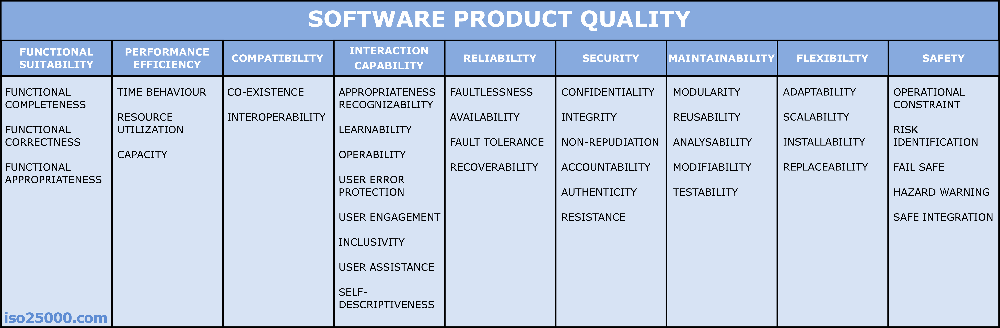

# 소프트웨어 제품 품질

## 두 가지 관점

- 위험 관리 측면: 소프트웨어의 버그나 오류는 불편함을 넘어 극단적으로는 인명 피해를 일으킬 수 있다. 따라서 안전하고 신뢰할 수 있는 소프트웨어를 만들고 사용해야 한다
- 비용 관리 측면: 소프트웨어의 성능을 효율적으로 최적화하여 유지 및 관리 비용을 줄이기 위해 노력해야 한다. 민첩한 비지니스 요구 사항에 대해 효과적으로 대응하기 위해 유연하게 변경이 가능해야 한다

## ISO-25010

ISO는 국제 표준화 기구(International Organization for Standardization)이다.

출처: <https://iso25000.com/index.php/en/iso-25000-standards/iso-25010>

### 기능적 적합성

이 특성은 제품이나 시스템이 지정된 조건에서 사용될 때 명시된 요구 사항과 암시된 요구 사항을 충족하는 기능을 제공하는 정도를 나타냅니다. 이 특성은 다음과 같은 하위 특성으로 구성됩니다.

- **기능적 완전성 -** 기능 세트가 지정된 모든 작업과 의도된 사용자 목적을 포괄하는 정도입니다.
- **기능적 정확성 -** 의도된 사용자가 제품이나 시스템을 사용할 때 정확한 결과를 제공하는 정도.
- **기능적 적절성 -** 기능이 지정된 작업과 목표 달성을 용이하게 하는 정도.

### 성능 효율성

이 특성은 제품이 지정된 시간 및 처리량 매개변수 내에서 기능을 수행하는 정도를 나타내며 지정된 조건에서 리소스(예: CPU, 메모리, 스토리지, 네트워크 장치, 에너지, 재료 등)를 사용하는 데 효율적입니다. 이 특성은 다음과 같은 하위 특성으로 구성됩니다.

- **시간적 행동 -** 제품이나 시스템이 기능을 수행할 때 응답 시간과 처리량이 요구 사항을 충족하는 정도입니다.
- **자원 활용도 -** 제품이나 시스템이 기능을 수행할 때 사용하는 자원의 양과 유형이 요구 사항을 충족하는 정도입니다.
- **용량 -** 제품이나 시스템 매개변수의 최대 한계가 요구 사항을 충족하는 정도입니다.

### 호환성

제품, 시스템 또는 구성 요소가 다른 제품, 시스템 또는 구성 요소와 정보를 교환하고/하거나 동일한 공통 환경 및 리소스를 공유하면서 필요한 기능을 수행할 수 있는 정도. 이 특성은 다음과 같은 하위 특성으로 구성됩니다.

- **공존 -** 한 제품이 다른 제품과 공통된 환경 및 리소스를 공유하면서도 다른 제품에 부정적인 영향을 미치지 않고 필요한 기능을 효율적으로 수행할 수 있는 정도입니다.
- **상호 운용성 -** 시스템, 제품 또는 구성 요소가 다른 제품과 정보를 교환하고 교환된 정보를 서로 사용할 수 있는 정도.

### 상호작용 능력

특정 사용자가 제품이나 시스템과 상호 작용하여 사용자 인터페이스를 통해 정보를 교환하고 다양한 사용 맥락에서 특정 작업을 완료할 수 있는 정도. 이 특성은 다음과 같은 하위 특성으로 구성됩니다.

- **적절성 인식성 -** 사용자가 제품이나 시스템이 자신의 필요에 적합한지 여부를 인식할 수 있는 정도입니다.
- **학습성 -** 지정된 시간 내에 지정된 사용자가 제품이나 시스템의 기능을 사용하는 방법을 배울 수 있는 정도입니다.
- **조작성 -** 제품이나 시스템이 조작하고 제어하기 쉬운 속성을 갖추고 있는 정도.
- **사용자 오류 보호.** 시스템이 사용자의 운영 오류를 방지하는 정도.
- **사용자 참여 -** 사용자 인터페이스가 지속적인 상호작용을 장려하는 매력적이고 동기를 부여하는 방식으로 기능과 정보를 제공하는 정도입니다.
- **포용성 -** 다양한 배경을 가진 사람들(예: 다양한 연령, 능력, 문화, 민족, 언어, 성별, 경제 상황 등)이 제품이나 시스템을 사용할 수 있는 정도입니다.
- **사용자 지원 -** 특정 사용 맥락에서 특정 목표를 달성하기 위해 가장 광범위한 특성과 역량을 갖춘 사람들이 제품을 사용할 수 있는 정도.
- **자체 설명성 -** 제품이 사용자에게 필요한 적절한 정보를 제공하는 정도이며, 제품이나 다른 리소스(예: 사용자 설명서, 헬프 데스크 또는 다른 사용자)와 과도한 상호 작용 없이도 사용자에게 제품의 기능과 사용법을 즉시 명확하게 보여줍니다.

### 신뢰성

시스템, 제품 또는 구성 요소가 지정된 기간 동안 지정된 조건에서 지정된 기능을 수행하는 정도. 이 특성은 다음 하위 특성으로 구성됩니다.

- **무결함성 -** 시스템, 제품 또는 구성요소가 정상적인 작동 중에 오류 없이 지정된 기능을 수행하는 정도.
- **가용성 -** 시스템, 제품 또는 구성요소가 필요할 때 작동하고 접근 가능한 정도.
- **장애 내구성 -** 하드웨어나 소프트웨어에 장애가 발생하더라도 시스템, 제품 또는 구성 요소가 의도한 대로 작동하는 정도.
- **복구 가능성 -** 중단이나 장애가 발생했을 때 제품이나 시스템이 직접 영향을 받은 데이터를 복구하고 시스템의 원하는 상태를 재구축할 수 있는 정도입니다.

### 보안성

제품 또는 시스템이 악의적인 행위에 의한 공격 패턴으로부터 방어하고 정보와 데이터를 보호하여 개인 또는 다른 제품 또는 시스템이 권한 유형 및 수준에 적합한 수준의 데이터 접근 권한을 갖도록 하는 정도. 이 특성은 다음과 같은 하위 특성으로 구성됩니다.

- **기밀성 -** 제품이나 시스템이 데이터에 대한 접근 권한이 있는 사람만 접근할 수 있도록 보장하는 정도.
- **무결성 -** 시스템, 제품 또는 구성 요소가 악의적인 행위나 컴퓨터 오류로 인해 시스템 및 데이터 상태가 무단 수정이나 삭제되지 않도록 보호하는 정도입니다.
- **부인 불가성 -** 행위나 사건이 발생했다는 것을 증명할 수 있는 정도. 나중에 해당 사건이나 행동을 부인할 수 없음.
- **책임성 -** 개체의 행동을 해당 개체에서만 고유하게 추적할 수 있는 정도.
- **진위성 -** 주체 또는 자원의 신원이 주장된 것과 동일하다는 것을 증명할 수 있는 정도.
- **저항성 -** 악의적인 행위자의 공격을 받는 동안 제품이나 시스템이 작동을 유지하는 정도입니다.

### 유지 보수성

이 특성은 제품이나 시스템을 환경과 요구 사항의 변화에 맞춰 개선, 교정 또는 적응하기 위해 수정할 수 있는 효과성과 효율성의 정도를 나타냅니다. 이 특성은 다음과 같은 하위 특성으로 구성됩니다.

- **모듈성 -** 시스템이나 컴퓨터 프로그램이 개별적인 구성요소로 구성되어 있어서 한 구성요소를 변경해도 다른 구성요소에 미치는 영향이 최소가 되는 정도.
- **재사용성 -** 제품이 두 개 이상의 시스템에서 자산으로 사용되거나 다른 자산을 구축하는 데 사용될 수 있는 정도입니다.
- **분석 가능성 -** 제품이나 시스템의 한 부분 이상을 의도한 대로 변경했을 때의 영향을 평가하고, 제품의 결함이나 고장 원인을 진단하거나, 수정할 부분을 식별하는 효과적이고 효율적인 정도입니다.
- **수정 가능성 -** 제품이나 시스템을 결함을 발생시키거나 기존 제품 품질을 저하시키지 않고 효과적이고 효율적으로 수정할 수 있는 정도.
- **테스트 가능성 -** 시스템, 제품 또는 구성 요소에 대한 테스트 기준을 확립하고 해당 기준이 충족되었는지 확인하기 위해 테스트를 수행할 수 있는 효과적이고 효율적인 정도입니다.

### 유연성

제품이 요구 사항, 사용 맥락 또는 시스템 환경의 변화에 적응할 수 있는 정도. 이 특성은 다음과 같은 하위 특성으로 구성됩니다.

- **적응성 -** 제품이나 시스템이 다양한 하드웨어, 소프트웨어 또는 기타 운영 또는 사용 환경에 효과적이고 효율적으로 적응되거나 이전될 수 있는 정도입니다.
- **확장성 -** 제품이 늘어나거나 줄어드는 작업 부하를 처리할 수 있는 정도나 변동성을 처리하기 위해 용량을 조정할 수 있는 정도입니다.
- **설치성 -** 지정된 환경에서 제품이나 시스템을 성공적으로 설치 및/또는 제거할 수 있는 효과적이고 효율적인 정도입니다.
- **대체성 -** 제품이 동일한 환경에서 동일한 목적으로 사용되는 다른 특정 소프트웨어 제품을 대체할 수 있는 정도입니다.

### 안전성

이 특성은 제품이 정의된 조건 하에서 인간의 생명, 건강, 재산 또는 환경이 위험에 처하는 상태를 피하는 정도를 나타냅니다. 이 특성은 다음과 같은 하위 특성으로 구성됩니다.

- **작동상의 제약 -** 제품이나 시스템이 작동상의 위험에 직면했을 때 작동을 안전한 매개변수나 상태 내로 제한하는 정도.
- **위험 식별 -** 제품이 생명, 재산 또는 환경을 허용할 수 없는 위험에 노출시킬 수 있는 사건이나 운영 과정을 식별할 수 있는 정도.
- **안전 실패 -** 제품이 자동으로 안전한 작동 모드로 전환되거나, 고장 발생 시 안전한 상태로 돌아갈 수 있는 정도.
- **위험 경고 -** 제품이나 시스템이 운영이나 내부 통제에 허용할 수 없는 위험에 대한 경고를 제공하여 안전한 운영을 유지하기에 충분한 시간 내에 대응할 수 있는 정도입니다.
- **안전한 통합 -** 제품이 하나 이상의 구성 요소와 통합되는 동안 및 통합 후에 안전성을 유지할 수 있는 정도.
