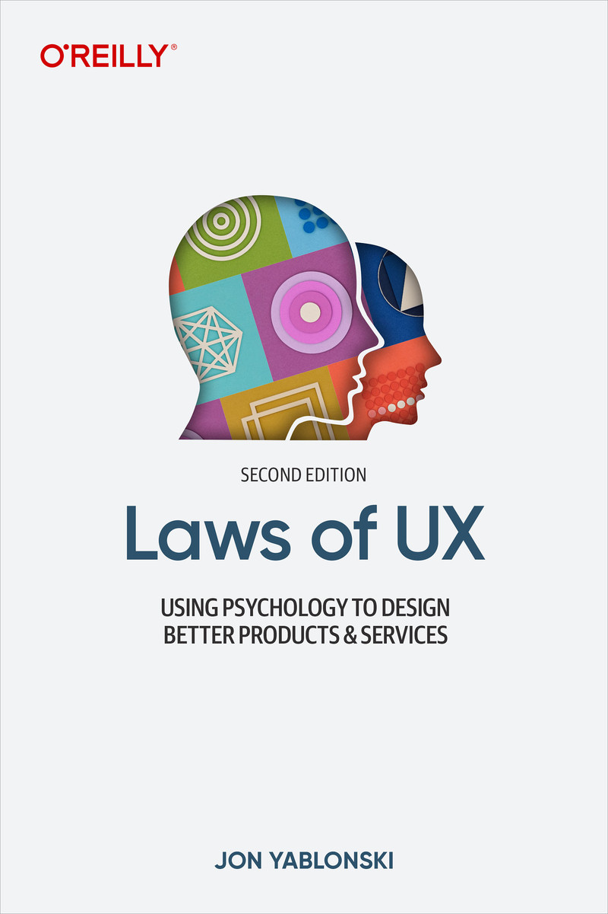

# Laws of UX

> 기존의 디자인을 바꿔야 한다는 기반 데이터가 없는 상황에서 초기 디자인의 정당성을 어떻게 입증할까? -> 심리학을 통한 설득

심리학 법칙을 통해 설명하는 디자인의 10가지 원칙. UI를 넘어 UX가 중요해지고 있다. 심리학 법칙들이 사용자 경험에 어떤 긍정적 영향을 줄 수 있는지 실제 적용된 예시와 함께 설명한다

책 읽기⬇️

https://learning.oreilly.com/library/view/laws-of-ux/9781098146955/

site: [https://lawsofux.com/](https://lawsofux.com/)

**인간 중심 디자인**(Human-centered design;HCD)은 심리학을 통해 사용자에게 제품이나 경험 디자인에 적응하라고 강요하지 않으면서도 인간에게 잘 맞는 디자인이다

**사용자 경험(User Experience;UX)**은 인터페이스를 포함한 최종 사용자와 시스템 간의 상호 작용의 모든 측면을 포함하는 개념이다

## 1. 제이콥의 법칙

\-제이콥 닐슨(Jacob Nielsen)

사용자가 인터페이스를 익히는 데 드는 에너지를 줄여 목표 달성에 에너지를투자하도록 한다

일반적인 디자인 관습(=축적된 경험)을 따를 것을 권장하여 사용자가 사이트의 주요 기능에 더욱 집중할 수 있도롭 돕는다.

### 멘탈 모델

어떤 시스템에 대해 작동 방식을 알고 있다고 생각하는 것

경험과 훈련 지시 등을 통하여 형성된 이 모델은 비슷하지만 낯선 상황에서 적용된다

새로운 제품을 만들 때 기존의 경험을 활용하여 낯설지 않도록 하면 사용자 경험이 향상될 수 있다

**방법**: 사용자 인터뷰 및 설문조사 / 심리학 / 프로토 타입 테스트 / 페르소나 / 여정 지도/ 공감 지도

**멘탈 모델 부조화**: 사용자의 멘탈 모델을 따르지 않는 디자인은 서비스에 악영향을 준다

#### 단시간 디자인 변화

익숙한 디자인을 단시간에 크게 변경하면 사용자의 경험에 악영향을 미칠 수 있다

\=> 디자인을 서서히 변화시키고, 그 동안 피드백을 수용하며, 이전 버전으로 돌아갈 수 있는 선택지를 제공.

\=> 충분히 사용자가 현재의 디자인에 적응했을때 디자인을 변경

#### 페르소나

페르소나는 해당 제품을 사용하는 가상의  대상 사용자이다

실제 데이터를 바탕으로 현실적이고 구체적으로 설정해야 한다

제품 개발 시에 자기 참조적 사고에 갇히지 않는다.

#### 모든 것이 같아야 하는 건 아니다

제이콥의 법칙은 사용자의 경험에 기반하여 익숙한 디자인을 제공함으로써 스트레스를 줄이도록 하는 것을 목표로 한다. 하지만 이것이 항상 같은 디자인을 고집해야 한다는 것을 의미하지는 않는다. 새로운 디자인이 기존 디자인보다 더 좋은 사용자 경험을 제공할 수도 있다. 하지만 제품을 만들고 사용자가 처음 사용할 때, 적어도 멘탈 모델을 사용한다면 낯선 제품을 익숙하게 사용하여 사용자는  원하는 바를 이룰 수 있다. 이렇듯 제이콥의 법칙은 경험이 주는 익숙함의 장점에 대해서 이야기 하는 것이다.

새로운 디자인을 도입하고 시도할 때는 기존의 디자인과 그 사용성을 생각하면서 어느 것이 더 사용자 입장에서 좋을 지에 대해 생각해야 한다.

## 2. 피츠의 법칙

\-폴 피츠(Pau Fitts)

대상에 도달하는 시간 => 대상의 크기와 대상과의 거리

대상이 작아지고 멀이지면 더 많은 시간이 소요된다

1. (크기) 사용자가 쉽게 인지하고 선택할 수 있도록 커야 한다.
2. (간격) 대상 간에 쉽게 구분되도록 충분한 간격이 확보되어야 한다.
3. (위치) 대상은 사용자가 쉽게 도달할 수 있는 영역에 배치되어야 한다.

### 공식

$$
T = a +blog_2(\frac{D}{W}+1)
$$

* 소요시간(T)
* 실험 상수(a,b)
* 물체와의 거리(D)
* 물체의 폭(W): 움직이는 방향 기준으로 물체의 폭, 오차는 ±W/2

### 스마트폰

스마트폰이 PC에 비해 화면이 작고 마우스 대신 손가락을 사용하므로 터치 영역이 넓다.

스마트폰을 쥘 때 인체구조 상 쉽게 도달할 수 있는 영역이 있고 아닌 영역이 존재한다

손가락의 두께에 의해 잘못 누를 가능성이 존재한다.

<figure><figcaption></figcaption></figure>

**한 손 모드:** 한 손 모드에서는 엄지 손가락이 갈 수 있는 위치가 쉽게 도달 가능한 영역이다

**중앙 집중:** 사용자의 시선은 화면 중앙에 집중하게 된다.

## 3. 힉의 법칙

\-월리엄 에드먼드 힉(William Edmund Hick), 레이 하이먼(Ray Hyman)

선택지의 개수를 줄여 사용자의 인지부하를 감소시켜라

불필요한 복잡성을 줄이고 단순화하라

추천 선택지를 강조하라


CTA: 사용자의 행동을 유도하는 요소 또는 행위


### 공식

선택지의 개수가  늘어나면소요 시간이 로그 함수로 증가

$$
T=blog_2(n+1)
$$

* 선택에 걸리는 소요 시간(T)
* 실험에 의해 측정된 상수(b)
* 선택지 개수(n)

### 인지부하

새로운 제품이나 서비스를 접했을 때, 사용자가 인터페이스를 익히는데 드는 정신적 자원 양

#### 리모컨

티비의 발전과 함께 리모컨의 버튼 수는 수십개까지 증가하였다

하지만 최근 들어서는 티비의OS, 소프트웨어를 이용한 UI를 통해 사용성을 높이고

리모컨은 단순해지고, 버튼 수는 줄어들었다.

 (1).png>)

### 아이콘

아이콘은 보편적인 아이콘도 있지만, 사람마다 의미를 다르게 생각할 수 있다.

명확한 의미를 전하기 위해서 텍스트를 함께 사용하여 추상성을 낮출 수 있다

## 4. 밀러의 법칙

\-조지 밀러(George Miller)

인간은 정보를 덩어리(그룹화)로 만들어 기억하면 더 효율적으로 기억할 수 있다

### 전화번호

전화번호를 7자리 연속으로 나열하지 않고 "-"와 같이 덩어리로 나누면 기억하기 쉽다

### 텍스트 장벽

단순히 텍스트만 길게 늘어놓은 글. 섹션을 나누어 제목을 사용하여 가독성을 높여야 한다

### 메뉴

메뉴 개수를 7개 이하로 유지하고 세부 카테고리를 덩어리화

### 카드

각각의 데이터를 카드 형식과 같이 덩어리화하여 나열

## 5. 포스텔의 법칙

\-존 포스텔(Jon Postel)

자신의 일에는 "엄격하게", 남의 일에는 "관대하게"&#x20;

**엄격** => 어느 상황에서나 정확하고 안정성이 높아야 한다

**관대** => 사용자의 다양한 입력과 환경에 대해서 유연하게 대처해야 한다

다양한 입력: 마우스, 키보드, 터치부터 음성, 제스처 등

다양한 환경: 웨어러블 기기부터 스마트폰, 태블릿, PC 등 기기와 해상도, 3G부터 Wifi까지 다양한 네트워크 환경,&#x20;

### TCP

자신이 다른 프로그램에게 데이터를 보낼 때는 엄격하게 명세를 준수하고

데이터를 받을 때는 명세를 정확히 준수하지 않아도 구문 분석을 통해 너그럽게 받아들인다

### 컴퓨터 인터랙션(HCI)

사용자와 컴퓨터 간의 인터랙션(HCI)에서는 사용자의 노력이 적을수록 좋다.

컴퓨터는 다양한사용자의 입력을 너그럽게 받아들이고 분석하여 컴퓨터가읽을 수 있는 형식으로 처리해야 한다.

\-> 사용자의 손글씨를 실제 텍스트로 변환, 사용자의 음성을 컴퓨터가 이해하는 언어로 변환

#### 잠금화면 변화

밀어서 잠금해제-> 숫자 입력 잠금 -> 패턴 잠금 -> 얼굴 인식, 홍채 인식 등 생체 인식 잠금

#### 반응형 웹 디자인

CSS의 반응형 속성들을 사용하여 다양한 기기에 대해서 유연하게 변화하는 디자인

만들 때는 스타일 속성과 미디어 쿼리의 값 등을 이용해 엄격하게 만들지만,&#x20;

사용할 때에는 기기의 크기나 유형에는 구애받지 않고 관대하게 반응

#### 점진적 성능 향상

최대한 많은 사용자에게 필수 콘텐츠와 기능을 제공하면서

최신 브라우저 사용자에게는 최신 기능을 통해 최상의 경험을 제공

* 최신 기능을 사용해 최상의 웹사이트를 만들 수 있도록 하면서
* 다양한 사용자 에이전트와 이전 브라우저 등에서도 유연하게 작동하도록 하는 것
* 모든 기능을 먼저 구현하고 하위 호환성을 생각하는 "우아한 성능 저하"방식과 대조적

#### 디자인 회복탄력성

디자인을 사용자의 기기나 환경에 유연하게 대처하면서 일관된 사용자 경험을 제공

반응형 디자인에서 공간이 작아질 때 덜 중요한 것들을 숨기기

다양한 언어와 그에 따른 글꼴 특성을 이해(같은 단어라도 글자 수 차이, 문자 방향 등)

## 6. 피크엔드 법칙

\-대니얼 카너먼(Daniel Kahneman)외 연구진

인간은 경험에서 절정의 순간과 마지막 순간의 감정에 기반해 경험을 판단하는 경향이 있다

사용자에게 좋은 경험을 주기 위해서는 절정의 순간과 마지막 순간에 경험을 방해하지 않도록 각별한 주의가 필요하다

### 인지 편향

경험에 의한 비논리적 추론에 의해 잘못된 판단을 하는 것

#### 확증 편향

기존의 신념을 지키기 위해 자신이원하는 바대로 정보를 수용하고 판단

#### 기억 편향

과거의 경험을 회상할 때 경험의 전체적인 느낌이 아닌 절정과 마지막 순간에 기반하여 더 잘 기억한다

### 결제

#### 선불  결제

결제를 마지막이 아닌 처음에 하도록 순서를 바꿈으로써 마지막 경험을 개선

#### 간편 결제

구매의 프로세스에서 일반적으로 마지막에 결제가 이루어진다. 최근에는 이러한 결제 단계를 간소화하여 마지막 경험을 향상시키고, 결제 완료 시 텍스트나 이미지 등을 통해 결제가 완료 되었음을 축하함으로써 기쁨을 선사한다.

#### 자동 결제

카카오택시에서는 택시요금을 자동으로 결제하게 할 수 있다. 택시가 도착지에 도착하면 결제해야 하는번거로운 마지막 경험을 자동 결제를 통해 개선했다

## 7. 심미적 사용성 효과

\-쿠로스 마사아키, 카시무라 카오리

보기 좋은 디자인을 사용성이 더 좋은 디자인으로 인식

즉, 심미적 만족도가 사용성에 긍정적영향을 주는 것이다

#### 사용성

제품이나 서비스가 사용자에게 ,얼마나 쉽게 사용되는지

### 자동 인지 처리

과거의 경험을 바탕으로 의식적인 주의 없이 정보를 처리하고 판단


사용자가 사이트를 처음 접속 하면 짧은 시간 내에 "시각적 매력"을 판단하여 사이트에 대한 의견을 형성한다


### 애플

애플은 좋은 제품, 소프트웨어 디자인을 자랑한다. 단순하면서도 사용성을 놓치지 않는다.

### 심미적 특성의 허점

좋은 디자인은 사용성에 좋은 영향을 미친다.

이는 반대로 사용성을 측정할 때에 디자인이 방해요소가 될 수 있다.

사용성이 그렇게 좋지 못해도 디자인이 좋아서 사용성이 좋다고 느낄 수 있기 때문이다

## 8. 폰 레스토프 효과

\-헤드윅 폰 레스토프(Hedwig von Restorff)

인간은 시각적으로, 개념적으로 분리된 항목을 더 잘 기억한다

시각적 대비를 통해 중요한 정보를 강조하고 사용자의 주의를 끌어 목표로 안내하라

_시각적 요소: 색상, 형태, 크기, 위치, 움직임 등_

### 선택적 주의력

주의를 산만하게 하거나 관련 없는 정보를 무시하고 관련 있는 정보에 집중하는 것

#### 배너 무시

광고로 오인될 수 있거나, 광고 주변에 위치한 정보들은 사용에게 무시 당할 가능성이 높다

### 웹 요소

* 배경 색상을 통한 버튼 강조
* 텍스트에밑줄을 그어 링크임을 표시
* 화면에서 상호작용이 필요한 부분에만 제한적으로강조 색상을 사용하여 행동 유도

.png>)

### 선택지 강조

여러 가지 선택지가 있을 때 기본 값이 되는  항목 또는 추천하는 항목을 강조하여 시각적으로 단서를 제공

여러 가지가 동일하게 강조되면, 다시 시각적 경쟁이 발생하고 사용자에게 더 혼란을 줄 수 있다.

강조에 제한을 두어 강조된 요소가 경쟁하는 것을 피해야 한다

### 접근성

강조를 할 때에는 다양한 사용자를 고려해야 한다.

색상 또는 대비를 통한 강조 -> 색맹 사용자, 시력 장애 등 시각적으로 불편한 사용자에게 불리

움직임을 통한 강조 -> 움직임에 민감한 질환을 가진 사용자에게 불편을 초래

## 9. 테슬러의 법칙

\-래리 테슬러(Larry Tesler)

모든 시스템에는 더 이상 줄일 수 없는 일정 수준의 복잡성이 존재한다.

이러한 복잡성은 디자인, 개발 과정에서 고려하고 처리해야 한다.

처리 되지 못한 복잡성은 사용자에게 전가되어 혼한을 야기할 수 있다

### 이메일

계정 정보를 보내는 사람에 사용하고, 받는 사람은 과거 내역을 통해 추천하여 복잡성 감소

### 결제&#x20;

결제 프로세스에서 기존의 정보 또는 과거의 주문 내역을 활용하여 필요한 정보를 간소화

## 10. 도허티 임계

\-도허티(Doherty)

컴퓨터의 반응 속도가 0.4초 이내이면 생산성이 올라간다

사용자 피드백을 0.4초 내에 제공하여 사용자의 주의가 분산되는 것을 막아라

사용자는 0.1초 이상의 지연을 감지할 수 있다.

1초 이상의 지연은 사용자에게 지루함을 느끼게 하고 이탈까지 이어질 수 있다.

### 로딩

로딩 스피너와 스켈레톤,  진행 상태바같은 요소를 제공하여 사용자에게 로딩 중임을 알려주면기다리는데 더 관대해진다.

### 블러 업

일반적으로 사이트에서 로딩의 큰 부분을 차지하는 것이 이미지이다.

**블러 업(blur up) 기법**은 아주 작은 사이즈의 이미지를 미리 다운로드하여 확대하여 대신 보여준다. 그 후 고해상도 이미지 다운로드가 완료되면 대체하여 정상적으로 보여준다.

### 10초

사용자가 눈 앞의 작업에 집중을 유지할 수 있는 시간

더 긴 작업에는 구체적인 작업의 현재 상황이나 예상 완료 시간 등을 제공하여 사용자에게 선택지를 제공

### 낙관적 UI

작업을 처리 후에 피드백(다음 동작)을 하지 않고, 작업이 시작된 후에 바로 피드백을 하고 오류가 발생했을 때에만 오류 메시지를 표시하는 방법

유튜브, 인스타그램 등에서 댓글을 작성하거나 좋아요를 누르는 등의 동작에서 사용된다.

체감 성능을 개선하여 사용자에게더 빨리 처리되는 것처럼 느끼게 만든다

###

###

####
