# 💻 Computer Science

### 컴퓨터의 구성

```mermaid
flowchart LR
    id0(컴퓨터) --> id1(컴퓨터가 이해하는 정보)
    id1(컴퓨터가 이해하는 정보) --> id2(데이터)
    id1(컴퓨터가 이해하는 정보) --> id3(명령어)
    id0(컴퓨터) --> id4(핵심 부품)
    id4(핵심 부품) --> id5(CPU)
    id4(핵심 부품) --> id6(메모리)
    id4(핵심 부품) --> id7(보조기억장치)
    id4(핵심 부품) --> id8(입출력장치)
```

## Computer System

- [x] [CPU (ALU, CU, Register)](./computer-system/cpu.md)
- [x] [Memory (RAM, Cache Memory) and Memory hierarchy](./computer-system/memory.md)
- [x] [Input/Output Devices](./computer-system/io-devices.md)
- [x] [Bus](./computer-system/bus.md)
- [x] [Data-representation (Binary, Octal, Hexadecimal)](./computer-system/data-representation.md)
- [x] [Data Types (Integer, Floating Point, Fixed Point)](./computer-system/data-types.md)
- [x] [Character Encodings (Unicode, ASCII)](./computer-system/character-encodings.md)
- [x] [Concurrency and Parallelism](./computer-system/concurrency-and-parallelism.md)

## Operating System

- [x] [Components of Operating System](./operating-system/components.md)
- [x] [Kernel](./operating-system/kernel.md)
- [x] [Process Management](./operating-system/process-management.md)
- [x] [Memory Management (Virtual Memory, Paging, and Segmentation, Page Replacement Algorithm)](./operating-system/memory-management.md)
- [x] [I/O Management](./operating-system/io-management.md)
- [x] [File System(directory structure, permissions)](./operating-system/file-system.md)

## Data Structures

- [ ] Linear data
  - [ ] array
  - [ ] queue
  - [ ] stack
  - [ ] linked list
- [ ] Non-linear
  - [ ] tree
  - [ ] hash table
  - [ ] graph

## Algorithms

- [ ] Complexity analysis and Big-O notation
- [ ] Sorting Algorithms (Bubble, Insert, Select, Quick, Merge)
- [ ] Traversal algorithms (binary traversal, sequential traversal)
- [ ] Dynamic Planning (DP) and Griddy Algorithm
- [ ] Divide and conquer algorithms
- [ ] Backtracking and Brute Force
- [ ] Hashing and set/map operations

## Database

- [ ] DBMS
- [ ] SQL and NoSQL
- [ ] Normalization and Denormalization
- [ ] Entity Relationship Model (ERM, ERD)
- [ ] DDL (Data Definition Language) - CREATE, ALTER, DROP
- [ ] DML (Data Manipulation Language) - SELECT, INSERT, UPDATE, DELETE
- [ ] DCL (Data Control Language) - GRANT, REVOKE
- [ ] DQL (Data Query Language) - SELECT
- [ ] Transaction - ACID(Atomicity, Consistency, Isolation, Durability)
- [ ] Database index
- [ ] Distributed database

## Networking

- [ ] OSI Model
- [ ] TCP/IP Model
- [ ] DNS, DHCP, NAT
- [ ] HTTP
- [ ] HTTPS & TLS/SSL
- [ ] Sockets
- [ ] Routing and Switching
- [ ] Firewall

## Security

- [ ] Encryption (Symmetric-key cryptography, Public-key cryptography)
- [ ] Cryptographic hash functions
- [ ] Cryptocurrencies
- [ ] encryption vulnerabilities
- [ ] Integrity and Confidentiality
- [ ] OWASP Top 10

## Compiler

- [ ] difference between compilers and interpreters
- [ ] preprocessing, lexical analysis, parsing, semantic analysis
- [ ] abstract syntax tree
- [ ] Interpreter
- [ ] Virtual machine
