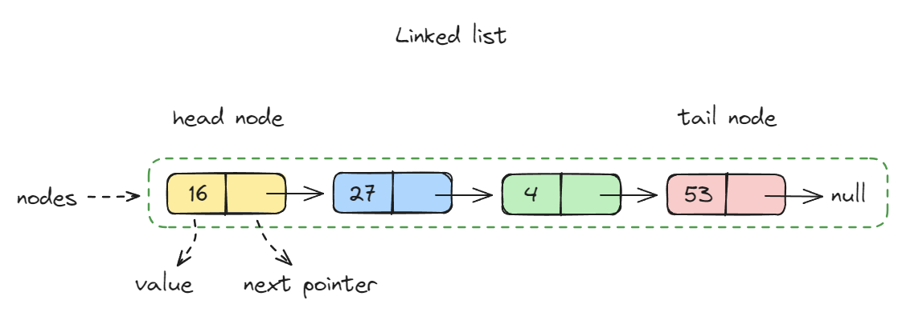

# Linked list



* 내부적으로 Node라는 데이터 구조를 연결하여 사용한다
* 동적 사이즈를 통해 배열을 쉽게 확장하거나 축소할 수 있다
* 맨 앞이나 맨 뒤에 삽입, 삭제하는 것이 쉽다
* 유연한 메모리 할당
* 다른 데이터 구조들을 구현할 수 있다

```javascript
class Node {
  constructor(value) {
    this.value = value;
    this.next = null;
  }
}
```

```javascript
class LinkedList {
  constructor() {
    this.head = null;
    this.tail = null;
  }

  add(value) {
    const node = new Node(value);

    if (!this.head) {
      this.head = node;
    } else {
      this.tail.next = node;
    }

    this.tail = node;
  }

  printAll() {
    let current = this.head;

    while (current) {
      console.log(current.value);
      current = current.next;
    }
  }

  get(index) {
    let current = this.head;
    let currentIndex = 0;

    while (currentIndex < index) {
      if (!current) {
        return null;
      }

      current = current.next;
      currentIndex++;
    }

    return current;
  }

  insertAt(index, value) {
    const node = new Node(value);

    if (index === 0) {
      node.next = this.head;
      this.head = node;
      return;
    }

    const current = this.getNodeAtIndex(index - 1);

    if (!current) {
      return;
    }

    node.next = current.next;
    current.next = node;
  }

  removeAt(index) {
    if (index === 0) {
      this.head = this.head.next;
      return;
    }

    const current = this.getNodeAtIndex(index - 1);

    if (!current) {
      return;
    }

    current.next = current.next.next;
  }

  getNodeAtIndex(index) {
    let current = this.head;
    let currentIndex = 0;

    while (currentIndex < index) {
      if (!current) {
        return null;
      }

      current = current.next;
      currentIndex++;
    }

    return current;
  }
}
```

```javascript
function findMiddle(list) {
  let slow = list.head;
  let fast = list.head;
  let prev = null;
  while (fast && fast.next) {
    fast = fast.next.next;
    prev = slow;
    slow = slow.next;
  }

  return fast === null ? prev.next : slow;
}

```
