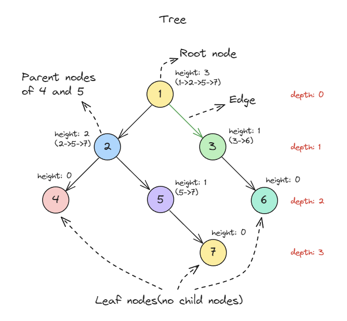

# Tree



* 노드(node/vertex/edge): 데이터를 가지는 트리의 기본 원소
* 루트 노드(root node): 부모 노드가 없는 트리의 최상위 노드
* 리프 노드(leaf node): 자식 노드가 없는 노드
* 엣지(edge, branch, link): 노드와 노드의 연결
* 높이(height): 해당 노드에서 리프 노드까지의 하향 경로 길이
* 깊이(depth): 해당 노드에서 루트까지의 경로 길이
* 루트 노드의 깊이는 0이다
* 리프 노드의 높이는 0이다

```javascript
class TreeNode {
  constructor(value) {
    this.value = value;
    this.left = null;
    this.right = null;
  }
}
```

```javascript
const a = new TreeNode("a");
const b = new TreeNode("b");
const c = new TreeNode("c");
const d = new TreeNode("d");
const e = new TreeNode("e");
const f = new TreeNode("f");

a.left = b;
a.right = c;

b.left = d;
b.right = e;

c.right = f;
```

## 깊이 우선 탐색

```javascript
function depthFirstSearch(root) {
  if (!root) {
    return;
  }
  const result = [];
  const stack = [root];

  while (stack.length) {
    const node = stack.pop();
    result.push(node.value);

    if (node.right) {
      stack.push(node.right);
    }

    if (node.left) {
      stack.push(node.left);
    }
  }

  return result
}
```

```javascript
depthFirstSearch(a) // [ 'a', 'b', 'd', 'e', 'c', 'f' ]
```

1. a 노드 탐색
   1. a 노드의 왼쪽 노드 b 탐색
      1. b 노드의 왼쪽 노드 d 탐색
      2. b 노드의 오른쪽 노드 e 탐색
   2. a노드의 오른쪽 노드 c 탐색
      1. c노드의 오른쪽 노드 f 탐색

## 너비 우선 탐색

```javascript
function breadthFirstSearch(root) {
  const result = [];
  const queue = [root];

  while (queue.length) {
    const node = queue.shift();
    result.push(node.value);

    if (node.left) {
      queue.push(node.left);
    }

    if (node.right) {
      queue.push(node.right);
    }
  }

  return result;
}
```

```javascript
breadthFirstSearch(a) // [ 'a', 'b', 'c', 'd', 'e', 'f' ]
```

1. a 노드 탐색
   1. a 노드의 왼쪽 노드 b 탐색
   2. a 노드의 오른쪽 노드 c 탐색
   3. b 노드의 왼쪽 노드 d 탐색
   4. b 노드의 오른쪽 노드 e 탐색
   5. c 노드의 오른쪽 노드 f 탐색
