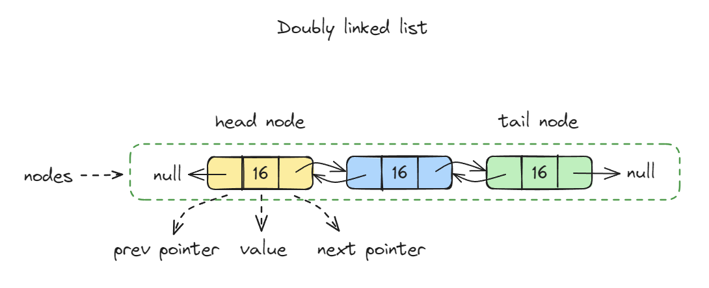

# Doubly Linked List

양방향 연결 리스트



- 양방향 탐색
- 효율적인 삽입, 삭제
- 반대로 탐색 가능

```javascript
class Node {
  constructor(data) {
    this.data = data;
    this.next = null;
    this.prev = null;
  }
}
```

```javascript
class DoublyLinkedList {
  constructor() {
    this.head = null;
    this.tail = null;
    this.length = 0;
  }

  append(data) {
    const node = new Node(data);
    if (!this.head) {
      this.head = node;
      this.tail = node;
    } else {
      node.prev = this.tail;
      this.tail.next = node;
      this.tail = node;
    }
    this.length++;
  }

  prepend(data) {
    const node = new Node(data);
    if (!this.head) {
      this.head = node;
      this.tail = node;
    } else {
      node.next = this.head;
      this.head.prev = node;
      this.head = node;
    }
    this.length++;
  }

  get(index) {
    if (index >= this.length) {
      return null;
    }

    let current = this.head;
    let currentIndex = 0;

    while (currentIndex < index) {
      current = current.next;
      currentIndex++;
    }

    return current;
  }

  insertAt(index, data) {
    if (index === 0) {
      this.prepend(data);
      return;
    }

    if (index >= this.length) {
      this.append(data);
      return;
    }

    const node = new Node(data);
    const current = this.get(index);

    node.prev = current.prev;
    node.next = current;
    current.prev.next = node;
    current.prev = node;
    this.length++;
  }

  removeAt(index) {
    if (index === 0) {
      this.head = this.head.next;
      this.head.prev = null;
      this.length--;
      return;
    }

    if (index === this.length - 1) {
      this.tail = this.tail.prev;
      this.tail.next = null;
      this.length--;
      return;
    }
    const current = this.get(index);

    current.prev.next = current.next;
    current.next.prev = current.prev;
    this.length--;
  }

  contains(data) {
    let current = this.head;
    while (current) {
      if (current.data === data) {
        return true;
      }
      current = current.next;
    }
    return false;
  }

  printAll() {
    let current = this.head;
    let index = 0;
    while (current) {
      console.log(`[${index++}]`, current.data);
      current = current.next;
    }
  }
}
```

