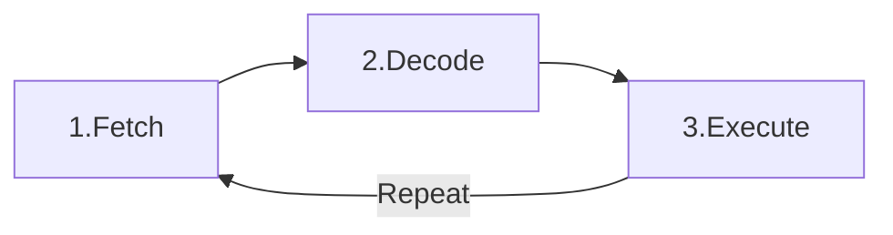

# CPU

## CPU란

**CPU**(Central Processing Unit)는 우리말로 **중앙 처리 장치**라고 하며, 컴퓨터의 두뇌에 해당합니다. 컴퓨터에서 수행하는 모든 연산과 논리적인 처리를 담당하며, 소프트웨어의 명령을 해석하고 실행하는 핵심 부품입니다.

CPU는 다음과 같은 역할을 합니다:

- **연산 수행**: 산술 및 논리 연산을 처리합니다.
- **명령 제어**: 프로그램의 명령을 해석하고 실행 순서를 관리합니다.
- **데이터 이동**: 메모리와 주변 장치 간의 데이터 흐름을 제어합니다.

## CPU의 역사

### **초기 컴퓨터와 CPU의 탄생**

- **1940~1950년대**: 초창기 컴퓨터는 진공관과 릴레이를 사용하여 거대한 규모였으며, 연산 속도가 매우 느렸습니다.
- **1960년대**: 트랜지스터의 발명으로 컴퓨터는 소형화되고 성능이 향상되었습니다.
- **1971년**: 인텔에서 세계 최초의 마이크로프로세서인 **인텔 4004**를 개발하여 CPU를 하나의 칩에 집적시켰습니다.

### **CPU의 발전 과정**

- **집적 회로 기술의 발전**: 더 작은 크기에 더 많은 트랜지스터를 집적하여 성능 향상.
- **클럭 속도 증가**: 더 높은 주파수로 동작하여 연산 속도 향상.
- **멀티코어 프로세서의 등장**: 하나의 CPU에 여러 코어를 내장하여 병렬 처리 능력 향상.

## CPU의 구성 요소와 작동 원리

### **CPU의 주요 구성 요소**

1. **산술 논리 연산 장치(ALU; Arithmetic Logic Unit)**
2. **제어 장치(Control Unit)**
3. **레지스터(Register)**
4. **캐시 메모리(Cache Memory)**

## 산술 논리 연산 장치(Arithmetic Logic Unit)

- **산술 논리 연산 장치**로, CPU의 핵심 부품 중 하나입니다.
- AU (산술 장치) + LU (논리 장치)를 합친 디지털 회로입니다.
- **산술 연산**과 **논리 연산**을 수행하여 데이터 처리를 담당합니다.
- **산술 연산**: 덧셈, 뺄셈, 곱셈, 나눗셈 등의 수학 연산을 수행합니다.
- **논리 연산**: AND, OR, NOT, XOR 등의 논리 연산을 수행하여 데이터를 처리합니다.

## 제어 장치(Control Unit)

- **제어 장치**는 CPU의 핵심 부품 중 하나로, 명령어를 해석하고 실행하는 역할을 합니다.
- **명령어 해독**: 명령어를 해석하여 CPU의 다른 부품에 전달합니다.
- **명령어 실행**: 명령어에 따라 적절한 동작을 수행합니다.
- **제어 흐름 관리**: 명령어의 실행 순서를 관리하고 제어합니다.
- **예외 처리**: 오류나 예외 상황을 처리합니다.
- **동기화**: 다양한 부품 간의 작업을 동기화하여 조절합니다.
- **제어부**: 주기억 장치에 저장되어 있는 **명령어를 순서대로 호출하여 해독**하고, 제어 신호를 발생시켜 컴퓨터의 각 장치의 동작을 제어 (스케쥴링)
- **내부 버스**: 기억, 연산, 제어 기능을 실현하기 위한 CPU와 주기억 장치, 입출력 장치, 외부 기억 장치, 주변 장치, 통신 처리 장치 등의 제어부 사이를 연결하는 버스

## 레지스터(Register)

- **레지스터**는 CPU 내부에 있는 고속 메모리로, 데이터를 임시로 저장하는 역할을 합니다.
- **범용 레지스터**: 연산에 필요한 데이터나 연산 결과를 임시로 저장합니다.
- **특수목적 레지스터**: 특정 목적을 가진 레지스터로, 주소, 명령어, 데이터 등을 저장합니다.

## 캐시 메모리(Cache Memory)

- **캐시 메모리**는 CPU와 메인 메모리 사이에 위치한 고속 메모리로, 데이터를 임시로 저장하여 접근 속도를 높여 CPU와 메인 메모리 사이의 속도 차이를 줄여주는 역할을 합니다.
- **레지스터 > 캐시 메모리 > 주 메모리(RAM) > 보조 기억 장치** 순으로 접근 속도가 빠릅니다.
- **L1, L2, L3 캐시 메모리**가 있으며, L1이 가장 빠르고 작고, L3이 가장 느리고 큽니다.
- 자주 사용하는 데이터를 저장하여 접근 속도를 높입니다.
- `L2, L3 캐시 메모리:` CPU와 별도의 공간에 존재하고 RAM과 CPU 사이에서 버퍼 역할
- `CPU 레지스터`: CPU안에서 연산을 처리하고 데이터를 저장하는 공간
  - 메인 메모리에서 데이터 접근하는 시간을 줄이기 위한 메모리
  - CPU에서 자주 사용하는 데이터나 명령을 저장하여 CPU 성능 향상
  - CPU 메모리보다 싸고 메인 메모리보다 비싸다
  - L1은 L2보다 비싸지만 빠르고 용량이 크다.
  - L2도 L3에 비해 비싸지만 용량이 크다

### 메모리 지역성(Locality)

#### 시간 지역성

- 최근 액세스 된 기억 장소가 가까운 미래에 다시 액세스 가능성이 높다.

#### 공간 지역성

- 액세스된 기억장소와 인접한 기억장소가 액세스될 가능성 높다.

### 캐시 히트(Cache Hit)

CPU가 데이터를 요청하여 캐시 메모리에 접근했을 때 캐시 메모리에 해당 데이터가 있는 것

- 위치도 가깝고 CPU 내부버스를 기반으로 작동하여 빠르다
- 👉 캐시히트를 하게 되면 해당 데이터를 제어장치를 거쳐 가져오게 된다.

### 캐시 미스(Cache Miss)

해당 데이터가 캐시에 없어서 주 기억장치(RAM)로 가서 데이터를 찾아오는 것

- 👉 메모리를 가져올 때 시스템 버스를 기반으로 작동하기 때문에 느리다
- **Compulsory Miss**: 데이터가 이전에 요청된 적이 없었기 때문에 캐시에 존재하지 않아 미스가 발생
- **Capacity Miss**: 캐시가 시스템에 필요한 모든 데이터를 포함할 수 없을 때 발생
- **Conflict Miss**: 순서대로 액세스되는 여러 데이터 항목이 캐시 세트라고 하는 동일한 캐시 위치에 매핑될 때 발생
- **Coherence Miss**: 멀티 프로세서 시스템에서 한 프로세서가 개인 캐시에서 데이터 항목을 업데이트하여 다른 프로세서의 캐시에 있는 해당 데이터 항목을 오래되게 만들 때 발생

### 캐시 맵핑(Cache Mapping)

캐시의 데이터를 메모리와 어떻게 대응 시킬지를 결정하는 방법

- Direct Mapping
  - 직접 매핑 방식
  - 캐시 슬롯과 메모리 주소를 일대일 대응
  - 각 메모리 블록은 고정된 위치의 캐시 슬롯에 저장
  - 처리가 빠르지만 충돌 발생 위험
- Set Associative Mapping
  - 집합 연관 매핑 방식
  - 캐시를 여러 개의 집합으로 나누고 각 집합은 여러 개의 슬롯으로 구성
  - 충돌을 줄이면서 성능을 향상
- Fully Associative Mapping
  - 완전 연관 매핑 방식
  - 캐시 슬롯의 개수에 제한없이, 메모리 블록은 어떤 슬롯에든 저장될 수 있음
  - 가장 유연하여 충돌 위험이 가장 적음
  - 검색 시간이 오래 걸리고 하드웨어 복잡성이 증가

### 캐시 적중률(Cache Hit Ratio)

캐시 적중률은 캐시 적중 수를 캐시 액세스 수로 나누어 계산한다

캐시 적중률 = 캐시 적중 수 / 캐시 액세스 수

## CPU의 명령어 사이클(Instruction cycle)

### 주요 구성 요소

- 메모리 주소 레지스터: (MAR) : 명령어의 위치를 설명하는 주소를 저장합니다.
- 프로그램 카운터 (PC) : 다음에 수행할 명령어의 주소를 저장합니다.
- 현재 명령어 레지스터 (IR) : CPU가 명령을 디코딩하고 실행 단계에 대한 올바른 제어 신호를 생성하기 위해 명령을 일시적으로 보관합니다.
- 메모리 데이터 레지스터(MDR): MAR의 주소에서 읽은 명령어를 일시적으로 보관합니다.
- 제어 장치(CU): 현재 명령어 레지스터의 명령어를 디코딩한 후 CPU 내의 다른 구성 요소에 신호를 내거나 피연산자를 가져오기 위해 메모리로 다시 보내는 등의 역할을 합니다.
- 산술 논리 장치(ALU): 명령어의 특정 명령어에 따라 산술 연산을 수행합니다.

### 단계 별 요약

1. **명령어 인출(Fetch)**:
   - 메모리에서 다음 명령어를 검색하여 명령어를 가져옵니다.
2. **명령어 해독(Decode)**:
   - 가져온 명령어를 해석하여 어떤 연산이 필요한지를 결정하고 명령어를 실행할 준비를 합니다.
3. **명령어 실행(Execute)**:
   - 해석된 명령어에 따라 연산을 수행합니다.
4. **1 - 3까지의 과정을 반복**
   - 모든 명령어가 실행될 때까지 이 과정을 반복하며 이 때 인터럽트가 발생할 수 있습니다.

## CPU의 성능 지표

### **1) 클럭 속도 (Clock Speed)**

- **GHz(기가헤르츠)** 단위로 표현되며, 초당 실행 가능한 사이클 수를 나타냅니다.
- 일반적으로 클럭 속도가 높을수록 CPU의 연산 속도가 빠릅니다.

### **2) 코어 수 (Number of Cores)**

- CPU 내에 독립적으로 작업을 수행할 수 있는 연산 유닛입니다.
- **듀얼 코어**, **쿼드 코어**, **옥타 코어** 등이 있으며, 코어 수가 많을수록 동시에 더 많은 작업을 처리할 수 있습니다.

### **3) 스레드 수 (Number of Threads)**

- 코어 내에서 처리할 수 있는 작업의 흐름이며, **하이퍼 스레딩** 기술로 코어당 두 개 이상의 스레드를 처리할 수 있습니다.

### **4) 캐시 메모리 크기**

- CPU 내부의 캐시 메모리 용량이며, 용량이 클수록 데이터 접근 속도가 향상됩니다.

### **5) TDP(Thermal Design Power)**

- CPU가 작동할 때 발생하는 최대 열 출력을 나타내며, 낮을수록 전력 효율이 좋습니다.
