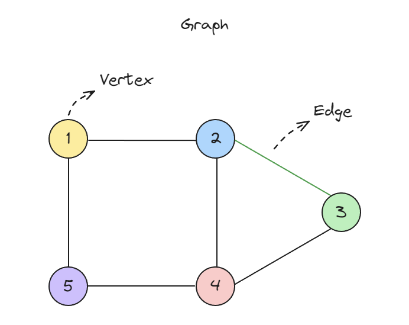

# Graph



```javascript
class Graph {
  constructor() {
    this.adjacencyList = {};
  }

  addVertex(vertex) {
    this.adjacencyList[vertex] = [];
  }

  removeVertex(vertex) {
    delete this.adjacencyList[vertex];

    for (const v in this.adjacencyList) {
      this.adjacencyList[v] = this.adjacencyList[v].filter(
        (e) => e !== vertex
      );
    }
  }

  addEdge(vertex1, vertex2) {
    this.adjacencyList[vertex1].push(vertex2);
    this.adjacencyList[vertex2].push(vertex1);
  }

  removeEdge(vertex1, vertex2) {
    this.adjacencyList[vertex1] = this.adjacencyList[vertex1].filter(
      (v) => v !== vertex2
    );
    this.adjacencyList[vertex2] = this.adjacencyList[vertex2].filter(
      (v) => v !== vertex1
    );
  }

  print() {
    for (const vertex in this.adjacencyList) {
      console.log(`${vertex}: ${this.adjacencyList[vertex].join("")}`);
    }
  }
}
```

```javascript

const graph = new Graph();
graph.addVertex("A");
graph.addVertex("B");
graph.addVertex("C");

graph.addEdge("A", "B");
graph.addEdge("A", "C");
graph.addEdge("B", "C");

graph.print();
console.log("Removing edge A-B");
graph.removeEdge("A", "B");
graph.print();

console.log("Removing vertex A");
graph.removeVertex("A");
graph.print();
```


## 깊이 우선 탐색

```javascript
function depthFirstSearch(graph, start) {
  const visited = new Set();
  const stack = [start];
  const result = [];
    
  while (stack.length) {
    const vertex = stack.pop();

    if (visited.has(vertex)) {
      continue;
    }

    result.push(vertex);
    visited.add(vertex);

    for (const neighbor of graph[vertex]) {
      stack.push(neighbor);
    }
  }
  console.log(result.join(", "));
}

depthFirstSearch(graph.adjacencyList, "A"); // A C E F D B
```


## 너비 우선 탐색

```javascript
function breadthFirstSearch(graph, start) {
  const visited = new Set();
  const queue = [start];
  const result = [];
  while (queue.length) {
    const vertex = queue.shift();

    if (visited.has(vertex)) {
      continue;
    }

    result.push(vertex);
    visited.add(vertex);

    for (const neighbor of graph[vertex]) {
      queue.push(neighbor);
    }
  }
  console.log(result.join(", "));
}

breadthFirstSearch(graph.adjacencyList, "A");
```
