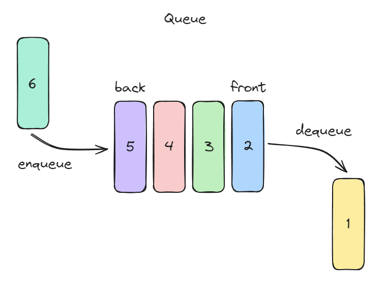

# 큐(Queue)

큐의 요소가 추가되고 제거되는 순서는 **선입선출(First In First Out, FIFO)** 방식에 따라 이루어진다. 따라서 요소는 큐의 마지막에만 추가되며, 큐의 첫 부분에서만 나갈 수 있다. 큐는 먼저 들어간 것이 먼저 나오므로 차례대로 처리하는 일상의 줄 서기와 비슷하다



## 큐의 특징

* **Front**: 큐의 맨 앞을 가리키며, 요소가 제거되는 위치입니다.
* **Rear (Back)**: 큐의 맨 뒤를 가리키며, 요소가 추가되는 위치입니다.

## 큐의 기본 동작

| **Operation** | **Signature**          | **Description**         | **Performance** |
| ------------- | ---------------------- | ----------------------- | --------------- |
| **Enqueue**   | Q × value → Q          | 큐의 맨 뒤에 새로운 값을 추가합니다.   | O(1)            |
| **Dequeue**   | Q → value \| undefined | 큐의 맨 앞에서 값을 제거하고 반환합니다. | O(1)            |
| **Front**     | Q → value \| undefined | 큐의 맨 앞 요소를 반환합니다.       | O(1)            |
| **Is Empty**  | Q → boolean            | 큐가 비어 있는지 확인합니다.        | O(1)            |
| **Size**      | Q → number             | 큐에 있는 요소의 개수를 반환합니다.    | O(1)            |

## 큐의 추가 동작과 Signature

| **Operation** | **Signature**       | **Description**       | **Performance** |
| ------------- | ------------------- | --------------------- | --------------- |
| **Clear**     | Q → Q               | 큐의 모든 요소를 제거합니다.      | O(1)            |
| **Contains**  | Q × value → boolean | 특정 값이 큐에 존재하는지 확인합니다. | O(n)            |
| **To Array**  | Q → array           | 큐의 모든 요소를 배열로 반환합니다.  | O(n)            |

## 큐의 구현

### 배열(List) 기반 구현

```javascript
class Queue {
  constructor() {
    this.items = []; // 큐의 요소를 저장할 배열
  }

  enqueue(value) {
    this.items.push(value); // 큐의 맨 뒤에 요소 추가
  }

  dequeue() {
    return this.items.shift(); // 큐의 맨 앞에서 요소 제거 및 반환
  }

  front() {
    return this.items.length === 0 ? undefined : this.items[0]; // 맨 앞 요소 반환
  }

  isEmpty() {
    return this.items.length === 0; // 큐가 비어있는지 확인
  }

  size() {
    return this.items.length; // 큐의 크기 반환
  }

  clear() {
    this.items = []; // 큐를 초기화
  }

  contains(value) {
    return this.items.includes(value); // 특정 값이 존재하는지 확인
  }

  toArray() {
    return [...this.items]; // 큐의 요소를 배열로 반환
  }
}

// 사용 예제
const queue = new Queue();
queue.enqueue(10);
queue.enqueue(20);
queue.enqueue(30);

console.log("Front element:", queue.front()); // Front element: 10
console.log("Queue size:", queue.size()); // Queue size: 3
console.log("Is empty?", queue.isEmpty()); // Is empty? false

queue.dequeue();
console.log("After dequeue, front element:", queue.front()); // After dequeue, front element: 20
console.log("Queue contains 20?", queue.contains(20)); // Queue contains 20? true
queue.clear();
console.log("After clear, is empty?", queue.isEmpty()); // After clear, is empty? true
```

### 연결 리스트(Linked List) 기반 구현

```javascript
class Node {
  constructor(value) {
    this.value = value;
    this.next = null;
  }
}

class Queue {
  constructor() {
    this.frontNode = null; // 큐의 맨 앞 노드
    this.rearNode = null;  // 큐의 맨 뒤 노드
    this.queueSize = 0;    // 큐의 크기
  }

  enqueue(value) {
    const newNode = new Node(value);
    if (this.isEmpty()) {
      this.frontNode = this.rearNode = newNode; // 큐가 비어있으면 front와 rear 모두 새 노드를 가리킴
    } else {
      this.rearNode.next = newNode; // 기존 rear 뒤에 새 노드를 연결
      this.rearNode = newNode; // rear를 새 노드로 갱신
    }
    this.queueSize++;
  }

  dequeue() {
    if (this.isEmpty()) return undefined; // 큐가 비어있으면 undefined 반환
    const dequeuedValue = this.frontNode.value; // 제거할 노드의 값 저장
    this.frontNode = this.frontNode.next; // front를 다음 노드로 이동
    this.queueSize--;
    if (this.queueSize === 0) this.rearNode = null; // 큐가 비어있으면 rear도 null로 설정
    return dequeuedValue;
  }

  front() {
    return this.isEmpty() ? undefined : this.frontNode.value; // 맨 앞 노드의 값 반환
  }

  isEmpty() {
    return this.queueSize === 0; // 큐가 비어있는지 확인
  }

  size() {
    return this.queueSize; // 큐의 크기 반환
  }

  clear() {
    this.frontNode = this.rearNode = null; // 모든 노드 제거
    this.queueSize = 0;
  }

  contains(value) {
    let currentNode = this.frontNode;
    while (currentNode) {
      if (currentNode.value === value) return true; // 값이 존재하면 true 반환
      currentNode = currentNode.next;
    }
    return false; // 값이 없으면 false 반환
  }

  toArray() {
    const result = [];
    let currentNode = this.frontNode;
    while (currentNode) {
      result.push(currentNode.value); // 각 노드의 값을 배열에 추가
      currentNode = currentNode.next;
    }
    return result;
  }
}

// 사용 예제
const queue = new Queue();
queue.enqueue(10);
queue.enqueue(20);
queue.enqueue(30);

console.log("Front element:", queue.front()); // Front element: 10
console.log("Queue size:", queue.size()); // Queue size: 3
console.log("Is empty?", queue.isEmpty()); // Is empty? false

queue.dequeue();
console.log("After dequeue, front element:", queue.front()); // After dequeue, front element: 20
console.log("Queue contains 20?", queue.contains(20)); // Queue contains 20? true

queue.clear();
console.log("After clear, is empty?", queue.isEmpty()); // After clear, is empty? true
```

## 양방향 큐 (Deque)

양방향 큐(Double-Ended Queue; Deque)는 앞과 뒤 양쪽 모두에서 요소를 삽입하거나 제거할 수 있다

### 양방향 큐의 동작

| **Operation**    | **Signature**          | **Description**         | **Performance** |
| ---------------- | ---------------------- | ----------------------- | --------------- |
| **Add Front**    | D × value → D          | 덱의 맨 앞에 값을 추가합니다.       | O(1)            |
| **Add Back**     | D × value → D          | 덱의 맨 뒤에 값을 추가합니다.       | O(1)            |
| **Remove Front** | D → value \| undefined | 덱의 맨 앞에서 값을 제거하고 반환합니다. | O(1)            |
| **Remove Back**  | D → value \| undefined | 덱의 맨 뒤에서 값을 제거하고 반환합니다. | O(1)            |
| **Front**        | D → value \| undefined | 덱의 맨 앞 값을 반환합니다.        | O(1)            |
| **Back**         | D → value \| undefined | 덱의 맨 뒤 값을 반환합니다.        | O(1)            |
| **Is Empty**     | D → boolean            | 덱이 비어 있는지 확인합니다.        | O(1)            |
| **Size**         | D → number             | 덱에 있는 요소의 개수를 반환합니다.    | O(1)            |

### 양방향 큐의 구현

```javascript
class Node {
  constructor(value) {
    this.value = value; // 노드의 값
    this.next = null;   // 다음 노드를 가리킴
    this.prev = null;   // 이전 노드를 가리킴
  }
}

class Deque {
  constructor() {
    this.frontNode = null; // 덱의 맨 앞 노드
    this.rearNode = null;  // 덱의 맨 뒤 노드
    this.dequeSize = 0;    // 덱의 크기
  }

  /** 덱의 맨 앞에 요소 추가 */
  addFront(value) {
    const newNode = new Node(value);
    if (this.isEmpty()) {
      this.frontNode = this.rearNode = newNode; // 덱이 비어 있으면 front와 rear를 새 노드로 설정
    } else {
      newNode.next = this.frontNode; // 새 노드가 기존 front를 가리키도록 설정
      this.frontNode.prev = newNode; // 기존 front의 prev를 새 노드로 설정
      this.frontNode = newNode;     // front를 새 노드로 갱신
    }
    this.dequeSize++;
  }

  /** 덱의 맨 뒤에 요소 추가 */
  addBack(value) {
    const newNode = new Node(value);
    if (this.isEmpty()) {
      this.frontNode = this.rearNode = newNode; // 덱이 비어 있으면 front와 rear를 새 노드로 설정
    } else {
      newNode.prev = this.rearNode; // 새 노드가 기존 rear를 가리키도록 설정
      this.rearNode.next = newNode; // 기존 rear의 next를 새 노드로 설정
      this.rearNode = newNode;     // rear를 새 노드로 갱신
    }
    this.dequeSize++;
  }

  /** 덱의 맨 앞 요소 제거 */
  removeFront() {
    if (this.isEmpty()) return undefined; // 덱이 비어 있으면 undefined 반환
    const removedValue = this.frontNode.value; // 제거할 노드의 값 저장
    this.frontNode = this.frontNode.next;     // front를 다음 노드로 이동
    if (this.frontNode) {
      this.frontNode.prev = null; // 새로운 front의 prev를 null로 설정
    } else {
      this.rearNode = null; // 덱이 비어 있으면 rear도 null로 설정
    }
    this.dequeSize--;
    return removedValue;
  }

  /** 덱의 맨 뒤 요소 제거 */
  removeBack() {
    if (this.isEmpty()) return undefined; // 덱이 비어 있으면 undefined 반환
    const removedValue = this.rearNode.value; // 제거할 노드의 값 저장
    this.rearNode = this.rearNode.prev;     // rear를 이전 노드로 이동
    if (this.rearNode) {
      this.rearNode.next = null; // 새로운 rear의 next를 null로 설정
    } else {
      this.frontNode = null; // 덱이 비어 있으면 front도 null로 설정
    }
    this.dequeSize--;
    return removedValue;
  }

  /** 덱의 맨 앞 값을 반환 */
  front() {
    return this.isEmpty() ? undefined : this.frontNode.value;
  }

  /** 덱의 맨 뒤 값을 반환 */
  back() {
    return this.isEmpty() ? undefined : this.rearNode.value;
  }

  /** 덱이 비어 있는지 확인 */
  isEmpty() {
    return this.dequeSize === 0;
  }

  /** 덱의 크기를 반환 */
  size() {
    return this.dequeSize;
  }
}

// 사용 예제
const deque = new Deque();
deque.addFront(10); // [10]
deque.addBack(20);  // [10, 20]
deque.addFront(5);  // [5, 10, 20]
deque.addBack(30);  // [5, 10, 20, 30]

console.log("Front:", deque.front()); // Front: 5
console.log("Back:", deque.back());   // Back: 30
console.log("Size:", deque.size());   // Size: 4

deque.removeFront(); // [10, 20, 30]
console.log("After removeFront, Front:", deque.front()); // After removeFront, Front: 10

deque.removeBack(); // [10, 20]
console.log("After removeBack, Back:", deque.back()); // After removeBack, Back: 20

console.log("Is Empty?", deque.isEmpty()); // Is Empty? false

deque.removeFront();
deque.removeBack();
console.log("Is Empty after all removals?", deque.isEmpty()); // Is Empty after all removals? true
```
