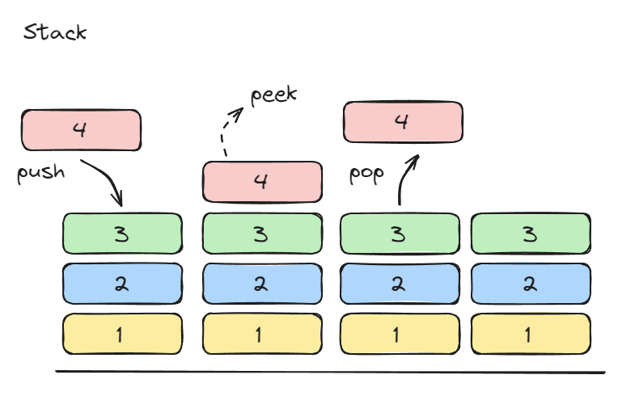

# 스택(Stack)

스택은 접시가 아래에서 부터 쌓이는 것 처럼 요소가 추가되고 제거되는 순서는 **후입선출(Last In First Out)** 방식에 따라 이루어진다. 배열이나 연결 리스트를 사용하여 쉽게 구현할 수 있다




## 스택의 기본 동작

| **Operation** | **Signature**          | **Description**                              | Performance |
| ------------- | ---------------------- | -------------------------------------------- | ----------- |
| **Create**    | → S                    | 새로운 스택을 생성합니다.                    | O(1)        |
| **Is Empty**  | S → boolean            | 스택이 비어있는지 확인합니다.                | O(1)        |
| **Size**      | S → number             | 스택에 얼마나 많은 요소가 있는지 확인합니다. | O(1)        |
| **Push**      | S × value → S          | 스택의 맨 위에 요소를 추가합니다.            | O(1)        |
| **Pop**       | S → value \| undefined | 스택의 맨 위에서 값을 제거하고 반환합니다.   | O(1)        |
| **Peek**      | S → value \| undefined | 스택의 맨 위에 있는 값을 확인합니다.         | O(1)        |


## 스택의 추가 동작

| **Operation** | **Signature**       | **Description**                         | Performance |
| ------------- | ------------------- | --------------------------------------- | ----------- |
| **Clear**     | S → S               | 스택의 모든 요소를 제거합니다.          | O(1)        |
| **Contains**  | S × value → boolean | 특정 값이 스택에 존재하는지 확인합니다. | O(n)        |
| **Copy**      | S → S               | 스택의 복사본을 생성합니다.             | O(n)        |
| Reverse       | S → S               | 스택의 순서를 뒤집습니다.               | O(n)        |


## 스택의 구현 방법


### 배열(Array) 기반 구현

```javascript
class Stack {
  constructor() {
    this.items = []; // 스택 요소를 저장할 배열
  }

  // 기본 동작

  // 스택 생성은 생성자를 통해 이루어짐
  isEmpty() {
    return this.items.length === 0; // 스택이 비어 있는지 확인
  }

  size() {
    return this.items.length; // 스택의 크기 반환
  }

  push(value) {
    this.items.push(value); // 스택의 맨 위에 요소 추가
  }

  pop() {
    return this.items.pop(); // 스택의 맨 위에서 요소 제거 및 반환
  }

  peek() {
    return this.isEmpty() ? undefined : this.items[this.items.length - 1]; // 스택의 맨 위 요소 반환
  }

  // 추가 동작

  clear() {
    this.items = []; // 스택의 모든 요소 제거
  }

  contains(value) {
    return this.items.includes(value); // 특정 값이 스택에 존재하는지 확인
  }

  copy() {
    const newStack = new Stack();
    newStack.items = [...this.items]; // 스택의 복사본 생성
    return newStack;
  }

  reverse() {
    const reversedStack = new Stack();
    reversedStack.items = [...this.items].reverse(); // 스택 순서 뒤집기
    return reversedStack;
  }
}

// 예제 사용
const stack = new Stack();
stack.push(10);
stack.push(20);
stack.push(30);

console.log("Top element:", stack.peek()); // Top element: 30
console.log("Stack size:", stack.size()); // Stack size: 3
console.log("Is empty?", stack.isEmpty()); // Is empty? false

stack.pop();
console.log("After pop, top element:", stack.peek()); // After pop, top element: 20

const copiedStack = stack.copy();
console.log("Copied stack:", copiedStack.items); // Copied stack: [10, 20]

const reversedStack = stack.reverse();
console.log("Reversed stack:", reversedStack.items); // Reversed stack: [20, 10]

stack.clear();
console.log("After clear, is empty?", stack.isEmpty()); // After clear, is empty? true
```


### 연결 리스트(Linked List) 기반 구현

```javascript
class Node {
  constructor(value) {
    this.value = value; // 노드의 값
    this.next = null; // 다음 노드 참조
  }
}

class Stack {
  constructor() {
    this.topNode = null; // 스택의 맨 위 노드
    this.stackSize = 0;  // 스택의 크기
  }

  // 기본 동작

  isEmpty() {
    return this.topNode === null; // 스택이 비어있는지 확인
  }

  size() {
    return this.stackSize; // 스택의 크기 반환
  }

  push(value) {
    const newNode = new Node(value); // 새로운 노드 생성
    newNode.next = this.topNode; // 현재 topNode를 새 노드의 다음 노드로 설정
    this.topNode = newNode; // 새 노드를 topNode로 설정
    this.stackSize++; // 스택 크기 증가
  }

  pop() {
    if (this.isEmpty()) {
      return undefined; // 스택이 비어 있으면 undefined 반환
    }
    const poppedValue = this.topNode.value; // 제거할 노드의 값
    this.topNode = this.topNode.next; // topNode를 다음 노드로 이동
    this.stackSize--; // 스택 크기 감소
    return poppedValue;
  }

  peek() {
    return this.isEmpty() ? undefined : this.topNode.value; // 스택 맨 위의 값을 반환
  }

  // 추가 동작

  clear() {
    this.topNode = null; // topNode를 null로 설정
    this.stackSize = 0; // 스택 크기 초기화
  }

  contains(value) {
    let currentNode = this.topNode;
    while (currentNode) {
      if (currentNode.value === value) {
        return true; // 값이 발견되면 true 반환
      }
      currentNode = currentNode.next;
    }
    return false; // 값이 없으면 false 반환
  }

  copy() {
    const newStack = new Stack();
    const nodes = [];
    let currentNode = this.topNode;

    // 노드를 순회하며 값을 저장
    while (currentNode) {
      nodes.push(currentNode.value);
      currentNode = currentNode.next;
    }

    // 순서를 뒤집어 새 스택에 삽입
    for (let i = nodes.length - 1; i >= 0; i--) {
      newStack.push(nodes[i]);
    }

    return newStack;
  }

  reverse() {
    const reversedStack = new Stack();
    let currentNode = this.topNode;

    // 현재 노드를 순회하며 reversedStack에 push
    while (currentNode) {
      reversedStack.push(currentNode.value);
      currentNode = currentNode.next;
    }

    return reversedStack;
  }
}

// 예제 사용
const stack = new Stack();
stack.push(10);
stack.push(20);
stack.push(30);

console.log("Top element:", stack.peek()); // Top element: 30
console.log("Stack size:", stack.size()); // Stack size: 3
console.log("Is empty?", stack.isEmpty()); // Is empty? false

stack.pop();
console.log("After pop, top element:", stack.peek()); // After pop, top element: 20

console.log("Contains 10?", stack.contains(10)); // Contains 10? true
console.log("Contains 50?", stack.contains(50)); // Contains 50? false

const copiedStack = stack.copy();
console.log("Copied stack, top element:", copiedStack.peek()); // Copied stack, top element: 20

const reversedStack = stack.reverse();
console.log("Reversed stack, top element:", reversedStack.peek()); // Reversed stack, top element: 10

stack.clear();
console.log("After clear, is empty?", stack.isEmpty()); // After clear, is empty? true
```
