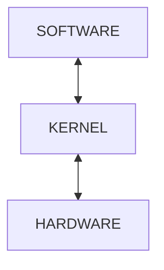

# 커널(Kernel)

## 커널이란?

커널(Kernel)은 컴퓨터 운영 체제(OS)의 핵심적인 부분으로, 하드웨어와 소프트웨어를 연결하는 중추적인 역할을 합니다. 커널은 사용자의 애플리케이션이 컴퓨터의 하드웨어 자원을 안전하고 효율적으로 사용할 수 있도록 관리합니다.

## 커널의 주요 기능

### 프로세스 관리

- 프로세스 생성 및 종료
- 컨텍스트 스위칭(Context Switching)
- 멀티태스킹(Multitasking)과 프로세스 스케줄링

### 메모리 관리

- 가상 메모리(Virtual Memory)
- 페이지 교환(Swapping)
- 캐시 관리

### 입출력(I/O) 관리

- 장치 드라이버를 통해 입출력 장치 제어
- 버퍼링(Buffering) 및 스풀링(Spooling)

### 파일 시스템 관리

- 파일 및 디렉토리의 읽기, 쓰기, 수정
- 파일 권한 및 보안 관리

### 네트워크 관리

- 네트워크 프로토콜 스택(TCP/IP 등) 지원
- 데이터 패킷 송수신 처리

## 커널의 유형

### 모놀리식 커널(Monolithic Kernel)

- 모든 커널 서비스(파일 시스템, 메모리 관리, 디바이스 드라이버 등)가 하나의 큰 코드베이스로 통합됨.
- 장점: 빠른 성능과 효율성.
- 단점: 코드가 크고 복잡하여 유지보수가 어려울 수 있고, 버그가 생기면 시스템 전체에 영향을 줄 수 있음.
- 예: Linux 커널, Unix 커널.

### 마이크로커널(Microkernel)

- 커널의 핵심 기능만 포함(프로세스 간 통신, 메모리 관리 등).
- 나머지 기능(파일 시스템, 디바이스 드라이버 등)은 서버라고 하는 사용자 공간에서 실행.
- 장점: 안정성과 모듈성.
- 단점: 시스템 호출과 컨텍스트 스위치가 많으면 오버헤드로 인해 성능이 상대적으로 느릴 수 있음.
- 예: Minix, QNX.

### 하이브리드 커널(Hybrid Kernel)

- 모놀리식 커널과 마이크로커널의 장점을 결합.
- 핵심 기능은 커널 공간에, 추가 기능은 사용자 공간에서 실행.
- 장점: 모듈 내부에서 작동할 수 있는 드라이버를 빠르게 개발할 수 있다.
- 단점: 통과해야 할 인터페이스가 많아질수록 버그가 늘어날 가능성이 있습니다
- 예: Windows 커널, macOS 커널(XNU).

### 나노커널(Nanokernel)

- 나노커널은 인터럽트 컨트롤러 나 타이머 와 같은 가장 기본적인 서비스를 포함한 거의 모든 서비스를 장치 드라이버  에 위임 하여 커널 메모리 요구 사항을 기존 마이크로커널보다 훨씬 더 작게 만듭니다

### 엑소커널(Exokernel)

- 하드웨어 자원에 대한 최소한의 추상화만 제공.
- 애플리케이션이 직접 하드웨어를 제어할 수 있도록 설계.
- 실험적이고 주로 연구 목적으로 사용.

### 멀티커널(multikernel)

- 멀티커널 운영 체제는 멀티코어 머신을 분산 시스템 인 것처럼 독립 코어의 네트워크로 처리합니다 . 공유 메모리를 가정하지 않고 메시지 전달 로 프로세스 간 통신을 구현합니다 .
- 예: Barrelfish
