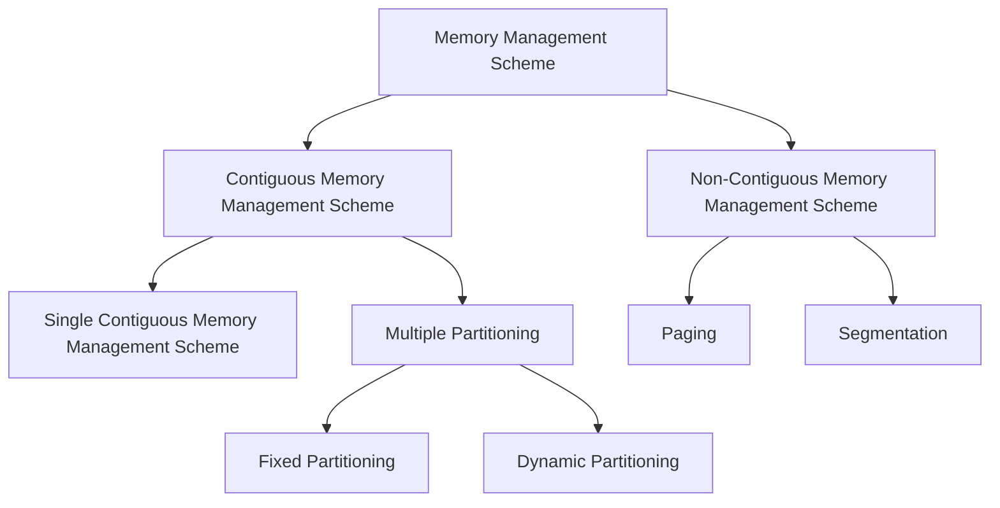

# 운영체제에서 메모리 관리

## 메모리 관리

운영체제는 프로세스가 효율적으로 메모리를 사용할 수 있도록 지원합니다. 가상 메모리를 통해 물리적 메모리보다 더 큰 주소 공간을 활용하고, 메모리 단편화를 줄이기 위해 페이지와 세그멘테이션 기법을 사용합니다. 또한 스왑핑과 페이지 교체 알고리즘을 통해 부족한 메모리를 보조 저장 장치로 확장하여 시스템 안정성을 높입니다.

- **프로세스 간 메모리 분리**: 각 프로세스가 독립적으로 메모리를 사용하도록 합니다.
- **가상 메모리 관리**: 물리적인 메모리보다 큰 메모리 공간을 제공합니다.
- **메모리 보호**: 프로세스가 다른 프로세스의 메모리에 접근하지 못하도록 합니다.
- **메모리 할당**: 프로세스에 메모리를 할당하고 해제합니다.
- **메모리 단편화 최소화**: 메모리 단편화를 최소화하여 메모리를 효율적으로 사용합니다.

메모리 관리 기법의 분류

## 스와핑(Swapping)

스와핑은 메모리에 적재된 프로세스 중 일부를 보조 저장 장치로 이동시키는 기법입니다. 메모리에 적재된 프로세스 중 실행되지 않는 프로세스를 보조 저장 장치로 이동시켜 메모리 공간을 확보합니다. 스와핑은 프로세스의 실행을 지연시키지만, 메모리 부족 문제를 해결할 수 있습니다.

- 스왑 인(Swap In): 보조 저장 장치에서 메모리로 프로세스를 이동
- 스왑 아웃(Swap Out): 메모리에서 보조 저장 장치로 프로세스를 이동

## 가상 메모리(Virtual Memory)

- 램의 용량을 늘리는 기술로, 램을 넘어서는 데이터를 하드 디스크에 저장하여 필요할 때 램으로 옮겨 사용합니다.
- 램의 용량을 늘리는 효과를 내지만, 하드 디스크에 저장된 데이터를 램으로 옮기는 과정에서 속도 저하가 발생할 수 있습니다.
- 램과 하드 디스크 사이의 데이터 교환을 위해 **페이지 교체 알고리즘**을 사용합니다.
- HDD와 SSD를 모두 사용할 수 있지만, 더 빠른 SSD를 사용하면 성능을 향상시킬 수 있습니다. 단, SSD를 자주 사용하면 수명이 단축될 수 있습니다.

## 단편화(Fragmentation)

### 내부 단편화(Internal Fragmentation)

내부 단편화는 메모리 공간이 할당된 프로세스의 크기보다 큰 경우 발생하는 현상입니다. 예를 들어 10KB 크기의 메모리 공간에 8KB 크기의 프로세스를 할당하면 2KB의 공간이 낭비되는 경우가 내부 단편화입니다.

해결 방법으로는 메모리 공간을 프로세스 크기에 맞게 나누어 사용하거나, 프로세스 크기를 메모리 공간에 맞게 조정하는 방법이 있습니다.

### 외부 단편화(External Fragmentation)

외부 단편화는 메모리 공간이 분산되어 사용되어 메모리 공간을 할당하지 못하는 현상입니다. 메모리 공간이 충분하지만 연속적으로 할당되지 않아 발생합니다. 예를 들어 메모리 공간이 10KB, 20KB, 30KB로 나누어져 있을 때 15KB 크기의 프로세스를 할당할 수 없는 경우가 외부 단편화입니다.

해결 방법으로는 메모리 공간을 연속적으로 할당하거나, 외부 단편화를 해결하는 메모리 관리 기법(페이징, 세그멘테이션)을 사용하는 방법이 있습니다.

## 연속할당 방식

연속할당 방식에서 각 프로그램은 하나의 연속된 메모리 블록에 할당됩니다. 연속할당 방식은 단순하고 효율적이지만, 메모리 단편화로 인해 메모리 사용을 최적화할 수 없습니다.

### 단일 연속 할당 방식(Single Contiguous Memory Management Scheme)

단일 연속 할당 방식은 초기의 컴퓨터 시스템에서 사용된 오래된 방식으로, 가장 간단한 메모리 할당 방식입니다. 주 메모리는 두 개의 파티션으로 나뉘며, 하나는 운영체제가 실행되는 커널 영역이고, 다른 하나는 사용자 프로세스가 실행되는 사용자 영역입니다.

단일 연속 할당 방식의 장점

- 구현이 간단하다
- 관리가 쉽다
- 빠르게 메모리에 접근할 수 있다
- 하나의 프로세스만 실행되는 경우에 적합하다
- 초기에는 메모리 단편화가 적다

단일 연속 할당 방식의 단점

- 시간이 지남에 따라 외부 단편화가 발생한다
- 프로그램이 메모리보다 큰 경우 실행할 수 없다
- 프로세스 크기를 변경하기 어렵다
- 멀티 프로그래밍 환경에서 사용하기 어렵다

### 고정 분할 방식(Fixed Partitioning)

고정 분할 방식은 **다중 분할 방식**의 하나로 메모리를 여러 개의 고정된 파티션으로 나누어 사용하는 방식입니다. 각 파티션은 하나의 프로세스를 실행할 수 있으며, 프로세스는 할당된 파티션을 벗어나지 않습니다. 파티션의 크기는 같거나 다를 수 있습니다. 시스템이 생성되고 나서는 파티션의 크기가 고정됩니다.

고정 분할 방식의 장점

- 구현이 간단하다
- 관리가 쉽다

고정 분할 방식의 단점

- 내부 단편화가 발생합니다.
- 프로세스의 크기가 파티션보다 큰 경우 할당할 수 없습니다.

#### 동적 분할 방식(Dynamic Partitioning)

동적 분할 방식은 고정 분할 방식의 문제점을 극복하기 위해 설계된 방식으로, 매 시점 프로세스의 로딩 시 그 크기에 맞게 동적으로 메모리를 나눠 사용하는 방식입니다. 프로세스의 크기에 따라 메모리 공간을 동적으로 할당하여 내부 단편화를 최소화합니다.

- 장점
  - 프로세스 크기에 따라 메모리를 동적으로 할당하여 내부 단편화를 최소화합니다.
  - 프로세스 크기에 제한이 없습니다.
  - 사용되지 않는 메모리 공간을 줄여 더 많은 프로세스를 실행할 수 있습니다.
- 단점
  - 연속적으로 할당되지 않아 외부 단편화가 발생합니다.
  - 메모리 할당과 해제 시 오버헤드가 발생합니다.

1. 최초 적합(First-fit): 처음 보이는 공간에 먼저 할당
2. 최적 적합(Best-fit): 가장 크기에 맞는 공간에 먼저 할당
3. 최악 적합(Worst-fit): 가장 크기가 큰 공간에 먼저 할당

#### 압축을 통한 외부 단편화 해결

- 메모리 공간을 압축하여 사용하지 않는 공간을 한 곳으로 모아내어 연속적이게 만듦으로써 외부 단편화를 해결하는 방식입니다.
- 프로세스의 주소를 변경해야 하므로 상당한 시간이 소요되고 그 동안 CPU는 유후 상태로 유지됩니다.

### 불연속 할당 방식

여러 작업을 효율적으로 수행하기 위해 사용

메모리 공간이 분산되어 프로세스가 불연속 공간에 할당 시 페이지 교체 같은 작업의 복잡성 증가

1. **Linked List**: 불연속 공간에 프로세스를 할당할 때, **할당된 공간의 주소를 연결리스트에 저장**하는 방식입니다. 이 방식은 메모리 할당과 해제가 빠르지만, 공간 낭비가 발생할 수 있음
2. **Bitmap**: **메모리 공간의 각 블록을 0 또는 1로 표시**하여 사용 가능한 블록과 사용 중인 블록을 구분하는 방식입니다. 이 방식은 연결 리스트보다 효율적인 공간 관리를 제공하지만, 메모리 크기가 큰 경우 비트맵이 매우 커지는 단점이 있습니다.
3. **Page Table**: 가상 메모리 시스템에서 사용되는 방식으로, 물리적인 주소 공간을 페이지라는 작은 블록으로 나누어 사용합니다. 각 프로세스는 자신의 페이지 테이블을 가지며, 페이지 테이블은 물리적인 주소와 가상 주소를 매핑하는 역할을 합니다. 이 방식은 연결 리스트와 비트맵보다 효율적이며, 가상 메모리를 구현하는 데 필요한 기술\

#### 페이징(Paging)

- **동일한 크기의 페이지 단위** 나누고 프로세스를 페이지 단위로 나누어 메모리에 적재
- 빈데이터(홀)의 크기가 균일하지 않은 문제가 없어지지만 주소 변환이 복잡

페이징 방식의 장점

- 외부 단편화를 해결할 수 있습니다.
- 프로세스 크기를 변경하기 쉽습니다.

페이징 방식의 단점

- 내부 단편화가 발생할 수 있습니다.
- 페이지 테이블을 관리하는 오버헤드가 발생합니다.

#### 세그먼테이션(Segmentation)

- 프로세스를 논리적 단위인 세그먼트로 나누고 메모리에 적재
- 빈데이터(홀) 크기가 균일하지 않는 문제 발생

세그먼테이션 방식의 장점

- 프로세스를 논리적 단위로 나누어 관리할 수 있습니다.
- 동적 메모리 할당에 용이합니다.

세그먼테이션 방식의 단점

- 외부 단편화가 발생할 수 있습니다.
- 세그먼트 관리에 대한 오버헤드가 발생합니다.

#### 페이지드 세그먼테이션(Paged Segmentation)

- 세그먼트 내에서 페이징 방식을 사용하여 세그먼트를 페이지로 나누고 각 페이지를 메모리에 적재

페이지드 세그먼테이션 방식의 장점

- 세그먼트 내의 외부 단편화를 해결할 수 있습니다.

페이지드 세그먼테이션 방식의 단점

- 두 가지 모두를 관리해야 하므로 오버헤드가 발생합니다.

### 페이지 교체 알고리즘

페이지 부재로 인해새로운 페이지를 적재할 때 메모리에 저장된 페이지 중 어떤 페이지를 교체할지 결정하는 알고리즘

#### 시간 기반 알고리즘

1. FIFO(First In First Out): 가장 먼저 들어온 페이지를 교체\
   오래된 데이터가 최근에 사용된 데이터와 비슷하면 성능 저하
2. LRU(Least Recently Used): 참조가 가장 오래된 페이지를 교체\
   페이지를 사용할 때마다 사용 시간을 갱신\
   추가적으로계수기, 스택이 필요
3. NUR(Not Used Recently): 참조 비트와 변경 비트를 사용하여 가장 낮은 우선순위의 페이지를 교체

#### 빈도 기반 알고리즘

1. LFU(Least Frequently Used): 가장 참조 횟수가 적은 페이지를 교체\
   일부 데이터가 빈번하게 사용되면 성능 저하
