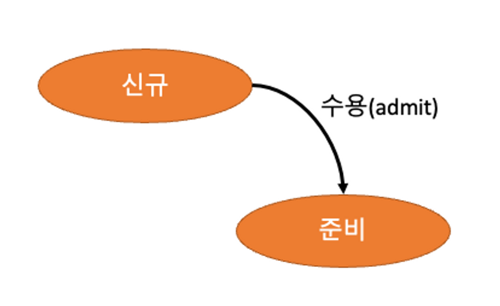

# 프로세스

## 프로세스란

프로세스는 기본적으로 실행 중인 프로그램을 의미한다. 프로세스의 실행은 순차적으로 진행된다

### **프로세스 vs 프로그램**

- 프로세스는 운영체제가 프로그램에 CPU, 메모리, 파일, 입출력 장치와 같은 자원을 할당하여 실제로 실행되도록 만든 것입니다.

- 프로그램은 정적인 코드와 데이터로 구성되지만, 프로세스는 프로그램이 메모리에서 실행되는 **동적**인 개체입니다.

| **구분**        | **프로그램**                  | **프로세스**                         |
| --------------- | ----------------------------- | ------------------------------------ |
| **정적/동적**   | 정적(코드와 데이터의 집합)    | 동적(실행 중인 작업)                 |
| **메모리 위치** | 디스크에 저장                 | 메모리에서 실행                      |
| **상태 변화**   | 상태 변화 없음                | Ready, Running, Waiting 등 상태 변화 |
| **자원 사용**   | CPU, 메모리 등 자원 필요 없음 | CPU, 메모리, 입출력 장치 필요        |

## 프로세스 생명주기

**주요 상태**

1. **New**: 프로세스 생성 중.
2. **Ready**: 실행 대기 상태(스케줄링을 기다림).
3. **Running**: CPU에서 실행 중.
4. **Waiting**: 입출력 등 외부 이벤트를 기다리는 상태.
5. **Terminated**: 실행 종료.

**생명주기가 변경되는 시점**

1. 수행 -> 대기 (Running->Waiting) : I/O요청이 발생하거나, 자식 프로세스가 종료 대기를 할 때
2. 수행 -> 종료 (Running -> Terminate) : 프로세스를 종료시켰을때
3. 수행 -> 준비 (Running-> Ready) : 인터럽트가 발생했을때
4. 대기 -> 준비 (Waiting -> Ready) : I/O가 완료되었을때

 (1).png)

**선점 스케줄링 발생 시점**

 (1).png)

**비전섬 스케줄링 발생 시점**

 (1).png)

### 신규 상태(New)

* 프로세스를 메인 메모리에 가져온 상태
* 신규 상태 —> **수용(admit)** —> 준비상태

### 준비 상태(Ready)

준비 작업을 마치고 실행할 수 있는 상태

준비 상태 —> **스케쥴러 발송(scheduler dispatch)** —> 수행 상태

* 준비 상태가 되는 경우
  * **신규** 프로세스에서 수용됨
  * **대기** 프로세스에서 입출력/이벤트가 완료됨
  * **수행** 프로세스가 중단됨

### 수행 상태(Running)

CPU가 실제로 프로세스를 수행하고 있는 상태

* 선점 스케쥴링에 의한 중단 → **준비** 상태로
* 입출력/이벤트가 필요 시 → **대기** 상태로
* 수행 완료 시 → **종료** 상태

### 대기 상태(**Waiting)**

프로세스 도중에 I/O 작업이 필요하여 I/O 작업을 수행하는 상태

CPU는 I/O를 기다리고, 다른 프로세스 작업을 수행할 수 있다

* 대기 상태 종료 시 → 준비 상태로

### 종료 상태(Terminated)

프로세스가 종료된 상태

사용하던 메모리 영역이 해제

수행 상태 —> **탈출(exit)** —> 종료 상태

## 프로세스 제어 블록(PCB, Process Control Block)

프로세스를 관리하기 위해 운영체제가 저장하는 데이터 구조.

프로세스의 상태와 관련된 정보를 포함한다.

프로세스의 수명 동안만 유지되며 프로세스가 종료되면 삭제된다.

- **프로세스 상태**: 실행 중, 대기 중, 준비 상태 등 프로세스의 현재 상태.
- **프로세스 권한**: 시스템 리소스에 대한 액세스를 위한 허용 권한.
- **프로세스 ID (PID)**: 각 프로세스를 고유하게 식별하기 위한 ID 값.
- **포인터**: 부모 프로세스를 가리키기 위한 포인터.
- **프로그램 카운터**: 다음에 실행될 명령어의 주소를 가리키는 포인터.
- **CPU 레지스터 값**: 프로세스가 실행 상태를 위해 저장되어야 하는 다양한 CPU 레지스터의 값.
- **프로세스 우선순위**: 프로세스 스케줄링 시 고려되는 우선순위.
- **메모리 관리 정보**: 코드, 데이터, 스택의 메모리 위치.
- **입출력 정보**: 열려 있는 파일, 입출력 장치 상태.

## 프로세스 메모리

.png)

### Code 영역

* **실행할 프로그램의 코드**가 저장

### Data 영역

* **전역변수와 정적변수**가 저장
* 프로그램이 시작될 때 할당되어 프로그램 종료 시 소멸

### Stack 영역

* 호출된 함수의 수행을 마치고 **복귀할 주소** 및 **데이터**(지역변수, 매개변수, 리턴값 등)를 임시로 저장
* 함수 호출시 기록하고 함수의 수행이 완료되면 사라진다
* 컴파일 시 stack 영역의 크기가 결정되기 때문에 무한정 할당 할 수 없다

### Heap 영역

* **동적 데이터 영역**
* 메모리 주소 값에 의해서만 참조되고 사용되는 영역
* 런타임 시에 결정

## 프로세스와 스레드

### 프로세스

* 자신만의 고유 공간 자원을 할당 받음
* 메모리에서의 실행중인 프로그램 단위
* 다른 프로세스의 변수나 자료에 접근할 수 없다
* 운영체제로부터 시스템 자원을 할당받는 자원의 단위
* 최소 1개 이상의 스레드를 가짐

### 스레드

* 다른 프로세스와 공간, 자원을 공유하면서 사용됨
* 프로세스에 작업을 처리하는 주체
* 스레드는 Stack 을 제외한 Code/Data/Heap 부분은 공유해 서로 읽고 쓸 수 있음
* **스레드의 장점**
  * 프로세스 보다 크기가 작은 실행 단위 구현
  * 프로세스의 생성 및 소멸에 따른 오버헤드 감소
  * 스레드간 자원을 공유 함으로써 빠른 컨텍스트 스위칭
  * 프로세스 들의 통신 시간, 방법 어려움 해소

### 멀티 스레드

- **멀티 프로세스**: 하나의 운영체제 안에서 여러 프로세스가 실행되는 것
- **멀티 스레드**: 하나의 프로세스가 여러 작업을 여러 스레드를 사용해 동시에 처리하는 것

### 멀티 프로세스

* 하나의 프로그램을 여러 프로세스로 구성
* 여러 프로세스 중 하나에 문제가 발생하도 다른 프로세스에 영향을 주지 않음
* 문맥 전환 과정에서 오버헤드 발생
* 프로세스 간 통신을 위해 IPC 필요
* 프로세스 간 공유하는 메모리가 없음

### 멀티 스레드

* 하나의 프로그램을 여러 개의 스레드로 구성
* 시스템 자원 소모 감소
* 시스템 처리량 감소

🟢 **멀티 스레드의 장점**

1. Context-Switching 할 때 공유하고 있는 메모리만큼 **메모리 자원을 아낄 수 있다.**
2. 스레드는 프로세스 내의 Stack 영역을 제외한 모든 메모리를 공유하기 때문에 **통신 부담이 적어서 응답 시간이 빠르다.**

**🔴 멀티 스레드의 단점**

1. 스레드 하나가 프로세스 내 자원을 망쳐버린다면 **모든 프로세스가 종료될 수 있다.**
2. 자원을 공유하기 때문에 필연적으로 **동기화 문제**⚠️가 발생할 수 밖에 없다. 교착상태가 발생하지 않도록 주의해야 한다.
3. 디버깅이 까다롭다

### 스레드 풀

컴퓨터 프로그램에서 실행의 동시성을 달성하기 위한 소프트웨어 디자인 패턴

* 프로그램이 작업을 동시에 실행할 수 있도록 여러 스레드를 미리 생성해두고 유지 관리
* 작업 처리에 사용되는 스레드를 제한된 개수만큼 정해 놓고 작업 큐(Queue)에 들어오는 작업들을 하나씩 스레드가 맡아 처리하는 것

#### 스레드 풀 사용 이유

1. **프로그램 성능 저하를 방지하기 위해**
   1. 스레드를 생성/수거하는 데 따른 부담은 프로그램 전체적인 퍼포먼스를 저하하기 때문
2. **다수의 사용자 요청을 처리하기 위해**
   1. 다수의 사용자의 요청을 수용하고, 빠르게 처리하고 대응

#### 스레드 풀 장점

* 스레드를 생성/수거하는데 비용이 들지 않는다
* 스레드가 생성될 때 OS가 메모리 공간을 확보해주고 메모리를 스레드에게 할당
* 스레드 풀을 미리 만들어 두기 때문에 처음에 생성하는 비용은 들지만 이전의 스레드를 재사용할 수 있으므로 시스템 자원을 줄일 수 있음.
* 작업을 요청 시 이미 스레드가 대기 중인 상태이기 때문에 작업을 실행하는 데 딜레이가 발생하지 않습니다.

#### 스레드 풀 단점

* 스레드 풀에 스레드를 너무 많이 생성해 두었다가 사용하지 않으면 메모리 낭비가 발생합니다.
* 스레드 풀의 단점 개선 : **Fork Join Thread Pool**

### 동시성과 병렬성

#### 동시성

싱글 코어에서 멀티 스레드를 동작시키기 위한 방식으로 멀티 태스킹을 위해 여러 개의 스레드가 번갈아가면서 실행되는 성질

#### 병렬성

멀티 코어에서 멀티 스레드를 동작시키는 방식으로, 한 개 이상의 스레드를 포함하는 각 코어들이 동시에 실행되는 성질