# ALB를 사용하여 HTTPS 연결

## 다이어 그램

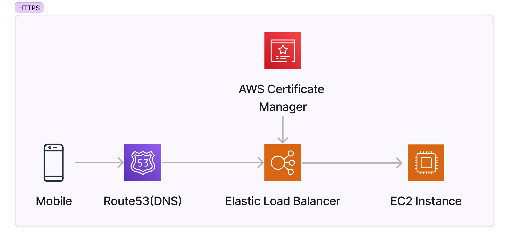

## 1. 도메인 구매

원하는 곳에서 도메인을 구매하세요. 고대디, route53, cloudflare, 가비아 등

## 2.Route53에서 호스 영역 등록

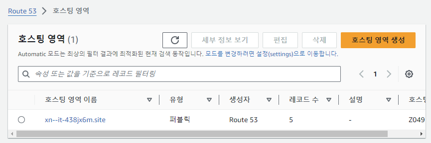

## 3. 네임 서버 확인 후 도메인 구매처에 등록

❗마지막에 .(dot)은 제외하고 등록 org. -> org

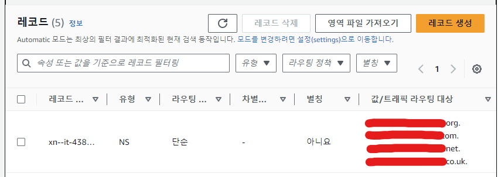

## 4. ACM에서 인증서 발급

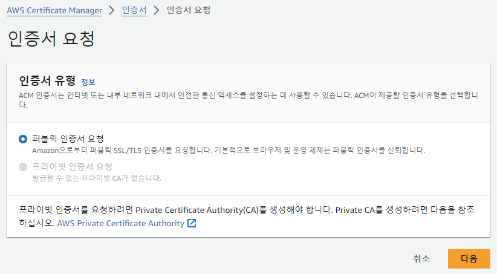

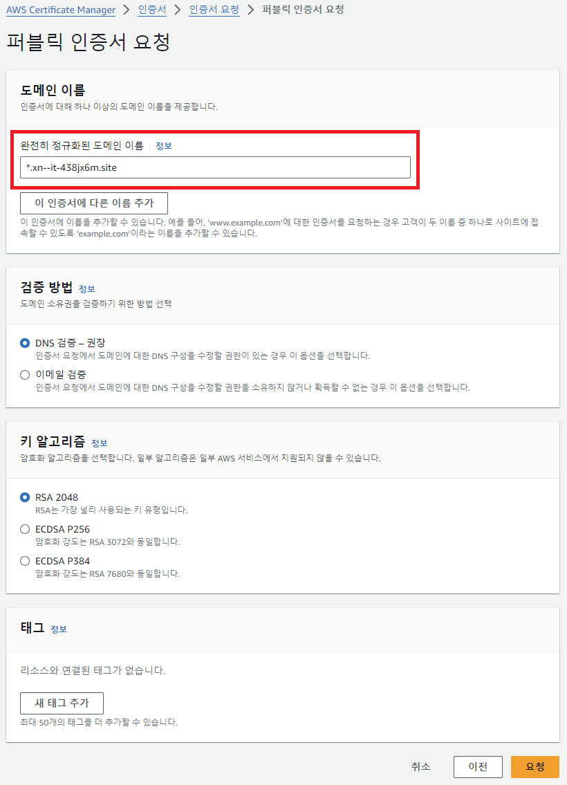

## 5. Route53 도메인과 연결

인증서 상세 페이지에서 Route53과 연결

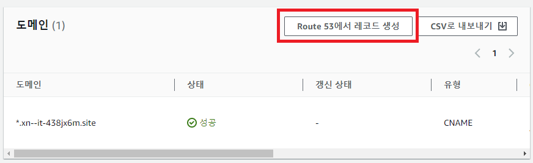

→ Route53의 도메인에 CNAME 레코드가 생성됨

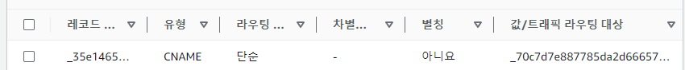

## 6. 보안 설정

EC2 → 보안 그룹 → 인바운드 규칙으로 이

80 포트 (HTTP) 활성화

443 포트(HTTPS) 활성

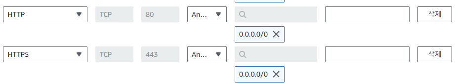

## 7. 로드 밸런싱에서 대상 그룹(target group) 생성

대상 유형 선택 → 인스턴스

포트 → HTTP 80

상태 검사 → 상태를 확인하는 api 주소

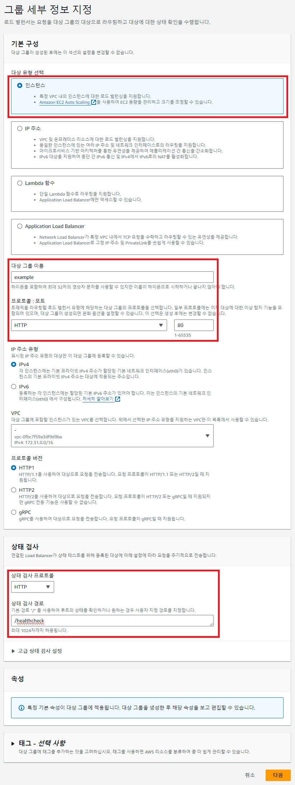

사용하는 인스턴스를 80포트로 선택하고 생성

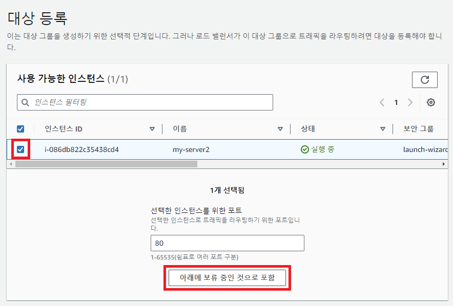

## 8. 로드 밸런싱 생성

- 로드 밸런서 유형 → **ALB(Application Load Balancer)**
- 네트워크 매핑은 최소 2개 이상의 가용 영역을 선택 → 인스턴스가 위치한 가용 영역 1개 + 나머지 1 개

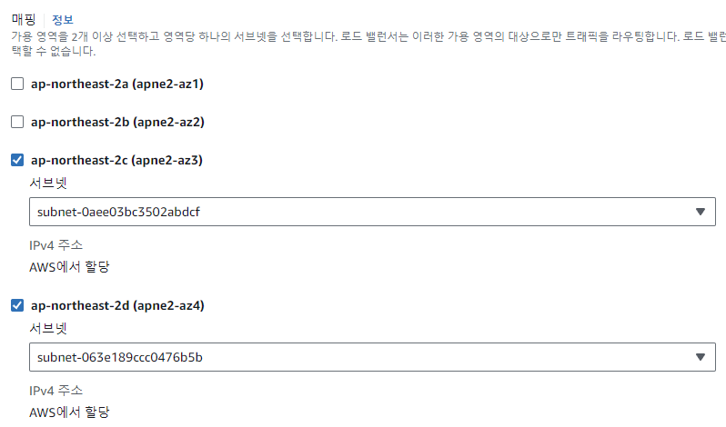

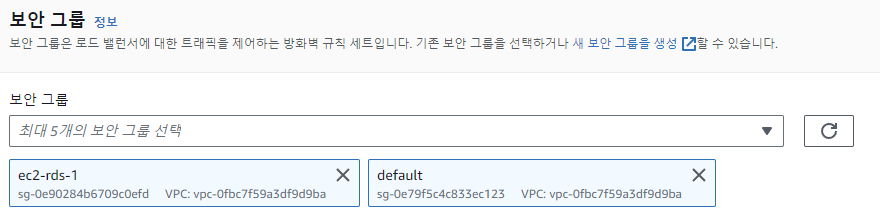

## 9. 리스너 설정

HTTPS:443 → 대상 그룹으로 전달

HTTP:80 → HTTPS로 리디렉션

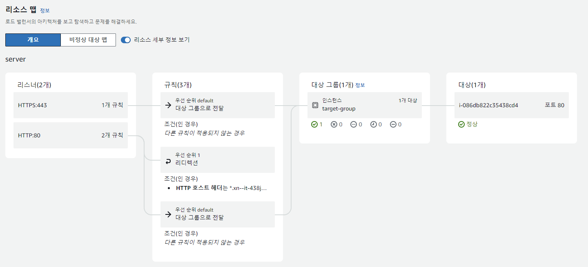

## 10. A 레코드 생성(또는 변경)

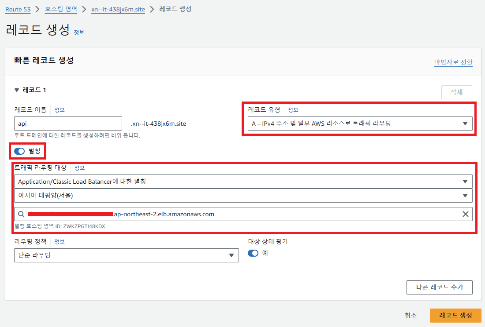