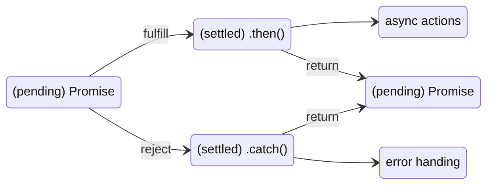

# 비동기

## 동기와 비동기

**동기**

* 순서대로 작업을 처리하여 작업이 끝나지 않으면 기다리는 방식
* 비동기: 작업을 시작하고 끝날 때까지 다른 작업을 수행할 수 있는 방식
* 콜백지옥과 효율적인 작업 시간 소모를 위해 비동기의 필요성

### 비동기

* 순서를 보장하지 않는다. 작업이 언제 끝날지 알 수 없기 때문이다.
* 따라서 비동기 작업의 동기적 표현이 필요하다


## Promise

* Promise에는 함수를 전달한다. 이때 함수를 `executor(실행자)`라고 한다.
* 실행자 내부에서는 작업이 종료되면 `resolve`와 `reject` 중 하나를 반드시 호출 해야 한다.
* `resolve(value)` - 작업이 성공적으로 끝났을 때 값과 함께 호출
* `reject(error)` - 작업이 실패했을 때 에러와 함께 호출
* Promise의 3가지 상태
  1. 대기(pending): 초기 상태
  2. 이행(fulfilled): 성공
  3. 거부(rejected): 실패

## Promise의 3가지 상태

* Promise.then() 작업이 완료되었을 때와 실패 했을 때 실행할 두 개의 콜백 함수를 받고 Promise를 반환

  ```javascript
  promise.then((value)=>{}, (reason)=>{});
  ```

* Promise.catch() 작업이 실패 했을 때 실행할 콜백 함수를 받아 실행하고 새로운 Promise를 반환

  ```javascript
  promise.catch((error)=>{})
  ```

* Promise.finally() 작업이 성공했든 실패했든 최종적으로 실행되는 코드

  ```javascript
  promise.finally(()=>{});
  ```

```javascript
myPromise
.then(response => {
  doSomething(response);
})
.catch(e => {
  returnError(e);
})
.finally(() => {
  runFinalCode();
});
```



```javascript
const myPromise = new Promise((resolve, reject) => {
    if(성공) {
        resolve('성공')
    } else {
        reject("실패")
    }
});
```

```javascript
myPromise
.then((res)=> console.log(res)) // 성공
.catch((error)=> console.log(error)) // 실패

```

