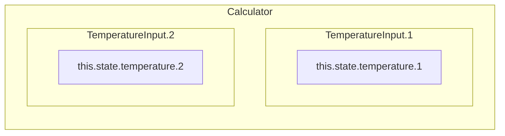
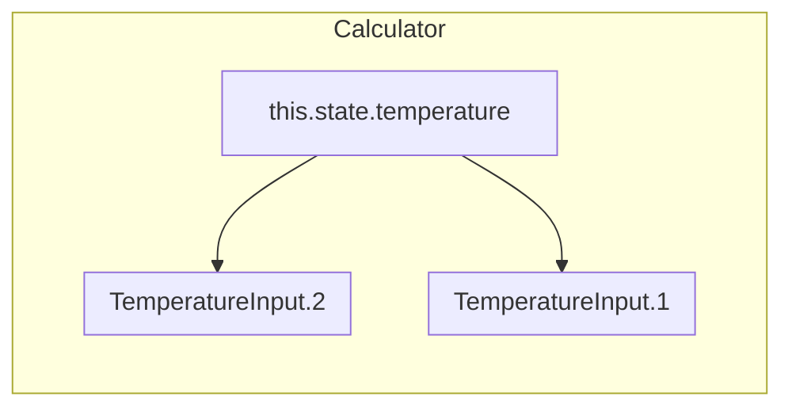

# useState

* 비공개 값으로 컴포넌트에 의해 제어된다.
* `state(current state)`를 통해 접근하고, `setState(set function)`를 통해 변경할 수 있다.
* 배열 구조 분해를 통해 `state`값과 `state를 변경하는 함수`를 반환 받는다.

```jsx
const [state, setState] = useState(initialValue);
```


## 불변성을 지키기

- 리액트에서 상태 업데이트는 **항상 불변**하게 수행되어야 한다

- 이전 상태와 현재 상태가 동일하면 <u>리렌더링을 건너뛸 수 있다</u>.(성능 최적화)

- 따라서 불변하지 않으면(특히 참조 값을 사용할 때), 상태를 업데이트 했지만 리렌더링이 되지 않은 상황이 발생할 수 있다
- 상태의 가장 바깥 참조를 변경하기만 해도 리렌더링이 트리거된다.

```jsx
const [todos, setTodos] = useState([
    { name: 1, completed: false },
    { name: 2, completed: false },
    { name: 3, completed: false }
  ]);

// ❌ 리렌더링되지 않음
const onClick = () => {
  todos[2].completed = true;
  setTodos(todos);
};

// ✅  얕은 복사를 통해 가장 바깥 참조를 불변하게 업데이트하여 리렌더링
const onClick2 = () => {
  const newTodos = todos.slice();
  newTodos[2].completed = true;
  setTodos(newTodos);
};

// ✅  얕은 복사를 통해 가장 바깥 참조를 불변하게 업데이트하여 리렌더링
const onClick3 = () => {
  setTodos((prev) => {
    const newTodos = prev.slice();
    newTodos[2].completed = true;
    return newTodos;
  });
};
```


## 배치 처리

비동기적 특성을 가졌기 때문에 state는 즉시 반영되지 않는다.

만약 즉시 반영되게 된다면 onClick 함수에서 3번의 리렌더링이 발생해야 하는 낭비가 발생하게 된다.

```jsx
const [counter, setCounter] = useState(0);

const onClick = async () => {
  setCounter(counter + 1);
  setCounter(counter + 1);
  setCounter(counter + 1);
};
// 1
```

```jsx
const [counter, setCounter] = useState(0);

const onClick = async () => {
  setCounter(prevState => prevState + 1); // 큐에 추가
  setCounter(prevState => prevState + 1); // 큐에 추가
  setCounter(prevState => prevState + 1); // 큐에 추가
};
// 상태 업데이트
// 0 -> 1
// 1 -> 2
// 2 -> 3
```


## 직접 수정하지 않기

* State를 변경하면 리액트는 변경 부분을 리렌더링하지만, 직접 변경(`this.state.value = "foo"`)하면 리렌더링하지 않는다.

```jsx
this.state.value = "foo" // 리렌더링X
```

```jsx
this.setState({value: "foo"}) //리렌더링O
```


## 이전 상태 기반 업데이트

* 업데이트되는 상태가 이전 상태를 필요로 하는 계산일 때, 이전 상태를 가져와서 계산한다

```jsx
addCount(count+1) // 
-> addCount(prevState => prevState + 1 )
updateUser(prevUser => {prevUser...,age: 20})
```


## 상태 변수 명명 규칙

- setter함수의 이름 중 첫 글자를 따서 사용하기
- 또는 전체 변수 이름을 가져오기
- 또는 prev 접두사는 붙여 사용

```jsx
setCount(c => c+1)
setUserName(un => un.toLowerCase())
setIsOpen(open => !open)
setIsOpen(prevOpen=> !prevOpen)
```


## 업데이트 - 비동기

* State와 props는 비동기적으로 업데이트될 수 있다 -> State 변경 시 의존하면 안된다.
* 객체 형태 보다는 함수 형태로 상태 업데이트를 전달한다.

```jsx
//Class형
<button onClick={() => this.setState({count: this.state.count + 1})}>
	button
</button>
```

```jsx
//Function형
<button onClick={() => setCount(count + 1)}>
    Click me
</button>
```


## 업데이트 - 병합(클래스형)

* React `this.state`는 State 변경 함수(`setState`)를 통해 받은 값과 기존 State를 병합한다.
* State에서 특정 변수에 대한 업데이트는 다른 변수에 영향을 주지 않는다.
* 따라서 변경되지 않는 state 값은 그대로 남아 있는다.

```jsx
//Class형
this.state = { a: "a", b: "b"}
<button onClick={() => this.setState({ a: "b" })}></button>
// state: { a: "c", b: "b" } b에는 영향이 없다.
```


## 업데이트 - 병합(함수형)

* 함수형 `useState`에서는 병합이 아닌 대체로 이루어진다.
* `state`의 일부를 변경하기 위해서 `...`연산자를 통해 전체와 변경 부분을 같이 전달한다.

```jsx
//Function형
const [state, setState] = usestate({ a: "a", b: "b" });
<button onClick={() => setState({ ...state, a: "C" })}></button>
// state: { a: "c", b: "b" } b에는 영향이 없다.
```


## 하향식(단방향) 데이터 흐름

* State는 어느 컴포넌트의 소유이며, State로부터 나온 UI나 데이터는 오직 **하위 컴포넌트**에 영향
* 컴포넌트는 자신의 State를 자식 컴포넌트의 props로 전달 할 수 있다.


## 상태 끌어올리기

* `State`는 하위 컴포넌트로만 전달이 가능하기 때문에 다른 컴포넌트와 `State`를 공유하기 위해 공통 조상으로 `State`를 끌어 올려 사용한다.



```jsx
class Calculator extends React.Component {
  render() {
    return (
      <div>
        <TemperatureInput scale="c" />
        <TemperatureInput scale="f" />
      </div>
    );
  }
}
```

* `state.temperature` 끌어 올리기
  * state와 setState 함수를 자식 컴포넌트 props로 전달하여
  * 공통 조상에서 State를 관리

```jsx
class Calculator extends React.Component {
...
    this.state = {temperature: '', scale: 'c'};
...
  render() {
...
    return (
      <div>
        <TemperatureInput
          scale="c"
          temperature={celsius}
          onTemperatureChange={this.handleCelsiusChange} />
        <TemperatureInput
          scale="f"
          temperature={fahrenheit}
          onTemperatureChange={this.handleFahrenheitChange} />
        <BoilingVerdict
          celsius={parseFloat(celsius)} />
      </div>
    );
  }
}
```




## 상태를 찾는 3가지 질문

1. 부모로부터 props를 통해 전달됩니까? 그러면 확실히 state가 아닙니다.
2. 시간이 지나도 변하지 않나요? 그러면 확실히 state가 아닙니다.
3. 컴포넌트 안의 다른 state나 props를 가지고 계산 가능한가요? 그렇다면 state가 아닙니다.

* \-> https://ko.reactjs.org/docs/thinking-in-react.html


## 내부 동작에 대한 아이디어

- Hooks에 대한 상태를 React에서 관리
- useState가 호출이 될 때마다 React에서 배열의 한 공간을 할당 해 준다
- useState는  state 변수와 setState 함수를 배열로 묶어 반환


```jsx
let componentHooks = []; // hooks에 대한 상태를 저장하고 있는 공간
let currentHookIndex = 0;

// How useState works inside React (simplified).
function useState(initialState) {
  let pair = componentHooks[currentHookIndex];
  if (pair) {
    // This is not the first render,
    // so the state pair already exists.
    // Return it and prepare for next Hook call.
    currentHookIndex++;
    return pair;
  }

  // This is the first time we're rendering,
  // so create a state pair and store it.
  pair = [initialState, setState];

  function setState(nextState) {
    // When the user requests a state change,
    // put the new value into the pair.
    pair[0] = nextState;
    updateDOM();
  }

  // Store the pair for future renders
  // and prepare for the next Hook call.
  componentHooks[currentHookIndex] = pair;
  currentHookIndex++;
  return pair;
}
```

https://react.dev/learn/state-a-components-memory#how-does-react-know-which-state-to-return


## 배열 업데이트

- 새로운 배열을 반환하는 순수 함수를 사용하여 상태를 업데이트
- 기존 배열을 변경하는 함수를 사용하기 위해서는 이미 기존 배열을 복사한 후 사용


### 배열에  원소 추가

- 맨 뒤에 삽입

```jsx
const addTodo = ({newId, title}) => {
  setTodos(t=> [
      ...t,
      {id: newId, title: title}
  ])
}
```


- 특정 중간에 삽입

```jsx
const addTodo = ({newId, title}) => {
	setTodos(todos => {
		const insertAt = todos.findIndex(todo => todo.id > newId);
		const newTodos = [
			...todos.slice(0, insertAt),
			{id: newId, title},
			...todos.slice(insertAt)
		]
	})
}
```


### 배열에서 원소 제거

```jsx
const deleteTodo = (todoId) => {
  setTodos(todos=> todos.filter(t=>t.id! == todoId))
}
```


### 배열의 원소 변경

```jsx
const updateTodo = ({todoId, newTitle}) => {
	setTodo(todos => todos.map((t)=> t.id === todoId ? {...t, title:newTitle} : t))
}
```


immer 라이브러리를 사용하여 React에서 불변성을 지키면서 useState를 사용하게 해주는 라이브러리

https://www.npmjs.com/package/use-immer


## 상태 구조화 

### 1. 상태 그룹화

항상 두 개 이상의 상태를 동시에 업데이트 해야 하는 경우, 하나로 병합할 수 있는지 생각해보아야 한다.

ex. form의 inputs -> form의 값들을 하나의 상태로 관리

```jsx
const [name, setName] = useState('')
const [age, setAge] = useState(0)

const handleSubmit = () => {
    // 처리 로직
    setName('')
    setAge(0)
}
```

```jsx
const [formData, setFormData] = useState({
	name: '',
	age: 0,
})

const handleSubmit = () => {
    // 처리 로직
    setFormData({name: '', age: 0})
}
```


### 2. 모순되는 상태 피하기

서로 모순되고 동의할 수 없는 상태를 피해야 한다.

ex. isTyping, isSubmitting -> 타이핑 중일 때는 제출 중일 수 없고, 반대의 경우도 마찬가지

| isTyping | isSubmitting | 상태의 가능 여부 |
| -------- | :----------- | ---------------- |
| false    | false        | 불가능           |
| false    | true         | 가능             |
| true     | false        | 가능             |
| true     | true         | 불가능           |


```jsx
const [isTyping, setTyping] = useState(true)
const [isSubmitting, setSubmitting] = useState(false)
```

```jsx
const [isStatus, setStatus] = useState('typing') // 'typing' or 'submitting'
```


### 3. 계산할 수 있는 상태 피하기

기존의 props나 상태를 통해 계산할 수 있는 상태는 상태로 지정하지 않아야 한다

ex. isError -> error !== null을 통해 확인

```jsx
const [isError, setIsError] = useState(false)
const [error, setError] = useState(null)
```

```jsx
const [error, setError] = useState(false)

const isError = useMemo(()=> error !== null,[error])
```


### 4. 중복 상태 피하기

똑같은 상태가 여러 개 있으면 상태를 동기화하고 유지하기 어렵다

```jsx
// selectedTodo를 업데이트 하려면 todos와 selectedTodo를 모두 업데이트 해야 한다.
const [todos, setTodos] = useState([...]);
const [selectedTodo, setSelectedTodo] = useState({...});
```

```jsx
const [todos, setTodos] = useState([...]);
const [selectedTodoId, setSelectedTodoId] = useState(...);

const selectedTodo = useMemo(()=> todos.find(todo =>
   	todo.id === selectedTodoId
),[todos,selectedTodoId])
```


### 5. 상태의 깊이 얕게 유지하기

상태를 깊이가 깊으면 업데이트하기 어렵다


## 상태 유지

### 동일한 위치에서의 상태 유지

 UI 트리의 위치가 동일하면 React 입장에서는 같은 컴포넌트로 간주된다

```jsx
{isFancy ? (
	<Counter isFancy={true} /> 
) : (
	<Counter isFancy={false} /> 
)}
```

### 언마운트 상태 파괴

컴포넌트가 언마운트 되면 상태는 파괴되어 사라진다.

상태가 유지 되기 위해서는 리렌더링 사이에 트리 구조가 일치해야 한다

```jsx
{isPaused ? (
	<p>See you later!</p> 
) : (
	<Counter /> 
)}
```

### Key 속성을 사용한 상태 재설정

배열에서의 key 속성을 사용하는 것처럼 key 속성을 지정하면 React에서 명시적으로 컴포넌트를 구분할 수 있다.

아래의 예는 같은 UI 트리 위치의 Counter 컴포넌트지만, key 속성을 통해 구분하여 isPlayerA 값이 바뀔 때마다  상태가 재설정된다.

```jsx
{isPlayerA ? (
	<Counter key="Taylor" person="Taylor" />
) : (
	<Counter key="Sarah" person="Sarah" />
)}
```

